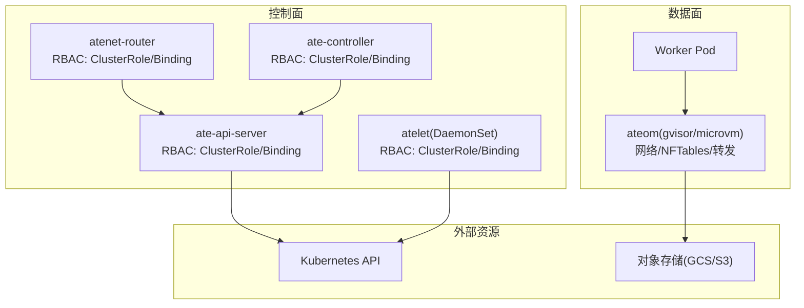
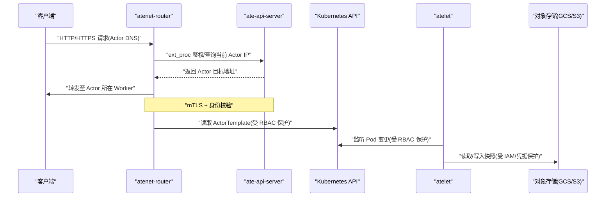
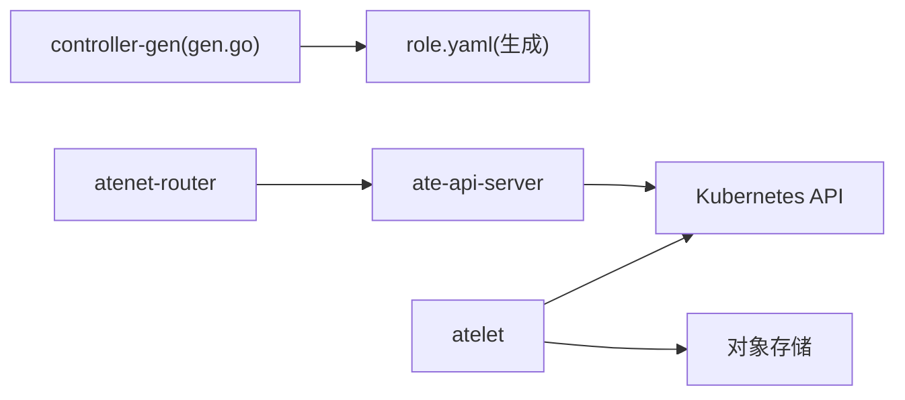

# 授权控制问题

<cite>
**本文引用的文件**   
- [README.md](file://README.md)
- [ate-api-server.yaml](file://manifests/ate-install/ate-api-server.yaml)
- [atenet-router.yaml](file://manifests/ate-install/atenet-router.yaml)
- [atelet.yaml](file://manifests/ate-install/atelet.yaml)
- [ate-controller.yaml](file://manifests/ate-install/ate-controller.yaml)
- [gen.go](file://cmd/atecontroller/internal/controllers/gen.go)
- [threat-model.md](file://docs/threat-model.md)
- [objects.go](file://cmd/atelet/internal/ategcs/objects.go)
- [s3.go](file://cmd/atelet/internal/ategcs/s3.go)
- [main.go (gvisor)](file://cmd/ateom-gvisor/main.go)
- [net.go (microvm)](file://cmd/ateom-microvm/net.go)
</cite>

## 目录
1. [简介](#简介)
2. [项目结构](#项目结构)
3. [核心组件](#核心组件)
4. [架构总览](#架构总览)
5. [详细组件分析](#详细组件分析)
6. [依赖关系分析](#依赖关系分析)
7. [性能与可用性考量](#性能与可用性考量)
8. [故障排查指南](#故障排查指南)
9. [结论](#结论)
10. [附录](#附录)

## 简介
本指南聚焦于“授权控制”相关问题的系统化排查与修复，覆盖以下关键领域：
- RBAC 配置错误诊断（角色、绑定、权限规则）
- 网络策略与跨 Pod/命名空间通信限制
- 存储权限问题（对象存储、文件系统、快照读写）
- 权限继承与传播机制的配置指导
- 具体配置示例与验证方法

本仓库在多个组件中通过 Kubernetes RBAC、服务账户、证书注入以及最小权限原则实现访问控制；同时结合威胁模型文档对内部网络、API 客户端、节点与数据面隔离提出安全基线。

## 项目结构
与授权控制直接相关的部署清单与代码位置如下：
- 控制面与系统组件的 RBAC 定义与绑定：ate-api-server、atenet-router、atelet、ate-controller
- 控制器侧 RBAC 生成脚本：controllers/gen.go
- 威胁模型与安全基线：docs/threat-model.md
- 存储访问实现（GCS/S3）：cmd/atelet/internal/ategcs/*
- 运行时网络与转发能力（gVisor/microVM）：cmd/ateom-gvisor/main.go、cmd/ateom-microvm/net.go

图表来源
- [ate-api-server.yaml:1-201](file://manifests/ate-install/ate-api-server.yaml#L1-L201)
- [atenet-router.yaml:1-216](file://manifests/ate-install/atenet-router.yaml#L1-L216)
- [atelet.yaml:1-126](file://manifests/ate-install/atelet.yaml#L1-L126)
- [ate-controller.yaml:1-100](file://manifests/ate-install/ate-controller.yaml#L1-L100)

章节来源
- [README.md:1-225](file://README.md#L1-L225)

## 核心组件
- ate-api-server：提供 gRPC API，使用 ServiceAccount 与 ClusterRole/ClusterRoleBinding 授予只读访问 Pods 与自定义 CRD 的权限。Secret 读取按租户/命名空间精细化授权。
- atenet-router：负责入站流量路由与鉴权前置检查，具备读取 ActorTemplate 等资源的权限。
- atelet：节点级守护进程，负责快照/恢复与镜像拉取，仅需要读取 Pod 列表的最小权限。
- ate-controller：协调自定义资源，其 RBAC 由 controller-gen 自动生成并输出到 manifests/ate-install/generated。

章节来源
- [ate-api-server.yaml:16-56](file://manifests/ate-install/ate-api-server.yaml#L16-L56)
- [atenet-router.yaml:15-48](file://manifests/ate-install/atenet-router.yaml#L15-L48)
- [atelet.yaml:15-44](file://manifests/ate-install/atelet.yaml#L15-L44)
- [gen.go:15-17](file://cmd/atecontroller/internal/controllers/gen.go#L15-L17)

## 架构总览
下图展示了各组件间的授权与通信路径，包括 mTLS、ServiceAccount 绑定与最小权限原则的应用点。

图表来源
- [atenet-router.yaml:102-196](file://manifests/ate-install/atenet-router.yaml#L102-L196)
- [ate-api-server.yaml:77-184](file://manifests/ate-install/ate-api-server.yaml#L77-L184)
- [atelet.yaml:66-126](file://manifests/ate-install/atelet.yaml#L66-L126)

## 详细组件分析

### RBAC 配置错误诊断
常见问题与定位要点：
- 角色缺失或动词不足：确认 ClusterRole 是否包含所需 apiGroups/resources/verbs。
- 绑定未生效：确认 ClusterRoleBinding 的 subjects 与 roleRef 指向正确的 ServiceAccount 与 Role。
- Secret 访问越权：ate-api-server 默认不授予集群级 Secret 读取，需按命名空间与 resourceNames 精细化授权。
- 控制器 RBAC 未生成：确保执行 controller-gen 生成 role.yaml 并安装。

建议验证步骤：
- 使用 kubectl auth can-i --as=system:serviceaccount:<ns>:<sa> 模拟权限。
- 查看组件日志中的认证/授权错误信息。
- 核对 manifests 中的 SA、ClusterRole、ClusterRoleBinding 三者一致性。

章节来源
- [ate-api-server.yaml:16-56](file://manifests/ate-install/ate-api-server.yaml#L16-L56)
- [atenet-router.yaml:23-48](file://manifests/ate-install/atenet-router.yaml#L23-L48)
- [atelet.yaml:22-44](file://manifests/ate-install/atelet.yaml#L22-L44)
- [gen.go:15-17](file://cmd/atecontroller/internal/controllers/gen.go#L15-L17)

### 网络策略与跨 Pod/命名空间通信限制
- 默认拒绝与最小暴露：威胁模型强调使用 NetworkPolicy 默认拒绝入站/出站，仅允许必要通信。
- 控制面隔离：避免将控制面与数据面共置，限制沙箱直接访问 API 与数据库。
- 组件间 mTLS：ate-api-server 与 atenet-router 均挂载 podCertificate，用于双向认证。
- 运行时网络转发：ateom 在 worker Pod 内启用 IPv4 转发并安装 nftables 规则，确保 actor 流量正确路由。

排查要点：
- 检查 CNI 与 NetworkPolicy 是否默认拒绝且未放行必要端口。
- 确认 ateom 是否成功启用 ip_forward 并安装规则。
- 验证 DNS 解析与 xDS 配置是否正确下发。

章节来源
- [threat-model.md:72-82](file://docs/threat-model.md#L72-L82)
- [main.go (gvisor):661-670](file://cmd/ateom-gvisor/main.go#L661-L670)
- [net.go (microvm):178-198](file://cmd/ateom-microvm/net.go#L178-L198)
- [atenet-router.yaml:186-196](file://manifests/ate-install/atenet-router.yaml#L186-L196)

### 存储权限问题（对象存储、文件系统、快照）
- 对象存储访问：atelet 通过 GCS/S3 客户端接口进行 Get/Put，需确保运行环境具备对应凭据与最小权限。
- 错误语义：S3 客户端对 NoSuchKey 等错误进行包装，便于定位“对象不存在”等问题。
- 文件系统权限：测试用例验证原子写与文件权限设置，确保身份目录不被残留临时文件污染。

排查要点：
- 检查 atelet 的凭据来源（如工作负载身份、IAM 绑定）。
- 验证 bucket/object 是否存在与可访问。
- 确认本地磁盘路径与 hostPath 卷挂载权限。

章节来源
- [objects.go:85-123](file://cmd/atelet/internal/ategcs/objects.go#L85-L123)
- [s3.go:37-58](file://cmd/atelet/internal/ategcs/s3.go#L37-L58)
- [atelet.yaml:118-126](file://manifests/ate-install/atelet.yaml#L118-L126)

### 权限继承与传播机制
- 控制器生成的 RBAC：通过 controller-gen 从源码注解生成 role.yaml，确保权限与控制器逻辑一致。
- 命名空间与资源范围：ate-api-server 的 Secret 读取采用命名空间级 Role+RoleBinding 与 resourceNames 限定，避免全局泄露。
- 证书与信任链：podCertificate 与 clusterTrustBundle 注入，确保组件间可信通信。

配置指导：
- 为每个租户/演示应用创建独立的 Namespace，并通过 Role/RoleBinding 精确授权。
- 使用 resourceNames 限制 Secret 访问范围。
- 定期重新生成并审计控制器 RBAC。

章节来源
- [gen.go:15-17](file://cmd/atecontroller/internal/controllers/gen.go#L15-L17)
- [ate-api-server.yaml:31-35](file://manifests/ate-install/ate-api-server.yaml#L31-L35)
- [ate-api-server.yaml:144-184](file://manifests/ate-install/ate-api-server.yaml#L144-L184)

## 依赖关系分析
- ate-api-server 依赖 Kubernetes API（Pods、CRDs），并使用 ServiceAccount 与 ClusterRole/Binding 获得最小权限。
- atenet-router 依赖 API 获取 Actor 状态，并通过 xDS 配置 Envoy。
- atelet 依赖宿主主机路径与对象存储后端，仅具备必要的 Pod 列表权限。
- ate-controller 依赖 controller-gen 生成的 RBAC，保证权限与控制器行为同步。

图表来源
- [gen.go:15-17](file://cmd/atecontroller/internal/controllers/gen.go#L15-L17)
- [ate-api-server.yaml:16-56](file://manifests/ate-install/ate-api-server.yaml#L16-L56)
- [atenet-router.yaml:23-48](file://manifests/ate-install/atenet-router.yaml#L23-L48)
- [atelet.yaml:22-44](file://manifests/ate-install/atelet.yaml#L22-L44)

章节来源
- [gen.go:15-17](file://cmd/atecontroller/internal/controllers/gen.go#L15-L17)
- [ate-api-server.yaml:16-56](file://manifests/ate-install/ate-api-server.yaml#L16-L56)
- [atenet-router.yaml:23-48](file://manifests/ate-install/atenet-router.yaml#L23-L48)
- [atelet.yaml:22-44](file://manifests/ate-install/atelet.yaml#L22-L44)

## 性能与可用性考量
- 最小权限减少授权失败重试与鉴权开销。
- 默认拒绝的网络策略降低误连风险，但需配合白名单提升连通性。
- 对象存储访问应使用流式上传/下载以减少内存占用。
- 组件间 mTLS 增加握手成本，但能显著提升安全性与可观测性。

## 故障排查指南

### RBAC 相关问题
- 症状：组件启动后无法读取 Pods/CRD 或报 403。
- 排查：
  - 核对 ClusterRole 的 apiGroups/resources/verbs 是否匹配。
  - 确认 ClusterRoleBinding 的 subjects 指向正确的 ServiceAccount。
  - 对于 Secret 访问，检查命名空间级 Role 与 resourceNames。
- 验证：
  - 使用 kubectl auth can-i 模拟权限。
  - 查看组件日志中的 authorization 错误。

章节来源
- [ate-api-server.yaml:16-56](file://manifests/ate-install/ate-api-server.yaml#L16-L56)
- [atenet-router.yaml:23-48](file://manifests/ate-install/atenet-router.yaml#L23-L48)
- [atelet.yaml:22-44](file://manifests/ate-install/atelet.yaml#L22-L44)

### 网络策略与路由问题
- 症状：Actor 不可达、DNS 解析异常、跨命名空间通信失败。
- 排查：
  - 检查 NetworkPolicy 是否默认拒绝且未放行必要端口。
  - 确认 ateom 已启用 IPv4 转发并安装 nftables 规则。
  - 验证 atenet-router 的 xDS 配置与 Envoy 监听端口。
- 验证：
  - 在 Worker Pod 内 ping/traceroute 目标地址。
  - 检查 CoreDNS 与 stub domain 配置。

章节来源
- [threat-model.md:72-82](file://docs/threat-model.md#L72-L82)
- [main.go (gvisor):661-670](file://cmd/ateom-gvisor/main.go#L661-L670)
- [net.go (microvm):178-198](file://cmd/ateom-microvm/net.go#L178-L198)
- [atenet-router.yaml:102-196](file://manifests/ate-install/atenet-router.yaml#L102-L196)

### 存储权限问题
- 症状：快照读取/写入失败、NoSuchKey、权限不足。
- 排查：
  - 检查 atelet 的凭据与工作负载身份绑定。
  - 确认 bucket/object 存在且可访问。
  - 验证 hostPath 卷挂载与本地文件权限。
- 验证：
  - 使用 S3/GCS CLI 以相同凭据进行读写测试。
  - 查看 atelet 日志中的对象存储错误码。

章节来源
- [objects.go:85-123](file://cmd/atelet/internal/ategcs/objects.go#L85-L123)
- [s3.go:37-58](file://cmd/atelet/internal/ategcs/s3.go#L37-L58)
- [atelet.yaml:118-126](file://manifests/ate-install/atelet.yaml#L118-L126)

### 权限继承与传播
- 症状：新租户/命名空间无法访问预期资源。
- 排查：
  - 确认已为命名空间创建 Role/RoleBinding 并指定 resourceNames。
  - 重新生成并安装控制器 RBAC。
- 验证：
  - 在新命名空间下以受限 SA 执行操作，观察是否被允许。

章节来源
- [gen.go:15-17](file://cmd/atecontroller/internal/controllers/gen.go#L15-L17)
- [ate-api-server.yaml:31-35](file://manifests/ate-install/ate-api-server.yaml#L31-L35)

## 结论
通过最小权限原则、严格的 RBAC 与 NetworkPolicy、组件间 mTLS 与凭据管理，可以显著降低授权与控制面安全风险。建议在多租户场景下采用命名空间隔离与 resourceNames 精细化授权，并结合威胁模型持续审查与加固。

## 附录

### 快速验证清单
- RBAC
  - 列出并核对 ClusterRole/Binding 与 SA 的一致性。
  - 使用 kubectl auth can-i 模拟关键操作。
- 网络
  - 检查默认拒绝策略与白名单。
  - 验证 ateom 的 ip_forward 与 nftables 规则。
- 存储
  - 使用独立凭据进行对象存储读写测试。
  - 检查 hostPath 与本地文件权限。

章节来源
- [ate-api-server.yaml:16-56](file://manifests/ate-install/ate-api-server.yaml#L16-L56)
- [atenet-router.yaml:23-48](file://manifests/ate-install/atenet-router.yaml#L23-L48)
- [atelet.yaml:22-44](file://manifests/ate-install/atelet.yaml#L22-L44)
- [objects.go:85-123](file://cmd/atelet/internal/ategcs/objects.go#L85-L123)
- [s3.go:37-58](file://cmd/atelet/internal/ategcs/s3.go#L37-L58)
- [threat-model.md:72-82](file://docs/threat-model.md#L72-L82)
