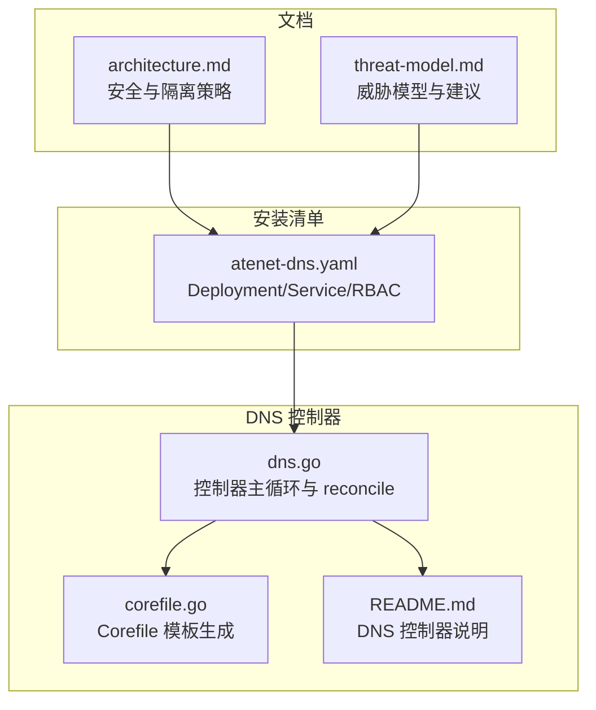
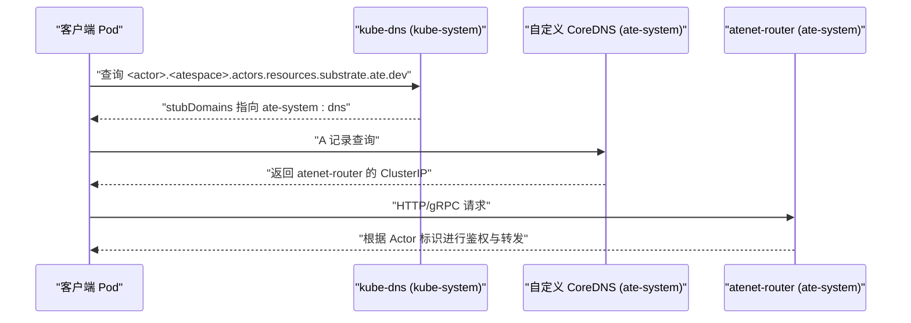
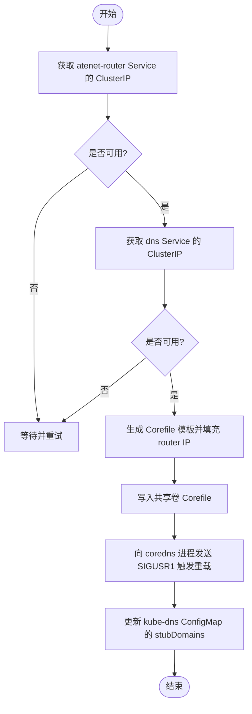
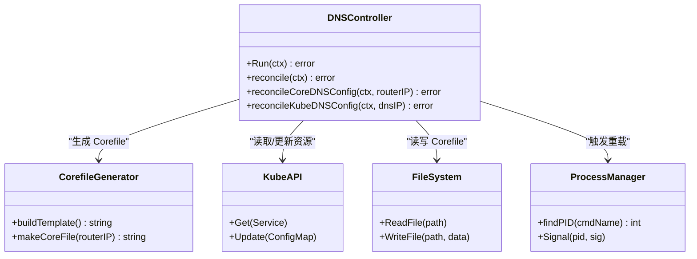

# 网络策略配置问题

<cite>
**本文引用的文件**   
- [atenet-dns.yaml](file://manifests/ate-install/atenet-dns.yaml)
- [dns.go](file://cmd/atenet/internal/dns/dns.go)
- [corefile.go](file://cmd/atenet/internal/dns/corefile.go)
- [README.md](file://cmd/atenet/internal/dns/README.md)
- [architecture.md](file://docs/architecture.md)
- [threat-model.md](file://docs/threat-model.md)
</cite>

## 目录
1. [简介](#简介)
2. [项目结构](#项目结构)
3. [核心组件](#核心组件)
4. [架构总览](#架构总览)
5. [详细组件分析](#详细组件分析)
6. [依赖关系分析](#依赖关系分析)
7. [性能与可用性考量](#性能与可用性考量)
8. [故障排查指南](#故障排查指南)
9. [结论](#结论)
10. [附录：示例与最佳实践](#附录示例与最佳实践)

## 简介
本指南聚焦于网络策略配置问题的诊断与解决，覆盖以下关键主题：
- NetworkPolicy 规则配置错误的排查步骤（入站/出站、Pod 选择器、命名空间隔离）
- DNS 解析失败的网络层原因（CoreDNS 配置、服务发现机制、跨命名空间通信限制）
- 网络连通性测试方法与工具使用指导
- 具体的网络策略配置示例与最佳实践

本项目在安全与隔离层面采用“纵深防御”模型，并明确利用 Kubernetes NetworkPolicy 进行连接控制。同时，系统通过自定义 CoreDNS 控制器实现 Actor 的域名解析到路由器 Service 地址，从而完成请求路由与身份识别。

## 项目结构
与网络策略和 DNS 相关的核心资源与代码分布如下：
- 安装清单：包含自定义 CoreDNS 部署、Service、RBAC 等
- DNS 控制器：负责生成 CoreDNS 配置、更新 kube-dns stubDomains、动态重载 CoreDNS
- 文档：阐述安全与隔离策略、威胁模型及建议

图表来源
- [atenet-dns.yaml:1-176](file://manifests/ate-install/atenet-dns.yaml#L1-L176)
- [dns.go:1-253](file://cmd/atenet/internal/dns/dns.go#L1-L253)
- [corefile.go:1-65](file://cmd/atenet/internal/dns/corefile.go#L1-L65)
- [README.md:1-37](file://cmd/atenet/internal/dns/README.md#L1-L37)
- [architecture.md:480-494](file://docs/architecture.md#L480-L494)
- [threat-model.md:60-141](file://docs/threat-model.md#L60-L141)

章节来源
- [architecture.md:480-494](file://docs/architecture.md#L480-L494)
- [threat-model.md:60-141](file://docs/threat-model.md#L60-L141)

## 核心组件
- 自定义 CoreDNS 部署与 Service：提供 DNS 服务，监听 53 UDP/TCP，并通过健康检查探针保障可用性
- DNS 控制器：周期性获取 atenet-router 与 dns 服务的 ClusterIP，生成 CoreDNS Corefile，写入共享卷，并向 CoreDNS 进程发送信号触发热重载；同时更新 kube-system 中 kube-dns ConfigMap 的 stubDomains，使集群内 Pod 能解析 Actor 域名
- 安全与隔离策略：基于 Kubernetes NetworkPolicy 在 WorkerPool 边界限制入站/出站流量；威胁模型强调默认拒绝、最小暴露、mTLS 等原则

章节来源
- [atenet-dns.yaml:74-176](file://manifests/ate-install/atenet-dns.yaml#L74-L176)
- [dns.go:50-117](file://cmd/atenet/internal/dns/dns.go#L50-L117)
- [corefile.go:25-65](file://cmd/atenet/internal/dns/corefile.go#L25-L65)
- [architecture.md:487-490](file://docs/architecture.md#L487-L490)
- [threat-model.md:98-108](file://docs/threat-model.md#L98-L108)

## 架构总览
下图展示了 DNS 解析与路由的关键流程：客户端 Pod 查询 Actor 域名，由 kube-dns 将子域转发至 ate-system 中的自定义 CoreDNS，后者返回 atenet-router 的 ClusterIP，随后流量进入路由器进行身份识别与转发。

图表来源
- [dns.go:71-117](file://cmd/atenet/internal/dns/dns.go#L71-L117)
- [corefile.go:32-65](file://cmd/atenet/internal/dns/corefile.go#L32-L65)
- [README.md:18-37](file://cmd/atenet/internal/dns/README.md#L18-L37)

## 详细组件分析

### DNS 控制器与 CoreDNS 配置
- 控制器职责
  - 获取 atenet-router 与 dns 服务的 ClusterIP
  - 生成 CoreDNS Corefile（启用 log/errors/health/ready/reload 插件，并为 Actor 域名模式添加 template 匹配与 answer）
  - 将 Corefile 写入共享卷，向 coredns 进程发送 SIGUSR1 触发热重载
  - 更新 kube-system:kube-dns ConfigMap 的 stubDomains，将 Actor 域名后缀指向 ate-system:dns 的 ClusterIP
- 关键实现要点
  - 若 atenet-router 或 dns 服务尚未就绪，控制器会跳过并重试
  - 若 kube-dns ConfigMap 不存在，控制器会记录警告并跳过更新
  - Corefile 模板以 ActorDNSSuffix 为 zone，match 正则匹配 <actor>.<atespace>.<suffix>，answer 返回 router IP

图表来源
- [dns.go:71-117](file://cmd/atenet/internal/dns/dns.go#L71-L117)
- [dns.go:119-141](file://cmd/atenet/internal/dns/dns.go#L119-L141)
- [dns.go:143-189](file://cmd/atenet/internal/dns/dns.go#L143-L189)
- [corefile.go:32-65](file://cmd/atenet/internal/dns/corefile.go#L32-L65)

章节来源
- [dns.go:50-117](file://cmd/atenet/internal/dns/dns.go#L50-L117)
- [dns.go:119-189](file://cmd/atenet/internal/dns/dns.go#L119-L189)
- [corefile.go:25-65](file://cmd/atenet/internal/dns/corefile.go#L25-L65)
- [README.md:18-37](file://cmd/atenet/internal/dns/README.md#L18-L37)

### 安装清单与运行态资源
- Deployment 与容器
  - init-dns：初始化 Corefile（仅基础 health/ready/reload）
  - coredns：监听 53 UDP/TCP，挂载共享卷读取 Corefile
  - dns-controller：运行 DNS 控制器逻辑，参数包括日志级别、轮询间隔、Corefile 路径
- Service
  - ClusterIP 类型，端口 53 UDP/TCP，标签 app=dns
- RBAC
  - 在 ate-system 与 kube-system 命名空间下授予对 services 与 configmaps 的 get/list/watch/create/update/patch 权限

章节来源
- [atenet-dns.yaml:15-73](file://manifests/ate-install/atenet-dns.yaml#L15-L73)
- [atenet-dns.yaml:74-158](file://manifests/ate-install/atenet-dns.yaml#L74-L158)
- [atenet-dns.yaml:159-176](file://manifests/ate-install/atenet-dns.yaml#L159-L176)

## 依赖关系分析
- DNS 控制器依赖
  - Kubernetes API：获取 Service（atenet-router、dns）、读写 ConfigMap（kube-system:kube-dns）
  - 文件系统：共享卷路径用于持久化 Corefile
  - 进程管理：通过 /proc 查找 coredns PID 并发送信号
- 外部依赖
  - kube-dns：需存在且可写 ConfigMap，以便注入 stubDomains
  - atenet-router：必须存在且具备 ClusterIP，否则无法生成有效的 Corefile

图表来源
- [dns.go:42-117](file://cmd/atenet/internal/dns/dns.go#L42-L117)
- [dns.go:119-189](file://cmd/atenet/internal/dns/dns.go#L119-L189)
- [corefile.go:25-65](file://cmd/atenet/internal/dns/corefile.go#L25-L65)

章节来源
- [dns.go:42-117](file://cmd/atenet/internal/dns/dns.go#L42-L117)
- [dns.go:119-189](file://cmd/atenet/internal/dns/dns.go#L119-L189)
- [corefile.go:25-65](file://cmd/atenet/internal/dns/corefile.go#L25-L65)

## 性能与可用性考量
- 控制器轮询间隔：可通过参数调整，避免过于频繁地读写 API 与文件系统
- Corefile 变更检测：仅在内容变化时写入并触发重载，减少不必要的重启
- 健康与就绪探针：CoreDNS 暴露 /health 与 /ready，便于编排系统判断服务状态
- 容错处理：当 atenet-router 或 dns 服务未就绪、kube-dns ConfigMap 缺失时，控制器会记录警告并跳过，保证稳定性

章节来源
- [atenet-dns.yaml:127-144](file://manifests/ate-install/atenet-dns.yaml#L127-L144)
- [dns.go:71-117](file://cmd/atenet/internal/dns/dns.go#L71-L117)
- [dns.go:119-141](file://cmd/atenet/internal/dns/dns.go#L119-L141)
- [dns.go:143-189](file://cmd/atenet/internal/dns/dns.go#L143-L189)

## 故障排查指南

### 一、NetworkPolicy 配置错误排查
- 常见症状
  - 同一命名空间内 Pod 间无法通信
  - 跨命名空间访问被阻断
  - 出站访问受限导致无法访问外部服务或集群内部服务
- 排查步骤
  - 确认是否启用了默认拒绝策略（Ingress/Egress 默认 deny），再逐步放开必要规则
  - 检查 Pod 选择器（podSelector）是否正确匹配目标 Pod 的标签
  - 检查命名空间选择器（namespaceSelector）是否允许来自特定命名空间的流量
  - 校验协议与端口（TCP/UDP、端口号）是否与业务一致
  - 验证 Ingress/Egress 方向是否符合预期（入站 vs 出站）
  - 结合威胁模型与安全架构文档，确保遵循最小暴露原则
- 参考依据
  - 架构文档指出使用 Kubernetes NetworkPolicy 在 WorkerPool 边界限制入站/出站流量
  - 威胁模型强调默认拒绝、最小暴露、同步策略与生命周期一致性

章节来源
- [architecture.md:487-490](file://docs/architecture.md#L487-L490)
- [threat-model.md:98-108](file://docs/threat-model.md#L98-L108)

### 二、DNS 解析失败的网络层原因
- 可能原因
  - kube-dns 的 stubDomains 未正确指向 ate-system:dns
  - atenet-router Service 尚未分配 ClusterIP，导致 Corefile 无法生成有效答案
  - dns Service 未就绪或不可达
  - CoreDNS 未成功重载新配置
- 定位方法
  - 查看 DNS 控制器日志，确认是否报告 atenet-router 或 dns 服务未就绪
  - 检查 kube-system:kube-dns ConfigMap 的 stubDomains 字段是否包含 Actor 域名后缀并指向 ate-system:dns 的 ClusterIP
  - 验证 ate-system:dns Service 的 ClusterIP 与端口可达
  - 确认 CoreDNS 健康与就绪探针正常
- 参考实现
  - 控制器在 reconcile 中依次获取 atenet-router 与 dns 服务 ClusterIP，生成 Corefile 并更新 kube-dns ConfigMap
  - Corefile 模板为 Actor 域名模式添加 template 匹配与 answer 返回 router IP

章节来源
- [dns.go:71-117](file://cmd/atenet/internal/dns/dns.go#L71-L117)
- [dns.go:143-189](file://cmd/atenet/internal/dns/dns.go#L143-L189)
- [corefile.go:32-65](file://cmd/atenet/internal/dns/corefile.go#L32-L65)
- [README.md:18-37](file://cmd/atenet/internal/dns/README.md#L18-L37)

### 三、网络连通性测试方法与工具
- 基本连通性
  - 在 Pod 中使用 nslookup 或 dig 查询 Actor 域名，确认返回 atenet-router 的 ClusterIP
  - 使用 curl 或 grpcurl 访问 atenet-router 对应端口，验证 HTTP/gRPC 连通性
- 分层诊断
  - 网络层：ping/traceroute（注意部分环境禁用 ICMP）
  - 传输层：telnet/nc 探测 TCP 端口
  - 应用层：按协议构造请求并观察响应
- 注意事项
  - 某些云环境或 CNI 可能限制 ICMP，优先使用 TCP/UDP 探测
  - 若启用 mTLS，需确保证书链与 SAN 配置正确

[本节为通用指导，不直接分析具体文件]

## 结论
- 网络策略应以默认拒绝为基础，按需放行，严格限定入站/出站、协议与端口，并结合 Pod/命名空间选择器精准控制
- DNS 解析链路依赖 kube-dns stubDomains 与自定义 CoreDNS 协同工作，控制器负责维持配置一致性与热重载
- 故障排查应围绕服务就绪状态、配置一致性、探针与健康检查展开，结合日志与资源状态快速定位问题
- 安全方面遵循最小暴露与零信任原则，配合 mTLS 与身份感知路由，降低横向移动风险

[本节为总结性内容，不直接分析具体文件]

## 附录：示例与最佳实践

### 一、NetworkPolicy 示例（概念性）
- 默认拒绝所有入站与出站
- 允许同命名空间内特定标签 Pod 之间的双向通信
- 允许访问 kube-system 中的 DNS 服务（ClusterIP 与端口）
- 允许访问 ate-system 中的 atenet-router 服务（ClusterIP 与端口）
- 允许访问必要的后端数据库或服务（按最小权限原则）

[本节为概念性示例，不直接分析具体文件]

### 二、DNS 配置最佳实践
- 确保 kube-dns ConfigMap 的 stubDomains 包含 Actor 域名后缀并指向 ate-system:dns
- 定期校验 atenet-router 与 dns 服务的 ClusterIP 是否稳定
- 监控 CoreDNS 健康与就绪探针，确保热重载生效
- 在威胁模型指导下，限制对 DNS 配置的访问权限，仅授权控制器更新

章节来源
- [dns.go:143-189](file://cmd/atenet/internal/dns/dns.go#L143-L189)
- [corefile.go:32-65](file://cmd/atenet/internal/dns/corefile.go#L32-L65)
- [threat-model.md:90-92](file://docs/threat-model.md#L90-L92)
