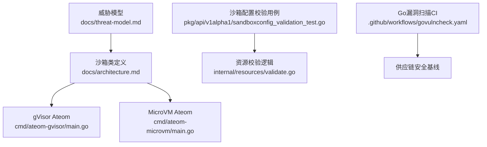
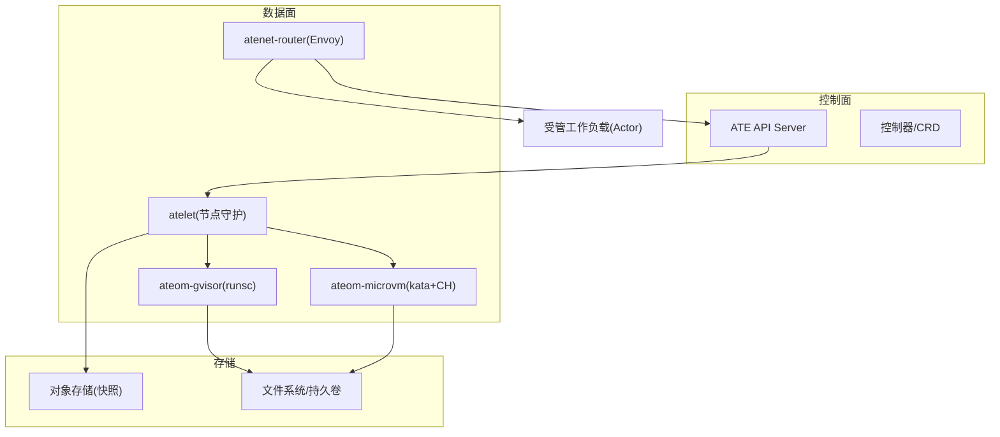
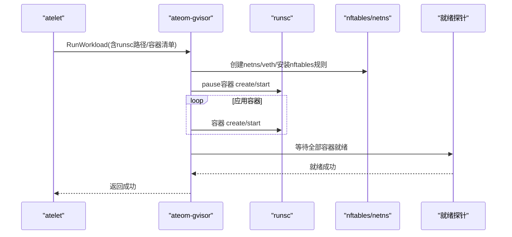
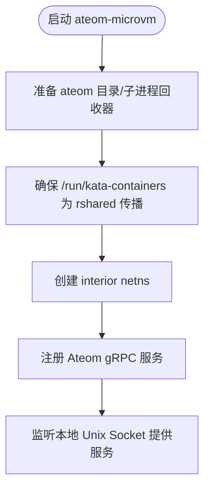
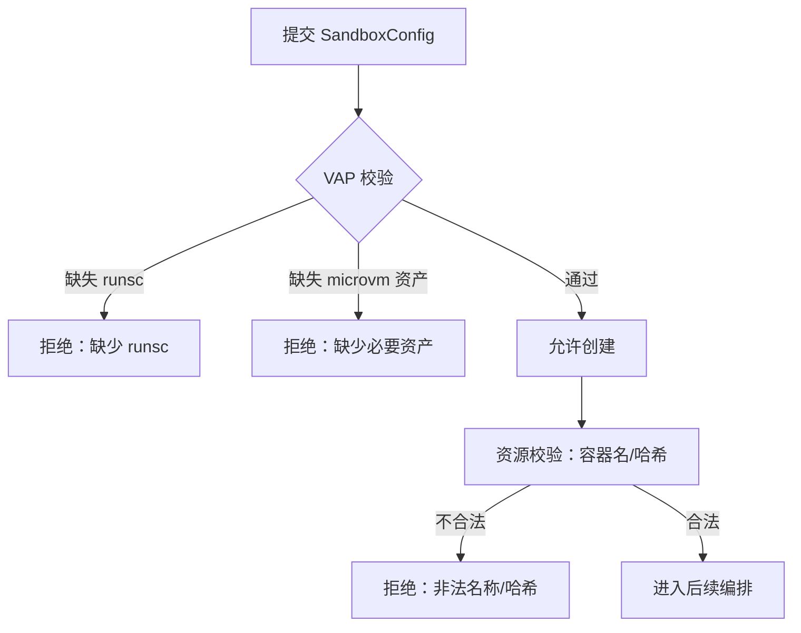
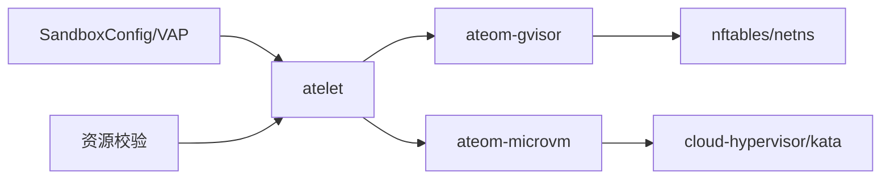

# 漏洞检测和防护

<cite>
**本文引用的文件**   
- [README.md](file://README.md)
- [威胁模型.md](file://docs/threat-model.md)
- [架构说明.md](file://docs/architecture.md)
- [ateom-gvisor主程序.go](file://cmd/ateom-gvisor/main.go)
- [ateom-microvm主程序.go](file://cmd/ateom-microvm/main.go)
- [沙箱配置验证测试.go](file://pkg/api/v1alpha1/sandboxconfig_validation_test.go)
- [资源校验.go](file://internal/resources/validate.go)
- [govulncheck工作流.yaml](file://.github/workflows/govulncheck.yaml)
</cite>

## 目录
1. [引言](#引言)
2. [项目结构](#项目结构)
3. [核心组件](#核心组件)
4. [架构总览](#架构总览)
5. [详细组件分析](#详细组件分析)
6. [依赖关系分析](#依赖关系分析)
7. [性能与可观测性考虑](#性能与可观测性考虑)
8. [故障排查指南](#故障排查指南)
9. [结论](#结论)
10. [附录](#附录)

## 引言
本文件围绕“潜在安全漏洞的检测与防护”展开，聚焦以下目标：
- 沙箱逃逸攻击检测：gVisor/MicroVM边界突破、系统调用滥用、内核漏洞利用的识别方法。
- 容器镜像安全扫描：CVE漏洞检测、恶意软件扫描、配置安全检查的实施路径。
- 运行时威胁检测：异常行为识别、内存注入检测、进程劫持防护方案。
- 安全加固配置建议与最佳实践。
- 漏洞修复与安全补丁管理流程。

本仓库在威胁建模、沙箱实现（gVisor与microVM）、资源校验与CI漏洞扫描等方面提供了可直接落地的工程基础。

## 项目结构
从安全视角看，关键目录与职责如下：
- docs/threat-model.md：系统化威胁建模与缓解策略，覆盖外部网络、内部网络、误配风险、来自Actor的攻击、节点攻击、内部人员攻击以及检测与响应。
- docs/architecture.md：沙箱类别与运行期快照/恢复机制说明，明确gVisor与microVM两类沙箱类。
- cmd/ateom-gvisor：gVisor实现的Ateom服务，负责runsc生命周期、网络隔离、快照/恢复等。
- cmd/ateom-microvm：kata+cloud-hypervisor实现的Ateom服务，提供微VM级隔离与快照/恢复。
- pkg/api/v1alpha1/sandboxconfig_validation_test.go：沙箱配置VAP校验用例，确保关键资产（如runsc）完整性与必填项。
- internal/resources/validate.go：对容器名、runsc哈希等进行强校验，防止路径穿越与非法二进制执行。
- .github/workflows/govulncheck.yaml：Go依赖漏洞扫描流水线。

图表来源
- [威胁模型.md:1-141](file://docs/threat-model.md#L1-L141)
- [架构说明.md:335-341](file://docs/architecture.md#L335-L341)
- [ateom-gvisor主程序.go:1-800](file://cmd/ateom-gvisor/main.go#L1-L800)
- [ateom-microvm主程序.go:1-226](file://cmd/ateom-microvm/main.go#L1-L226)
- [沙箱配置验证测试.go:87-175](file://pkg/api/v1alpha1/sandboxconfig_validation_test.go#L87-L175)
- [资源校验.go:110-148](file://internal/resources/validate.go#L110-L148)
- [govulncheck工作流.yaml:1-34](file://.github/workflows/govulncheck.yaml#L1-L34)

章节来源
- [威胁模型.md:1-141](file://docs/threat-model.md#L1-L141)
- [架构说明.md:335-341](file://docs/architecture.md#L335-L341)
- [README.md:1-225](file://README.md#L1-L225)

## 核心组件
- 威胁模型与缓解策略：定义了从外部网络到内部网络、误配、Actor侧、节点侧、内部人员等多维威胁面，并给出“缓解不变量”和具体落地建议，包括mTLS、最小权限、默认拒绝、审计日志、动态隔离等。
- gVisor Ateom：通过runsc创建/启动/检查点/恢复容器树；建立独立网络命名空间与veth对；安装nftables规则进行NAT与转发；等待就绪探针完成流量接入。
- MicroVM Ateom：基于kata+cloud-hypervisor，提供更强隔离；支持快照/恢复；维护挂载传播与网络命名空间。
- 沙箱配置校验：强制要求关键资产（如runsc）存在且完整，缺失或格式错误将被拒绝。
- 资源校验：严格校验容器名与runsc SHA-256，避免路径穿越与任意二进制执行。
- CI漏洞扫描：定期扫描Go依赖漏洞，形成供应链安全基线。

章节来源
- [威胁模型.md:93-141](file://docs/threat-model.md#L93-L141)
- [ateom-gvisor主程序.go:180-437](file://cmd/ateom-gvisor/main.go#L180-L437)
- [ateom-microvm主程序.go:184-226](file://cmd/ateom-microvm/main.go#L184-L226)
- [沙箱配置验证测试.go:87-175](file://pkg/api/v1alpha1/sandboxconfig_validation_test.go#L87-L175)
- [资源校验.go:110-148](file://internal/resources/validate.go#L110-L148)
- [govulncheck工作流.yaml:1-34](file://.github/workflows/govulncheck.yaml#L1-L34)

## 架构总览
下图展示与漏洞检测/防护相关的关键交互：控制面、数据面、沙箱边界、网络与存储。

图表来源
- [威胁模型.md:33-51](file://docs/threat-model.md#L33-L51)
- [架构说明.md:335-341](file://docs/architecture.md#L335-L341)
- [ateom-gvisor主程序.go:180-437](file://cmd/ateom-gvisor/main.go#L180-L437)
- [ateom-microvm主程序.go:184-226](file://cmd/ateom-microvm/main.go#L184-L226)

## 详细组件分析

### 组件A：gVisor Ateom（runsc）安全关键点
- 网络隔离：为每个激活创建独立netns与veth对，仅暴露必要端口；通过nftables实施NAT与转发，清理时删除整表，避免残留规则。
- 生命周期串行化：RPC加锁，避免并发导致状态不一致。
- 就绪探测：等待所有容器readyz返回成功后再放通流量，降低未就绪导致的误路由风险。
- 快照/恢复：区分FULL与DATA范围，先写快照再清理容器，失败路径具备幂等清理。

图表来源
- [ateom-gvisor主程序.go:180-237](file://cmd/ateom-gvisor/main.go#L180-L237)
- [ateom-gvisor主程序.go:439-521](file://cmd/ateom-gvisor/main.go#L439-L521)
- [ateom-gvisor主程序.go:672-771](file://cmd/ateom-gvisor/main.go#L672-L771)

章节来源
- [ateom-gvisor主程序.go:180-437](file://cmd/ateom-gvisor/main.go#L180-L437)
- [ateom-gvisor主程序.go:439-521](file://cmd/ateom-gvisor/main.go#L439-L521)
- [ateom-gvisor主程序.go:672-771](file://cmd/ateom-gvisor/main.go#L672-L771)

### 组件B：MicroVM Ateom（kata+cloud-hypervisor）安全关键点
- 更强的隔离边界：以微VM承载工作负载，减少共享内核带来的逃逸面。
- 挂载传播：确保kata virtio-fs所需的rshared传播生效，避免根文件系统不可见。
- 日志与追踪：与gVisor一致的JSON结构化日志与OpenTelemetry集成，便于统一取证。
- 快照/恢复：通过底层VMM能力实现内存快照与按需恢复。

图表来源
- [ateom-microvm主程序.go:73-154](file://cmd/ateom-microvm/main.go#L73-L154)
- [ateom-microvm主程序.go:156-182](file://cmd/ateom-microvm/main.go#L156-L182)

章节来源
- [ateom-microvm主程序.go:73-154](file://cmd/ateom-microvm/main.go#L73-L154)
- [ateom-microvm主程序.go:156-182](file://cmd/ateom-microvm/main.go#L156-L182)

### 组件C：沙箱配置与资源校验（防逃逸/防越权）
- 沙箱配置VAP校验：强制gVisor必须包含runsc资产；microVM需包含完整资产集；缺失或格式错误直接拒绝。
- 资源校验：容器名必须符合DNS-1123且不重复，禁止使用保留名“pause”；runsc SHA-256必须为64位十六进制，防止路径穿越与任意二进制执行。

图表来源
- [沙箱配置验证测试.go:87-175](file://pkg/api/v1alpha1/sandboxconfig_validation_test.go#L87-L175)
- [资源校验.go:110-148](file://internal/resources/validate.go#L110-L148)

章节来源
- [沙箱配置验证测试.go:87-175](file://pkg/api/v1alpha1/sandboxconfig_validation_test.go#L87-L175)
- [资源校验.go:110-148](file://internal/resources/validate.go#L110-L148)

### 组件D：供应链安全（Go依赖漏洞扫描）
- 通过GitHub Actions周期性执行govulncheck，扫描Go模块依赖中的已知漏洞，作为持续集成门禁的一部分。

章节来源
- [govulncheck工作流.yaml:1-34](file://.github/workflows/govulncheck.yaml#L1-L34)

## 依赖关系分析
- 组件耦合：
  - ateom-gvisor/microvm均实现统一的Ateom gRPC接口，由atelet驱动。
  - nftables/netns是gVisor路径的网络边界控制点。
  - 沙箱配置与资源校验位于控制面，影响数据面能否拉起正确版本与资产的沙箱。
- 外部依赖：
  - kata+cloud-hypervisor（microVM）。
  - runsc（gVisor）。
  - OpenTelemetry用于分布式追踪。
- 潜在循环依赖：当前未见明显循环；Ateom服务间无相互调用。

图表来源
- [威胁模型.md:33-51](file://docs/threat-model.md#L33-L51)
- [架构说明.md:335-341](file://docs/architecture.md#L335-L341)
- [ateom-gvisor主程序.go:180-437](file://cmd/ateom-gvisor/main.go#L180-L437)
- [ateom-microvm主程序.go:184-226](file://cmd/ateom-microvm/main.go#L184-L226)

章节来源
- [威胁模型.md:33-51](file://docs/threat-model.md#L33-L51)
- [架构说明.md:335-341](file://docs/architecture.md#L335-L341)

## 性能与可观测性考虑
- 可观测性：两个Ateom实现均启用OpenTelemetry Tracing，结合JSON结构化日志，便于定位问题与取证。
- 性能权衡：gVisor轻量但共享内核；microVM隔离更强但开销更高。根据业务SLA选择合适沙箱类。
- 网络路径：gVisor路径通过nftables做NAT/转发，注意规则数量与匹配效率；未来可演进为更细粒度的默认拒绝策略。

章节来源
- [ateom-gvisor主程序.go:97-104](file://cmd/ateom-gvisor/main.go#L97-L104)
- [ateom-microvm主程序.go:84-91](file://cmd/ateom-microvm/main.go#L84-L91)
- [威胁模型.md:72-92](file://docs/threat-model.md#L72-L92)

## 故障排查指南
- 无法拉取/执行runsc或microVM资产：检查SandboxConfig是否满足VAP校验（必需资产、URL与SHA-256格式），确认下载与缓存目录权限。
- 网络不通：核对nftables表是否存在、veth对是否创建、forward链策略是否正确；确认IPv4转发已开启。
- 就绪失败：检查各容器readyz端点可达性与健康状态。
- 快照/恢复异常：确认快照范围（FULL/DATA）与对应步骤顺序；失败路径应能幂等清理。

章节来源
- [沙箱配置验证测试.go:87-175](file://pkg/api/v1alpha1/sandboxconfig_validation_test.go#L87-L175)
- [ateom-gvisor主程序.go:439-521](file://cmd/ateom-gvisor/main.go#L439-L521)
- [ateom-gvisor主程序.go:672-771](file://cmd/ateom-gvisor/main.go#L672-L771)
- [ateom-gvisor主程序.go:239-307](file://cmd/ateom-gvisor/main.go#L239-L307)

## 结论
本项目在威胁建模、沙箱实现、资源校验与CI漏洞扫描方面形成了闭环的安全基线。针对沙箱逃逸、系统调用滥用、内核漏洞利用、镜像供应链风险与运行时威胁，可通过“强隔离+最小权限+默认拒绝+审计与可观测性+持续扫描”的组合策略有效降低风险。建议在后续迭代中完善默认拒绝网络策略、强化快照完整性校验与凭证最小化暴露，并将检测与响应能力进一步产品化。

## 附录

### 沙箱逃逸攻击检测与防护要点
- gVisor/MicroVM边界突破
  - 检测：监控异常系统调用序列、跨命名空间访问、非预期挂载/设备打开、异常网络拓扑变化。
  - 防护：优先采用microVM；若用gVisor，限制directfs/sentry能力，启用Seccomp，将sentry置于用户命名空间并使用pivot_root缩小可见文件系统。
- 系统调用滥用
  - 检测：对危险syscall（如ptrace、mount、unshare、setns等）进行白名单/黑名单过滤与告警。
  - 防护：在沙箱层配置最小syscall集；在宿主机侧通过eBPF/auditd采集异常模式。
- 内核漏洞利用
  - 检测：关注内核panic、oom、cgroup异常、特权提升事件；结合内核态遥测与用户态行为关联。
  - 防护：及时升级内核与沙箱运行时；对高危漏洞制定快速回滚与热补丁流程。

章节来源
- [威胁模型.md:93-117](file://docs/threat-model.md#L93-L117)

### 容器镜像安全扫描实施方案
- CVE漏洞检测：在构建阶段与CI中集成镜像扫描（如Trivy、Grype），阻断高危漏洞镜像入仓。
- 恶意软件扫描：引入静态反病毒/启发式扫描，结合签名与白名单机制。
- 配置安全检查：对Dockerfile/OCI配置进行合规检查（如非root运行、禁用危险capabilities、最小镜像等）。
- 供应链治理：固定依赖版本与哈希，配合govulncheck与SBOM生成。

章节来源
- [govulncheck工作流.yaml:1-34](file://.github/workflows/govulncheck.yaml#L1-L34)
- [威胁模型.md:84-92](file://docs/threat-model.md#L84-L92)

### 运行时威胁检测技术方案
- 异常行为识别：基于eBPF/auditd收集系统调用、文件、网络、进程族谱，结合规则与机器学习进行异常评分。
- 内存注入检测：监控可疑写入目标（/proc/<pid>/mem、ptrace attach）、异常映射区域、非预期库加载。
- 进程劫持防护：限制ptrace、seccomp严格模式、只读根文件系统、最小能力集；对关键进程启用完整性保护。

章节来源
- [威胁模型.md:134-141](file://docs/threat-model.md#L134-L141)

### 安全加固配置建议与最佳实践
- 网络：默认拒绝所有跨Actor通信；按生命周期同步网络策略；对外部入口启用身份感知WAF与mTLS。
- 身份与授权：组件间mTLS；最小权限原则；禁止Actor自修改资源；对敏感标签更新单独授权。
- 存储与快照：仅允许受控组件访问快照；对快照进行完整性校验与信封加密；避免在快照中持久化敏感凭据。
- 资源配额与限流：对API与代理层实施配额与速率限制，抑制DoS与分叉炸弹。

章节来源
- [威胁模型.md:72-117](file://docs/threat-model.md#L72-L117)

### 漏洞修复与安全补丁管理流程
- 发现：CI govulncheck、镜像扫描、运行时告警、第三方公告。
- 评估：依据CVSS与业务影响分级；确定修复窗口与回滚策略。
- 修复：最小变更原则，优先升级依赖/镜像；必要时打热补丁。
- 验证：回归测试、安全扫描复测、灰度发布。
- 发布与回滚：变更审批、版本标记、一键回滚；审计记录留存。

章节来源
- [威胁模型.md:134-141](file://docs/threat-model.md#L134-L141)
- [govulncheck工作流.yaml:1-34](file://.github/workflows/govulncheck.yaml#L1-L34)
