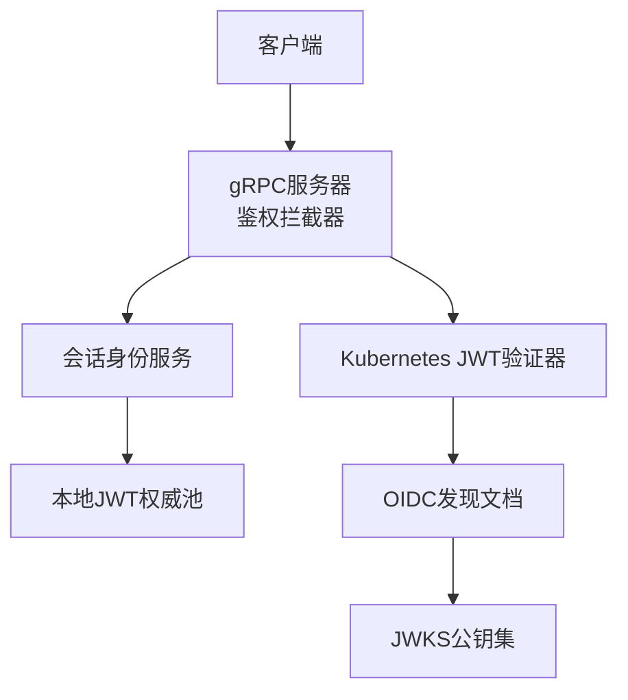
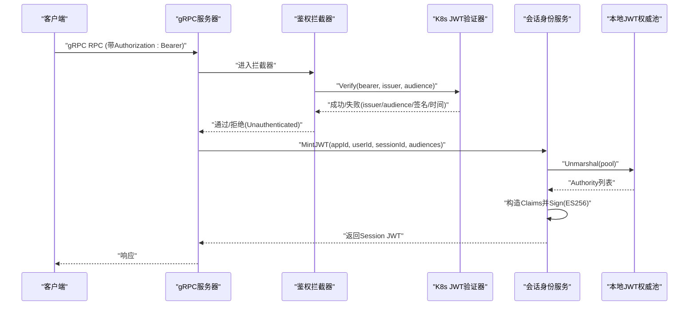
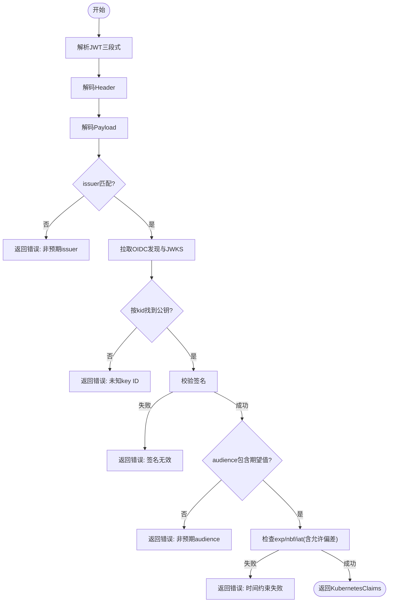
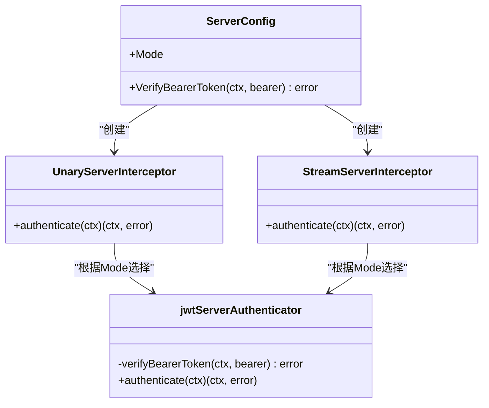
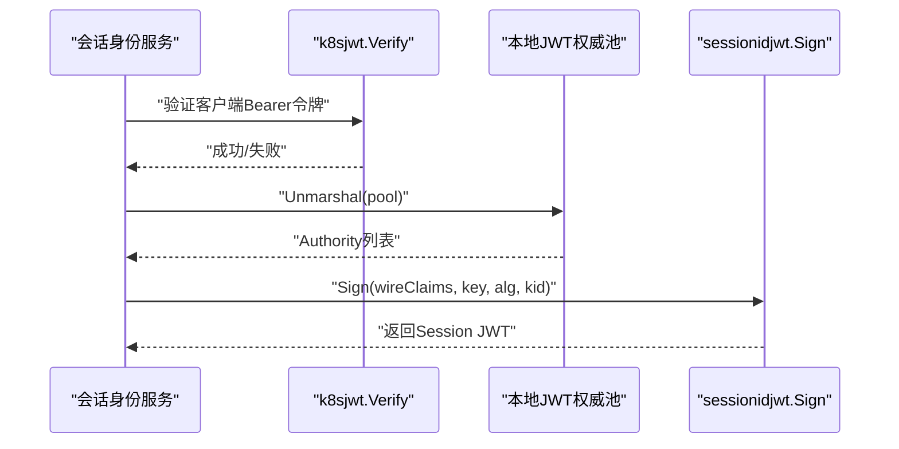
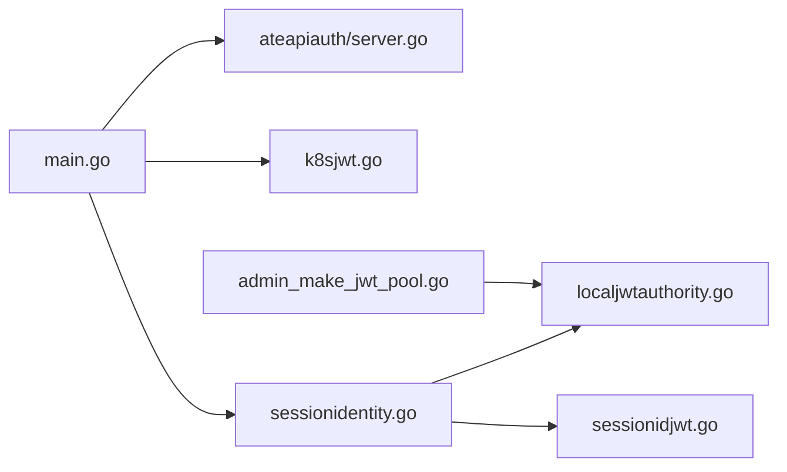

# JWT令牌问题排查

<cite>
**本文引用的文件**   
- [cmd/ateapi/main.go](file://cmd/ateapi/main.go)
- [internal/ateapiauth/server.go](file://internal/ateapiauth/server.go)
- [cmd/ateapi/internal/k8sjwt/k8sjwt.go](file://cmd/ateapi/internal/k8sjwt/k8sjwt.go)
- [cmd/ateapi/internal/sessionidentity/sessionidentity.go](file://cmd/ateapi/internal/sessionidentity/sessionidentity.go)
- [cmd/ateapi/internal/sessionidjwt/sessionidjwt.go](file://cmd/ateapi/internal/sessionidjwt/sessionidjwt.go)
- [internal/localjwtauthority/localjwtauthority.go](file://internal/localjwtauthority/localjwtauthority.go)
- [cmd/kubectl-ate/internal/cmd/admin_make_jwt_pool.go](file://cmd/kubectl-ate/internal/cmd/admin_make_jwt_pool.go)
- [manifests/ate-install/ate-api-server.yaml](file://manifests/ate-install/ate-api-server.yaml)
</cite>

## 目录
1. [简介](#简介)
2. [项目结构](#项目结构)
3. [核心组件](#核心组件)
4. [架构总览](#架构总览)
5. [详细组件分析](#详细组件分析)
6. [依赖关系分析](#依赖关系分析)
7. [性能与可用性考虑](#性能与可用性考虑)
8. [故障排查指南](#故障排查指南)
9. [结论](#结论)
10. [附录：配置示例与最佳实践](#附录配置示例与最佳实践)

## 简介
本指南聚焦于JWT令牌认证失败的诊断与解决方法，覆盖以下关键场景：
- 令牌过期验证失败（有效期、时钟同步）
- 令牌签名不匹配（密钥配置错误、签名算法不兼容、密钥轮换）
- 权限不足（RBAC配置、角色绑定、命名空间权限）
并提供日志分析方法、调试工具使用建议以及常见配置与最佳实践。

## 项目结构
与JWT认证相关的关键代码分布在以下模块：
- gRPC服务端入口与拦截器：负责鉴权模式选择、Bearer令牌校验
- Kubernetes JWT验证器：基于OIDC发现与JWKS进行签名验证与时序检查
- 会话身份服务：签发会话JWT（Session JWT），加载本地JWT签名密钥池
- 本地JWT权威库：生成/序列化/反序列化私钥池
- kubectl子命令：生成并注入JWT权威池到Secret
- 安装清单：定义RBAC与部署资源

图表来源
- [cmd/ateapi/main.go:171-196](file://cmd/ateapi/main.go#L171-L196)
- [internal/ateapiauth/server.go:81-103](file://internal/ateapiauth/server.go#L81-L103)
- [cmd/ateapi/internal/k8sjwt/k8sjwt.go:128-261](file://cmd/ateapi/internal/k8sjwt/k8sjwt.go#L128-L261)
- [cmd/ateapi/internal/sessionidentity/sessionidentity.go:71-142](file://cmd/ateapi/internal/sessionidentity/sessionidentity.go#L71-L142)
- [internal/localjwtauthority/localjwtauthority.go:76-101](file://internal/localjwtauthority/localjwtauthority.go#L76-L101)

章节来源
- [cmd/ateapi/main.go:171-196](file://cmd/ateapi/main.go#L171-L196)
- [internal/ateapiauth/server.go:81-103](file://internal/ateapiauth/server.go#L81-L103)

## 核心组件
- gRPC鉴权拦截器
  - 支持mtls与jwt两种模式；在jwt模式下要求每个RPC携带Authorization: Bearer <SA token>
  - 通过VerifyBearerToken回调调用k8sjwt.Verify完成校验
- Kubernetes JWT验证器
  - 解析Header/Payload，按kid从JWKS选取公钥，校验签名
  - 校验issuer、audience、exp/nbf/iat时间约束（含允许的时间偏差）
- 会话身份服务
  - 校验客户端传入的K8s SA Bearer令牌后，签发会话JWT（包含自定义claims）
  - 从本地JWT权威池读取私钥进行签名
- 本地JWT权威库
  - 提供私钥池的序列化和反序列化，支持多种PEM格式
- kubectl管理命令
  - 生成ES256权威并写入Secret，供会话身份服务加载

章节来源
- [internal/ateapiauth/server.go:35-79](file://internal/ateapiauth/server.go#L35-L79)
- [cmd/ateapi/internal/k8sjwt/k8sjwt.go:128-261](file://cmd/ateapi/internal/k8sjwt/k8sjwt.go#L128-L261)
- [cmd/ateapi/internal/sessionidentity/sessionidentity.go:71-142](file://cmd/ateapi/internal/sessionidentity/sessionidentity.go#L71-L142)
- [internal/localjwtauthority/localjwtauthority.go:76-101](file://internal/localjwtauthority/localjwtauthority.go#L76-L101)
- [cmd/kubectl-ate/internal/cmd/admin_make_jwt_pool.go:30-86](file://cmd/kubectl-ate/internal/cmd/admin_make_jwt_pool.go#L30-L86)

## 架构总览
下图展示一次“请求会话JWT”的端到端流程，包括鉴权拦截、K8s SA令牌验证、本地密钥池加载与会话JWT签发。

图表来源
- [cmd/ateapi/main.go:171-196](file://cmd/ateapi/main.go#L171-L196)
- [internal/ateapiauth/server.go:141-152](file://internal/ateapiauth/server.go#L141-L152)
- [cmd/ateapi/internal/k8sjwt/k8sjwt.go:128-261](file://cmd/ateapi/internal/k8sjwt/k8sjwt.go#L128-L261)
- [cmd/ateapi/internal/sessionidentity/sessionidentity.go:71-142](file://cmd/ateapi/internal/sessionidentity/sessionidentity.go#L71-L142)
- [internal/localjwtauthority/localjwtauthority.go:76-101](file://internal/localjwtauthority/localjwtauthority.go#L76-L101)

## 详细组件分析

### 组件A：Kubernetes JWT验证器（k8sjwt）
职责
- 解析JWT三段式结构，解码Header与Payload
- 根据issuer获取OIDC发现文档与JWKS，按kid选择公钥
- 校验签名（RS256/384/512、ES256/384/512）
- 校验issuer、audience、exp/nbf/iat（含允许的时间偏差）

常见问题定位
- 未找到或未知kid：JWKS中缺少对应公钥或kid不一致
- 签名算法不支持或不匹配：alg与公钥类型不符
- 时间异常：exp已过期、nbf尚未生效、iat在未来且超出允许偏差
- 网络访问失败：无法拉取OIDC/JWKS（超时、证书、鉴权）

图表来源
- [cmd/ateapi/internal/k8sjwt/k8sjwt.go:128-261](file://cmd/ateapi/internal/k8sjwt/k8sjwt.go#L128-L261)
- [cmd/ateapi/internal/k8sjwt/k8sjwt.go:263-339](file://cmd/ateapi/internal/k8sjwt/k8sjwt.go#L263-L339)
- [cmd/ateapi/internal/k8sjwt/k8sjwt.go:367-431](file://cmd/ateapi/internal/k8sjwt/k8sjwt.go#L367-L431)

章节来源
- [cmd/ateapi/internal/k8sjwt/k8sjwt.go:128-261](file://cmd/ateapi/internal/k8sjwt/k8sjwt.go#L128-L261)
- [cmd/ateapi/internal/k8sjwt/k8sjwt.go:263-339](file://cmd/ateapi/internal/k8sjwt/k8sjwt.go#L263-L339)
- [cmd/ateapi/internal/k8sjwt/k8sjwt.go:367-431](file://cmd/ateapi/internal/k8sjwt/k8sjwt.go#L367-L431)

### 组件B：gRPC鉴权拦截器（ateapiauth）
职责
- 解析Mode（mtls/jwt）
- jwt模式下提取Authorization头中的Bearer令牌，调用VerifyBearerToken
- 校验失败返回Unauthenticated

常见问题定位
- 未设置或错误的auth-mode
- 未提供VerifyBearerToken实现
- 客户端未发送Bearer令牌或格式不正确

图表来源
- [internal/ateapiauth/server.go:35-79](file://internal/ateapiauth/server.go#L35-L79)
- [internal/ateapiauth/server.go:81-103](file://internal/ateapiauth/server.go#L81-L103)
- [internal/ateapiauth/server.go:141-152](file://internal/ateapiauth/server.go#L141-L152)

章节来源
- [internal/ateapiauth/server.go:35-79](file://internal/ateapiauth/server.go#L35-L79)
- [internal/ateapiauth/server.go:81-103](file://internal/ateapiauth/server.go#L81-L103)
- [internal/ateapiauth/server.go:141-152](file://internal/ateapiauth/server.go#L141-L152)

### 组件C：会话身份服务（sessionidentity）
职责
- 校验客户端K8s SA Bearer令牌（复用k8sjwt.Verify）
- 从本地JWT权威池加载私钥，签发会话JWT（ES256）
- 将自定义claims（app/user/session）写入JWT

常见问题定位
- 客户端令牌验证失败（见组件A）
- 本地JWT权威池文件缺失或不可读
- 私钥池反序列化失败
- 未请求任何audience导致拒绝

图表来源
- [cmd/ateapi/internal/sessionidentity/sessionidentity.go:71-142](file://cmd/ateapi/internal/sessionidentity/sessionidentity.go#L71-L142)
- [internal/localjwtauthority/localjwtauthority.go:76-101](file://internal/localjwtauthority/localjwtauthority.go#L76-L101)
- [cmd/ateapi/internal/sessionidjwt/sessionidjwt.go:100-164](file://cmd/ateapi/internal/sessionidjwt/sessionidjwt.go#L100-L164)

章节来源
- [cmd/ateapi/internal/sessionidentity/sessionidentity.go:71-142](file://cmd/ateapi/internal/sessionidentity/sessionidentity.go#L71-L142)
- [internal/localjwtauthority/localjwtauthority.go:76-101](file://internal/localjwtauthority/localjwtauthority.go#L76-L101)
- [cmd/ateapi/internal/sessionidjwt/sessionidjwt.go:100-164](file://cmd/ateapi/internal/sessionidjwt/sessionidjwt.go#L100-L164)

### 组件D：本地JWT权威库（localjwtauthority）
职责
- 生成/序列化/反序列化私钥池
- 支持PKCS#8、EC、PKCS#1等PEM格式

常见问题定位
- PEM块缺失或格式不受支持
- 反序列化JSON失败

章节来源
- [internal/localjwtauthority/localjwtauthority.go:76-101](file://internal/localjwtauthority/localjwtauthority.go#L76-L101)
- [internal/localjwtauthority/localjwtauthority.go:103-123](file://internal/localjwtauthority/localjwtauthority.go#L103-L123)

### 组件E：kubectl管理命令（admin_make_jwt_pool）
职责
- 生成ES256权威，打包为pool并写入Secret
- 供会话身份服务启动时加载

章节来源
- [cmd/kubectl-ate/internal/cmd/admin_make_jwt_pool.go:30-86](file://cmd/kubectl-ate/internal/cmd/admin_make_jwt_pool.go#L30-L86)

## 依赖关系分析
- gRPC主进程依赖鉴权拦截器与k8sjwt验证器
- 会话身份服务依赖本地JWT权威池与sessionidjwt签名逻辑
- 管理命令依赖本地JWT权威库生成私钥池

图表来源
- [cmd/ateapi/main.go:171-196](file://cmd/ateapi/main.go#L171-L196)
- [internal/ateapiauth/server.go:81-103](file://internal/ateapiauth/server.go#L81-L103)
- [cmd/ateapi/internal/sessionidentity/sessionidentity.go:71-142](file://cmd/ateapi/internal/sessionidentity/sessionidentity.go#L71-L142)
- [internal/localjwtauthority/localjwtauthority.go:76-101](file://internal/localjwtauthority/localjwtauthority.go#L76-L101)
- [cmd/ateapi/internal/sessionidjwt/sessionidjwt.go:100-164](file://cmd/ateapi/internal/sessionidjwt/sessionidjwt.go#L100-L164)
- [cmd/kubectl-ate/internal/cmd/admin_make_jwt_pool.go:30-86](file://cmd/kubectl-ate/internal/cmd/admin_make_jwt_pool.go#L30-L86)

章节来源
- [cmd/ateapi/main.go:171-196](file://cmd/ateapi/main.go#L171-L196)
- [internal/ateapiauth/server.go:81-103](file://internal/ateapiauth/server.go#L81-L103)

## 性能与可用性考虑
- 每次请求都从磁盘读取JWT权威池文件，存在IO开销与潜在延迟（代码注释明确TODO缓存）
- OIDC发现与JWKS拉取使用默认HTTP客户端，整体请求超时较短，网络抖动可能影响鉴权成功率
- 建议在稳定环境中引入内存缓存（注意安全性与更新策略）

章节来源
- [cmd/ateapi/internal/sessionidentity/sessionidentity.go:50-56](file://cmd/ateapi/internal/sessionidentity/sessionidentity.go#L50-L56)
- [cmd/ateapi/internal/k8sjwt/k8sjwt.go:113-116](file://cmd/ateapi/internal/k8sjwt/k8sjwt.go#L113-L116)

## 故障排查指南

### 一、令牌过期验证失败
常见原因
- exp早于当前时间（已过期）
- nbf晚于当前时间（尚未生效）
- iat在未来且超出允许偏差
- 系统时钟不同步（允许偏差固定为5分钟）

定位方法
- 查看鉴权拦截器与k8sjwt验证器的错误日志，关注“jwt has expired”“jwt is not valid yet”“issued in the future”等提示
- 核对客户端与服务端系统时间是否一致，必要时启用NTP

章节来源
- [cmd/ateapi/internal/k8sjwt/k8sjwt.go:224-238](file://cmd/ateapi/internal/k8sjwt/k8sjwt.go#L224-L238)
- [cmd/ateapi/internal/k8sjwt/k8sjwt.go:113-116](file://cmd/ateapi/internal/k8sjwt/k8sjwt.go#L113-L116)

### 二、令牌签名不匹配
常见原因
- kid不存在或JWKS未更新（密钥轮换）
- alg与公钥类型不匹配（如RSA vs ECDSA）
- 签名算法不被支持
- 拉取OIDC/JWKS失败（网络、证书、鉴权）

定位方法
- 检查k8sjwt错误信息：“unknown key ID”“requested key ID is not an RSA/ECDSA key”“unsupported algorithm”“while verifying JWT signature”
- 确认issuer配置的OIDC发现URL可达，JWKS可正常拉取
- 若使用集群内issuer，确保CA证书与ServiceAccount Token注入正确

章节来源
- [cmd/ateapi/internal/k8sjwt/k8sjwt.go:183-200](file://cmd/ateapi/internal/k8sjwt/k8sjwt.go#L183-L200)
- [cmd/ateapi/internal/k8sjwt/k8sjwt.go:263-339](file://cmd/ateapi/internal/k8sjwt/k8sjwt.go#L263-L339)
- [cmd/ateapi/internal/k8sjwt/k8sjwt.go:367-431](file://cmd/ateapi/internal/k8sjwt/k8sjwt.go#L367-L431)
- [cmd/ateapi/main.go:375-436](file://cmd/ateapi/main.go#L375-L436)

### 三、权限不足（RBAC）
常见原因
- ServiceAccount未绑定所需ClusterRole/Role
- 命名空间受限，缺少对目标资源的访问权限
- 仅授予只读权限但需要写操作

定位方法
- 检查安装清单中的ClusterRole与ClusterRoleBinding是否正确应用
- 确认工作负载使用的ServiceAccount与绑定一致
- 针对特定命名空间资源，需额外创建Role与RoleBinding

章节来源
- [manifests/ate-install/ate-api-server.yaml:16-56](file://manifests/ate-install/ate-api-server.yaml#L16-L56)

### 四、鉴权模式与Bearer令牌问题
常见原因
- auth-mode设置为jwt但未提供VerifyBearerToken
- 客户端未发送Authorization: Bearer或格式错误
- 服务端未启用jwt模式而客户端仍发送Bearer令牌

定位方法
- 检查服务端启动参数与日志输出（最终flag值）
- 确认拦截器返回的错误码为Unauthenticated，并查看具体错误消息

章节来源
- [cmd/ateapi/main.go:74-77](file://cmd/ateapi/main.go#L74-L77)
- [cmd/ateapi/main.go:171-180](file://cmd/ateapi/main.go#L171-L180)
- [internal/ateapiauth/server.go:58-70](file://internal/ateapiauth/server.go#L58-L70)
- [internal/ateapiauth/server.go:141-152](file://internal/ateapiauth/server.go#L141-L152)

### 五、会话JWT签发失败
常见原因
- 本地JWT权威池文件路径错误或不可读
- 私钥池反序列化失败（JSON或PEM格式问题）
- 未请求任何audience

定位方法
- 查看会话身份服务日志，关注“Failed to load session CA”“while unmarshaling signing pool”“at least one audience must be requested”
- 使用kubectl子命令重新生成权威池并注入Secret

章节来源
- [cmd/ateapi/internal/sessionidentity/sessionidentity.go:96-110](file://cmd/ateapi/internal/sessionidentity/sessionidentity.go#L96-L110)
- [cmd/kubectl-ate/internal/cmd/admin_make_jwt_pool.go:30-86](file://cmd/kubectl-ate/internal/cmd/admin_make_jwt_pool.go#L30-L86)

### 六、日志分析与调试工具
- 服务端日志
  - 鉴权拦截器：记录“missing bearer token”“invalid bearer token”
  - k8sjwt验证器：记录“Fetched discovery doc”“Fetched JWK set”及各类错误
  - 会话身份服务：记录“Verified client JWT”“Failed to load session CA”等
- 调试要点
  - 确认最终flag值（issuer、audience、pool文件路径、auth-mode）
  - 检查网络连通性与证书链（OIDC/JWKS拉取）
  - 校验系统时间与NTP同步状态

章节来源
- [cmd/ateapi/main.go:230-246](file://cmd/ateapi/main.go#L230-L246)
- [cmd/ateapi/internal/k8sjwt/k8sjwt.go:380-387](file://cmd/ateapi/internal/k8sjwt/k8sjwt.go#L380-L387)
- [cmd/ateapi/internal/sessionidentity/sessionidentity.go:84-91](file://cmd/ateapi/internal/sessionidentity/sessionidentity.go#L84-L91)

## 结论
JWT认证失败通常由三类问题引起：时间约束、签名与密钥、权限与配置。通过上述分层排查（鉴权拦截器→k8sjwt验证器→会话身份服务→本地权威池→RBAC），结合日志与网络/时间检查，可快速定位并解决问题。建议在生产环境引入密钥缓存与监控告警，提升可用性与可观测性。

## 附录：配置示例与最佳实践
- 服务端启动参数（节选）
  - --client-jwt-issuer：客户端JWT发行者URL
  - --client-jwt-audience：客户端JWT受众
  - --session-id-jwt-pool：会话JWT签名密钥池文件路径
  - --session-id-ca-pool：会话证书CA池文件路径
  - --auth-mode：mtls或jwt
  - --client-jwt-ca-cert：用于OIDC/JWKS TLS验证的CA证书文件
- 最佳实践
  - 严格对齐issuer与audience，避免跨域误用
  - 保持系统时钟同步，控制时间偏差范围
  - 定期轮换密钥并更新JWKS，确保kid一致性
  - 最小权限原则配置RBAC，按需授予命名空间级权限
  - 对敏感文件（私钥池、CA）实施访问控制与审计

章节来源
- [cmd/ateapi/main.go:67-77](file://cmd/ateapi/main.go#L67-L77)
- [manifests/ate-install/ate-api-server.yaml:16-56](file://manifests/ate-install/ate-api-server.yaml#L16-L56)
