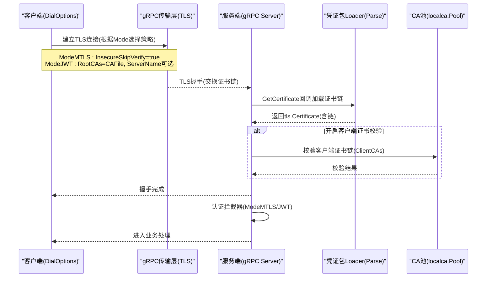
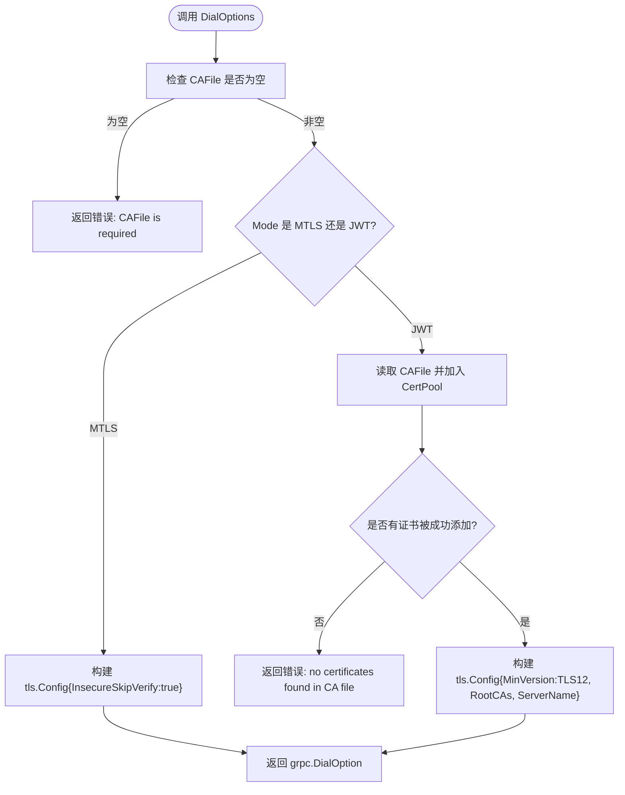
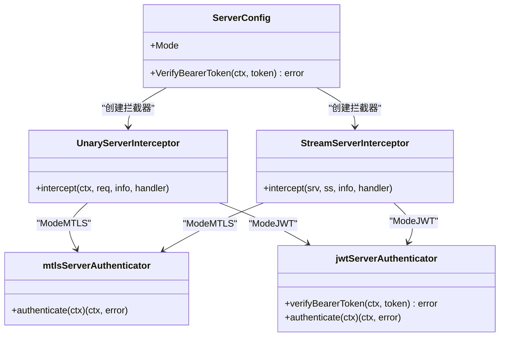
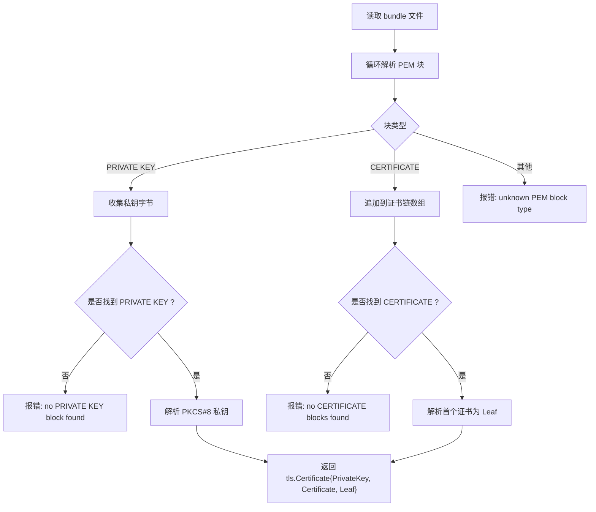
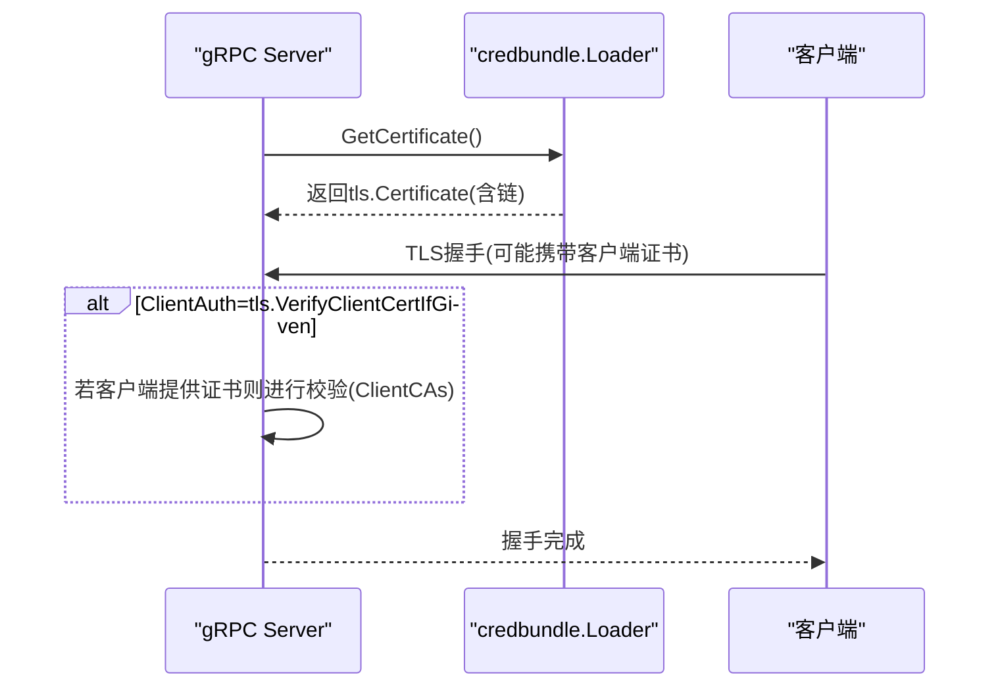
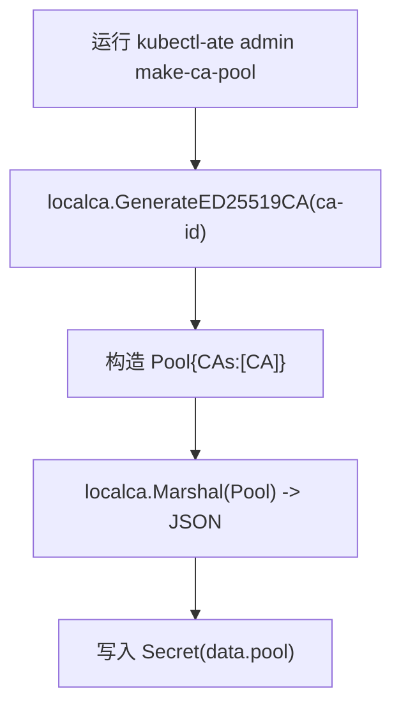
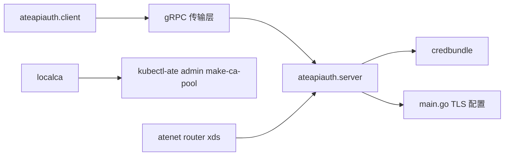

# mTLS证书问题排查

<cite>
**本文引用的文件**   
- [internal/ateapiauth/client.go](file://internal/ateapiauth/client.go)
- [internal/ateapiauth/server.go](file://internal/ateapiauth/server.go)
- [cmd/ateapi/internal/credbundle/credbundle.go](file://cmd/ateapi/internal/credbundle/credbundle.go)
- [cmd/ateapi/main.go](file://cmd/ateapi/main.go)
- [internal/localca/localca.go](file://internal/localca/localca.go)
- [cmd/kubectl-ate/internal/cmd/admin_make_ca_pool.go](file://cmd/kubectl-ate/internal/cmd/admin_make_ca_pool.go)
- [cmd/atenet/internal/router/xds.go](file://cmd/atenet/internal/router/xds.go)
- [cmd/atenet/internal/router/router.go](file://cmd/atenet/internal/router/router.go)
- [cmd/ateapi/internal/sessionidentity/sessionidentity.go](file://cmd/ateapi/internal/sessionidentity/sessionidentity.go)
</cite>

## 目录
1. [简介](#简介)
2. [项目结构](#项目结构)
3. [核心组件](#核心组件)
4. [架构总览](#架构总览)
5. [详细组件分析](#详细组件分析)
6. [依赖关系分析](#依赖关系分析)
7. [性能与可用性考虑](#性能与可用性考虑)
8. [故障排查指南](#故障排查指南)
9. [结论](#结论)
10. [附录：证书生成与配置示例](#附录证书生成与配置示例)

## 简介
本文件聚焦于mTLS（双向TLS）证书认证失败的诊断与解决方法，覆盖以下关键主题：
- 证书链验证失败的常见原因（CA缺失、中间证书错误、格式问题等）
- 客户端证书配置错误的诊断方法（路径、权限、内容校验）
- 服务器端信任问题的排查流程（Root CA配置、SNI设置、域名匹配）
- 结合仓库中实际实现的具体定位点与可操作建议
- 提供基于仓库代码的证书生成与配置参考路径

## 项目结构
与mTLS相关的关键位置包括：
- 客户端连接与模式选择：internal/ateapiauth/client.go
- 服务端拦截器与模式解析：internal/ateapiauth/server.go
- 凭证包（含私钥+证书链）加载：cmd/ateapi/internal/credbundle/credbundle.go
- 服务端gRPC TLS构建与可选ClientCAs：cmd/ateapi/main.go
- 本地CA池生成与序列化：internal/localca/localca.go
- 通过kubectl子命令创建CA池Secret：cmd/kubectl-ate/internal/cmd/admin_make_ca_pool.go
- 路由器XDS侧TLS证书注入：cmd/atenet/internal/router/xds.go
- 自签名证书生成（测试/演示用途）：cmd/atenet/internal/router/router.go
- 会话证书签发（CSR→证书链）：cmd/ateapi/internal/sessionidentity/sessionidentity.go

```mermaid
graph TB
subgraph "客户端"
C["ateapiauth.ClientConfig<br/>DialOptions()"]
end
subgraph "服务端"
S["ateapiauth.ServerConfig<br/>Unary/Stream Interceptor"]
G["gRPC Server TLS<br/>GetCertificate + ClientAuth"]
CB["credbundle.Loader()<br/>Parse()"]
end
subgraph "证书与CA"
LCA["localca.Pool/CA<br/>GenerateED25519CA/Marshal/Unmarshal"]
KCTL["kubectl-ate admin make-ca-pool"]
end
subgraph "路由/网关"
XDS["atenet router xds.buildTlsCertificate()"]
SELF["router.generateSelfSignedCert()"]
end
C --> |建立gRPC连接| G
G --> |加载证书链| CB
G --> |可选校验客户端| S
CB --> |返回tls.Certificate| G
LCA --> |提供根/中间证书| S
KCTL --> |写入Secret(pool)| LCA
XDS --> |下发TLS配置| G
SELF --> |生成自签证书(测试)| XDS
```

图示来源 
- [internal/ateapiauth/client.go:57-95](file://internal/ateapiauth/client.go#L57-L95)
- [internal/ateapiauth/server.go:81-127](file://internal/ateapiauth/server.go#L81-L127)
- [cmd/ateapi/internal/credbundle/credbundle.go:30-92](file://cmd/ateapi/internal/credbundle/credbundle.go#L30-L92)
- [cmd/ateapi/main.go:360-373](file://cmd/ateapi/main.go#L360-L373)
- [internal/localca/localca.go:159-192](file://internal/localca/localca.go#L159-L192)
- [cmd/kubectl-ate/internal/cmd/admin_make_ca_pool.go:32-80](file://cmd/kubectl-ate/internal/cmd/admin_make_ca_pool.go#L32-L80)
- [cmd/atenet/internal/router/xds.go:578-606](file://cmd/atenet/internal/router/xds.go#L578-L606)
- [cmd/atenet/internal/router/router.go:317-351](file://cmd/atenet/internal/router/router.go#L317-L351)

章节来源
- [internal/ateapiauth/client.go:57-95](file://internal/ateapiauth/client.go#L57-L95)
- [internal/ateapiauth/server.go:81-127](file://internal/ateapiauth/server.go#L81-L127)
- [cmd/ateapi/internal/credbundle/credbundle.go:30-92](file://cmd/ateapi/internal/credbundle/credbundle.go#L30-L92)
- [cmd/ateapi/main.go:360-373](file://cmd/ateapi/main.go#L360-L373)
- [internal/localca/localca.go:159-192](file://internal/localca/localca.go#L159-L192)
- [cmd/kubectl-ate/internal/cmd/admin_make_ca_pool.go:32-80](file://cmd/kubectl-ate/internal/cmd/admin_make_ca_pool.go#L32-L80)
- [cmd/atenet/internal/router/xds.go:578-606](file://cmd/atenet/internal/router/xds.go#L578-L606)
- [cmd/atenet/internal/router/router.go:317-351](file://cmd/atenet/internal/router/router.go#L317-L351)

## 核心组件
- 客户端连接模式与TLS选项
  - ModeMTLS：默认使用InsecureSkipVerify=true的TLS（用于Pod内mTLS身份由Kubernetes投影），不启用应用层鉴权。
  - ModeJWT：严格校验服务器证书（需要CAFile），并携带Bearer Token。
  - 关键入口：DialOptions(cfg)
- 服务端认证拦截器
  - ModeMTLS：仅依赖传输层mTLS，不做应用层检查。
  - ModeJWT：要求每个RPC携带authorization: Bearer <token>，并进行校验。
  - 关键入口：UnaryServerInterceptor / StreamServerInterceptor
- 凭证包加载器
  - credbundle.Parse(path)：从单个PEM文件中读取PRIVATE KEY和CERTIFICATE块，构造tls.Certificate（包含证书链）。
- gRPC服务端TLS构建
  - GetCertificate：动态加载凭证包（支持热更新）。
  - ClientAuth：可选择是否校验客户端证书。
  - ClientCAs：可选配置以校验客户端证书链。
- 本地CA池
  - GenerateED25519CA：生成根CA及密钥。
  - Marshal/Unmarshal：序列化为JSON（含DER/PEM兼容字段）。
  - kubectl-ate admin make-ca-pool：将CA池写入Kubernetes Secret供控制器使用。
- 路由器XDS TLS配置
  - buildTlsCertificate：支持从文件或内联字符串注入证书链与私钥。
- 自签名证书生成（测试/演示）
  - generateSelfSignedCert：生成RSA自签证书（DNSNames=localhost）。

章节来源
- [internal/ateapiauth/client.go:57-95](file://internal/ateapiauth/client.go#L57-L95)
- [internal/ateapiauth/server.go:81-127](file://internal/ateapiauth/server.go#L81-L127)
- [cmd/ateapi/internal/credbundle/credbundle.go:30-92](file://cmd/ateapi/internal/credbundle/credbundle.go#L30-L92)
- [cmd/ateapi/main.go:360-373](file://cmd/ateapi/main.go#L360-L373)
- [internal/localca/localca.go:159-192](file://internal/localca/localca.go#L159-L192)
- [cmd/kubectl-ate/internal/cmd/admin_make_ca_pool.go:32-80](file://cmd/kubectl-ate/internal/cmd/admin_make_ca_pool.go#L32-L80)
- [cmd/atenet/internal/router/xds.go:578-606](file://cmd/atenet/internal/router/xds.go#L578-L606)
- [cmd/atenet/internal/router/router.go:317-351](file://cmd/atenet/internal/router/router.go#L317-L351)

## 架构总览
下图展示了mTLS握手与认证在客户端与服务端的交互要点，以及证书链与CA池的作用位置。



图示来源 
- [internal/ateapiauth/client.go:57-95](file://internal/ateapiauth/client.go#L57-L95)
- [cmd/ateapi/main.go:360-373](file://cmd/ateapi/main.go#L360-L373)
- [cmd/ateapi/internal/credbundle/credbundle.go:30-92](file://cmd/ateapi/internal/credbundle/credbundle.go#L30-L92)
- [internal/localca/localca.go:159-192](file://internal/localca/localca.go#L159-L192)

## 详细组件分析

### 客户端连接与证书校验（ModeMTLS vs ModeJWT）
- ModeMTLS
  - 行为：使用InsecureSkipVerify=true的TLS，适用于Pod内mTLS身份由Kubernetes投影的场景。
  - 风险：跳过服务器证书校验，需确保网络隔离与受控环境。
- ModeJWT
  - 行为：强制校验服务器证书（RootCAs来自CAFile），并可设置ServerName覆盖SNI/主机名校验；每次RPC读取TokenFile作为Bearer凭证。
  - 典型错误：
    - CAFile为空或不可读
    - CA文件中无有效证书
    - TokenFile为空或不可读
    - ServerName与证书SAN/CN不匹配导致主机名校验失败



图示来源 
- [internal/ateapiauth/client.go:57-95](file://internal/ateapiauth/client.go#L57-L95)

章节来源
- [internal/ateapiauth/client.go:57-95](file://internal/ateapiauth/client.go#L57-L95)

### 服务端认证拦截器（ModeMTLS vs ModeJWT）
- ModeMTLS
  - 行为：不执行应用层鉴权，身份由传输层mTLS保证。
- ModeJWT
  - 行为：从请求头提取authorization: Bearer <token>，调用外部验证函数；缺失或无效则返回未认证错误。



图示来源 
- [internal/ateapiauth/server.go:81-127](file://internal/ateapiauth/server.go#L81-L127)
- [internal/ateapiauth/server.go:129-181](file://internal/ateapiauth/server.go#L129-L181)

章节来源
- [internal/ateapiauth/server.go:81-127](file://internal/ateapiauth/server.go#L81-L127)
- [internal/ateapiauth/server.go:129-181](file://internal/ateapiauth/server.go#L129-L181)

### 凭证包加载器（credbundle）
- 功能：从单一PEM文件解析PRIVATE KEY与多个CERTIFICATE块，按leaf-to-root顺序组装为tls.Certificate。
- 关键点：
  - 必须包含且仅有一个PRIVATE KEY块
  - 至少一个CERTIFICATE块
  - 私钥必须是PKCS#8格式（当前实现仅支持PKCS#8）
  - 返回的tls.Certificate包含Leaf指针，便于后续校验



图示来源 
- [cmd/ateapi/internal/credbundle/credbundle.go:30-92](file://cmd/ateapi/internal/credbundle/credbundle.go#L30-L92)

章节来源
- [cmd/ateapi/internal/credbundle/credbundle.go:30-92](file://cmd/ateapi/internal/credbundle/credbundle.go#L30-L92)

### gRPC服务端TLS构建与可选客户端证书校验
- GetCertificate：动态加载凭证包（支持热更新）
- ClientAuth：tls.VerifyClientCertIfGiven（仅在客户端提供证书时校验）
- ClientCAs：可选配置，用于校验客户端证书链（当启用客户端证书校验时）



图示来源 
- [cmd/ateapi/main.go:360-373](file://cmd/ateapi/main.go#L360-L373)
- [cmd/ateapi/internal/credbundle/credbundle.go:30-92](file://cmd/ateapi/internal/credbundle/credbundle.go#L30-L92)

章节来源
- [cmd/ateapi/main.go:360-373](file://cmd/ateapi/main.go#L360-L373)
- [cmd/ateapi/internal/credbundle/credbundle.go:30-92](file://cmd/ateapi/internal/credbundle/credbundle.go#L30-L92)

### 本地CA池与工具链
- localca.GenerateED25519CA：生成ED25519根CA及其自签证书
- localca.Marshal/Unmarshal：支持DER/PEM混合字段，便于持久化与恢复
- kubectl-ate admin make-ca-pool：生成CA池并写入Kubernetes Secret，供控制器使用



图示来源 
- [internal/localca/localca.go:159-192](file://internal/localca/localca.go#L159-L192)
- [cmd/kubectl-ate/internal/cmd/admin_make_ca_pool.go:32-80](file://cmd/kubectl-ate/internal/cmd/admin_make_ca_pool.go#L32-L80)

章节来源
- [internal/localca/localca.go:159-192](file://internal/localca/localca.go#L159-L192)
- [cmd/kubectl-ate/internal/cmd/admin_make_ca_pool.go:32-80](file://cmd/kubectl-ate/internal/cmd/admin_make_ca_pool.go#L32-L80)

### 路由器XDS TLS配置与自签证书（测试/演示）
- buildTlsCertificate：支持从文件或内联字符串注入证书链与私钥
- generateSelfSignedCert：生成RSA自签证书（DNSNames=localhost），适合本地调试

章节来源
- [cmd/atenet/internal/router/xds.go:578-606](file://cmd/atenet/internal/router/xds.go#L578-L606)
- [cmd/atenet/internal/router/router.go:317-351](file://cmd/atenet/internal/router/router.go#L317-L351)

### 会话证书签发（CSR→证书链）
- sessionidentity.MintCert：接收CSR，提取公钥，使用CA池中的根CA与私钥签发短期客户端证书，并附带中间证书（如有）

章节来源
- [cmd/ateapi/internal/sessionidentity/sessionidentity.go:191-225](file://cmd/ateapi/internal/sessionidentity/sessionidentity.go#L191-L225)

## 依赖关系分析
- ateapiauth.client 与 ateapiauth.server 分别负责客户端与服务端认证逻辑，二者通过gRPC传输层TLS协作。
- credbundle 为服务端提供证书链加载能力，配合 main.go 的TLS配置形成完整的服务端证书体系。
- localca 提供CA池的生成与序列化能力，kubectl-ate 将其落地为Secret，供控制器消费。
- atenet router 的XDS配置影响下游TLS行为，自签证书可用于快速验证链路。



图示来源 
- [internal/ateapiauth/client.go:57-95](file://internal/ateapiauth/client.go#L57-L95)
- [internal/ateapiauth/server.go:81-127](file://internal/ateapiauth/server.go#L81-L127)
- [cmd/ateapi/internal/credbundle/credbundle.go:30-92](file://cmd/ateapi/internal/credbundle/credbundle.go#L30-L92)
- [cmd/ateapi/main.go:360-373](file://cmd/ateapi/main.go#L360-L373)
- [internal/localca/localca.go:159-192](file://internal/localca/localca.go#L159-L192)
- [cmd/kubectl-ate/internal/cmd/admin_make_ca_pool.go:32-80](file://cmd/kubectl-ate/internal/cmd/admin_make_ca_pool.go#L32-L80)
- [cmd/atenet/internal/router/xds.go:578-606](file://cmd/atenet/internal/router/xds.go#L578-L606)

章节来源
- [internal/ateapiauth/client.go:57-95](file://internal/ateapiauth/client.go#L57-L95)
- [internal/ateapiauth/server.go:81-127](file://internal/ateapiauth/server.go#L81-L127)
- [cmd/ateapi/internal/credbundle/credbundle.go:30-92](file://cmd/ateapi/internal/credbundle/credbundle.go#L30-L92)
- [cmd/ateapi/main.go:360-373](file://cmd/ateapi/main.go#L360-L373)
- [internal/localca/localca.go:159-192](file://internal/localca/localca.go#L159-L192)
- [cmd/kubectl-ate/internal/cmd/admin_make_ca_pool.go:32-80](file://cmd/kubectl-ate/internal/cmd/admin_make_ca_pool.go#L32-L80)
- [cmd/atenet/internal/router/xds.go:578-606](file://cmd/atenet/internal/router/xds.go#L578-L606)

## 性能与可用性考虑
- 凭证包加载：当前Loader未缓存，频繁切换证书可能带来额外开销；生产环境建议引入缓存机制。
- Token读取：ModeJWT下每RPC读取TokenFile，利用Kubernetes原地刷新特性，兼顾安全与便捷。
- 证书链长度：过长的证书链会增加握手开销，应精简中间证书数量。

[本节为通用指导，无需引用具体文件]

## 故障排查指南

### 一、证书链验证失败的常见原因
- CA证书缺失
  - 现象：客户端无法验证服务器证书链
  - 定位点：ModeJWT下CAFile为空或AppendCertsFromPEM失败
  - 参考路径：[internal/ateapiauth/client.go:74-81](file://internal/ateapiauth/client.go#L74-L81)
- 中间证书配置错误
  - 现象：链不完整或顺序错误
  - 定位点：credbundle解析证书链顺序为leaf-to-root；服务端返回的链需包含中间证书
  - 参考路径：[cmd/ateapi/internal/credbundle/credbundle.go:41-92](file://cmd/ateapi/internal/credbundle/credbundle.go#L41-L92)
- 证书格式问题
  - 现象：私钥非PKCS#8、PEM块类型未知
  - 定位点：credbundle仅支持PKCS#8私钥；遇到未知块类型会报错
  - 参考路径：[cmd/ateapi/internal/credbundle/credbundle.go:69-80](file://cmd/ateapi/internal/credbundle/credbundle.go#L69-L80)

章节来源
- [internal/ateapiauth/client.go:74-81](file://internal/ateapiauth/client.go#L74-L81)
- [cmd/ateapi/internal/credbundle/credbundle.go:41-92](file://cmd/ateapi/internal/credbundle/credbundle.go#L41-L92)

### 二、客户端证书配置错误的诊断方法
- 证书文件路径
  - 现象：无法读取CAFile或TokenFile
  - 定位点：DialOptions对CAFile与TokenFile的路径与可读性进行检查
  - 参考路径：[internal/ateapiauth/client.go:57-73](file://internal/ateapiauth/client.go#L57-L73)
- 权限设置
  - 现象：进程无权读取文件
  - 建议：确认容器/进程用户具备文件读取权限
- 证书内容验证
  - 现象：CA文件中无有效证书
  - 定位点：pool.AppendCertsFromPEM返回false时触发错误
  - 参考路径：[internal/ateapiauth/client.go:77-81](file://internal/ateapiauth/client.go#L77-L81)

章节来源
- [internal/ateapiauth/client.go:57-73](file://internal/ateapiauth/client.go#L57-L73)
- [internal/ateapiauth/client.go:77-81](file://internal/ateapiauth/client.go#L77-L81)

### 三、服务器证书信任问题的排查流程
- Root CA配置
  - 现象：客户端无法信任服务器证书
  - 定位点：ModeJWT下RootCAs需正确加载CAFile
  - 参考路径：[internal/ateapiauth/client.go:74-86](file://internal/ateapiauth/client.go#L74-L86)
- SNI设置
  - 现象：ServerName与证书SAN/CN不匹配
  - 定位点：ClientConfig.ServerName用于覆盖SNI/主机名校验
  - 参考路径：[internal/ateapiauth/client.go:49-50](file://internal/ateapiauth/client.go#L49-L50)
- 证书域名匹配
  - 现象：证书不包含目标域名
  - 建议：确保证书SAN包含服务FQDN或自定义ServerName一致

章节来源
- [internal/ateapiauth/client.go:49-50](file://internal/ateapiauth/client.go#L49-L50)
- [internal/ateapiauth/client.go:74-86](file://internal/ateapiauth/client.go#L74-L86)

### 四、服务端证书链与客户端证书校验
- 服务端证书链加载
  - 现象：GetCertificate返回错误或链不完整
  - 定位点：credbundle解析失败或证书链缺失
  - 参考路径：[cmd/ateapi/internal/credbundle/credbundle.go:41-92](file://cmd/ateapi/internal/credbundle/credbundle.go#L41-L92)
- 客户端证书校验
  - 现象：客户端证书不被信任
  - 定位点：ClientCAs未配置或证书链未包含受信任根
  - 参考路径：[cmd/ateapi/main.go:360-373](file://cmd/ateapi/main.go#L360-L373)

章节来源
- [cmd/ateapi/internal/credbundle/credbundle.go:41-92](file://cmd/ateapi/internal/credbundle/credbundle.go#L41-L92)
- [cmd/ateapi/main.go:360-373](file://cmd/ateapi/main.go#L360-L373)

### 五、常见问题速查表
- 错误“CAFile is required”
  - 原因：ModeMTLS/JWT均要求CAFile参数
  - 解决：传入有效的CA文件路径
  - 参考路径：[internal/ateapiauth/client.go:60-62](file://internal/ateapiauth/client.go#L60-L62)
- 错误“no certificates found in CA file”
  - 原因：CA文件为空或格式不正确
  - 解决：检查PEM格式与内容
  - 参考路径：[internal/ateapiauth/client.go:77-81](file://internal/ateapiauth/client.go#L77-L81)
- 错误“missing bearer token”
  - 原因：ModeJWT下缺少authorization头
  - 解决：确保每RPC携带Bearer Token
  - 参考路径：[internal/ateapiauth/server.go:141-148](file://internal/ateapiauth/server.go#L141-L148)
- 错误“unknown PEM block type”
  - 原因：凭证包中包含非PRIVATE KEY/CERTIFICATE块
  - 解决：清理多余块或转换为标准格式
  - 参考路径：[cmd/ateapi/internal/credbundle/credbundle.go:64-66](file://cmd/ateapi/internal/credbundle/credbundle.go#L64-L66)

章节来源
- [internal/ateapiauth/client.go:60-62](file://internal/ateapiauth/client.go#L60-L62)
- [internal/ateapiauth/client.go:77-81](file://internal/ateapiauth/client.go#L77-L81)
- [internal/ateapiauth/server.go:141-148](file://internal/ateapiauth/server.go#L141-L148)
- [cmd/ateapi/internal/credbundle/credbundle.go:64-66](file://cmd/ateapi/internal/credbundle/credbundle.go#L64-L66)

## 结论
- 在ModeMTLS下，身份由传输层mTLS保障，注意网络隔离与受控环境。
- 在ModeJWT下，务必正确配置CAFile与TokenFile，并确保ServerName与证书SAN/CN一致。
- 凭证包需遵循PRIVATE KEY(CA/PKCS#8)+CERTIFICATE(leaf-to-root)格式。
- 服务端可通过ClientCAs启用客户端证书校验，提升双向认证强度。
- 借助localca与kubectl-ate工具链，可快速生成与分发CA池，简化证书管理。

[本节为总结，无需引用具体文件]

## 附录：证书生成与配置示例

- 生成本地CA池并写入Secret
  - 命令入口：kubectl-ate admin make-ca-pool
  - 参考路径：[cmd/kubectl-ate/internal/cmd/admin_make_ca_pool.go:32-80](file://cmd/kubectl-ate/internal/cmd/admin_make_ca_pool.go#L32-L80)
  - CA生成实现：[internal/localca/localca.go:159-192](file://internal/localca/localca.go#L159-L192)

- 构建服务端gRPC TLS（含凭证包与可选客户端证书校验）
  - 参考路径：[cmd/ateapi/main.go:360-373](file://cmd/ateapi/main.go#L360-L373)
  - 凭证包解析：[cmd/ateapi/internal/credbundle/credbundle.go:41-92](file://cmd/ateapi/internal/credbundle/credbundle.go#L41-L92)

- 客户端连接（ModeMTLS/JWT）
  - 参考路径：[internal/ateapiauth/client.go:57-95](file://internal/ateapiauth/client.go#L57-L95)

- 路由器XDS TLS配置（文件/内联）
  - 参考路径：[cmd/atenet/internal/router/xds.go:578-606](file://cmd/atenet/internal/router/xds.go#L578-L606)

- 自签证书（本地调试）
  - 参考路径：[cmd/atenet/internal/router/router.go:317-351](file://cmd/atenet/internal/router/router.go#L317-L351)

- 会话证书签发（CSR→证书链）
  - 参考路径：[cmd/ateapi/internal/sessionidentity/sessionidentity.go:191-225](file://cmd/ateapi/internal/sessionidentity/sessionidentity.go#L191-L225)

章节来源
- [cmd/kubectl-ate/internal/cmd/admin_make_ca_pool.go:32-80](file://cmd/kubectl-ate/internal/cmd/admin_make_ca_pool.go#L32-L80)
- [internal/localca/localca.go:159-192](file://internal/localca/localca.go#L159-L192)
- [cmd/ateapi/main.go:360-373](file://cmd/ateapi/main.go#L360-L373)
- [cmd/ateapi/internal/credbundle/credbundle.go:41-92](file://cmd/ateapi/internal/credbundle/credbundle.go#L41-L92)
- [internal/ateapiauth/client.go:57-95](file://internal/ateapiauth/client.go#L57-L95)
- [cmd/atenet/internal/router/xds.go:578-606](file://cmd/atenet/internal/router/xds.go#L578-L606)
- [cmd/atenet/internal/router/router.go:317-351](file://cmd/atenet/internal/router/router.go#L317-L351)
- [cmd/ateapi/internal/sessionidentity/sessionidentity.go:191-225](file://cmd/ateapi/internal/sessionidentity/sessionidentity.go#L191-L225)
