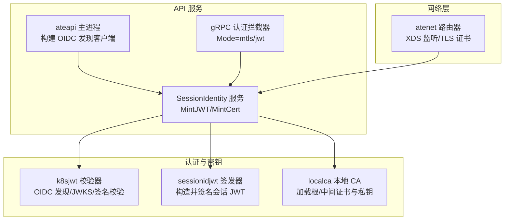
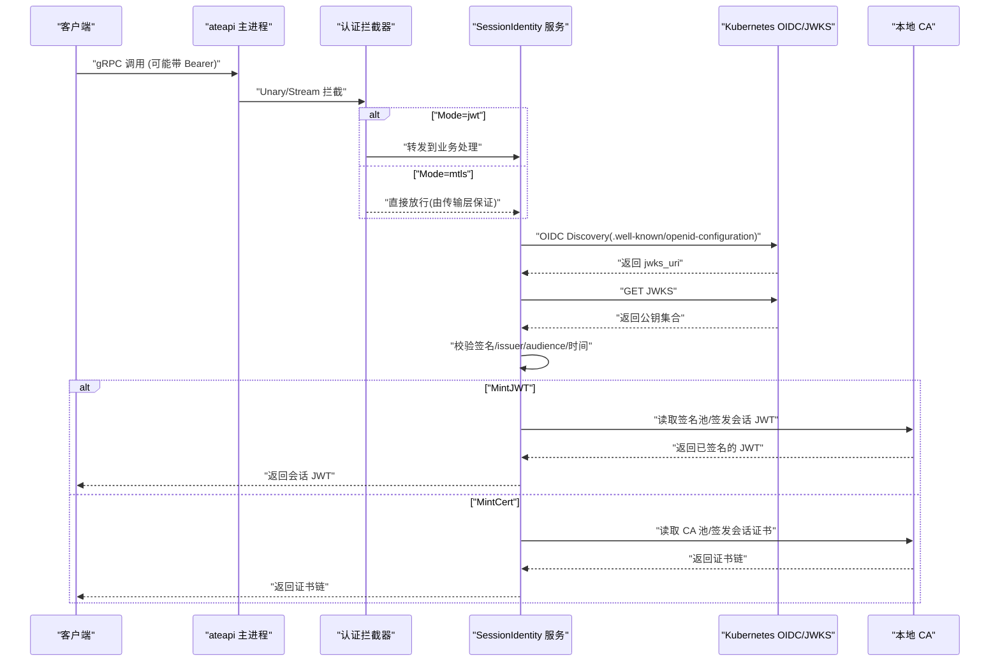
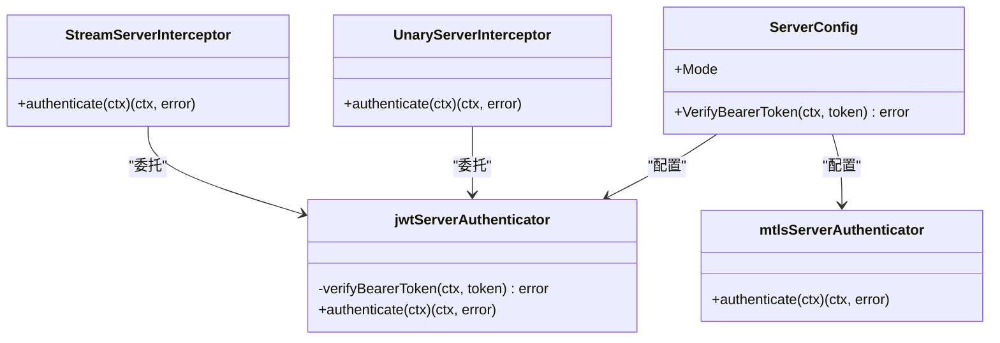
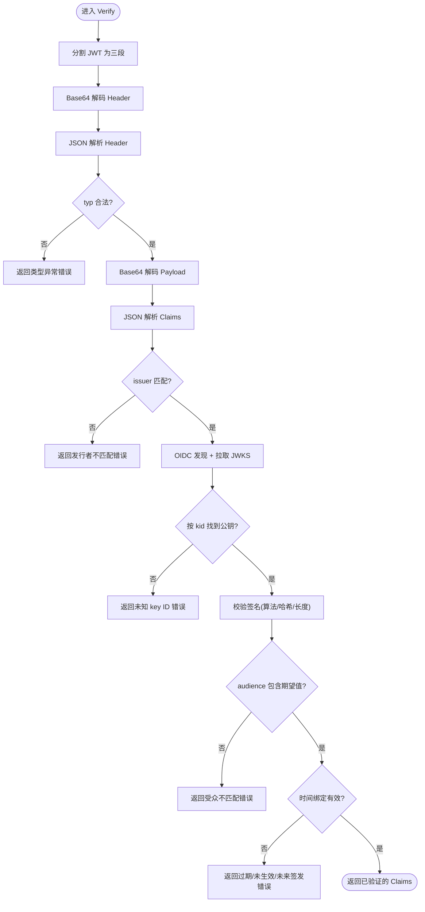
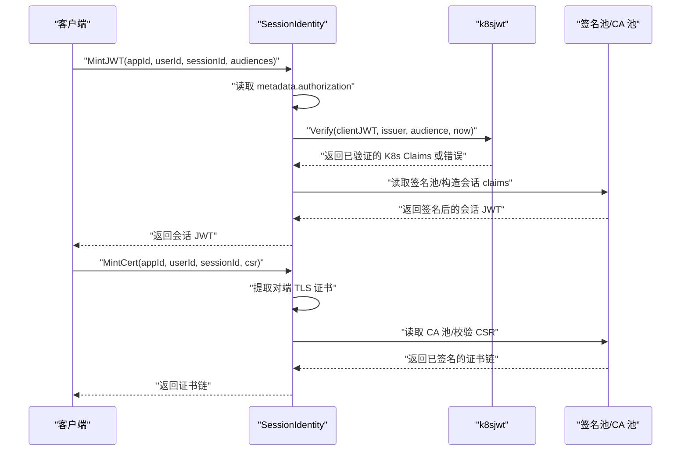
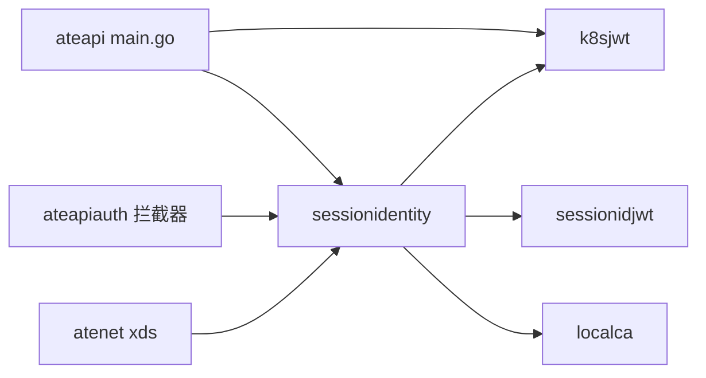

# 认证失败排查

<cite>
**本文引用的文件列表**
- [internal/ateapiauth/server.go](file://internal/ateapiauth/server.go)
- [cmd/ateapi/internal/k8sjwt/k8sjwt.go](file://cmd/ateapi/internal/k8sjwt/k8sjwt.go)
- [cmd/ateapi/internal/sessionidentity/sessionidentity.go](file://cmd/ateapi/internal/sessionidentity/sessionidentity.go)
- [cmd/ateapi/internal/sessionidjwt/sessionidjwt.go](file://cmd/ateapi/internal/sessionidjwt/sessionidjwt.go)
- [internal/localca/localca.go](file://internal/localca/localca.go)
- [cmd/atenet/internal/router/xds.go](file://cmd/atenet/internal/router/xds.go)
- [cmd/atenet/internal/router/errors.go](file://cmd/atenet/internal/router/errors.go)
- [cmd/ateapi/main.go](file://cmd/ateapi/main.go)
</cite>

## 目录
1. [简介](#简介)
2. [项目结构](#项目结构)
3. [核心组件](#核心组件)
4. [架构总览](#架构总览)
5. [详细组件分析](#详细组件分析)
6. [依赖关系分析](#依赖关系分析)
7. [性能与可用性考量](#性能与可用性考量)
8. [故障排查指南](#故障排查指南)
9. [结论](#结论)
10. [附录：配置示例与最佳实践](#附录配置示例与最佳实践)

## 简介
本文件聚焦于认证失败的诊断与解决方法，覆盖以下关键主题：
- JWT 令牌验证失败的常见原因与排查步骤（过期、签名不匹配、受众不匹配、算法不支持等）
- mTLS 证书配置错误的诊断方法（证书链、客户端证书格式、CA 信任问题）
- 身份提供商集成故障的排查流程（OIDC 发现、JWKS 获取、令牌交换与用户信息获取错误）
- 日志分析方法与调试工具使用建议
- 常见认证配置示例与最佳实践

## 项目结构
与认证相关的关键代码分布在以下模块：
- gRPC 服务端认证拦截器（支持 mTLS 与 JWT Bearer 模式）
- Kubernetes ServiceAccount JWT 校验器（OIDC 发现 + JWKS 解析 + 签名校验）
- 会话身份服务（签发会话 JWT 与证书）
- 本地 CA 管理（用于签发会话证书）
- 网络层 TLS 监听与证书注入（Envoy XDS）
- 错误码映射（gRPC -> HTTP 状态码）

图表来源
- [cmd/ateapi/main.go:375-476](file://cmd/ateapi/main.go#L375-L476)
- [cmd/ateapi/internal/sessionidentity/sessionidentity.go:71-142](file://cmd/ateapi/internal/sessionidentity/sessionidentity.go#L71-L142)
- [cmd/ateapi/internal/k8sjwt/k8sjwt.go:128-261](file://cmd/ateapi/internal/k8sjwt/k8sjwt.go#L128-L261)
- [cmd/ateapi/internal/sessionidjwt/sessionidjwt.go:100-164](file://cmd/ateapi/internal/sessionidjwt/sessionidjwt.go#L100-L164)
- [internal/localca/localca.go:83-120](file://internal/localca/localca.go#L83-L120)
- [cmd/atenet/internal/router/xds.go:545-606](file://cmd/atenet/internal/router/xds.go#L545-L606)
- [internal/ateapiauth/server.go:81-127](file://internal/ateapiauth/server.go#L81-L127)

章节来源
- [internal/ateapiauth/server.go:1-182](file://internal/ateapiauth/server.go#L1-L182)
- [cmd/ateapi/internal/k8sjwt/k8sjwt.go:1-459](file://cmd/ateapi/internal/k8sjwt/k8sjwt.go#L1-L459)
- [cmd/ateapi/internal/sessionidentity/sessionidentity.go:1-226](file://cmd/ateapi/internal/sessionidentity/sessionidentity.go#L1-L226)
- [cmd/ateapi/internal/sessionidjwt/sessionidjwt.go:1-171](file://cmd/ateapi/internal/sessionidjwt/sessionidjwt.go#L1-L171)
- [internal/localca/localca.go:1-193](file://internal/localca/localca.go#L1-L193)
- [cmd/atenet/internal/router/xds.go:545-606](file://cmd/atenet/internal/router/xds.go#L545-L606)
- [cmd/atenet/internal/router/errors.go:80-85](file://cmd/atenet/internal/router/errors.go#L80-L85)
- [cmd/ateapi/main.go:375-476](file://cmd/ateapi/main.go#L375-L476)

## 核心组件
- gRPC 认证拦截器
  - 支持两种模式：mTLS（默认）与 JWT（需配置 Bearer Token 校验函数）。在 JWT 模式下，缺失或无效的 Bearer 头将返回未认证错误。
- Kubernetes JWT 校验器
  - 基于 OIDC Discovery 文档定位 JWKS，按 kid 选择公钥，执行签名校验；随后校验 issuer、audience、时间绑定（exp/nbf/iat），并允许一定时钟偏差。
- 会话身份服务
  - MintJWT：校验客户端 K8s SA JWT，读取本地签名池，签发会话 JWT（包含应用/用户/会话标识及受众绑定）。
  - MintCert：通过 mTLS 对端证书鉴权，校验 CSR，使用本地 CA 签发会话证书（含 SPIFFE URI）。
- 本地 CA
  - 提供 CA 池的序列化/反序列化，支持 PKCS#8/PEM 私钥与 DER/PEM 证书，便于持久化与分发。
- 网络层 TLS
  - 路由器侧通过 XDS 配置 HTTPS 监听与 TLS 证书（支持从文件或内联注入）。

章节来源
- [internal/ateapiauth/server.go:35-70](file://internal/ateapiauth/server.go#L35-L70)
- [cmd/ateapi/internal/k8sjwt/k8sjwt.go:118-261](file://cmd/ateapi/internal/k8sjwt/k8sjwt.go#L118-L261)
- [cmd/ateapi/internal/sessionidentity/sessionidentity.go:71-142](file://cmd/ateapi/internal/sessionidentity/sessionidentity.go#L71-L142)
- [cmd/ateapi/internal/sessionidentity/sessionidentity.go:144-225](file://cmd/ateapi/internal/sessionidentity/sessionidentity.go#L144-L225)
- [internal/localca/localca.go:83-120](file://internal/localca/localca.go#L83-L120)
- [cmd/atenet/internal/router/xds.go:545-606](file://cmd/atenet/internal/router/xds.go#L545-L606)

## 架构总览
下图展示了“客户端请求 -> 认证拦截 -> 会话身份服务 -> 外部 OIDC/JWKS”的端到端调用链，以及证书签发路径。

图表来源
- [cmd/ateapi/internal/sessionidentity/sessionidentity.go:71-142](file://cmd/ateapi/internal/sessionidentity/sessionidentity.go#L71-L142)
- [cmd/ateapi/internal/k8sjwt/k8sjwt.go:367-431](file://cmd/ateapi/internal/k8sjwt/k8sjwt.go#L367-L431)
- [internal/localca/localca.go:83-120](file://internal/localca/localca.go#L83-L120)
- [internal/ateapiauth/server.go:81-127](file://internal/ateapiauth/server.go#L81-L127)

## 详细组件分析

### 组件A：gRPC 认证拦截器（MTLS/JWT）
- 职责
  - 根据配置选择认证策略：mTLS 或 JWT。
  - JWT 模式下，从元数据提取 Authorization: Bearer <token>，并调用配置的验签函数。
  - 失败时返回 Unauthenticated 错误码。
- 关键点
  - Mode 为空或 mtls 时，仅依赖传输层 mTLS，不做应用层检查。
  - Mode=jwt 时必须提供 VerifyBearerToken 回调，否则启动校验失败。
  - 缺失 Bearer 头或前缀不正确均视为未认证。

图表来源
- [internal/ateapiauth/server.go:72-127](file://internal/ateapiauth/server.go#L72-L127)
- [internal/ateapiauth/server.go:137-152](file://internal/ateapiauth/server.go#L137-L152)

章节来源
- [internal/ateapiauth/server.go:35-70](file://internal/ateapiauth/server.go#L35-L70)
- [internal/ateapiauth/server.go:81-127](file://internal/ateapiauth/server.go#L81-L127)
- [internal/ateapiauth/server.go:141-152](file://internal/ateapiauth/server.go#L141-L152)

### 组件B：Kubernetes JWT 校验器（OIDC/JWKS/签名）
- 职责
  - 解析 JWT 三段式结构，解码 header/payload。
  - 校验 header.typ 容忍空或 JWT。
  - 通过 issuer 发现 OIDC 文档，拉取 JWKS，按 kid 选择公钥。
  - 校验签名（支持 RSA/ECDSA 多种算法）。
  - 校验 issuer、audience（字符串或数组）、时间绑定（exp/nbf/iat）并允许时钟偏差。
- 常见失败点
  - 非三段式 JWT、base64 解码失败、header 类型异常。
  - issuer 不匹配、kid 不存在、JWKS 不可达或非 200。
  - 签名算法不支持或签名校验失败。
  - audience 不包含期望值。
  - 令牌过期、尚未生效、签发时间在将来。

图表来源
- [cmd/ateapi/internal/k8sjwt/k8sjwt.go:128-261](file://cmd/ateapi/internal/k8sjwt/k8sjwt.go#L128-L261)
- [cmd/ateapi/internal/k8sjwt/k8sjwt.go:367-431](file://cmd/ateapi/internal/k8sjwt/k8sjwt.go#L367-L431)

章节来源
- [cmd/ateapi/internal/k8sjwt/k8sjwt.go:118-261](file://cmd/ateapi/internal/k8sjwt/k8sjwt.go#L118-L261)
- [cmd/ateapi/internal/k8sjwt/k8sjwt.go:367-431](file://cmd/ateapi/internal/k8sjwt/k8sjwt.go#L367-L431)

### 组件C：会话身份服务（MintJWT/MintCert）
- MintJWT 流程
  - 从 gRPC 元数据中读取 Authorization: Bearer，调用 k8sjwt.Verify 校验客户端令牌。
  - 读取本地签名池，构造会话 JWT 的 claims（包含 appID/userID/sessionID 与受众），签名后返回。
- MintCert 流程
  - 从对端 TLS 信息中提取客户端证书，要求至少一个证书存在。
  - 校验 CSR 签名，使用本地 CA 签发会话证书（设置 SPIFFE URI、有效期、用途等），返回证书链。

图表来源
- [cmd/ateapi/internal/sessionidentity/sessionidentity.go:71-142](file://cmd/ateapi/internal/sessionidentity/sessionidentity.go#L71-L142)
- [cmd/ateapi/internal/sessionidentity/sessionidentity.go:144-225](file://cmd/ateapi/internal/sessionidentity/sessionidentity.go#L144-L225)
- [cmd/ateapi/internal/k8sjwt/k8sjwt.go:128-261](file://cmd/ateapi/internal/k8sjwt/k8sjwt.go#L128-L261)
- [internal/localca/localca.go:83-120](file://internal/localca/localca.go#L83-L120)

章节来源
- [cmd/ateapi/internal/sessionidentity/sessionidentity.go:71-142](file://cmd/ateapi/internal/sessionidentity/sessionidentity.go#L71-L142)
- [cmd/ateapi/internal/sessionidentity/sessionidentity.go:144-225](file://cmd/ateapi/internal/sessionidentity/sessionidentity.go#L144-L225)

### 组件D：本地 CA 与证书链
- 职责
  - 提供 CA 池的序列化和反序列化，支持多 CA、中间证书链。
  - 解析 PKCS#8/PEM 私钥与 DER/PEM 证书。
- 常见问题
  - 证书文件格式不正确（缺少 PEM 块、类型不支持）。
  - 中间证书缺失导致链不完整。
  - 私钥格式不被识别。

章节来源
- [internal/localca/localca.go:83-120](file://internal/localca/localca.go#L83-L120)
- [internal/localca/localca.go:122-157](file://internal/localca/localca.go#L122-L157)

### 组件E：网络层 TLS 监听与证书注入
- 职责
  - 通过 XDS 配置 HTTPS 监听，注入 TLS 证书（支持文件路径或内联内容）。
- 常见问题
  - 证书链与私钥不匹配。
  - 证书文件路径错误或权限不足。
  - 监听端口冲突或未正确启用 TLS。

章节来源
- [cmd/atenet/internal/router/xds.go:545-606](file://cmd/atenet/internal/router/xds.go#L545-L606)

## 依赖关系分析
- ateapi 主进程负责构建 OIDC 发现客户端（可注入自定义 RootCAs 与 Bearer 令牌注入逻辑）。
- SessionIdentity 服务依赖 k8sjwt 进行客户端令牌校验，依赖 sessionidjwt 进行会话 JWT 签发，依赖 localca 进行证书签发。
- gRPC 认证拦截器作为横切关注点，统一处理 MTLS/JWT 模式。
- atenet 路由器通过 XDS 配置 TLS，影响端到端链路的安全性与连通性。

图表来源
- [cmd/ateapi/main.go:375-476](file://cmd/ateapi/main.go#L375-L476)
- [cmd/ateapi/internal/sessionidentity/sessionidentity.go:71-142](file://cmd/ateapi/internal/sessionidentity/sessionidentity.go#L71-L142)
- [cmd/ateapi/internal/k8sjwt/k8sjwt.go:128-261](file://cmd/ateapi/internal/k8sjwt/k8sjwt.go#L128-L261)
- [cmd/ateapi/internal/sessionidjwt/sessionidjwt.go:100-164](file://cmd/ateapi/internal/sessionidjwt/sessionidjwt.go#L100-L164)
- [internal/localca/localca.go:83-120](file://internal/localca/localca.go#L83-L120)
- [cmd/atenet/internal/router/xds.go:545-606](file://cmd/atenet/internal/router/xds.go#L545-L606)
- [internal/ateapiauth/server.go:81-127](file://internal/ateapiauth/server.go#L81-L127)

章节来源
- [cmd/ateapi/main.go:375-476](file://cmd/ateapi/main.go#L375-L476)
- [cmd/atenet/internal/router/errors.go:80-85](file://cmd/atenet/internal/router/errors.go#L80-L85)

## 性能与可用性考量
- OIDC 发现与 JWKS 拉取具有网络开销，建议在实现中缓存公钥并按 kid 命中，避免每次请求都拉取。
- 本地签名池与 CA 池频繁磁盘 I/O，应引入内存缓存以减少延迟。
- 时间校验允许一定偏差，但需确保系统时钟同步，避免误判。
- gRPC 拦截器在每请求路径上执行，应避免在验签函数中进行重型操作。

[本节为通用指导，无需具体文件引用]

## 故障排查指南

### 一、JWT 令牌验证失败的常见原因与排查步骤
- 令牌格式错误
  - 现象：返回“malformed JWT”或 base64 解码失败。
  - 排查：确认 JWT 是否为三段式、是否使用 RawURLEncoding、头部与载荷 JSON 是否合法。
  - 参考位置
    - [cmd/ateapi/internal/k8sjwt/k8sjwt.go:128-171](file://cmd/ateapi/internal/k8sjwt/k8sjwt.go#L128-L171)
- 发行者（issuer）不匹配
  - 现象：返回“unexpected issuer”。
  - 排查：核对客户端与服务端配置的 issuer 是否一致；注意 trailing slash 差异。
  - 参考位置
    - [cmd/ateapi/internal/k8sjwt/k8sjwt.go:173-175](file://cmd/ateapi/internal/k8sjwt/k8sjwt.go#L173-L175)
- 未知 key ID（kid）
  - 现象：返回“unknown key ID”。
  - 排查：确认 JWKS 中包含对应 kid；若轮换，确保客户端携带最新 kid。
  - 参考位置
    - [cmd/ateapi/internal/k8sjwt/k8sjwt.go:184-192](file://cmd/ateapi/internal/k8sjwt/k8sjwt.go#L184-L192)
- 签名算法不支持或签名校验失败
  - 现象：返回“unsupported algorithm”或“invalid ecdsa signature/RSA PKCS1v15 signature”。
  - 排查：确认服务端支持的算法范围与 JWK 类型；检查公钥参数是否正确。
  - 参考位置
    - [cmd/ateapi/internal/k8sjwt/k8sjwt.go:263-339](file://cmd/ateapi/internal/k8sjwt/k8sjwt.go#L263-L339)
- 受众（audience）不匹配
  - 现象：返回“token is not issued for expected audience”。
  - 排查：确认 aud 字段为字符串或数组且包含期望值。
  - 参考位置
    - [cmd/ateapi/internal/k8sjwt/k8sjwt.go:210-222](file://cmd/ateapi/internal/k8sjwt/k8sjwt.go#L210-L222)
- 时间绑定无效（过期/未生效/未来签发）
  - 现象：返回“jwt has expired”、“jwt is not valid yet”、“issued in the future”。
  - 排查：校准系统时钟；调整 permittedSkew；检查令牌签发时间。
  - 参考位置
    - [cmd/ateapi/internal/k8sjwt/k8sjwt.go:224-238](file://cmd/ateapi/internal/k8sjwt/k8sjwt.go#L224-L238)
- 缺失或无效 Bearer 头（JWT 模式）
  - 现象：返回“missing bearer token”或“invalid bearer token”。
  - 排查：确认 gRPC 元数据中存在 Authorization: Bearer <token>；前缀与空格处理正确。
  - 参考位置
    - [internal/ateapiauth/server.go:141-152](file://internal/ateapiauth/server.go#L141-L152)

章节来源
- [cmd/ateapi/internal/k8sjwt/k8sjwt.go:128-261](file://cmd/ateapi/internal/k8sjwt/k8sjwt.go#L128-L261)
- [internal/ateapiauth/server.go:141-152](file://internal/ateapiauth/server.go#L141-L152)

### 二、mTLS 证书配置错误的诊断方法
- 证书链验证失败
  - 现象：握手阶段报错或无法建立连接。
  - 排查：确认服务端监听配置中的证书链与私钥匹配；中间证书完整；客户端信任根 CA。
  - 参考位置
    - [cmd/atenet/internal/router/xds.go:545-606](file://cmd/atenet/internal/router/xds.go#L545-L606)
- 客户端证书格式问题
  - 现象：服务端提示“could not verify peer certificate”或“no peer transport information found”。
  - 排查：确认客户端发送了有效的证书；证书格式符合 X.509；证书用途包含 ClientAuth。
  - 参考位置
    - [cmd/ateapi/internal/sessionidentity/sessionidentity.go:144-157](file://cmd/ateapi/internal/sessionidentity/sessionidentity.go#L144-L157)
- CA 信任问题
  - 现象：证书链不完整或根 CA 未被信任。
  - 排查：检查本地 CA 池加载是否成功；中间证书是否包含；RootCAs 配置是否正确。
  - 参考位置
    - [internal/localca/localca.go:83-120](file://internal/localca/localca.go#L83-L120)

章节来源
- [cmd/atenet/internal/router/xds.go:545-606](file://cmd/atenet/internal/router/xds.go#L545-L606)
- [cmd/ateapi/internal/sessionidentity/sessionidentity.go:144-157](file://cmd/ateapi/internal/sessionidentity/sessionidentity.go#L144-L157)
- [internal/localca/localca.go:83-120](file://internal/localca/localca.go#L83-L120)

### 三、身份提供商集成故障的排查流程
- OIDC 发现失败
  - 现象：无法获取 .well-known/openid-configuration。
  - 排查：确认 issuer URL 正确；网络可达；HTTP 响应为 200；无代理阻断。
  - 参考位置
    - [cmd/ateapi/internal/k8sjwt/k8sjwt.go:367-378](file://cmd/ateapi/internal/k8sjwt/k8sjwt.go#L367-L378)
- JWKS 获取失败
  - 现象：jwks_uri 不可达或返回非 200。
  - 排查：检查 jwks_uri 地址；网络策略；证书信任；超时配置。
  - 参考位置
    - [cmd/ateapi/internal/k8sjwt/k8sjwt.go:380-385](file://cmd/ateapi/internal/k8sjwt/k8sjwt.go#L380-L385)
- 令牌交换失败（如适用）
  - 说明：当前实现主要基于 OIDC/JWKS 校验，不涉及显式令牌交换；若扩展，需关注授权码/客户端凭据流程与重定向。
- 用户信息获取错误
  - 说明：当前实现未涉及 /userinfo 端点；如需扩展，需校验访问令牌与用户信息一致性。

章节来源
- [cmd/ateapi/internal/k8sjwt/k8sjwt.go:367-431](file://cmd/ateapi/internal/k8sjwt/k8sjwt.go#L367-L431)

### 四、日志分析与调试工具使用指南
- 关键日志点
  - 客户端 JWT 校验错误：记录错误详情以便快速定位。
  - 已验证的客户端 JWT：记录 claims 辅助审计。
  - 本地 CA 加载失败：记录错误与文件路径。
  - OIDC 发现与 JWKS 拉取：记录返回文档与键集。
- 建议的调试步骤
  - 开启详细日志级别，捕获认证拦截器与 SessionIdentity 服务的日志。
  - 使用 gRPC 客户端工具（如 grpcurl）模拟请求，观察错误码与消息。
  - 针对 mTLS，使用 openssl s_client 验证握手与证书链。
  - 针对 OIDC/JWKS，使用 curl 直接访问 .well-known/openid-configuration 与 jwks_uri，确认可达性与内容。
- 错误码映射
  - gRPC Unauthenticated 通常映射为 HTTP 401，便于网关层统一处理。
  - 参考位置
    - [cmd/atenet/internal/router/errors.go:80-85](file://cmd/atenet/internal/router/errors.go#L80-L85)

章节来源
- [cmd/ateapi/internal/sessionidentity/sessionidentity.go:84-90](file://cmd/ateapi/internal/sessionidentity/sessionidentity.go#L84-L90)
- [cmd/atenet/internal/router/errors.go:80-85](file://cmd/atenet/internal/router/errors.go#L80-L85)

### 五、常见认证配置示例与最佳实践
- 认证模式选择
  - 内部服务间通信优先使用 mTLS，减少应用层负担。
  - 对外部客户端或跨边界场景，结合 JWT Bearer 进行应用层鉴权。
- OIDC/JWKS 配置
  - 明确 issuer 与 audience；确保 JWKS 可被稳定访问。
  - 考虑缓存公钥与定期刷新策略。
- 本地 CA 管理
  - 安全存储私钥与证书；合理轮换；保持中间证书链完整。
- 时间同步
  - 确保各节点 NTP 同步，避免时间校验误判。
- 错误处理
  - 统一返回 Unauthenticated 错误码，并在网关层映射为 401。
  - 记录必要上下文（如 kid、issuer、audience）但不泄露敏感信息。

[本节为通用指导，无需具体文件引用]

## 结论
通过对 gRPC 认证拦截器、Kubernetes JWT 校验器、会话身份服务与本地 CA 的深入分析，可以系统化地定位与解决认证失败问题。重点在于：
- 严格校验 JWT 的结构、签名、issuer、audience 与时间绑定。
- 确保 mTLS 证书链完整、格式正确、信任关系清晰。
- 保障 OIDC 发现与 JWKS 的可访问性与稳定性。
- 完善日志与错误码映射，提升可观测性与排障效率。

[本节为总结，无需具体文件引用]

## 附录：配置示例与最佳实践
- 认证拦截器配置
  - Mode=mtls：仅依赖传输层 mTLS。
  - Mode=jwt：提供 VerifyBearerToken 回调，实现具体的 Bearer 校验逻辑。
- OIDC 发现客户端
  - 可为内集群 Kubernetes issuer 注入自定义 RootCAs 与 Bearer 令牌注入逻辑。
- 会话身份服务
  - 确保 sessionIDJWTPoolFile 与 sessionIDCAPoolFile 路径正确且可读。
  - 签发会话 JWT 时指定合理的受众与有效期。
- 网络层 TLS
  - 确保证书链与私钥匹配；监听端口与证书文件路径正确。

章节来源
- [internal/ateapiauth/server.go:58-70](file://internal/ateapiauth/server.go#L58-L70)
- [cmd/ateapi/main.go:375-476](file://cmd/ateapi/main.go#L375-L476)
- [cmd/ateapi/internal/sessionidentity/sessionidentity.go:96-105](file://cmd/ateapi/internal/sessionidentity/sessionidentity.go#L96-L105)
- [cmd/atenet/internal/router/xds.go:578-606](file://cmd/atenet/internal/router/xds.go#L578-L606)
