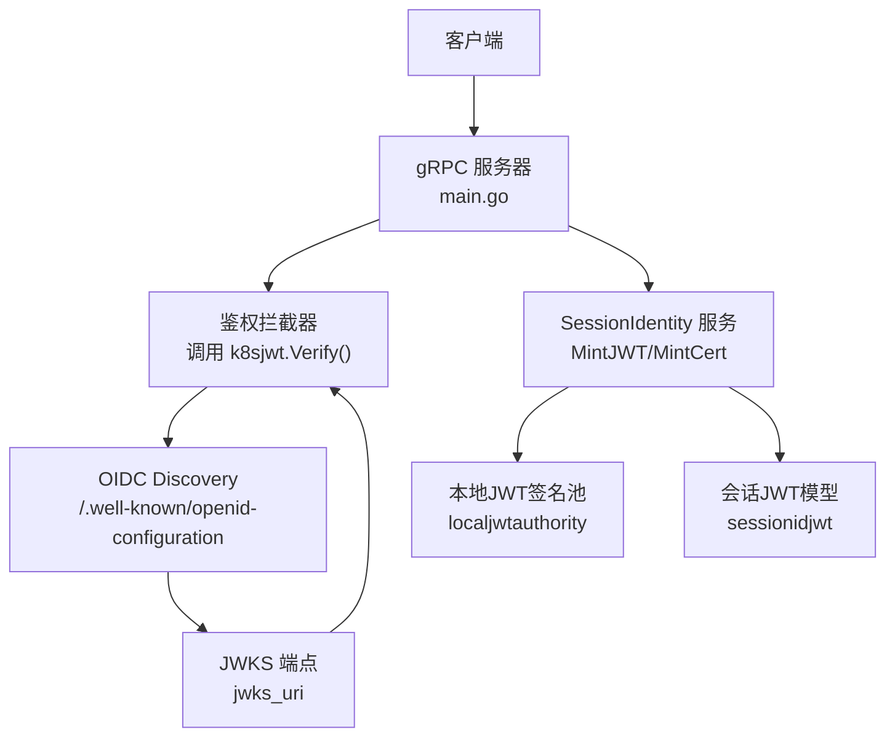
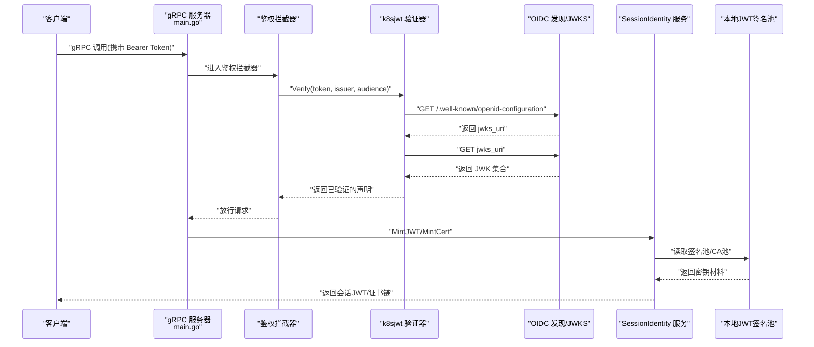
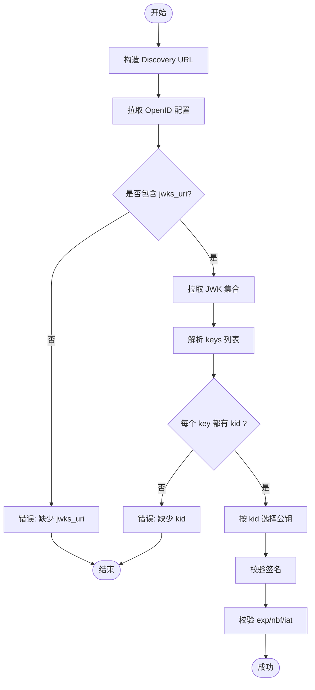
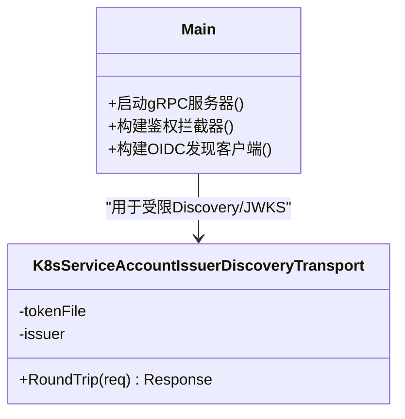
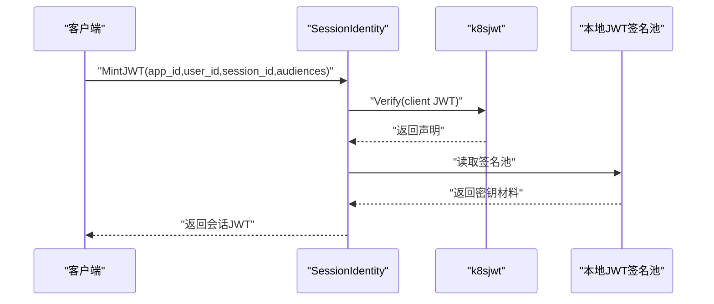
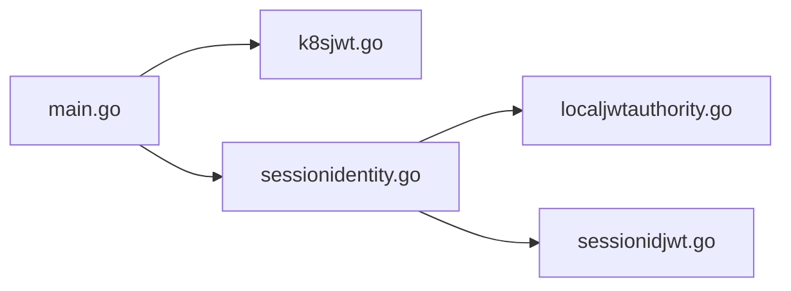

# 身份提供商集成问题排查

<cite>
**本文引用的文件**   
- [cmd/ateapi/main.go](file://cmd/ateapi/main.go)
- [cmd/ateapi/internal/k8sjwt/k8sjwt.go](file://cmd/ateapi/internal/k8sjwt/k8sjwt.go)
- [cmd/ateapi/internal/sessionidentity/sessionidentity.go](file://cmd/ateapi/internal/sessionidentity/sessionidentity.go)
- [cmd/ateapi/internal/sessionidjwt/sessionidjwt.go](file://cmd/ateapi/internal/sessionidjwt/sessionidjwt.go)
- [pkg/proto/ateapipb/ateapi.pb.go](file://pkg/proto/ateapipb/ateapi.pb.go)
- [internal/localjwtauthority/localjwtauthority.go](file://internal/localjwtauthority/localjwtauthority.go)
</cite>

## 目录
1. [简介](#简介)
2. [项目结构](#项目结构)
3. [核心组件](#核心组件)
4. [架构总览](#架构总览)
5. [详细组件分析](#详细组件分析)
6. [依赖关系分析](#依赖关系分析)
7. [性能与可用性考量](#性能与可用性考量)
8. [故障排查指南](#故障排查指南)
9. [结论](#结论)
10. [附录：常见OIDC配置问题与最佳实践](#附录常见oidc配置问题与最佳实践)

## 简介
本指南聚焦于身份提供商（IdP）集成认证失败的诊断与解决，覆盖以下关键场景：
- OAuth2/OIDC 配置错误（授权服务器地址、客户端ID、重定向URL等）
- 令牌交换失败（网络连通性、API端点可用性、响应格式验证）
- 用户信息获取错误（声明映射、权限转换、会话管理）
并提供具体配置示例与集成最佳实践，帮助快速定位并修复问题。

## 项目结构
本项目在 gRPC 服务中实现了基于 Kubernetes ServiceAccount JWT 的鉴权流程，并通过 SessionIdentity 服务签发“会话JWT”和“会话证书”。关键路径如下：
- 入口与启动：主进程加载参数、构建 gRPC 服务器、注册拦截器与服务
- 鉴权拦截器：对每个请求校验 Bearer Token（Kubernetes ServiceAccount JWT），通过 k8sjwt 包完成 OIDC Discovery 与 JWKS 拉取、签名校验与时序检查
- 会话身份服务：接收已认证的客户端请求，签发会话JWT与会话证书

图表来源
- [cmd/ateapi/main.go:171-196](file://cmd/ateapi/main.go#L171-L196)
- [cmd/ateapi/internal/k8sjwt/k8sjwt.go:118-261](file://cmd/ateapi/internal/k8sjwt/k8sjwt.go#L118-L261)
- [cmd/ateapi/internal/sessionidentity/sessionidentity.go:71-142](file://cmd/ateapi/internal/sessionidentity/sessionidentity.go#L71-L142)
- [cmd/ateapi/internal/sessionidjwt/sessionidjwt.go:30-48](file://cmd/ateapi/internal/sessionidjwt/sessionidjwt.go#L30-L48)
- [internal/localjwtauthority/localjwtauthority.go](file://internal/localjwtauthority/localjwtauthority.go)

章节来源
- [cmd/ateapi/main.go:56-77](file://cmd/ateapi/main.go#L56-L77)
- [cmd/ateapi/main.go:171-196](file://cmd/ateapi/main.go#L171-L196)
- [cmd/ateapi/internal/k8sjwt/k8sjwt.go:118-261](file://cmd/ateapi/internal/k8sjwt/k8sjwt.go#L118-L261)
- [cmd/ateapi/internal/sessionidentity/sessionidentity.go:71-142](file://cmd/ateapi/internal/sessionidentity/sessionidentity.go#L71-L142)

## 核心组件
- 鉴权拦截器与入口
  - 负责解析 gRPC 请求中的 Authorization Bearer Token，并调用 k8sjwt.Verify 进行 OIDC 发现、JWKS 拉取、签名校验与时序断言
  - 支持为集群内 Kubernetes Issuer 注入 ServiceAccount Token 以访问受限的 Discovery/JWKS 端点
- OIDC 发现与密钥分发
  - 从 Issuer 的 /.well-known/openid-configuration 获取 jwks_uri，再拉取公钥集合，按 kid 选择对应公钥验签
- 会话身份服务
  - 校验客户端 JWT 后，使用本地 JWT 签名池签发会话JWT；或基于 mTLS 签发会话证书（SPIFFE URI）
- 会话JWT模型
  - 定义标准 JWT 声明及扩展字段（应用ID、用户ID、会话ID）

章节来源
- [cmd/ateapi/main.go:171-196](file://cmd/ateapi/main.go#L171-L196)
- [cmd/ateapi/internal/k8sjwt/k8sjwt.go:347-431](file://cmd/ateapi/internal/k8sjwt/k8sjwt.go#L347-L431)
- [cmd/ateapi/internal/sessionidentity/sessionidentity.go:71-142](file://cmd/ateapi/internal/sessionidentity/sessionidentity.go#L71-L142)
- [cmd/ateapi/internal/sessionidjwt/sessionidjwt.go:30-48](file://cmd/ateapi/internal/sessionidjwt/sessionidjwt.go#L30-L48)

## 架构总览
下图展示了从客户端到 IdP 的完整认证与令牌交换链路，以及会话凭证签发过程。

图表来源
- [cmd/ateapi/main.go:171-196](file://cmd/ateapi/main.go#L171-L196)
- [cmd/ateapi/internal/k8sjwt/k8sjwt.go:118-261](file://cmd/ateapi/internal/k8sjwt/k8sjwt.go#L118-L261)
- [cmd/ateapi/internal/k8sjwt/k8sjwt.go:367-431](file://cmd/ateapi/internal/k8sjwt/k8sjwt.go#L367-L431)
- [cmd/ateapi/internal/sessionidentity/sessionidentity.go:71-142](file://cmd/ateapi/internal/sessionidentity/sessionidentity.go#L71-L142)

## 详细组件分析

### 组件A：OIDC 发现与密钥拉取（k8sjwt）
- 功能要点
  - 根据 Issuer 拼接 Discovery 文档 URL，拉取 jwks_uri
  - 拉取 JWK 集合并校验每个 key 的 kid 存在
  - 根据 JWT header.kid 选择公钥，执行 RS/EC 签名校验
  - 校验 iss、aud、exp/nbf/iat 时序（含允许的时间偏差）
- 常见问题定位
  - Discovery 文档不可达或返回非 200
  - jwks_uri 不可达或返回格式异常
  - kid 缺失或不匹配
  - 算法不支持或公钥类型不匹配
  - 时间戳越界或时钟不同步
- 优化建议
  - 缓存 JWK 集合并按 kid 命中，避免每次请求都拉取
  - 为 Discovery/JWKS 设置合理的超时与重试策略

图表来源
- [cmd/ateapi/internal/k8sjwt/k8sjwt.go:367-431](file://cmd/ateapi/internal/k8sjwt/k8sjwt.go#L367-L431)
- [cmd/ateapi/internal/k8sjwt/k8sjwt.go:118-261](file://cmd/ateapi/internal/k8sjwt/k8sjwt.go#L118-L261)

章节来源
- [cmd/ateapi/internal/k8sjwt/k8sjwt.go:118-261](file://cmd/ateapi/internal/k8sjwt/k8sjwt.go#L118-L261)
- [cmd/ateapi/internal/k8sjwt/k8sjwt.go:347-431](file://cmd/ateapi/internal/k8sjwt/k8sjwt.go#L347-L431)

### 组件B：鉴权拦截器与入口（main.go）
- 功能要点
  - 解析命令行参数（如 client-jwt-issuer、client-jwt-audience）
  - 构建 gRPC 服务器，注册鉴权拦截器
  - 针对集群内 Kubernetes Issuer，自动注入 ServiceAccount Token 访问受限 Discovery/JWKS
- 常见问题定位
  - 未配置或错误配置 client-jwt-issuer/client-jwt-audience
  - 集群内 Issuer 的 CA 文件不可读或未正确加载
  - 自定义 Transport 未正确注入 Bearer Token
- 优化建议
  - 将 Discovery/JWKS 的 HTTP 客户端可配置化（超时、重试、代理）
  - 增加日志记录关键步骤（Discovery/JWKS 拉取结果）

图表来源
- [cmd/ateapi/main.go:375-436](file://cmd/ateapi/main.go#L375-L436)
- [cmd/ateapi/main.go:171-196](file://cmd/ateapi/main.go#L171-L196)

章节来源
- [cmd/ateapi/main.go:56-77](file://cmd/ateapi/main.go#L56-L77)
- [cmd/ateapi/main.go:375-436](file://cmd/ateapi/main.go#L375-L436)
- [cmd/ateapi/main.go:171-196](file://cmd/ateapi/main.go#L171-L196)

### 组件C：会话身份服务（SessionIdentity）
- 功能要点
  - MintJWT：校验客户端 JWT 后，使用本地 JWT 签名池签发会话JWT（包含 aud、sub、iss、nbf/exp/iat 及扩展字段）
  - MintCert：基于 mTLS 对等证书签发会话证书（SPIFFE URI）
- 常见问题定位
  - 客户端 JWT 校验失败（issuer/audience 不匹配、kid 未知、签名无效、时间过期）
  - 本地 JWT 签名池文件不可读或反序列化失败
  - 请求未携带 audience 或为空
  - 证书签发时 CSR 解析失败或签名校验失败
- 优化建议
  - 缓存签名池与 CA 池，减少磁盘 I/O
  - 增加详细的错误码与上下文日志，便于快速定位

图表来源
- [cmd/ateapi/internal/sessionidentity/sessionidentity.go:71-142](file://cmd/ateapi/internal/sessionidentity/sessionidentity.go#L71-L142)
- [cmd/ateapi/internal/sessionidjwt/sessionidjwt.go:30-48](file://cmd/ateapi/internal/sessionidjwt/sessionidjwt.go#L30-L48)
- [internal/localjwtauthority/localjwtauthority.go](file://internal/localjwtauthority/localjwtauthority.go)

章节来源
- [cmd/ateapi/internal/sessionidentity/sessionidentity.go:71-142](file://cmd/ateapi/internal/sessionidentity/sessionidentity.go#L71-L142)
- [cmd/ateapi/internal/sessionidjwt/sessionidjwt.go:30-48](file://cmd/ateapi/internal/sessionidjwt/sessionidjwt.go#L30-L48)

## 依赖关系分析
- main.go 依赖 k8sjwt 进行 OIDC 发现与密钥拉取，并依赖 sessionidentity 提供会话凭证签发能力
- sessionidentity 依赖 localjwtauthority 提供的签名池与 sessionidjwt 的模型与编解码
- 对外部 IdP 的依赖集中在 Discovery 与 JWKS 两个 HTTP 端点

图表来源
- [cmd/ateapi/main.go:171-196](file://cmd/ateapi/main.go#L171-L196)
- [cmd/ateapi/internal/k8sjwt/k8sjwt.go:118-261](file://cmd/ateapi/internal/k8sjwt/k8sjwt.go#L118-L261)
- [cmd/ateapi/internal/sessionidentity/sessionidentity.go:71-142](file://cmd/ateapi/internal/sessionidentity/sessionidentity.go#L71-L142)
- [internal/localjwtauthority/localjwtauthority.go](file://internal/localjwtauthority/localjwtauthority.go)
- [cmd/ateapi/internal/sessionidjwt/sessionidjwt.go:30-48](file://cmd/ateapi/internal/sessionidjwt/sessionidjwt.go#L30-L48)

章节来源
- [cmd/ateapi/main.go:171-196](file://cmd/ateapi/main.go#L171-L196)
- [cmd/ateapi/internal/k8sjwt/k8sjwt.go:118-261](file://cmd/ateapi/internal/k8sjwt/k8sjwt.go#L118-L261)
- [cmd/ateapi/internal/sessionidentity/sessionidentity.go:71-142](file://cmd/ateapi/internal/sessionidentity/sessionidentity.go#L71-L142)

## 性能与可用性考量
- 缓存策略
  - 缓存 JWK 集合与本地签名池，降低网络与磁盘 I/O
- 超时与重试
  - 为 Discovery/JWKS 请求设置合理超时与指数退避重试
- 资源限制
  - 控制并发拉取与签名操作，避免峰值拥塞
- 可观测性
  - 记录关键指标（拉取耗时、失败率、签名耗时）与追踪跨度

[本节为通用指导，无需代码引用]

## 故障排查指南

### 一、OAuth2/OIDC 配置错误
- 典型症状
  - 鉴权拦截器返回未认证或内部错误
  - Discovery/JWKS 拉取失败
- 排查步骤
  - 确认 client-jwt-issuer 指向正确的授权服务器地址
  - 确认 client-jwt-audience 与令牌中的 aud 一致
  - 若为集群内 Kubernetes Issuer，确保 CA 文件可读且正确加载
  - 检查自定义 Transport 是否正确注入 ServiceAccount Token
- 相关实现参考
  - 参数定义与日志输出
  - 构建 OIDC 发现客户端与注入 Token 的逻辑

章节来源
- [cmd/ateapi/main.go:56-77](file://cmd/ateapi/main.go#L56-L77)
- [cmd/ateapi/main.go:375-436](file://cmd/ateapi/main.go#L375-L436)

### 二、令牌交换失败（网络连通性、端点可用性、响应格式）
- 典型症状
  - 无法拉取 Discovery 文档或 JWKS
  - 返回非 200 状态码或 JSON 解析失败
  - kid 缺失或不匹配导致验签失败
- 排查步骤
  - 直接 curl 测试 Discovery 与 JWKS 端点可达性与响应体
  - 检查网络策略、代理、DNS 解析
  - 核对 jwks_uri 是否指向有效端点
  - 确认 JWK 集合中每个 key 均包含 kid
- 相关实现参考
  - Discovery/JWKS 拉取与解析逻辑
  - kid 校验与公钥选择

章节来源
- [cmd/ateapi/internal/k8sjwt/k8sjwt.go:367-431](file://cmd/ateapi/internal/k8sjwt/k8sjwt.go#L367-L431)
- [cmd/ateapi/internal/k8sjwt/k8sjwt.go:118-261](file://cmd/ateapi/internal/k8sjwt/k8sjwt.go#L118-L261)

### 三、用户信息获取错误（声明映射、权限转换、会话管理）
- 典型症状
  - 会话JWT签发失败或返回空 audience
  - 会话证书签发失败（CSR 解析或签名校验错误）
- 排查步骤
  - 确认 MintJWT 请求包含至少一个 audience
  - 检查本地 JWT 签名池文件可读且反序列化成功
  - 对于证书签发，检查 CSR 格式与签名有效性
  - 核对会话JWT的 sub/iss/aud 是否符合预期
- 相关实现参考
  - MintJWT/MintCert 处理流程
  - 会话JWT模型与扩展字段

章节来源
- [cmd/ateapi/internal/sessionidentity/sessionidentity.go:71-142](file://cmd/ateapi/internal/sessionidentity/sessionidentity.go#L71-L142)
- [cmd/ateapi/internal/sessionidjwt/sessionidjwt.go:30-48](file://cmd/ateapi/internal/sessionidjwt/sessionidjwt.go#L30-L48)
- [pkg/proto/ateapipb/ateapi.pb.go:1947-2077](file://pkg/proto/ateapipb/ateapi.pb.go#L1947-L2077)

## 结论
通过明确 OIDC 发现与 JWKS 拉取流程、严格校验 kid 与签名、规范会话JWT与证书签发，并结合缓存与可观测性优化，可以显著降低身份提供商集成过程中的失败概率。建议在部署前完成端到端连通性测试与最小可用用例验证。

[本节为总结，无需代码引用]

## 附录：常见OIDC配置问题与最佳实践

- 授权服务器地址（Issuer）
  - 必须为 HTTPS 且可被服务端访问
  - 集群内 Kubernetes Issuer 需正确配置 CA 与 Token 注入
- 客户端ID与受众（Audience）
  - 服务端期望的 audience 必须出现在令牌的 aud 中
  - 多受众场景下确保至少包含目标服务标识
- 重定向URL（Redirect URI）
  - 若采用浏览器流，需在 IdP 侧精确配置回调地址（协议、主机、端口、路径）
- 令牌交换端点（Token Endpoint）
  - 确保端点可达、返回符合规范的 JSON
  - 处理 4xx/5xx 与超时重试
- 用户信息端点（UserInfo）
  - 校验返回的用户声明与本地权限模型的映射规则
  - 注意敏感字段的安全存储与最小暴露原则
- 最佳实践
  - 启用 JWK 缓存与会话凭证缓存
  - 统一错误码与结构化日志
  - 定期轮换密钥并平滑过渡
  - 建立健康检查与告警（Discovery/JWKS 可达性、签名成功率）

[本节为通用指导，无需代码引用]
