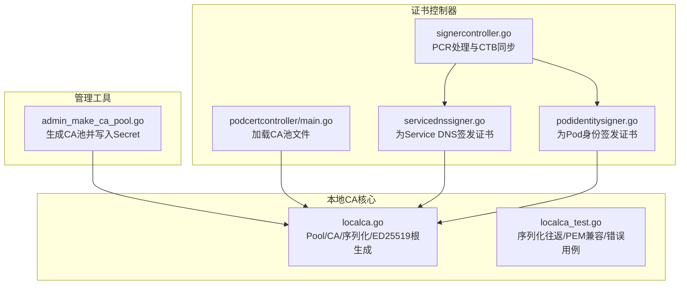
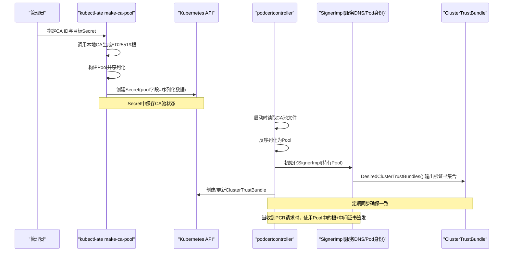
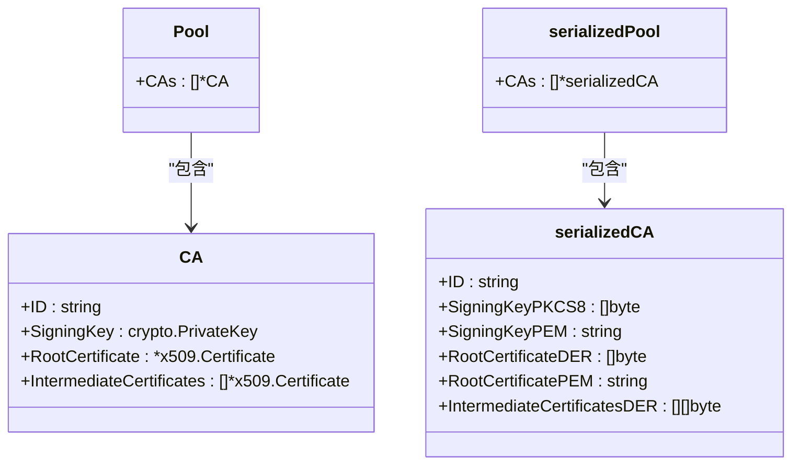
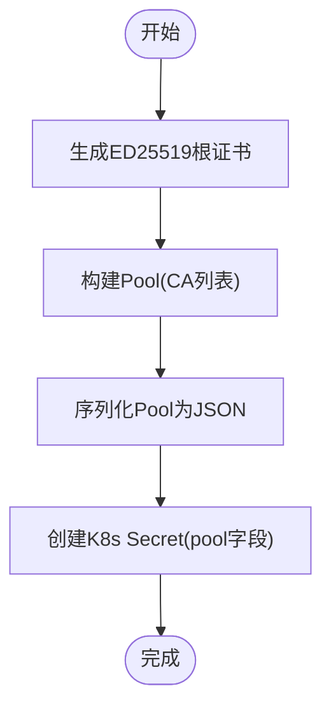
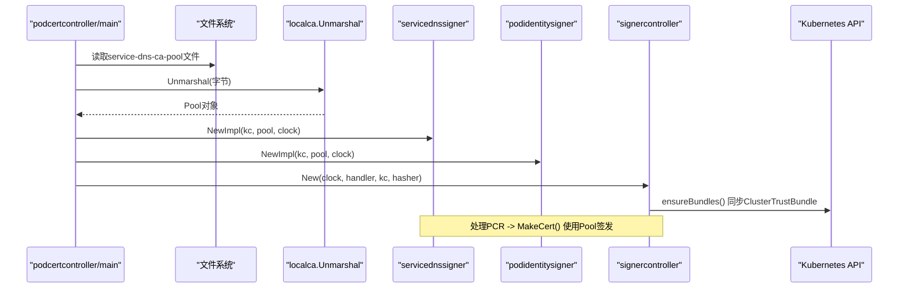
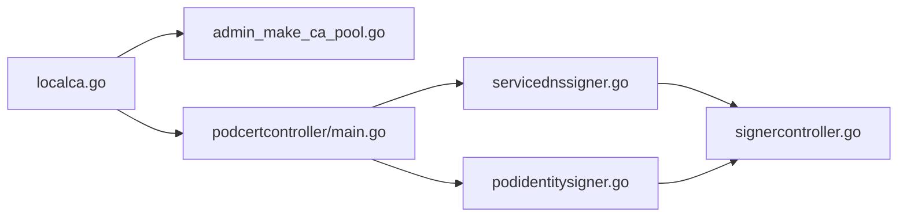

# CA证书问题

<cite>
**本文引用的文件**   
- [internal/localca/localca.go](file://internal/localca/localca.go)
- [internal/localca/localca_test.go](file://internal/localca/localca_test.go)
- [cmd/kubectl-ate/internal/cmd/admin_make_ca_pool.go](file://cmd/kubectl-ate/internal/cmd/admin_make_ca_pool.go)
- [cmd/podcertcontroller/main.go](file://cmd/podcertcontroller/main.go)
- [cmd/podcertcontroller/internal/servicednssigner/servicednssigner.go](file://cmd/podcertcontroller/internal/servicednssigner/servicednssigner.go)
- [cmd/podcertcontroller/internal/podidentitysigner/podidentitysigner.go](file://cmd/podcertcontroller/internal/podidentitysigner/podidentitysigner.go)
- [cmd/podcertcontroller/internal/signercontroller/signercontroller.go](file://cmd/podcertcontroller/internal/signercontroller/signercontroller.go)
</cite>

## 目录
1. [简介](#简介)
2. [项目结构](#项目结构)
3. [核心组件](#核心组件)
4. [架构总览](#架构总览)
5. [详细组件分析](#详细组件分析)
6. [依赖关系分析](#依赖关系分析)
7. [性能与可靠性考虑](#性能与可靠性考虑)
8. [故障排查指南](#故障排查指南)
9. [结论](#结论)
10. [附录](#附录)

## 简介
本文件聚焦于本地CA（Certificate Authority）在系统中的工作原理、配置与管理，涵盖根证书生成、中间证书管理、证书链验证；CA池状态文件的序列化/反序列化格式与错误处理；以及CA证书轮换机制与监控告警建议。文档面向运维与研发人员，既提供概念性说明，也给出与代码实现对应的定位路径，便于快速定位与排障。

## 项目结构
与CA相关的关键代码分布在以下模块：
- 本地CA核心库：负责CA对象模型、序列化/反序列化、ED25519根证书生成等
- 命令行工具：用于生成新的CA池并写入Kubernetes Secret
- Pod证书控制器：读取CA池文件，签发服务DNS与Pod身份证书，并维护集群信任束（ClusterTrustBundle）

图表来源
- [internal/localca/localca.go:30-51](file://internal/localca/localca.go#L30-L51)
- [internal/localca/localca_test.go:85-138](file://internal/localca/localca_test.go#L85-L138)
- [cmd/kubectl-ate/internal/cmd/admin_make_ca_pool.go:32-80](file://cmd/kubectl-ate/internal/cmd/admin_make_ca_pool.go#L32-L80)
- [cmd/podcertcontroller/main.go:123-149](file://cmd/podcertcontroller/main.go#L123-L149)
- [cmd/podcertcontroller/internal/servicednssigner/servicednssigner.go:62-90](file://cmd/podcertcontroller/internal/servicednssigner/servicednssigner.go#L62-L90)
- [cmd/podcertcontroller/internal/podidentitysigner/podidentitysigner.go:62-90](file://cmd/podcertcontroller/internal/podidentitysigner/podidentitysigner.go#L62-L90)
- [cmd/podcertcontroller/internal/signercontroller/signercontroller.go:203-249](file://cmd/podcertcontroller/internal/signercontroller/signercontroller.go#L203-L249)

章节来源
- [internal/localca/localca.go:30-51](file://internal/localca/localca.go#L30-L51)
- [cmd/kubectl-ate/internal/cmd/admin_make_ca_pool.go:32-80](file://cmd/kubectl-ate/internal/cmd/admin_make_ca_pool.go#L32-L80)
- [cmd/podcertcontroller/main.go:123-149](file://cmd/podcertcontroller/main.go#L123-L149)

## 核心组件
- Pool/CA数据结构
  - Pool：包含多个CA实例的集合
  - CA：包含ID、私钥、根证书、可选的中间证书列表
- 序列化/反序列化
  - 支持PKCS#8二进制或PEM格式的私钥
  - 支持DER或PEM格式的根证书
  - 中间证书以DER数组存储
- ED25519根证书生成
  - 默认有效期一年，具备CA标志与签名用途
- 证书控制器
  - 从文件加载CA池
  - 根据CA池签发不同用途的证书（服务DNS、Pod身份）
  - 将根证书聚合到ClusterTrustBundle供集群内使用

章节来源
- [internal/localca/localca.go:30-51](file://internal/localca/localca.go#L30-L51)
- [internal/localca/localca.go:53-81](file://internal/localca/localca.go#L53-L81)
- [internal/localca/localca.go:83-120](file://internal/localca/localca.go#L83-L120)
- [internal/localca/localca.go:122-157](file://internal/localca/localca.go#L122-L157)
- [internal/localca/localca.go:159-192](file://internal/localca/localca.go#L159-L192)
- [cmd/podcertcontroller/main.go:123-149](file://cmd/podcertcontroller/main.go#L123-L149)
- [cmd/podcertcontroller/internal/servicednssigner/servicednssigner.go:62-90](file://cmd/podcertcontroller/internal/servicednssigner/servicednssigner.go#L62-L90)
- [cmd/podcertcontroller/internal/podidentitysigner/podidentitysigner.go:62-90](file://cmd/podcertcontroller/internal/podidentitysigner/podidentitysigner.go#L62-L90)

## 架构总览
下图展示了从“生成CA池”到“控制器加载并签发证书”的整体流程，以及与Kubernetes资源的交互。

图表来源
- [cmd/kubectl-ate/internal/cmd/admin_make_ca_pool.go:32-80](file://cmd/kubectl-ate/internal/cmd/admin_make_ca_pool.go#L32-L80)
- [internal/localca/localca.go:53-81](file://internal/localca/localca.go#L53-L81)
- [cmd/podcertcontroller/main.go:123-149](file://cmd/podcertcontroller/main.go#L123-L149)
- [cmd/podcertcontroller/internal/signercontroller/signercontroller.go:203-249](file://cmd/podcertcontroller/internal/signercontroller/signercontroller.go#L203-L249)
- [cmd/podcertcontroller/internal/servicednssigner/servicednssigner.go:62-90](file://cmd/podcertcontroller/internal/servicednssigner/servicednssigner.go#L62-L90)
- [cmd/podcertcontroller/internal/podidentitysigner/podidentitysigner.go:62-90](file://cmd/podcertcontroller/internal/podidentitysigner/podidentitysigner.go#L62-L90)

## 详细组件分析

### 本地CA核心（Pool/CA/序列化/根生成）
- 数据结构
  - Pool：包含多个CA
  - CA：ID、私钥、根证书、中间证书列表
- 序列化/反序列化
  - 私钥优先解析PKCS#8二进制，否则回退到PEM（支持PKCS#8/EC/PKCS#1）
  - 根证书优先解析DER，否则回退到PEM（要求CERTIFICATE类型）
  - 中间证书以DER数组存储
- 根证书生成
  - 算法：ED25519
  - 有效期：1年
  - 用途：数字签名 + 证书签名
  - 自签：模板作为颁发者与主题

图表来源
- [internal/localca/localca.go:30-51](file://internal/localca/localca.go#L30-L51)
- [internal/localca/localca.go:41-51](file://internal/localca/localca.go#L41-L51)

章节来源
- [internal/localca/localca.go:30-51](file://internal/localca/localca.go#L30-L51)
- [internal/localca/localca.go:53-81](file://internal/localca/localca.go#L53-L81)
- [internal/localca/localca.go:83-120](file://internal/localca/localca.go#L83-L120)
- [internal/localca/localca.go:122-157](file://internal/localca/localca.go#L122-L157)
- [internal/localca/localca.go:159-192](file://internal/localca/localca.go#L159-L192)

### 管理工具：生成CA池并写入Secret
- 功能
  - 调用本地CA生成ED25519根
  - 构造Pool并序列化
  - 将序列化结果写入Kubernetes Secret的pool字段
- 典型用法
  - 通过命令行参数指定初始CA ID、目标Secret命名空间与名称

图表来源
- [cmd/kubectl-ate/internal/cmd/admin_make_ca_pool.go:32-80](file://cmd/kubectl-ate/internal/cmd/admin_make_ca_pool.go#L32-L80)
- [internal/localca/localca.go:159-192](file://internal/localca/localca.go#L159-L192)
- [internal/localca/localca.go:53-81](file://internal/localca/localca.go#L53-L81)

章节来源
- [cmd/kubectl-ate/internal/cmd/admin_make_ca_pool.go:32-80](file://cmd/kubectl-ate/internal/cmd/admin_make_ca_pool.go#L32-L80)

### 证书控制器：加载CA池与签发证书
- 启动阶段
  - 从配置文件指定的文件路径读取CA池字节
  - 反序列化为Pool
  - 初始化两个SignerImpl（服务DNS、Pod身份），并运行控制器循环
- 签发流程（以服务DNS为例）
  - 计算可签发的DNS名称集合
  - 基于Pool中的根证书与私钥签发主体证书
  - 组装证书链（主体证书 + 中间证书）
  - 返回BeginRefreshAt以便客户端提前刷新
- 信任分发
  - 将Pool中所有根证书合并为ClusterTrustBundle
  - 控制器周期性同步，确保集群内可用

图表来源
- [cmd/podcertcontroller/main.go:123-149](file://cmd/podcertcontroller/main.go#L123-L149)
- [internal/localca/localca.go:83-120](file://internal/localca/localca.go#L83-L120)
- [cmd/podcertcontroller/internal/servicednssigner/servicednssigner.go:92-210](file://cmd/podcertcontroller/internal/servicednssigner/servicednssigner.go#L92-L210)
- [cmd/podcertcontroller/internal/podidentitysigner/podidentitysigner.go:92-175](file://cmd/podcertcontroller/internal/podidentitysigner/podidentitysigner.go#L92-L175)
- [cmd/podcertcontroller/internal/signercontroller/signercontroller.go:203-249](file://cmd/podcertcontroller/internal/signercontroller/signercontroller.go#L203-L249)

章节来源
- [cmd/podcertcontroller/main.go:123-149](file://cmd/podcertcontroller/main.go#L123-L149)
- [cmd/podcertcontroller/internal/servicednssigner/servicednssigner.go:92-210](file://cmd/podcertcontroller/internal/servicednssigner/servicednssigner.go#L92-L210)
- [cmd/podcertcontroller/internal/podidentitysigner/podidentitysigner.go:92-175](file://cmd/podcertcontroller/internal/podidentitysigner/podidentitysigner.go#L92-L175)
- [cmd/podcertcontroller/internal/signercontroller/signercontroller.go:203-249](file://cmd/podcertcontroller/internal/signercontroller/signercontroller.go#L203-L249)

## 依赖关系分析
- localca包被多处消费：
  - 管理工具用于生成与持久化CA池
  - 控制器用于加载与使用CA池进行签发
- 控制器内部：
  - signercontroller协调PCR事件与SignerImpl实现
  - servicednssigner与podidentitysigner分别实现不同用途的证书签发逻辑
  - 两者均依赖localca.Pool进行签名与信任束构建

图表来源
- [internal/localca/localca.go:30-51](file://internal/localca/localca.go#L30-L51)
- [cmd/kubectl-ate/internal/cmd/admin_make_ca_pool.go:32-80](file://cmd/kubectl-ate/internal/cmd/admin_make_ca_pool.go#L32-L80)
- [cmd/podcertcontroller/main.go:123-149](file://cmd/podcertcontroller/main.go#L123-L149)
- [cmd/podcertcontroller/internal/servicednssigner/servicednssigner.go:62-90](file://cmd/podcertcontroller/internal/servicednssigner/servicednssigner.go#L62-L90)
- [cmd/podcertcontroller/internal/podidentitysigner/podidentitysigner.go:62-90](file://cmd/podcertcontroller/internal/podidentitysigner/podidentitysigner.go#L62-L90)
- [cmd/podcertcontroller/internal/signercontroller/signercontroller.go:203-249](file://cmd/podcertcontroller/internal/signercontroller/signercontroller.go#L203-L249)

章节来源
- [internal/localca/localca.go:30-51](file://internal/localca/localca.go#L30-L51)
- [cmd/podcertcontroller/internal/signercontroller/signercontroller.go:203-249](file://cmd/podcertcontroller/internal/signercontroller/signercontroller.go#L203-L249)

## 性能与可靠性考虑
- 序列化开销
  - Pool中包含多个CA与证书，序列化/反序列化涉及大量二进制数据，建议在冷启动或变更时执行，避免热路径频繁读写
- 文件I/O
  - 控制器启动时一次性读取并解析CA池文件，后续在内存中使用，减少磁盘访问
- 并发与一致性
  - ClusterTrustBundle由单一副本维护，避免多副本竞争导致频繁更新
- 证书生命周期
  - 主体证书有效期较短（例如24小时），并在到期前设置BeginRefreshAt，引导客户端提前刷新，降低过期风险

[本节为通用指导，不直接分析具体文件]

## 故障排查指南

### 常见问题与定位
- 无法读取CA池文件
  - 现象：启动日志报错“Error reading ... CA pool state”
  - 排查：确认文件路径是否正确、权限是否允许进程读取
  - 参考位置：控制器启动时读取文件并记录错误
- 反序列化失败
  - 现象：启动日志报错“Error unmarshing ... CA pool state”
  - 可能原因：
    - JSON格式损坏或缺失必要字段
    - 私钥PEM块缺失或不支持的类型
    - 根证书PEM类型非CERTIFICATE
    - 中间证书DER无效
  - 参考位置：Unmarshal与parsePrivateKey/parseCertificate的错误分支
- 证书链验证失败
  - 现象：客户端校验证书链时报错
  - 排查：
    - 确认ClusterTrustBundle已正确同步且包含最新根证书
    - 检查中间证书是否存在且顺序正确
    - 验证主体证书是否由当前Pool中的根或中间证书签发
  - 参考位置：DesiredClusterTrustBundles与MakeCert中证书链组装

章节来源
- [cmd/podcertcontroller/main.go:123-149](file://cmd/podcertcontroller/main.go#L123-L149)
- [internal/localca/localca.go:83-120](file://internal/localca/localca.go#L83-L120)
- [internal/localca/localca.go:122-157](file://internal/localca/localca.go#L122-L157)
- [cmd/podcertcontroller/internal/servicednssigner/servicednssigner.go:62-90](file://cmd/podcertcontroller/internal/servicednssigner/servicednssigner.go#L62-L90)
- [cmd/podcertcontroller/internal/podidentitysigner/podidentitysigner.go:62-90](file://cmd/podcertcontroller/internal/podidentitysigner/podidentitysigner.go#L62-L90)
- [cmd/podcertcontroller/internal/signercontroller/signercontroller.go:203-249](file://cmd/podcertcontroller/internal/signercontroller/signercontroller.go#L203-L249)

### 关键错误路径与测试覆盖
- 反序列化错误用例
  - 通过篡改有效JSON中的字段，触发各解析分支的错误路径，验证错误信息准确性
- PEM兼容性与密钥类型
  - 测试覆盖RSA私钥PEM与证书PEM的反序列化
- 中间证书链验证
  - 验证中间证书可由根证书签发，且公钥匹配

章节来源
- [internal/localca/localca_test.go:252-276](file://internal/localca/localca_test.go#L252-L276)
- [internal/localca/localca_test.go:205-250](file://internal/localca/localca_test.go#L205-L250)
- [internal/localca/localca_test.go:140-203](file://internal/localca/localca_test.go#L140-L203)

## 结论
- 本地CA通过简洁的数据结构与灵活的序列化方案，实现了跨文件与Kubernetes Secret的可靠持久化
- 控制器将CA池与证书签发解耦，并通过ClusterTrustBundle向集群分发信任根
- 针对常见故障点（文件读取、反序列化、证书链验证）已有明确的错误路径与测试覆盖
- 建议在生产环境结合监控与告警，持续跟踪CA池健康与证书签发成功率

[本节为总结性内容，不直接分析具体文件]

## 附录

### CA池状态文件格式与管理
- 顶层结构
  - CAs：CA数组
- 每个CA条目
  - ID：字符串标识
  - SigningKeyPKCS8：PKCS#8私钥二进制（优先）
  - SigningKeyPEM：PEM编码私钥（回退）
  - RootCertificateDER：DER编码根证书（优先）
  - RootCertificatePEM：PEM编码根证书（回退）
  - IntermediateCertificatesDER：中间证书DER数组
- 兼容性
  - 同时支持PKCS#8与多种PEM私钥格式
  - 同时支持DER与PEM根证书格式
- 管理建议
  - 使用管理工具生成新CA池并写入Secret
  - 控制器启动时从文件加载，避免运行时频繁IO
  - 对Secret与文件实施严格的访问控制与备份策略

章节来源
- [internal/localca/localca.go:41-51](file://internal/localca/localca.go#L41-L51)
- [internal/localca/localca.go:53-81](file://internal/localca/localca.go#L53-L81)
- [internal/localca/localca.go:83-120](file://internal/localca/localca.go#L83-L120)
- [cmd/kubectl-ate/internal/cmd/admin_make_ca_pool.go:32-80](file://cmd/kubectl-ate/internal/cmd/admin_make_ca_pool.go#L32-L80)

### CA证书轮换机制
- 自动轮换
  - 当前实现未内置自动轮换逻辑，控制器在启动时加载CA池文件
  - 主体证书设置了BeginRefreshAt，提示客户端提前刷新
- 手动更新步骤
  - 使用管理工具生成新的CA池并更新Secret
  - 重启控制器或实现文件监听重载（当前代码有TODO注释）
- 向后兼容
  - 反序列化兼容旧版PEM与DER混合格式
  - 中间证书为空时仍可正常签发与验证

章节来源
- [cmd/podcertcontroller/main.go:151](file://cmd/podcertcontroller/main.go#L151-L151)
- [cmd/podcertcontroller/internal/servicednssigner/servicednssigner.go:149-157](file://cmd/podcertcontroller/internal/servicednssigner/servicednssigner.go#L149-L157)
- [cmd/podcertcontroller/internal/podidentitysigner/podidentitysigner.go:108-116](file://cmd/podcertcontroller/internal/podidentitysigner/podidentitysigner.go#L108-L116)
- [internal/localca/localca.go:122-157](file://internal/localca/localca.go#L122-L157)

### 监控指标与告警建议
- 建议采集的指标
  - CA池文件读取成功/失败次数
  - CA池反序列化成功/失败次数
  - 证书签发成功/失败次数（按用途区分：服务DNS、Pod身份）
  - ClusterTrustBundle同步成功/失败次数
  - 证书即将过期数量（基于NotBefore/NotAfter与当前时间）
- 告警规则建议
  - 文件读取失败连续发生N次
  - 反序列化失败率超过阈值
  - 证书签发失败率异常升高
  - ClusterTrustBundle长时间未更新
  - 证书将在短时间内过期（如小于24小时）

[本节为通用指导，不直接分析具体文件]
