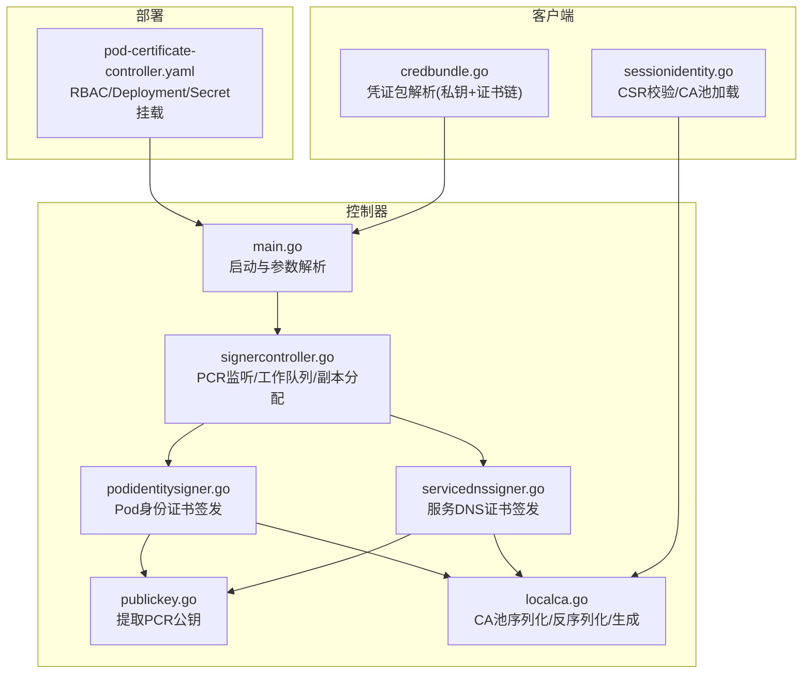
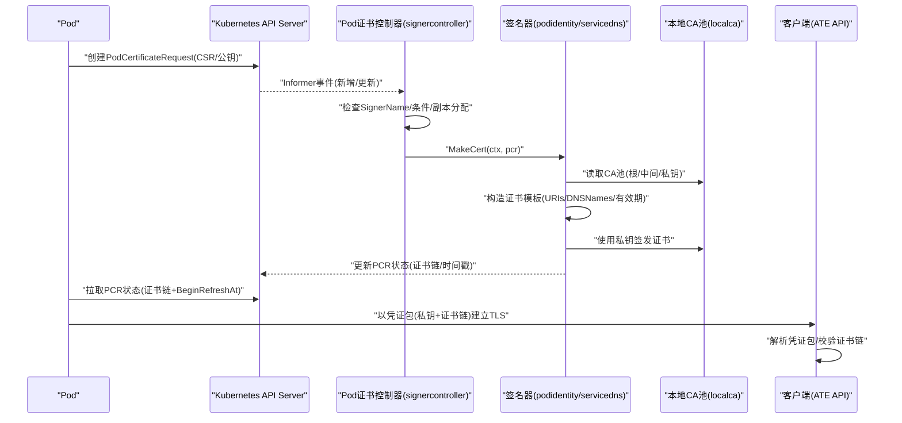
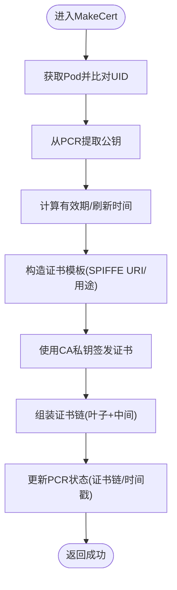
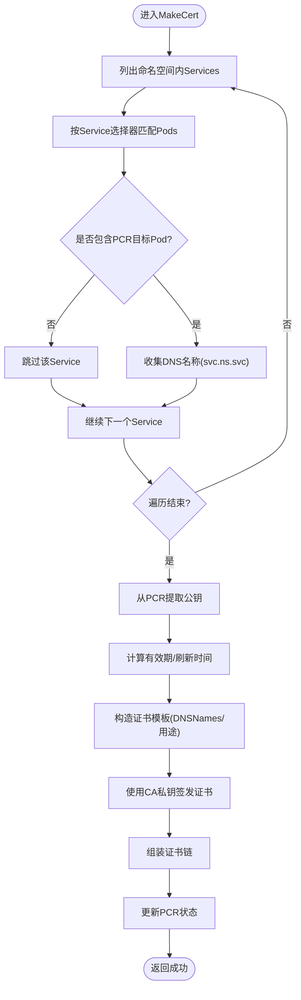
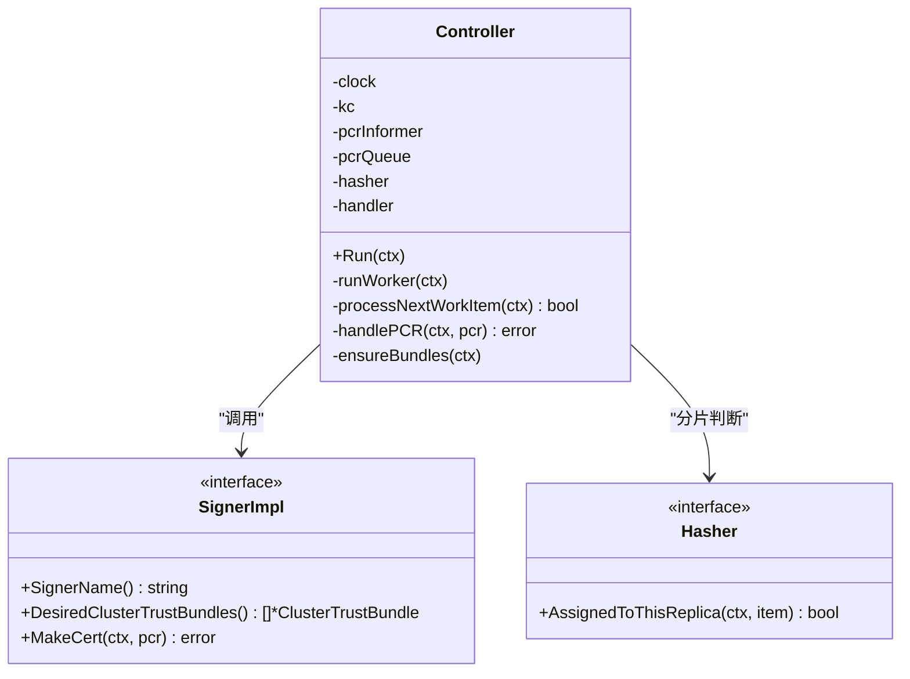
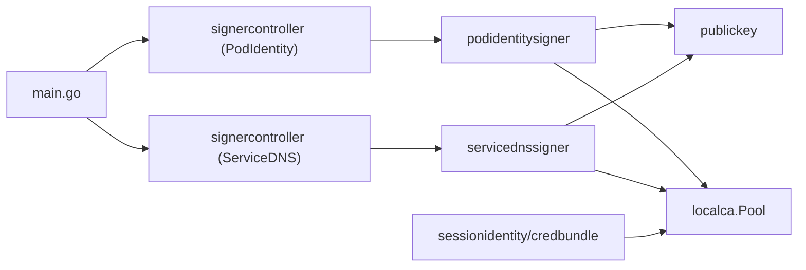

# Pod证书问题

<cite>
**本文引用的文件**   
- [cmd/podcertcontroller/main.go](file://cmd/podcertcontroller/main.go)
- [cmd/podcertcontroller/internal/signercontroller/signercontroller.go](file://cmd/podcertcontroller/internal/signercontroller/signercontroller.go)
- [cmd/podcertcontroller/internal/podidentitysigner/podidentitysigner.go](file://cmd/podcertcontroller/internal/podidentitysigner/podidentitysigner.go)
- [cmd/podcertcontroller/internal/servicednssigner/servicednssigner.go](file://cmd/podcertcontroller/internal/servicednssigner/servicednssigner.go)
- [cmd/podcertcontroller/internal/podcertificate/publickey.go](file://cmd/podcertcontroller/internal/podcertificate/publickey.go)
- [internal/localca/localca.go](file://internal/localca/localca.go)
- [manifests/ate-install/pod-certificate-controller.yaml](file://manifests/ate-install/pod-certificate-controller.yaml)
- [cmd/ateapi/internal/sessionidentity/sessionidentity.go](file://cmd/ateapi/internal/sessionidentity/sessionidentity.go)
- [cmd/ateapi/internal/credbundle/credbundle.go](file://cmd/ateapi/internal/credbundle/credbundle.go)
</cite>

## 目录
1. [简介](#简介)
2. [项目结构](#项目结构)
3. [核心组件](#核心组件)
4. [架构总览](#架构总览)
5. [详细组件分析](#详细组件分析)
6. [依赖关系分析](#依赖关系分析)
7. [性能与可靠性考虑](#性能与可靠性考虑)
8. [故障排查指南](#故障排查指南)
9. [结论](#结论)

## 简介
本文件聚焦于Pod身份证书在系统中的签发、公钥管理与分发、生命周期管理以及错误日志分析与调试方法。系统通过自定义的Pod证书控制器实现两类签名器：服务DNS证书与Pod身份证书，均基于本地CA池进行签发，并通过Kubernetes的ClusterTrustBundle机制对外分发信任根。客户端侧通过标准Kubernetes Pod Certificates机制获取证书链与私钥，并以凭证包形式加载到TLS配置中完成双向认证或服务端认证。

## 项目结构
与Pod证书相关的代码主要分布在以下位置：
- 控制器入口与参数解析：cmd/podcertcontroller/main.go
- 通用签名控制器（工作队列、Informer、副本分配）：cmd/podcertcontroller/internal/signercontroller/signercontroller.go
- 具体签名器实现：
  - Pod身份证书：cmd/podcertcontroller/internal/podidentitysigner/podidentitysigner.go
  - 服务DNS证书：cmd/podcertcontroller/internal/servicednssigner/servicednssigner.go
- 公共能力：
  - 从PCR中提取公钥：cmd/podcertcontroller/internal/podcertificate/publickey.go
  - 本地CA池序列化/反序列化与生成：internal/localca/localca.go
- 部署清单（RBAC、Deployment、Secret挂载等）：manifests/ate-install/pod-certificate-controller.yaml
- 客户端侧使用示例（CSR校验、CA池加载、凭证包解析）：
  - cmd/ateapi/internal/sessionidentity/sessionidentity.go
  - cmd/ateapi/internal/credbundle/credbundle.go

图表来源
- [cmd/podcertcontroller/main.go:80-158](file://cmd/podcertcontroller/main.go#L80-L158)
- [cmd/podcertcontroller/internal/signercontroller/signercontroller.go:62-114](file://cmd/podcertcontroller/internal/signercontroller/signercontroller.go#L62-L114)
- [cmd/podcertcontroller/internal/podidentitysigner/podidentitysigner.go:92-176](file://cmd/podcertcontroller/internal/podidentitysigner/podidentitysigner.go#L92-L176)
- [cmd/podcertcontroller/internal/servicednssigner/servicednssigner.go:92-211](file://cmd/podcertcontroller/internal/servicednssigner/servicednssigner.go#L92-L211)
- [cmd/podcertcontroller/internal/podcertificate/publickey.go:25-45](file://cmd/podcertcontroller/internal/podcertificate/publickey.go#L25-L45)
- [internal/localca/localca.go:83-120](file://internal/localca/localca.go#L83-L120)
- [manifests/ate-install/pod-certificate-controller.yaml:123-196](file://manifests/ate-install/pod-certificate-controller.yaml#L123-L196)
- [cmd/ateapi/internal/sessionidentity/sessionidentity.go:168-189](file://cmd/ateapi/internal/sessionidentity/sessionidentity.go#L168-L189)
- [cmd/ateapi/internal/credbundle/credbundle.go:34-92](file://cmd/ateapi/internal/credbundle/credbundle.go#L34-L92)

章节来源
- [cmd/podcertcontroller/main.go:80-158](file://cmd/podcertcontroller/main.go#L80-L158)
- [manifests/ate-install/pod-certificate-controller.yaml:87-196](file://manifests/ate-install/pod-certificate-controller.yaml#L87-L196)

## 核心组件
- 控制器主进程：负责读取kubeconfig/in-cluster配置、初始化Kubernetes客户端、加载两个CA池并启动对应的签名控制器。
- 签名控制器：监听PodCertificateRequest资源，按SignerName路由到具体签名器；使用Lease进行副本间任务分片；周期性维护ClusterTrustBundle。
- 签名器实现：
  - Pod身份证书：绑定ServiceAccount，设置SPIFFE URI，颁发ClientAuth用途证书。
  - 服务DNS证书：根据Service选择器匹配Pod，设置DNSNames，颁发ServerAuth/ClientAuth用途证书。
- 公钥提取：从PCR的StubPKCS10Request或PKIXPublicKey字段解析出SubjectPublicKeyInfo。
- 本地CA池：支持JSON序列化/反序列化，包含根证书、中间证书与私钥，用于签发与构建信任链。
- 部署清单：提供RBAC权限、Deployment参数、Secret卷挂载（CA池状态）。
- 客户端侧：
  - sessionidentity：加载CA池、解析并校验CSR。
  - credbundle：解析Kubernetes Pod Certificates写入的凭证包（PRIVATE KEY + CERTIFICATE链），供TLS使用。

章节来源
- [cmd/podcertcontroller/main.go:123-149](file://cmd/podcertcontroller/main.go#L123-L149)
- [cmd/podcertcontroller/internal/signercontroller/signercontroller.go:38-114](file://cmd/podcertcontroller/internal/signercontroller/signercontroller.go#L38-L114)
- [cmd/podcertcontroller/internal/podidentitysigner/podidentitysigner.go:58-90](file://cmd/podcertcontroller/internal/podidentitysigner/podidentitysigner.go#L58-L90)
- [cmd/podcertcontroller/internal/servicednssigner/servicednssigner.go:58-90](file://cmd/podcertcontroller/internal/servicednssigner/servicednssigner.go#L58-L90)
- [cmd/podcertcontroller/internal/podcertificate/publickey.go:25-45](file://cmd/podcertcontroller/internal/podcertificate/publickey.go#L25-L45)
- [internal/localca/localca.go:30-51](file://internal/localca/localca.go#L30-L51)
- [cmd/ateapi/internal/sessionidentity/sessionidentity.go:168-189](file://cmd/ateapi/internal/sessionidentity/sessionidentity.go#L168-L189)
- [cmd/ateapi/internal/credbundle/credbundle.go:34-92](file://cmd/ateapi/internal/credbundle/credbundle.go#L34-L92)

## 架构总览
下图展示了从Pod发起证书请求到控制器签发并回写状态，再到客户端加载凭证包的完整流程。

图表来源
- [cmd/podcertcontroller/internal/signercontroller/signercontroller.go:104-114](file://cmd/podcertcontroller/internal/signercontroller/signercontroller.go#L104-L114)
- [cmd/podcertcontroller/internal/podidentitysigner/podidentitysigner.go:92-176](file://cmd/podcertcontroller/internal/podidentitysigner/podidentitysigner.go#L92-L176)
- [cmd/podcertcontroller/internal/servicednssigner/servicednssigner.go:92-211](file://cmd/podcertcontroller/internal/servicednssigner/servicednssigner.go#L92-L211)
- [cmd/ateapi/internal/credbundle/credbundle.go:34-92](file://cmd/ateapi/internal/credbundle/credbundle.go#L34-L92)

## 详细组件分析

### 组件A：Pod身份证书签发器（PodIdentitySigner）
职责：
- 验证PCR中的Pod UID与真实Pod一致，防止伪造请求。
- 从PCR提取SubjectPublicKeyInfo。
- 计算证书有效期与刷新时间点，构造SPIFFE URI标识。
- 使用本地CA池签发证书，组装证书链并回写到PCR状态。

关键流程要点：
- 公钥提取：优先StubPKCS10Request，其次兼容PKIXPublicKey。
- 有效期策略：默认24小时，若MaxExpirationSeconds更小则采用其值；NotBefore提前2分钟，BeginRefreshAt为到期前30分钟。
- 证书用途：仅ClientAuth，URI标识指向命名空间与服务账号。

图表来源
- [cmd/podcertcontroller/internal/podidentitysigner/podidentitysigner.go:92-176](file://cmd/podcertcontroller/internal/podidentitysigner/podidentitysigner.go#L92-L176)
- [cmd/podcertcontroller/internal/podcertificate/publickey.go:25-45](file://cmd/podcertcontroller/internal/podcertificate/publickey.go#L25-L45)

章节来源
- [cmd/podcertcontroller/internal/podidentitysigner/podidentitysigner.go:92-176](file://cmd/podcertcontroller/internal/podidentitysigner/podidentitysigner.go#L92-L176)
- [cmd/podcertcontroller/internal/podcertificate/publickey.go:25-45](file://cmd/podcertcontroller/internal/podcertificate/publickey.go#L25-L45)

### 组件B：服务DNS证书签发器（ServiceDNSSigner）
职责：
- 列举命名空间内Service，筛选可映射到目标Pod的服务类型。
- 根据Service选择器匹配Pod集合，确认PCR对应Pod被服务覆盖。
- 构造DNSNames（如svc.namespace.svc），设置ServerAuth/ClientAuth用途。
- 使用本地CA池签发证书，组装证书链并回写到PCR状态。

关键流程要点：
- 服务匹配逻辑：遍历所有Service，对ClusterIP/NodePort/LoadBalancer类型执行LabelSelector匹配。
- 有效期策略：同Pod身份证书。
- DNS名称假设：当前实现基于常见集群DNS规则，特定环境（如VPC范围Cloud DNS）可能存在差异。

图表来源
- [cmd/podcertcontroller/internal/servicednssigner/servicednssigner.go:92-211](file://cmd/podcertcontroller/internal/servicednssigner/servicednssigner.go#L92-L211)
- [cmd/podcertcontroller/internal/podcertificate/publickey.go:25-45](file://cmd/podcertcontroller/internal/podcertificate/publickey.go#L25-L45)

章节来源
- [cmd/podcertcontroller/internal/servicednssigner/servicednssigner.go:92-211](file://cmd/podcertcontroller/internal/servicednssigner/servicednssigner.go#L92-L211)
- [cmd/podcertcontroller/internal/podcertificate/publickey.go:25-45](file://cmd/podcertcontroller/internal/podcertificate/publickey.go#L25-L45)

### 组件C：签名控制器（SignerController）
职责：
- 监听PodCertificateRequest资源变更，入队处理。
- 过滤非本控制器负责的SignerName。
- 跳过已Issued/Denied/Failed的请求。
- 使用Lease进行副本间任务分片，避免重复处理。
- 周期性维护ClusterTrustBundle，确保信任根同步。

关键流程要点：
- Informer缓存与RateLimiting队列，保证高可用与退避重试。
- ensureBundles仅在获得Lease的副本上执行，避免多副本竞争。

图表来源
- [cmd/podcertcontroller/internal/signercontroller/signercontroller.go:48-114](file://cmd/podcertcontroller/internal/signercontroller/signercontroller.go#L48-L114)
- [cmd/podcertcontroller/internal/signercontroller/signercontroller.go:167-201](file://cmd/podcertcontroller/internal/signercontroller/signercontroller.go#L167-L201)
- [cmd/podcertcontroller/internal/signercontroller/signercontroller.go:203-249](file://cmd/podcertcontroller/internal/signercontroller/signercontroller.go#L203-L249)

章节来源
- [cmd/podcertcontroller/internal/signercontroller/signercontroller.go:62-114](file://cmd/podcertcontroller/internal/signercontroller/signercontroller.go#L62-L114)
- [cmd/podcertcontroller/internal/signercontroller/signercontroller.go:167-201](file://cmd/podcertcontroller/internal/signercontroller/signercontroller.go#L167-L201)
- [cmd/podcertcontroller/internal/signercontroller/signercontroller.go:203-249](file://cmd/podcertcontroller/internal/signercontroller/signercontroller.go#L203-L249)

### 组件D：本地CA池（LocalCA Pool）
职责：
- 定义CA池数据结构（ID、私钥、根证书、中间证书）。
- 提供序列化/反序列化工具，便于存储于Secret或文件。
- 提供ED25519根密钥与自签根证书的生成工具。

关键流程要点：
- 私钥支持PKCS#8、EC、PKCS#1等多种格式。
- 证书支持DER与PEM两种编码。

章节来源
- [internal/localca/localca.go:30-51](file://internal/localca/localca.go#L30-L51)
- [internal/localca/localca.go:83-120](file://internal/localca/localca.go#L83-L120)
- [internal/localca/localca.go:159-193](file://internal/localca/localca.go#L159-L193)

### 组件E：客户端侧证书使用（SessionIdentity & CredBundle）
职责：
- 加载CA池，解析并校验CSR签名。
- 解析Kubernetes Pod Certificates生成的凭证包（PRIVATE KEY + CERTIFICATE链），供TLS使用。

关键流程要点：
- CSR解析与签名校验失败会返回内部错误。
- 凭证包解析要求至少一个PRIVATE KEY与一个CERTIFICATE块。

章节来源
- [cmd/ateapi/internal/sessionidentity/sessionidentity.go:168-189](file://cmd/ateapi/internal/sessionidentity/sessionidentity.go#L168-L189)
- [cmd/ateapi/internal/credbundle/credbundle.go:34-92](file://cmd/ateapi/internal/credbundle/credbundle.go#L34-L92)

## 依赖关系分析
- 控制器主进程依赖：
  - Kubernetes REST配置与客户端。
  - 两个签名控制器实例（分别对应不同SignerName）。
  - 两个CA池文件（通过命令行参数指定路径）。
- 签名控制器依赖：
  - certificates/v1beta1 Informer/Lister。
  - Lease协调（副本分片）。
  - ClusterTrustBundle读写。
- 签名器实现依赖：
  - CoreV1 Pods/Services查询。
  - localca.Pool用于签发与信任链构建。
- 客户端依赖：
  - localca.Pool用于校验CSR。
  - credbundle用于加载凭证包。

图表来源
- [cmd/podcertcontroller/main.go:123-149](file://cmd/podcertcontroller/main.go#L123-L149)
- [cmd/podcertcontroller/internal/signercontroller/signercontroller.go:62-114](file://cmd/podcertcontroller/internal/signercontroller/signercontroller.go#L62-L114)
- [cmd/podcertcontroller/internal/podidentitysigner/podidentitysigner.go:92-176](file://cmd/podcertcontroller/internal/podidentitysigner/podidentitysigner.go#L92-L176)
- [cmd/podcertcontroller/internal/servicednssigner/servicednssigner.go:92-211](file://cmd/podcertcontroller/internal/servicednssigner/servicednssigner.go#L92-L211)
- [cmd/ateapi/internal/sessionidentity/sessionidentity.go:168-189](file://cmd/ateapi/internal/sessionidentity/sessionidentity.go#L168-L189)
- [cmd/ateapi/internal/credbundle/credbundle.go:34-92](file://cmd/ateapi/internal/credbundle/credbundle.go#L34-L92)

章节来源
- [cmd/podcertcontroller/main.go:123-149](file://cmd/podcertcontroller/main.go#L123-L149)
- [cmd/podcertcontroller/internal/signercontroller/signercontroller.go:62-114](file://cmd/podcertcontroller/internal/signercontroller/signercontroller.go#L62-L114)

## 性能与可靠性考虑
- 工作队列与退避：控制器使用带速率限制的队列处理PCR事件，错误时退避重试，避免雪崩。
- 副本分片：通过Lease将PCR处理与CTB维护任务分配到单一副本，减少竞争与重复操作。
- 证书有效期与刷新：默认24小时，BeginRefreshAt提前30分钟提示客户端续期，降低过期风险。
- 资源访问优化：服务DNS签名器当前全量遍历Service与Pods，存在优化空间（例如维护Pod到Service索引）。
- 安全上下文：控制器容器禁用特权、只读文件系统，最小化攻击面。

[本节为通用指导，不直接分析具体文件]

## 故障排查指南

### 常见问题与定位步骤
- CSR解析失败
  - 现象：客户端或服务端报错“无法解析CSR”或“CSR签名校验失败”。
  - 排查：检查CSR内容是否合法、签名是否与公钥匹配。
  - 参考：客户端侧CSR解析与签名校验逻辑。
  
  章节来源
  - [cmd/ateapi/internal/sessionidentity/sessionidentity.go:168-189](file://cmd/ateapi/internal/sessionidentity/sessionidentity.go#L168-L189)

- 凭证包解析失败
  - 现象：TLS握手失败，日志显示“未找到PRIVATE KEY块”或“未找到CERTIFICATE块”。
  - 排查：确认Kubernetes Pod Certificates写入的凭证包格式正确，顺序为PRIVATE KEY后跟多个CERTIFICATE。
  
  章节来源
  - [cmd/ateapi/internal/credbundle/credbundle.go:34-92](file://cmd/ateapi/internal/credbundle/credbundle.go#L34-L92)

- PCR未被处理
  - 现象：PCR长时间处于Pending状态。
  - 排查：
    - 检查SignerName是否匹配控制器负责的签名器。
    - 查看控制器日志是否有“Error while retrieving PodCertificateRequest”或“Error while handling PodCertificateRequest”。
    - 确认副本分配是否命中当前Pod（Lease分配）。
  
  章节来源
  - [cmd/podcertcontroller/internal/signercontroller/signercontroller.go:137-165](file://cmd/podcertcontroller/internal/signercontroller/signercontroller.go#L137-L165)
  - [cmd/podcertcontroller/internal/signercontroller/signercontroller.go:167-201](file://cmd/podcertcontroller/internal/signercontroller/signercontroller.go#L167-L201)

- 证书未生效或DNS不匹配
  - 现象：服务DNS证书无法用于目标域名。
  - 排查：确认Service类型与选择器是否正确，目标Pod确实被服务覆盖；注意特定DNS环境的差异。
  
  章节来源
  - [cmd/podcertcontroller/internal/servicednssigner/servicednssigner.go:92-211](file://cmd/podcertcontroller/internal/servicednssigner/servicednssigner.go#L92-L211)

- CA池加载失败
  - 现象：控制器启动时报错“Error reading ... CA pool state”或“Error unmarshing ... CA pool state”。
  - 排查：确认Secret挂载路径与文件名正确，pool.json内容有效。
  
  章节来源
  - [cmd/podcertcontroller/main.go:123-149](file://cmd/podcertcontroller/main.go#L123-L149)
  - [manifests/ate-install/pod-certificate-controller.yaml:145-188](file://manifests/ate-install/pod-certificate-controller.yaml#L145-L188)

### 调试建议
- 启用结构化日志：控制器默认输出JSON日志，便于聚合与分析。
- 关注BeginRefreshAt：客户端应在该时间点之前触发续期，避免证书即将过期导致连接中断。
- 检查ClusterTrustBundle：确认信任根已同步，且标签与Spec符合预期。
- 验证Pod UID一致性：Pod身份证书签发前会比对PCR中的Pod UID与真实Pod UID，不一致将被拒绝。

章节来源
- [cmd/podcertcontroller/main.go:88-89](file://cmd/podcertcontroller/main.go#L88-L89)
- [cmd/podcertcontroller/internal/podidentitysigner/podidentitysigner.go:99-101](file://cmd/podcertcontroller/internal/podidentitysigner/podidentitysigner.go#L99-L101)
- [cmd/podcertcontroller/internal/signercontroller/signercontroller.go:203-249](file://cmd/podcertcontroller/internal/signercontroller/signercontroller.go#L203-L249)

## 结论
本系统通过自定义Pod证书控制器实现了灵活的证书签发能力，涵盖Pod身份与服务DNS场景。借助本地CA池与ClusterTrustBundle机制，实现了可控的信任根管理与分发。客户端侧通过标准凭证包格式加载证书链与私钥，完成TLS认证。在生产环境中，应重点关注CSR与凭证包格式、PCR处理状态、副本分片与CTB同步、以及证书有效期与续期策略，以确保稳定与安全。
