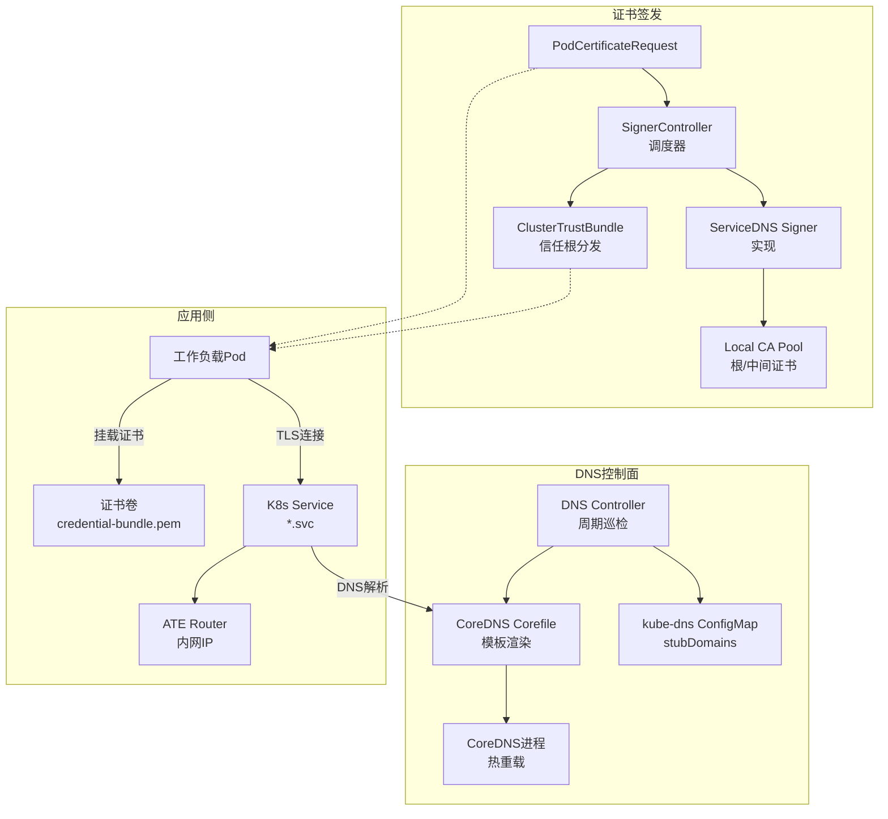
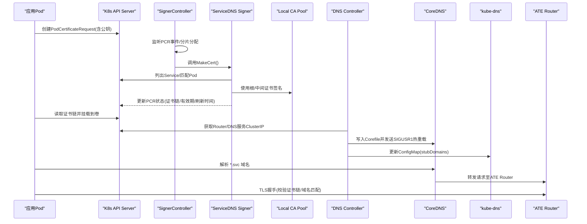
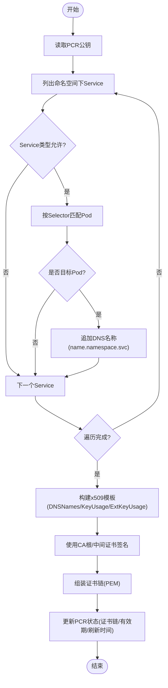
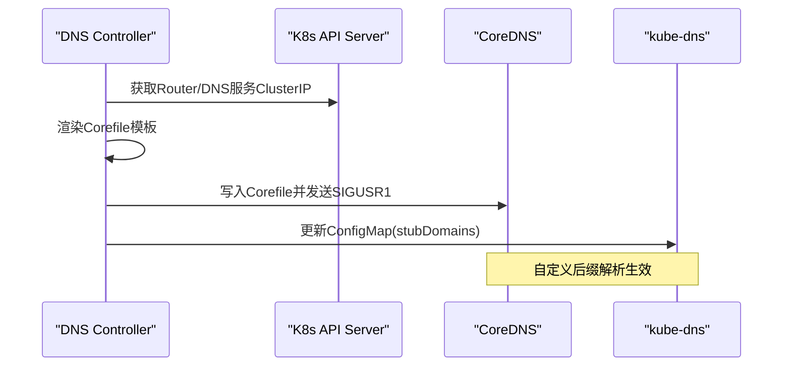
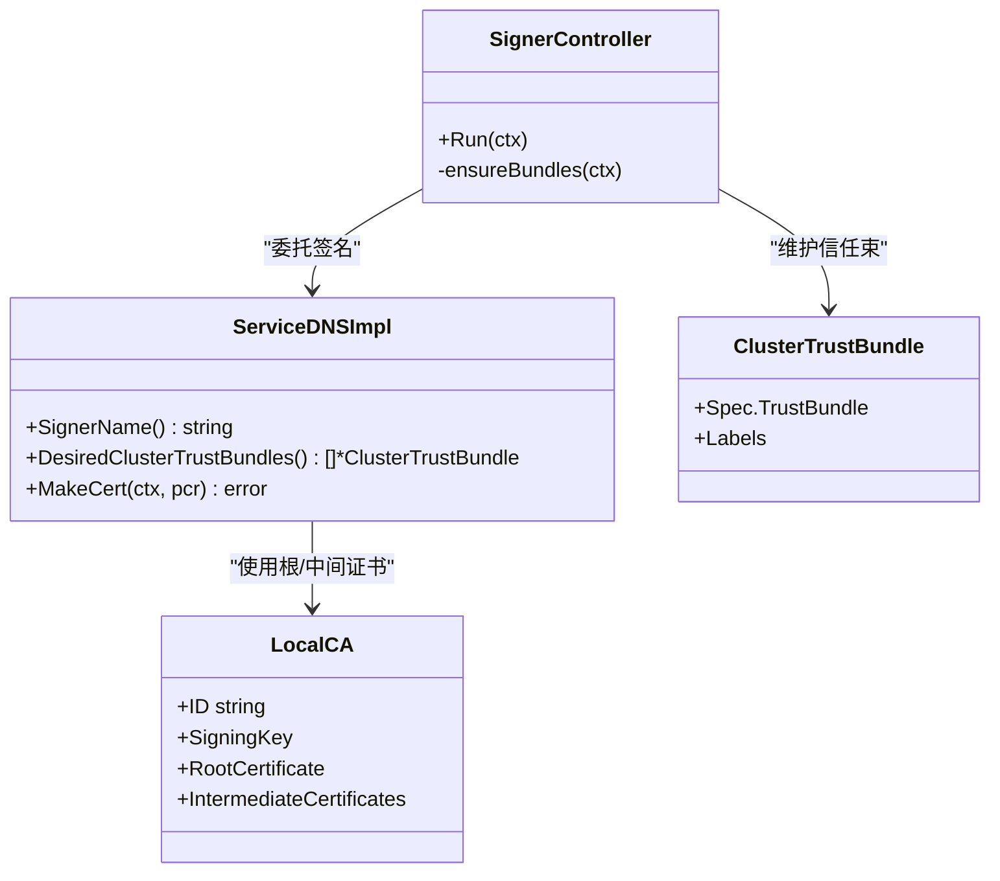
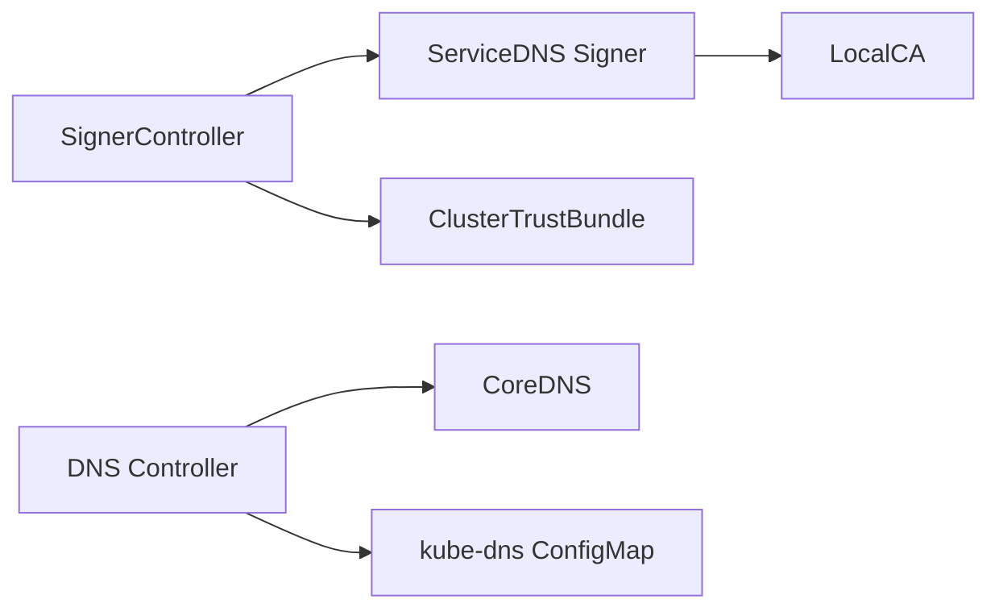

# 服务DNS证书问题

<cite>
**本文引用的文件**   
- [servicednssigner.go](file://cmd/podcertcontroller/internal/servicednssigner/servicednssigner.go)
- [signercontroller.go](file://cmd/podcertcontroller/internal/signercontroller/signercontroller.go)
- [publickey.go](file://cmd/podcertcontroller/internal/podcertificate/publickey.go)
- [rendezvous.go](file://cmd/podcertcontroller/internal/rendezvous/rendezvous.go)
- [dns.go](file://cmd/atenet/internal/dns/dns.go)
- [corefile.go](file://cmd/atenet/internal/dns/corefile.go)
- [localca.go](file://internal/localca/localca.go)
- [valkey.yaml](file://manifests/ate-install/valkey.yaml)
</cite>

## 目录
1. [简介](#简介)
2. [项目结构](#项目结构)
3. [核心组件](#核心组件)
4. [架构总览](#架构总览)
5. [详细组件分析](#详细组件分析)
6. [依赖关系分析](#依赖关系分析)
7. [性能考虑](#性能考虑)
8. [故障排查指南](#故障排查指南)
9. [结论](#结论)
10. [附录](#附录)

## 简介
本文件聚焦于“服务DNS证书”的签发、验证与运维，覆盖以下关键主题：
- DNS名称证书的签发机制：包括DNS名称来源、SAN扩展配置、域名匹配规则。
- 服务发现集成：Kubernetes Service监听、DNS记录同步、证书更新触发。
- 多集群环境下的证书管理：跨集群信任（ClusterTrustBundle）、证书共享、负载均衡配置。
- 性能优化与故障恢复策略：轮询间隔、重试退避、滚动更新与回滚建议。

## 项目结构
围绕服务DNS证书的关键代码分布在两个子系统中：
- Pod证书控制器（podcertcontroller）：负责处理PodCertificateRequest，生成并签名证书，维护ClusterTrustBundle。
- ATE网络子系统（atenet）：负责DNS控制面，将自定义域名的解析指向ATE路由器，并与kube-dns集成。

图表来源
- [signercontroller.go:104-114](file://cmd/podcertcontroller/internal/signercontroller/signercontroller.go#L104-L114)
- [servicednssigner.go:92-210](file://cmd/podcertcontroller/internal/servicednssigner/servicednssigner.go#L92-L210)
- [dns.go:71-117](file://cmd/atenet/internal/dns/dns.go#L71-L117)
- [corefile.go:25-40](file://cmd/atenet/internal/dns/corefile.go#L25-L40)
- [valkey.yaml:198-226](file://manifests/ate-install/valkey.yaml#L198-L226)

章节来源
- [signercontroller.go:104-114](file://cmd/podcertcontroller/internal/signercontroller/signercontroller.go#L104-L114)
- [servicednssigner.go:92-210](file://cmd/podcertcontroller/internal/servicednssigner/servicednssigner.go#L92-L210)
- [dns.go:71-117](file://cmd/atenet/internal/dns/dns.go#L71-L117)
- [corefile.go:25-40](file://cmd/atenet/internal/dns/corefile.go#L25-L40)
- [valkey.yaml:198-226](file://manifests/ate-install/valkey.yaml#L198-L226)

## 核心组件
- ServiceDNS签名器（servicednssigner）：根据PCR中的Pod信息，计算其可访问的Service DNS名称集合，构造x509证书模板并签名，返回证书链与有效期。
- 签名控制器（signercontroller）：监听PCR事件，按哈希分片选择副本处理，确保ClusterTrustBundle一致性。
- 本地CA池（localca）：提供ED25519根密钥与可选中间证书，用于签发客户端/服务端双向认证证书。
- DNS控制器（atenet dns）：周期性获取Router与DNS服务的ClusterIP，渲染CoreDNS Corefile并写入共享卷，向kube-dns注入stubDomains以接管自定义后缀解析。
- 握手与租约（rendezvous）：基于Lease的Rendezvous Hashing，实现无主多副本的任务分配与心跳保活。

章节来源
- [servicednssigner.go:92-210](file://cmd/podcertcontroller/internal/servicednssigner/servicednssigner.go#L92-L210)
- [signercontroller.go:104-114](file://cmd/podcertcontroller/internal/signercontroller/signercontroller.go#L104-L114)
- [localca.go:159-192](file://internal/localca/localca.go#L159-L192)
- [dns.go:71-117](file://cmd/atenet/internal/dns/dns.go#L71-L117)
- [rendezvous.go:205-250](file://cmd/podcertcontroller/internal/rendezvous/rendezvous.go#L205-L250)

## 架构总览
下图展示了从PCR到证书下发、再到DNS解析与TLS建立的整体流程。

图表来源
- [signercontroller.go:104-114](file://cmd/podcertcontroller/internal/signercontroller/signercontroller.go#L104-L114)
- [servicednssigner.go:92-210](file://cmd/podcertcontroller/internal/servicednssigner/servicednssigner.go#L92-L210)
- [dns.go:71-117](file://cmd/atenet/internal/dns/dns.go#L71-L117)
- [corefile.go:25-40](file://cmd/atenet/internal/dns/corefile.go#L25-L40)
- [valkey.yaml:198-226](file://manifests/ate-install/valkey.yaml#L198-L226)

## 详细组件分析

### ServiceDNS证书签发流程
- 输入来源：PCR中的公钥（支持PKCS#10或PKIXPublicKey）。
- 域名推导：遍历同命名空间下所有Service，筛选ClusterIP/NodePort/LoadBalancer类型；对每个Service通过LabelSelector匹配Pod，若匹配当前PCR对应的Pod，则加入DNS名称列表（格式为 name.namespace.svc）。
- 证书模板：设置BasicConstraintsValid、NotBefore/NotAfter、DNSNames、KeyUsage=DigitalSignature、ExtKeyUsage=ClientAuth+ServerAuth。
- 签名与链构建：使用CA池中的根证书（及可选中间证书）进行签名，输出PEM证书链。
- 状态更新：在PCR状态中写入Issued条件、证书链、NotBefore/NotAfter以及BeginRefreshAt，驱动客户端按需提前刷新。

图表来源
- [servicednssigner.go:92-210](file://cmd/podcertcontroller/internal/servicednssigner/servicednssigner.go#L92-L210)
- [publickey.go:25-44](file://cmd/podcertcontroller/internal/podcertificate/publickey.go#L25-L44)

章节来源
- [servicednssigner.go:92-210](file://cmd/podcertcontroller/internal/servicednssigner/servicednssigner.go#L92-L210)
- [publickey.go:25-44](file://cmd/podcertcontroller/internal/podcertificate/publickey.go#L25-L44)

### DNS名称验证与SAN扩展配置
- SAN扩展：证书模板中将DNS名称集合直接写入DNSNames字段，作为Subject Alternative Name的一部分。
- 域名匹配规则：仅包含由Service推导出的FQDN（name.namespace.svc），不包含通配符；客户端需严格匹配该FQDN。
- 用途：同时启用ClientAuth与ServerAuth，适用于mTLS场景。

章节来源
- [servicednssigner.go:159-166](file://cmd/podcertcontroller/internal/servicednssigner/servicednssigner.go#L159-L166)

### 服务发现集成：Kubernetes Service监听、DNS记录同步、证书更新触发
- Service监听：签名器在签发时动态列举Service并按Selector匹配Pod，从而确定应授予的DNS名称。
- DNS记录同步：DNS控制器周期性获取Router与DNS服务的ClusterIP，渲染CoreDNS Corefile并写入共享卷，随后向CoreDNS进程发送信号触发热重载；同时将自定义后缀的解析指向DNS服务IP，并写入kube-dns的ConfigMap（stubDomains）。
- 证书更新触发：PCR状态中包含BeginRefreshAt，客户端应在该时间点前发起新的PCR以滚动更新证书。

图表来源
- [dns.go:71-117](file://cmd/atenet/internal/dns/dns.go#L71-L117)
- [dns.go:119-141](file://cmd/atenet/internal/dns/dns.go#L119-L141)
- [dns.go:143-189](file://cmd/atenet/internal/dns/dns.go#L143-L189)
- [corefile.go:25-40](file://cmd/atenet/internal/dns/corefile.go#L25-L40)

章节来源
- [dns.go:71-117](file://cmd/atenet/internal/dns/dns.go#L71-L117)
- [dns.go:119-141](file://cmd/atenet/internal/dns/dns.go#L119-L141)
- [dns.go:143-189](file://cmd/atenet/internal/dns/dns.go#L143-L189)
- [corefile.go:25-40](file://cmd/atenet/internal/dns/corefile.go#L25-L40)

### 多集群环境下的证书管理与信任
- 跨集群信任：签名控制器定期维护ClusterTrustBundle，将CA根证书序列化为信任束，供集群内各组件加载验证。
- 证书共享：工作负载通过Projected Volume将证书与CA bundle挂载到容器内，示例见Valkey部署清单。
- 负载均衡配置：DNS控制器将自定义后缀解析指向ATE Router的ClusterIP，结合Service的负载均衡能力，实现流量分发。

图表来源
- [signercontroller.go:203-249](file://cmd/podcertcontroller/internal/signercontroller/signercontroller.go#L203-L249)
- [servicednssigner.go:62-90](file://cmd/podcertcontroller/internal/servicednssigner/servicednssigner.go#L62-L90)
- [localca.go:159-192](file://internal/localca/localca.go#L159-L192)
- [valkey.yaml:198-226](file://manifests/ate-install/valkey.yaml#L198-L226)

章节来源
- [signercontroller.go:203-249](file://cmd/podcertcontroller/internal/signercontroller/signercontroller.go#L203-L249)
- [servicednssigner.go:62-90](file://cmd/podcertcontroller/internal/servicednssigner/servicednssigner.go#L62-L90)
- [localca.go:159-192](file://internal/localca/localca.go#L159-L192)
- [valkey.yaml:198-226](file://manifests/ate-install/valkey.yaml#L198-L226)

### 副本分片与会话一致性
- Rendezvous Hashing：基于Lease心跳识别存活副本，对PCR键进行哈希分片，避免重复处理。
- 非原子性保证：同一PCR可能被多个副本尝试处理，但结果幂等（已Issued/Denied/Failed即跳过）。

章节来源
- [rendezvous.go:205-250](file://cmd/podcertcontroller/internal/rendezvous/rendezvous.go#L205-L250)
- [signercontroller.go:167-201](file://cmd/podcertcontroller/internal/signercontroller/signercontroller.go#L167-L201)

## 依赖关系分析
- 组件耦合
  - signercontroller 与 servicednssigner：前者调度，后者实现具体签名逻辑。
  - servicednssigner 与 localca：依赖CA池进行证书签名。
  - dns controller 与 kube-dns/CoreDNS：通过ConfigMap与进程信号协同。
- 外部依赖
  - Kubernetes API：CRD/资源对象（PodCertificateRequest、ClusterTrustBundle、Service、ConfigMap、Lease）。
  - 文件系统：Corefile写入路径、证书卷挂载路径。

图表来源
- [signercontroller.go:104-114](file://cmd/podcertcontroller/internal/signercontroller/signercontroller.go#L104-L114)
- [servicednssigner.go:92-210](file://cmd/podcertcontroller/internal/servicednssigner/servicednssigner.go#L92-L210)
- [dns.go:71-117](file://cmd/atenet/internal/dns/dns.go#L71-L117)

章节来源
- [signercontroller.go:104-114](file://cmd/podcertcontroller/internal/signercontroller/signercontroller.go#L104-L114)
- [servicednssigner.go:92-210](file://cmd/podcertcontroller/internal/servicednssigner/servicednssigner.go#L92-L210)
- [dns.go:71-117](file://cmd/atenet/internal/dns/dns.go#L71-L117)

## 性能考虑
- 证书生命周期与刷新窗口
  - 默认最小有效期为24小时，若PCR请求的MaxExpirationSeconds小于该值则取请求值；证书颁发后设置BeginRefreshAt，建议客户端在该时间点前发起新PCR以避免中断。
- 控制器轮询与重试
  - DNS控制器按固定Interval循环reconcile；PCR处理失败或未分配到副本时采用带退避的重试队列，降低API压力。
- CoreDNS热重载
  - 通过SIGUSR1触发CoreDNS热重载，避免重启带来的抖动。
- 副本分片
  - 使用Rendezvous Hashing将PCR均匀分布到多个副本，提升吞吐与可扩展性。

章节来源
- [servicednssigner.go:149-157](file://cmd/podcertcontroller/internal/servicednssigner/servicednssigner.go#L149-L157)
- [signercontroller.go:116-165](file://cmd/podcertcontroller/internal/signercontroller/signercontroller.go#L116-L165)
- [dns.go:51-69](file://cmd/atenet/internal/dns/dns.go#L51-L69)
- [dns.go:202-221](file://cmd/atenet/internal/dns/dns.go#L202-L221)
- [rendezvous.go:205-250](file://cmd/podcertcontroller/internal/rendezvous/rendezvous.go#L205-L250)

## 故障排查指南
- 证书未签发或过期
  - 检查PCR状态是否包含Issued条件与证书链；确认BeginRefreshAt是否到达，必要时手动触发重新申请。
  - 核对证书DNSNames是否与客户端访问的FQDN一致（name.namespace.svc）。
- DNS解析异常
  - 确认DNS控制器日志是否成功写入Corefile并发送SIGUSR1；检查kube-dns的ConfigMap中stubDomains是否正确指向DNS服务IP。
  - 验证CoreDNS健康端点与就绪探针是否正常。
- 多副本冲突或重复处理
  - 观察Rendezvous Hashing分配的副本是否稳定；若频繁迁移，检查Lease心跳与副本存活情况。
- 信任根缺失
  - 确认ClusterTrustBundle是否存在且内容正确；工作负载是否正确挂载了CA bundle与证书卷。

章节来源
- [servicednssigner.go:189-210](file://cmd/podcertcontroller/internal/servicednssigner/servicednssigner.go#L189-L210)
- [dns.go:119-141](file://cmd/atenet/internal/dns/dns.go#L119-L141)
- [dns.go:143-189](file://cmd/atenet/internal/dns/dns.go#L143-L189)
- [signercontroller.go:167-201](file://cmd/podcertcontroller/internal/signercontroller/signercontroller.go#L167-L201)
- [valkey.yaml:198-226](file://manifests/ate-install/valkey.yaml#L198-L226)

## 结论
本项目实现了面向服务DNS的自动化证书签发与DNS解析联动：
- 通过Service发现动态推导DNS名称，生成具备Client/Server双向认证的证书。
- 借助DNS控制器与kube-dns集成，将自定义后缀解析统一指向ATE Router，简化跨命名空间通信。
- 利用ClusterTrustBundle实现跨组件的信任分发，配合Projected Volume安全落地证书与CA。
- 通过Rendezvous Hashing与带退避的工作队列，保障高可用与可扩展性。

## 附录
- 相关概念
  - PodCertificateRequest：用于申请证书的资源对象，包含公钥与期望有效期。
  - ClusterTrustBundle：集群范围的信任根集合，便于多组件共享验证。
  - CoreDNS Corefile：定义DNS插件与响应规则的配置。
- 最佳实践
  - 合理设置MaxExpirationSeconds，平衡安全性与刷新开销。
  - 在BeginRefreshAt之前主动刷新证书，避免连接中断。
  - 监控DNS控制器与CoreDNS健康指标，及时告警。
