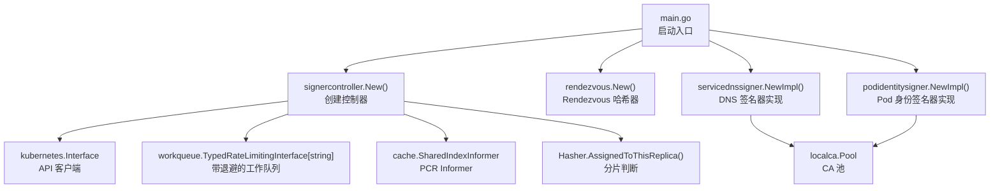
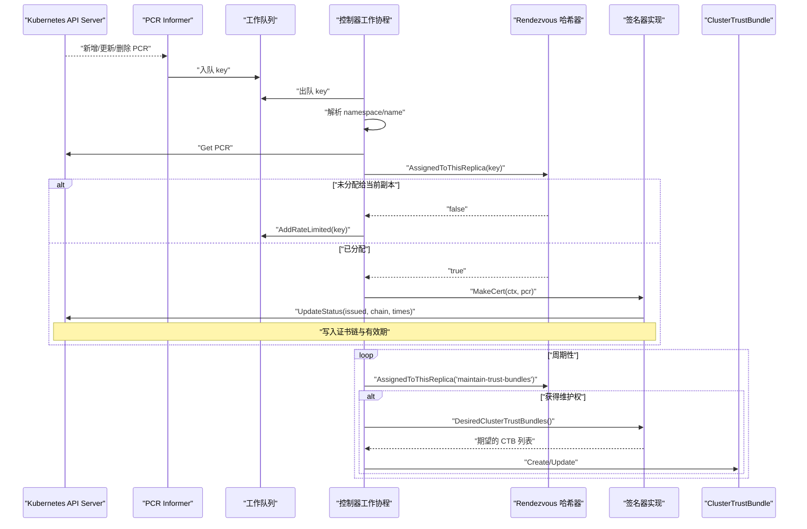
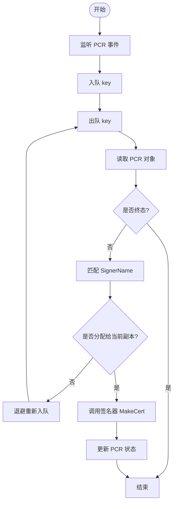
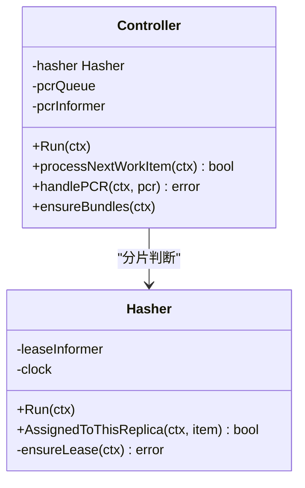
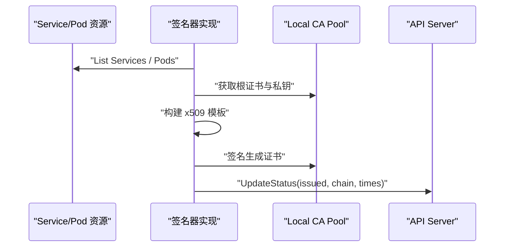
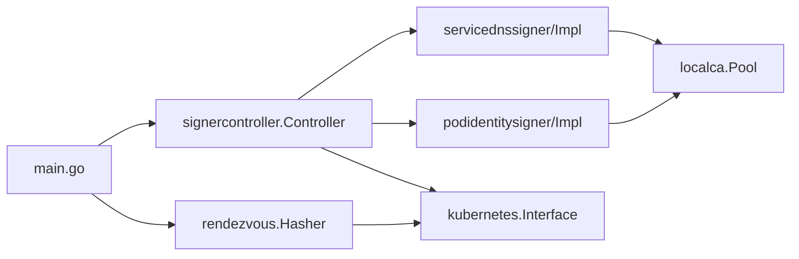

# 证书控制器问题

<cite>
**本文引用的文件**   
- [main.go](file://cmd/podcertcontroller/main.go)
- [signercontroller.go](file://cmd/podcertcontroller/internal/signercontroller/signercontroller.go)
- [rendezvous.go](file://cmd/podcertcontroller/internal/rendezvous/rendezvous.go)
- [servicednssigner.go](file://cmd/podcertcontroller/internal/servicednssigner/servicednssigner.go)
- [podidentitysigner.go](file://cmd/podcertcontroller/internal/podidentitysigner/podidentitysigner.go)
- [localca.go](file://internal/localca/localca.go)
</cite>

## 目录
1. [简介](#简介)
2. [项目结构](#项目结构)
3. [核心组件](#核心组件)
4. [架构总览](#架构总览)
5. [详细组件分析](#详细组件分析)
6. [依赖关系分析](#依赖关系分析)
7. [性能与并发特性](#性能与并发特性)
8. [健康检查与可观测性](#健康检查与可观测性)
9. [故障排查指南](#故障排查指南)
10. [结论](#结论)

## 简介
本文件聚焦于 Pod 证书控制器（Pod Certificate Controller）中“签名器控制器”（SignerController）的问题定位与处理，覆盖以下主题：
- SignerController 工作机制：签名器注册、请求路由、并发控制
- 工作分片机制：基于 Lease 的 Rendezvous 哈希、节点选择与故障转移
- 控制器健康检查：就绪探针、存活探针、性能监控建议
- 重启恢复、状态同步与数据一致性保证
- 日志分析与性能调优指南

## 项目结构
该子系统的入口程序为 podcertcontroller，负责：
- 启动两个自定义签名器控制器实例（服务 DNS 身份与 Pod 身份）
- 加载本地 CA 池并注入到各签名器实现
- 初始化 Rendezvous 哈希器用于多副本分片
- 运行控制器主循环与后台任务

图示来源
- [main.go:113-149](file://cmd/podcertcontroller/main.go#L113-L149)
- [signercontroller.go:62-102](file://cmd/podcertcontroller/internal/signercontroller/signercontroller.go#L62-L102)
- [rendezvous.go:107-133](file://cmd/podcertcontroller/internal/rendezvous/rendezvous.go#L107-L133)
- [servicednssigner.go:48-54](file://cmd/podcertcontroller/internal/servicednssigner/servicednssigner.go#L48-L54)
- [podidentitysigner.go:48-54](file://cmd/podcertcontroller/internal/podidentitysigner/podidentitysigner.go#L48-L54)
- [localca.go:30-39](file://internal/localca/localca.go#L30-L39)

章节来源
- [main.go:80-158](file://cmd/podcertcontroller/main.go#L80-L158)

## 核心组件
- SignerController：监听 PodCertificateRequest（PCR），按签名器名称路由到对应实现；使用工作队列进行去重与退避重试；通过 Hasher 做分片。
- Rendezvous Hasher：基于 Kubernetes Lease 维护副本心跳，计算每个 PCR 应归属的副本，支持故障转移与再平衡。
- 签名器实现：
  - servicednssigner：为 Pod 签发包含服务 DNS 名的证书，并输出 ClusterTrustBundle。
  - podidentitysigner：为 Pod 签发 SPIFFE URI 标识的证书，并输出 ClusterTrustBundle。
- Local CA Pool：提供根证书与中间证书链及私钥，供签名器签发证书。

章节来源
- [signercontroller.go:38-75](file://cmd/podcertcontroller/internal/signercontroller/signercontroller.go#L38-L75)
- [rendezvous.go:93-133](file://cmd/podcertcontroller/internal/rendezvous/rendezvous.go#L93-L133)
- [servicednssigner.go:41-54](file://cmd/podcertcontroller/internal/servicednssigner/servicednssigner.go#L41-L54)
- [podidentitysigner.go:41-54](file://cmd/podcertcontroller/internal/podidentitysigner/podidentitysigner.go#L41-L54)
- [localca.go:30-39](file://internal/localca/localca.go#L30-L39)

## 架构总览
下图展示了从 PCR 产生到证书签发的端到端流程，以及信任分发路径。

图示来源
- [signercontroller.go:104-114](file://cmd/podcertcontroller/internal/signercontroller/signercontroller.go#L104-L114)
- [signercontroller.go:121-165](file://cmd/podcertcontroller/internal/signercontroller/signercontroller.go#L121-L165)
- [signercontroller.go:167-201](file://cmd/podcertcontroller/internal/signercontroller/signercontroller.go#L167-L201)
- [signercontroller.go:203-249](file://cmd/podcertcontroller/internal/signercontroller/signercontroller.go#L203-L249)
- [rendezvous.go:218-250](file://cmd/podcertcontroller/internal/rendezvous/rendezvous.go#L218-L250)
- [servicednssigner.go:92-210](file://cmd/podcertcontroller/internal/servicednssigner/servicednssigner.go#L92-L210)
- [podidentitysigner.go:92-175](file://cmd/podcertcontroller/internal/podidentitysigner/podidentitysigner.go#L92-L175)

## 详细组件分析

### SignerController 工作机制
- 签名器注册
  - main 中为不同签名器名称分别创建控制器实例，并将对应的签名器实现注入。
  - 每个控制器仅处理与其 SignerName 匹配的 PCR。
- 请求路由
  - Informer 监听所有命名空间的 PCR，事件入队。
  - 工作协程取出 key，获取对象后根据 Spec.SignerName 路由到具体实现。
- 并发控制
  - 使用 TypedRateLimitingQueue 对重复或失败项进行退避重试。
  - 通过 Hasher 将同一 PCR 固定到某个副本，避免重复处理。
- 信任分发
  - 周期任务确保 ClusterTrustBundle 存在且与期望一致，由获得“维护权”的副本执行。

图示来源
- [signercontroller.go:62-102](file://cmd/podcertcontroller/internal/signercontroller/signercontroller.go#L62-L102)
- [signercontroller.go:121-165](file://cmd/podcertcontroller/internal/signercontroller/signercontroller.go#L121-L165)
- [signercontroller.go:167-201](file://cmd/podcertcontroller/internal/signercontroller/signercontroller.go#L167-L201)

章节来源
- [main.go:123-149](file://cmd/podcertcontroller/main.go#L123-L149)
- [signercontroller.go:62-114](file://cmd/podcertcontroller/internal/signercontroller/signercontroller.go#L62-L114)
- [signercontroller.go:121-201](file://cmd/podcertcontroller/internal/signercontroller/signercontroller.go#L121-L201)

### 工作分片机制（Lease 协调、节点选择、故障转移）
- 心跳与成员发现
  - 每个副本定期更新自身 Lease，包含 HolderIdentity、RenewTime、LeaseDurationSeconds。
  - 通过 LabelSelector 收集同应用的所有 Lease，过滤掉超时的“死亡”副本。
- 节点选择
  - 使用 Rendezvous 哈希：对 item 与每个活跃副本名计算哈希，取最大哈希值对应的副本作为承担者。
  - 当多个副本哈希相等时，按副本名字典序打破平局，保证确定性。
- 故障转移
  - 副本下线后其 Lease 不再续期，其他副本在下次评估时将其剔除，相关项将被重新分配到存活副本。
  - 对于未分配项，控制器会退避重试，直到再次被分配。

图示来源
- [rendezvous.go:107-143](file://cmd/podcertcontroller/internal/rendezvous/rendezvous.go#L107-L143)
- [rendezvous.go:151-203](file://cmd/podcertcontroller/internal/rendezvous/rendezvous.go#L151-L203)
- [rendezvous.go:218-250](file://cmd/podcertcontroller/internal/rendezvous/rendezvous.go#L218-L250)
- [signercontroller.go:104-114](file://cmd/podcertcontroller/internal/signercontroller/signercontroller.go#L104-L114)
- [signercontroller.go:167-201](file://cmd/podcertcontroller/internal/signercontroller/signercontroller.go#L167-L201)

章节来源
- [rendezvous.go:44-51](file://cmd/podcertcontroller/internal/rendezvous/rendezvous.go#L44-L51)
- [rendezvous.go:107-143](file://cmd/podcertcontroller/internal/rendezvous/rendezvous.go#L107-L143)
- [rendezvous.go:218-275](file://cmd/podcertcontroller/internal/rendezvous/rendezvous.go#L218-L275)
- [signercontroller.go:149-165](file://cmd/podcertcontroller/internal/signercontroller/signercontroller.go#L149-L165)

### 签名器实现细节
- Service DNS 签名器
  - 根据 Pod 所属命名空间下的 Service 选择器，推导可分配的 DNS 名集合。
  - 使用本地 CA 池签发证书，设置合适的有效期与刷新时间，并返回证书链。
  - 生成并维护 ClusterTrustBundle，包含根证书。
- Pod 身份签名器
  - 校验 Pod UID 与请求一致，防止伪造。
  - 基于 SPIFFE URI 构造主体标识，签发客户端认证证书。
  - 同样维护 ClusterTrustBundle。

图示来源
- [servicednssigner.go:92-210](file://cmd/podcertcontroller/internal/servicednssigner/servicednssigner.go#L92-L210)
- [podidentitysigner.go:92-175](file://cmd/podcertcontroller/internal/podidentitysigner/podidentitysigner.go#L92-L175)
- [localca.go:30-39](file://internal/localca/localca.go#L30-L39)

章节来源
- [servicednssigner.go:62-90](file://cmd/podcertcontroller/internal/servicednssigner/servicednssigner.go#L62-L90)
- [podidentitysigner.go:62-90](file://cmd/podcertcontroller/internal/podidentitysigner/podidentitysigner.go#L62-L90)
- [localca.go:83-120](file://internal/localca/localca.go#L83-L120)

## 依赖关系分析
- 外部依赖
  - Kubernetes API：PodCertificateRequests、Services、Pods、Leases、ClusterTrustBundles
  - client-go Informer/Lister/Workqueue
  - local CA 池：本地文件加载，JSON 序列化/反序列化
- 内部耦合
  - SignerController 依赖 Hasher 接口，解耦了分片策略
  - 签名器实现依赖 localca.Pool 完成证书签发
  - main 负责装配与生命周期管理

图示来源
- [main.go:113-149](file://cmd/podcertcontroller/main.go#L113-L149)
- [signercontroller.go:62-75](file://cmd/podcertcontroller/internal/signercontroller/signercontroller.go#L62-L75)
- [rendezvous.go:107-133](file://cmd/podcertcontroller/internal/rendezvous/rendezvous.go#L107-L133)
- [servicednssigner.go:48-54](file://cmd/podcertcontroller/internal/servicednssigner/servicednssigner.go#L48-L54)
- [podidentitysigner.go:48-54](file://cmd/podcertcontroller/internal/podidentitysigner/podidentitysigner.go#L48-L54)
- [localca.go:30-39](file://internal/localca/localca.go#L30-L39)

章节来源
- [main.go:80-158](file://cmd/podcertcontroller/main.go#L80-L158)
- [signercontroller.go:62-102](file://cmd/podcertcontroller/internal/signercontroller/signercontroller.go#L62-L102)
- [rendezvous.go:107-133](file://cmd/podcertcontroller/internal/rendezvous/rendezvous.go#L107-L133)

## 性能与并发特性
- 并发模型
  - 单个工作协程串行处理队列项，避免同一 PCR 并发处理。
  - 后台协程周期性维护信任分发，不影响主处理路径。
- 速率限制
  - 使用默认控制器级 RateLimiter，对错误与未分配项进行退避重试，降低 API 压力。
- 缓存与索引
  - Informer 全量缓存 PCR，配合 Listers 减少 API 调用。
  - Rendezvous 基于 Lease Informer 维护活跃副本集合，避免频繁直连 API。
- 潜在优化点
  - 若 PCR 数量极大，可考虑增加工作协程数（需确保幂等与去重）。
  - 对 Service/Pod 列表操作可引入本地索引以减少全量扫描。

章节来源
- [signercontroller.go:104-114](file://cmd/podcertcontroller/internal/signercontroller/signercontroller.go#L104-L114)
- [signercontroller.go:121-165](file://cmd/podcertcontroller/internal/signercontroller/signercontroller.go#L121-L165)
- [servicednssigner.go:98-136](file://cmd/podcertcontroller/internal/servicednssigner/servicednssigner.go#L98-L136)

## 健康检查与可观测性
- 就绪探针（Readiness）
  - 建议在 HTTP 端口暴露 /readyz，仅在 Informer 缓存同步完成后返回 200。
  - 参考仓库内 readyz 包的使用方式，结合控制器 Run 中的 WaitForCacheSync 语义。
- 存活探针（Liveness）
  - 建议暴露 /healthz，周期性检查关键协程是否仍在运行、Lease 是否成功续期。
- 指标与追踪
  - 建议暴露 Prometheus 指标：队列长度、处理耗时、错误计数、Lease 续期成功率、CTB 同步次数。
  - 结合 OpenTelemetry 对关键路径打点（如 MakeCert、UpdateStatus、EnsureBundles）。

[本节为通用指导，不直接分析具体文件]

## 故障排查指南
- 常见问题与定位
  - PCR 长时间未签发
    - 检查是否被正确路由到对应签名器（SignerName 匹配）。
    - 查看是否因未分配导致反复退避（ErrNotAssigned）。
    - 确认 Hasher 能列出 Lease 并判定当前副本为活跃。
  - 证书链不正确或过期
    - 核对 CA 池文件是否有效、是否被正确加载。
    - 检查 NotBefore/NotAfter 与 BeginRefreshAt 的设置是否符合预期。
  - 信任分发异常
    - 确认是否有副本获得“维护权”，并成功 Create/Update ClusterTrustBundle。
    - 对比期望与实际 CTB 的 Labels 与 Spec 差异。
- 日志关键字
  - “Error while retrieving PodCertificateRequest”
  - “Error while handling PodCertificateRequest”
  - “Error while creating/updating ClusterTrustBundle”
  - “Error while listing all leases in informer”
  - “Processing PCR”
- 快速自检清单
  - 确认 Ingress/Service 可达性与权限
  - 确认 kubeconfig/in-cluster 配置正确
  - 确认 sharding-* 参数（命名空间、应用名、Pod 名、UID）正确
  - 确认 CA 池文件可读且格式正确

章节来源
- [signercontroller.go:141-165](file://cmd/podcertcontroller/internal/signercontroller/signercontroller.go#L141-L165)
- [signercontroller.go:167-201](file://cmd/podcertcontroller/internal/signercontroller/signercontroller.go#L167-L201)
- [signercontroller.go:212-249](file://cmd/podcertcontroller/internal/signercontroller/signercontroller.go#L212-L249)
- [rendezvous.go:223-250](file://cmd/podcertcontroller/internal/rendezvous/rendezvous.go#L223-L250)
- [main.go:124-149](file://cmd/podcertcontroller/main.go#L124-L149)

## 结论
- SignerController 以 Informer+Workqueue 为核心，结合 Rendezvous 哈希实现稳定、可扩展的多副本分片处理。
- 通过 Lease 心跳与哈希再平衡，系统在副本扩缩容时具备良好弹性与故障转移能力。
- 建议在生产环境完善健康检查与指标采集，并结合上述排查清单快速定位问题。
- 针对大规模场景，可进一步优化资源访问模式与并发度，以提升吞吐与稳定性。
