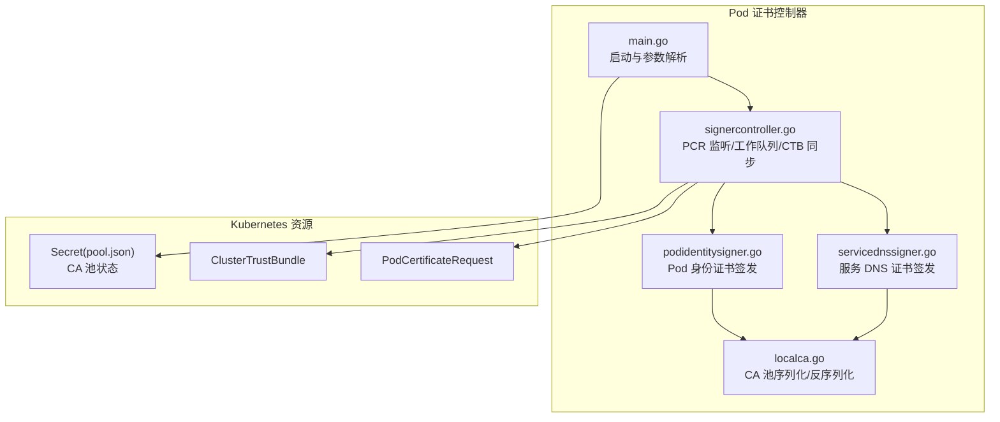
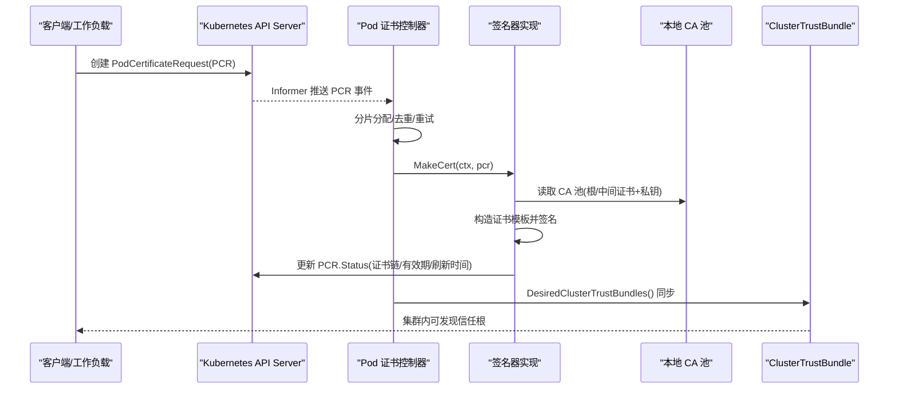
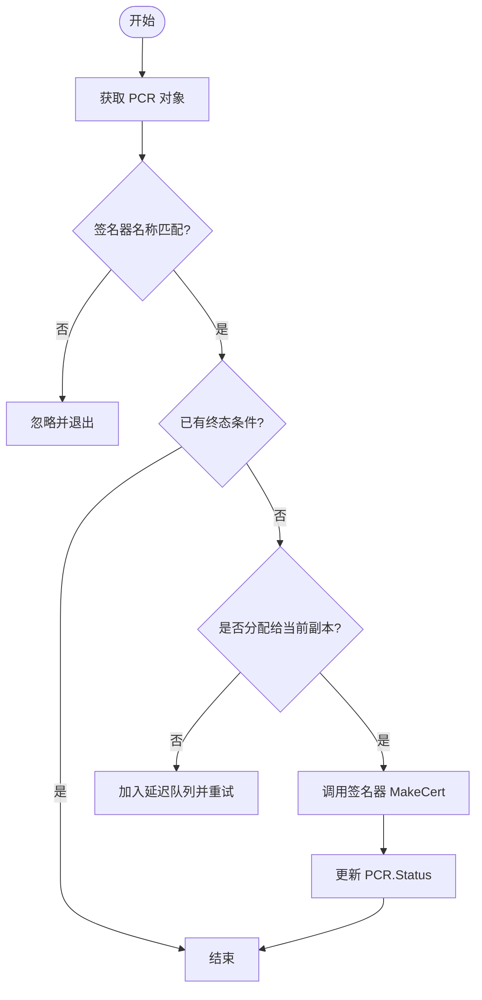
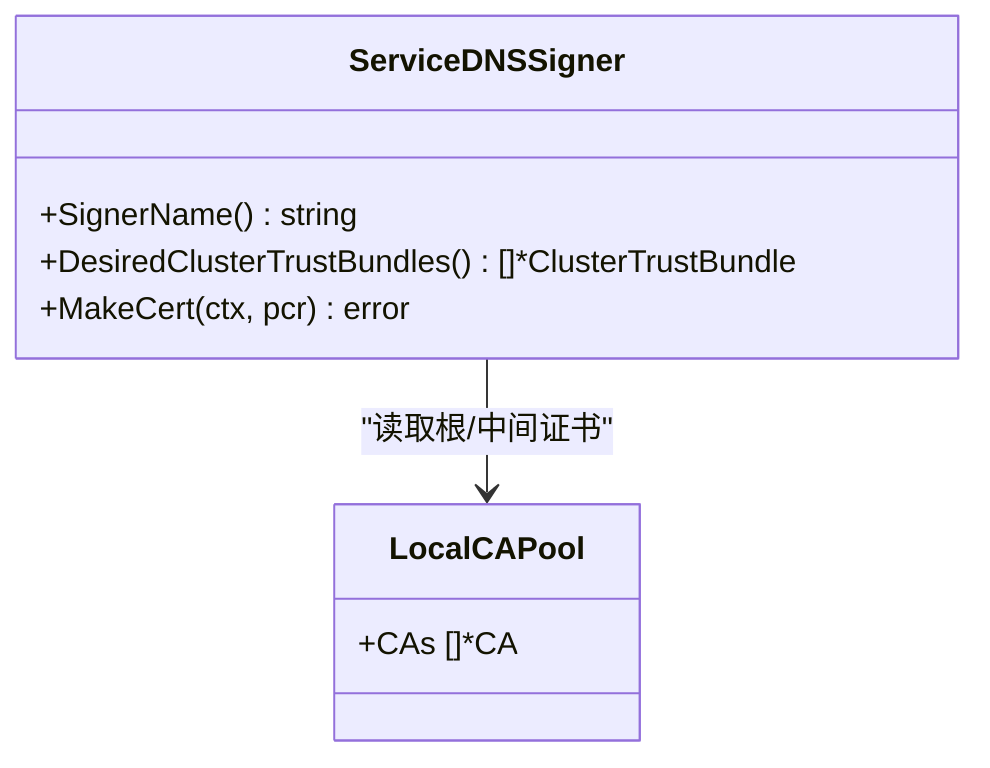
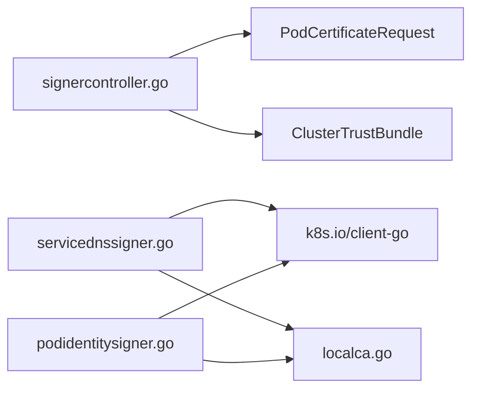

# 证书管理问题

<cite>
**本文引用的文件**   
- [cmd/podcertcontroller/main.go](file://cmd/podcertcontroller/main.go)
- [cmd/podcertcontroller/internal/signercontroller/signercontroller.go](file://cmd/podcertcontroller/internal/signercontroller/signercontroller.go)
- [cmd/podcertcontroller/internal/servicednssigner/servicednssigner.go](file://cmd/podcertcontroller/internal/servicednssigner/servicednssigner.go)
- [cmd/podcertcontroller/internal/podidentitysigner/podidentitysigner.go](file://cmd/podcertcontroller/internal/podidentitysigner/podidentitysigner.go)
- [internal/localca/localca.go](file://internal/localca/localca.go)
- [manifests/ate-install/pod-certificate-controller.yaml](file://manifests/ate-install/pod-certificate-controller.yaml)
- [cmd/ateapi/internal/sessionidentity/sessionidentity.go](file://cmd/ateapi/internal/sessionidentity/sessionidentity.go)
</cite>

## 目录
1. [简介](#简介)
2. [项目结构](#项目结构)
3. [核心组件](#核心组件)
4. [架构总览](#架构总览)
5. [详细组件分析](#详细组件分析)
6. [依赖关系分析](#依赖关系分析)
7. [性能与可靠性考虑](#性能与可靠性考虑)
8. [故障排查指南](#故障排查指南)
9. [结论](#结论)
10. [附录](#附录)

## 简介
本文件聚焦于 Pod 证书控制器与相关 CA 池的证书生命周期管理与问题排查，覆盖以下主题：
- 证书过期检测与处理流程（含自动轮换、手动更新）
- 证书链验证与信任分发（ClusterTrustBundle）
- CA 证书管理（根证书、中间证书、信任库更新）
- Pod 证书控制器工作原理与故障排除（签发失败、私钥生成错误、绑定问题）
- 服务 DNS 证书的配置与维护
- 监控与告警建议

## 项目结构
与证书管理相关的代码主要分布在以下位置：
- 控制器入口与参数解析：cmd/podcertcontroller/main.go
- 通用控制器循环与工作队列：cmd/podcertcontroller/internal/signercontroller/signercontroller.go
- 两类签名器实现：
  - 服务 DNS 证书：cmd/podcertcontroller/internal/servicednssigner/servicednssigner.go
  - Pod 身份证书：cmd/podcertcontroller/internal/podidentitysigner/podidentitysigner.go
- 本地 CA 池序列化/反序列化与工具方法：internal/localca/localca.go
- 部署清单（CA 池 Secret 挂载、RBAC、副本数等）：manifests/ate-install/pod-certificate-controller.yaml
- 会话侧使用 CA 池进行 CSR 校验与签发：cmd/ateapi/internal/sessionidentity/sessionidentity.go

图表来源
- [cmd/podcertcontroller/main.go:80-158](file://cmd/podcertcontroller/main.go#L80-L158)
- [cmd/podcertcontroller/internal/signercontroller/signercontroller.go:62-114](file://cmd/podcertcontroller/internal/signercontroller/signercontroller.go#L62-L114)
- [cmd/podcertcontroller/internal/servicednssigner/servicednssigner.go:92-211](file://cmd/podcertcontroller/internal/servicednssigner/servicednssigner.go#L92-L211)
- [cmd/podcertcontroller/internal/podidentitysigner/podidentitysigner.go:92-176](file://cmd/podcertcontroller/internal/podidentitysigner/podidentitysigner.go#L92-L176)
- [internal/localca/localca.go:53-120](file://internal/localca/localca.go#L53-L120)
- [manifests/ate-install/pod-certificate-controller.yaml:143-188](file://manifests/ate-install/pod-certificate-controller.yaml#L143-L188)

章节来源
- [cmd/podcertcontroller/main.go:80-158](file://cmd/podcertcontroller/main.go#L80-L158)
- [cmd/podcertcontroller/internal/signercontroller/signercontroller.go:62-114](file://cmd/podcertcontroller/internal/signercontroller/signercontroller.go#L62-L114)
- [manifests/ate-install/pod-certificate-controller.yaml:143-188](file://manifests/ate-install/pod-certificate-controller.yaml#L143-L188)

## 核心组件
- 控制器主进程
  - 负责读取 CA 池文件、初始化两个签名器控制器、运行工作协程。
  - 关键路径：[cmd/podcertcontroller/main.go:124-149](file://cmd/podcertcontroller/main.go#L124-L149)
- 通用控制器（SignerController）
  - 监听 PodCertificateRequest，按分片分配任务，调用具体签名器 MakeCert，并维护 ClusterTrustBundle。
  - 关键路径：[cmd/podcertcontroller/internal/signercontroller/signercontroller.go:104-201](file://cmd/podcertcontroller/internal/signercontroller/signercontroller.go#L104-L201)
- 服务 DNS 证书签名器
  - 根据 Service 选择器匹配 Pod，生成包含 DNSNames 的证书链，设置 NotBefore/NotAfter/BeginRefreshAt。
  - 关键路径：[cmd/podcertcontroller/internal/servicednssigner/servicednssigner.go:92-211](file://cmd/podcertcontroller/internal/servicednssigner/servicednssigner.go#L92-L211)
- Pod 身份证书签名器
  - 基于 Pod 的 ServiceAccount 生成 SPIFFE URI 标识，签发客户端认证证书链。
  - 关键路径：[cmd/podcertcontroller/internal/podidentitysigner/podidentitysigner.go:92-176](file://cmd/podcertcontroller/internal/podidentitysigner/podidentitysigner.go#L92-L176)
- 本地 CA 池
  - 提供 CA 池的序列化和反序列化，支持 ED25519 根密钥生成与中间证书链。
  - 关键路径：[internal/localca/localca.go:53-120](file://internal/localca/localca.go#L53-L120)

章节来源
- [cmd/podcertcontroller/main.go:124-149](file://cmd/podcertcontroller/main.go#L124-L149)
- [cmd/podcertcontroller/internal/signercontroller/signercontroller.go:104-201](file://cmd/podcertcontroller/internal/signercontroller/signercontroller.go#L104-L201)
- [cmd/podcertcontroller/internal/servicednssigner/servicednssigner.go:92-211](file://cmd/podcertcontroller/internal/servicednssigner/servicednssigner.go#L92-L211)
- [cmd/podcertcontroller/internal/podidentitysigner/podidentitysigner.go:92-176](file://cmd/podcertcontroller/internal/podidentitysigner/podidentitysigner.go#L92-L176)
- [internal/localca/localca.go:53-120](file://internal/localca/localca.go#L53-L120)

## 架构总览
下图展示了从 PCR 创建到证书签发、再到信任分发（CTB）的整体流程，以及 CA 池文件的加载方式。

图表来源
- [cmd/podcertcontroller/internal/signercontroller/signercontroller.go:104-201](file://cmd/podcertcontroller/internal/signercontroller/signercontroller.go#L104-L201)
- [cmd/podcertcontroller/internal/servicednssigner/servicednssigner.go:92-211](file://cmd/podcertcontroller/internal/servicednssigner/servicednssigner.go#L92-L211)
- [cmd/podcertcontroller/internal/podidentitysigner/podidentitysigner.go:92-176](file://cmd/podcertcontroller/internal/podidentitysigner/podidentitysigner.go#L92-L176)
- [internal/localca/localca.go:53-120](file://internal/localca/localca.go#L53-L120)

## 详细组件分析

### 组件一：Pod 证书控制器（SignerController）
- 职责
  - 监听所有命名空间的 PodCertificateRequest
  - 通过分片哈希将请求分配到特定副本
  - 调用具体签名器完成签发，并周期性维护 ClusterTrustBundle
- 关键行为
  - 工作队列与速率限制：[cmd/podcertcontroller/internal/signercontroller/signercontroller.go:116-165](file://cmd/podcertcontroller/internal/signercontroller/signercontroller.go#L116-L165)
  - 条件过滤与幂等：已 Issued/Denied/Failed 则跳过：[cmd/podcertcontroller/internal/signercontroller/signercontroller.go:177-187](file://cmd/podcertcontroller/internal/signercontroller/signercontroller.go#L177-L187)
  - 分片分配失败时退避重试：[cmd/podcertcontroller/internal/signercontroller/signercontroller.go:189-191](file://cmd/podcertcontroller/internal/signercontroller/signercontroller.go#L189-L191)
  - 信任包同步：仅一个副本维护，按需 Create/Update：[cmd/podcertcontroller/internal/signercontroller/signercontroller.go:203-249](file://cmd/podcertcontroller/internal/signercontroller/signercontroller.go#L203-L249)

图表来源
- [cmd/podcertcontroller/internal/signercontroller/signercontroller.go:167-201](file://cmd/podcertcontroller/internal/signercontroller/signercontroller.go#L167-L201)

章节来源
- [cmd/podcertcontroller/internal/signercontroller/signercontroller.go:104-249](file://cmd/podcertcontroller/internal/signercontroller/signercontroller.go#L104-L249)

### 组件二：服务 DNS 证书签名器
- 职责
  - 为属于某 Service 的 Pod 签发包含该 Service DNS 名的证书
  - 输出证书链（主体证书 + 中间证书），并写入 PCR.Status
- 关键逻辑
  - 列举 Service 与匹配的 Pod，计算 DNSNames：[cmd/podcertcontroller/internal/servicednssigner/servicednssigner.go:98-136](file://cmd/podcertcontroller/internal/servicednssigner/servicednssigner.go#L98-L136)
  - 计算有效期与刷新时间点：[cmd/podcertcontroller/internal/servicednssigner/servicednssigner.go:149-157](file://cmd/podcertcontroller/internal/servicednssigner/servicednssigner.go#L149-L157)
  - 使用 CA 池首项根证书签发，附加中间证书形成链：[cmd/podcertcontroller/internal/servicednssigner/servicednssigner.go:168-187](file://cmd/podcertcontroller/internal/servicednssigner/servicednssigner.go#L168-L187)
  - 写入 NotBefore/NotAfter/BeginRefreshAt：[cmd/podcertcontroller/internal/servicednssigner/servicednssigner.go:189-207](file://cmd/podcertcontroller/internal/servicednssigner/servicednssigner.go#L189-L207)
  - 期望的 ClusterTrustBundle 内容（仅根证书）：[cmd/podcertcontroller/internal/servicednssigner/servicednssigner.go:62-90](file://cmd/podcertcontroller/internal/servicednssigner/servicednssigner.go#L62-L90)

图表来源
- [cmd/podcertcontroller/internal/servicednssigner/servicednssigner.go:58-90](file://cmd/podcertcontroller/internal/servicednssigner/servicednssigner.go#L58-L90)
- [internal/localca/localca.go:30-39](file://internal/localca/localca.go#L30-L39)

章节来源
- [cmd/podcertcontroller/internal/servicednssigner/servicednssigner.go:92-211](file://cmd/podcertcontroller/internal/servicednssigner/servicednssigner.go#L92-L211)

### 组件三：Pod 身份证书签名器
- 职责
  - 为 Pod 的 ServiceAccount 签发以 SPIFFE URI 为标识的客户端证书
- 关键逻辑
  - 校验 Pod UID 一致性：[cmd/podcertcontroller/internal/podidentitysigner/podidentitysigner.go:94-101](file://cmd/podcertcontroller/internal/podidentitysigner/podidentitysigner.go#L94-L101)
  - 构建 SPIFFE URI：[cmd/podcertcontroller/internal/podidentitysigner/podidentitysigner.go:118-122](file://cmd/podcertcontroller/internal/podidentitysigner/podidentitysigner.go#L118-L122)
  - 有效期与刷新时间计算：[cmd/podcertcontroller/internal/podidentitysigner/podidentitysigner.go:108-116](file://cmd/podcertcontroller/internal/podidentitysigner/podidentitysigner.go#L108-L116)
  - 签发并写入证书链与时间戳：[cmd/podcertcontroller/internal/podidentitysigner/podidentitysigner.go:133-172](file://cmd/podcertcontroller/internal/podidentitysigner/podidentitysigner.go#L133-L172)
  - 期望的 ClusterTrustBundle 内容（仅根证书）：[cmd/podcertcontroller/internal/podidentitysigner/podidentitysigner.go:62-90](file://cmd/podcertcontroller/internal/podidentitysigner/podidentitysigner.go#L62-L90)

章节来源
- [cmd/podcertcontroller/internal/podidentitysigner/podidentitysigner.go:92-176](file://cmd/podcertcontroller/internal/podidentitysigner/podidentitysigner.go#L92-L176)

### 组件四：本地 CA 池与信任分发
- CA 池结构
  - Pool 包含多个 CA；每个 CA 包含 ID、私钥、根证书、可选中间证书列表：[internal/localca/localca.go:30-39](file://internal/localca/localca.go#L30-L39)
- 序列化/反序列化
  - Marshal/Unmarshal 支持 PKCS#8/PEM 多种格式，兼容中间证书链：[internal/localca/localca.go:53-120](file://internal/localca/localca.go#L53-L120)
- 信任分发（ClusterTrustBundle）
  - 签名器仅暴露根证书至 CTB，供集群内其他组件信任：[cmd/podcertcontroller/internal/servicednssigner/servicednssigner.go:62-90](file://cmd/podcertcontroller/internal/servicednssigner/servicednssigner.go#L62-L90)
  - 控制器确保 CTB 存在且与期望一致：[cmd/podcertcontroller/internal/signercontroller/signercontroller.go:203-249](file://cmd/podcertcontroller/internal/signercontroller/signercontroller.go#L203-L249)
- 部署挂载
  - CA 池 JSON 通过 Secret 投影卷挂载到控制器容器：[manifests/ate-install/pod-certificate-controller.yaml:164-188](file://manifests/ate-install/pod-certificate-controller.yaml#L164-L188)

章节来源
- [internal/localca/localca.go:30-120](file://internal/localca/localca.go#L30-L120)
- [cmd/podcertcontroller/internal/servicednssigner/servicednssigner.go:62-90](file://cmd/podcertcontroller/internal/servicednssigner/servicednssigner.go#L62-L90)
- [cmd/podcertcontroller/internal/signercontroller/signercontroller.go:203-249](file://cmd/podcertcontroller/internal/signercontroller/signercontroller.go#L203-L249)
- [manifests/ate-install/pod-certificate-controller.yaml:164-188](file://manifests/ate-install/pod-certificate-controller.yaml#L164-L188)

## 依赖关系分析
- 控制器对 Kubernetes 资源的依赖
  - PodCertificateRequest（读写）、ClusterTrustBundle（读/写）、Service/Pod（只读）
- 对外部状态的依赖
  - CA 池 JSON 文件（由 Secret 注入）
- 内部耦合
  - 控制器与签名器通过接口解耦；签名器依赖 localca.Pool

图表来源
- [cmd/podcertcontroller/internal/signercontroller/signercontroller.go:62-114](file://cmd/podcertcontroller/internal/signercontroller/signercontroller.go#L62-L114)
- [cmd/podcertcontroller/internal/servicednssigner/servicednssigner.go:92-211](file://cmd/podcertcontroller/internal/servicednssigner/servicednssigner.go#L92-L211)
- [cmd/podcertcontroller/internal/podidentitysigner/podidentitysigner.go:92-176](file://cmd/podcertcontroller/internal/podidentitysigner/podidentitysigner.go#L92-L176)
- [internal/localca/localca.go:53-120](file://internal/localca/localca.go#L53-L120)

章节来源
- [cmd/podcertcontroller/internal/signercontroller/signercontroller.go:62-114](file://cmd/podcertcontroller/internal/signercontroller/signercontroller.go#L62-L114)

## 性能与可靠性考虑
- 工作队列与重试
  - 未分配或错误会进入带退避的重试队列，避免风暴：[cmd/podcertcontroller/internal/signercontroller/signercontroller.go:150-161](file://cmd/podcertcontroller/internal/signercontroller/signercontroller.go#L150-L161)
- 副本协调
  - 通过 Lease 分片保证同一 PCR 仅由一个副本处理，CTB 维护也仅一个副本执行：[cmd/podcertcontroller/internal/signercontroller/signercontroller.go:189-207](file://cmd/podcertcontroller/internal/signercontroller/signercontroller.go#L189-L207)
- 证书有效期与刷新窗口
  - 默认最长 24h，若请求 MaxExpirationSeconds 更小则取较小值；在到期前 30 分钟标记 BeginRefreshAt，便于客户端提前轮换：[cmd/podcertcontroller/internal/servicednssigner/servicednssigner.go:149-157](file://cmd/podcertcontroller/internal/servicednssigner/servicednssigner.go#L149-L157)
- I/O 与缓存
  - 当前实现直接读取 CA 池文件，未实现热重载；大规模场景下建议引入内存缓存与文件变更监听（TODO 注释提示）：[cmd/podcertcontroller/main.go:151](file://cmd/podcertcontroller/main.go#L151)

章节来源
- [cmd/podcertcontroller/internal/signercontroller/signercontroller.go:150-207](file://cmd/podcertcontroller/internal/signercontroller/signercontroller.go#L150-L207)
- [cmd/podcertcontroller/internal/servicednssigner/servicednssigner.go:149-157](file://cmd/podcertcontroller/internal/servicednssigner/servicednssigner.go#L149-L157)
- [cmd/podcertcontroller/main.go:151](file://cmd/podcertcontroller/main.go#L151)

## 故障排查指南

### 证书过期检测与处理流程
- 过期检测
  - 客户端应依据 PCR.Status.NotAfter 判断是否过期，并在 BeginRefreshAt 之前发起续期请求。
- 自动轮换
  - 控制器不主动续期，但会在签发时写入 BeginRefreshAt 提示客户端提前轮换。
- 手动更新
  - 删除旧 PCR 重新提交，或通过外部流程触发新的 PCR。
- 参考路径
  - [cmd/podcertcontroller/internal/servicednssigner/servicednssigner.go:189-207](file://cmd/podcertcontroller/internal/servicednssigner/servicednssigner.go#L189-L207)
  - [cmd/podcertcontroller/internal/podidentitysigner/podidentitysigner.go:154-172](file://cmd/podcertcontroller/internal/podidentitysigner/podidentitysigner.go#L154-L172)

章节来源
- [cmd/podcertcontroller/internal/servicednssigner/servicednssigner.go:189-207](file://cmd/podcertcontroller/internal/servicednssigner/servicednssigner.go#L189-L207)
- [cmd/podcertcontroller/internal/podidentitysigner/podidentitysigner.go:154-172](file://cmd/podcertcontroller/internal/podidentitysigner/podidentitysigner.go#L154-L172)

### 自动轮换配置
- 客户端策略
  - 建议在 BeginRefreshAt 之前发起新 PCR，避免断链。
- 控制器侧
  - 当前无服务端自动续期逻辑，需依赖客户端驱动。
- 参考路径
  - [cmd/podcertcontroller/internal/servicednssigner/servicednssigner.go:149-157](file://cmd/podcertcontroller/internal/servicednssigner/servicednssigner.go#L149-L157)

章节来源
- [cmd/podcertcontroller/internal/servicednssigner/servicednssigner.go:149-157](file://cmd/podcertcontroller/internal/servicednssigner/servicednssigner.go#L149-L157)

### 手动更新步骤
- 更新 CA 池
  - 更新 Secret 中的 pool.json，重启控制器或实现热重载（当前未实现）。
- 强制续期
  - 删除对应 PCR 后重新提交，或等待客户端检测到过期后自动重试。
- 参考路径
  - [manifests/ate-install/pod-certificate-controller.yaml:164-188](file://manifests/ate-install/pod-certificate-controller.yaml#L164-L188)
  - [cmd/podcertcontroller/main.go:124-149](file://cmd/podcertcontroller/main.go#L124-L149)

章节来源
- [manifests/ate-install/pod-certificate-controller.yaml:164-188](file://manifests/ate-install/pod-certificate-controller.yaml#L164-L188)
- [cmd/podcertcontroller/main.go:124-149](file://cmd/podcertcontroller/main.go#L124-L149)

### 证书链验证
- 控制器侧
  - 签发时将主体证书与中间证书拼接为 PEM 链返回：[cmd/podcertcontroller/internal/servicednssigner/servicednssigner.go:173-187](file://cmd/podcertcontroller/internal/servicednssigner/servicednssigner.go#L173-L187)
- 信任分发
  - 通过 ClusterTrustBundle 发布根证书，供集群内其他组件验证：[cmd/podcertcontroller/internal/signercontroller/signercontroller.go:203-249](file://cmd/podcertcontroller/internal/signercontroller/signercontroller.go#L203-L249)
- 会话侧示例
  - 会话签发流程中读取 CA 池并校验 CSR 签名：[cmd/ateapi/internal/sessionidentity/sessionidentity.go:168-189](file://cmd/ateapi/internal/sessionidentity/sessionidentity.go#L168-L189)

章节来源
- [cmd/podcertcontroller/internal/servicednssigner/servicednssigner.go:173-187](file://cmd/podcertcontroller/internal/servicednssigner/servicednssigner.go#L173-L187)
- [cmd/podcertcontroller/internal/signercontroller/signercontroller.go:203-249](file://cmd/podcertcontroller/internal/signercontroller/signercontroller.go#L203-L249)
- [cmd/ateapi/internal/sessionidentity/sessionidentity.go:168-189](file://cmd/ateapi/internal/sessionidentity/sessionidentity.go#L168-L189)

### CA 证书管理问题（根证书分发、中间证书配置、信任库更新）
- 根证书分发
  - 通过 ClusterTrustBundle 发布根证书，控制器确保其存在与最新：[cmd/podcertcontroller/internal/signercontroller/signercontroller.go:203-249](file://cmd/podcertcontroller/internal/signercontroller/signercontroller.go#L203-L249)
- 中间证书配置
  - CA 池支持中间证书链，签发时一并打包进证书链：[internal/localca/localca.go:108-114](file://internal/localca/localca.go#L108-L114)
- 信任库更新
  - 更新 Secret 中的 pool.json，控制器重启后加载新 CA 池；CTB 随之更新。
- 参考路径
  - [internal/localca/localca.go:53-120](file://internal/localca/localca.go#L53-L120)
  - [manifests/ate-install/pod-certificate-controller.yaml:164-188](file://manifests/ate-install/pod-certificate-controller.yaml#L164-L188)

章节来源
- [internal/localca/localca.go:108-114](file://internal/localca/localca.go#L108-L114)
- [cmd/podcertcontroller/internal/signercontroller/signercontroller.go:203-249](file://cmd/podcertcontroller/internal/signercontroller/signercontroller.go#L203-L249)
- [manifests/ate-install/pod-certificate-controller.yaml:164-188](file://manifests/ate-install/pod-certificate-controller.yaml#L164-L188)

### Pod 证书控制器工作原理与故障排除
- 工作原理
  - 监听 PCR -> 分片分配 -> 调用签名器 -> 更新状态 -> 维护 CTB
- 常见问题
  - 签发失败
    - 检查 PCR.Status.Conditions 是否为 Issued/Denied/Failed；查看控制器日志中的错误信息。
    - 参考路径：[cmd/podcertcontroller/internal/signercontroller/signercontroller.go:177-187](file://cmd/podcertcontroller/internal/signercontroller/signercontroller.go#L177-L187)
  - 私钥生成错误
    - 检查 CA 池 JSON 是否有效，私钥格式是否受支持（PKCS#8/EC/PKCS#1）。
    - 参考路径：[internal/localca/localca.go:122-142](file://internal/localca/localca.go#L122-L142)
  - 证书绑定问题
    - 服务 DNS 证书需确保 Service 选择器能匹配到目标 Pod；Pod 身份证书需确保 Pod UID 一致。
    - 参考路径：
      - [cmd/podcertcontroller/internal/servicednssigner/servicednssigner.go:98-136](file://cmd/podcertcontroller/internal/servicednssigner/servicednssigner.go#L98-L136)
      - [cmd/podcertcontroller/internal/podidentitysigner/podidentitysigner.go:94-101](file://cmd/podcertcontroller/internal/podidentitysigner/podidentitysigner.go#L94-L101)

章节来源
- [cmd/podcertcontroller/internal/signercontroller/signercontroller.go:177-187](file://cmd/podcertcontroller/internal/signercontroller/signercontroller.go#L177-L187)
- [internal/localca/localca.go:122-142](file://internal/localca/localca.go#L122-L142)
- [cmd/podcertcontroller/internal/servicednssigner/servicednssigner.go:98-136](file://cmd/podcertcontroller/internal/servicednssigner/servicednssigner.go#L98-L136)
- [cmd/podcertcontroller/internal/podidentitysigner/podidentitysigner.go:94-101](file://cmd/podcertcontroller/internal/podidentitysigner/podidentitysigner.go#L94-L101)

### 服务 DNS 证书的配置与维护指南
- 配置要点
  - 确保 Service 类型支持标签选择（ClusterIP/NodePort/LoadBalancer），否则不会为该 Service 下的 Pod 签发证书。
  - 参考路径：[cmd/podcertcontroller/internal/servicednssigner/servicednssigner.go:108-114](file://cmd/podcertcontroller/internal/servicednssigner/servicednssigner.go#L108-L114)
- 维护建议
  - 定期巡检 BeginRefreshAt 与 NotAfter，确保客户端及时续期。
  - 如需更换 CA，更新 Secret 中的 pool.json 并重启控制器。

章节来源
- [cmd/podcertcontroller/internal/servicednssigner/servicednssigner.go:108-114](file://cmd/podcertcontroller/internal/servicednssigner/servicednssigner.go#L108-L114)

### 监控与告警配置建议
- 指标建议
  - PCR 处理耗时、失败率、重试次数
  - CTB 同步成功/失败计数
  - CA 池加载失败次数
- 告警建议
  - PCR 长时间处于 Pending 或 Failed 状态
  - CTB 与期望不一致超过阈值
  - CA 池文件不可读或解析失败
- 说明
  - 当前代码未内置 Prometheus 指标导出，可在控制器外层集成 exporter 或使用日志聚合方案。

[本节为通用建议，不直接分析具体文件]

## 结论
- 控制器采用“事件驱动 + 分片协调”的模式，结合 CA 池与 ClusterTrustBundle 实现了轻量化的证书签发与信任分发。
- 证书生命周期主要由客户端驱动（基于 BeginRefreshAt/NotAfter），服务端不主动续期。
- 故障定位可从 PCR 状态、控制器日志、CA 池文件格式与 CTB 一致性入手。
- 生产环境建议完善监控与告警，并评估 CA 池热重载能力以提升可用性。

[本节为总结性内容，不直接分析具体文件]

## 附录
- 部署清单关键项
  - RBAC：允许读写 PCR、CTB，以及对 signers 的 sign/attest 权限
  - 副本数：默认 1，可通过 Deployment replicas 调整
  - 安全上下文：只读文件系统、最小权限原则
- 参考路径
  - [manifests/ate-install/pod-certificate-controller.yaml:20-122](file://manifests/ate-install/pod-certificate-controller.yaml#L20-L122)
  - [manifests/ate-install/pod-certificate-controller.yaml:123-197](file://manifests/ate-install/pod-certificate-controller.yaml#L123-L197)

章节来源
- [manifests/ate-install/pod-certificate-controller.yaml:20-122](file://manifests/ate-install/pod-certificate-controller.yaml#L20-L122)
- [manifests/ate-install/pod-certificate-controller.yaml:123-197](file://manifests/ate-install/pod-certificate-controller.yaml#L123-L197)
