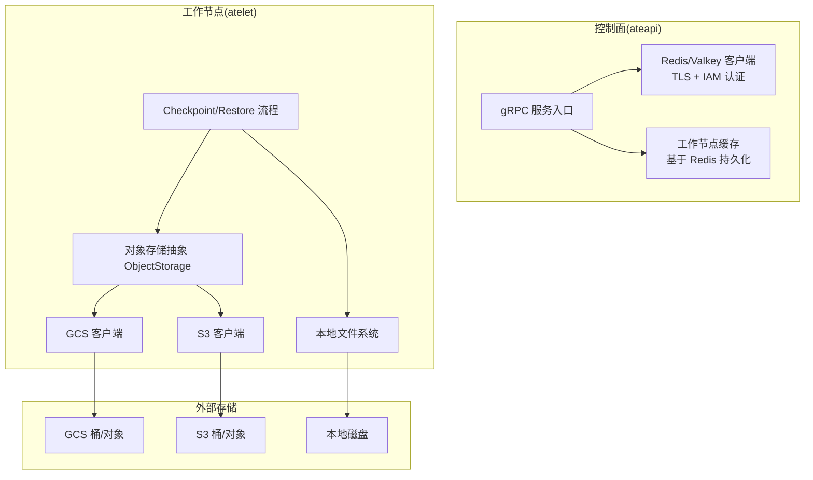
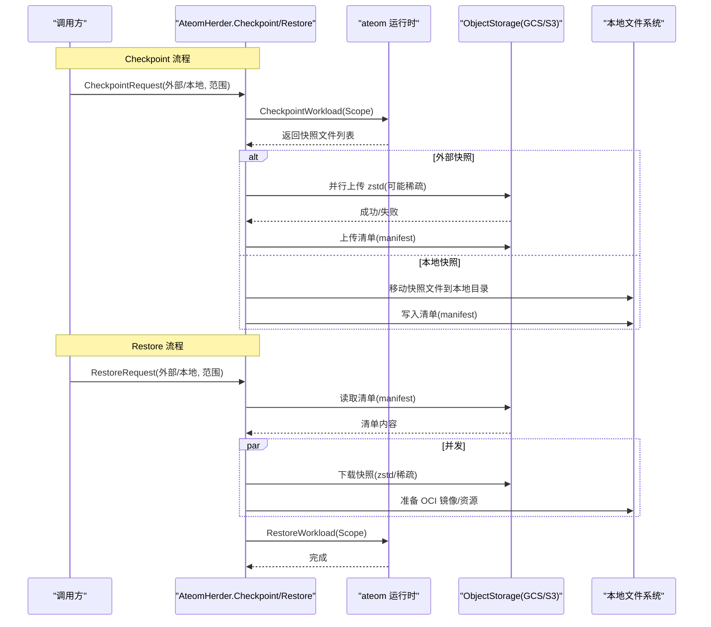
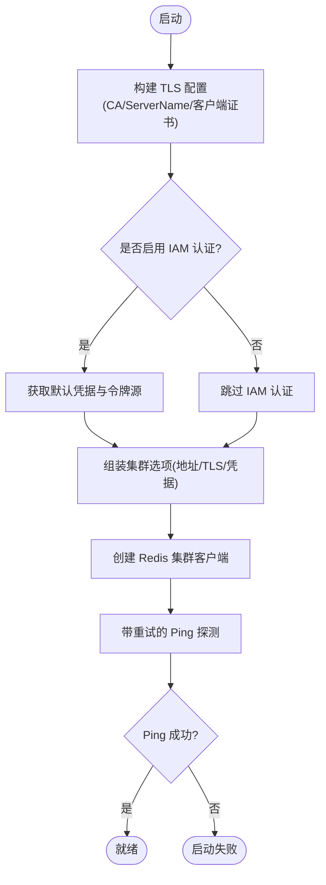
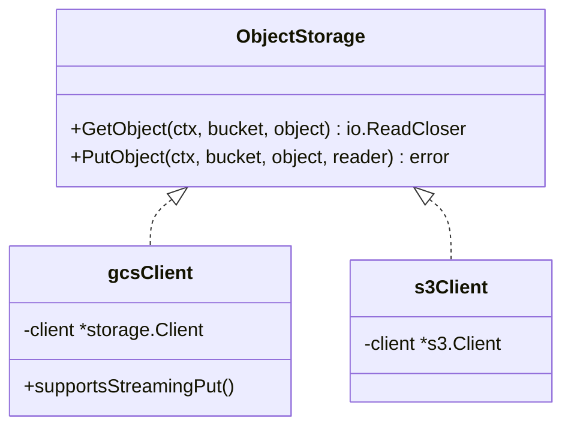
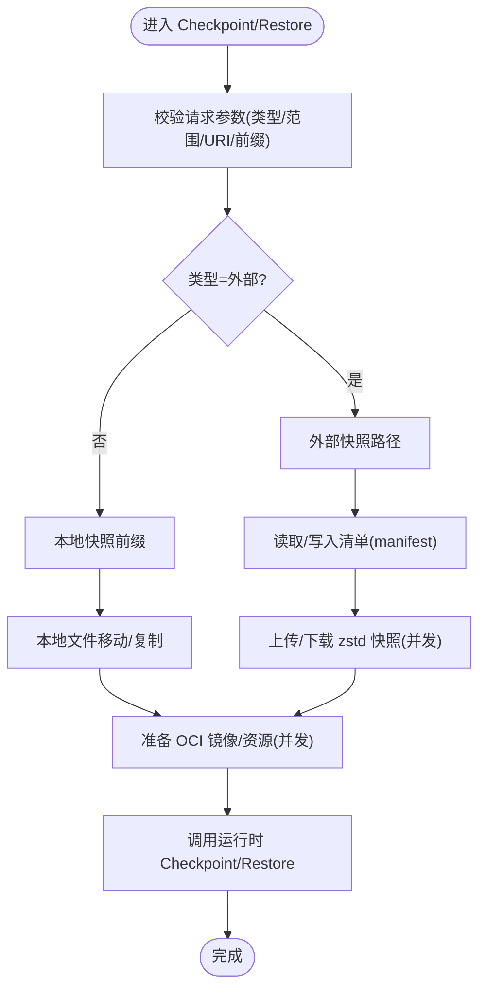
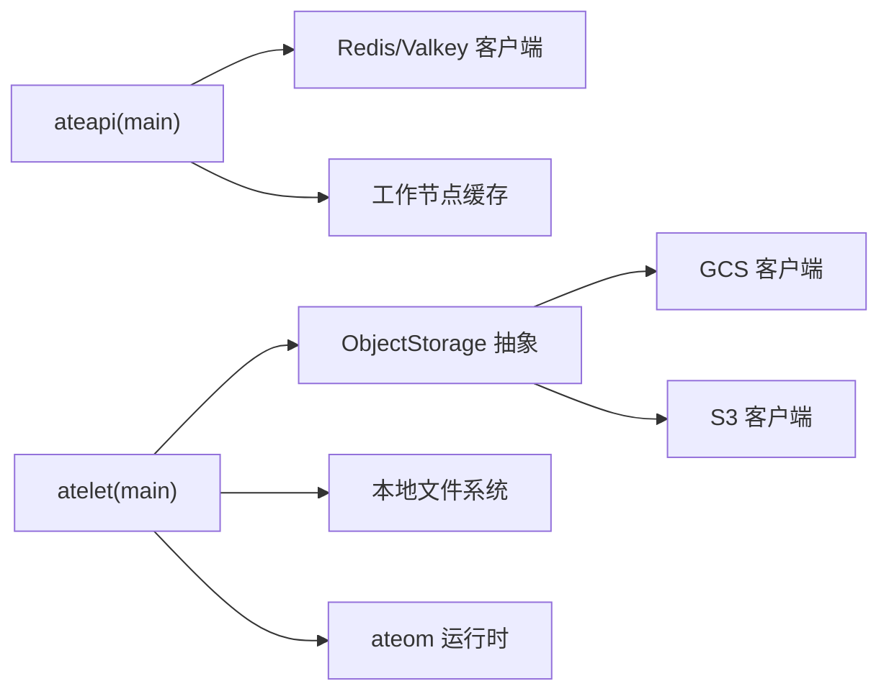

# 存储数据问题

<cite>
**本文引用的文件**   
- [cmd/ateapi/main.go](file://cmd/ateapi/main.go)
- [cmd/atelet/main.go](file://cmd/atelet/main.go)
- [cmd/atelet/internal/ategcs/gcs.go](file://cmd/atelet/internal/ategcs/gcs.go)
- [cmd/atelet/internal/ategcs/s3.go](file://cmd/atelet/internal/ategcs/s3.go)
- [cmd/atelet/internal/ategcs/objects.go](file://cmd/atelet/internal/ategcs/objects.go)
- [internal/ateerrors/ateerrors_test.go](file://internal/ateerrors/ateerrors_test.go)
- [pkg/proto/ateapipb/ateapi.pb.go](file://pkg/proto/ateapipb/ateapi.pb.go)
</cite>

## 目录
1. [简介](#简介)
2. [项目结构](#项目结构)
3. [核心组件](#核心组件)
4. [架构总览](#架构总览)
5. [详细组件分析](#详细组件分析)
6. [依赖关系分析](#依赖关系分析)
7. [性能考量](#性能考量)
8. [故障排查指南](#故障排查指南)
9. [结论](#结论)
10. [附录](#附录)

## 简介
本文件聚焦于存储与数据持久化相关问题，覆盖以下方面：
- Redis/Valkey 连接失败、数据同步异常、缓存不一致的诊断与修复
- 快照创建失败、恢复错误、存储空间不足等状态管理问题的定位与处理
- 对象存储（GCS、S3）的连接配置、权限设置、网络访问等云存储集成问题
- 数据一致性检查、备份恢复、数据迁移的操作建议
- 存储性能监控与优化建议

## 项目结构
与存储相关的关键代码分布在以下模块：
- ateapi：负责 gRPC 控制面服务，包含 Redis/Valkey 集群连接、TLS/IAM 认证、工作节点缓存初始化与同步
- atelet：负责工作负载生命周期，包括 Checkpoint/Restore 流程、本地与外部（GCS/S3）快照上传下载、OCI 镜像准备
- ategcs：抽象对象存储接口并提供 GCS/S3 的具体实现，提供压缩/稀疏写入、流式上传、下载解压等能力
- ateerrors：错误原因码定义与包装，用于将底层错误映射为可观测的“原因”标签
- ateapipb：快照信息的数据模型（外部快照前缀、本地快照信息等）

图表来源
- [cmd/ateapi/main.go:248-331](file://cmd/ateapi/main.go#L248-L331)
- [cmd/atelet/main.go:126-174](file://cmd/atelet/main.go#L126-L174)
- [cmd/atelet/internal/ategcs/gcs.go:27-66](file://cmd/atelet/internal/ategcs/gcs.go#L27-L66)
- [cmd/atelet/internal/ategcs/s3.go:29-58](file://cmd/atelet/internal/ategcs/s3.go#L29-L58)
- [cmd/atelet/internal/ategcs/objects.go:37-40](file://cmd/atelet/internal/ategcs/objects.go#L37-L40)

章节来源
- [cmd/ateapi/main.go:248-331](file://cmd/ateapi/main.go#L248-L331)
- [cmd/atelet/main.go:126-174](file://cmd/atelet/main.go#L126-L174)
- [cmd/atelet/internal/ategcs/objects.go:37-40](file://cmd/atelet/internal/ategcs/objects.go#L37-L40)

## 核心组件
- Redis/Valkey 连接与重试
  - 支持 TLS（自定义 CA、ServerName、客户端证书）与 Google IAM 令牌认证
  - 启动时带退避重试 Ping，确保服务就绪
- 对象存储抽象与实现
  - ObjectStorage 接口统一 Get/Put
  - GCS 实现支持流式 Put（无需缓冲到临时文件）
  - S3 实现需要可寻址体（通过上层缓冲策略适配）
- 快照与恢复
  - Checkpoint：调用运行时生成快照文件，按类型上传至外部或移动到本地目录，并写入自描述清单
  - Restore：先拉取清单，再并发下载快照与准备 OCI 镜像，最后调用运行时恢复

章节来源
- [cmd/ateapi/main.go:248-331](file://cmd/ateapi/main.go#L248-L331)
- [cmd/atelet/main.go:309-452](file://cmd/atelet/main.go#L309-L452)
- [cmd/atelet/main.go:454-583](file://cmd/atelet/main.go#L454-L583)
- [cmd/atelet/internal/ategcs/gcs.go:27-66](file://cmd/atelet/internal/ategcs/gcs.go#L27-L66)
- [cmd/atelet/internal/ategcs/s3.go:29-58](file://cmd/atelet/internal/ategcs/s3.go#L29-L58)
- [cmd/atelet/internal/ategcs/objects.go:156-251](file://cmd/atelet/internal/ategcs/objects.go#L156-L251)

## 架构总览
下图展示从 Checkpoint 到 Restore 的端到端数据流，以及关键错误路径。

图表来源
- [cmd/atelet/main.go:309-452](file://cmd/atelet/main.go#L309-L452)
- [cmd/atelet/main.go:454-583](file://cmd/atelet/main.go#L454-L583)
- [cmd/atelet/internal/ategcs/objects.go:156-251](file://cmd/atelet/internal/ategcs/objects.go#L156-L251)

## 详细组件分析

### Redis/Valkey 连接与认证
- 连接构建
  - 支持自定义 CA、ServerName、客户端证书
  - 可选启用 Google IAM 令牌认证（默认开启）
- 启动健康检查
  - 带最大重试次数与间隔的 Ping，失败则终止启动
- 常见问题
  - TLS 证书/CA 不匹配、ServerName 不正确、IAM 令牌不可用、网络不通

图表来源
- [cmd/ateapi/main.go:287-331](file://cmd/ateapi/main.go#L287-L331)

章节来源
- [cmd/ateapi/main.go:248-331](file://cmd/ateapi/main.go#L248-L331)

### 对象存储抽象与实现（GCS/S3）
- 接口设计
  - ObjectStorage 暴露 GetObject/PutObject
- GCS 实现
  - PutObject 支持流式写入（无需缓冲），适合与压缩管道直连
  - GetObject 对缺失对象/桶进行语义化错误包装
- S3 实现
  - PutObject 需要可寻址体；上层在通用逻辑中对非流式后端采用“先压缩到临时文件再上传”的策略
- 通用能力
  - 发送/接收 zstd 压缩数据
  - 稀疏格式：针对大内存镜像，仅写入非零块，减少 IO 与空间占用
  - URL 解析与错误原因标注

图表来源
- [cmd/atelet/internal/ategcs/objects.go:37-40](file://cmd/atelet/internal/ategcs/objects.go#L37-L40)
- [cmd/atelet/internal/ategcs/gcs.go:27-66](file://cmd/atelet/internal/ategcs/gcs.go#L27-L66)
- [cmd/atelet/internal/ategcs/s3.go:29-58](file://cmd/atelet/internal/ategcs/s3.go#L29-L58)

章节来源
- [cmd/atelet/internal/ategcs/objects.go:156-251](file://cmd/atelet/internal/ategcs/objects.go#L156-L251)
- [cmd/atelet/internal/ategcs/gcs.go:27-66](file://cmd/atelet/internal/ategcs/gcs.go#L27-L66)
- [cmd/atelet/internal/ategcs/s3.go:29-58](file://cmd/atelet/internal/ategcs/s3.go#L29-L58)

### 快照创建与恢复流程
- Checkpoint
  - 校验请求参数（类型、范围、URI 前缀/本地前缀）
  - 调用运行时生成快照文件列表
  - 外部快照：并发上传 zstd 压缩文件，最后写入清单
  - 本地快照：移动文件到本地目录，写入清单
- Restore
  - 校验请求参数
  - 外部快照：先拉取清单，再并发下载快照与准备 OCI 镜像
  - 本地快照：从本地目录复制快照文件
  - 调用运行时恢复，记录耗时分解日志

图表来源
- [cmd/atelet/main.go:309-452](file://cmd/atelet/main.go#L309-L452)
- [cmd/atelet/main.go:454-583](file://cmd/atelet/main.go#L454-L583)
- [cmd/atelet/main.go:913-968](file://cmd/atelet/main.go#L913-L968)

章节来源
- [cmd/atelet/main.go:309-452](file://cmd/atelet/main.go#L309-L452)
- [cmd/atelet/main.go:454-583](file://cmd/atelet/main.go#L454-L583)
- [cmd/atelet/main.go:913-968](file://cmd/atelet/main.go#L913-L968)

### 数据模型与校验
- 外部快照信息
  - 包含快照 URI 前缀字段，用于定位清单与快照对象
- 本地快照信息
  - 包含快照前缀与拥有该快照的节点 VM 列表（暂停态）
- 校验规则
  - 快照类型必须指定且合法
  - 快照范围必须为非空且合法
  - 外部快照 URI 前缀需满足规范；本地快照前缀不能为空

章节来源
- [pkg/proto/ateapipb/ateapi.pb.go:142-181](file://pkg/proto/ateapipb/ateapi.pb.go#L142-L181)
- [cmd/atelet/main.go:913-968](file://cmd/atelet/main.go#L913-L968)

## 依赖关系分析
- ateapi 依赖 Redis/Valkey 作为持久化与缓存后端，并通过工作节点缓存与控制器同步 Worker 状态
- atelet 依赖对象存储（GCS/S3）与本地文件系统，同时与 ateom 运行时交互执行快照/恢复
- ategcs 屏蔽 GCS/S3 差异，向上层提供一致的对象存取与压缩/稀疏能力

图表来源
- [cmd/ateapi/main.go:248-331](file://cmd/ateapi/main.go#L248-L331)
- [cmd/atelet/main.go:126-174](file://cmd/atelet/main.go#L126-L174)
- [cmd/atelet/internal/ategcs/objects.go:37-40](file://cmd/atelet/internal/ategcs/objects.go#L37-L40)

章节来源
- [cmd/ateapi/main.go:248-331](file://cmd/ateapi/main.go#L248-L331)
- [cmd/atelet/main.go:126-174](file://cmd/atelet/main.go#L126-L174)
- [cmd/atelet/internal/ategcs/objects.go:37-40](file://cmd/atelet/internal/ategcs/objects.go#L37-L40)

## 性能考量
- 快照上传/下载
  - 使用 zstd 快速压缩级别，充分利用多核
  - 稀疏格式避免写入大量零块，显著降低 IO 与空间占用
  - GCS 流式上传避免中间缓冲，S3 通过临时文件适配
- 并发与重叠
  - 下载快照与准备 OCI 镜像并发执行，缩短整体恢复时间
- 指标与可观测性
  - 记录快照大小直方图、各阶段耗时分解日志，便于定位瓶颈

章节来源
- [cmd/atelet/main.go:273-307](file://cmd/atelet/main.go#L273-L307)
- [cmd/atelet/main.go:577-582](file://cmd/atelet/main.go#L577-L582)
- [cmd/atelet/internal/ategcs/objects.go:156-251](file://cmd/atelet/internal/ategcs/objects.go#L156-L251)

## 故障排查指南

### Redis/Valkey 连接失败
- 常见原因
  - TLS 证书/CA 未正确挂载或解析失败
  - ServerName 与实际证书不匹配
  - 客户端证书 bundle 解析失败
  - IAM 令牌获取失败或无权限
  - 网络不可达或服务未就绪
- 诊断步骤
  - 检查启动日志中 TLS 与 IAM 相关提示
  - 确认 --redis-cluster-address、--redis-ca-certs、--redis-tls-server-name、--redis-client-cert 配置
  - 验证 IAM 凭据与环境变量
  - 观察带重试的 Ping 日志，定位失败阶段
- 修复建议
  - 修正证书链与 ServerName
  - 调整 IAM 角色与最小权限
  - 检查防火墙/安全组/代理设置

章节来源
- [cmd/ateapi/main.go:287-331](file://cmd/ateapi/main.go#L287-L331)

### 数据同步异常与缓存不一致
- 现象
  - 工作节点缓存无法启动或 Watch 关闭
  - 列表操作失败导致缓存不同步
- 诊断步骤
  - 关注缓存启动与 Watch 生命周期日志
  - 检查底层 ListWorkers 是否报错（如 Valkey 不可用）
- 修复建议
  - 确保 Redis/Valkey 可用性与网络连通
  - 合理设置重试与超时
  - 在 Pod 重启后等待缓存重新同步

章节来源
- [cmd/ateapi/main.go:126-142](file://cmd/ateapi/main.go#L126-L142)

### 快照创建失败
- 常见原因
  - 外部快照上传失败（鉴权/网络/配额）
  - 本地快照目录不可写或空间不足
  - 清单写入失败
- 诊断步骤
  - 查看 Checkpoint 流程日志与错误原因码
  - 检查对象存储桶权限与配额
  - 检查本地磁盘空间与权限
- 修复建议
  - 修正对象存储权限与网络策略
  - 扩容本地磁盘或清理旧快照
  - 确保清单写入原子性与幂等

章节来源
- [cmd/atelet/main.go:309-452](file://cmd/atelet/main.go#L309-L452)

### 恢复错误
- 常见原因
  - 清单不存在或解析失败
  - 快照对象缺失或损坏
  - 本地快照路径无效或文件不完整
  - 目标运行时无效或不可达
- 诊断步骤
  - 检查 Restore 流程日志与错误原因码
  - 验证外部快照 URI 前缀与对象存在性
  - 校验本地快照清单与文件完整性
- 修复建议
  - 补全缺失对象或重建快照
  - 修正 URI 前缀与命名规范
  - 确保 ateom 可达且版本兼容

章节来源
- [cmd/atelet/main.go:454-583](file://cmd/atelet/main.go#L454-L583)

### 对象存储（GCS/S3）集成问题
- 连接配置
  - GCS：默认使用 ADC/工作负载身份
  - S3：通过标准 AWS 环境变量加载配置，支持路径风格切换
- 权限设置
  - 读写桶与对象的最小权限
  - S3 跨域/签名要求（SDK 自动处理）
- 网络访问
  - 出口 IP 白名单、代理、DNS 解析
- 诊断步骤
  - 检查对象是否存在（NoSuchKey/BucketNotExist）
  - 观察上传/下载阶段的压缩与传输日志
- 修复建议
  - 修正 IAM/Access Key/Secret Key 与区域
  - 调整 UsePathStyle 与 Endpoint
  - 检查带宽与限流

章节来源
- [cmd/atelet/main.go:126-174](file://cmd/atelet/main.go#L126-L174)
- [cmd/atelet/internal/ategcs/gcs.go:27-66](file://cmd/atelet/internal/ategcs/gcs.go#L27-L66)
- [cmd/atelet/internal/ategcs/s3.go:29-58](file://cmd/atelet/internal/ategcs/s3.go#L29-L58)
- [cmd/atelet/internal/ategcs/objects.go:156-251](file://cmd/atelet/internal/ategcs/objects.go#L156-L251)

### 数据一致性检查、备份恢复与迁移
- 一致性检查
  - 校验清单与快照文件集合的一致性
  - 对比逻辑大小与实际写入大小（稀疏模式）
- 备份恢复
  - 外部快照：以清单为锚点，批量下载并校验
  - 本地快照：以目录为单元，拷贝并校验
- 迁移
  - 在不同对象存储间迁移：先导出清单，再逐对象重放
  - 注意保留清单中的沙箱二进制与容器镜像版本信息

章节来源
- [cmd/atelet/main.go:309-452](file://cmd/atelet/main.go#L309-L452)
- [cmd/atelet/main.go:454-583](file://cmd/atelet/main.go#L454-L583)
- [cmd/atelet/internal/ategcs/objects.go:156-251](file://cmd/atelet/internal/ategcs/objects.go#L156-L251)

### 错误原因与可观测性
- 错误原因码
  - 将底层错误映射为“原因”，便于上层决策（例如是否需要崩溃重启）
- 指标与日志
  - 快照大小直方图、各阶段耗时分解
  - 上传/下载的压缩与稀疏统计

章节来源
- [internal/ateerrors/ateerrors_test.go:231-255](file://internal/ateerrors/ateerrors_test.go#L231-L255)
- [cmd/atelet/main.go:273-307](file://cmd/atelet/main.go#L273-L307)
- [cmd/atelet/main.go:577-582](file://cmd/atelet/main.go#L577-L582)

## 结论
- 通过统一的对象存储抽象与压缩/稀疏能力，系统在 GCS/S3 上实现了高效可靠的快照与恢复
- Redis/Valkey 的 TLS/IAM 支持与重试机制提升了控制面的稳定性
- 完善的校验与错误原因码有助于快速定位与修复存储层问题
- 结合指标与日志，可对快照与恢复过程进行精细化性能分析与优化

## 附录
- 关键配置项参考
  - Redis/Valkey：集群地址、CA 证书、ServerName、客户端证书、是否启用 IAM 认证
  - GCS：ADC/工作负载身份、匿名客户端（按需）
  - S3：AWS 环境变量、UsePathStyle
- 最佳实践
  - 使用清单驱动的一致性与可恢复性
  - 优先选择流式上传（GCS）以减少 IO 压力
  - 合理设置并发度与超时，避免雪崩
  - 定期巡检对象存储配额与磁盘空间
