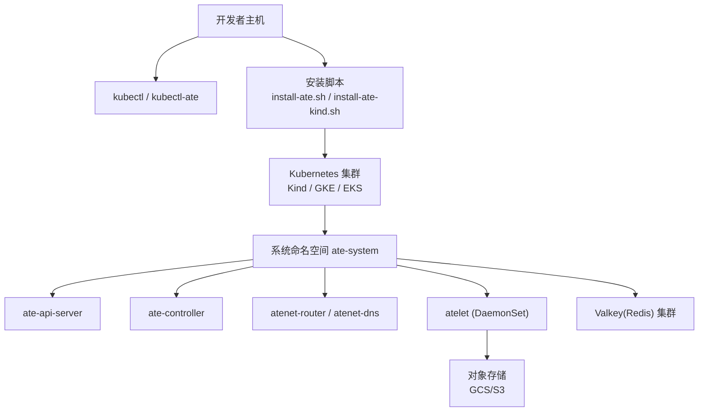
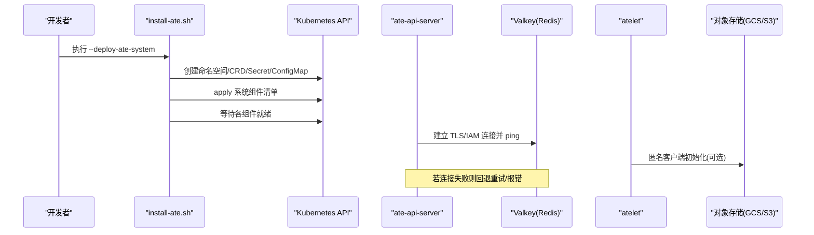
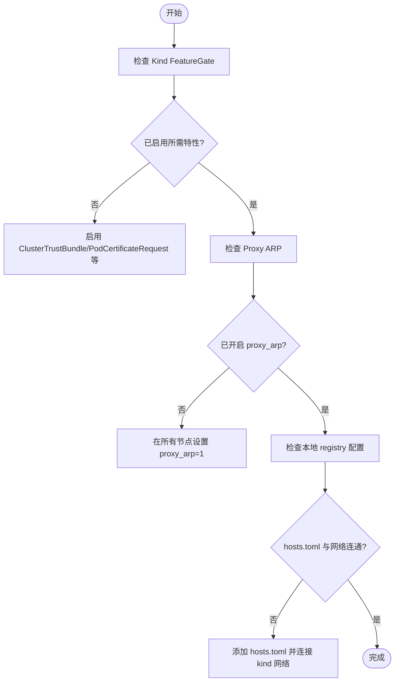
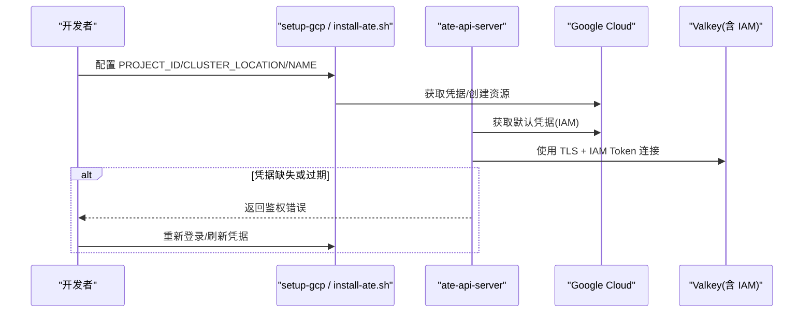
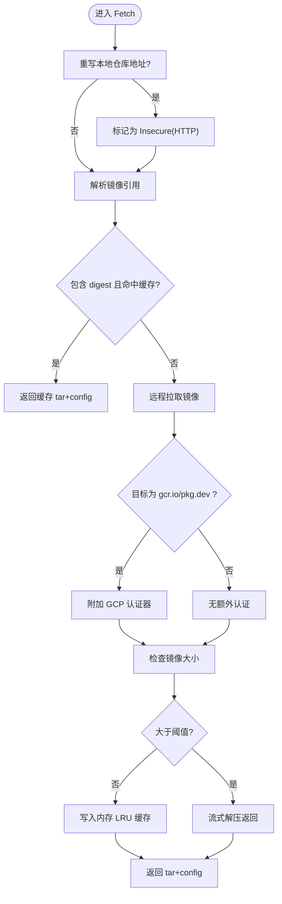
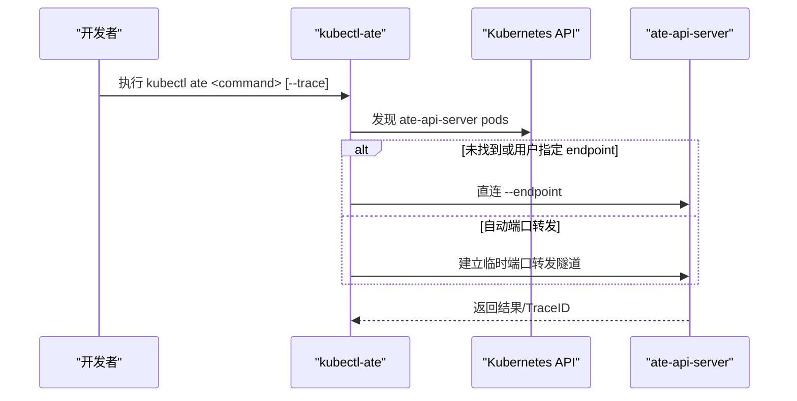
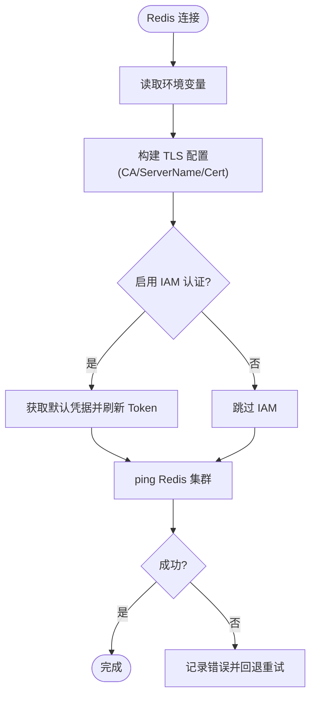
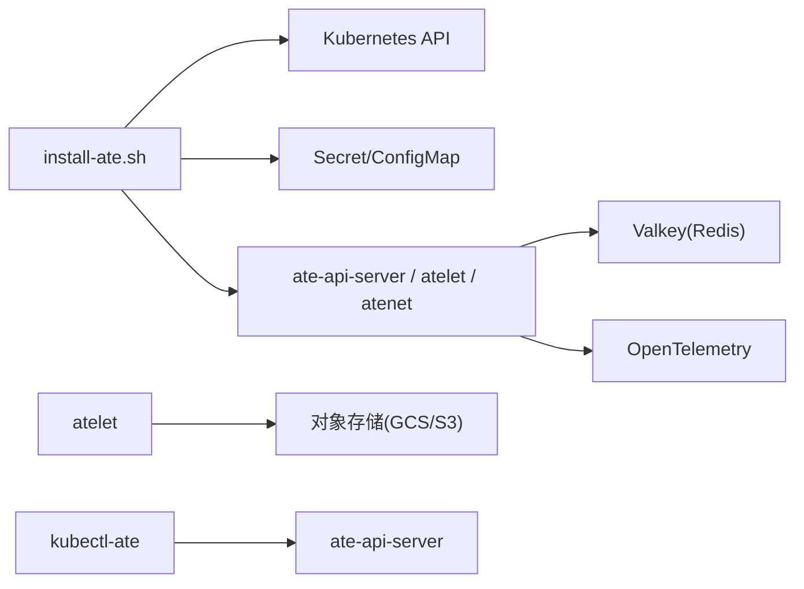

# 安装部署问题

<cite>
**本文引用的文件**   
- [README.md](file://README.md)
- [hack/install-ate.sh](file://hack/install-ate.sh)
- [hack/install-ate-kind.sh](file://hack/install-ate-kind.sh)
- [hack/create-kind-cluster.sh](file://hack/create-kind-cluster.sh)
- [cmd/kubectl-ate/README.md](file://cmd/kubectl-ate/README.md)
- [cmd/kubectl-ate/internal/cmd/root.go](file://cmd/kubectl-ate/internal/cmd/root.go)
- [manifests/ate-install/valkey.yaml](file://manifests/ate-install/valkey.yaml)
- [cmd/ateapi/main.go](file://cmd/ateapi/main.go)
- [cmd/atelet/main.go](file://cmd/atelet/main.go)
- [cmd/atelet/internal/memorypullcache/memorypullcache.go](file://cmd/atelet/internal/memorypullcache/memorypullcache.go)
- [cmd/atelet/internal/ategcs/s3.go](file://cmd/atelet/internal/ategcs/s3.go)
- [cmd/atelet/internal/ategcs/objects.go](file://cmd/atelet/internal/ategcs/objects.go)
- [docs/observability.md](file://docs/observability.md)
</cite>

## 目录
1. [简介](#简介)
2. [项目结构](#项目结构)
3. [核心组件](#核心组件)
4. [架构总览](#架构总览)
5. [详细组件分析](#详细组件分析)
6. [依赖分析](#依赖分析)
7. [性能考虑](#性能考虑)
8. [故障排查指南](#故障排查指南)
9. [结论](#结论)
10. [附录](#附录)

## 简介
本文件聚焦于 Agent Substrate 在安装与部署过程中常见问题的定位与解决，覆盖以下方面：
- Kubernetes 集群初始化失败（特别是 Kind）
- 权限配置错误（GKE、IAM、RBAC 等）
- 镜像拉取问题（本地仓库、gcr.io/pkg.dev、Kind 镜像重写）
- kubectl-ate CLI 的安装与配置（证书生成、JWT 配置、连接方式）
- 不同环境（Kind、GKE、EKS）的特定问题与解法
- 存储后端（Redis/Valkey、对象存储 S3/GCS）连接失败的诊断步骤
- 完整的日志收集方法与关键错误信息解读

## 项目结构
与安装部署密切相关的脚本与清单位于 hack 与 manifests 目录；CLI 工具在 cmd/kubectl-ate；控制面与服务端实现位于 cmd/ateapi、cmd/atelet、cmd/atenet 等。

图表来源
- [hack/install-ate.sh:267-310](file://hack/install-ate.sh#L267-L310)
- [hack/install-ate-kind.sh:25-38](file://hack/install-ate-kind.sh#L25-L38)
- [manifests/ate-install/valkey.yaml:184-196](file://manifests/ate-install/valkey.yaml#L184-L196)

章节来源
- [README.md:97-128](file://README.md#L97-L128)
- [hack/install-ate.sh:267-310](file://hack/install-ate.sh#L267-L310)
- [hack/install-ate-kind.sh:25-38](file://hack/install-ate-kind.sh#L25-L38)

## 核心组件
- 安装编排：install-ate.sh 负责渲染并应用系统资源、创建必要 Secret/ConfigMap、等待组件就绪；install-ate-kind.sh 为 Kind 环境注入 overlay 与本地镜像仓库设置。
- 控制面：ate-api-server 提供 gRPC API，依赖 Redis/Valkey 作为状态存储，支持 mTLS/JWT 两种认证模式。
- 节点代理：atelet 以 DaemonSet 运行，负责镜像拉取缓存、快照上传到对象存储、与 ateom 交互。
- 网络层：atenet-router/dns 提供 DNS 解析与 Envoy 路由。
- 存储：Valkey（Redis 兼容）用于控制面状态；对象存储（GCS/S3）用于快照与工件持久化。
- CLI：kubectl-ate 提供资源管理、日志、调试命令，支持自动端口转发或直连 endpoint。

章节来源
- [hack/install-ate.sh:135-167](file://hack/install-ate.sh#L135-L167)
- [cmd/ateapi/main.go:256-314](file://cmd/ateapi/main.go#L256-L314)
- [cmd/atelet/main.go:98-124](file://cmd/atelet/main.go#L98-L124)
- [cmd/kubectl-ate/README.md:24-70](file://cmd/kubectl-ate/README.md#L24-L70)

## 架构总览
下图展示了安装流程中关键步骤与组件间的调用关系。

图表来源
- [hack/install-ate.sh:267-310](file://hack/install-ate.sh#L267-L310)
- [cmd/ateapi/main.go:256-314](file://cmd/ateapi/main.go#L256-L314)
- [cmd/atelet/main.go:121-124](file://cmd/atelet/main.go#L121-L124)

## 详细组件分析

### 1) Kubernetes 集群初始化失败（Kind）
常见问题与现象
- 缺少必要的 FeatureGate 导致 podcertificate-controller 无法工作（ClusterTrustBundle/PodCertificateRequest）。
- 未启用 Proxy ARP，gVisor 场景下 Pod 间网络不通。
- 未将本地 registry 加入 containerd 信任列表，导致镜像拉取失败。
- 未将本地 registry 容器连接到 kind 网络，导致集群内无法访问 localhost:5001。

定位与修复要点
- 检查 Kind 配置是否启用了 ClusterTrustBundle、PodCertificateRequest 以及 certificates.k8s.io/v1beta1。
- 确认已在所有 kind 节点上开启 net.ipv4.conf.all.proxy_arp=1。
- 确认已将 http://kind-registry:5000 映射到 containerd 的 hosts.toml。
- 确认 kind-registry 容器已启动且映射了 5001 端口，并已加入 kind 网络。

图表来源
- [hack/create-kind-cluster.sh:60-92](file://hack/create-kind-cluster.sh#L60-L92)
- [hack/create-kind-cluster.sh:94-108](file://hack/create-kind-cluster.sh#L94-L108)
- [hack/create-kind-cluster.sh:110-124](file://hack/create-kind-cluster.sh#L110-L124)

章节来源
- [hack/create-kind-cluster.sh:60-92](file://hack/create-kind-cluster.sh#L60-L92)
- [hack/create-kind-cluster.sh:94-108](file://hack/create-kind-cluster.sh#L94-L108)
- [hack/create-kind-cluster.sh:110-124](file://hack/create-kind-cluster.sh#L110-L124)

### 2) 权限配置错误（GKE/IAM/RBAC）
常见问题与现象
- 未配置 application-default credentials，导致 setup-gcp 或 ate-api-server 无法获取默认凭据。
- Redis IAM 认证未正确启用或 Token 刷新失败。
- GKE OIDC Issuer 未被正确识别，导致 JWT 校验失败。

定位与修复要点
- 使用 gcloud auth application-default login 配置默认凭据。
- 确认 Redis 地址、TLS ServerName、CA 证书与客户端证书路径正确。
- 确认 ATE_API_K8SJWT_ISSUER 指向正确的 OIDC Issuer（GKE 场景通常为 container.googleapis.com）。

图表来源
- [hack/install-ate.sh:217-251](file://hack/install-ate.sh#L217-L251)
- [cmd/ateapi/main.go:256-285](file://cmd/ateapi/main.go#L256-L285)

章节来源
- [hack/install-ate.sh:217-251](file://hack/install-ate.sh#L217-L251)
- [cmd/ateapi/main.go:256-285](file://cmd/ateapi/main.go#L256-L285)

### 3) 镜像拉取问题（本地仓库、gcr.io/pkg.dev、Kind 镜像重写）
常见问题与现象
- 在 Kind 环境中引用 localhost:5001 镜像，但节点无法解析或走 HTTPS。
- 从 gcr.io/pkg.dev 拉取镜像时鉴权失败。
- 大镜像导致内存占用过高或拉取超时。

定位与修复要点
- 通过 memorypullcache 的 localhost 重写机制，将 localhost/* 替换为 kind-registry:5000，并允许 HTTP。
- 针对 gcr.io/pkg.dev 启用 GCP 认证器进行鉴权。
- 对超大镜像不进行内存缓存，直接流式解压。

图表来源
- [cmd/atelet/internal/memorypullcache/memorypullcache.go:73-198](file://cmd/atelet/internal/memorypullcache/memorypullcache.go#L73-L198)

章节来源
- [cmd/atelet/internal/memorypullcache/memorypullcache.go:73-198](file://cmd/atelet/internal/memorypullcache/memorypullcache.go#L73-L198)
- [cmd/atelet/main.go:108-119](file://cmd/atelet/main.go#L108-L119)

### 4) kubectl-ate CLI 安装与配置（证书、JWT、连接）
常见问题与现象
- 找不到 kubectl-ate 插件或未安装到 PATH。
- 无法自动发现 ate-api-server，需手动指定 --endpoint。
- 未启用 tracing 或 OpenTelemetry 后端不可用。
- 未生成 CA/JWT 池 Secret，导致安全相关功能不可用。

定位与修复要点
- 使用 go install ./cmd/kubectl-ate 安装插件，或通过 go run 直接运行。
- 如需直连，使用 --endpoint 指定 gRPC 地址。
- 在 Kind 中可通过 port-forward Jaeger UI 查看 trace。
- 使用 admin make-ca-pool 与 admin make-jwt-pool 生成并推送 Secret。

图表来源
- [cmd/kubectl-ate/README.md:24-70](file://cmd/kubectl-ate/README.md#L24-L70)
- [cmd/kubectl-ate/internal/cmd/root.go:34-52](file://cmd/kubectl-ate/internal/cmd/root.go#L34-L52)

章节来源
- [cmd/kubectl-ate/README.md:24-70](file://cmd/kubectl-ate/README.md#L24-L70)
- [cmd/kubectl-ate/internal/cmd/root.go:34-52](file://cmd/kubectl-ate/internal/cmd/root.go#L34-L52)

### 5) 不同环境的特定问题与解决方法
- Kind
  - 必须启用 FeatureGate 与 Proxy ARP，配置本地 registry 与网络连通性。
  - 使用 install-ate-kind.sh 自动注入 overlay 与 KO_DOCKER_REPO=localhost:5001。
- GKE
  - 使用 setup-gcp bootstrap 创建集群、Redis、GCS、IAM 绑定。
  - 确保 Managed OpenTelemetry 已启用以便 tracing。
- EKS
  - 参考 GKE 思路准备外部 Redis（如 ElastiCache）、对象存储（S3），并确保 IAM 角色与网络可达。

章节来源
- [hack/install-ate-kind.sh:25-38](file://hack/install-ate-kind.sh#L25-L38)
- [README.md:130-175](file://README.md#L130-L175)

### 6) 存储后端连接失败诊断（Redis/Valkey、对象存储）
Redis/Valkey
- 检查 ate-api-server 环境变量：ATE_API_REDIS_ADDRESS、ATE_API_REDIS_USE_IAM_AUTH、ATE_API_REDIS_TLS_SERVER_NAME、ATE_API_REDIS_CLIENT_CERT。
- 确认 Valkey 集群已初始化并通过 TLS 与客户端证书可 ping。
- 若启用 IAM，确认默认凭据可用且能刷新 token。

对象存储（GCS/S3）
- atelet 使用匿名客户端初始化（部分场景），或在需要时使用 GCP 认证器。
- S3 接口封装了 GetObject/PutObject，错误会包装为统一原因码便于排查。

图表来源
- [cmd/ateapi/main.go:256-314](file://cmd/ateapi/main.go#L256-L314)
- [manifests/ate-install/valkey.yaml:184-196](file://manifests/ate-install/valkey.yaml#L184-L196)
- [cmd/atelet/main.go:121-124](file://cmd/atelet/main.go#L121-L124)
- [cmd/atelet/internal/ategcs/s3.go:37-58](file://cmd/atelet/internal/ategcs/s3.go#L37-L58)

章节来源
- [cmd/ateapi/main.go:256-314](file://cmd/ateapi/main.go#L256-L314)
- [manifests/ate-install/valkey.yaml:184-196](file://manifests/ate-install/valkey.yaml#L184-L196)
- [cmd/atelet/main.go:121-124](file://cmd/atelet/main.go#L121-L124)
- [cmd/atelet/internal/ategcs/s3.go:37-58](file://cmd/atelet/internal/ategcs/s3.go#L37-L58)

## 依赖分析
- 安装脚本依赖 kubectl、ko、kustomize；在 Kind 环境下通过 overlay 选择特定清单。
- ate-api-server 依赖 Redis/Valkey（TLS/IAM）、OpenTelemetry 指标与追踪。
- atelet 依赖对象存储（GCS/S3）、镜像仓库（gcr.io/pkg.dev 或本地仓库）。
- kubectl-ate 依赖 kubeconfig 与 ate-api-server 可达性。

图表来源
- [hack/install-ate.sh:267-310](file://hack/install-ate.sh#L267-L310)
- [cmd/ateapi/main.go:256-314](file://cmd/ateapi/main.go#L256-L314)
- [cmd/atelet/main.go:108-124](file://cmd/atelet/main.go#L108-L124)
- [cmd/kubectl-ate/README.md:24-70](file://cmd/kubectl-ate/README.md#L24-L70)

章节来源
- [hack/install-ate.sh:267-310](file://hack/install-ate.sh#L267-L310)
- [cmd/ateapi/main.go:256-314](file://cmd/ateapi/main.go#L256-L314)
- [cmd/atelet/main.go:108-124](file://cmd/atelet/main.go#L108-L124)
- [cmd/kubectl-ate/README.md:24-70](file://cmd/kubectl-ate/README.md#L24-L70)

## 性能考虑
- 镜像拉取：对小镜像采用内存 LRU 缓存，减少重复拉取开销；对大镜像采用流式解压避免内存膨胀。
- Redis 扫描分页：按分片顺序扫描，避免一次性加载过多键。
- 指标与追踪：通过 OpenTelemetry 上报系统级指标与按需追踪，有助于定位慢请求与热点。

章节来源
- [cmd/atelet/internal/memorypullcache/memorypullcache.go:166-198](file://cmd/atelet/internal/memorypullcache/memorypullcache.go#L166-L198)
- [docs/observability.md:103-133](file://docs/observability.md#L103-L133)

## 故障排查指南
- 日志收集
  - 使用 kubectl-ate logs actors <name> 查看当前运行中的 actor 日志；支持 --follow/-f 跟随迁移。
  - 在 Kind 中通过 Prometheus/Jaeger 端口转发查看指标与追踪。
- 关键错误信息解读
  - Redis 连接失败：检查 TLS 配置、ServerName、客户端证书路径与 IAM Token 刷新。
  - 对象存储失败：检查 bucket/key 是否存在、S3/GCS 客户端初始化与权限。
  - 镜像拉取失败：检查本地 registry 配置、gcr.io/pkg.dev 认证、镜像大小与网络连通性。
- 安装阶段问题
  - 组件未就绪：关注 rollout status 输出与对应 Deployment/StatefulSet/DaemonSet 事件。
  - 安全相关 Secret 缺失：使用 admin make-ca-pool 与 admin make-jwt-pool 生成并推送。

章节来源
- [docs/observability.md:21-66](file://docs/observability.md#L21-L66)
- [cmd/ateapi/main.go:256-314](file://cmd/ateapi/main.go#L256-L314)
- [cmd/atelet/internal/ategcs/objects.go:51-93](file://cmd/atelet/internal/ategcs/objects.go#L51-L93)
- [cmd/kubectl-ate/README.md:179-198](file://cmd/kubectl-ate/README.md#L179-L198)

## 结论
通过理解安装脚本的工作流、各组件的依赖关系与典型错误路径，可以快速定位并解决 Kind/GKE/EKS 环境下的集群初始化、权限、镜像拉取、CLI 配置与存储连接等问题。结合观测能力（日志、指标、追踪）与标准化排障步骤，能够显著提升部署效率与稳定性。

## 附录
- 快速参考
  - Kind 初始化：参考 create-kind-cluster.sh 的配置项与后续步骤。
  - 安装系统：install-ate.sh 的 --deploy-ate-system 及子命令。
  - CLI 使用：kubectl-ate 的连接、tracing 与 admin 命令。
  - 观测：observability.md 中的日志、指标与追踪说明。

章节来源
- [hack/create-kind-cluster.sh:60-124](file://hack/create-kind-cluster.sh#L60-L124)
- [hack/install-ate.sh:58-98](file://hack/install-ate.sh#L58-L98)
- [cmd/kubectl-ate/README.md:61-70](file://cmd/kubectl-ate/README.md#L61-L70)
- [docs/observability.md:103-194](file://docs/observability.md#L103-L194)
