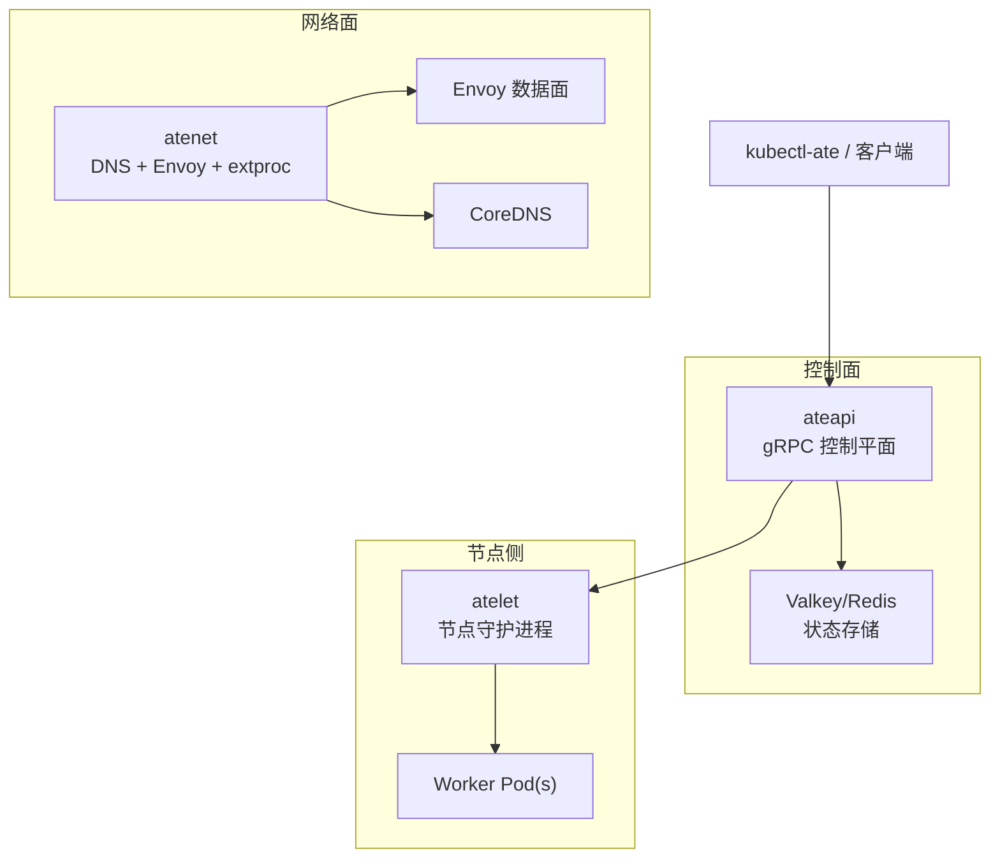
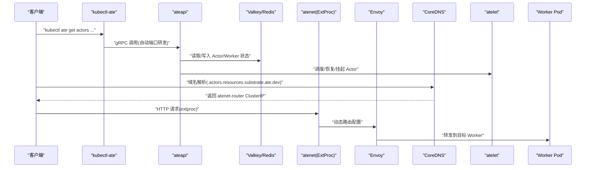
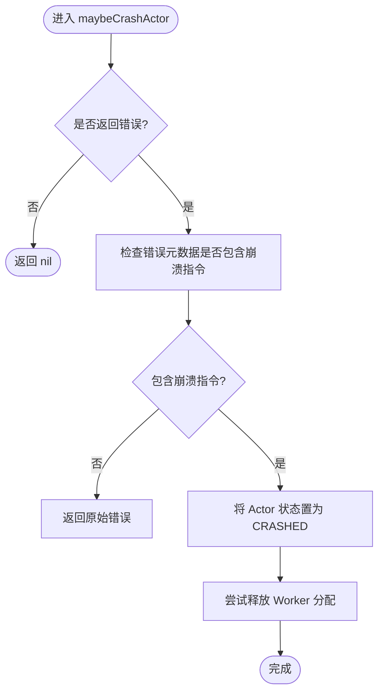
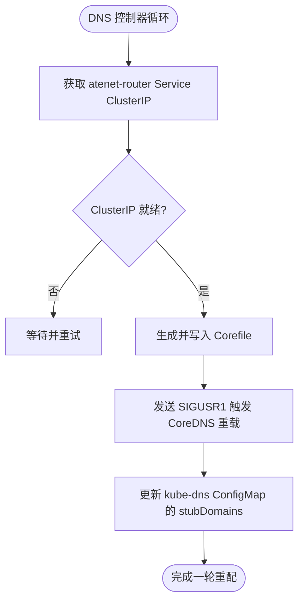
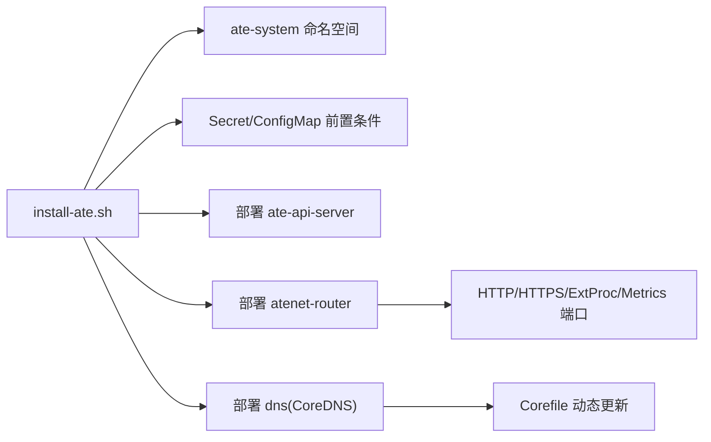

# 常见问题诊断

<cite>
**本文引用的文件**   
- [README.md](file://README.md)
- [cmd/kubectl-ate/README.md](file://cmd/kubectl-ate/README.md)
- [cmd/kubectl-ate/main.go](file://cmd/kubectl-ate/main.go)
- [cmd/kubectl-ate/internal/cmd/root.go](file://cmd/kubectl-ate/internal/cmd/root.go)
- [hack/install-ate.sh](file://hack/install-ate.sh)
- [manifests/ate-install/atenet-router.yaml](file://manifests/ate-install/atenet-router.yaml)
- [manifests/ate-install/atenet-dns.yaml](file://manifests/ate-install/atenet-dns.yaml)
- [cmd/atenet/internal/router/status.go](file://cmd/atenet/internal/router/status.go)
- [cmd/atenet/internal/dns/dns.go](file://cmd/atenet/internal/dns/dns.go)
- [internal/e2e/README.md](file://internal/e2e/README.md)
- [internal/e2e/testmain.go](file://internal/e2e/testmain.go)
- [hack/run-e2e.sh](file://hack/run-e2e.sh)
- [hack/run-e2e-kind.sh](file://hack/run-e2e-kind.sh)
- [cmd/ateapi/internal/controlapi/crash.go](file://cmd/ateapi/internal/controlapi/crash.go)
- [cmd/ateapi/internal/controlapi/syncer.go](file://cmd/ateapi/internal/controlapi/syncer.go)
- [cmd/ateapi/internal/controlapi/functional_test.go](file://cmd/ateapi/internal/controlapi/functional_test.go)
</cite>

## 目录
1. [简介](#简介)
2. [项目结构](#项目结构)
3. [核心组件](#核心组件)
4. [架构总览](#架构总览)
5. [详细组件分析](#详细组件分析)
6. [依赖关系分析](#依赖关系分析)
7. [性能与可观测性](#性能与可观测性)
8. [故障排查指南](#故障排查指南)
9. [结论](#结论)
10. [附录](#附录)

## 简介
本指南聚焦于 Agent Substrate 的常见问题快速诊断与解决方案，覆盖安装部署失败、服务启动错误、组件连接异常等基础问题。文档提供 ateapi、atenet、atelet 等主要服务的日志定位方法与关键错误信息解读；介绍 kubectl-ate CLI 的调试命令与输出解读；给出系统健康检查的方法与工具使用指南；并包含 E2E 测试的执行与结果分析步骤，帮助新手用户循序渐进地定位系统性问题。

## 项目结构
Agent Substrate 由多个独立的可执行程序组成，分别承担控制面、网络面、节点侧代理以及 CLI 工具的职责：
- ateapi：控制面 gRPC API 服务器，管理 Actor/Worker 生命周期与状态
- atenet：网络控制器，集成 DNS、Envoy 路由与外部处理（extproc）
- atelet：节点级守护进程，负责 Worker Pod 监督、快照与状态迁移
- kubectl-ate：Kubernetes 插件式 CLI，用于资源管理与排障
- 其他辅助组件：atecontroller、ateom-gvisor、ateom-microvm、podcertcontroller 等

图表来源
- [README.md:215-224](file://README.md#L215-L224)
- [manifests/ate-install/atenet-router.yaml:160-215](file://manifests/ate-install/atenet-router.yaml#L160-L215)
- [manifests/ate-install/atenet-dns.yaml:76-131](file://manifests/ate-install/atenet-dns.yaml#L76-L131)

章节来源
- [README.md:215-224](file://README.md#L215-L224)

## 核心组件
- ateapi
  - 职责：暴露 gRPC 接口，编排 Actor/Worker 生命周期，协调快照与恢复
  - 常见错误点：与 atelet 通信失败、状态不一致、工作节点被删除后的清理
  - 相关实现参考：[crash.go](file://cmd/ateapi/internal/controlapi/crash.go)、[syncer.go](file://cmd/ateapi/internal/controlapi/syncer.go)
- atenet
  - 职责：提供 DNS 解析、Envoy 路由与 extproc 外部处理，维护健康状态与查询记录
  - 常见错误点：Service ClusterIP 未就绪、CoreDNS 配置未更新、健康检查失败
  - 相关实现参考：[status.go](file://cmd/atenet/internal/router/status.go)、[dns.go](file://cmd/atenet/internal/dns/dns.go)
- atelet
  - 职责：节点侧守护进程，监督 Worker Pod、执行快照/恢复、管理状态转移
  - 常见错误点：Pod 状态不同步、gRPC 监听失败、与 ateapi 通信异常
  - 相关实现参考：[functional_test.go](file://cmd/ateapi/internal/controlapi/functional_test.go)
- kubectl-ate
  - 职责：Kubernetes 插件式 CLI，自动端口转发、支持追踪、输出多种格式
  - 常见错误点：kubeconfig/context 配置错误、端口转发失败、endpoint 不匹配
  - 相关实现参考：[root.go](file://cmd/kubectl-ate/internal/cmd/root.go)、[README.md](file://cmd/kubectl-ate/README.md)

章节来源
- [cmd/ateapi/internal/controlapi/crash.go:1-35](file://cmd/ateapi/internal/controlapi/crash.go#L1-L35)
- [cmd/ateapi/internal/controlapi/syncer.go:69-114](file://cmd/ateapi/internal/controlapi/syncer.go#L69-L114)
- [cmd/atenet/internal/router/status.go:180-281](file://cmd/atenet/internal/router/status.go#L180-L281)
- [cmd/atenet/internal/dns/dns.go:71-189](file://cmd/atenet/internal/dns/dns.go#L71-L189)
- [cmd/ateapi/internal/controlapi/functional_test.go:105-157](file://cmd/ateapi/internal/controlapi/functional_test.go#L105-L157)
- [cmd/kubectl-ate/internal/cmd/root.go:34-52](file://cmd/kubectl-ate/internal/cmd/root.go#L34-L52)
- [cmd/kubectl-ate/README.md:24-70](file://cmd/kubectl-ate/README.md#L24-L70)

## 架构总览
下图展示了从客户端到数据面的请求路径，以及各组件间的依赖关系。

图表来源
- [cmd/kubectl-ate/README.md:24-70](file://cmd/kubectl-ate/README.md#L24-L70)
- [manifests/ate-install/atenet-router.yaml:160-215](file://manifests/ate-install/atenet-router.yaml#L160-L215)
- [manifests/ate-install/atenet-dns.yaml:76-131](file://manifests/ate-install/atenet-dns.yaml#L76-L131)

## 详细组件分析

### ateapi 组件分析与排障
- 关键流程
  - 当与 atelet 的 RPC 返回错误且携带“崩溃”指令时，控制面会将 Actor 标记为崩溃并尝试释放 Worker 分配
  - 同步器监听 Pod 事件，在删除或软删除时将 Worker 从存储中移除，并清理已绑定的 Actor
- 常见错误信息与定位
  - “Setting Actor to crashed due to error”：表明底层 Worker 或快照/恢复过程出现严重错误
  - “Failed to release actor bound to deleted worker”：Worker 被删除后未能正确释放绑定
  - “Syncer: failed to sync informer cache”：Informer 缓存同步失败，需检查 Kubernetes API 连通性与权限
- 建议操作
  - 查看 ateapi 日志，关注上述关键字段
  - 确认 atelet Pod 状态与 gRPC 监听端口可达
  - 若 Worker 频繁消失，检查节点健康与 Pod 驱逐策略

图表来源
- [cmd/ateapi/internal/controlapi/crash.go:1-35](file://cmd/ateapi/internal/controlapi/crash.go#L1-L35)

章节来源
- [cmd/ateapi/internal/controlapi/crash.go:1-35](file://cmd/ateapi/internal/controlapi/crash.go#L1-L35)
- [cmd/ateapi/internal/controlapi/syncer.go:69-114](file://cmd/ateapi/internal/controlapi/syncer.go#L69-L114)

### atenet 组件分析与排障
- 健康检查与仪表盘
  - 通过 statusz 端点获取 JSON 或 HTML 视图，包含构建信息、参数、最近查询与健康报告
  - 健康报告中包含 AteAPI 的健康状态、成功/失败计数与最后成功时间
- DNS 控制器
  - 定期拉取 atenet-router Service 的 ClusterIP，生成 CoreDNS Corefile 并写入共享卷
  - 向 kube-system 的 kube-dns ConfigMap 注入 stubDomains，使自定义后缀指向 atenet DNS
- 常见错误信息与定位
  - “atenet-router service not found, skipping until it is available”：Service 尚未就绪
  - “failed to reconcile CoreDNS config file”：写文件或信号重载失败
  - “kube-dns ConfigMap not found in kube-system namespace”：集群未启用 kube-dns 或权限不足
- 建议操作
  - 访问 atenet-router 的 statusz 端点，确认健康状态与最近查询
  - 检查 CoreDNS 容器日志与 Corefile 内容
  - 验证 kube-dns ConfigMap 的 stubDomains 是否包含 ate-system 的 DNS IP

图表来源
- [cmd/atenet/internal/dns/dns.go:71-189](file://cmd/atenet/internal/dns/dns.go#L71-L189)
- [cmd/atenet/internal/router/status.go:180-281](file://cmd/atenet/internal/router/status.go#L180-L281)

章节来源
- [cmd/atenet/internal/router/status.go:180-281](file://cmd/atenet/internal/router/status.go#L180-L281)
- [cmd/atenet/internal/dns/dns.go:71-189](file://cmd/atenet/internal/dns/dns.go#L71-L189)

### atelet 组件分析与排障
- 常见错误信息与定位
  - 测试中会创建 atelet Pod 并启动 Fake Atelet Server 监听本地端口，若监听失败则直接退出
  - 若 Pod 状态未更新为 Running 或缺少 PodIP，控制面无法建立连接
- 建议操作
  - 检查 atelet Pod 的日志与事件
  - 确认 gRPC 端口可达，且 Pod 状态正常
  - 若 Worker 分配异常，结合 ateapi 的同步器日志进行交叉验证

章节来源
- [cmd/ateapi/internal/controlapi/functional_test.go:105-157](file://cmd/ateapi/internal/controlapi/functional_test.go#L105-L157)

### kubectl-ate CLI 调试命令与输出解读
- 全局选项
  - --kubeconfig：指定 kubeconfig 路径
  - --endpoint：手动覆盖 gRPC 端点（跳过自动端口转发）
  - --output：输出格式 table/json/yaml
  - --trace：开启单次请求的分布式追踪
- 常用命令
  - get actors/get workers：列出 Actor/Worker 及其状态
  - create/delete/resume/suspend actor：管理 Actor 生命周期
  - logs actors <name>：流式查看 Actor 日志（仅运行态）
  - admin make-ca-pool/make-jwt-pool/debug-flush-redis：管理 CA/JWT 池与调试
- 连接与追踪
  - 默认自动发现 ate-api-server 并建立临时端口转发
  - 在 kind 环境中可通过 Jaeger UI 查看 trace

章节来源
- [cmd/kubectl-ate/README.md:24-70](file://cmd/kubectl-ate/README.md#L24-L70)
- [cmd/kubectl-ate/README.md:73-198](file://cmd/kubectl-ate/README.md#L73-L198)
- [cmd/kubectl-ate/internal/cmd/root.go:34-52](file://cmd/kubectl-ate/internal/cmd/root.go#L34-L52)

## 依赖关系分析
- 安装脚本依赖
  - 确保 ate-api-server 所需 Secret 与 ConfigMap 存在（JWT 池、CA 池、Valkey CA 证书、环境变量）
  - 按顺序部署命名空间、CRD、组件，并等待 rollout 完成
- 网络与服务
  - atenet-router 暴露 HTTP/HTTPS 端口，并通过 Service 对外提供服务
  - CoreDNS 通过 initContainer 初始化 Corefile，并在运行时由控制器更新与重载

图表来源
- [hack/install-ate.sh:312-344](file://hack/install-ate.sh#L312-L344)
- [manifests/ate-install/atenet-router.yaml:160-215](file://manifests/ate-install/atenet-router.yaml#L160-L215)
- [manifests/ate-install/atenet-dns.yaml:76-131](file://manifests/ate-install/atenet-dns.yaml#L76-L131)

章节来源
- [hack/install-ate.sh:312-344](file://hack/install-ate.sh#L312-L344)
- [manifests/ate-install/atenet-router.yaml:160-215](file://manifests/ate-install/atenet-router.yaml#L160-L215)
- [manifests/ate-install/atenet-dns.yaml:76-131](file://manifests/ate-install/atenet-dns.yaml#L76-L131)

## 性能与可观测性
- 追踪
  - kubectl-ate 支持 --trace 开启单次请求追踪，kind 环境默认部署 OpenTelemetry Collector 与 Jaeger
- 指标与健康
  - atenet-router 暴露 metrics 端口，statusz 提供健康与最近查询记录
  - CoreDNS 提供 health/ready 探针端口
- 建议
  - 使用 Jaeger UI 查看端到端链路耗时
  - 监控 atenet-router 的查询记录与健康报告，定位慢请求与失败原因

章节来源
- [cmd/kubectl-ate/README.md:29-59](file://cmd/kubectl-ate/README.md#L29-L59)
- [cmd/atenet/internal/router/status.go:180-281](file://cmd/atenet/internal/router/status.go#L180-L281)
- [manifests/ate-install/atenet-dns.yaml:127-131](file://manifests/ate-install/atenet-dns.yaml#L127-L131)

## 故障排查指南

### 安装部署失败
- 现象
  - 命名空间未激活、Secret/ConfigMap 缺失、组件 rollout 超时
- 定位
  - 检查 install-ate.sh 的前置条件函数与部署步骤
  - 查看对应 Deployment/Service 的状态与事件
- 解决
  - 重新执行安装脚本并确保上下文与镜像仓库配置正确
  - 若 GKE，确认 Managed OpenTelemetry 与 Cloud Trace API 已启用

章节来源
- [hack/install-ate.sh:312-344](file://hack/install-ate.sh#L312-L344)
- [README.md:150-175](file://README.md#L150-L175)

### 服务启动错误
- ateapi
  - 关注“Setting Actor to crashed due to error”、“Failed to release actor bound to deleted worker”等日志
  - 确认 Valkey/Redis 连通性与鉴权配置
- atenet
  - 访问 statusz 端点，检查 AteAPI 健康状态与最近查询
  - 检查 CoreDNS 日志与 Corefile 是否正确更新
- atelet
  - 确认 Pod 状态为 Running 且有 PodIP，gRPC 端口可达

章节来源
- [cmd/ateapi/internal/controlapi/crash.go:1-35](file://cmd/ateapi/internal/controlapi/crash.go#L1-L35)
- [cmd/atenet/internal/router/status.go:180-281](file://cmd/atenet/internal/router/status.go#L180-L281)
- [cmd/atenet/internal/dns/dns.go:71-189](file://cmd/atenet/internal/dns/dns.go#L71-L189)
- [cmd/ateapi/internal/controlapi/functional_test.go:105-157](file://cmd/ateapi/internal/controlapi/functional_test.go#L105-L157)

### 组件连接异常
- kubectl-ate 连接失败
  - 检查 --kubeconfig/--context 配置
  - 使用 --endpoint 直连以绕过端口转发
  - 确认 ate-api-server 的 Service 与端口可用
- DNS 解析失败
  - 检查 atenet-router Service 的 ClusterIP 是否就绪
  - 确认 kube-dns ConfigMap 的 stubDomains 包含 ate-system 的 DNS IP

章节来源
- [cmd/kubectl-ate/README.md:24-70](file://cmd/kubectl-ate/README.md#L24-L70)
- [cmd/atenet/internal/dns/dns.go:71-189](file://cmd/atenet/internal/dns/dns.go#L71-L189)

### 健康检查方法与工具
- atenet-router
  - 访问 statusz 端点（JSON/HTML），查看健康报告与最近查询
- CoreDNS
  - 通过 health/ready 探针端口检查服务可用性
- ateapi
  - 结合 gRPC 调用与日志，观察状态变更与错误码

章节来源
- [cmd/atenet/internal/router/status.go:180-281](file://cmd/atenet/internal/router/status.go#L180-L281)
- [manifests/ate-install/atenet-dns.yaml:127-131](file://manifests/ate-install/atenet-dns.yaml#L127-L131)

### E2E 测试执行与结果分析
- 执行方式
  - 使用 hack/run-e2e.sh 或 hack/run-e2e-kind.sh 运行套件
  - 在 kind 环境下会自动设置 KO_DOCKER_REPO、BUCKET_NAME、KUBECTL_CONTEXT 等
- 前置条件
  - 集群已安装 Agent Substrate（例如通过 install-ate.sh --deploy-ate-system）
- 结果分析
  - 查看测试输出中的预检失败信息
  - 针对失败的用例，结合组件日志与状态进行根因定位

章节来源
- [internal/e2e/README.md:1-42](file://internal/e2e/README.md#L1-L42)
- [internal/e2e/testmain.go:50-82](file://internal/e2e/testmain.go#L50-L82)
- [hack/run-e2e.sh:1-108](file://hack/run-e2e.sh#L1-108)
- [hack/run-e2e-kind.sh:1-42](file://hack/run-e2e-kind.sh#L1-42)

### 新手循序渐进排查步骤
- 第一步：确认安装
  - 检查命名空间与组件是否处于 Ready 状态
  - 验证 Secret/ConfigMap 是否存在
- 第二步：验证网络
  - 访问 atenet-router 的 statusz 端点
  - 检查 CoreDNS 健康探针
- 第三步：检查控制面
  - 使用 kubectl-ate 列出 actors/workers，观察状态
  - 开启 --trace 查看链路耗时
- 第四步：深入日志
  - 根据关键错误信息定位 ateapi/atenet/atelet 的具体问题
- 第五步：回归验证
  - 运行 E2E 测试套件，确认系统整体功能正常

## 结论
通过系统化地检查安装前置条件、网络与服务健康、控制面状态与日志，并结合 kubectl-ate 的调试能力与 E2E 测试，可以快速定位并解决 Agent Substrate 的常见问题。建议在开发环境与生产环境均启用追踪与指标采集，以便持续优化与快速排障。

## 附录
- 术语与概念
  - Actor：用户工作负载实例，具备状态并可被挂起/恢复
  - Worker：承载 Actor 的物理 Pod
  - atespace：Actor 的隔离边界
- 参考文档
  - 完整 CLI 文档与示例参见 [cmd/kubectl-ate/README.md](file://cmd/kubectl-ate/README.md)
  - 可观测性与基准测试指南参见 [README.md](file://README.md)
