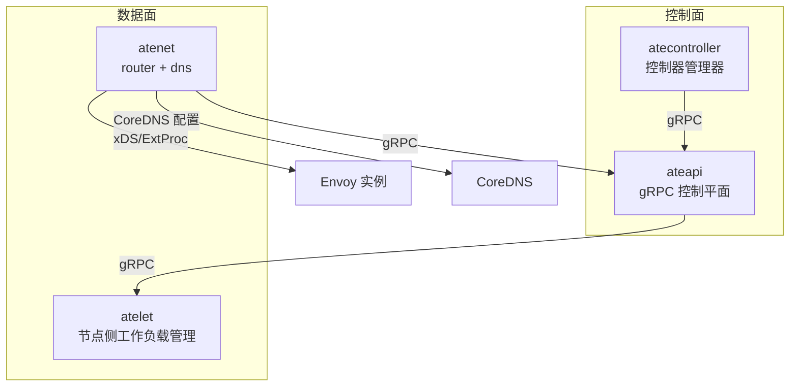
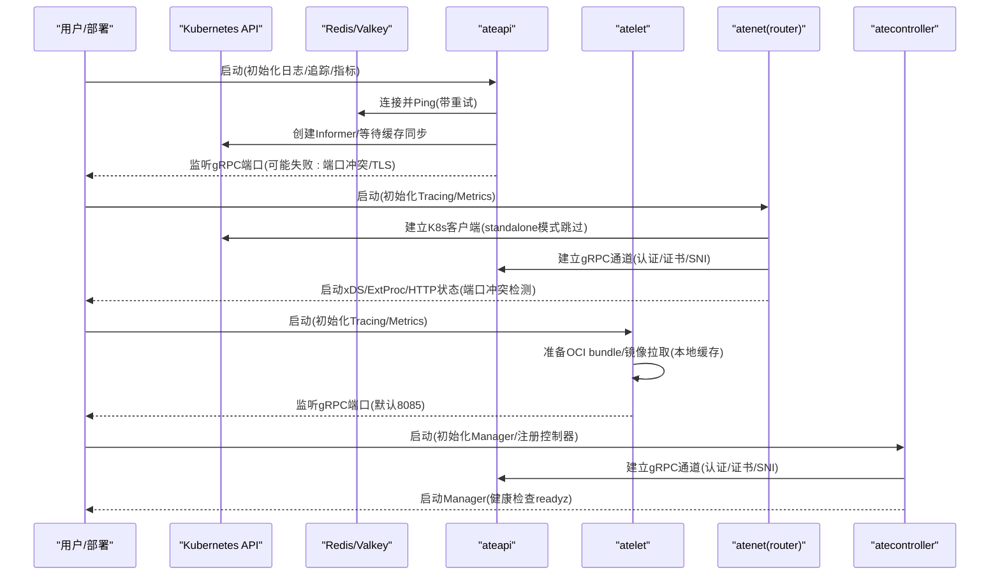
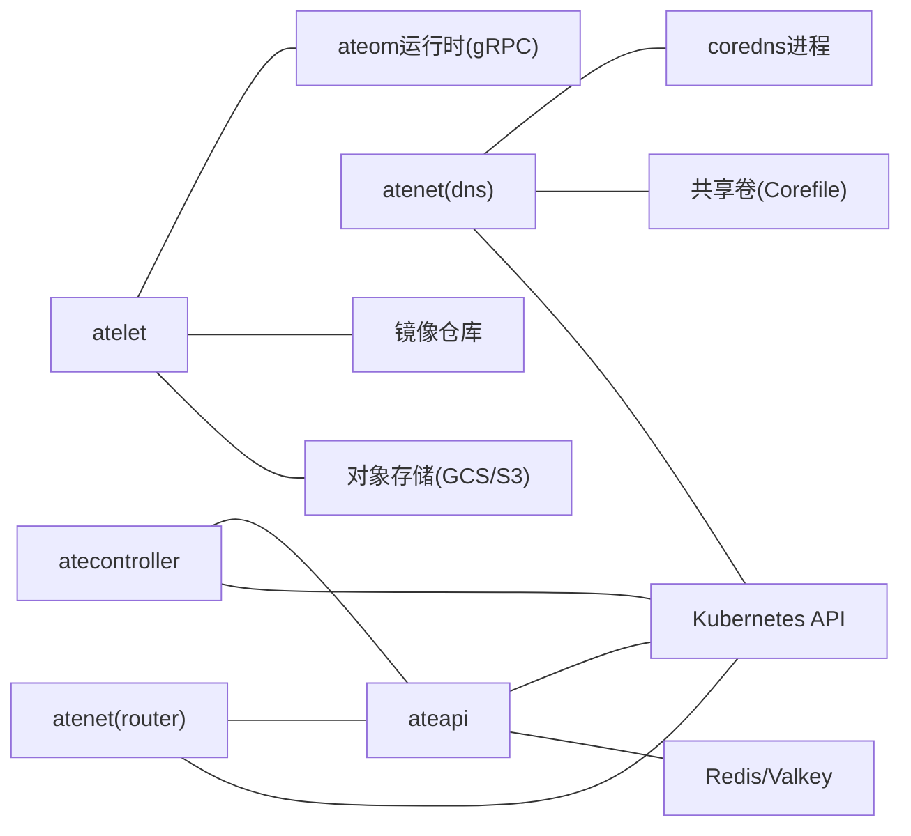

# 服务启动问题

<cite>
**本文引用的文件**   
- [cmd/ateapi/main.go](file://cmd/ateapi/main.go)
- [cmd/atenet/main.go](file://cmd/atenet/main.go)
- [cmd/atenet/internal/root.go](file://cmd/atenet/internal/root.go)
- [cmd/atenet/internal/router.go](file://cmd/atenet/internal/router.go)
- [cmd/atenet/internal/router/router.go](file://cmd/atenet/internal/router/router.go)
- [cmd/atenet/internal/dns/dns.go](file://cmd/atenet/internal/dns/dns.go)
- [cmd/atelet/main.go](file://cmd/atelet/main.go)
- [cmd/atecontroller/main.go](file://cmd/atecontroller/main.go)
- [internal/serverboot/serverboot.go](file://internal/serverboot/serverboot.go)
- [internal/ateerrors/ateerrors.go](file://internal/ateerrors/ateerrors.go)
- [cmd/ateapi/internal/controlapi/crash.go](file://cmd/ateapi/internal/controlapi/crash.go)
</cite>

## 目录
1. [简介](#简介)
2. [项目结构](#项目结构)
3. [核心组件](#核心组件)
4. [架构总览](#架构总览)
5. [详细组件分析](#详细组件分析)
6. [依赖关系分析](#依赖关系分析)
7. [性能与资源限制](#性能与资源限制)
8. [故障排查指南](#故障排查指南)
9. [结论](#结论)

## 简介
本文聚焦于 ateapi、atenet（router/dns）、atelet、atecontroller 四大服务的启动失败常见原因与解决步骤。内容覆盖：
- 各服务启动参数配置要点
- 关键依赖检查（Kubernetes API、gRPC、Redis/Valkey、对象存储等）
- 端口冲突与监听失败
- 日志位置与分析方法，含启动阶段关键检查点
- 服务间通信错误诊断（gRPC 连接、Kubernetes API 访问、DNS 解析）
- 资源限制导致的启动失败处理与内存优化建议

## 项目结构
本仓库采用按“可执行二进制 + 内部包”的模块化组织方式，主要入口位于 cmd 目录下，每个子目录对应一个服务或工具。通用启动能力（日志、指标、追踪、健康检查）集中在 internal/serverboot。

图表来源
- [cmd/ateapi/main.go:182-205](file://cmd/ateapi/main.go#L182-L205)
- [cmd/atenet/internal/router/router.go:224-287](file://cmd/atenet/internal/router/router.go#L224-L287)
- [cmd/atenet/internal/dns/dns.go:71-117](file://cmd/atenet/internal/dns/dns.go#L71-L117)
- [cmd/atelet/main.go:171-182](file://cmd/atelet/main.go#L171-L182)
- [cmd/atecontroller/main.go:74-80](file://cmd/atecontroller/main.go#L74-L80)

章节来源
- [cmd/ateapi/main.go:182-205](file://cmd/ateapi/main.go#L182-L205)
- [cmd/atenet/internal/router/router.go:224-287](file://cmd/atenet/internal/router/router.go#L224-L287)
- [cmd/atenet/internal/dns/dns.go:71-117](file://cmd/atenet/internal/dns/dns.go#L71-L117)
- [cmd/atelet/main.go:171-182](file://cmd/atelet/main.go#L171-L182)
- [cmd/atecontroller/main.go:74-80](file://cmd/atecontroller/main.go#L74-L80)

## 核心组件
- ateapi：对外暴露 gRPC 控制接口，负责认证、鉴权、缓存、与 Kubernetes 和 Redis/Valkey 交互，并作为 atelet 的上层调度者。
- atenet：聚合 router 与 dns 两个子功能。router 提供 xDS/ExtProc 与 Envoy 集成；dns 维护 CoreDNS 配置与 kube-dns stubDomains。
- atelet：运行在节点侧，负责拉取镜像、准备 OCI bundle、与 ateom 运行时交互、执行 Run/Checkpoint/Restore。
- atecontroller：基于 controller-runtime 的控制器，监听 CRD 并通过 gRPC 调用 ateapi 完成编排。

章节来源
- [cmd/ateapi/main.go:111-169](file://cmd/ateapi/main.go#L111-L169)
- [cmd/atenet/internal/router/router.go:106-150](file://cmd/atenet/internal/router/router.go#L106-L150)
- [cmd/atenet/internal/dns/dns.go:42-69](file://cmd/atenet/internal/dns/dns.go#L42-L69)
- [cmd/atelet/main.go:163-182](file://cmd/atelet/main.go#L163-L182)
- [cmd/atecontroller/main.go:82-105](file://cmd/atecontroller/main.go#L82-L105)

## 架构总览
下图展示四个服务的启动顺序与关键依赖关系，以及常见的失败点。

图表来源
- [cmd/ateapi/main.go:86-169](file://cmd/ateapi/main.go#L86-L169)
- [cmd/atenet/internal/router/router.go:176-218](file://cmd/atenet/internal/router/router.go#L176-L218)
- [cmd/atenet/internal/router/router.go:252-314](file://cmd/atenet/internal/router/router.go#L252-L314)
- [cmd/atelet/main.go:81-182](file://cmd/atelet/main.go#L81-L182)
- [cmd/atecontroller/main.go:53-80](file://cmd/atecontroller/main.go#L53-L80)

## 详细组件分析

### ateapi 启动失败分析与排障
- 关键启动参数
  - gRPC 监听地址：--grpc-listen-addr（默认 :443）
  - 指标端口：--metrics-listen-addr（默认 :9090）
  - 服务端TLS凭证：--grpc-server-cred-bundle
  - Redis/Valkey 集群地址与TLS/IAM认证相关参数
  - JWT 认证相关：--auth-mode、--client-jwt-issuer、--client-jwt-audience、--session-id-jwt-pool、--session-id-ca-pool、--workerpool-ca-certs、--client-jwt-ca-cert
- 启动流程与关键检查点
  - 初始化日志/追踪/指标
  - 从环境变量注入部分 flag（支持 @env 占位符）
  - 解析 --auth-mode 并校验配置
  - 连接 Redis/Valkey（构建 TLS、可选 IAM 认证、带重试 Ping）
  - 创建 Kubernetes 客户端与 Informer，等待缓存同步
  - 构建 gRPC 服务器凭据（加载 CA、mTLS）
  - 注册 gRPC 服务并启动 /metrics 与 readyz
- 常见失败原因与定位
  - 端口占用：监听失败直接退出，查看日志中“Failed to start listener”
  - Redis/Valkey 不可达：连接失败或超时，日志包含“Failed to connect to Redis/Valkey, retrying...”
  - TLS/证书问题：证书路径不存在、无法解析、SNI 不匹配
  - JWT 认证模式配置不完整：缺少 issuer discovery client 时报错
  - Kubernetes 客户端不可用：in-cluster config 获取失败或权限不足
- 日志位置与分析方法
  - 标准输出 JSON 日志（由 serverboot 统一初始化）
  - 关注“Final flag values”、“Using custom CA cert for Redis”、“Using Google IAM authentication for Redis connection”、“Connecting to Kubernetes API server”等关键字
- 参考实现路径
  - 参数定义与日志输出：[cmd/ateapi/main.go:56-77](file://cmd/ateapi/main.go#L56-L77)、[cmd/ateapi/main.go:230-246](file://cmd/ateapi/main.go#L230-L246)
  - 环境变量注入：[cmd/ateapi/main.go:212-228](file://cmd/ateapi/main.go#L212-L228)
  - Redis 连接与重试：[cmd/ateapi/main.go:248-331](file://cmd/ateapi/main.go#L248-L331)
  - Kubernetes 客户端与 Informer：[cmd/ateapi/main.go:333-349](file://cmd/ateapi/main.go#L333-L349)、[cmd/ateapi/main.go:133-152](file://cmd/ateapi/main.go#L133-L152)
  - gRPC 服务器与拦截器：[cmd/ateapi/main.go:182-205](file://cmd/ateapi/main.go#L182-L205)
  - 认证模式与凭据构建：[cmd/ateapi/main.go:106-180](file://cmd/ateapi/main.go#L106-L180)、[cmd/ateapi/main.go:351-373](file://cmd/ateapi/main.go#L351-L373)

章节来源
- [cmd/ateapi/main.go:56-77](file://cmd/ateapi/main.go#L56-L77)
- [cmd/ateapi/main.go:212-228](file://cmd/ateapi/main.go#L212-L228)
- [cmd/ateapi/main.go:248-331](file://cmd/ateapi/main.go#L248-L331)
- [cmd/ateapi/main.go:333-349](file://cmd/ateapi/main.go#L333-L349)
- [cmd/ateapi/main.go:182-205](file://cmd/ateapi/main.go#L182-L205)
- [cmd/ateapi/main.go:106-180](file://cmd/ateapi/main.go#L106-L180)
- [cmd/ateapi/main.go:351-373](file://cmd/ateapi/main.go#L351-L373)

### atenet 启动失败分析与排障
atenet 是组合命令，包含 router 与 dns 两个子命令。

#### router 子命令
- 关键启动参数
  - 监听端口：--port-http、--port-xds、--port-extproc、--status-port、--port-https
  - 指标端口：--metrics-listen-addr
  - ateapi 连接：--ateapi-address、--ateapi-auth、--ateapi-ca-file、--ateapi-server-name、--ateapi-token-file
  - 其他：--namespace、--kubeconfig、--standalone、--envoy-image、--templates-file、--health-interval、--otlp-collector-address
- 启动流程与关键检查点
  - 初始化 Tracing/Metrics，启动 /metrics
  - 解析认证模式并构建 ateapi gRPC 客户端
  - 非 standalone 模式下建立 K8s 客户端
  - 启动 xDS、ExtProc、HTTP /statusz
- 常见失败原因与定位
  - 端口冲突：xDS/ExtProc/HTTP 监听失败，日志包含“failed to listen on port ...”
  - ateapi 连接失败：gRPC 通道建立失败，日志包含“failed to establish grpc channel to ateapi client”
  - K8s 配置不可用：kubeconfig 路径错误或权限不足
  - OTLP 配置错误：设置 collector 失败
- 日志位置与分析方法
  - 标准输出 JSON 日志，关注“Connecting to Kubernetes API server”、“Connecting to ateapi”、“Starting substrate router subsystem”等
- 参考实现路径
  - 入口与子命令注册：[cmd/atenet/main.go:19-21](file://cmd/atenet/main.go#L19-L21)、[cmd/atenet/internal/root.go:39-42](file://cmd/atenet/internal/root.go#L39-L42)
  - router 子命令参数：[cmd/atenet/internal/router.go:27-67](file://cmd/atenet/internal/router.go#L27-L67)
  - 启动流程与依赖：[cmd/atenet/internal/router/router.go:176-218](file://cmd/atenet/internal/router/router.go#L176-L218)、[cmd/atenet/internal/router/router.go:252-314](file://cmd/atenet/internal/router/router.go#L252-L314)

章节来源
- [cmd/atenet/main.go:19-21](file://cmd/atenet/main.go#L19-L21)
- [cmd/atenet/internal/root.go:39-42](file://cmd/atenet/internal/root.go#L39-L42)
- [cmd/atenet/internal/router.go:27-67](file://cmd/atenet/internal/router.go#L27-L67)
- [cmd/atenet/internal/router/router.go:176-218](file://cmd/atenet/internal/router/router.go#L176-L218)
- [cmd/atenet/internal/router/router.go:252-314](file://cmd/atenet/internal/router/router.go#L252-L314)

#### dns 子命令
- 职责
  - 周期性读取 atenet-router Service ClusterIP，生成 CoreDNS Corefile 并写入共享卷
  - 更新 kube-system/kube-dns ConfigMap 的 stubDomains，将自定义域名后缀指向 ate-system 的 DNS 服务 IP
- 常见失败原因与定位
  - atenet-router Service 未就绪或无 ClusterIP：跳过并重试
  - dns Service 未就绪：跳过并重试
  - 写入共享卷失败：权限或路径问题
  - 发送信号给 coredns 进程失败：找不到进程或权限不足
- 日志位置与分析方法
  - 关注“DNS Controller started”、“Error during DNS reconciliation”、“CoreDNS Corefile updated”、“Successfully signaled reload”等
- 参考实现路径
  - 主循环与 reconcile：[cmd/atenet/internal/dns/dns.go:50-117](file://cmd/atenet/internal/dns/dns.go#L50-L117)
  - 写 Corefile 与重载：[cmd/atenet/internal/dns/dns.go:119-141](file://cmd/atenet/internal/dns/dns.go#L119-L141)
  - 更新 kube-dns ConfigMap：[cmd/atenet/internal/dns/dns.go:143-189](file://cmd/atenet/internal/dns/dns.go#L143-L189)
  - 进程信号重载：[cmd/atenet/internal/dns/dns.go:202-221](file://cmd/atenet/internal/dns/dns.go#L202-L221)

章节来源
- [cmd/atenet/internal/dns/dns.go:50-117](file://cmd/atenet/internal/dns/dns.go#L50-L117)
- [cmd/atenet/internal/dns/dns.go:119-141](file://cmd/atenet/internal/dns/dns.go#L119-L141)
- [cmd/atenet/internal/dns/dns.go:143-189](file://cmd/atenet/internal/dns/dns.go#L143-L189)
- [cmd/atenet/internal/dns/dns.go:202-221](file://cmd/atenet/internal/dns/dns.go#L202-L221)

### atelet 启动失败分析与排障
- 关键启动参数
  - gRPC 监听端口：--port（默认 8085）
  - 指标端口：--metrics-listen-addr
  - 镜像拉取认证：--gcp-auth-for-image-pulls
  - 本地开发替换：--localhost-registry-replacement
  - 存储后端：ATE_STORAGE_BACKEND（默认 GCS，可选 s3）
- 启动流程与关键检查点
  - 初始化日志/追踪/指标，启动 /metrics
  - 根据环境变量选择对象存储后端（GCS/S3），创建匿名 GCS 客户端
  - 准备内存拉取缓存、身份目录、持久化卷目录
  - 监听 gRPC 端口并注册 AteomHerder 服务
- 常见失败原因与定位
  - 端口占用：监听失败，日志包含“Failed to listen”
  - 对象存储客户端初始化失败：GCS ADC 不可用或 S3 配置缺失
  - 文件系统权限：创建目录或写入失败
  - 镜像拉取失败：镜像仓库认证或网络问题
- 日志位置与分析方法
  - 标准输出 JSON 日志，关注“WorkersManagerService listening”、“Using S3 storage backend”、“Failed to create GCS client”等
- 参考实现路径
  - 参数与启动：[cmd/atelet/main.go:64-100](file://cmd/atelet/main.go#L64-L100)
  - 存储后端选择与客户端创建：[cmd/atelet/main.go:126-161](file://cmd/atelet/main.go#L126-L161)
  - 监听与注册服务：[cmd/atelet/main.go:171-182](file://cmd/atelet/main.go#L171-L182)

章节来源
- [cmd/atelet/main.go:64-100](file://cmd/atelet/main.go#L64-L100)
- [cmd/atelet/main.go:126-161](file://cmd/atelet/main.go#L126-L161)
- [cmd/atelet/main.go:171-182](file://cmd/atelet/main.go#L171-L182)

### atecontroller 启动失败分析与排障
- 关键启动参数
  - ateapi 连接：--ateapi-conn-spec（默认 dns:///api.ate-system.svc:443）
  - 认证模式：--ateapi-auth（mtls/jwt）
  - 证书与令牌：--ateapi-ca-file、--ateapi-server-name、--ateapi-token-file
- 启动流程与关键检查点
  - 解析认证模式并构建 gRPC 拨号选项
  - 建立到 ateapi 的 gRPC 连接
  - 初始化 controller-runtime Manager，注册 WorkerPool 与 ActorTemplate 控制器
  - 注册 healthz/readyz 检查并启动 Manager
- 常见失败原因与定位
  - gRPC 连接失败：目标地址不可达、证书/SNI/Token 配置错误
  - K8s 客户端不可用：in-cluster config 获取失败或权限不足
  - 控制器注册失败：CRD 未安装或版本不匹配
- 日志位置与分析方法
  - 使用 zap 日志，关注“building ateapi dial options”、“Error creating grpc connection to ate api”、“unable to start manager”等
- 参考实现路径
  - 参数与拨号选项：[cmd/atecontroller/main.go:36-46](file://cmd/atecontroller/main.go#L36-L46)、[cmd/atecontroller/main.go:63-72](file://cmd/atecontroller/main.go#L63-L72)
  - gRPC 连接与客户端：[cmd/atecontroller/main.go:74-80](file://cmd/atecontroller/main.go#L74-L80)
  - Manager 与控制器注册：[cmd/atecontroller/main.go:82-105](file://cmd/atecontroller/main.go#L82-L105)

章节来源
- [cmd/atecontroller/main.go:36-46](file://cmd/atecontroller/main.go#L36-L46)
- [cmd/atecontroller/main.go:63-72](file://cmd/atecontroller/main.go#L63-L72)
- [cmd/atecontroller/main.go:74-80](file://cmd/atecontroller/main.go#L74-L80)
- [cmd/atecontroller/main.go:82-105](file://cmd/atecontroller/main.go#L82-L105)

## 依赖关系分析
- ateapi 依赖
  - Redis/Valkey：用于缓存 worker 信息、会话等
  - Kubernetes API：通过 Informer 监听 Pod/CRD
  - TLS/JWT：服务端 mTLS 与可选 JWT 认证
- atenet(router) 依赖
  - Kubernetes API：在非 standalone 模式下创建/管理资源
  - ateapi gRPC：动态路由与策略下发
  - xDS/ExtProc：与 Envoy 协作
- atenet(dns) 依赖
  - Kubernetes API：读取 Service/ConfigMap
  - 共享卷：写入 CoreDNS Corefile
  - coredns 进程：发送信号触发重载
- atelet 依赖
  - 对象存储（GCS/S3）：快照上传/下载
  - 镜像仓库：拉取 pause 与应用容器镜像
  - ateom 运行时：通过 gRPC 驱动 runsc/microvm
- atecontroller 依赖
  - Kubernetes API：控制器运行时
  - ateapi gRPC：下发控制指令

图表来源
- [cmd/ateapi/main.go:248-331](file://cmd/ateapi/main.go#L248-L331)
- [cmd/atenet/internal/router/router.go:176-218](file://cmd/atenet/internal/router/router.go#L176-L218)
- [cmd/atenet/internal/dns/dns.go:119-141](file://cmd/atenet/internal/dns/dns.go#L119-L141)
- [cmd/atelet/main.go:126-161](file://cmd/atelet/main.go#L126-L161)
- [cmd/atecontroller/main.go:74-80](file://cmd/atecontroller/main.go#L74-L80)

章节来源
- [cmd/ateapi/main.go:248-331](file://cmd/ateapi/main.go#L248-L331)
- [cmd/atenet/internal/router/router.go:176-218](file://cmd/atenet/internal/router/router.go#L176-L218)
- [cmd/atenet/internal/dns/dns.go:119-141](file://cmd/atenet/internal/dns/dns.go#L119-L141)
- [cmd/atelet/main.go:126-161](file://cmd/atelet/main.go#L126-L161)
- [cmd/atecontroller/main.go:74-80](file://cmd/atecontroller/main.go#L74-L80)

## 性能与资源限制
- 资源限制导致启动失败的常见场景
  - CPU/内存不足导致进程被 OOMKill 或启动超时
  - 磁盘空间不足导致快照/镜像解压失败
  - 文件描述符耗尽导致监听失败
- 优化建议
  - 为 ateapi/atenet/atelet/atecontroller 合理设置 requests/limits，确保足够内存以承载 Informer 缓存、gRPC 连接池与对象存储缓冲
  - 对 atelet 的镜像拉取与快照操作增加磁盘配额与监控告警
  - 启用 Prometheus 指标与 OTLP 追踪，观察启动阶段的耗时与错误率
  - 针对 Redis/Valkey 与对象存储的网络延迟进行调优（连接池、超时、重试）
- 通用启动基础设施
  - 所有服务均通过 serverboot 初始化日志、追踪与指标，便于统一观测

章节来源
- [internal/serverboot/serverboot.go:115-147](file://internal/serverboot/serverboot.go#L115-L147)

## 故障排查指南

### 通用日志与健康检查
- 日志格式：JSON（stdout），可通过 kubectl logs 收集
- 健康检查：
  - /readyz：serverboot 提供的 HTTP 端点
  - /metrics：Prometheus 指标
- 关键日志关键字
  - “Failed to initialize tracing/metrics”
  - “Failed to set up Redis/Valkey”
  - “Failed to create Kubernetes clients”
  - “Failed to start listener”
  - “failed to establish grpc channel to ateapi client”
  - “DNS Controller stopped/Error during DNS reconciliation”

章节来源
- [internal/serverboot/serverboot.go:149-154](file://internal/serverboot/serverboot.go#L149-L154)
- [cmd/ateapi/main.go:86-105](file://cmd/ateapi/main.go#L86-L105)
- [cmd/atenet/internal/router/router.go:176-218](file://cmd/atenet/internal/router/router.go#L176-L218)
- [cmd/atenet/internal/dns/dns.go:50-69](file://cmd/atenet/internal/dns/dns.go#L50-L69)

### gRPC 连接问题（ateapi 与 atelet/atenet/atecontroller）
- 症状
  - 连接拒绝、握手失败、证书验证失败、SNI 不匹配
- 排查步骤
  - 确认目标地址与端口可达（kubectl get svc/pod、nc/telnet）
  - 核对认证模式与证书/CA/SNI/Token 配置一致
  - 检查服务端是否已监听且未崩溃
- 参考实现路径
  - ateapi 服务端凭据与监听：[cmd/ateapi/main.go:182-205](file://cmd/ateapi/main.go#L182-L205)、[cmd/ateapi/main.go:351-373](file://cmd/ateapi/main.go#L351-L373)
  - atenet router 客户端拨号：[cmd/atenet/internal/router/router.go:196-218](file://cmd/atenet/internal/router/router.go#L196-L218)
  - atecontroller 客户端拨号：[cmd/atecontroller/main.go:63-80](file://cmd/atecontroller/main.go#L63-L80)

章节来源
- [cmd/ateapi/main.go:182-205](file://cmd/ateapi/main.go#L182-L205)
- [cmd/atenet/internal/router/router.go:196-218](file://cmd/atenet/internal/router/router.go#L196-L218)
- [cmd/atecontroller/main.go:63-80](file://cmd/atecontroller/main.go#L63-L80)

### Kubernetes API 访问问题
- 症状
  - in-cluster config 获取失败、权限不足、CRD 未安装
- 排查步骤
  - 检查 ServiceAccount 与 RBAC 权限
  - 确认 kubeconfig 路径正确（非 in-cluster 模式）
  - 验证 CRD 版本与控制器注册的兼容性
- 参考实现路径
  - ateapi 客户端与 Informer：[cmd/ateapi/main.go:333-349](file://cmd/ateapi/main.go#L333-L349)、[cmd/ateapi/main.go:133-152](file://cmd/ateapi/main.go#L133-L152)
  - atenet router 客户端：[cmd/atenet/internal/router/router.go:106-150](file://cmd/atenet/internal/router/router.go#L106-L150)
  - atenet dns 读取 Service/ConfigMap：[cmd/atenet/internal/dns/dns.go:71-117](file://cmd/atenet/internal/dns/dns.go#L71-L117)
  - atecontroller Manager 与控制器注册：[cmd/atecontroller/main.go:82-105](file://cmd/atecontroller/main.go#L82-L105)

章节来源
- [cmd/ateapi/main.go:333-349](file://cmd/ateapi/main.go#L333-L349)
- [cmd/atenet/internal/router/router.go:106-150](file://cmd/atenet/internal/router/router.go#L106-L150)
- [cmd/atenet/internal/dns/dns.go:71-117](file://cmd/atenet/internal/dns/dns.go#L71-L117)
- [cmd/atecontroller/main.go:82-105](file://cmd/atecontroller/main.go#L82-L105)

### DNS 解析与 CoreDNS 配置问题
- 症状
  - 自定义域名无法解析、CoreDNS 未重载
- 排查步骤
  - 确认 atenet-router Service 存在且有 ClusterIP
  - 确认 dns Service 存在且有 ClusterIP
  - 检查共享卷 Corefile 是否更新成功
  - 检查 coredns 进程是否存在并可接收信号
- 参考实现路径
  - reconcile 逻辑与信号重载：[cmd/atenet/internal/dns/dns.go:71-117](file://cmd/atenet/internal/dns/dns.go#L71-L117)、[cmd/atenet/internal/dns/dns.go:202-221](file://cmd/atenet/internal/dns/dns.go#L202-L221)

章节来源
- [cmd/atenet/internal/dns/dns.go:71-117](file://cmd/atenet/internal/dns/dns.go#L71-L117)
- [cmd/atenet/internal/dns/dns.go:202-221](file://cmd/atenet/internal/dns/dns.go#L202-L221)

### 对象存储与镜像拉取问题（atelet）
- 症状
  - GCS/S3 客户端初始化失败、快照上传/下载失败、镜像拉取失败
- 排查步骤
  - 检查环境变量与凭据（ADC/AWS 配置）
  - 检查网络连通性与代理设置
  - 检查磁盘空间与权限
- 参考实现路径
  - 存储后端选择与客户端创建：[cmd/atelet/main.go:126-161](file://cmd/atelet/main.go#L126-L161)

章节来源
- [cmd/atelet/main.go:126-161](file://cmd/atelet/main.go#L126-L161)

### 错误分类与终端错误判定
- 机制
  - 使用 ateerrors 的错误域与 Reason 标记，结合 gRPC status ErrorInfo 进行分类
  - controlapi 层根据错误元数据决定是否终止 Actor
- 参考实现路径
  - 错误域与 Reason 定义：[internal/ateerrors/ateerrors.go:29-39](file://internal/ateerrors/ateerrors.go#L29-L39)
  - 可能触发 Actor 终止的判断：[cmd/ateapi/internal/controlapi/crash.go:30-35](file://cmd/ateapi/internal/controlapi/crash.go#L30-L35)

章节来源
- [internal/ateerrors/ateerrors.go:29-39](file://internal/ateerrors/ateerrors.go#L29-L39)
- [cmd/ateapi/internal/controlapi/crash.go:30-35](file://cmd/ateapi/internal/controlapi/crash.go#L30-L35)

## 结论
- 启动失败通常源于三类问题：端口冲突、外部依赖不可用（K8s/Redis/对象存储）、认证与证书配置错误
- 通过统一的日志与指标体系，结合关键启动检查点的日志关键字，可以快速定位问题
- 对于复杂链路（atenet -> ateapi、atecontroller -> ateapi、atelet -> ateom），应优先验证网络连接与认证配置，再深入业务逻辑
- 资源限制需提前规划，避免 OOM 或磁盘不足导致启动失败
