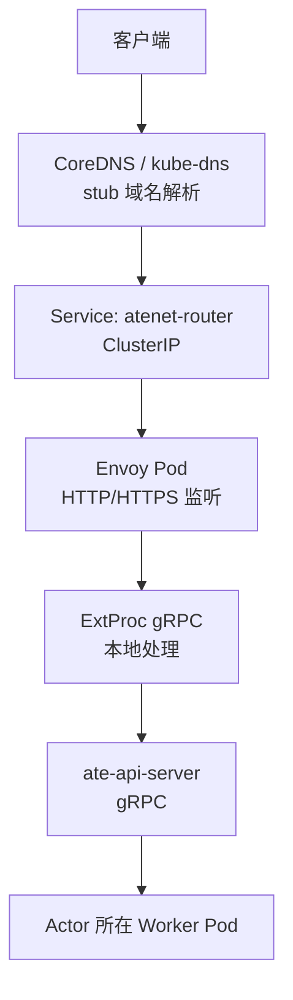
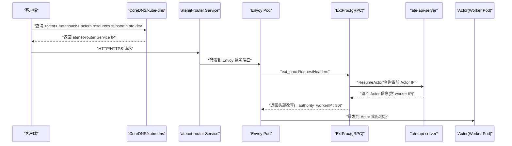
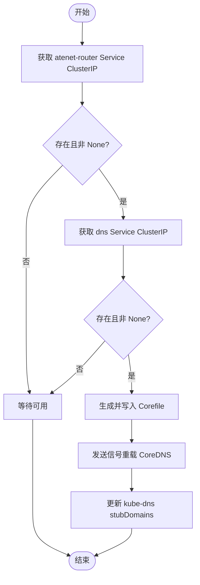
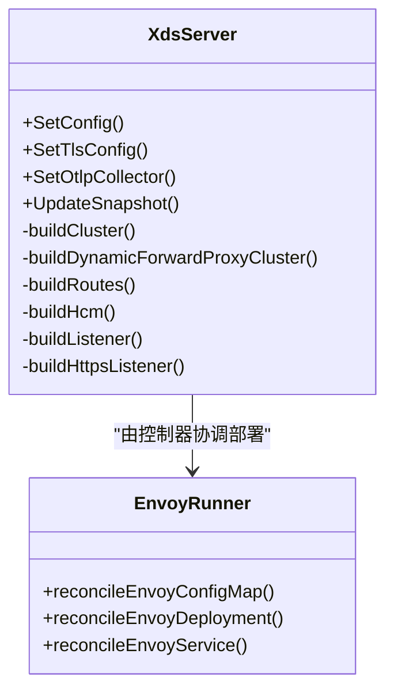
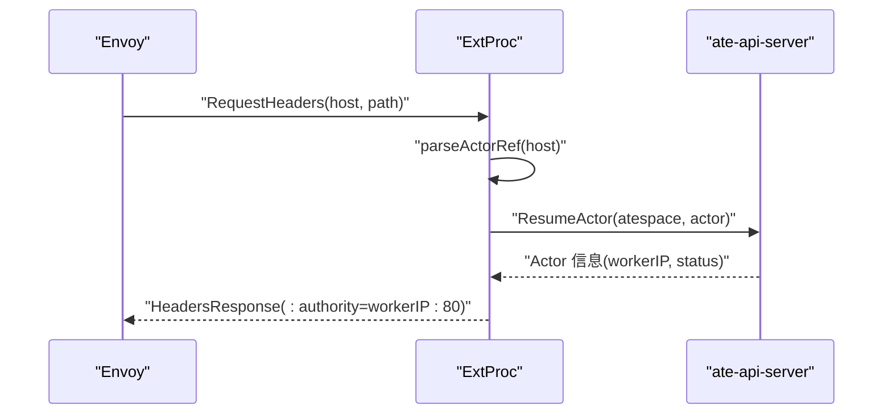
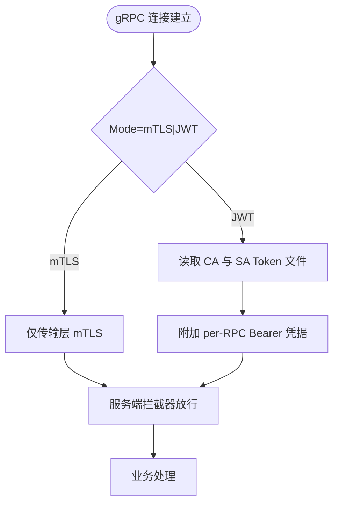
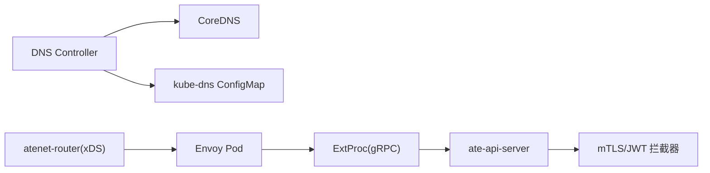

# 网络连接问题

<cite>
**本文引用的文件**   
- [xds.go](file://cmd/atenet/internal/router/xds.go)
- [envoyrunner.go](file://cmd/atenet/internal/router/envoyrunner.go)
- [extproc.go](file://cmd/atenet/internal/router/extproc.go)
- [extproc_in.go](file://cmd/atenet/internal/router/extproc_in.go)
- [extproc_out.go](file://cmd/atenet/internal/router/extproc_out.go)
- [dns.go](file://cmd/atenet/internal/dns/dns.go)
- [corefile.go](file://cmd/atenet/internal/dns/corefile.go)
- [server.go](file://internal/ateapiauth/server.go)
- [client.go](file://internal/ateapiauth/client.go)
- [observability.md](file://docs/observability.md)
- [threat-model.md](file://docs/threat-model.md)
</cite>

## 目录
1. [简介](#简介)
2. [项目结构](#项目结构)
3. [核心组件](#核心组件)
4. [架构总览](#架构总览)
5. [详细组件分析](#详细组件分析)
6. [依赖关系分析](#依赖关系分析)
7. [性能考虑](#性能考虑)
8. [故障排查指南](#故障排查指南)
9. [结论](#结论)
10. [附录](#附录)

## 简介
本文件面向在 Agent Substrate 环境中遇到复杂网络问题的工程师，聚焦以下场景的诊断与修复：DNS 解析失败、Envoy 代理配置错误、gRPC 连接超时；网络策略、防火墙规则、负载均衡器配置的核查与修正；跨命名空间通信、mTLS 认证、JWT 验证等安全网络配置问题；以及延迟、丢包、带宽限制等性能问题的监控与调优方法。文档同时提供抓包分析与流量调试工具的使用建议，帮助快速定位端到端链路中的瓶颈与异常。

## 项目结构
本项目在网络层的关键实现集中在 atenet 组件（路由与 DNS）与 ateapi 鉴权模块中：
- atenet-router：基于 Envoy 的入站网关，通过 xDS 动态下发配置，结合 ext_proc 过滤器进行请求头改写与 Actor 激活。
- DNS Controller：维护 CoreDNS 与 kube-dns 的 stub 域名，将 Actor 域名解析到 atenet-router 服务地址。
- ateapi 鉴权：支持 mTLS 与 JWT 两种模式，为 gRPC 服务端提供拦截器与客户端拨号选项。

图表来源
- [xds.go:503-576](file://cmd/atenet/internal/router/xds.go#L503-L576)
- [envoyrunner.go:66-137](file://cmd/atenet/internal/router/envoyrunner.go#L66-L137)
- [dns.go:71-117](file://cmd/atenet/internal/dns/dns.go#L71-L117)
- [extproc.go:80-128](file://cmd/atenet/internal/router/extproc.go#L80-L128)

章节来源
- [xds.go:1-120](file://cmd/atenet/internal/router/xds.go#L1-L120)
- [envoyrunner.go:1-65](file://cmd/atenet/internal/router/envoyrunner.go#L1-L65)
- [dns.go:1-70](file://cmd/atenet/internal/dns/dns.go#L1-L70)

## 核心组件
- xDS 服务器与 Envoy 配置：负责生成 Cluster、Route、Listener、HCM 过滤器链，并启用动态转发代理与外部处理器（ext_proc）。
- Envoy Runner：在 Kubernetes 中管理 Envoy 的 ConfigMap、Deployment、Service，确保运行时配置一致。
- DNS Controller：生成并更新 CoreDNS Corefile，注入 Actor 域名模板，并将自定义 DNS IP 写入 kube-dns 的 stubDomains。
- ExtProc 处理器：接收 Envoy 的请求头事件，解析 Actor 引用，调用控制面恢复 Actor，返回目标地址以改写 :authority 头。
- ateapi 鉴权：提供 mTLS/JWT 两种认证模式，服务端拦截器校验 Bearer Token，客户端按模式构造 TLS 与 per-RPC 凭据。

章节来源
- [xds.go:148-194](file://cmd/atenet/internal/router/xds.go#L148-L194)
- [envoyrunner.go:139-222](file://cmd/atenet/internal/router/envoyrunner.go#L139-L222)
- [dns.go:119-189](file://cmd/atenet/internal/dns/dns.go#L119-L189)
- [extproc.go:130-188](file://cmd/atenet/internal/router/extproc.go#L130-L188)
- [server.go:81-129](file://internal/ateapiauth/server.go#L81-L129)
- [client.go:57-95](file://internal/ateapiauth/client.go#L57-L95)

## 架构总览
下图展示了从客户端到 Actor 的完整数据平面路径，包括 DNS 解析、Envoy 入站、ext_proc 决策、gRPC 至控制面、最终转发到 Actor 工作节点。

图表来源
- [dns.go:71-117](file://cmd/atenet/internal/dns/dns.go#L71-L117)
- [xds.go:386-466](file://cmd/atenet/internal/router/xds.go#L386-L466)
- [extproc.go:80-128](file://cmd/atenet/internal/router/extproc.go#L80-L128)

## 详细组件分析

### DNS 解析与 Stub 域名
- DNS Controller 周期性拉取 atenet-router 与 dns 服务的 ClusterIP，若缺失则跳过等待。
- 生成 CoreDNS Corefile 模板，匹配 Actor 域名模式，回答指向 router IP。
- 更新 kube-system:kube-dns ConfigMap 的 stubDomains，使集群内传统 Pod 可解析 Actor 域名。

图表来源
- [dns.go:71-117](file://cmd/atenet/internal/dns/dns.go#L71-L117)
- [corefile.go:32-64](file://cmd/atenet/internal/dns/corefile.go#L32-L64)

章节来源
- [dns.go:71-189](file://cmd/atenet/internal/dns/dns.go#L71-L189)
- [corefile.go:32-64](file://cmd/atenet/internal/dns/corefile.go#L32-L64)

### Envoy 代理与 xDS 配置
- xDS 服务器构建静态与动态转发代理 Cluster，设置 HTTP/2 协议选项与连接超时。
- 配置 HCM 过滤器链：ext_proc、dynamic_forward_proxy、router，并启用访问日志与可选 OTLP 追踪。
- 支持 HTTPS 监听，加载证书（文件或内联），并通过 RDS 动态下发路由。

图表来源
- [xds.go:148-194](file://cmd/atenet/internal/router/xds.go#L148-L194)
- [xds.go:386-466](file://cmd/atenet/internal/router/xds.go#L386-L466)
- [envoyrunner.go:66-137](file://cmd/atenet/internal/router/envoyrunner.go#L66-L137)

章节来源
- [xds.go:227-355](file://cmd/atenet/internal/router/xds.go#L227-L355)
- [xds.go:503-576](file://cmd/atenet/internal/router/xds.go#L503-L576)
- [envoyrunner.go:139-222](file://cmd/atenet/internal/router/envoyrunner.go#L139-L222)

### ExtProc 处理流程
- 接收 Envoy 的 RequestHeaders 事件，提取 Host/:authority，解析出 atespace 与 actor 名称。
- 调用控制面恢复 Actor，获取 worker IP，构造 targetAddr，返回头部改写指令。
- 记录路由耗时指标，分类结果（ok/not_found/error/cancelled）。

图表来源
- [extproc.go:80-128](file://cmd/atenet/internal/router/extproc.go#L80-L128)
- [extproc_in.go:59-72](file://cmd/atenet/internal/router/extproc_in.go#L59-L72)
- [extproc_out.go:35-44](file://cmd/atenet/internal/router/extproc_out.go#L35-L44)

章节来源
- [extproc.go:130-188](file://cmd/atenet/internal/router/extproc.go#L130-L188)
- [extproc_in.go:25-57](file://cmd/atenet/internal/router/extproc_in.go#L25-L57)
- [extproc_out.go:23-68](file://cmd/atenet/internal/router/extproc_out.go#L23-L68)

### gRPC 鉴权（mTLS 与 JWT）
- 服务端拦截器根据 Mode 选择 mTLS 或 JWT 校验逻辑；JWT 模式要求 Authorization: Bearer 头。
- 客户端 DialOptions 支持两种模式：mTLS（默认跳过验证用于开发）与 JWT（读取 CA 与 SA token 文件）。

图表来源
- [server.go:81-129](file://internal/ateapiauth/server.go#L81-L129)
- [client.go:57-95](file://internal/ateapiauth/client.go#L57-L95)

章节来源
- [server.go:116-152](file://internal/ateapiauth/server.go#L116-L152)
- [client.go:97-117](file://internal/ateapiauth/client.go#L97-L117)

## 依赖关系分析
- atenet-router 依赖 Kubernetes Service 与 ConfigMap 来运行 Envoy，并通过 xDS 动态下发配置。
- DNS Controller 依赖 atenet-router 与 dns 服务的可用性，以及 kube-dns ConfigMap 的可写权限。
- ExtProc 依赖 ate-api-server 的 gRPC 接口，用于 Actor 状态查询与恢复。
- ateapi 鉴权模块为 gRPC 提供统一认证拦截，客户端需按模式正确配置 TLS 与凭据。

图表来源
- [dns.go:119-189](file://cmd/atenet/internal/dns/dns.go#L119-L189)
- [xds.go:148-194](file://cmd/atenet/internal/router/xds.go#L148-L194)
- [extproc.go:80-128](file://cmd/atenet/internal/router/extproc.go#L80-L128)
- [server.go:81-129](file://internal/ateapiauth/server.go#L81-L129)

章节来源
- [dns.go:71-117](file://cmd/atenet/internal/dns/dns.go#L71-L117)
- [xds.go:386-466](file://cmd/atenet/internal/router/xds.go#L386-L466)
- [extproc.go:130-188](file://cmd/atenet/internal/router/extproc.go#L130-L188)
- [server.go:116-152](file://internal/ateapiauth/server.go#L116-L152)

## 性能考虑
- 连接与消息超时：Envoy 对上游连接与 ext_proc 消息设置了合理超时，避免长尾阻塞。
- 追踪采样：当启用 OTLP 收集器时，Envoy 对无父 traceparent 的请求随机采样，下游服务采用 ParentBased(NeverSample) 控制整体采样率。
- 指标观测：系统暴露 rpc.server.call.duration、atenet.router.route.duration 等指标，便于评估端到端延迟与错误率。

章节来源
- [xds.go:286-334](file://cmd/atenet/internal/router/xds.go#L286-L334)
- [xds.go:468-501](file://cmd/atenet/internal/router/xds.go#L468-L501)
- [observability.md:107-133](file://docs/observability.md#L107-L133)

## 故障排查指南

### DNS 解析失败
- 检查 atenet-router 与 dns 服务是否已就绪且拥有 ClusterIP。
- 确认 CoreDNS Corefile 模板是否正确生成并已重载。
- 验证 kube-dns 的 stubDomains 是否包含自定义 DNS IP。

章节来源
- [dns.go:71-117](file://cmd/atenet/internal/dns/dns.go#L71-L117)
- [corefile.go:32-64](file://cmd/atenet/internal/dns/corefile.go#L32-L64)

### Envoy 代理配置错误
- 核对 xDS 快照一致性，确认 Cluster、Route、Listener 资源已正确下发。
- 检查 ext_proc 过滤器链顺序与超时配置，确保允许所有路由与消息超时合理。
- 验证 HTTPS 监听证书加载方式（文件路径或内联内容）。

章节来源
- [xds.go:148-194](file://cmd/atenet/internal/router/xds.go#L148-L194)
- [xds.go:386-466](file://cmd/atenet/internal/router/xds.go#L386-L466)
- [xds.go:533-576](file://cmd/atenet/internal/router/xds.go#L533-L576)

### gRPC 连接超时
- 检查 ExtProc 与 ate-api-server 之间的 gRPC 连通性与超时设置。
- 确认客户端 DialOptions 模式与凭据配置（CA 文件、SA token 文件）。
- 在服务端启用适当的拦截器，确保未携带 Bearer Token 的请求被拒绝。

章节来源
- [extproc.go:80-128](file://cmd/atenet/internal/router/extproc.go#L80-L128)
- [client.go:57-95](file://internal/ateapiauth/client.go#L57-L95)
- [server.go:141-152](file://internal/ateapiauth/server.go#L141-L152)

### 网络策略、防火墙与负载均衡器
- 使用 Kubernetes NetworkPolicy 默认拒绝策略，仅允许必要通信。
- 隔离控制面与数据面，避免沙箱直接访问 ate-api-server。
- 对外部入口建议使用身份感知 WAF 与限流配额。

章节来源
- [threat-model.md:72-82](file://docs/threat-model.md#L72-L82)

### 跨命名空间通信
- 通过 Service 名称与命名空间限定访问范围，配合 NetworkPolicy 细化策略。
- 确保 DNS 解析在跨命名空间下仍指向正确的 Service IP。

章节来源
- [dns.go:71-117](file://cmd/atenet/internal/dns/dns.go#L71-L117)

### mTLS 认证与 JWT 验证
- 服务端拦截器在 JWT 模式下强制校验 Authorization: Bearer 头。
- 客户端在 JWT 模式下需读取 CA 与 SA token 文件，并在每 RPC 附加凭据。
- 生产环境建议启用严格的证书验证与最小权限原则。

章节来源
- [server.go:116-152](file://internal/ateapiauth/server.go#L116-L152)
- [client.go:97-117](file://internal/ateapiauth/client.go#L97-L117)

### 性能问题监控与调优
- 关注 atenet.router.route.duration 指标，识别路由阶段瓶颈。
- 调整 Envoy 连接超时与 ext_proc 消息超时，避免长尾影响。
- 利用 OpenTelemetry 追踪定位慢调用链。

章节来源
- [observability.md:107-133](file://docs/observability.md#L107-L133)
- [xds.go:468-501](file://cmd/atenet/internal/router/xds.go#L468-L501)

### 抓包分析与流量调试
- 在 Envoy Pod 中启用 admin 端口，查看统计与配置快照。
- 使用 kubectl logs 与 kubectl port-forward 暴露 Prometheus/Jaeger UI，进行指标与追踪分析。
- 在关键节点执行 tcpdump 或 tshark，捕获 HTTP/gRPC 报文，结合追踪 ID 定位问题。

章节来源
- [envoyrunner.go:164-184](file://cmd/atenet/internal/router/envoyrunner.go#L164-L184)
- [observability.md:115-166](file://docs/observability.md#L115-L166)

## 结论
通过对 DNS、Envoy、ext_proc、gRPC 鉴权与可观测性的系统性梳理，可以高效定位与修复 Agent Substrate 中的复杂网络问题。建议在部署中遵循最小权限与零信任原则，完善网络策略与认证机制，并结合指标与追踪持续优化性能与稳定性。

## 附录
- 术语参考：Actor、Atespace、Worker、atenet-router、ExtProc、xDS、CoreDNS、kube-dns、mTLS、JWT。
- 相关文档：威胁模型、可观测性指南、API 配置指南。
