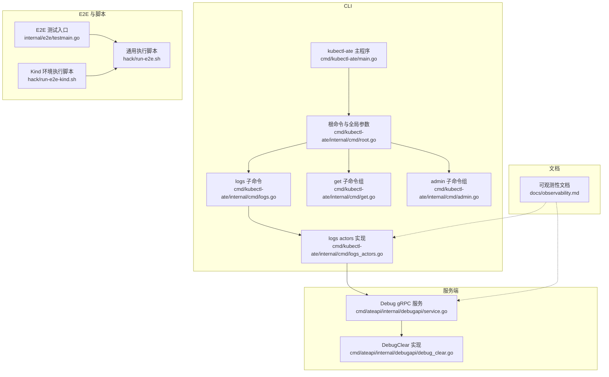
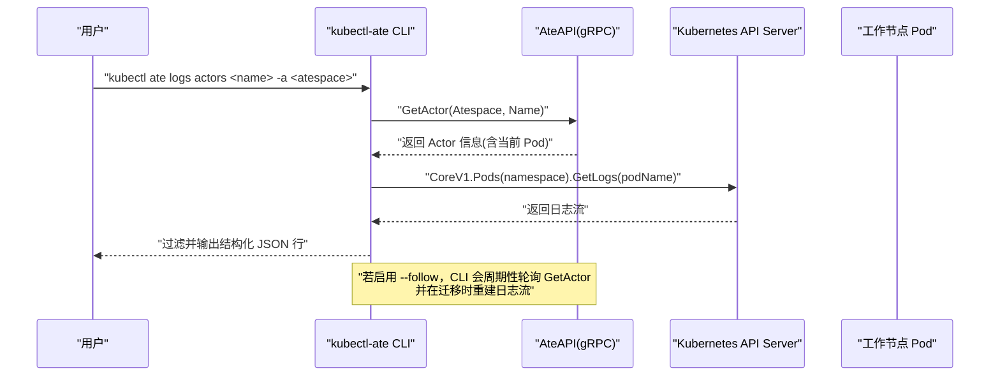
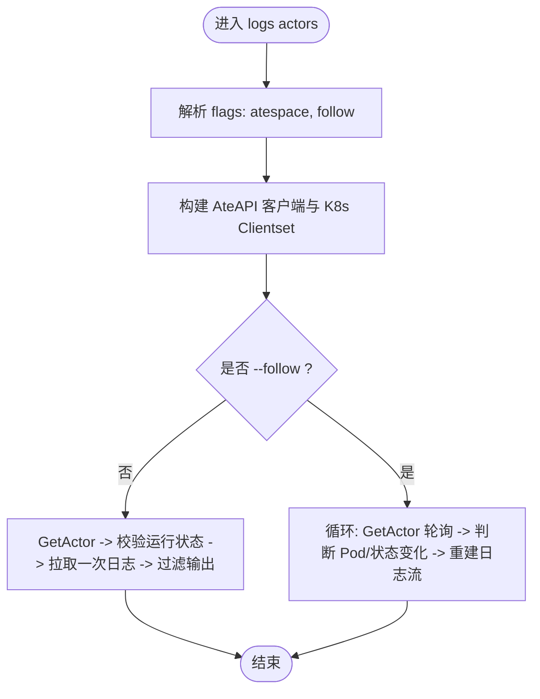
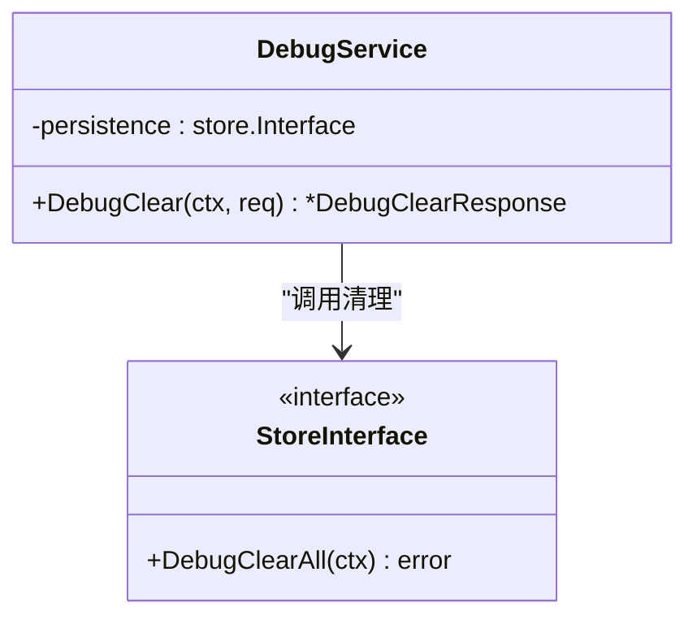
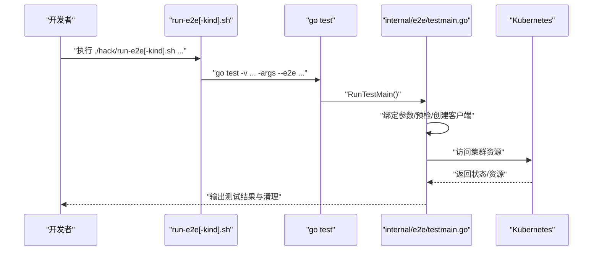
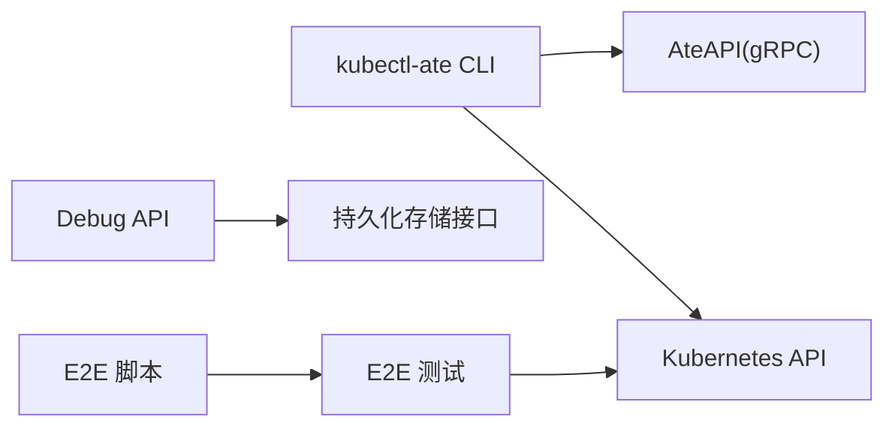

# 调试工具使用

<cite>
**本文引用的文件**
- [cmd/kubectl-ate/main.go](file://cmd/kubectl-ate/main.go)
- [cmd/kubectl-ate/internal/cmd/root.go](file://cmd/kubectl-ate/internal/cmd/root.go)
- [cmd/kubectl-ate/internal/cmd/logs.go](file://cmd/kubectl-ate/internal/cmd/logs.go)
- [cmd/kubectl-ate/internal/cmd/logs_actors.go](file://cmd/kubectl-ate/internal/cmd/logs_actors.go)
- [cmd/kubectl-ate/internal/cmd/get.go](file://cmd/kubectl-ate/internal/cmd/get.go)
- [cmd/kubectl-ate/internal/cmd/admin.go](file://cmd/kubectl-ate/internal/cmd/admin.go)
- [cmd/ateapi/internal/debugapi/service.go](file://cmd/ateapi/internal/debugapi/service.go)
- [cmd/ateapi/internal/debugapi/debug_clear.go](file://cmd/ateapi/internal/debugapi/debug_clear.go)
- [internal/e2e/testmain.go](file://internal/e2e/testmain.go)
- [hack/run-e2e.sh](file://hack/run-e2e.sh)
- [hack/run-e2e-kind.sh](file://hack/run-e2e-kind.sh)
- [docs/observability.md](file://docs/observability.md)
</cite>

## 目录
1. [简介](#简介)
2. [项目结构](#项目结构)
3. [核心组件](#核心组件)
4. [架构总览](#架构总览)
5. [详细组件分析](#详细组件分析)
6. [依赖关系分析](#依赖关系分析)
7. [性能与可观测性](#性能与可观测性)
8. [故障排查指南](#故障排查指南)
9. [结论](#结论)
10. [附录](#附录)

## 简介
本文件面向开发者与运维人员，系统化介绍 Agent Substrate 的调试与诊断能力，重点覆盖：
- kubectl-ate CLI 的日志查看、状态检查、资源管理等常用命令
- Debug API 的使用方法与调用示例
- E2E 测试框架的执行方式与结果分析
- Prometheus 指标查询与 OpenTelemetry 追踪分析
- 常用调试脚本与自动化诊断工具

## 项目结构
与调试相关的代码主要分布在以下位置：
- CLI 入口与子命令：cmd/kubectl-ate
- Debug API（gRPC）：cmd/ateapi/internal/debugapi
- E2E 测试框架与脚本：internal/e2e、hack
- 可观测性文档：docs/observability.md

图表来源
- [cmd/kubectl-ate/main.go:1-24](file://cmd/kubectl-ate/main.go#L1-L24)
- [cmd/kubectl-ate/internal/cmd/root.go:1-62](file://cmd/kubectl-ate/internal/cmd/root.go#L1-L62)
- [cmd/kubectl-ate/internal/cmd/logs.go:1-29](file://cmd/kubectl-ate/internal/cmd/logs.go#L1-L29)
- [cmd/kubectl-ate/internal/cmd/logs_actors.go:1-392](file://cmd/kubectl-ate/internal/cmd/logs_actors.go#L1-L392)
- [cmd/kubectl-ate/internal/cmd/get.go:1-29](file://cmd/kubectl-ate/internal/cmd/get.go#L1-L29)
- [cmd/kubectl-ate/internal/cmd/admin.go:1-29](file://cmd/kubectl-ate/internal/cmd/admin.go#L1-L29)
- [cmd/ateapi/internal/debugapi/service.go:1-36](file://cmd/ateapi/internal/debugapi/service.go#L1-L36)
- [cmd/ateapi/internal/debugapi/debug_clear.go:1-37](file://cmd/ateapi/internal/debugapi/debug_clear.go#L1-L37)
- [internal/e2e/testmain.go:1-83](file://internal/e2e/testmain.go#L1-L83)
- [hack/run-e2e.sh:1-108](file://hack/run-e2e.sh#L1-L108)
- [hack/run-e2e-kind.sh:1-42](file://hack/run-e2e-kind.sh#L1-L42)
- [docs/observability.md:1-194](file://docs/observability.md#L1-L194)

章节来源
- [cmd/kubectl-ate/main.go:1-24](file://cmd/kubectl-ate/main.go#L1-L24)
- [cmd/kubectl-ate/internal/cmd/root.go:1-62](file://cmd/kubectl-ate/internal/cmd/root.go#L1-L62)
- [cmd/kubectl-ate/internal/cmd/logs.go:1-29](file://cmd/kubectl-ate/internal/cmd/logs.go#L1-L29)
- [cmd/kubectl-ate/internal/cmd/logs_actors.go:1-392](file://cmd/kubectl-ate/internal/cmd/logs_actors.go#L1-L392)
- [cmd/kubectl-ate/internal/cmd/get.go:1-29](file://cmd/kubectl-ate/internal/cmd/get.go#L1-L29)
- [cmd/kubectl-ate/internal/cmd/admin.go:1-29](file://cmd/kubectl-ate/internal/cmd/admin.go#L1-L29)
- [cmd/ateapi/internal/debugapi/service.go:1-36](file://cmd/ateapi/internal/debugapi/service.go#L1-L36)
- [cmd/ateapi/internal/debugapi/debug_clear.go:1-37](file://cmd/ateapi/internal/debugapi/debug_clear.go#L1-L37)
- [internal/e2e/testmain.go:1-83](file://internal/e2e/testmain.go#L1-L83)
- [hack/run-e2e.sh:1-108](file://hack/run-e2e.sh#L1-L108)
- [hack/run-e2e-kind.sh:1-42](file://hack/run-e2e-kind.sh#L1-L42)
- [docs/observability.md:1-194](file://docs/observability.md#L1-L194)

## 核心组件
- kubectl-ate CLI
  - 提供 logs、get、admin 等子命令，支持 table/json/yaml 输出格式与可选的 --trace 请求追踪。
  - logs actors 支持一次性打印与流式跟踪，自动感知 Actor 迁移并重建日志流。
- Debug API（gRPC）
  - 暴露 DebugServer，当前包含 DebugClear 用于清理持久化数据，便于复现问题。
- E2E 测试框架
  - 通过 testmain 统一绑定参数、预检环境与命名空间清理；提供 hack 脚本简化运行。
- 可观测性
  - 文档定义了日志、指标、追踪的统一模型与本地/云端后端差异，以及 Dashboard 管理。

章节来源
- [cmd/kubectl-ate/internal/cmd/root.go:1-62](file://cmd/kubectl-ate/internal/cmd/root.go#L1-L62)
- [cmd/kubectl-ate/internal/cmd/logs_actors.go:1-392](file://cmd/kubectl-ate/internal/cmd/logs_actors.go#L1-L392)
- [cmd/ateapi/internal/debugapi/service.go:1-36](file://cmd/ateapi/internal/debugapi/service.go#L1-L36)
- [cmd/ateapi/internal/debugapi/debug_clear.go:1-37](file://cmd/ateapi/internal/debugapi/debug_clear.go#L1-L37)
- [internal/e2e/testmain.go:1-83](file://internal/e2e/testmain.go#L1-L83)
- [docs/observability.md:1-194](file://docs/observability.md#L1-L194)

## 架构总览
下图展示了从 CLI 到服务端的关键交互路径，包括日志流、状态查询与 Debug 操作。

图表来源
- [cmd/kubectl-ate/internal/cmd/logs_actors.go:1-392](file://cmd/kubectl-ate/internal/cmd/logs_actors.go#L1-L392)

章节来源
- [cmd/kubectl-ate/internal/cmd/logs_actors.go:1-392](file://cmd/kubectl-ate/internal/cmd/logs_actors.go#L1-L392)

## 详细组件分析

### kubectl-ate CLI 调试子命令
- 根命令与全局参数
  - 支持 --kubeconfig、--context、--endpoint、--output、--trace 等全局选项。
  - 输出格式校验在 PersistentPreRunE 中完成。
- logs 子命令
  - logs actors <actor-name> -a <atespace> [-f]
  - 一次性模式：获取当前运行的 Actor 所在 Pod，拉取一次日志并过滤出目标 Actor 的结构化 JSON 行。
  - 流式模式：后台轮询 GetActor，检测迁移或挂起后重建日志流，保持连续输出。
- get 子命令组
  - 用于展示一个或多个资源（如 Actor、WorkerPool 等），结合 --output 进行格式化输出。
- admin 子命令组
  - 管理与调试相关命令的容器，后续可扩展更多运维能力。

图表来源
- [cmd/kubectl-ate/internal/cmd/logs_actors.go:1-392](file://cmd/kubectl-ate/internal/cmd/logs_actors.go#L1-L392)
- [cmd/kubectl-ate/internal/cmd/root.go:1-62](file://cmd/kubectl-ate/internal/cmd/root.go#L1-L62)

章节来源
- [cmd/kubectl-ate/internal/cmd/root.go:1-62](file://cmd/kubectl-ate/internal/cmd/root.go#L1-L62)
- [cmd/kubectl-ate/internal/cmd/logs.go:1-29](file://cmd/kubectl-ate/internal/cmd/logs.go#L1-L29)
- [cmd/kubectl-ate/internal/cmd/logs_actors.go:1-392](file://cmd/kubectl-ate/internal/cmd/logs_actors.go#L1-L392)
- [cmd/kubectl-ate/internal/cmd/get.go:1-29](file://cmd/kubectl-ate/internal/cmd/get.go#L1-L29)
- [cmd/kubectl-ate/internal/cmd/admin.go:1-29](file://cmd/kubectl-ate/internal/cmd/admin.go#L1-L29)

### Debug API 使用方法
- 服务定义
  - DebugService 实现了 ateapipb.DebugServer，持有持久化存储接口以执行清理等操作。
- DebugClear
  - 接收请求后调用底层 persistence.DebugClearAll，清空所有调试相关数据，便于问题复现。
- 调用建议
  - 通过 gRPC 客户端直接调用 DebugClear，或在控制面集成 UI/CLI 触发。
  - 建议在隔离环境或维护窗口内使用，避免影响线上数据。

图表来源
- [cmd/ateapi/internal/debugapi/service.go:1-36](file://cmd/ateapi/internal/debugapi/service.go#L1-L36)
- [cmd/ateapi/internal/debugapi/debug_clear.go:1-37](file://cmd/ateapi/internal/debugapi/debug_clear.go#L1-L37)

章节来源
- [cmd/ateapi/internal/debugapi/service.go:1-36](file://cmd/ateapi/internal/debugapi/service.go#L1-L36)
- [cmd/ateapi/internal/debugapi/debug_clear.go:1-37](file://cmd/ateapi/internal/debugapi/debug_clear.go#L1-L37)

### E2E 测试框架执行与结果分析
- 入口与参数
  - testmain 绑定 --e2e、--no-color、--kube-config、--kube-context 等参数，默认不运行，需显式开启。
  - 初始化共享客户端、执行预检、注册命名空间清理钩子。
- 执行脚本
  - hack/run-e2e.sh 负责解析 go test 与 e2e 参数，并注入 --e2e 标志。
  - hack/run-e2e-kind.sh 为 Kind 环境预设镜像仓库、桶名与上下文，再转发至 run-e2e.sh。
- 结果分析
  - 失败时会在预检阶段输出错误原因；可通过 -v 与 -run 定位具体用例。
  - 结合 --kube-context 指定集群上下文，确保测试指向正确环境。

图表来源
- [internal/e2e/testmain.go:1-83](file://internal/e2e/testmain.go#L1-L83)
- [hack/run-e2e.sh:1-108](file://hack/run-e2e.sh#L1-L108)
- [hack/run-e2e-kind.sh:1-42](file://hack/run-e2e-kind.sh#L1-L42)

章节来源
- [internal/e2e/testmain.go:1-83](file://internal/e2e/testmain.go#L1-L83)
- [hack/run-e2e.sh:1-108](file://hack/run-e2e.sh#L1-L108)
- [hack/run-e2e-kind.sh:1-42](file://hack/run-e2e-kind.sh#L1-L42)

### 可观测性工具使用要点
- 日志
  - 使用 kubectl ate logs actors 快速查看活跃 Actor 的日志；生产建议使用集中式日志系统并按 ate.dev/* 标签聚合。
- 指标
  - 本地 Kind 环境内置 Prometheus，端口转发后可通过浏览器访问；查询 rpc_* 系列指标验证各组件健康。
- 追踪
  - 本地 Kind 环境内置 Jaeger；通过 --trace 发起请求，复制 Trace ID 在 Jaeger 中检索链路详情。
- 仪表板
  - GKE 部署下通过 tools/setup-gcp 创建与更新仪表盘；Kind 环境下使用 Prometheus UI。

章节来源
- [docs/observability.md:1-194](file://docs/observability.md#L1-L194)

## 依赖关系分析
- CLI 与服务端
  - logs actors 依赖 AteAPI 的 GetActor 与 Kubernetes CoreV1 的 Pod 日志接口。
  - Debug API 依赖持久化层接口以执行清理。
- 测试与脚本
  - E2E 入口依赖 K8s 客户端与预检逻辑；脚本封装了环境变量与参数传递。

图表来源
- [cmd/kubectl-ate/internal/cmd/logs_actors.go:1-392](file://cmd/kubectl-ate/internal/cmd/logs_actors.go#L1-L392)
- [cmd/ateapi/internal/debugapi/service.go:1-36](file://cmd/ateapi/internal/debugapi/service.go#L1-L36)
- [internal/e2e/testmain.go:1-83](file://internal/e2e/testmain.go#L1-L83)
- [hack/run-e2e.sh:1-108](file://hack/run-e2e.sh#L1-L108)

章节来源
- [cmd/kubectl-ate/internal/cmd/logs_actors.go:1-392](file://cmd/kubectl-ate/internal/cmd/logs_actors.go#L1-L392)
- [cmd/ateapi/internal/debugapi/service.go:1-36](file://cmd/ateapi/internal/debugapi/service.go#L1-L36)
- [internal/e2e/testmain.go:1-83](file://internal/e2e/testmain.go#L1-L83)
- [hack/run-e2e.sh:1-108](file://hack/run-e2e.sh#L1-L108)

## 性能与可观测性
- 日志流优化
  - 流式模式下采用后台轮询与迁移监控，避免长时间阻塞；对长行设置较大缓冲区，减少断流风险。
- 指标与追踪
  - 通过 OTLP 上报指标与追踪，本地与云端后端不同但仪器一致；利用 --trace 定位端到端延迟瓶颈。
- 建议
  - 在生产环境中将日志、指标、追踪接入统一平台，按 ate.dev/* 标签进行多维聚合与分析。

[本节为通用指导，无需特定文件引用]

## 故障排查指南
- CLI 连接问题
  - 确认 --kubeconfig 与 --context 指向正确的集群；必要时使用 --endpoint 直连 gRPC 服务。
- 日志为空或不完整
  - 确认 Actor 处于运行状态且位于某 Worker Pod；流式模式遇到迁移会自动重建流，注意观察 stderr 提示。
- DebugClear 误用
  - 仅在隔离环境或维护窗口使用，避免清除关键数据导致业务中断。
- E2E 失败
  - 使用 -v 与 -run 定位用例；检查 --kube-context 与环境变量（如 KO_DOCKER_REPO、BUCKET_NAME）。

章节来源
- [cmd/kubectl-ate/internal/cmd/logs_actors.go:1-392](file://cmd/kubectl-ate/internal/cmd/logs_actors.go#L1-L392)
- [cmd/ateapi/internal/debugapi/debug_clear.go:1-37](file://cmd/ateapi/internal/debugapi/debug_clear.go#L1-L37)
- [hack/run-e2e-kind.sh:1-42](file://hack/run-e2e-kind.sh#L1-L42)

## 结论
通过 kubectl-ate CLI、Debug API、E2E 框架与可观测性体系，Agent Substrate 提供了从即时诊断到系统性分析的完整闭环。建议在日常开发中使用 CLI 与本地可观测栈快速定位问题，在生产环境结合集中式日志、指标与追踪平台进行持续监控与排障。

[本节为总结，无需特定文件引用]

## 附录
- 常用命令速查
  - 查看 Actor 日志（一次性）：kubectl ate logs actors <name> -a <atespace>
  - 流式跟踪 Actor 日志：kubectl ate logs actors <name> -a <atespace> -f
  - 启用追踪：在任意 kubectl ate 命令追加 --trace
  - 运行 E2E（Kind）：./hack/run-e2e-kind.sh
  - 运行 E2E（通用）：./hack/run-e2e.sh -run <用例正则> -args --kube-context <上下文>

章节来源
- [docs/observability.md:1-194](file://docs/observability.md#L1-L194)
- [hack/run-e2e.sh:1-108](file://hack/run-e2e.sh#L1-L108)
- [hack/run-e2e-kind.sh:1-42](file://hack/run-e2e-kind.sh#L1-L42)
