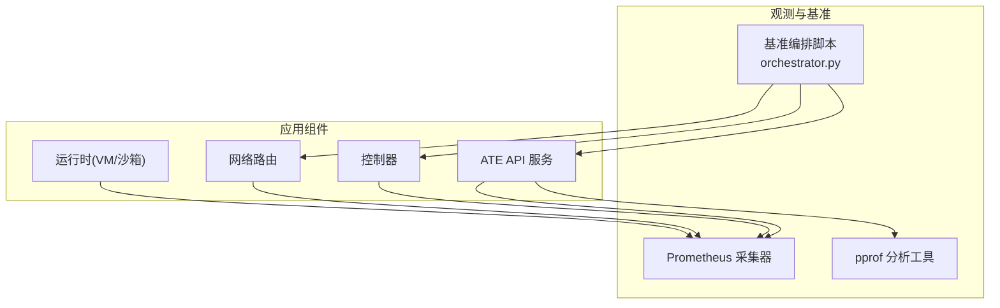
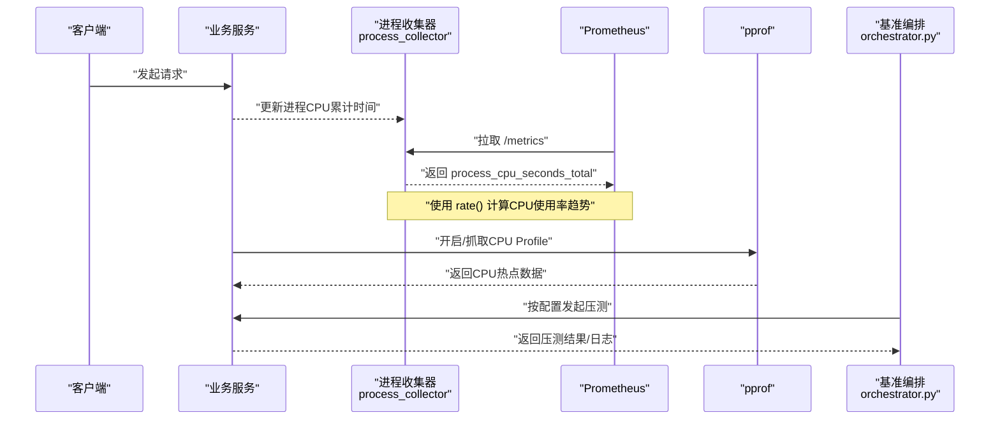
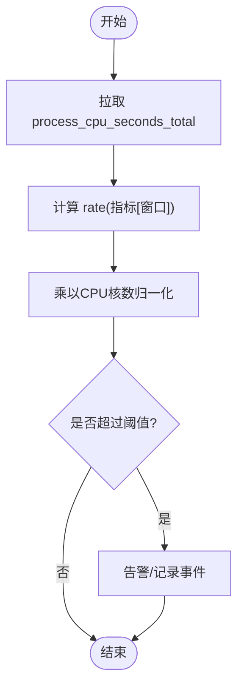
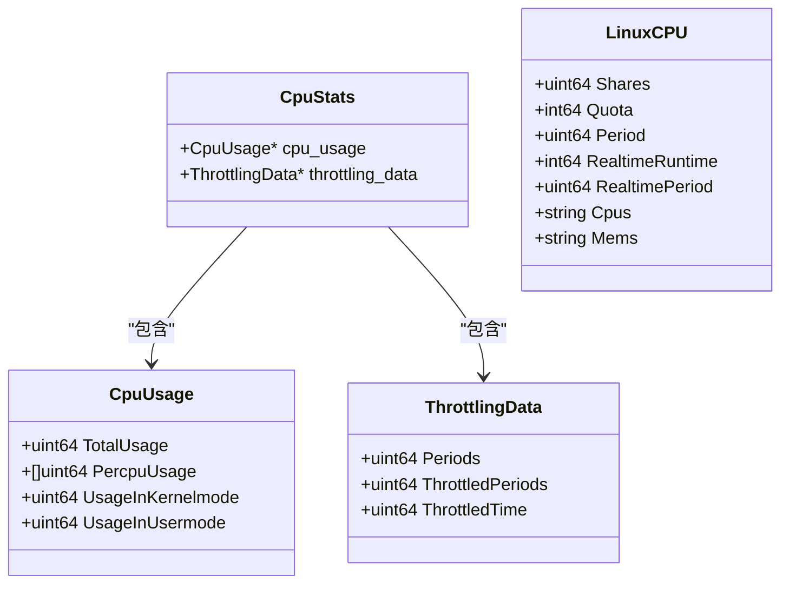
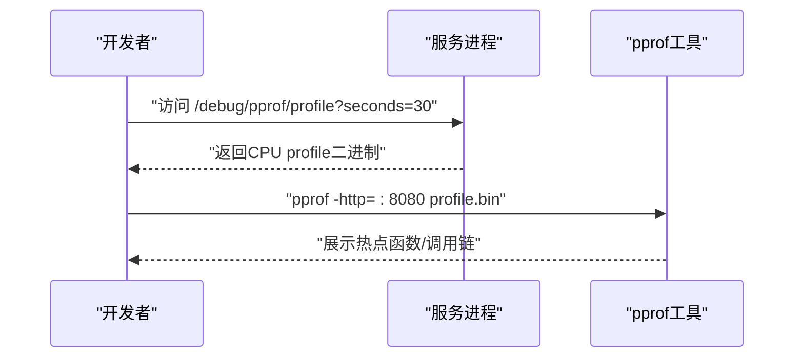
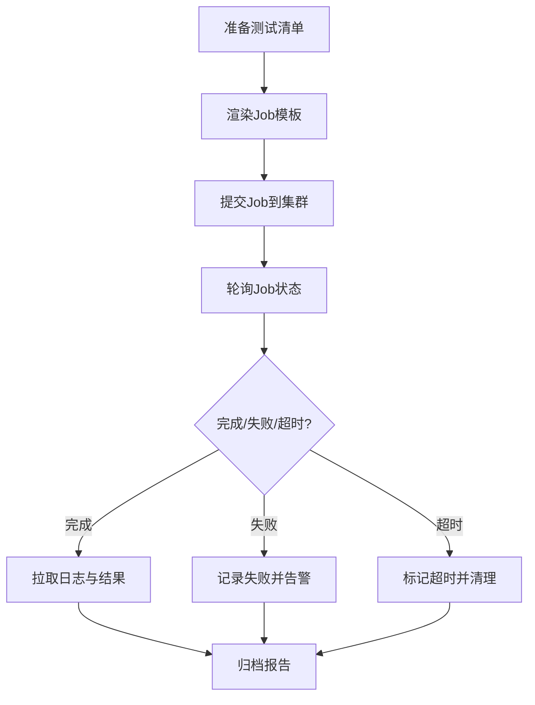
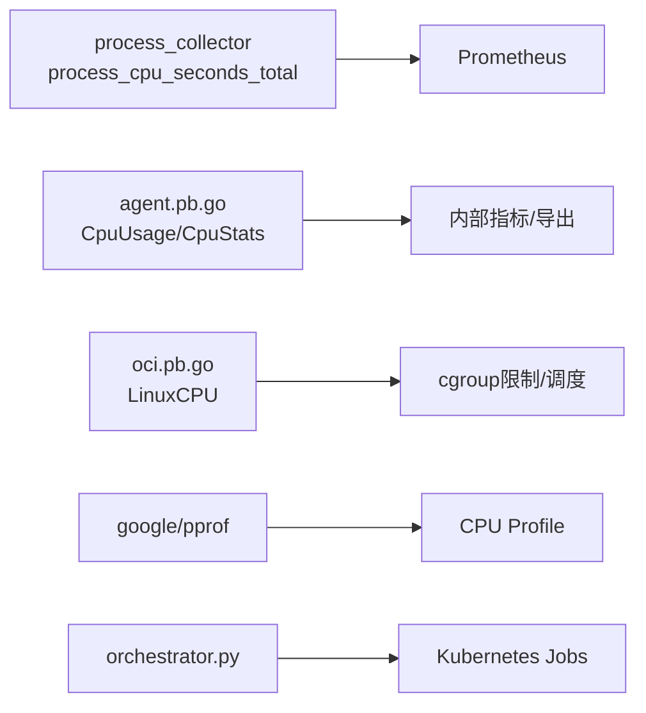

# CPU性能问题排查

<cite>
**本文引用的文件**   
- [process_collector.go](file://vendor/github.com/prometheus/client_golang/prometheus/process_collector.go)
- [agent.pb.go](file://cmd/ateom-microvm/internal/third_party/kata/agentpb/agent.pb.go)
- [oci.pb.go](file://cmd/ateom-microvm/internal/third_party/kata/agentpb/oci.pb.go)
- [go.mod](file://go.mod)
- [orchestrator.py](file://benchmarking/automation/orchestrator.py)
</cite>

## 目录
1. [简介](#简介)
2. [项目结构](#项目结构)
3. [核心组件](#核心组件)
4. [架构总览](#架构总览)
5. [详细组件分析](#详细组件分析)
6. [依赖关系分析](#依赖关系分析)
7. [性能考量](#性能考量)
8. [故障排查指南](#故障排查指南)
9. [结论](#结论)
10. [附录](#附录)

## 简介
本文件面向在容器化与微服务环境中进行CPU性能问题诊断与优化的工程师，围绕以下目标展开：
- 使用Prometheus监控进程级CPU指标（如 process_cpu_seconds_total），并通过 rate() 计算CPU使用率趋势。
- 识别CPU热点代码路径，结合pprof工具进行CPU剖析。
- 检测goroutine泄漏并定位常见高CPU原因（死循环、频繁GC、锁竞争等）。
- 提供优化策略（算法优化、并发控制、资源池化等）与基准测试分析方法。
- 结合仓库中已有的监控与基准编排能力，给出可落地的实践建议。

## 项目结构
本项目包含多组件（API、控制器、网络路由、运行时等），并在依赖中引入了Prometheus客户端与pprof库，同时具备自动化基准测试编排脚本，便于在Kubernetes上执行压测与结果收集。

[此图为概念性结构图，不直接映射具体源码文件]

## 核心组件
- Prometheus进程指标采集：通过Prometheus Go客户端内置的进程收集器暴露 process_cpu_seconds_total 指标，用于计算进程CPU使用率。
- 运行时Cgroup/CPU统计：在运行时侧定义了CPU用量、节流等数据结构，可用于上层聚合或导出为Prometheus指标。
- pprof支持：项目依赖中包含google/pprof，便于对运行中的Go程序进行CPU剖析。
- 基准编排：orchestrator.py负责在Kubernetes上调度压测任务，便于复现与回归CPU问题。

章节来源
- [process_collector.go:70-70](file://vendor/github.com/prometheus/client_golang/prometheus/process_collector.go#L70-L70)
- [agent.pb.go:707-885](file://cmd/ateom-microvm/internal/third_party/kata/agentpb/agent.pb.go#L707-L885)
- [oci.pb.go:1523-1620](file://cmd/ateom-microvm/internal/third_party/kata/agentpb/oci.pb.go#L1523-L1620)
- [go.mod:124-124](file://go.mod#L124-L124)
- [orchestrator.py:253-341](file://benchmarking/automation/orchestrator.py#L253-L341)

## 架构总览
下图展示了从业务请求到指标采集与剖析的整体链路：业务组件通过HTTP/gRPC暴露指标端点；Prometheus拉取指标；当出现CPU问题时，可通过pprof抓取CPU profile进行分析；基准编排脚本可在集群内发起负载以复现问题。

图表来源
- [process_collector.go:70-70](file://vendor/github.com/prometheus/client_golang/prometheus/process_collector.go#L70-L70)
- [orchestrator.py:253-341](file://benchmarking/automation/orchestrator.py#L253-L341)

## 详细组件分析

### 组件A：进程CPU指标采集与趋势计算
- 指标来源：Prometheus Go客户端内置的进程收集器会暴露 process_cpu_seconds_total，表示自进程启动以来累积的CPU秒数。
- 趋势计算：在PromQL中使用 rate(process_cpu_seconds_total[窗口]) 得到单位时间内的增量，再乘以CPU核数即可估算CPU使用率百分比。
- 注意事项：rate() 需要选择合适的时间窗口，避免采样过短导致噪声过大或过长导致响应延迟。

图表来源
- [process_collector.go:70-70](file://vendor/github.com/prometheus/client_golang/prometheus/process_collector.go#L70-L70)

章节来源
- [process_collector.go:70-70](file://vendor/github.com/prometheus/client_golang/prometheus/process_collector.go#L70-L70)

### 组件B：运行时CPU统计模型（Cgroup/OCI）
- CpuUsage/CpuStats/ThrottlingData：定义了总CPU用量、每核用量、内核态/用户态用量以及CPU节流信息（周期、被节流周期、节流时间）。
- LinuxCPU：定义CPU配额、周期、实时调度参数、CPU亲和性等，常用于cgroup限制与调度行为分析。
- 用途：这些结构可作为内部统计源，进一步转换为Prometheus指标或用于诊断CPU受限场景。

图表来源
- [agent.pb.go:707-885](file://cmd/ateom-microvm/internal/third_party/kata/agentpb/agent.pb.go#L707-L885)
- [oci.pb.go:1523-1620](file://cmd/ateom-microvm/internal/third_party/kata/agentpb/oci.pb.go#L1523-L1620)

章节来源
- [agent.pb.go:707-885](file://cmd/ateom-microvm/internal/third_party/kata/agentpb/agent.pb.go#L707-L885)
- [oci.pb.go:1523-1620](file://cmd/ateom-microvm/internal/third_party/kata/agentpb/oci.pb.go#L1523-L1620)

### 组件C：pprof CPU剖析集成
- 依赖：项目依赖中包含 google/pprof，可用于在运行中生成CPU profile。
- 典型流程：在服务中启用pprof HTTP端点或通过调试接口触发profile抓取；将生成的profile导入pprof工具进行火焰图/调用栈分析，定位热点函数与锁等待。

图表来源
- [go.mod:124-124](file://go.mod#L124-L124)

章节来源
- [go.mod:124-124](file://go.mod#L124-L124)

### 组件D：基准编排与复现
- orchestrator.py：在Kubernetes中提交Job执行压测用例，等待完成并拉取日志，便于复现CPU问题与对比不同版本的性能差异。
- 适用场景：在CI/CD流水线中自动执行基准测试，捕获CPU回归。

图表来源
- [orchestrator.py:253-341](file://benchmarking/automation/orchestrator.py#L253-L341)

章节来源
- [orchestrator.py:253-341](file://benchmarking/automation/orchestrator.py#L253-L341)

## 依赖关系分析
- 进程指标：prometheus/client_golang 的 process_collector 暴露 process_cpu_seconds_total。
- 运行时统计：kata agentpb 与 oci pb 定义CPU相关的数据结构，供上层聚合或导出。
- 剖析工具：google/pprof 作为间接依赖，提供CPU剖析能力。
- 基准编排：orchestrator.py 通过kubectl与模板渲染驱动压测任务。

图表来源
- [process_collector.go:70-70](file://vendor/github.com/prometheus/client_golang/prometheus/process_collector.go#L70-L70)
- [agent.pb.go:707-885](file://cmd/ateom-microvm/internal/third_party/kata/agentpb/agent.pb.go#L707-L885)
- [oci.pb.go:1523-1620](file://cmd/ateom-microvm/internal/third_party/kata/agentpb/oci.pb.go#L1523-L1620)
- [go.mod:124-124](file://go.mod#L124-L124)
- [orchestrator.py:253-341](file://benchmarking/automation/orchestrator.py#L253-L341)

章节来源
- [process_collector.go:70-70](file://vendor/github.com/prometheus/client_golang/prometheus/process_collector.go#L70-L70)
- [agent.pb.go:707-885](file://cmd/ateom-microvm/internal/third_party/kata/agentpb/agent.pb.go#L707-L885)
- [oci.pb.go:1523-1620](file://cmd/ateom-microvm/internal/third_party/kata/agentpb/oci.pb.go#L1523-L1620)
- [go.mod:124-124](file://go.mod#L124-L124)
- [orchestrator.py:253-341](file://benchmarking/automation/orchestrator.py#L253-L341)

## 性能考量
- 指标粒度与窗口：rate() 窗口需平衡稳定性与灵敏度；短窗口噪声大，长窗口响应慢。
- CPU配额与节流：关注 ThrottlingData 的节流时间与周期，判断是否存在cgroup硬限制导致的CPU不足。
- 内存与GC：频繁GC会导致CPU尖峰，应结合内存指标与GC统计综合判断。
- 锁竞争与阻塞：通过pprof的锁等待视图与阻塞分析定位热点锁。
- 并发度与队列积压：观察goroutine数量与队列长度，避免过度并发导致上下文切换开销增大。

[本节为通用指导，不直接分析具体文件]

## 故障排查指南
- 快速定位CPU热点
  - 使用pprof抓取CPU profile，查看top函数与火焰图，优先优化热点路径。
  - 若存在锁竞争，查看互斥锁等待与条件变量阻塞。
- goroutine泄漏检测
  - 抓取goroutine profile，比较不同时间点数量变化；关注长期增长且未退出的goroutine。
  - 检查通道发送/接收是否缺少关闭或退出信号。
- 常见高CPU原因
  - 死循环或忙等：通过pprof的热点函数与调用栈确认。
  - 频繁GC：结合内存指标与GC统计，减少对象分配与提升复用。
  - 锁竞争：扩大临界区范围、降低锁粒度或使用无锁数据结构。
  - 外部I/O阻塞：将阻塞操作异步化，避免占用过多工作协程。
- 基准回归验证
  - 使用orchestrator.py在相同环境下重复压测，对比历史结果，定位回归版本。

章节来源
- [orchestrator.py:253-341](file://benchmarking/automation/orchestrator.py#L253-L341)

## 结论
通过Prometheus进程指标与pprof剖析相结合，可以在生产与预发环境高效定位CPU瓶颈。配合基准编排脚本，能够持续验证优化效果并防止性能回归。建议在关键路径引入细粒度指标与剖析开关，形成“监测—定位—优化—验证”的闭环。

[本节为总结性内容，不直接分析具体文件]

## 附录
- 常用PromQL示例（说明性）
  - 进程CPU使用率：rate(process_cpu_seconds_total[1m]) * 100
  - 按实例分组：sum by (instance) (rate(process_cpu_seconds_total[1m]))
- pprof常用命令（说明性）
  - 抓取CPU profile：curl http://host:port/debug/pprof/profile?seconds=30 > cpu.prof
  - 本地分析：go tool pprof -http=:8080 cpu.prof
- 基准测试建议（说明性）
  - 固定负载模型与时长，记录QPS、P99延迟与CPU使用率，建立基线。
  - 在CI中自动执行，设置阈值告警与回归阻断。

[本节为补充说明，不直接分析具体文件]
