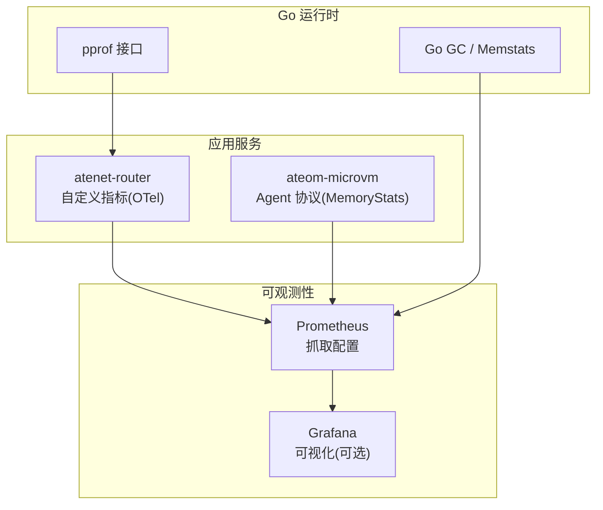
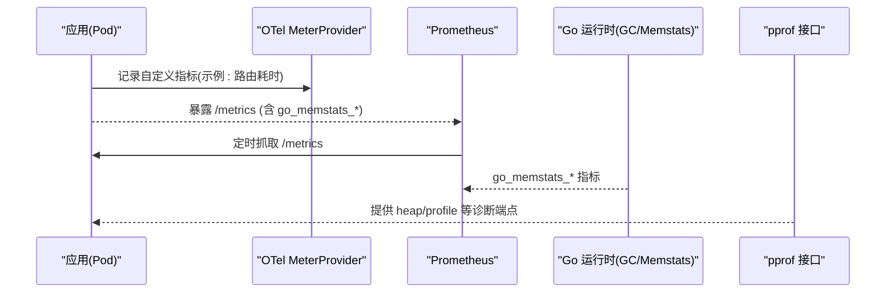
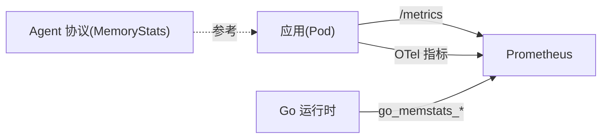

# 内存性能问题排查

<cite>
**本文引用的文件**   
- [cmd/atenet/internal/router/metrics.go](file://cmd/atenet/internal/router/metrics.go)
- [benchmarking/monitoring.yaml](file://benchmarking/monitoring.yaml)
- [manifests/ate-install/kind/prometheus.yaml](file://manifests/ate-install/kind/prometheus.yaml)
- [vendor/github.com/prometheus/client_golang/prometheus/collectors/go_collector_latest.go](file://vendor/github.com/prometheus/client_golang/prometheus/collectors/go_collector_latest.go)
- [vendor/github.com/prometheus/client_golang/prometheus/go_collector.go](file://vendor/github.com/prometheus/client_golang/prometheus/go_collector.go)
- [cmd/ateom-microvm/internal/third_party/kata/agentpb/agent.pb.go](file://cmd/ateom-microvm/internal/third_party/kata/agentpb/agent.pb.go)
- [internal/e2e/suites/demo/demo_test.go](file://internal/e2e/suites/demo/demo_test.go)
</cite>

## 目录
1. [简介](#简介)
2. [项目结构](#项目结构)
3. [核心组件](#核心组件)
4. [架构总览](#架构总览)
5. [详细组件分析](#详细组件分析)
6. [依赖关系分析](#依赖关系分析)
7. [性能考量](#性能考量)
8. [故障排查指南](#故障排查指南)
9. [结论](#结论)
10. [附录](#附录)

## 简介
本文件面向在 Substrate 项目中定位与优化内存问题的工程师，聚焦以下目标：
- 使用 Prometheus 监控 Go 运行时内存指标（如 go_memstats_alloc_bytes、go_memstats_heap_inuse_bytes 等）
- 使用 pprof heap profile 定位内存分配热点与泄漏
- 识别常见内存问题场景（goroutine 泄漏、大对象分配、缓存未清理等）
- 提供优化策略（对象复用、内存池设计、GC 调优）
- 结合快照机制的内存管理与最佳实践

## 项目结构
仓库中与“可观测性与内存监控”直接相关的资源包括：
- Prometheus 抓取配置与部署清单（用于采集 Pod 指标）
- 基于 OpenTelemetry 的自定义指标定义示例（展示如何创建指标）
- Go 运行时指标收集器（Prometheus client_golang 内置）
- 微虚拟机 Agent 协议中的内存统计模型（便于理解底层 cgroup 视角的内存数据）
- 端到端测试中对快照范围与内存/文件数量的断言（体现快照对内存的影响）

图表来源
- [cmd/atenet/internal/router/metrics.go:1-52](file://cmd/atenet/internal/router/metrics.go#L1-L52)
- [cmd/ateom-microvm/internal/third_party/kata/agentpb/agent.pb.go:1007-1089](file://cmd/ateom-microvm/internal/third_party/kata/agentpb/agent.pb.go#L1007-L1089)
- [manifests/ate-install/kind/prometheus.yaml:64-110](file://manifests/ate-install/kind/prometheus.yaml#L64-L110)

章节来源
- [cmd/atenet/internal/router/metrics.go:1-52](file://cmd/atenet/internal/router/metrics.go#L1-L52)
- [manifests/ate-install/kind/prometheus.yaml:64-110](file://manifests/ate-install/kind/prometheus.yaml#L64-L110)
- [benchmarking/monitoring.yaml:59-85](file://benchmarking/monitoring.yaml#L59-L85)

## 核心组件
- Prometheus 抓取配置
  - 通过 Kubernetes SD 自动发现 Pod，并依据注解选择抓取路径与端口。该配置适用于 ate-system 与 otel-system 命名空间。
- Go 运行时指标收集器
  - Prometheus client_golang 内置收集器会暴露 go_memstats_* 系列指标，包含堆使用、分配总量、GC 行为等关键信息。
- 自定义指标（OpenTelemetry）
  - 以 atenet-router 为例，演示如何创建直方图指标，可用于业务延迟或内部计数。
- 微虚拟机 Agent 内存统计模型
  - MemoryStats/MemoryData 描述进程/容器层级的内存使用、上限、Swap、内核态占用等，有助于从系统侧观察内存压力。

章节来源
- [manifests/ate-install/kind/prometheus.yaml:64-110](file://manifests/ate-install/kind/prometheus.yaml#L64-L110)
- [vendor/github.com/prometheus/client_golang/prometheus/collectors/go_collector_latest.go:46-54](file://vendor/github.com/prometheus/client_golang/prometheus/collectors/go_collector_latest.go#L46-L54)
- [vendor/github.com/prometheus/client_golang/prometheus/go_collector.go:71](file://vendor/github.com/prometheus/client_golang/prometheus/go_collector.go#L71)
- [cmd/atenet/internal/router/metrics.go:24-51](file://cmd/atenet/internal/router/metrics.go#L24-L51)
- [cmd/ateom-microvm/internal/third_party/kata/agentpb/agent.pb.go:1007-1089](file://cmd/ateom-microvm/internal/third_party/kata/agentpb/agent.pb.go#L1007-L1089)

## 架构总览
下图展示了从应用到 Prometheus 的指标采集链路，以及 pprof 诊断入口的位置。

图表来源
- [cmd/atenet/internal/router/metrics.go:32-51](file://cmd/atenet/internal/router/metrics.go#L32-L51)
- [vendor/github.com/prometheus/client_golang/prometheus/collectors/go_collector_latest.go:46-54](file://vendor/github.com/prometheus/client_golang/prometheus/collectors/go_collector_latest.go#L46-L54)
- [manifests/ate-install/kind/prometheus.yaml:71-110](file://manifests/ate-install/kind/prometheus.yaml#L71-L110)

## 详细组件分析

### Prometheus 抓取与内存指标
- 抓取策略
  - 使用 kubernetes_sd_configs 自动发现 Pod，并通过 relabel_configs 将注解映射为 __metrics_path__ 与 __address__。
  - 支持 IPv6 地址处理与标签注入（namespace/pod/node）。
- 关键内存指标（由 Go 运行时收集器暴露）
  - go_memstats_alloc_bytes：当前已分配且仍在使用的字节数
  - go_memstats_alloc_bytes_total：累计分配的字节总数
  - go_memstats_heap_inuse_bytes：堆中正在使用的字节数
  - 其他常用：go_memstats_heap_sys_bytes、go_memstats_gc_cycles_per_hour、go_memstats_frees_total 等
- 建议查询
  - 趋势：go_memstats_heap_inuse_bytes 随时间变化
  - 增长：go_memstats_alloc_bytes_total 的速率
  - GC 影响：go_memstats_gc_cycles_per_hour 与内存回落的关系

章节来源
- [manifests/ate-install/kind/prometheus.yaml:64-110](file://manifests/ate-install/kind/prometheus.yaml#L64-L110)
- [vendor/github.com/prometheus/client_golang/prometheus/collectors/go_collector_latest.go:46-54](file://vendor/github.com/prometheus/client_golang/prometheus/collectors/go_collector_latest.go#L46-L54)
- [vendor/github.com/prometheus/client_golang/prometheus/go_collector.go:71](file://vendor/github.com/prometheus/client_golang/prometheus/go_collector.go#L71)

### 自定义指标（OpenTelemetry）
- 示例：在 atenet-router 中创建直方图指标，用于度量路由解析耗时。
- 模式：通过全局 MeterProvider 获取 Meter，再创建 Float64Histogram，设置单位、描述与桶边界。
- 扩展建议：可在关键路径增加内存相关计数器（如“大对象分配次数”），辅助定位热点。

章节来源
- [cmd/atenet/internal/router/metrics.go:24-51](file://cmd/atenet/internal/router/metrics.go#L24-L51)

### 微虚拟机 Agent 内存统计模型
- MemoryStats/MemoryData 提供：
  - 使用量、最大使用量、失败计数、限制
  - Swap 与内核态内存使用
  - 层级统计开关与细粒度 stats map
- 用途：结合 cgroup 视角评估整体内存压力与 OOM 风险，辅助判断是否受系统层面限制。

章节来源
- [cmd/ateom-microvm/internal/third_party/kata/agentpb/agent.pb.go:1007-1089](file://cmd/ateom-microvm/internal/third_party/kata/agentpb/agent.pb.go#L1007-L1089)

### 快照机制与内存管理
- 端到端测试覆盖了不同快照范围（Full/Data）下，暂停与挂起后内存与文件数量的预期，体现了快照策略对内存占用的影响。
- 建议：
  - 明确 onCommit/onPause 的快照范围，避免不必要的完整快照导致峰值内存上升
  - 在 Suspend 阶段减少活跃数据结构，降低快照体积与恢复成本

章节来源
- [internal/e2e/suites/demo/demo_test.go:97-142](file://internal/e2e/suites/demo/demo_test.go#L97-L142)

## 依赖关系分析
- 组件耦合
  - 应用服务通过标准 HTTP 暴露 /metrics，Prometheus 按配置抓取
  - Go 运行时指标由 client_golang 收集器统一暴露
  - 自定义指标通过 OTel 注册，最终汇聚到同一指标体系
- 外部依赖
  - Prometheus 抓取配置依赖 Kubernetes API 与 Pod 注解
  - 微虚拟机 Agent 协议类型仅作为数据模型参考，不直接影响运行时指标

图表来源
- [manifests/ate-install/kind/prometheus.yaml:71-110](file://manifests/ate-install/kind/prometheus.yaml#L71-L110)
- [vendor/github.com/prometheus/client_golang/prometheus/collectors/go_collector_latest.go:46-54](file://vendor/github.com/prometheus/client_golang/prometheus/collectors/go_collector_latest.go#L46-L54)
- [cmd/atenet/internal/router/metrics.go:32-51](file://cmd/atenet/internal/router/metrics.go#L32-L51)
- [cmd/ateom-microvm/internal/third_party/kata/agentpb/agent.pb.go:1007-1089](file://cmd/ateom-microvm/internal/third_party/kata/agentpb/agent.pb.go#L1007-L1089)

## 性能考量
- 指标采集频率
  - 抓取间隔不宜过短，避免对应用与存储造成额外压力；默认 15s 较为平衡。
- 指标基数控制
  - 自定义指标应避免高基数标签，防止 TSDB 膨胀与查询变慢。
- GC 与内存回收
  - 关注 go_memstats_gc_cycles_per_hour 与堆使用回落的相关性，确认 GC 是否及时释放。
- 快照策略
  - 合理选择 Full/Data 范围，避免频繁全量快照导致内存尖峰。

[本节为通用指导，无需源码引用]

## 故障排查指南

### 使用 Prometheus 快速定位内存异常
- 步骤
  - 确认 Pod 已正确暴露 /metrics 并被 Prometheus 抓取
  - 观察 go_memstats_heap_inuse_bytes 与 go_memstats_alloc_bytes_total 的趋势
  - 若持续上涨且不回落，结合 GC 指标判断是否存在泄漏
- 常见问题
  - 指标缺失：检查 Pod 注解 prometheus_io_scrape/path/port 是否正确
  - 抓取失败：核对 relabel_configs 与 IPv6 地址处理逻辑

章节来源
- [manifests/ate-install/kind/prometheus.yaml:71-110](file://manifests/ate-install/kind/prometheus.yaml#L71-L110)
- [vendor/github.com/prometheus/client_golang/prometheus/collectors/go_collector_latest.go:46-54](file://vendor/github.com/prometheus/client_golang/prometheus/collectors/go_collector_latest.go#L46-L54)

### 使用 pprof heap profile 定位分配热点
- 步骤
  - 在目标 Pod 上启用 pprof 端点（通常由框架或中间件暴露）
  - 抓取 heap profile，比较两次快照的差异，定位持续增长的对象类型
  - 结合 goroutine profile 排查 goroutine 泄漏
- 典型现象
  - 某类对象数量单调增长
  - 大对象频繁分配且未被释放
  - goroutine 数量持续上升

[本节为通用指导，无需源码引用]

### 常见内存问题场景与对策
- goroutine 泄漏
  - 症状：goroutine 数量持续上升，CPU/内存缓慢增长
  - 对策：审查通道关闭、上下文取消、定时器清理
- 大对象分配
  - 症状：heap_inuse_bytes 突增，GC 压力大
  - 对策：分块处理、流式读取、对象复用
- 缓存未清理
  - 症状：内存线性增长，无回落
  - 对策：LRU/TTL、容量上限、定期清理任务

[本节为通用指导，无需源码引用]

### 内存优化策略
- 对象复用
  - 使用 sync.Pool 复用临时对象，减少分配与 GC 压力
- 内存池设计
  - 针对固定大小对象建立专用池，避免碎片化
- GC 调优
  - 观察 GC 频率与停顿，必要时调整触发阈值或批处理策略
- 快照优化
  - 按需选择快照范围，避免不必要的全量拷贝

[本节为通用指导，无需源码引用]

## 结论
- 通过 Prometheus 的 go_memstats_* 指标与 pprof heap profile，可以高效定位内存泄漏与分配热点
- 结合快照策略与缓存治理，能显著降低峰值内存与长期增长风险
- 建议在关键路径补充自定义指标，形成更完整的可观测性闭环

[本节为总结性内容，无需源码引用]

## 附录

### 关键指标速查
- go_memstats_alloc_bytes：当前已分配且仍在使用的字节数
- go_memstats_alloc_bytes_total：累计分配的字节总数
- go_memstats_heap_inuse_bytes：堆中正在使用的字节数
- go_memstats_gc_cycles_per_hour：每小时 GC 循环次数

章节来源
- [vendor/github.com/prometheus/client_golang/prometheus/collectors/go_collector_latest.go:46-54](file://vendor/github.com/prometheus/client_golang/prometheus/collectors/go_collector_latest.go#L46-L54)
- [vendor/github.com/prometheus/client_golang/prometheus/go_collector.go:71](file://vendor/github.com/prometheus/client_golang/prometheus/go_collector.go#L71)
