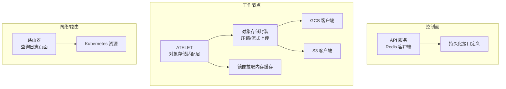
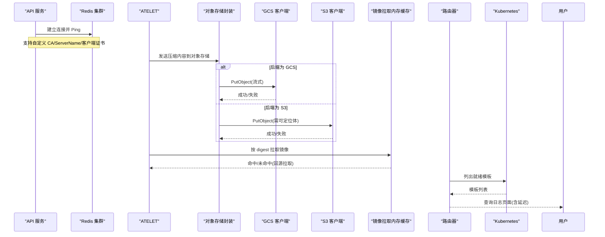
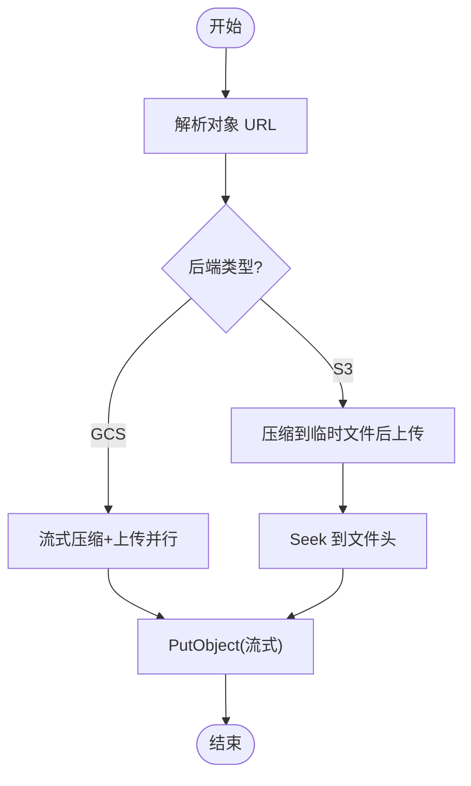
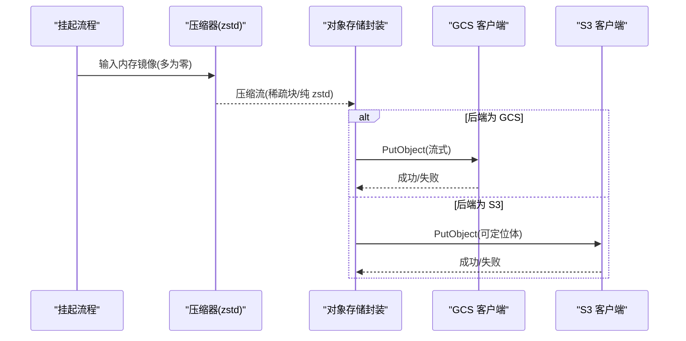
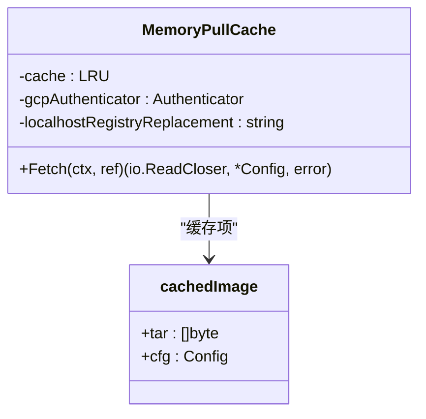
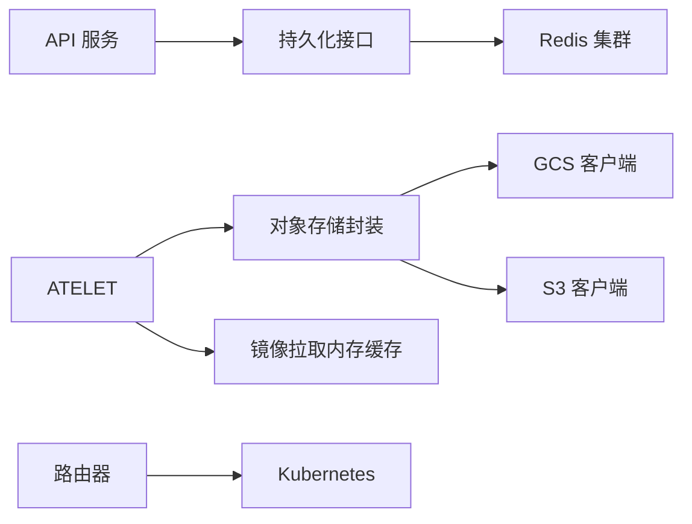

# 存储性能问题排查

<cite>
**本文引用的文件**
- [cmd/ateapi/main.go](file://cmd/ateapi/main.go)
- [cmd/ateapi/internal/store/store.go](file://cmd/ateapi/internal/store/store.go)
- [cmd/atelet/internal/ategcs/gcs.go](file://cmd/atelet/internal/ategcs/gcs.go)
- [cmd/atelet/internal/ategcs/s3.go](file://cmd/atelet/internal/ategcs/s3.go)
- [cmd/atelet/internal/ategcs/objects.go](file://cmd/atelet/internal/ategcs/objects.go)
- [cmd/atelet/internal/memorypullcache/memorypullcache.go](file://cmd/atelet/internal/memorypullcache/memorypullcache.go)
- [cmd/atenet/internal/router/atstore.go](file://cmd/atenet/internal/router/atstore.go)
- [cmd/atenet/internal/router/dashboard.html](file://cmd/atenet/internal/router/dashboard.html)
</cite>

## 目录
1. [引言](#引言)
2. [项目结构](#项目结构)
3. [核心组件](#核心组件)
4. [架构总览](#架构总览)
5. [详细组件分析](#详细组件分析)
6. [依赖关系分析](#依赖关系分析)
7. [性能考量](#性能考量)
8. [故障排查指南](#故障排查指南)
9. [结论](#结论)
10. [附录](#附录)

## 引言
本文件面向存储系统性能问题的诊断与优化，聚焦以下方面：
- Redis 缓存性能监控（命中率、延迟、内存使用）
- 对象存储（GCS/S3）性能监控与优化（上传下载速度、并发连接数、重试机制）
- 文件系统 IO 分析方法（磁盘使用率、IO 等待时间、缓存命中率）
- 通用优化策略（数据分片、批量操作、压缩传输、缓存层设计）
- 快照操作的性能调优与存储成本优化建议

## 项目结构
仓库中与存储相关的关键路径包括：
- 控制面持久化接口定义：cmd/ateapi/internal/store/store.go
- Redis 客户端构建与 TLS 配置：cmd/ateapi/main.go
- 对象存储适配层（GCS/S3）：cmd/atelet/internal/ategcs/{gcs,s3}.go
- 对象存储上层封装与压缩/流式上传逻辑：cmd/atelet/internal/ategcs/objects.go
- 镜像拉取本地内存缓存：cmd/atelet/internal/memorypullcache/memorypullcache.go
- 路由侧模板存储抽象（Kubernetes 资源读取）：cmd/atenet/internal/router/atstore.go
- 路由器查询日志展示（用于网络/请求链路观测）：cmd/atenet/internal/router/dashboard.html

图表来源
- [cmd/ateapi/main.go:280-314](file://cmd/ateapi/main.go#L280-L314)
- [cmd/ateapi/internal/store/store.go:40-118](file://cmd/ateapi/internal/store/store.go#L40-L118)
- [cmd/atelet/internal/ategcs/gcs.go:27-66](file://cmd/atelet/internal/ategcs/gcs.go#L27-L66)
- [cmd/atelet/internal/ategcs/s3.go:29-58](file://cmd/atelet/internal/ategcs/s3.go#L29-L58)
- [cmd/atelet/internal/ategcs/objects.go:156-211](file://cmd/atelet/internal/ategcs/objects.go#L156-L211)
- [cmd/atelet/internal/memorypullcache/memorypullcache.go:35-70](file://cmd/atelet/internal/memorypullcache/memorypullcache.go#L35-L70)
- [cmd/atenet/internal/router/atstore.go:25-55](file://cmd/atenet/internal/router/atstore.go#L25-L55)
- [cmd/atenet/internal/router/dashboard.html:387-458](file://cmd/atenet/internal/router/dashboard.html#L387-L458)

章节来源
- [cmd/ateapi/internal/store/store.go:40-118](file://cmd/ateapi/internal/store/store.go#L40-L118)
- [cmd/ateapi/main.go:280-314](file://cmd/ateapi/main.go#L280-L314)
- [cmd/atelet/internal/ategcs/gcs.go:27-66](file://cmd/atelet/internal/ategcs/gcs.go#L27-L66)
- [cmd/atelet/internal/ategcs/s3.go:29-58](file://cmd/atelet/internal/ategcs/s3.go#L29-L58)
- [cmd/atelet/internal/ategcs/objects.go:156-211](file://cmd/atelet/internal/ategcs/objects.go#L156-L211)
- [cmd/atelet/internal/memorypullcache/memorypullcache.go:35-70](file://cmd/atelet/internal/memorypullcache/memorypullcache.go#L35-L70)
- [cmd/atenet/internal/router/atstore.go:25-55](file://cmd/atenet/internal/router/atstore.go#L25-L55)
- [cmd/atenet/internal/router/dashboard.html:387-458](file://cmd/atenet/internal/router/dashboard.html#L387-L458)

## 核心组件
- 持久化接口层：定义了 Actor、Atespace、Worker 等资源的 CRUD、分页、监听与分布式锁能力，作为上层业务与底层存储的契约。
- Redis 客户端初始化与 TLS：在启动阶段构建集群客户端并校验连通性，支持自定义 CA、ServerName 与双向认证证书。
- 对象存储适配层：统一封装 GCS 与 S3 的 Get/Put 语义；GCS 支持非 seekable 流式写入，S3 需要可定位体以签名和设置 Content-Length。
- 对象存储上层封装：提供 zstd 压缩上传、稀疏块识别、流式压缩与上传并行、以及兼容旧格式解压恢复。
- 镜像拉取内存缓存：基于 LRU 的本地缓存，命中则直接返回 tar 与配置，未命中走远程拉取并按 digest 缓存。
- 路由侧模板存储：从 Kubernetes 获取就绪的 ActorTemplate 列表，供路由决策使用。
- 路由器查询日志页面：展示请求时间戳、目标、方法与耗时等，便于快速定位慢请求。

章节来源
- [cmd/ateapi/internal/store/store.go:40-118](file://cmd/ateapi/internal/store/store.go#L40-L118)
- [cmd/ateapi/main.go:280-314](file://cmd/ateapi/main.go#L280-L314)
- [cmd/atelet/internal/ategcs/gcs.go:27-66](file://cmd/atelet/internal/ategcs/gcs.go#L27-L66)
- [cmd/atelet/internal/ategcs/s3.go:29-58](file://cmd/atelet/internal/ategcs/s3.go#L29-L58)
- [cmd/atelet/internal/ategcs/objects.go:156-211](file://cmd/atelet/internal/ategcs/objects.go#L156-L211)
- [cmd/atelet/internal/memorypullcache/memorypullcache.go:35-70](file://cmd/atelet/internal/memorypullcache/memorypullcache.go#L35-L70)
- [cmd/atenet/internal/router/atstore.go:25-55](file://cmd/atenet/internal/router/atstore.go#L25-L55)
- [cmd/atenet/internal/router/dashboard.html:387-458](file://cmd/atenet/internal/router/dashboard.html#L387-L458)

## 架构总览
下图展示了关键组件之间的调用关系与数据流向，涵盖 Redis 初始化、对象存储上传/下载、镜像拉取缓存与路由查询日志展示。

图表来源
- [cmd/ateapi/main.go:280-314](file://cmd/ateapi/main.go#L280-L314)
- [cmd/atelet/internal/ategcs/objects.go:156-211](file://cmd/atelet/internal/ategcs/objects.go#L156-L211)
- [cmd/atelet/internal/ategcs/gcs.go:27-66](file://cmd/atelet/internal/ategcs/gcs.go#L27-L66)
- [cmd/atelet/internal/ategcs/s3.go:29-58](file://cmd/atelet/internal/ategcs/s3.go#L29-L58)
- [cmd/atelet/internal/memorypullcache/memorypullcache.go:72-198](file://cmd/atelet/internal/memorypullcache/memorypullcache.go#L72-L198)
- [cmd/atenet/internal/router/atstore.go:41-55](file://cmd/atenet/internal/router/atstore.go#L41-L55)
- [cmd/atenet/internal/router/dashboard.html:387-458](file://cmd/atenet/internal/router/dashboard.html#L387-L458)

## 详细组件分析

### Redis 缓存性能监控与优化
- 连接与 TLS：启动时创建集群客户端并进行连通性探测；支持自定义 CA、ServerName 与客户端证书，确保生产环境安全与稳定性。
- 监控指标建议：
  - 命中率：统计 GET/HIT/MISS 计数，计算命中率趋势
  - 延迟：P50/P95/P99 延迟分布，关注异常尖刺
  - 内存使用：used_memory、evicted_keys、keyspace_hits/misses
  - 连接池：活跃连接数、等待队列长度、超时次数
- 优化建议：
  - 合理设置 key 过期时间与淘汰策略，避免热点 key 抖动
  - 对大值进行序列化压缩或拆分，降低内存占用
  - 针对高并发场景调整连接池大小与超时参数
  - 通过 TLS 握手优化与复用减少握手开销

章节来源
- [cmd/ateapi/main.go:280-314](file://cmd/ateapi/main.go#L280-L314)

### 对象存储（GCS/S3）性能监控与优化
- 上传路径差异：
  - GCS：支持非 seekable 流式写入，可直接将压缩器输出管道接入上传，实现“压缩与上传并行”，避免临时文件 I/O。
  - S3：SDK 要求可定位体以签名与设置 Content-Length，因此采用先压缩到临时文件再上传的策略。
- 监控指标建议：
  - 上传/下载吞吐：字节/秒、请求数/秒
  - 延迟：P50/P95/P99，区分读/写
  - 并发连接数：HTTP 连接池大小、活跃连接数
  - 错误率：鉴权失败、网络超时、服务端限流
  - 重试与退避：指数退避成功率、最终失败原因分布
- 优化建议：
  - 启用多核压缩（zstd SpeedFastest），提升吞吐
  - 对稀疏数据采用稀疏块编码，减少实际写入体积
  - 合理设置并发度与分片大小，平衡 CPU 与网络带宽
  - 对 S3 上传路径评估是否可改用支持流式的 SDK 或中间代理以降低临时文件开销
  - 结合 CDN/边缘缓存加速热点对象访问

图表来源
- [cmd/atelet/internal/ategcs/objects.go:156-211](file://cmd/atelet/internal/ategcs/objects.go#L156-L211)
- [cmd/atelet/internal/ategcs/gcs.go:27-66](file://cmd/atelet/internal/ategcs/gcs.go#L27-L66)
- [cmd/atelet/internal/ategcs/s3.go:29-58](file://cmd/atelet/internal/ategcs/s3.go#L29-L58)

章节来源
- [cmd/atelet/internal/ategcs/objects.go:156-211](file://cmd/atelet/internal/ategcs/objects.go#L156-L211)
- [cmd/atelet/internal/ategcs/gcs.go:27-66](file://cmd/atelet/internal/ategcs/gcs.go#L27-L66)
- [cmd/atelet/internal/ategcs/s3.go:29-58](file://cmd/atelet/internal/ategcs/s3.go#L29-L58)

### 文件系统 IO 性能分析方法
- 关键指标：
  - 磁盘使用率：已用空间、inode 使用率
  - IO 等待时间：iowait、await、svctm
  - 缓存命中率：page cache hit ratio、dentry/inode cache 命中率
  - 吞吐与延迟：read/write IOPS、平均延迟
- 分析方法：
  - 使用系统工具采集 iostat/iotop/vmstat 等指标，观察峰值与瓶颈点
  - 结合应用日志中的压缩/上传耗时，定位是 CPU 压缩还是磁盘/网络瓶颈
  - 对稀疏数据优先使用空洞写入，减少实际落盘量
- 优化建议：
  - 选择合适文件系统与挂载选项（如 noatime、discard）
  - 合理分配 SSD/NVMe 与 HDD 角色，热点数据放高性能介质
  - 控制临时文件大小与生命周期，避免污染 page cache

[本节为通用方法论，不直接分析具体文件]

### 快照操作的性能调优与存储成本优化
- 压缩策略：
  - 使用 zstd SpeedFastest 并开启多核压缩，兼顾速度与体积
  - 对稀疏内存镜像采用稀疏块编码，仅写入非零区域，显著降低体积与网络传输
- 上传路径：
  - GCS 走流式路径，压缩与上传并行，避免临时文件 I/O
  - S3 走缓冲路径，注意临时文件 I/O 与磁盘压力
- 恢复兼容性：
  - 解码时自动检测头部 magic，兼容旧版纯 zstd 流
- 成本优化：
  - 利用稀疏特性减少对象体积，降低存储费用
  - 对冷数据采用低频/归档存储类
  - 定期清理无用快照与中间产物

图表来源
- [cmd/atelet/internal/ategcs/objects.go:156-211](file://cmd/atelet/internal/ategcs/objects.go#L156-L211)
- [cmd/atelet/internal/ategcs/objects.go:341-363](file://cmd/atelet/internal/ategcs/objects.go#L341-L363)
- [cmd/atelet/internal/ategcs/gcs.go:27-66](file://cmd/atelet/internal/ategcs/gcs.go#L27-L66)
- [cmd/atelet/internal/ategcs/s3.go:29-58](file://cmd/atelet/internal/ategcs/s3.go#L29-L58)

章节来源
- [cmd/atelet/internal/ategcs/objects.go:156-211](file://cmd/atelet/internal/ategcs/objects.go#L156-L211)
- [cmd/atelet/internal/ategcs/objects.go:341-363](file://cmd/atelet/internal/ategcs/objects.go#L341-L363)

### 镜像拉取内存缓存设计与优化
- 缓存键：镜像 digest（十六进制 sha256）
- 缓存项：tar 包与镜像配置
- 容量策略：固定条目数的 LRU（默认 256），可根据内存与负载调整
- 本地注册表重写：开发环境下可将 localhost 指向内网镜像仓库
- 性能影响：
  - 命中时跳过远程拉取，显著降低延迟与外部依赖压力
  - 未命中时按平台过滤并拉取，大镜像可能超过阈值而不缓存

图表来源
- [cmd/atelet/internal/memorypullcache/memorypullcache.go:35-70](file://cmd/atelet/internal/memorypullcache/memorypullcache.go#L35-L70)
- [cmd/atelet/internal/memorypullcache/memorypullcache.go:72-198](file://cmd/atelet/internal/memorypullcache/memorypullcache.go#L72-L198)

章节来源
- [cmd/atelet/internal/memorypullcache/memorypullcache.go:35-70](file://cmd/atelet/internal/memorypullcache/memorypullcache.go#L35-L70)
- [cmd/atelet/internal/memorypullcache/memorypullcache.go:72-198](file://cmd/atelet/internal/memorypullcache/memorypullcache.go#L72-L198)

### 路由侧模板存储与查询日志
- 模板存储：从 Kubernetes 获取状态为就绪的 ActorTemplate 列表，供路由匹配使用。
- 查询日志页面：展示请求时间戳、客户端/权威信息、路径/路由、方法、匹配动作结果、目标 IP 与延迟，便于快速定位慢请求与异常。

章节来源
- [cmd/atenet/internal/router/atstore.go:25-55](file://cmd/atenet/internal/router/atstore.go#L25-L55)
- [cmd/atenet/internal/router/dashboard.html:387-458](file://cmd/atenet/internal/router/dashboard.html#L387-L458)

## 依赖关系分析
- 控制面与持久化：API 服务通过持久化接口与底层存储交互；Redis 作为会话/锁/状态存储之一。
- 工作节点与对象存储：ATELET 通过统一接口对接 GCS/S3，上层封装负责压缩与流式处理。
- 镜像拉取缓存：独立于对象存储，专注于 OCI 镜像的快速本地复用。
- 路由与 K8s：路由器从 K8s 读取模板资源，渲染查询日志页面辅助排障。

图表来源
- [cmd/ateapi/internal/store/store.go:40-118](file://cmd/ateapi/internal/store/store.go#L40-L118)
- [cmd/ateapi/main.go:280-314](file://cmd/ateapi/main.go#L280-L314)
- [cmd/atelet/internal/ategcs/objects.go:156-211](file://cmd/atelet/internal/ategcs/objects.go#L156-L211)
- [cmd/atelet/internal/ategcs/gcs.go:27-66](file://cmd/atelet/internal/ategcs/gcs.go#L27-L66)
- [cmd/atelet/internal/ategcs/s3.go:29-58](file://cmd/atelet/internal/ategcs/s3.go#L29-L58)
- [cmd/atelet/internal/memorypullcache/memorypullcache.go:35-70](file://cmd/atelet/internal/memorypullcache/memorypullcache.go#L35-L70)
- [cmd/atenet/internal/router/atstore.go:25-55](file://cmd/atenet/internal/router/atstore.go#L25-L55)

章节来源
- [cmd/ateapi/internal/store/store.go:40-118](file://cmd/ateapi/internal/store/store.go#L40-L118)
- [cmd/ateapi/main.go:280-314](file://cmd/ateapi/main.go#L280-L314)
- [cmd/atelet/internal/ategcs/objects.go:156-211](file://cmd/atelet/internal/ategcs/objects.go#L156-L211)
- [cmd/atelet/internal/ategcs/gcs.go:27-66](file://cmd/atelet/internal/ategcs/gcs.go#L27-L66)
- [cmd/atelet/internal/ategcs/s3.go:29-58](file://cmd/atelet/internal/ategcs/s3.go#L29-L58)
- [cmd/atelet/internal/memorypullcache/memorypullcache.go:35-70](file://cmd/atelet/internal/memorypullcache/memorypullcache.go#L35-L70)
- [cmd/atenet/internal/router/atstore.go:25-55](file://cmd/atenet/internal/router/atstore.go#L25-L55)

## 性能考量
- 压缩与并发：
  - 使用多核 zstd 压缩，提高吞吐；根据数据特征选择合适的压缩级别
  - 对稀疏数据采用稀疏块编码，减少体积与网络传输
- 流式与缓冲：
  - GCS 走流式路径，避免临时文件 I/O；S3 走缓冲路径，注意磁盘压力
- 缓存层设计：
  - 镜像拉取内存缓存按 digest 命中，减少远程依赖与延迟
  - 合理设置缓存容量与淘汰策略，避免内存膨胀
- 监控与告警：
  - 建立端到端延迟、吞吐、错误率与资源使用率的监控面板
  - 对关键路径（挂起/恢复、镜像拉取、对象上传）设置阈值告警

[本节为通用指导，不直接分析具体文件]

## 故障排查指南
- Redis 相关问题：
  - 连接失败：检查 TLS 配置（CA、ServerName、客户端证书）与网络可达性
  - 高延迟：观察连接池与超时参数，排查热点 key 与淘汰策略
- 对象存储问题：
  - 上传失败：确认后端类型与流式/缓冲路径选择；检查鉴权与权限
  - 速度慢：评估压缩级别、并发度、分片大小与网络带宽
- 镜像拉取问题：
  - 缓存未命中：检查 digest 是否正确、镜像大小是否超过阈值
  - 本地注册表不可达：确认重写规则与网络连通性
- 路由查询慢：
  - 查看查询日志页面的延迟列，定位慢请求与目标
  - 检查 K8s 资源读取性能与模板数量规模

章节来源
- [cmd/ateapi/main.go:280-314](file://cmd/ateapi/main.go#L280-L314)
- [cmd/atelet/internal/ategcs/objects.go:156-211](file://cmd/atelet/internal/ategcs/objects.go#L156-L211)
- [cmd/atelet/internal/memorypullcache/memorypullcache.go:72-198](file://cmd/atelet/internal/memorypullcache/memorypullcache.go#L72-L198)
- [cmd/atenet/internal/router/dashboard.html:387-458](file://cmd/atenet/internal/router/dashboard.html#L387-L458)

## 结论
通过对 Redis、对象存储、文件系统 IO 与缓存层的系统性监控与优化，结合稀疏数据压缩、流式上传与本地缓存等策略，可以显著提升存储系统的整体性能与稳定性。建议在关键路径上完善指标采集与告警，持续迭代优化参数与架构设计。

[本节为总结，不直接分析具体文件]

## 附录
- 术语说明：
  - 稀疏块：仅记录非零区域的元数据，减少实际写入体积
  - 流式上传：边压缩边上传，避免中间文件 I/O
  - 可定位体：支持 Seek 的 Reader，常用于签名与设置 Content-Length
- 参考实践：
  - 针对 GCS 优先使用流式路径；对 S3 评估是否可通过 SDK 升级或代理改善
  - 对大镜像拉取增加本地缓存与分层缓存策略

[本节为补充说明，不直接分析具体文件]
