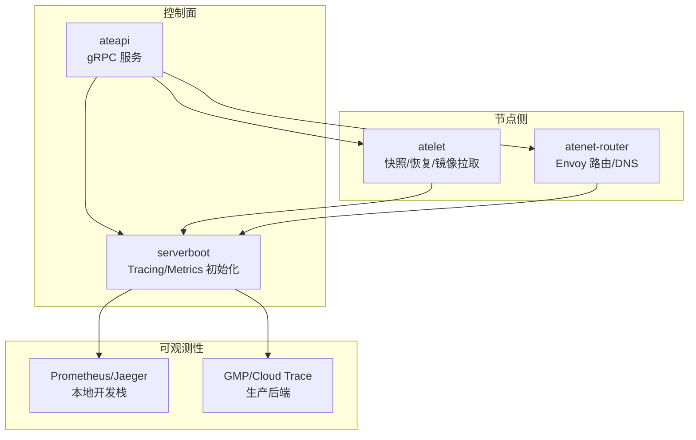
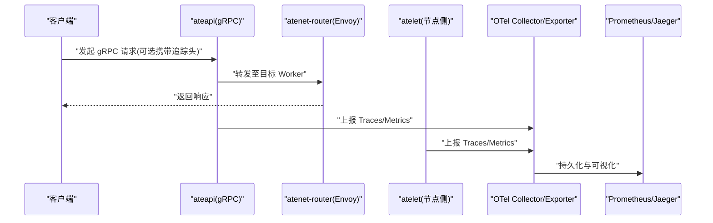
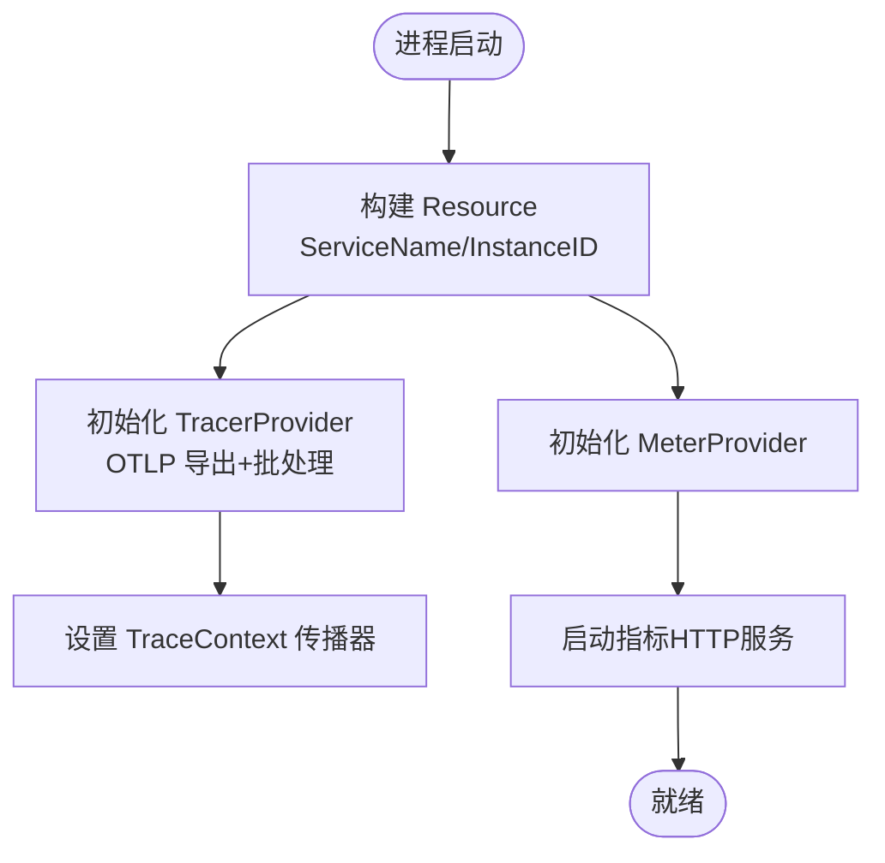
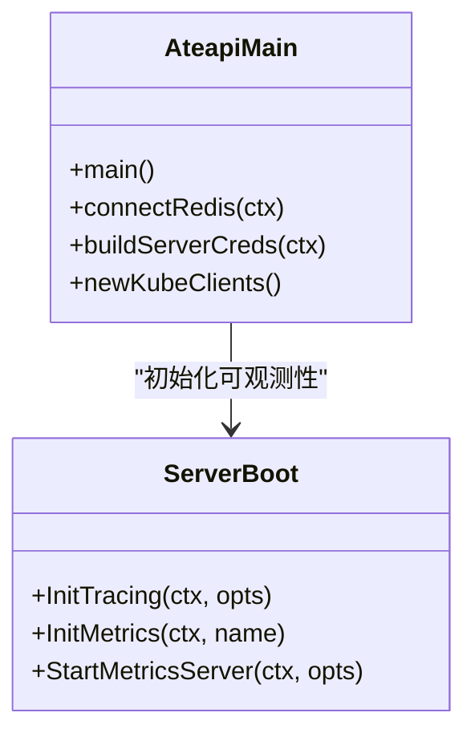
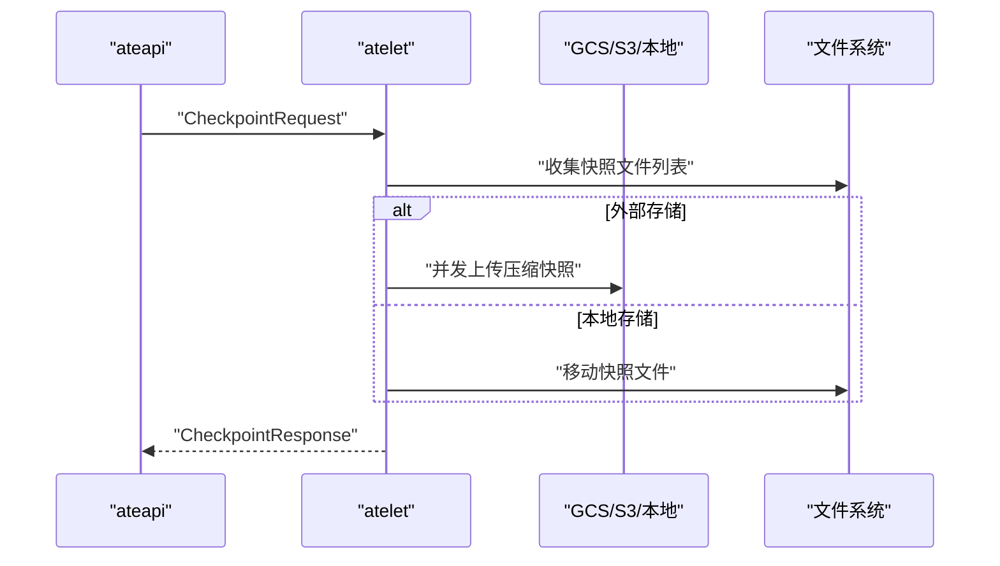
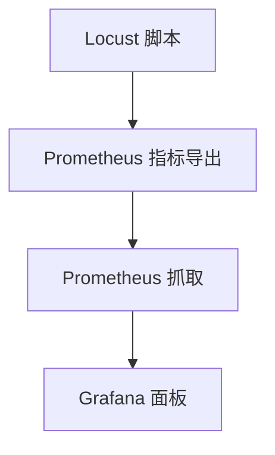
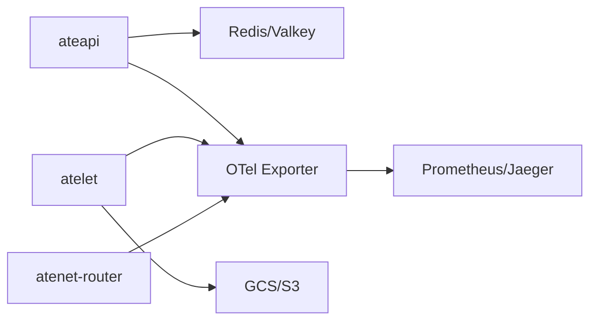

# 性能问题排查

<cite>
**本文引用的文件**   
- [README.md](file://README.md)
- [observability.md](file://docs/observability.md)
- [tracing.md](file://docs/dev/best-practices/tracing.md)
- [serverboot.go](file://internal/serverboot/serverboot.go)
- [ateapi main.go](file://cmd/ateapi/main.go)
- [atelet main.go](file://cmd/atelet/main.go)
- [atenet main.go](file://cmd/atenet/main.go)
- [metrics.py](file://benchmarking/locust/common/metrics.py)
- [monitoring.yaml](file://benchmarking/monitoring.yaml)
- [prom.go](file://internal/benchmarking/boomer/metrics/prom.go)
</cite>

## 目录
1. [简介](#简介)
2. [项目结构](#项目结构)
3. [核心组件](#核心组件)
4. [架构总览](#架构总览)
5. [详细组件分析](#详细组件分析)
6. [依赖分析](#依赖分析)
7. [性能考虑](#性能考虑)
8. [故障排查指南](#故障排查指南)
9. [结论](#结论)
10. [附录](#附录)

## 简介
本指南面向在 Agent Substrate 上运行与运维“代理型”工作负载的工程师，聚焦于性能问题的识别、定位与优化。内容覆盖：
- CPU 占用过高、内存泄漏、网络延迟、磁盘 IO 瓶颈的诊断方法
- Prometheus 指标含义与监控面板使用（含关键阈值建议）
- OpenTelemetry 分布式追踪的配置与使用，用于定位慢请求与热点
- 基准测试分析方法与回归检测
- 资源配额调优建议与最佳实践
- 资源竞争与死锁问题的识别与解决思路

## 项目结构
Agent Substrate 由多个服务组成，分别承担控制面、节点侧执行、网络路由与可观测性能力。与性能相关的关键入口与模块如下：
- ateapi：控制面 gRPC API 服务，负责 Actor/Worker 生命周期管理、认证鉴权、缓存与调度协调
- atelet：节点侧守护进程，负责镜像拉取、快照检查点/恢复、本地/外部存储上传下载、OCI bundle 准备
- atenet：网络控制器与 Envoy 路由，提供 DNS、路由与代理 sidecar
- serverboot：可观测性初始化（Tracing/Metrics）、日志与指标服务器启动
- benchmarking：基于 Locust 的压测工具链与监控面板配置

图表来源
- [serverboot.go:60-119](file://internal/serverboot/serverboot.go#L60-L119)
- [ateapi main.go:88-101](file://cmd/ateapi/main.go#L88-L101)
- [atelet main.go:83-96](file://cmd/atelet/main.go#L83-L96)
- [observability.md:170-182](file://docs/observability.md#L170-L182)

章节来源
- [README.md:215-224](file://README.md#L215-L224)
- [observability.md:103-133](file://docs/observability.md#L103-L133)

## 核心组件
- 可观测性基础设施
  - Tracing：通过 OTLP gRPC 导出，支持按父采样策略与按需采样；默认传播 TraceContext
  - Metrics：OTel MeterProvider 暴露系统级指标，Prometheus 在 Kind 环境自动采集
  - 日志：容器标准输出被包装为结构化 JSON，注入 actor 元数据标签
- 关键指标
  - rpc.server.call.duration：gRPC 服务端调用时延直方图（按方法与状态码分桶）
  - atenet.router.route.duration：端到端路由耗时（不含 Actor 计算与响应）
  - atelet.snapshot.size：快照大小直方图（按模板命名空间/名称标注）
- 追踪
  - 客户端可通过 --trace 触发链路追踪，跨 ateapi/atenet/ateom 传递上下文

章节来源
- [observability.md:103-166](file://docs/observability.md#L103-L166)
- [serverboot.go:60-119](file://internal/serverboot/serverboot.go#L60-L119)

## 架构总览
下图展示了从客户端到控制面、网络层与节点侧服务的典型请求路径，以及可观测性数据的流向。

图表来源
- [observability.md:137-166](file://docs/observability.md#L137-L166)
- [serverboot.go:91-119](file://internal/serverboot/serverboot.go#L91-L119)

## 详细组件分析

### 组件A：可观测性初始化与指标/追踪导出
- 初始化流程
  - 创建 Resource（包含 ServiceName、ServiceInstanceID），合并 OTEL_* 环境变量
  - 注册全局 TracerProvider（带批处理 OTLP 导出器）与 TextMapPropagator
  - 注册 MeterProvider，并启动独立 HTTP 指标服务器
- 采样策略
  - ateapi 通常采用 AlwaysSample（或 ParentBased(AlwaysSample)）以捕获更多链路
  - atelet/ateom-gvisor 采用 NeverSample 以减少开销
- 指标暴露
  - 各服务通过 OTLP 上报，Kind 下由 in-cluster collector 转 Prometheus/Jaeger

图表来源
- [serverboot.go:60-119](file://internal/serverboot/serverboot.go#L60-L119)
- [ateapi main.go:88-101](file://cmd/ateapi/main.go#L88-L101)
- [atelet main.go:83-96](file://cmd/atelet/main.go#L83-L96)

章节来源
- [serverboot.go:60-119](file://internal/serverboot/serverboot.go#L60-L119)
- [observability.md:170-182](file://docs/observability.md#L170-L182)

### 组件B：ateapi 控制面服务
- 功能要点
  - 启动 gRPC 服务，挂载 StatsHandler（otelgrpc）与拦截器链（认证、通用拦截）
  - 连接 Redis/Valkey 集群（支持 IAM 认证、TLS、自定义 CA/ServerName）
  - 启动指标服务器，暴露 /metrics
- 性能关注点
  - gRPC 统计与拦截器链会带来少量额外开销，但有助于度量与诊断
  - Redis 连接建立与重试逻辑影响启动时延与可用性

图表来源
- [ateapi main.go:88-101](file://cmd/ateapi/main.go#L88-L101)
- [serverboot.go:91-119](file://internal/serverboot/serverboot.go#L91-L119)

章节来源
- [ateapi main.go:182-206](file://cmd/ateapi/main.go#L182-L206)
- [observability.md:115-133](file://docs/observability.md#L115-L133)

### 组件C：atelet 节点侧服务
- 功能要点
  - 镜像拉取缓存、匿名 GCS/S3 客户端、本地/外部快照上传下载
  - Checkpoint/Restore 流程并发执行（下载与 OCI bundle 准备并行）
  - 记录 atelet.snapshot.size 指标（按模板维度标注）
- 性能关注点
  - 并发 I/O 与解压对 CPU/IO 有压力，需关注磁盘吞吐与网络带宽
  - 快照大小分布直接影响恢复时延与存储成本

图表来源
- [atelet main.go:309-380](file://cmd/atelet/main.go#L309-L380)
- [atelet main.go:422-452](file://cmd/atelet/main.go#L422-L452)
- [observability.md:103-133](file://docs/observability.md#L103-L133)

章节来源
- [atelet main.go:273-307](file://cmd/atelet/main.go#L273-L307)
- [observability.md:103-133](file://docs/observability.md#L103-L133)

### 组件D：网络路由 atenet
- 功能要点
  - 提供 DNS、Envoy 路由与代理 sidecar
  - 暴露 atenet.router.route.duration 指标（端到端路由耗时）
- 性能关注点
  - 路由层是端到端延迟的重要组成部分，需结合 P95/P99 观察

章节来源
- [observability.md:103-133](file://docs/observability.md#L103-L133)

### 组件E：压测与监控（Locust + Prometheus/Grafana）
- 指标定义
  - locust_requests_total：请求总数（按 method/name/status/user_class 标注）
  - locust_request_duration_milliseconds：请求时延直方图（毫秒）
  - locust_users：活跃用户数（按 user_class 标注）
- 监控面板
  - 提供 P99 时延与活跃用户数等面板，便于快速发现回归

图表来源
- [metrics.py:29-64](file://benchmarking/locust/common/metrics.py#L29-L64)
- [monitoring.yaml:497-515](file://benchmarking/monitoring.yaml#L497-L515)

章节来源
- [metrics.py:29-101](file://benchmarking/locust/common/metrics.py#L29-L101)
- [monitoring.yaml:497-515](file://benchmarking/monitoring.yaml#L497-L515)

## 依赖分析
- 可观测性依赖
  - OTel SDK/Exporter（Trace/Metric）
  - otelgrpc/stats handler（gRPC 埋点）
  - Prometheus（Kind 本地采集）
- 运行时依赖
  - Redis/Valkey（控制面缓存/状态）
  - GCS/S3（快照对象存储）
  - OCI 镜像仓库（镜像拉取）

图表来源
- [serverboot.go:91-119](file://internal/serverboot/serverboot.go#L91-L119)
- [observability.md:170-182](file://docs/observability.md#L170-L182)

章节来源
- [serverboot.go:91-119](file://internal/serverboot/serverboot.go#L91-L119)
- [observability.md:170-182](file://docs/observability.md#L170-L182)

## 性能考虑
- CPU 占用过高
  - 现象：P95/P99 时延升高、GC 频繁、goroutine 数量异常增长
  - 定位：结合 rpc.server.call.duration 与 atenet.router.route.duration 定位热点；查看 goroutine 与 pprof 火焰图
  - 优化：减少热路径分配、避免阻塞 I/O 在关键路径、合理设置并发度与超时
- 内存泄漏
  - 现象：RSS 持续增长、OOMKill、GC 暂停时间变长
  - 定位：对比基线 RSS 曲线、导出 heap profile、关注大对象与未释放句柄
  - 优化：限制缓存大小、及时关闭连接/文件句柄、避免闭包持有大对象引用
- 网络延迟
  - 现象：router.route.duration 升高、gRPC 错误率上升
  - 定位：检查 DNS/Envoy 配置、远端服务健康、TLS 握手与证书校验
  - 优化：启用连接复用、合理设置超时与重试、就近部署与多可用区
- 磁盘 IO 瓶颈
  - 现象：快照上传/下载缓慢、restore 时延高
  - 定位：观察 atelet.snapshot.size 分布、IOPS/吞吐指标、磁盘队列长度
  - 优化：选择更高吞吐磁盘、并发度调优、预热镜像与快照缓存

[本节为通用指导，不直接分析具体文件]

## 故障排查指南
- 指标与面板
  - 在 Kind 中通过端口转发访问 Prometheus UI，查询 up/rpc_* 系列确认目标健康
  - 使用 Grafana 面板观察 P99 时延与活跃用户数，快速发现回归
- 分布式追踪
  - 使用 --trace 触发一次端到端追踪，复制 Trace ID 在 Jaeger 中检索
  - 关注跨服务 span 的耗时分布，定位慢步骤（如 Snapshot 上传/下载、OCI 解包）
- 常见问题
  - Redis 连接失败：检查 TLS/CA/ServerName/IAM 配置与重试日志
  - 快照上传失败：检查对象存储权限、网络连通性与并发度
  - 路由层抖动：检查 Envoy 配置与上游健康检查

章节来源
- [observability.md:115-166](file://docs/observability.md#L115-L166)
- [tracing.md:1-266](file://docs/dev/best-practices/tracing.md#L1-L266)

## 结论
通过统一的 OTel 指标与追踪体系，配合 Prometheus/Jaeger 面板，可以快速定位控制面、网络层与节点侧的性能瓶颈。建议在压测环境中持续采集关键指标，建立回归基线与告警阈值，并结合快照大小与恢复耗时进行容量规划与资源配额调优。

[本节为总结性内容，不直接分析具体文件]

## 附录

### Prometheus 指标与阈值建议
- 关键指标
  - rpc.server.call.duration：按方法与状态码观察 P95/P99 时延与错误率
  - atenet.router.route.duration：端到端路由时延（不含 Actor 计算）
  - atelet.snapshot.size：快照大小分布（按模板维度）
  - locust_requests_total/locust_request_duration_milliseconds/locust_users：压测场景下的请求量、时延与并发
- 阈值建议（示例，需按业务调整）
  - gRPC P99 时延 > 200ms 且错误率 > 1%：触发告警
  - 路由 P99 时延 > 100ms：触发告警
  - 快照大小 P95 > 500MB：评估存储与恢复时延风险
  - 压测 P99 时延较基线上升 > 20%：触发回归告警

章节来源
- [observability.md:103-133](file://docs/observability.md#L103-L133)
- [metrics.py:48-64](file://benchmarking/locust/common/metrics.py#L48-L64)
- [monitoring.yaml:497-515](file://benchmarking/monitoring.yaml#L497-L515)

### OpenTelemetry 追踪配置要点
- 服务端
  - 初始化 TracerProvider 与 TextMapPropagator，使用 OTLP 导出器
  - 根据场景选择采样策略（按需/全量）
- 客户端
  - 注入追踪上下文（gRPC metadata/HTTP headers）
  - 使用 otelhttp/otelgrpc 传输封装

章节来源
- [serverboot.go:91-119](file://internal/serverboot/serverboot.go#L91-L119)
- [tracing.md:1-266](file://docs/dev/best-practices/tracing.md#L1-L266)

### 基准测试与回归检测
- 压测工具
  - Locust 脚本定义用户行为，导出 Prometheus 指标
  - 自动化编排提交 Job 执行不同用例，收集结果与日志
- 回归检测
  - 对比历史 P99 时延与错误率，设定阈值触发回归告警
  - 结合 snapshot.size 变化评估恢复时延影响

章节来源
- [metrics.py:29-101](file://benchmarking/locust/common/metrics.py#L29-L101)
- [monitoring.yaml:497-515](file://benchmarking/monitoring.yaml#L497-L515)

### 资源配额调优与最佳实践
- CPU/内存
  - 为 ateapi/atelet 设置合理的 requests/limits，避免邻居干扰
  - 监控 GC 与 RSS，必要时调整 GOGC 或增加内存上限
- 存储
  - 快照大小较大时，提升磁盘吞吐与网络带宽
  - 使用对象存储分区与压缩，降低 I/O 压力
- 网络
  - 合理设置 gRPC 超时与重试，避免雪崩
  - 开启连接复用与 HTTP/2 特性

[本节为通用指导，不直接分析具体文件]

### 资源竞争与死锁识别与解决
- 识别
  - 观察 goroutine 数量与阻塞等待（pprof block/delay）
  - 检查互斥锁持有时间与锁粒度，定位热点临界区
- 解决
  - 缩小锁范围、拆分热点路径、引入无锁数据结构
  - 使用超时与取消机制防止长时间阻塞
  - 对 I/O 密集操作异步化，避免阻塞关键路径

[本节为通用指导，不直接分析具体文件]
