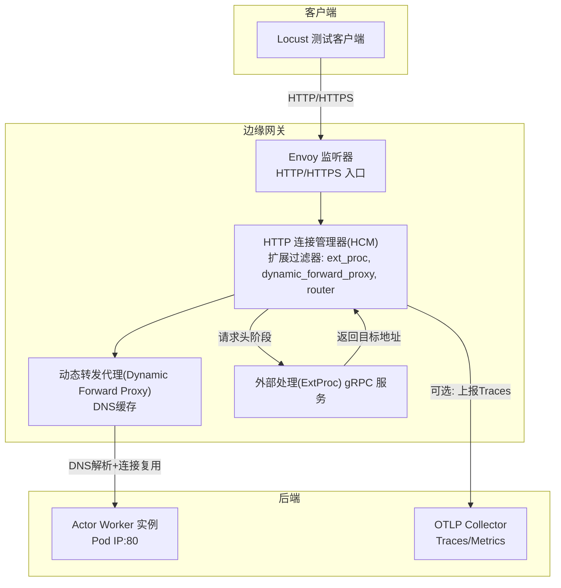
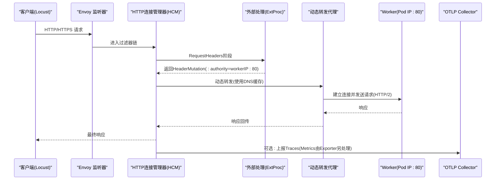
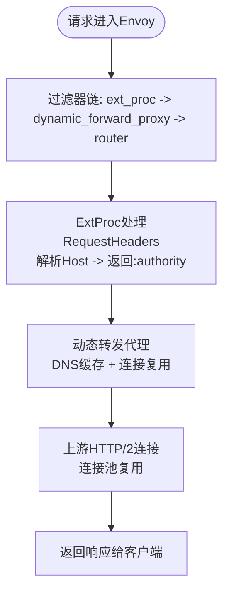
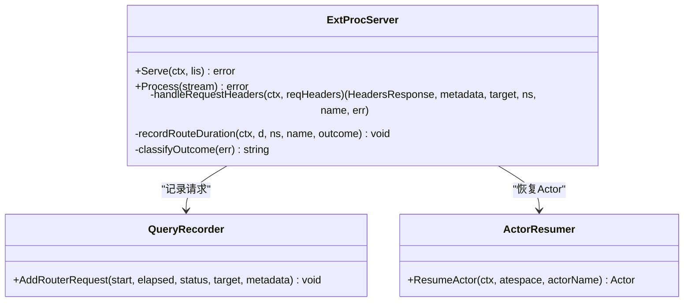
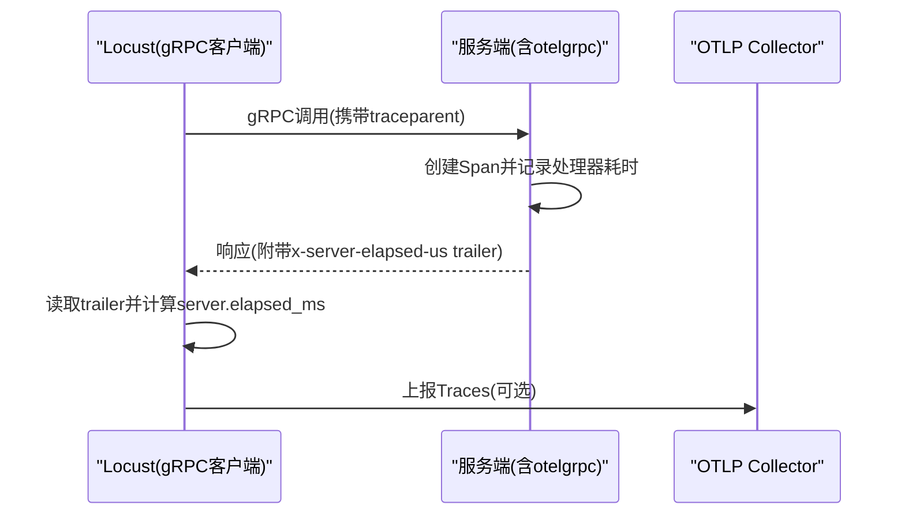
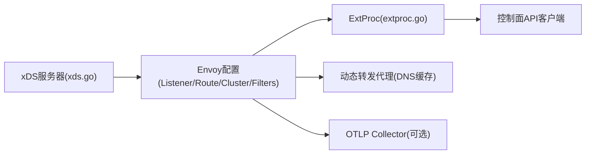

# 网络性能问题排查

<cite>
**本文引用的文件**   
- [xds.go](file://cmd/atenet/internal/router/xds.go)
- [extproc.go](file://cmd/atenet/internal/router/extproc.go)
- [metrics.go](file://cmd/atenet/internal/router/metrics.go)
- [grpc_tracing.py](file://benchmarking/locust/common/grpc_tracing.py)
- [metrics.py](file://benchmarking/locust/common/metrics.py)
- [tracing.md](file://docs/dev/best-practices/tracing.md)
</cite>

## 目录
1. [简介](#简介)
2. [项目结构](#项目结构)
3. [核心组件](#核心组件)
4. [架构总览](#架构总览)
5. [详细组件分析](#详细组件分析)
6. [依赖关系分析](#依赖关系分析)
7. [性能考量与优化建议](#性能考量与优化建议)
8. [故障排查指南](#故障排查指南)
9. [结论](#结论)
10. [附录](#附录)

## 简介
本文件面向网络性能问题的诊断与优化，围绕以下目标展开：
- 监控关键指标：HTTP请求延迟、DNS解析时间、gRPC调用耗时、连接数等
- Envoy代理的性能监控与配置优化：连接池、负载均衡策略、超时配置
- 网络拥塞检测与带宽利用率分析方法
- 具体优化策略：连接复用、压缩传输、缓存策略
- 分布式追踪在定位瓶颈中的应用
- 网络I/O多路复用的优化技巧

## 项目结构
本项目包含一个基于Envoy xDS的网关路由子系统（atenet），以及用于压测与可观测性的Locust脚本与OpenTelemetry集成。与网络性能密切相关的代码主要位于：
- cmd/atenet/internal/router：Envoy xDS配置生成、外部处理服务（ExtProc）、度量指标定义
- benchmarking/locust/common：gRPC追踪封装、Prometheus指标采集
- docs/dev/best-practices/tracing.md：OpenTelemetry最佳实践文档

图表来源
- [xds.go:386-466](file://cmd/atenet/internal/router/xds.go#L386-L466)
- [xds.go:503-531](file://cmd/atenet/internal/router/xds.go#L503-L531)
- [xds.go:336-355](file://cmd/atenet/internal/router/xds.go#L336-L355)
- [extproc.go:80-128](file://cmd/atenet/internal/router/extproc.go#L80-L128)

章节来源
- [xds.go:1-607](file://cmd/atenet/internal/router/xds.go#L1-L607)
- [extproc.go:1-213](file://cmd/atenet/internal/router/extproc.go#L1-L213)
- [metrics.go:1-52](file://cmd/atenet/internal/router/metrics.go#L1-L52)

## 核心组件
- Envoy xDS服务器：通过聚合发现服务为Envoy节点下发Listener、Route、Cluster等配置，支持HTTP/HTTPS监听、动态转发代理、外部处理过滤器、访问日志与可选的OpenTelemetry追踪。
- ExtProc外部处理服务：在请求头阶段拦截请求，根据Host解析目标Actor并返回重写后的Authority，实现按请求动态路由到Worker Pod。
- 指标与追踪：
  - 路由阶段耗时直方图：记录从ExtProc收到请求到解析出目标Worker的时间
  - gRPC客户端侧追踪与Locust事件上报：结合服务端上报的处理器耗时，得到更准确的端到端延迟
  - Prometheus指标导出：Locust侧暴露请求计数、延迟分布、活跃用户数

章节来源
- [xds.go:148-194](file://cmd/atenet/internal/router/xds.go#L148-L194)
- [extproc.go:190-213](file://cmd/atenet/internal/router/extproc.go#L190-L213)
- [metrics.go:32-52](file://cmd/atenet/internal/router/metrics.go#L32-L52)
- [grpc_tracing.py:68-123](file://benchmarking/locust/common/grpc_tracing.py#L68-L123)
- [metrics.py:29-65](file://benchmarking/locust/common/metrics.py#L29-L65)

## 架构总览
下图展示了从客户端到后端Worker的关键路径，包括Envoy的过滤器链、ExtProc的动态路由决策、动态转发代理的DNS缓存与连接复用，以及可选的OTLP追踪上报。

图表来源
- [xds.go:386-466](file://cmd/atenet/internal/router/xds.go#L386-L466)
- [xds.go:336-355](file://cmd/atenet/internal/router/xds.go#L336-L355)
- [extproc.go:80-128](file://cmd/atenet/internal/router/extproc.go#L80-L128)

## 详细组件分析

### Envoy xDS配置与网络性能关键点
- 监听器与过滤器链
  - HTTP/HTTPS监听器启用HTTP连接管理器，依次挂载外部处理(ext_proc)、动态转发代理(dynamic_forward_proxy)、路由器(router)三个过滤器。
  - 访问日志输出至标准输出，便于快速定位请求级问题。
- 外部处理(ExtProc)
  - 仅处理RequestHeaders阶段，避免对请求体/响应体的额外开销。
  - 超时与消息超时显式配置，防止默认值过小导致误判。
- 动态转发代理与DNS缓存
  - 使用Dynamic Forward Proxy集群，内置DNS缓存，减少重复解析开销。
  - DNS解析族设置为IPv4优先，有助于稳定解析行为。
- 上游协议与连接复用
  - 上游HTTP协议强制HTTP/2，有利于连接复用与多路复用。
- 负载均衡策略
  - 采用轮询策略，适合无状态后端；若存在热点或权重差异，可考虑其他策略。
- 超时配置
  - 连接超时与路由超时分别设置，避免长尾请求阻塞资源。

图表来源
- [xds.go:386-466](file://cmd/atenet/internal/router/xds.go#L386-L466)
- [xds.go:336-355](file://cmd/atenet/internal/router/xds.go#L336-L355)
- [xds.go:227-272](file://cmd/atenet/internal/router/xds.go#L227-L272)
- [xds.go:274-284](file://cmd/atenet/internal/router/xds.go#L274-L284)

章节来源
- [xds.go:386-466](file://cmd/atenet/internal/router/xds.go#L386-L466)
- [xds.go:227-272](file://cmd/atenet/internal/router/xds.go#L227-L272)
- [xds.go:274-284](file://cmd/atenet/internal/router/xds.go#L274-L284)
- [xds.go:336-355](file://cmd/atenet/internal/router/xds.go#L336-L355)

### ExtProc外部处理服务与路由延迟指标
- 职责
  - 接收Envoy在RequestHeaders阶段的请求，解析Host获取atespace与actor名称，调用控制面恢复Actor并返回Worker Pod IP。
  - 将:authority重写为workerIP:80，交由下游动态转发代理进行实际转发。
- 指标
  - 路由阶段耗时直方图：记录从ExtProc收到请求到解析出目标Worker的时间，排除Actor执行与响应时间，帮助定位“路由”阶段的瓶颈。
- 错误分类
  - 区分取消、未找到、错误等结果，便于在指标中按outcome维度分析。

图表来源
- [extproc.go:38-78](file://cmd/atenet/internal/router/extproc.go#L38-L78)
- [extproc.go:80-128](file://cmd/atenet/internal/router/extproc.go#L80-L128)
- [extproc.go:130-188](file://cmd/atenet/internal/router/extproc.go#L130-L188)
- [extproc.go:190-213](file://cmd/atenet/internal/router/extproc.go#L190-L213)

章节来源
- [extproc.go:80-128](file://cmd/atenet/internal/router/extproc.go#L80-L128)
- [extproc.go:130-188](file://cmd/atenet/internal/router/extproc.go#L130-L188)
- [extproc.go:190-213](file://cmd/atenet/internal/router/extproc.go#L190-L213)
- [metrics.go:32-52](file://cmd/atenet/internal/router/metrics.go#L32-L52)

### 分布式追踪与gRPC延迟测量
- 客户端侧追踪
  - Locust gRPC封装在metadata中注入W3C trace context，并在with_call后读取服务端返回的处理器耗时（微秒），转换为毫秒作为上报延迟，避免gevent调度带来的偏差。
  - 当服务端未返回处理器耗时时，回退到客户端测量的总耗时。
- 服务端侧追踪
  - Go服务端通过otelgrpc StatsHandler自动创建span，配合OTLP exporter批量上报。
  - 文档提供了Go与Python客户端/服务器的初始化示例与注意事项。

图表来源
- [grpc_tracing.py:37-66](file://benchmarking/locust/common/grpc_tracing.py#L37-L66)
- [grpc_tracing.py:68-123](file://benchmarking/locust/common/grpc_tracing.py#L68-L123)
- [tracing.md:97-114](file://docs/dev/best-practices/tracing.md#L97-L114)

章节来源
- [grpc_tracing.py:37-66](file://benchmarking/locust/common/grpc_tracing.py#L37-L66)
- [grpc_tracing.py:68-123](file://benchmarking/locust/common/grpc_tracing.py#L68-L123)
- [tracing.md:1-266](file://docs/dev/best-practices/tracing.md#L1-L266)

### 指标采集与可视化
- Locust侧指标
  - 启动Prometheus客户端HTTP服务，暴露请求总数、请求延迟直方图、活跃用户数等指标。
  - 通过events.request监听统一上报，便于与Grafana/Prometheus集成。
- Envoy侧指标
  - 可通过Envoy统计端口抓取连接数、请求速率、上游连接池命中率、DNS解析耗时等，结合上述ExtProc路由耗时指标共同定位瓶颈。

章节来源
- [metrics.py:29-65](file://benchmarking/locust/common/metrics.py#L29-L65)
- [metrics.py:66-104](file://benchmarking/locust/common/metrics.py#L66-L104)

## 依赖关系分析
- 组件耦合
  - xDS服务器负责生成Envoy配置，包含监听器、路由、集群与过滤器链；ExtProc作为独立gRPC服务被Envoy以ext_proc过滤器调用。
  - 动态转发代理依赖DNS缓存以减少解析开销，上游HTTP/2提升连接复用效率。
- 外部依赖
  - OpenTelemetry用于追踪与指标；Prometheus用于指标导出；gRPC用于ExtProc通信。
- 潜在循环依赖
  - 当前设计清晰分层，未见直接循环依赖；ExtProc不反向依赖xDS，而是通过API客户端与控制器交互。

图表来源
- [xds.go:148-194](file://cmd/atenet/internal/router/xds.go#L148-L194)
- [extproc.go:38-78](file://cmd/atenet/internal/router/extproc.go#L38-L78)

章节来源
- [xds.go:148-194](file://cmd/atenet/internal/router/xds.go#L148-L194)
- [extproc.go:38-78](file://cmd/atenet/internal/router/extproc.go#L38-L78)

## 性能考量与优化建议

### 监控关键指标
- HTTP请求延迟
  - 使用ExtProc路由耗时直方图观察“路由阶段”延迟；结合Locust上报的gRPC延迟与OTLP追踪，拆分DNS解析、连接建立、应用处理等阶段。
- DNS解析时间
  - 动态转发代理内置DNS缓存，关注首次解析与缓存命中情况；必要时调整DNS解析族与缓存策略。
- gRPC调用耗时
  - 利用服务端trailer中的处理器耗时，避免客户端调度抖动影响；同时保留客户端总耗时用于对比。
- 连接数与连接池
  - 通过Envoy统计端口查看上游连接池大小、活跃连接、重连次数；HTTP/2连接复用可降低握手开销。

### Envoy代理优化要点
- 连接池与连接复用
  - 上游强制HTTP/2，提升连接复用率；合理设置连接池上限与空闲连接回收策略，避免过多连接占用资源。
- 负载均衡策略
  - 当前使用轮询；如存在热点或不同规格后端，可评估一致性哈希或加权策略。
- 超时配置
  - 连接超时与路由超时需匹配业务SLA；避免过短导致频繁重试，过长导致资源耗尽。
- 访问日志与追踪
  - 开启访问日志便于快速定位；按需开启随机采样追踪，降低开销。

### 网络拥塞检测与带宽利用率分析
- 拥塞信号
  - 关注重传率、丢包率、RTT波动；结合系统内核参数（如TCP窗口、拥塞控制算法）进行分析。
- 带宽利用率
  - 通过网卡计数器与流量镜像工具分析吞吐；结合应用层压缩与分块传输策略优化带宽占用。

### 优化策略
- 连接复用
  - 保持HTTP/2连接复用，减少TLS握手与TCP三次握手开销；合理设置Keep-Alive与连接池大小。
- 压缩传输
  - 对文本类负载启用gzip/br压缩，注意CPU与带宽权衡；大对象可考虑分块传输与CDN缓存。
- 缓存策略
  - 静态资源与热点数据使用多级缓存（浏览器、CDN、边缘缓存、应用缓存）；合理设置TTL与失效策略。
- I/O多路复用
  - 在高并发场景下，确保服务端使用非阻塞I/O与事件驱动模型；避免同步阻塞操作拉长尾部延迟。

[本节为通用指导，无需特定文件引用]

## 故障排查指南
- 高延迟根因定位
  - 检查ExtProc路由耗时是否异常升高，确认Actor恢复与IP解析是否正常。
  - 查看Envoy上游连接池命中率与重连次数，判断是否存在连接不足或频繁重建。
  - 分析OTLP追踪链路，识别慢步骤（DNS、连接建立、应用处理）。
- 常见错误与对策
  - Host解析失败：确认Host格式与Actor模板命名空间是否正确。
  - 超时错误：调整连接超时与路由超时，避免误杀正常请求。
  - 追踪缺失：确认客户端与服务端均正确初始化追踪与传播上下文。

章节来源
- [extproc.go:130-188](file://cmd/atenet/internal/router/extproc.go#L130-L188)
- [extproc.go:190-213](file://cmd/atenet/internal/router/extproc.go#L190-L213)
- [tracing.md:1-266](file://docs/dev/best-practices/tracing.md#L1-L266)

## 结论
通过对Envoy xDS配置、ExtProc外部处理、动态转发代理与分布式追踪的综合分析，可以系统化地监控与优化网络性能。关键在于：
- 明确各阶段延迟来源（DNS、连接、应用处理）
- 合理配置连接池、负载均衡与超时
- 利用追踪与指标定位瓶颈
- 实施连接复用、压缩与缓存等优化策略

[本节为总结性内容，无需特定文件引用]

## 附录
- 相关参考
  - OpenTelemetry最佳实践文档：涵盖Go与Python客户端/服务器初始化、gRPC与HTTP中间件使用
  - Locust gRPC追踪封装：提供服务端处理器耗时读取与事件上报
  - 指标导出：Prometheus客户端与OpenTelemetry指标导出

章节来源
- [tracing.md:1-266](file://docs/dev/best-practices/tracing.md#L1-L266)
- [grpc_tracing.py:68-123](file://benchmarking/locust/common/grpc_tracing.py#L68-L123)
- [metrics.py:29-65](file://benchmarking/locust/common/metrics.py#L29-L65)
