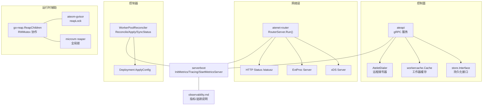
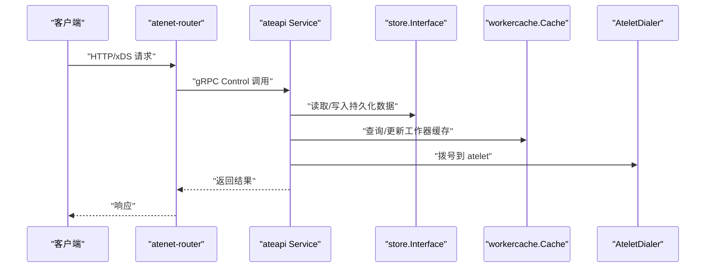
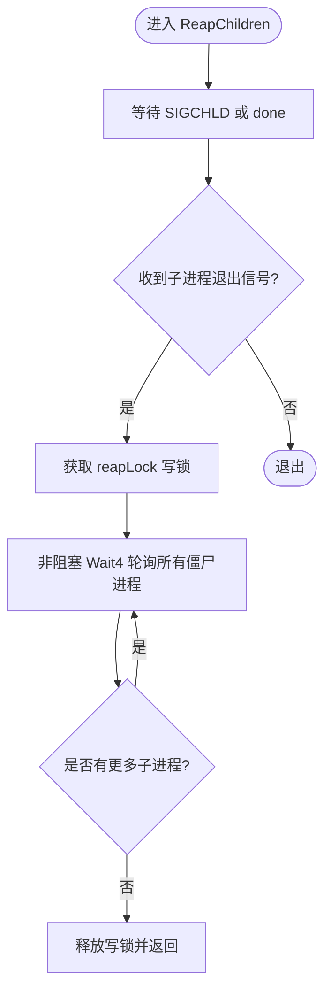
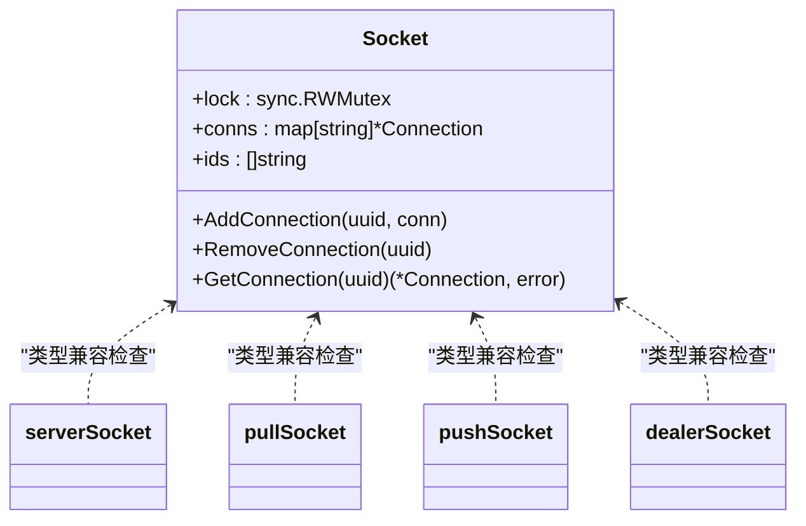
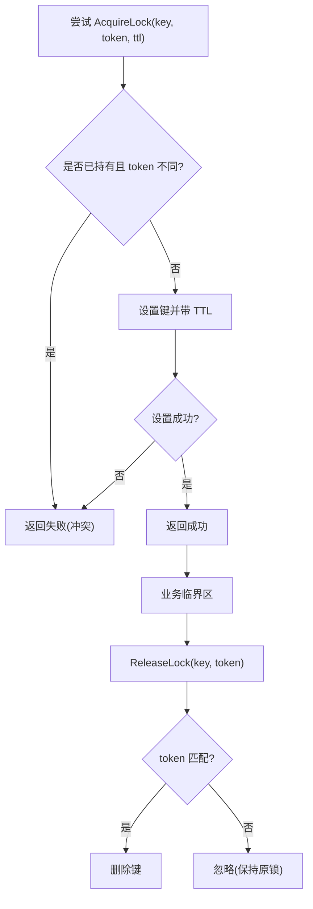
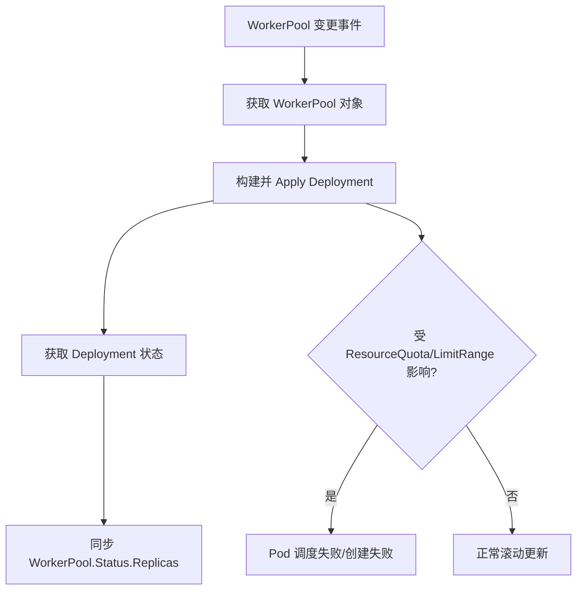
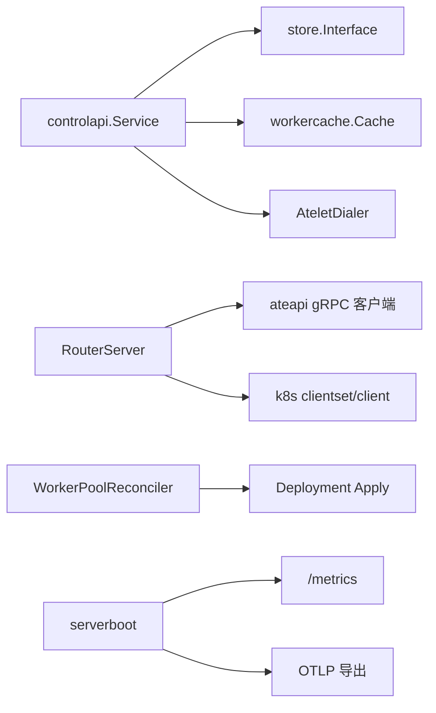

# 资源竞争与死锁排查

<cite>
**本文引用的文件**   
- [cmd/ateapi/internal/controlapi/service.go](file://cmd/ateapi/internal/controlapi/service.go)
- [cmd/atenet/internal/router/router.go](file://cmd/atenet/internal/router/router.go)
- [cmd/atecontroller/internal/controllers/workerpool_controller.go](file://cmd/atecontroller/internal/controllers/workerpool_controller.go)
- [cmd/atecontroller/internal/controllers/workerpool_apply.go](file://cmd/atecontroller/internal/controllers/workerpool_apply.go)
- [internal/serverboot/serverboot.go](file://internal/serverboot/serverboot.go)
- [docs/observability.md](file://docs/observability.md)
- [LICENSES/github.com/hashicorp/go-reap/reap_unix.go](file://LICENSES/github.com/hashicorp/go-reap/reap_unix.go)
- [LICENSES/github.com/hashicorp/go-reap/reap_stub.go](file://LICENSES/github.com/hashicorp/go-reap/reap_stub.go)
- [LICENSES/github.com/myzhan/gomq/socket.go](file://LICENSES/github.com/myzhan/gomq/socket.go)
- [LICENSES/github.com/myzhan/gomq/zmtp/socket.go](file://LICENSES/github.com/myzhan/gomq/zmtp/socket.go)
- [LICENSES/github.com/myzhan/gomq/zmtp/conn.go](file://LICENSES/github.com/myzhan/gomq/zmtp/conn.go)
- [cmd/ateapi/internal/store/ateredis/ateredis_test.go](file://cmd/ateapi/internal/store/ateredis/ateredis_test.go)
- [cmd/ateom-gvisor/main.go](file://cmd/ateom-gvisor/main.go)
- [cmd/ateom-microvm/internal/reaper/reaper.go](file://cmd/ateom-microvm/internal/reaper/reaper.go)
- [vendor/google.golang.org/grpc/balancer/lazy/lazy.go](file://vendor/google.golang.org/grpc/balancer/lazy/lazy.go)
</cite>

## 目录
1. [简介](#简介)
2. [项目结构](#项目结构)
3. [核心组件](#核心组件)
4. [架构总览](#架构总览)
5. [详细组件分析](#详细组件分析)
6. [依赖关系分析](#依赖关系分析)
7. [性能考量](#性能考量)
8. [故障排查指南](#故障排查指南)
9. [结论](#结论)
10. [附录](#附录)

## 简介
本文件聚焦于在 Agent Substrate 项目中定位与解决资源竞争、死锁以及系统级资源问题的方法，覆盖以下主题：
- 使用 Go pprof 检测与分析死锁（goroutine 堆栈、锁等待时间统计）
- Kubernetes 资源配额冲突识别与处理（Pod 调度失败、节点资源不足）
- 数据库连接池耗尽、文件描述符限制等系统级资源问题排查
- 并发编程中的锁优化策略（读写锁、无锁数据结构、原子操作）
- 实际死锁案例分析与问题解决步骤

## 项目结构
本项目由多个服务组成，涉及控制面、网络路由、控制器与运行时辅助进程。与资源竞争和死锁相关的关键位置包括：
- 控制面 gRPC 服务与服务装配
- 路由器启动流程与协程编排
- 控制器对 Deployment 的 Apply 与状态同步
- 子进程回收与 RWMutex 协作
- 分布式锁测试用例（Redis）
- 可观测性基础设施（指标、追踪、日志）

图表来源
- [cmd/ateapi/internal/controlapi/service.go:25-56](file://cmd/ateapi/internal/controlapi/service.go#L25-L56)
- [cmd/atenet/internal/router/router.go:152-315](file://cmd/atenet/internal/router/router.go#L152-L315)
- [cmd/atecontroller/internal/controllers/workerpool_controller.go:47-121](file://cmd/atecontroller/internal/controllers/workerpool_controller.go#L47-L121)
- [internal/serverboot/serverboot.go:121-193](file://internal/serverboot/serverboot.go#L121-L193)
- [docs/observability.md:103-194](file://docs/observability.md#L103-L194)

章节来源
- [cmd/ateapi/internal/controlapi/service.go:25-56](file://cmd/ateapi/internal/controlapi/service.go#L25-L56)
- [cmd/atenet/internal/router/router.go:152-315](file://cmd/atenet/internal/router/router.go#L152-L315)
- [cmd/atecontroller/internal/controllers/workerpool_controller.go:47-121](file://cmd/atecontroller/internal/controllers/workerpool_controller.go#L47-L121)
- [internal/serverboot/serverboot.go:121-193](file://internal/serverboot/serverboot.go#L121-L193)
- [docs/observability.md:103-194](file://docs/observability.md#L103-L194)

## 核心组件
- 控制面服务装配：Service 组合了持久化、缓存、dialer、listers 与工作流对象，作为 gRPC 服务入口。
- 路由器启动：RouterServer.Run 初始化追踪与指标、建立 ateapi 客户端、并行启动 xDS、ExtProc、状态 HTTP 服务，并使用 errgroup 管理生命周期。
- 控制器协调：WorkerPoolReconciler 负责获取 WorkerPool、应用 Deployment、同步状态。
- 可观测性：serverboot 提供统一的日志、指标、追踪初始化与 /metrics、/readyz 暴露。

章节来源
- [cmd/ateapi/internal/controlapi/service.go:25-56](file://cmd/ateapi/internal/controlapi/service.go#L25-L56)
- [cmd/atenet/internal/router/router.go:152-315](file://cmd/atenet/internal/router/router.go#L152-L315)
- [cmd/atecontroller/internal/controllers/workerpool_controller.go:47-121](file://cmd/atecontroller/internal/controllers/workerpool_controller.go#L47-L121)
- [internal/serverboot/serverboot.go:121-193](file://internal/serverboot/serverboot.go#L121-L193)

## 架构总览
下图展示了关键组件间的调用与依赖关系，便于理解资源竞争与死锁可能出现的边界点。

图表来源
- [cmd/atenet/internal/router/router.go:210-218](file://cmd/atenet/internal/router/router.go#L210-L218)
- [cmd/ateapi/internal/controlapi/service.go:25-56](file://cmd/ateapi/internal/controlapi/service.go#L25-L56)

## 详细组件分析

### 组件A：子进程回收与 RWMutex 协作（潜在死锁风险点）
- go-reap 的 ReapChildren 通过信号驱动循环，并在可选 reapLock 上获取写锁以执行 Wait4 轮询，避免与应用侧 exec.Wait 竞争。
- 若上层代码在持有读锁时阻塞等待子进程退出，而回收器需要写锁，则可能出现“读锁持有者等待子进程退出，回收器等待写锁”的死锁场景。
- 微虚拟机实现中也存在全局锁与重捕逻辑，需确保不与其他长持锁路径交叉。

图表来源
- [LICENSES/github.com/hashicorp/go-reap/reap_unix.go:30-96](file://LICENSES/github.com/hashicorp/go-reap/reap_unix.go#L30-L96)
- [LICENSES/github.com/hashicorp/go-reap/reap_stub.go:15-17](file://LICENSES/github.com/hashicorp/go-reap/reap_stub.go#L15-L17)
- [cmd/ateom-gvisor/main.go:57](file://cmd/ateom-gvisor/main.go#L57)
- [cmd/ateom-microvm/internal/reaper/reaper.go:42](file://cmd/ateom-microvm/internal/reaper/reaper.go#L42)

章节来源
- [LICENSES/github.com/hashicorp/go-reap/reap_unix.go:30-96](file://LICENSES/github.com/hashicorp/go-reap/reap_unix.go#L30-L96)
- [LICENSES/github.com/hashicorp/go-reap/reap_stub.go:15-17](file://LICENSES/github.com/hashicorp/go-reap/reap_stub.go#L15-L17)
- [cmd/ateom-gvisor/main.go:57](file://cmd/ateom-gvisor/main.go#L57)
- [cmd/ateom-microvm/internal/reaper/reaper.go:42](file://cmd/ateom-microvm/internal/reaper/reaper.go#L42)

### 组件B：网络与并发（锁与通道）
- gomq Socket 使用 RWMutex 保护连接映射与 ID 列表；RemoveConnection 在写锁下遍历删除并关闭底层连接。
- ZMTP socket 类型检查与命令有效性校验为只读路径，不涉及锁竞争。
- Connection 元数据发送/接收走独立协议帧，注意错误分支与长度溢出防护。

图表来源
- [LICENSES/github.com/myzhan/gomq/socket.go:20-105](file://LICENSES/github.com/myzhan/gomq/socket.go#L20-L105)
- [LICENSES/github.com/myzhan/gomq/zmtp/socket.go:62-118](file://LICENSES/github.com/myzhan/gomq/zmtp/socket.go#L62-L118)
- [LICENSES/github.com/myzhan/gomq/zmtp/conn.go:154-242](file://LICENSES/github.com/myzhan/gomq/zmtp/conn.go#L154-L242)

章节来源
- [LICENSES/github.com/myzhan/gomq/socket.go:20-105](file://LICENSES/github.com/myzhan/gomq/socket.go#L20-L105)
- [LICENSES/github.com/myzhan/gomq/zmtp/socket.go:62-118](file://LICENSES/github.com/myzhan/gomq/zmtp/socket.go#L62-L118)
- [LICENSES/github.com/myzhan/gomq/zmtp/conn.go:154-242](file://LICENSES/github.com/myzhan/gomq/zmtp/conn.go#L154-L242)

### 组件C：分布式锁（Redis）行为验证
- 测试覆盖了正确值释放、冲突拒绝、TTL 过期后重新获取、不可重入等关键路径，有助于定位业务中因锁语义不一致导致的竞争问题。

图表来源
- [cmd/ateapi/internal/store/ateredis/ateredis_test.go:810-975](file://cmd/ateapi/internal/store/ateredis/ateredis_test.go#L810-L975)

章节来源
- [cmd/ateapi/internal/store/ateredis/ateredis_test.go:810-975](file://cmd/ateapi/internal/store/ateredis/ateredis_test.go#L810-L975)

### 组件D：控制器与资源配额
- WorkerPoolReconciler 将模板字段应用到 Deployment，包含 NodeSelector、Tolerations、PriorityClassName、Affinity 与 Resources Requests/Limits。
- 当集群存在 ResourceQuota 或 LimitRange 约束时，Requests/Limits 配置不当会导致 Pod 无法调度或创建失败。

图表来源
- [cmd/atecontroller/internal/controllers/workerpool_controller.go:73-112](file://cmd/atecontroller/internal/controllers/workerpool_controller.go#L73-L112)
- [cmd/atecontroller/internal/controllers/workerpool_apply.go:132-166](file://cmd/atecontroller/internal/controllers/workerpool_apply.go#L132-L166)

章节来源
- [cmd/atecontroller/internal/controllers/workerpool_controller.go:73-112](file://cmd/atecontroller/internal/controllers/workerpool_controller.go#L73-L112)
- [cmd/atecontroller/internal/controllers/workerpool_apply.go:132-166](file://cmd/atecontroller/internal/controllers/workerpool_apply.go#L132-L166)

## 依赖关系分析
- 控制面与服务装配：Service 依赖 store、cache、dialer、listers 与工作流对象，形成高内聚的服务入口。
- 路由器与外部依赖：router 依赖 ateapi gRPC 客户端、Kubernetes 客户端、xDS/ExtProc 服务器与 OTel 中间件。
- 控制器与 K8s 资源：WorkerPoolReconciler 通过 Apply 模式管理 Deployment，并同步状态。
- 可观测性：serverboot 统一注入日志、指标与追踪，router 与 ateapi 均复用该能力。

图表来源
- [cmd/ateapi/internal/controlapi/service.go:25-56](file://cmd/ateapi/internal/controlapi/service.go#L25-L56)
- [cmd/atenet/internal/router/router.go:152-315](file://cmd/atenet/internal/router/router.go#L152-L315)
- [cmd/atecontroller/internal/controllers/workerpool_controller.go:92-112](file://cmd/atecontroller/internal/controllers/workerpool_controller.go#L92-L112)
- [internal/serverboot/serverboot.go:121-193](file://internal/serverboot/serverboot.go#L121-L193)

章节来源
- [cmd/ateapi/internal/controlapi/service.go:25-56](file://cmd/ateapi/internal/controlapi/service.go#L25-L56)
- [cmd/atenet/internal/router/router.go:152-315](file://cmd/atenet/internal/router/router.go#L152-L315)
- [cmd/atecontroller/internal/controllers/workerpool_controller.go:92-112](file://cmd/atecontroller/internal/controllers/workerpool_controller.go#L92-L112)
- [internal/serverboot/serverboot.go:121-193](file://internal/serverboot/serverboot.go#L121-L193)

## 性能考量
- 指标与追踪：通过 serverboot 初始化 Prometheus 与 OTLP 导出，router 与 ateapi 均可采集 rpc.server.call.duration 等指标，用于评估延迟与错误率。
- 路由耗时：atenet.router.route.duration 衡量端到端转发耗时，有助于发现瓶颈链路。
- 快照大小：atelet.snapshot.size 可用于评估 checkpoint 开销与存储压力。

章节来源
- [docs/observability.md:103-194](file://docs/observability.md#L103-L194)
- [internal/serverboot/serverboot.go:121-193](file://internal/serverboot/serverboot.go#L121-L193)

## 故障排查指南

### 使用 Go pprof 诊断死锁与锁竞争
- 启用 pprof 端点：在运行参数中添加 -pprof.addr=:6060，或在代码中注册 net/http/pprof 默认 mux。
- 抓取 goroutine 堆栈：
  - curl http://localhost:6060/debug/pprof/goroutine?debug=2 > goroutine.pprof
  - 使用 go tool pprof -top -nodecount=20 goroutine.pprof 查看阻塞热点
- 抓取锁等待信息：
  - curl http://localhost:6060/debug/pprof/heap > heap.pprof
  - go tool pprof -inuse_objects heap.pprof 观察对象增长
  - 结合 runtime.NumGoroutine 与阻塞函数名定位长时间持锁路径
- 常见症状：
  - goroutine 数异常增长
  - 大量 goroutine 处于 syscall 或互斥锁等待
  - CPU 使用率高但吞吐低

[本节为通用指导，无需特定源码引用]

### Kubernetes 资源配额冲突识别与处理
- 现象：
  - Pod 一直处于 Pending，事件显示超出 ResourceQuota 或 LimitRange
  - 节点资源不足导致调度失败
- 排查步骤：
  - kubectl describe pod <pod-name> 查看 Events
  - kubectl get resourcequota --all-namespaces 与 kubectl describe resourcequota <name>
  - 调整 WorkerPool 模板中的 Resources.Requests/Limits，使其符合配额
  - 检查节点 taint/toleration 与 nodeSelector/affinity 是否过于严格
- 参考实现：
  - WorkerPool 模板字段应用到 Deployment 的资源字段

章节来源
- [cmd/atecontroller/internal/controllers/workerpool_apply.go:132-166](file://cmd/atecontroller/internal/controllers/workerpool_apply.go#L132-L166)

### 数据库连接池耗尽与文件描述符限制
- 数据库连接池耗尽：
  - 监控指标：活跃连接数、等待队列长度、超时次数
  - 排查：确认最大连接数配置、是否存在未释放连接、慢查询导致连接占用过长
  - 缓解：增大连接池上限、增加重试与退避、拆分热点 key
- 文件描述符限制：
  - 检查 ulimit -n 与容器 securityContext 的 fsGroup/runAsUser 权限
  - 监控 fd 使用量，定位打开文件最多的进程
  - 减少不必要的文件句柄（如临时文件、日志轮转配置）

[本节为通用指导，无需特定源码引用]

### 并发编程中的锁优化策略
- 读写锁：适用于读多写少的共享数据结构（如 Socket 的连接表），降低读路径阻塞。
- 无锁数据结构：在高并发计数、队列等场景考虑使用原子操作或无锁队列。
- 原子操作：使用 atomic.Bool/atomic.Uint64 替代粗粒度锁，减少锁竞争。
- 避免嵌套锁与长持锁：尽量缩小临界区，避免在锁内执行 I/O 或远程调用。
- 示例参考：
  - gomq.Socket 使用 RWMutex 保护连接集合
  - 分布式锁测试覆盖冲突、TTL 与不可重入语义

章节来源
- [LICENSES/github.com/myzhan/gomq/socket.go:20-105](file://LICENSES/github.com/myzhan/gomq/socket.go#L20-L105)
- [cmd/ateapi/internal/store/ateredis/ateredis_test.go:810-975](file://cmd/ateapi/internal/store/ateredis/ateredis_test.go#L810-L975)

### 实际死锁案例与解决步骤
- 案例一：子进程回收与 exec.Wait 竞争
  - 现象：主流程持有读锁并调用 exec.Wait 等待子进程退出，同时后台回收器需要写锁进行 Wait4 轮询，出现死锁
  - 解决：确保在调用 exec.Wait 前释放读锁，或使用独立的 wait 通道与回收器解耦
  - 参考实现：go-reap.ReapChildren 使用可选 reapLock 防止与应用程序的 wait 竞争
- 案例二：gRPC 负载均衡器内部调用 ExitIdle 避免死锁
  - 现象：在同一 goroutine 中调用可能导致内部锁顺序不一致
  - 解决：在新 goroutine 中调用 ExitIdle，避免与当前上下文锁顺序冲突
  - 参考实现：vendor/google.golang.org/grpc/balancer/lazy/lazy.go 注释提示

章节来源
- [LICENSES/github.com/hashicorp/go-reap/reap_unix.go:30-96](file://LICENSES/github.com/hashicorp/go-reap/reap_unix.go#L30-L96)
- [vendor/google.golang.org/grpc/balancer/lazy/lazy.go:62](file://vendor/google.golang.org/grpc/balancer/lazy/lazy.go#L62)

## 结论
- 通过合理的锁设计与可观测性建设，可有效降低资源竞争与死锁风险。
- 在 Kubernetes 环境中，应关注资源配额与调度策略，避免因配置不当导致 Pod 无法调度。
- 使用 pprof 与指标/追踪体系，能快速定位热点与瓶颈，配合分布式锁测试用例保障并发正确性。

## 附录
- 可观测性实践：
  - 使用 serverboot 统一初始化日志、指标与追踪
  - 通过 observability.md 了解指标与追踪的采集与展示方式

章节来源
- [internal/serverboot/serverboot.go:121-193](file://internal/serverboot/serverboot.go#L121-L193)
- [docs/observability.md:103-194](file://docs/observability.md#L103-L194)
