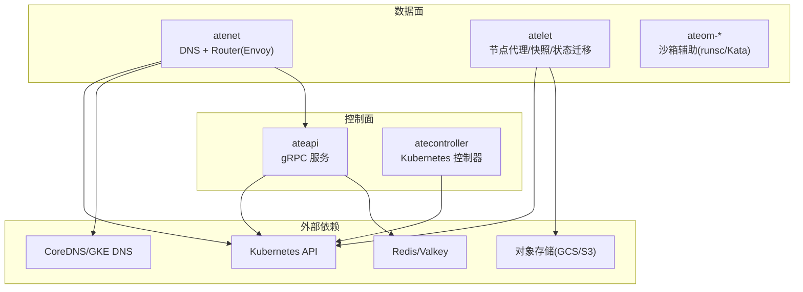
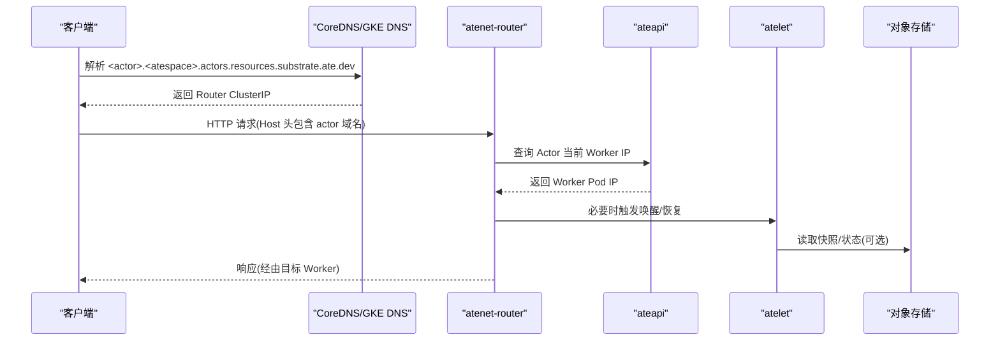
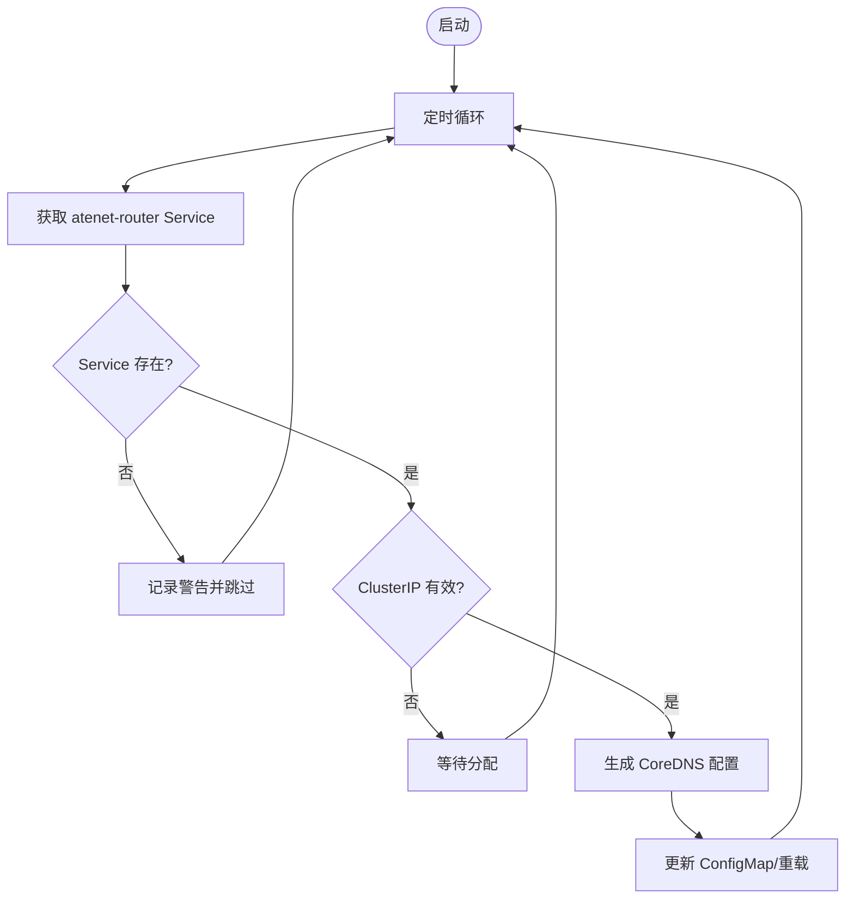
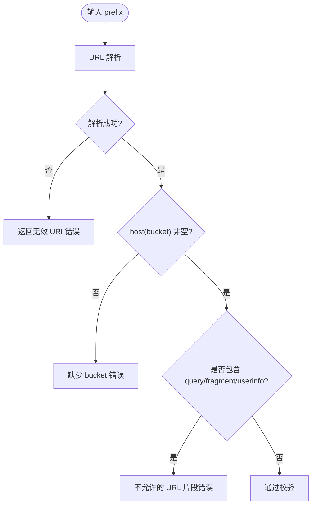
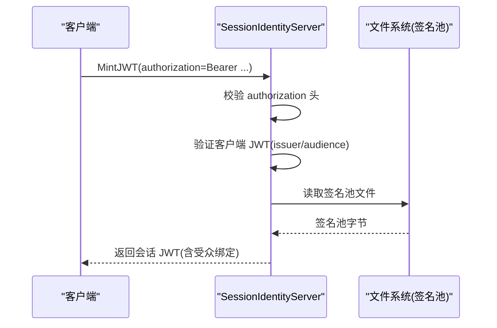
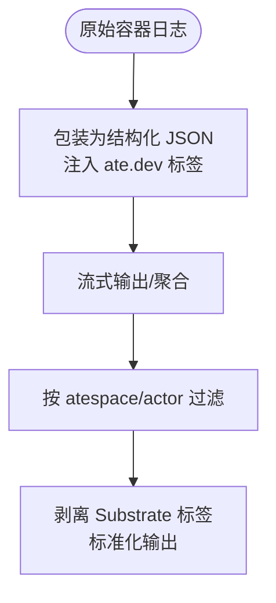
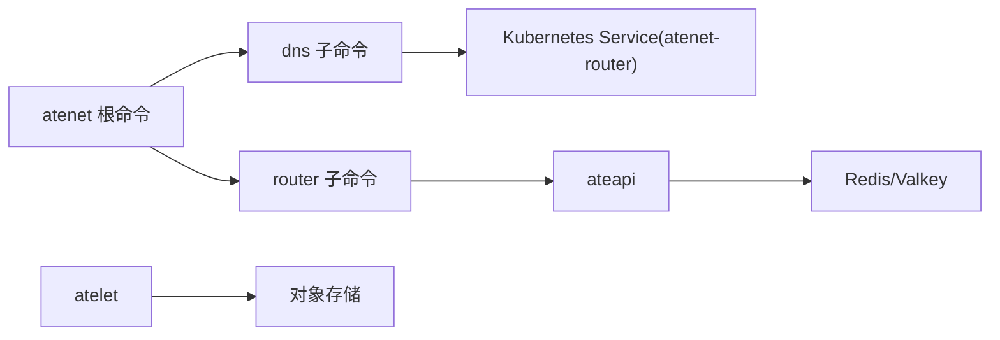

# 故障排除

<cite>
**本文引用的文件**   
- [README.md](file://README.md)
- [observability.md](file://docs/observability.md)
- [run-e2e.sh](file://hack/run-e2e.sh)
- [install-ate-kind.sh](file://hack/install-ate-kind.sh)
- [dns.go](file://cmd/atenet/internal/dns/dns.go)
- [corefile.go](file://cmd/atenet/internal/dns/corefile.go)
- [root.go](file://cmd/atenet/internal/root.go)
- [validate.go](file://internal/resources/validate.go)
- [ateerrors_test.go](file://internal/ateerrors/ateerrors_test.go)
- [sessionidentity.go](file://cmd/ateapi/internal/sessionidentity/sessionidentity.go)
- [logger_test.go](file://internal/actorlog/logger_test.go)
- [logs_actors_test.go](file://cmd/kubectl-ate/internal/cmd/logs_actors_test.go)
- [dashboard.html](file://cmd/atenet/internal/router/dashboard.html)
- [threat-model.md](file://docs/threat-model.md)
</cite>

## 目录
1. [简介](#简介)
2. [项目结构](#项目结构)
3. [核心组件](#核心组件)
4. [架构总览](#架构总览)
5. [详细组件分析](#详细组件分析)
6. [依赖关系分析](#依赖关系分析)
7. [性能考虑](#性能考虑)
8. [故障排除指南](#故障排除指南)
9. [结论](#结论)
10. [附录](#附录)

## 简介
本指南面向使用 Agent Substrate 的运维与开发者，聚焦于安装失败、启动错误、网络连接问题、存储访问异常、日志与可观测性分析、性能瓶颈定位、网络与安全排查、以及 E2E 测试执行与调试等常见问题的系统化诊断方法与解决方案。文档同时提供可视化图示，帮助快速理解系统交互与关键路径。

## 项目结构
Agent Substrate 由多个子系统组成：控制面 API（ateapi）、节点代理（atelet）、控制器（atecontroller）、网络与 DNS（atenet）、沙箱运行时辅助（ateom-*）、CLI（kubectl-ate）以及 GCP 工具（tools/setup-gcp）。安装与运行脚本位于 hack 目录，可观测性与最佳实践在 docs 中说明。

图表来源
- [README.md:215-224](file://README.md#L215-L224)
- [observability.md:105-133](file://docs/observability.md#L105-L133)

章节来源
- [README.md:215-224](file://README.md#L215-L224)
- [observability.md:105-133](file://docs/observability.md#L105-L133)

## 核心组件
- ateapi：暴露 gRPC 接口管理 Actor/Worker 生命周期，持久化到 Redis，支持会话身份签发。
- atenet：集成 DNS 控制器与 Envoy 路由，负责将 actor 域名解析到路由器 ClusterIP，并转发请求至目标 Worker。
- atelet：节点级守护进程，协调快照创建/恢复、状态迁移、与对象存储交互。
- atecroller：基于 CRD 的控制器，协调 WorkerPool/ActorTemplate 资源。
- CLI kubectl-ate：提供 logs、create、get、pause/resume 等操作入口。
- 可观测性：结构化日志、OpenTelemetry 指标与分布式追踪，本地 Kind 环境自动部署 Prometheus/Jaeger。

章节来源
- [README.md:215-224](file://README.md#L215-L224)
- [observability.md:105-133](file://docs/observability.md#L105-L133)

## 架构总览
下图展示了典型请求从客户端经 atenet-router 到目标 Actor 的路径，以及 DNS 解析与控制器协调过程。

图表来源
- [dns.go:71-88](file://cmd/atenet/internal/dns/dns.go#L71-L88)
- [observability.md:105-133](file://docs/observability.md#L105-L133)

## 详细组件分析

### DNS 控制器与 CoreDNS 配置
- DNS 控制器周期性拉取 atenet-router Service 的 ClusterIP，生成 CoreDNS 模板配置并写入 ConfigMap，驱动 CoreDNS 将特定子域解析到路由器地址。
- 若 Service 不存在或尚未分配 ClusterIP，控制器会跳过并等待。

图表来源
- [dns.go:50-88](file://cmd/atenet/internal/dns/dns.go#L50-L88)
- [corefile.go:32-40](file://cmd/atenet/internal/dns/corefile.go#L32-L40)

章节来源
- [dns.go:50-88](file://cmd/atenet/internal/dns/dns.go#L50-L88)
- [corefile.go:32-40](file://cmd/atenet/internal/dns/corefile.go#L32-L40)

### 存储与快照校验
- 快照 URI 前缀在进入 RPC 边界时进行严格校验，要求为合法 URI 且必须包含 bucket，禁止 query/fragment/userinfo 等可能吞掉后续对象名的 URL 片段，避免上传/下载被重定向到不同对象。

图表来源
- [validate.go:150-174](file://internal/resources/validate.go#L150-L174)

章节来源
- [validate.go:150-174](file://internal/resources/validate.go#L150-L174)

### 认证与会话身份
- 会话身份服务在 MintJWT 流程中验证客户端 JWT，读取签名池文件，签发带受众绑定的会话令牌；未携带授权头或验证失败将返回未认证错误。

图表来源
- [sessionidentity.go:71-126](file://cmd/ateapi/internal/sessionidentity/sessionidentity.go#L71-L126)

章节来源
- [sessionidentity.go:71-126](file://cmd/ateapi/internal/sessionidentity/sessionidentity.go#L71-L126)

### 日志格式与过滤
- 容器输出会被包装为结构化 JSON，注入 ate.dev 元数据标签；CLI 在输出时会剥离这些标签以匹配标准 kubectl logs 行为。
- 过滤器支持按 atespace/actor 名称匹配，兼容多种时间戳字段与 labels 键名。

图表来源
- [logger_test.go:25-46](file://internal/actorlog/logger_test.go#L25-L46)
- [logs_actors_test.go:34-97](file://cmd/kubectl-ate/internal/cmd/logs_actors_test.go#L34-L97)

章节来源
- [logger_test.go:25-46](file://internal/actorlog/logger_test.go#L25-L46)
- [logs_actors_test.go:34-97](file://cmd/kubectl-ate/internal/cmd/logs_actors_test.go#L34-L97)

### 错误分类与原因标记
- 错误体系支持“原因”标记，便于上层根据领域语义判断失败类型；gRPC 错误可携带 Reason，调用方可用 errors.Is/As 进行匹配。

章节来源
- [ateerrors_test.go:160-178](file://internal/ateerrors/ateerrors_test.go#L160-L178)
- [ateerrors_test.go:231-255](file://internal/ateerrors/ateerrors_test.go#L231-L255)

## 依赖关系分析
- DNS 控制器依赖 Kubernetes Service 信息；Router 依赖 API 查询 Actor 位置；atelet 依赖对象存储进行快照读写；ateapi 依赖 Redis 做持久化。
- 根命令 atenet 组合了 router 与 dns 子命令，统一入口。

图表来源
- [root.go:25-42](file://cmd/atenet/internal/root.go#L25-L42)
- [dns.go:71-88](file://cmd/atenet/internal/dns/dns.go#L71-L88)

章节来源
- [root.go:25-42](file://cmd/atenet/internal/root.go#L25-L42)
- [dns.go:71-88](file://cmd/atenet/internal/dns/dns.go#L71-L88)

## 性能考虑
- 激活延迟：从唤醒事件到可接收流量的时间，目标 P95 约 100ms。
- 吞吐与规模：单集群唤醒事件处理目标约 1000/s，总体规模目标极高。
- 指标与追踪：系统通过 OpenTelemetry 上报 gRPC 延迟、路由耗时、快照大小等指标；Kind 环境内置 Prometheus/Jaeger 便于本地观察。

章节来源
- [observability.md:105-133](file://docs/observability.md#L105-L133)
- [observability.md:142-155](file://docs/architecture.md#L142-L155)

## 故障排除指南

### 安装失败
- 现象
  - 安装脚本报错、镜像无法推送、CRD 未就绪、组件 Pod 处于 Pending/CrashLoopBackOff。
- 诊断步骤
  - 检查环境变量与平台参数是否正确设置（如 KO_DOCKER_REPO、GOARCH、ATE_INSTALL_KIND、BUCKET_NAME）。
  - 确认 Kind 集群与本地注册表可用，镜像构建目标平台与主机一致。
  - 查看各组件 Pod 事件与日志，关注 RBAC、StorageClass、Ingress/DNS 相关错误。
- 解决建议
  - 修正环境变量后重试安装；确保本地 registry 可达；清理残留资源后重新部署。
  - 若使用 GKE，先完成 bootstrap 与 IAM 绑定，再执行安装。

章节来源
- [install-ate-kind.sh:17-38](file://hack/install-ate-kind.sh#L17-L38)
- [README.md:97-175](file://README.md#L97-L175)

### 启动错误
- 现象
  - atenet/ateapi/atelet 启动后立即退出或健康检查失败。
- 诊断步骤
  - 查看组件日志，关注初始化阶段错误（如配置文件加载、证书/密钥缺失、依赖服务不可达）。
  - 对 atenet，检查 DNS 控制器是否能获取 atenet-router Service 的 ClusterIP。
- 解决建议
  - 补齐缺失配置与凭据；确保依赖服务（Kubernetes API、Redis、对象存储）可达；修复 DNS 控制器等待逻辑中的 Service 状态。

章节来源
- [dns.go:50-88](file://cmd/atenet/internal/dns/dns.go#L50-L88)

### 网络连接问题
- 现象
  - 无法解析 actor 域名、请求超时、路由到错误的 Worker。
- 诊断步骤
  - 验证 DNS 控制器是否已生成正确的 CoreDNS 配置并生效。
  - 检查 atenet-router Service 是否存在且分配了 ClusterIP。
  - 通过浏览器或 curl 访问 atenet-router 的 Dashboard 页面，查看路由状态与最近请求。
- 解决建议
  - 若 Service 未就绪，等待其分配 ClusterIP；若 CoreDNS 配置未更新，检查控制器日志并重载配置。
  - 核对 Host 头与域名模式是否符合预期。

章节来源
- [dns.go:71-88](file://cmd/atenet/internal/dns/dns.go#L71-L88)
- [corefile.go:32-40](file://cmd/atenet/internal/dns/corefile.go#L32-L40)
- [dashboard.html:140-197](file://cmd/atenet/internal/router/dashboard.html#L140-L197)

### 存储访问异常
- 现象
  - 快照创建/恢复失败、对象存储连接错误、URI 不合法。
- 诊断步骤
  - 校验快照 URI 前缀是否符合规范（必须包含 bucket，且不含 query/fragment/userinfo）。
  - 检查对象存储凭据与网络连通性，确认桶权限正确。
- 解决建议
  - 修正 URI 前缀；调整存储后端策略与权限；在 RPC 边界尽早失败以避免深层调用失败。

章节来源
- [validate.go:150-174](file://internal/resources/validate.go#L150-L174)

### 认证与权限问题
- 现象
  - 会话身份签发失败、Unauthenticated 错误、证书/密钥读取失败。
- 诊断步骤
  - 检查客户端是否携带有效的 authorization 头与 JWT；验证 issuer/audience 配置。
  - 确认签名池文件可读且内容有效。
- 解决建议
  - 修正客户端认证头；更新签名池文件；确保服务端证书与 CA 配置正确。

章节来源
- [sessionidentity.go:71-126](file://cmd/ateapi/internal/sessionidentity/sessionidentity.go#L71-L126)

### 日志分析与定位
- 方法
  - 使用 kubectl-ate logs actors 查看活跃 Actor 的实时日志；结合结构化 JSON 与 ate.dev 标签进行多维度检索。
  - 在集中式日志系统中按 actor_name、atespace、template 维度聚合，跨 Worker 迁移保持连续性。
- 常见问题
  - 非活跃 Actor 无法直接拉取日志；需等待其调度到 Worker 或使用历史日志后端。
  - 日志字段差异（RFC3339Nano vs RFC3339、labels 键名）已被兼容处理。

章节来源
- [observability.md:21-101](file://docs/observability.md#L21-L101)
- [logs_actors_test.go:34-97](file://cmd/kubectl-ate/internal/cmd/logs_actors_test.go#L34-L97)

### 性能问题排查
- CPU 占用过高
  - 检查 gRPC 服务器延迟直方图与路由耗时指标；定位热点方法与长尾请求。
- 内存泄漏
  - 结合 Jaeger 追踪与 Prometheus 指标，识别长时间运行的 Span 与未释放资源。
- 网络延迟
  - 对比 atenet.router.route.duration 与端到端延迟，区分网关层与 Actor 计算开销。
- 磁盘 IO 瓶颈
  - 关注 atelet.snapshot.size 指标，评估快照大小与 I/O 压力；优化快照范围与压缩策略。

章节来源
- [observability.md:105-133](file://docs/observability.md#L105-L133)

### 网络问题诊断工具与方法
- DNS 解析
  - 验证 CoreDNS 模板规则与 atenet-router Service ClusterIP 一致性。
- 路由配置
  - 使用 atenet-router Dashboard 查看路由状态与最近请求详情。
- 防火墙与负载均衡
  - 参考威胁模型建议，默认拒绝未授权流量，限制内部网络访问范围，启用 mTLS。

章节来源
- [dns.go:71-88](file://cmd/atenet/internal/dns/dns.go#L71-L88)
- [dashboard.html:140-197](file://cmd/atenet/internal/router/dashboard.html#L140-L197)
- [threat-model.md:72-91](file://docs/threat-model.md#L72-L91)

### 安全检测与防护
- 认证失败
  - 检查客户端 JWT 与签发者/受众配置；确保签名池文件有效。
- 权限不足
  - 遵循最小权限原则，限制对象存储桶访问与控制面组件通信范围。
- 证书过期
  - 定期轮换证书与 CA 池，监控到期时间并在告警中提示。

章节来源
- [sessionidentity.go:71-126](file://cmd/ateapi/internal/sessionidentity/sessionidentity.go#L71-L126)
- [threat-model.md:72-91](file://docs/threat-model.md#L72-L91)

### E2E 测试执行与调试
- 执行方式
  - 使用 run-e2e.sh 指定测试路径与 Go 测试标志；可通过 -args 传递 e2e 框架参数（如 kube-context）。
- 调试技巧
  - 结合 observability 文档中的指标与追踪，定位端到端链路问题；在 Kind 环境中使用 Prometheus/Jaeger 可视化。
- 常见问题
  - 上下文不正确导致无法连接集群；缺少必要依赖（如本地 registry）导致镜像拉取失败。

章节来源
- [run-e2e.sh:17-108](file://hack/run-e2e.sh#L17-L108)
- [observability.md:115-166](file://docs/observability.md#L115-L166)

## 结论
通过系统化的日志与指标分析、严格的存储与认证校验、以及完善的 DNS/路由编排，Agent Substrate 提供了高可扩展与低延迟的 Agent 工作负载管理能力。本指南覆盖了从安装到运行、从网络到存储、从性能到安全的全面故障排除方法，配合可视化图示与具体源码路径，帮助快速定位与解决问题。

## 附录
- 术语与概念参见项目 README 与文档。
- 更多最佳实践与开发指引请参考 docs 与 benchmarking 目录。
