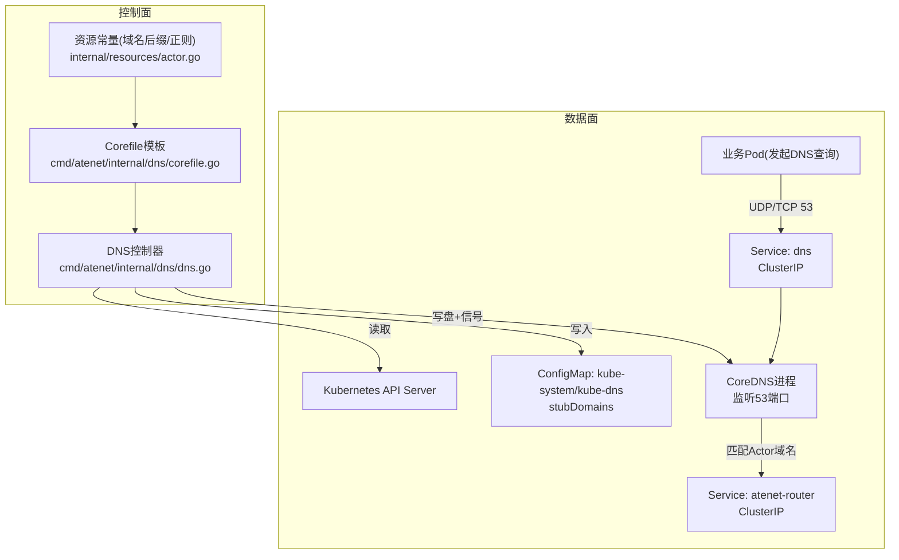
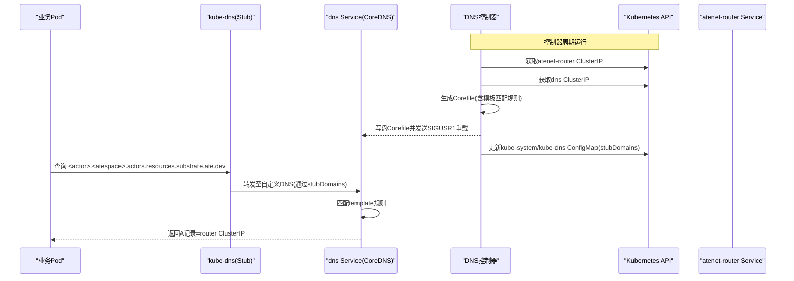
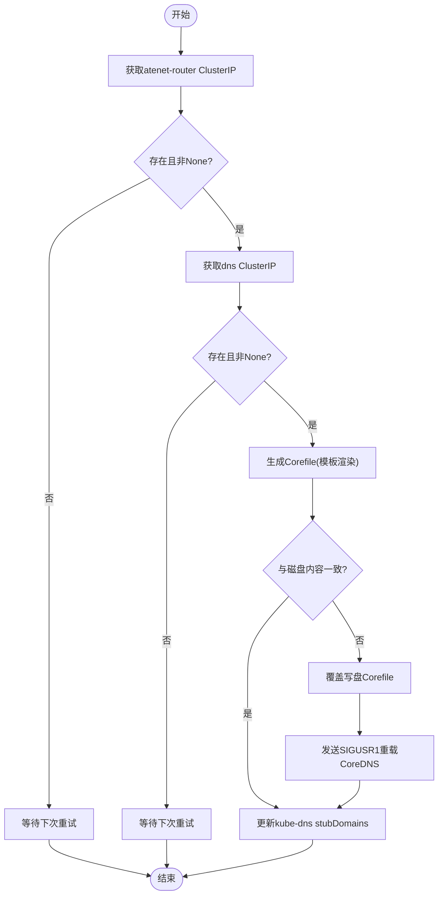
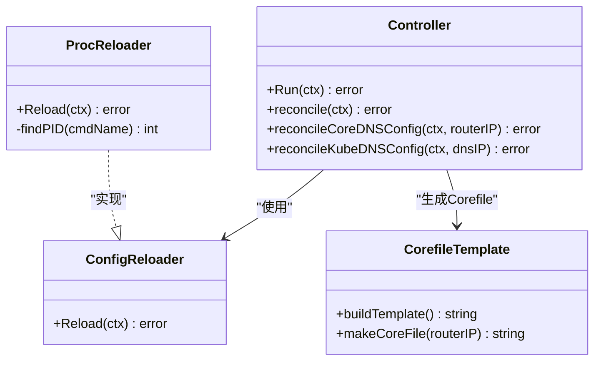
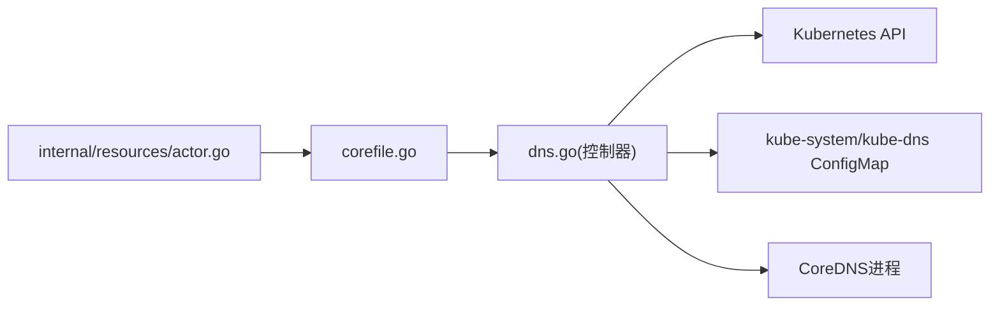

# DNS解析问题诊断

<cite>
**本文引用的文件列表**
- [cmd/atenet/internal/dns/dns.go](file://cmd/atenet/internal/dns/dns.go)
- [cmd/atenet/internal/dns/corefile.go](file://cmd/atenet/internal/dns/corefile.go)
- [cmd/atenet/internal/dns/dns_test.go](file://cmd/atenet/internal/dns/dns_test.go)
- [internal/resources/actor.go](file://internal/resources/actor.go)
- [manifests/ate-install/atenet-dns.yaml](file://manifests/ate-install/atenet-dns.yaml)
- [cmd/atenet/README.md](file://cmd/atenet/README.md)
- [docs/threat-model.md](file://docs/threat-model.md)
</cite>

## 目录
1. [简介](#简介)
2. [项目结构](#项目结构)
3. [核心组件](#核心组件)
4. [架构总览](#架构总览)
5. [详细组件分析](#详细组件分析)
6. [依赖关系分析](#依赖关系分析)
7. [性能与可用性考量](#性能与可用性考量)
8. [故障排查指南](#故障排查指南)
9. [结论](#结论)
10. [附录：常用DNS测试命令与步骤](#附录常用dns测试命令与步骤)

## 简介
本指南聚焦于在基于Kubernetes的集群中，针对Actor域名解析问题的端到端诊断方法。内容涵盖CoreDNS配置生成与动态重载、kube-dns的stubDomains注入、DNS服务发现流程（获取atenet-router与dns服务的ClusterIP）、以及常见错误场景的定位与修复建议。文档同时提供可操作的验证步骤与排障清单，帮助快速定位并解决DNS解析异常。

## 项目结构
与DNS相关的关键代码位于atenet子系统中，主要包含：
- DNS控制器：负责周期性拉取Service信息、生成CoreDNS Corefile、更新kube-dns的stubDomains、并向CoreDNS进程发送重载信号。
- Corefile模板：根据Actor域名后缀与命名规范，构建匹配规则与回答地址。
- 资源常量：定义Actor域名后缀与名称正则模式。
- 部署清单：定义CoreDNS容器、共享卷挂载、健康检查等。

图示来源
- [cmd/atenet/internal/dns/dns.go:50-117](file://cmd/atenet/internal/dns/dns.go#L50-L117)
- [cmd/atenet/internal/dns/corefile.go:32-64](file://cmd/atenet/internal/dns/corefile.go#L32-L64)
- [internal/resources/actor.go:22-27](file://internal/resources/actor.go#L22-L27)
- [manifests/ate-install/atenet-dns.yaml:113-131](file://manifests/ate-install/atenet-dns.yaml#L113-L131)

章节来源
- [cmd/atenet/README.md:1-42](file://cmd/atenet/README.md#L1-L42)
- [docs/threat-model.md:44](file://docs/threat-model.md#L44)

## 核心组件
- DNS控制器
  - 周期任务：定时执行reconcile，确保本地Corefile与kube-dns stubDomains与实际集群状态一致。
  - 关键职责：
    - 获取atenet-router与dns服务的ClusterIP。
    - 生成并落盘Corefile到共享卷。
    - 向CoreDNS进程发送重载信号以热加载配置。
    - 更新kube-system/kube-dns ConfigMap中的stubDomains，将自定义DNS后缀指向dns服务的ClusterIP。
- Corefile模板
  - 使用Actor域名后缀与命名正则，构造template指令匹配规则，返回router服务的ClusterIP作为A记录答案。
- 资源常量
  - ActorDNSSuffix：Actor域名的公共后缀。
  - ResourceNameRegexPattern：用于校验actor name与atespace的DNS-1123标签正则。

章节来源
- [cmd/atenet/internal/dns/dns.go:42-117](file://cmd/atenet/internal/dns/dns.go#L42-L117)
- [cmd/atenet/internal/dns/corefile.go:32-64](file://cmd/atenet/internal/dns/corefile.go#L32-L64)
- [internal/resources/actor.go:22-27](file://internal/resources/actor.go#L22-L27)

## 架构总览
下图展示了DNS解析从Pod侧到CoreDNS再到路由器的完整链路，以及控制器对配置的维护过程。

图示来源
- [cmd/atenet/internal/dns/dns.go:71-117](file://cmd/atenet/internal/dns/dns.go#L71-L117)
- [cmd/atenet/internal/dns/corefile.go:42-50](file://cmd/atenet/internal/dns/corefile.go#L42-L50)
- [manifests/ate-install/atenet-dns.yaml:113-131](file://manifests/ate-install/atenet-dns.yaml#L113-L131)

## 详细组件分析

### DNS控制器工作流
- 启动与调度
  - 控制器启动后按固定间隔触发reconcile循环。
- reconcile流程
  - 获取atenet-router服务ClusterIP；若不存在或为None则等待。
  - 获取dns服务ClusterIP；若不存在或为None则等待。
  - 生成期望的Corefile并与磁盘当前内容对比，差异则覆盖写盘。
  - 调用重载器向CoreDNS进程发送SIGUSR1，触发热加载。
  - 更新kube-system/kube-dns ConfigMap的stubDomains，将Actor域名后缀映射到dns服务的ClusterIP。
- 健壮性
  - 当kube-dns ConfigMap不存在时，跳过stubDomains更新而不报错。
  - 当任一Service未就绪时，跳过本轮并重试。

图示来源
- [cmd/atenet/internal/dns/dns.go:71-117](file://cmd/atenet/internal/dns/dns.go#L71-L117)
- [cmd/atenet/internal/dns/dns.go:119-141](file://cmd/atenet/internal/dns/dns.go#L119-L141)
- [cmd/atenet/internal/dns/dns.go:143-189](file://cmd/atenet/internal/dns/dns.go#L143-L189)

章节来源
- [cmd/atenet/internal/dns/dns.go:50-117](file://cmd/atenet/internal/dns/dns.go#L50-L117)
- [cmd/atenet/internal/dns/dns.go:119-189](file://cmd/atenet/internal/dns/dns.go#L119-L189)
- [cmd/atenet/internal/dns/dns_test.go:42-146](file://cmd/atenet/internal/dns/dns_test.go#L42-L146)

### Corefile模板与动态更新
- 模板构成
  - 启用插件：log、errors、health(:8080)、ready(:8181)、reload。
  - 使用template IN A指令，匹配形如<actor>.<atespace>.<ActorDNSSuffix>的FQDN。
  - 回答内容为router服务的ClusterIP。
- 动态更新机制
  - 控制器比较期望Corefile与磁盘实际内容，不一致则覆盖写盘。
  - 通过查找coredns进程PID并发送SIGUSR1，实现热重载。
- 部署挂载
  - CoreDNS容器通过共享卷挂载/etc/coredns/Corefile，控制器在同一路径写盘。

图示来源
- [cmd/atenet/internal/dns/dns.go:191-221](file://cmd/atenet/internal/dns/dns.go#L191-L221)
- [cmd/atenet/internal/dns/corefile.go:32-64](file://cmd/atenet/internal/dns/corefile.go#L32-L64)

章节来源
- [cmd/atenet/internal/dns/corefile.go:32-64](file://cmd/atenet/internal/dns/corefile.go#L32-L64)
- [cmd/atenet/internal/dns/dns.go:191-221](file://cmd/atenet/internal/dns/dns.go#L191-L221)
- [manifests/ate-install/atenet-dns.yaml:93-131](file://manifests/ate-install/atenet-dns.yaml#L93-L131)

### kube-dns的stubDomains与自定义DNS后缀
- 目标
  - 使传统Kubernetes Pod能够解析Actor域名，需将自定义DNS后缀（actors.resources.substrate.ate.dev）的解析请求转发到Substrate的dns服务。
- 实现
  - 控制器读取kube-system/kube-dns ConfigMap的stubDomains字段，保持其他条目不变，仅更新Actor域名后缀对应的IP列表为dns服务的ClusterIP。
  - 若ConfigMap不存在，跳过更新以避免阻塞。
- 影响范围
  - 所有使用该集群DNS的Pod均可通过标准FQDN访问Actor。

章节来源
- [cmd/atenet/internal/dns/dns.go:143-189](file://cmd/atenet/internal/dns/dns.go#L143-L189)
- [internal/resources/actor.go:22-27](file://internal/resources/actor.go#L22-L27)
- [cmd/atenet/internal/dns/dns_test.go:124-146](file://cmd/atenet/internal/dns/dns_test.go#L124-L146)

### DNS服务发现流程
- atenet-router服务ClusterIP获取
  - 控制器从Kubernetes API获取ate-system/atenet-router的ClusterIP，为空或None时等待。
- dns服务可用性检查
  - 控制器同样获取ate-system/dns的ClusterIP，为空或None时等待。
- 结果
  - 两者均就绪后，才会进行Corefile更新与kube-dns stubDomains同步。

章节来源
- [cmd/atenet/internal/dns/dns.go:71-117](file://cmd/atenet/internal/dns/dns.go#L71-L117)

## 依赖关系分析
- 组件耦合
  - DNS控制器强依赖Kubernetes API（Service、ConfigMap）。
  - Corefile模板依赖资源常量（ActorDNSSuffix、ResourceNameRegexPattern）。
  - 重载器依赖宿主机/容器的/proc能力以查找coredns进程PID。
- 外部集成点
  - kube-dns：通过ConfigMap的stubDomains字段完成域名转发。
  - CoreDNS：通过热重载机制应用新Corefile。

图示来源
- [internal/resources/actor.go:22-27](file://internal/resources/actor.go#L22-L27)
- [cmd/atenet/internal/dns/corefile.go:32-64](file://cmd/atenet/internal/dns/corefile.go#L32-L64)
- [cmd/atenet/internal/dns/dns.go:71-117](file://cmd/atenet/internal/dns/dns.go#L71-L117)

章节来源
- [cmd/atenet/internal/dns/dns.go:71-117](file://cmd/atenet/internal/dns/dns.go#L71-L117)
- [cmd/atenet/internal/dns/corefile.go:32-64](file://cmd/atenet/internal/dns/corefile.go#L32-L64)
- [internal/resources/actor.go:22-27](file://internal/resources/actor.go#L22-L27)

## 性能与可用性考量
- 控制器轮询间隔
  - 通过Interval参数控制reconcile频率，避免频繁API调用与写盘。
- Corefile写盘策略
  - 仅在内容与期望不一致时覆盖写盘，减少不必要的I/O与重载。
- CoreDNS热重载
  - 使用SIGUSR1触发热重载，无需重启进程，降低抖动。
- kube-dns同步
  - 增量更新stubDomains，保留其他条目，避免全量覆盖带来的风险。

[本节为通用指导，不直接分析具体文件]

## 故障排查指南
- 现象：Pod无法解析Actor域名
  - 检查项：
    - atenet-router与dns服务是否已分配ClusterIP。
    - kube-system/kube-dns ConfigMap是否存在且包含正确的stubDomains。
    - CoreDNS进程是否成功热重载最新Corefile。
- 现象：解析超时或失败
  - 检查项：
    - CoreDNS健康探针(/health)与就绪探针(/ready)是否正常。
    - 网络策略是否允许Pod到dns服务的UDP/TCP 53流量。
    - 权限问题：DNS控制器是否具备读取ate-system与kube-system资源的RBAC。
- 现象：旧缓存导致解析仍指向旧IP
  - 处理：
    - 确认控制器已发送SIGUSR1并成功重载。
    - 必要时重启CoreDNS容器或清理系统级DNS缓存（取决于宿主环境）。
- 现象：kube-dns ConfigMap缺失
  - 行为：控制器会跳过stubDomains更新，不影响Corefile更新与CoreDNS热重载。
  - 建议：在GKE环境中确保kube-dns ConfigMap存在并按需补充stubDomains。

章节来源
- [cmd/atenet/internal/dns/dns.go:71-117](file://cmd/atenet/internal/dns/dns.go#L71-L117)
- [cmd/atenet/internal/dns/dns.go:143-189](file://cmd/atenet/internal/dns/dns.go#L143-L189)
- [manifests/ate-install/atenet-dns.yaml:127-131](file://manifests/ate-install/atenet-dns.yaml#L127-L131)
- [docs/threat-model.md:44](file://docs/threat-model.md#L44)

## 结论
本指南围绕DNS控制器、Corefile模板、kube-dns stubDomains与CoreDNS热重载机制，提供了完整的DNS解析问题诊断思路。通过逐项核对Service就绪状态、Corefile一致性、kube-dns配置与网络策略，可以快速定位并修复大多数DNS解析异常。建议在变更前后结合附录中的测试命令进行验证，确保解析链路稳定可靠。

[本节为总结性内容，不直接分析具体文件]

## 附录：常用DNS测试命令与步骤
- 基本工具
  - dig：用于查询指定域名的A记录，观察返回的IP是否为router服务的ClusterIP。
  - nslookup：交互式或非交互式查询，便于快速验证解析结果。
  - host：轻量级查询工具，适合脚本化验证。
- 推荐步骤
  - 在业务Pod内执行上述工具，查询形如<actor>.<atespace>.actors.resources.substrate.ate.dev的FQDN。
  - 若返回结果为空或错误，逐步检查：
    - kube-dns的stubDomains是否正确指向dns服务的ClusterIP。
    - CoreDNS是否热重载了最新的Corefile。
    - 网络策略是否放行UDP/TCP 53。
- 参考说明
  - 项目文档中对DNS与路由器部署有简要说明，可作为整体理解背景。

章节来源
- [cmd/atenet/README.md:1-42](file://cmd/atenet/README.md#L1-L42)
