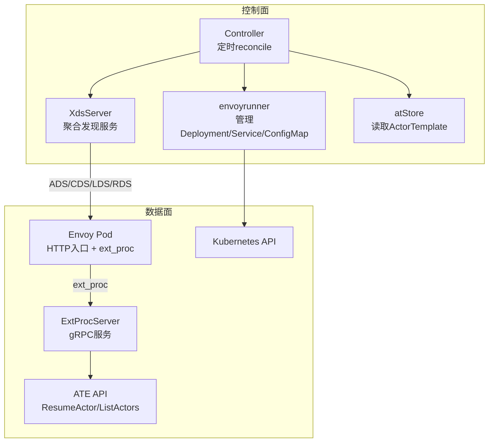
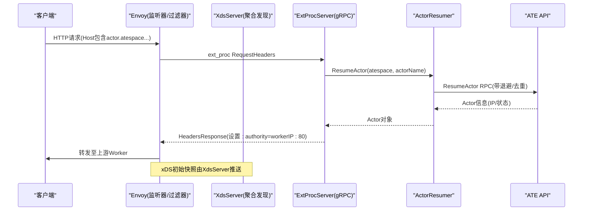
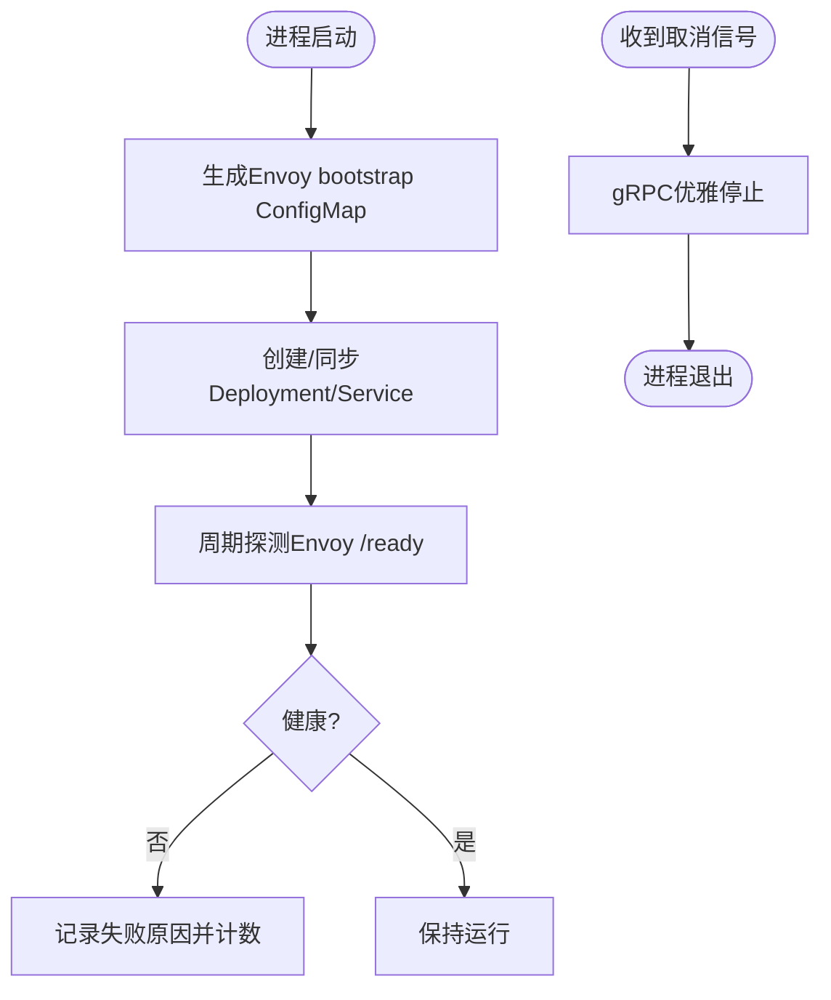
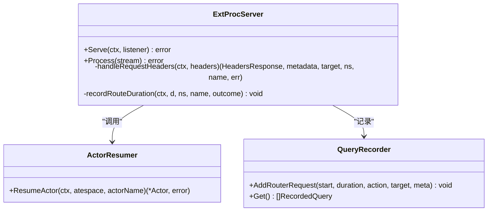
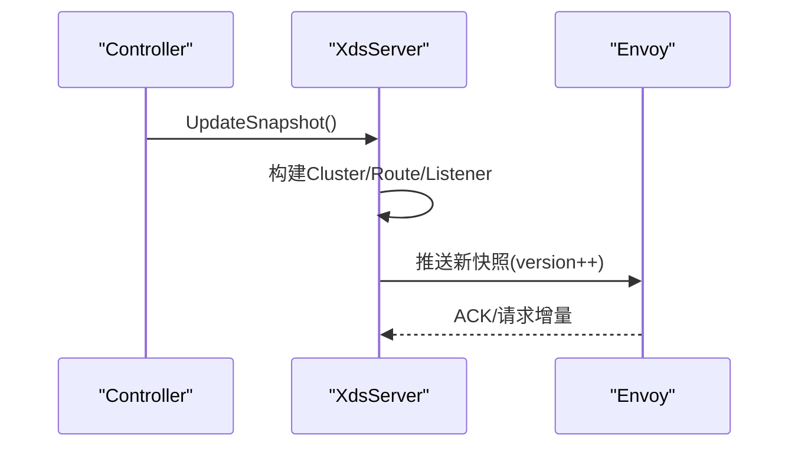
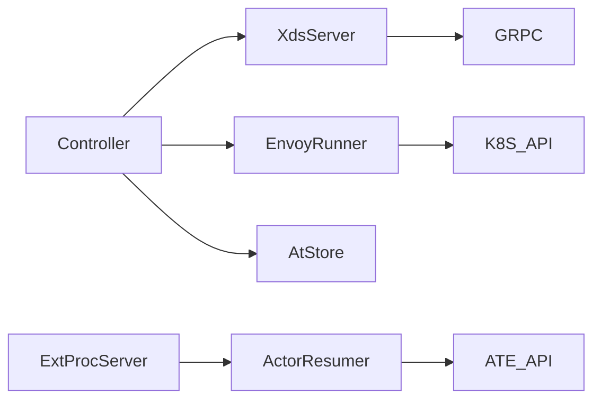

# Envoy代理故障排除

<cite>
**本文引用的文件**   
- [cmd/atenet/main.go](file://cmd/atenet/main.go)
- [cmd/atenet/internal/router/envoyrunner.go](file://cmd/atenet/internal/router/envoyrunner.go)
- [cmd/atenet/internal/router/xds.go](file://cmd/atenet/internal/router/xds.go)
- [cmd/atenet/internal/router/extproc.go](file://cmd/atenet/internal/router/extproc.go)
- [cmd/atenet/internal/router/extproc_in.go](file://cmd/atenet/internal/router/extproc_in.go)
- [cmd/atenet/internal/router/extproc_out.go](file://cmd/atenet/internal/router/extproc_out.go)
- [cmd/atenet/internal/router/resumer.go](file://cmd/atenet/internal/router/resumer.go)
- [cmd/atenet/internal/router/controller.go](file://cmd/atenet/internal/router/controller.go)
- [cmd/atenet/internal/router/atstore.go](file://cmd/atenet/internal/router/atstore.go)
- [cmd/atenet/internal/router/health.go](file://cmd/atenet/internal/router/health.go)
- [cmd/atenet/internal/router/metrics.go](file://cmd/atenet/internal/router/metrics.go)
- [cmd/atenet/internal/router/status.go](file://cmd/atenet/internal/router/status.go)
- [cmd/atenet/internal/router/errors.go](file://cmd/atenet/internal/router/errors.go)
</cite>

## 目录
1. [简介](#简介)
2. [项目结构](#项目结构)
3. [核心组件](#核心组件)
4. [架构总览](#架构总览)
5. [详细组件分析](#详细组件分析)
6. [依赖关系分析](#依赖关系分析)
7. [性能与调优建议](#性能与调优建议)
8. [故障排除指南](#故障排除指南)
9. [结论](#结论)
10. [附录](#附录)

## 简介
本指南聚焦于基于该仓库实现的Envoy代理相关故障排除，覆盖以下关键主题：
- Envoy进程管理与生命周期控制（启动参数、健康检查、优雅关闭）
- 外部处理器ExtProc配置与调试（请求拦截、响应修改、认证授权逻辑）
- XDS配置推送机制与动态路由更新
- 日志分析与监控指标查看方法
- 上游服务连接问题排查（负载均衡、超时、重试策略）
- 常见错误码含义与解决方法
- 性能调优建议

## 项目结构
本项目在atenet子系统中实现了“控制器+XDS服务器+ExtProc服务器”的完整数据面与控制面协同方案。Envoy作为独立Pod运行，通过xDS从本地XDS服务获取监听器、路由、集群等配置；同时启用ext_proc过滤器，将请求头处理委派给本地ExtProc gRPC服务，实现按Host解析目标Actor并动态改写:authority进行转发。

图示来源
- [cmd/atenet/internal/router/controller.go:67-110](file://cmd/atenet/internal/router/controller.go#L67-L110)
- [cmd/atenet/internal/router/xds.go:196-225](file://cmd/atenet/internal/router/xds.go#L196-L225)
- [cmd/atenet/internal/router/envoyrunner.go:50-64](file://cmd/atenet/internal/router/envoyrunner.go#L50-L64)
- [cmd/atenet/internal/router/extproc.go:58-78](file://cmd/atenet/internal/router/extproc.go#L58-L78)

章节来源
- [cmd/atenet/main.go:19-21](file://cmd/atenet/main.go#L19-L21)
- [cmd/atenet/internal/router/controller.go:67-110](file://cmd/atenet/internal/router/controller.go#L67-L110)
- [cmd/atenet/internal/router/envoyrunner.go:50-64](file://cmd/atenet/internal/router/envoyrunner.go#L50-L64)

## 核心组件
- Controller：周期性拉取ActorTemplate，生成并推送xDS快照，必要时协调Envoy资源对象。
- XdsServer：提供聚合发现服务，构建Listener/Route/Cluster/HCM/Tracing等配置，支持HTTP/HTTPS监听与OTLP追踪。
- ExtProcServer：实现Envoy ext_proc协议，解析Host、唤醒Actor、改写:authority并返回即时响应或继续路由。
- ActorResumer：对并发唤醒做去重与指数退避重试，屏蔽Aborted等可恢复错误。
- envoyrunner：在Kubernetes中创建/同步Envoy的ConfigMap、Deployment、Service，注入启动参数与日志级别。
- Health：周期探测Envoy /ready端点、K8s API、ATE API，汇总健康报告。
- Status：暴露状态页与JSON接口，展示端口、参数、最近请求与健康状况。
- Metrics：定义并记录路由耗时直方图。

章节来源
- [cmd/atenet/internal/router/controller.go:39-65](file://cmd/atenet/internal/router/controller.go#L39-L65)
- [cmd/atenet/internal/router/xds.go:92-104](file://cmd/atenet/internal/router/xds.go#L92-L104)
- [cmd/atenet/internal/router/extproc.go:38-56](file://cmd/atenet/internal/router/extproc.go#L38-L56)
- [cmd/atenet/internal/router/resumer.go:31-41](file://cmd/atenet/internal/router/resumer.go#L31-L41)
- [cmd/atenet/internal/router/envoyrunner.go:36-48](file://cmd/atenet/internal/router/envoyrunner.go#L36-L48)
- [cmd/atenet/internal/router/health.go:47-72](file://cmd/atenet/internal/router/health.go#L47-L72)
- [cmd/atenet/internal/router/status.go:180-281](file://cmd/atenet/internal/router/status.go#L180-L281)
- [cmd/atenet/internal/router/metrics.go:24-51](file://cmd/atenet/internal/router/metrics.go#L24-L51)

## 架构总览
下图展示了从HTTP请求进入Envoy到ExtProc决策、再到上游转发的端到端流程，以及xDS配置推送路径。

图示来源
- [cmd/atenet/internal/router/extproc.go:80-128](file://cmd/atenet/internal/router/extproc.go#L80-L128)
- [cmd/atenet/internal/router/resumer.go:46-104](file://cmd/atenet/internal/router/resumer.go#L46-L104)
- [cmd/atenet/internal/router/xds.go:196-225](file://cmd/atenet/internal/router/xds.go#L196-L225)

## 详细组件分析

### Envoy进程管理与生命周期控制
- 启动参数与日志级别
  - 通过envoyrunner生成的Deployment容器命令指定配置文件路径与组件日志级别，便于定位upstream、router、ext_proc相关问题。
- 健康检查
  - 内部健康模块定期访问Envoy admin端点的就绪接口，期望返回特定存活文本，用于判定数据面是否可用。
- 优雅关闭
  - XdsServer与ExtProcServer在上下文取消时调用gRPC服务的优雅停止，确保正在处理的请求完成后再退出。

图示来源
- [cmd/atenet/internal/router/envoyrunner.go:66-137](file://cmd/atenet/internal/router/envoyrunner.go#L66-L137)
- [cmd/atenet/internal/router/envoyrunner.go:139-222](file://cmd/atenet/internal/router/envoyrunner.go#L139-L222)
- [cmd/atenet/internal/router/health.go:149-179](file://cmd/atenet/internal/router/health.go#L149-L179)
- [cmd/atenet/internal/router/xds.go:218-225](file://cmd/atenet/internal/router/xds.go#L218-L225)
- [cmd/atenet/internal/router/extproc.go:71-78](file://cmd/atenet/internal/router/extproc.go#L71-L78)

章节来源
- [cmd/atenet/internal/router/envoyrunner.go:139-222](file://cmd/atenet/internal/router/envoyrunner.go#L139-L222)
- [cmd/atenet/internal/router/health.go:149-179](file://cmd/atenet/internal/router/health.go#L149-L179)
- [cmd/atenet/internal/router/xds.go:218-225](file://cmd/atenet/internal/router/xds.go#L218-L225)
- [cmd/atenet/internal/router/extproc.go:71-78](file://cmd/atenet/internal/router/extproc.go#L71-L78)

### 外部处理器(ExtProc)配置与调试
- 配置要点
  - HCM中启用ext_proc过滤器，指向本地gRPC服务，设置消息超时与处理模式（仅请求头）。
  - 允许路由阶段修改头部，避免阻塞后续动态转发。
- 请求拦截与路由决策
  - 解析Host中的actor与atespace，调用控制面API唤醒目标Actor，成功后将:authority改写为worker IP:80。
  - 若解析失败或不可用，直接返回即时响应（如404/5xx），不继续路由。
- 调试建议
  - 使用状态页查看最近请求、目标地址与耗时。
  - 结合组件日志级别与OpenTelemetry链路，定位断点。

图示来源
- [cmd/atenet/internal/router/extproc.go:38-56](file://cmd/atenet/internal/router/extproc.go#L38-L56)
- [cmd/atenet/internal/router/extproc.go:80-128](file://cmd/atenet/internal/router/extproc.go#L80-L128)
- [cmd/atenet/internal/router/extproc.go:130-188](file://cmd/atenet/internal/router/extproc.go#L130-L188)
- [cmd/atenet/internal/router/resumer.go:46-104](file://cmd/atenet/internal/router/resumer.go#L46-L104)
- [cmd/atenet/internal/router/status.go:113-130](file://cmd/atenet/internal/router/status.go#L113-L130)

章节来源
- [cmd/atenet/internal/router/xds.go:386-466](file://cmd/atenet/internal/router/xds.go#L386-L466)
- [cmd/atenet/internal/router/extproc.go:80-128](file://cmd/atenet/internal/router/extproc.go#L80-L128)
- [cmd/atenet/internal/router/extproc_in.go:31-72](file://cmd/atenet/internal/router/extproc_in.go#L31-L72)
- [cmd/atenet/internal/router/extproc_out.go:35-67](file://cmd/atenet/internal/router/extproc_out.go#L35-L67)
- [cmd/atenet/internal/router/status.go:180-281](file://cmd/atenet/internal/router/status.go#L180-L281)

### XDS配置推送与动态路由更新
- 聚合发现服务
  - 提供LDS/CDS/RDS/ADS能力，首次启动即推送初始快照，随后按需更新。
- 监听器与过滤器链
  - 构建HTTP连接管理器，挂载ext_proc、dynamic_forward_proxy、router过滤器，输出标准访问日志。
- 集群与动态转发
  - 为ext_proc建立本地集群；为动态转发建立DNS缓存集群；可选配置OTLP收集器集群。
- 版本化快照
  - 每次更新递增版本号，保证一致性校验通过后下发。

图示来源
- [cmd/atenet/internal/router/controller.go:88-110](file://cmd/atenet/internal/router/controller.go#L88-L110)
- [cmd/atenet/internal/router/xds.go:148-194](file://cmd/atenet/internal/router/xds.go#L148-L194)
- [cmd/atenet/internal/router/xds.go:196-225](file://cmd/atenet/internal/router/xds.go#L196-L225)

章节来源
- [cmd/atenet/internal/router/xds.go:148-194](file://cmd/atenet/internal/router/xds.go#L148-L194)
- [cmd/atenet/internal/router/xds.go:357-384](file://cmd/atenet/internal/router/xds.go#L357-L384)
- [cmd/atenet/internal/router/xds.go:503-531](file://cmd/atenet/internal/router/xds.go#L503-L531)

### 健康检查与状态页面
- 健康检查
  - 周期探测Envoy /ready、K8s API、ATE API，统计成功/失败次数与时间戳。
- 状态页面
  - 提供HTML/JSON两种格式，展示构建信息、端口、命令行参数、最近请求、健康报告与模板列表。

章节来源
- [cmd/atenet/internal/router/health.go:74-147](file://cmd/atenet/internal/router/health.go#L74-L147)
- [cmd/atenet/internal/router/status.go:180-281](file://cmd/atenet/internal/router/status.go#L180-L281)

### 监控指标与日志
- 指标
  - 定义路由耗时直方图，维度包括模板命名空间、名称与结果分类。
- 日志
  - 通过组件日志级别输出ext_proc/upstream/router相关细节；访问日志默认输出到stdout。

章节来源
- [cmd/atenet/internal/router/metrics.go:24-51](file://cmd/atenet/internal/router/metrics.go#L24-L51)
- [cmd/atenet/internal/router/envoyrunner.go:168-174](file://cmd/atenet/internal/router/envoyrunner.go#L168-L174)
- [cmd/atenet/internal/router/xds.go:421-432](file://cmd/atenet/internal/router/xds.go#L421-L432)

## 依赖关系分析
- 组件耦合
  - Controller依赖atStore与XdsServer/envoyrunner；XdsServer依赖gRPC与go-control-plane库；ExtProcServer依赖ATE API与resumer。
- 外部依赖
  - Kubernetes API、ATE API、OpenTelemetry、Prometheus/Metric导出（由上层集成）。
- 潜在循环
  - 无直接循环依赖；各组件职责清晰。

图示来源
- [cmd/atenet/internal/router/controller.go:39-65](file://cmd/atenet/internal/router/controller.go#L39-L65)
- [cmd/atenet/internal/router/extproc.go:38-56](file://cmd/atenet/internal/router/extproc.go#L38-L56)
- [cmd/atenet/internal/router/resumer.go:31-41](file://cmd/atenet/internal/router/resumer.go#L31-L41)
- [cmd/atenet/internal/router/envoyrunner.go:36-48](file://cmd/atenet/internal/router/envoyrunner.go#L36-L48)

章节来源
- [cmd/atenet/internal/router/controller.go:39-65](file://cmd/atenet/internal/router/controller.go#L39-L65)
- [cmd/atenet/internal/router/extproc.go:38-56](file://cmd/atenet/internal/router/extproc.go#L38-L56)
- [cmd/atenet/internal/router/resumer.go:31-41](file://cmd/atenet/internal/router/resumer.go#L31-L41)
- [cmd/atenet/internal/router/envoyrunner.go:36-48](file://cmd/atenet/internal/router/envoyrunner.go#L36-L48)

## 性能与调优建议
- 超时与重试
  - ext_proc消息超时与HCM路由超时需合理设置，避免长尾请求堆积。
  - ActorResumer已内置指数退避与去重，可根据ATE API可用性调整步数与抖动。
- 负载均衡
  - 当前ext_proc集群采用ROUND_ROBIN；如需多副本扩展ExtProc，应配合K8s Service与xDS动态更新。
- 追踪采样
  - 默认随机采样100%，下游服务可按ParentBased策略控制整体采样率，避免过载。
- 日志级别
  - 生产环境建议降低upstream/router/ext_proc日志级别，仅在排障时临时提升。

[本节为通用指导，无需源码引用]

## 故障排除指南

### 一、Envoy进程无法启动或重启频繁
- 检查envoyrunner生成的Deployment与ConfigMap是否正确，确认镜像、端口、卷挂载与命令参数。
- 查看组件日志级别是否开启upstream/router/ext_proc以便定位。
- 验证K8s事件与Pod状态，关注OOM、权限、存储卷等问题。

章节来源
- [cmd/atenet/internal/router/envoyrunner.go:139-222](file://cmd/atenet/internal/router/envoyrunner.go#L139-L222)
- [cmd/atenet/internal/router/envoyrunner.go:66-137](file://cmd/atenet/internal/router/envoyrunner.go#L66-L137)
- [cmd/atenet/internal/router/envoyrunner.go:168-174](file://cmd/atenet/internal/router/envoyrunner.go#L168-L174)

### 二、健康检查失败
- 若Envoy /ready未返回预期值，检查admin端口可达性与Envoy自身状态。
- 若K8s API或ATE API探测失败，检查网络连通性、证书与鉴权。

章节来源
- [cmd/atenet/internal/router/health.go:149-179](file://cmd/atenet/internal/router/health.go#L149-L179)
- [cmd/atenet/internal/router/health.go:181-208](file://cmd/atenet/internal/router/health.go#L181-L208)

### 三、ExtProc处理异常或请求被拒绝
- 确认ext_proc过滤器已启用且消息超时足够，避免上游处理慢导致超时。
- 检查Host解析逻辑与Actor存在性，必要时查看状态页最近请求与目标地址。
- 对于认证授权场景，可在ExtProc中增加鉴权逻辑并返回即时响应。

章节来源
- [cmd/atenet/internal/router/xds.go:386-466](file://cmd/atenet/internal/router/xds.go#L386-L466)
- [cmd/atenet/internal/router/extproc.go:130-188](file://cmd/atenet/internal/router/extproc.go#L130-L188)
- [cmd/atenet/internal/router/status.go:180-281](file://cmd/atenet/internal/router/status.go#L180-L281)

### 四、XDS配置未生效或路由不正确
- 确认XdsServer已推送初始快照且版本号递增。
- 检查Listener/Route/Cluster/HCM过滤器链顺序与配置项。
- 观察Envoy侧日志与Admin接口，核对实际加载的配置。

章节来源
- [cmd/atenet/internal/router/xds.go:148-194](file://cmd/atenet/internal/router/xds.go#L148-L194)
- [cmd/atenet/internal/router/xds.go:357-384](file://cmd/atenet/internal/router/xds.go#L357-L384)
- [cmd/atenet/internal/router/xds.go:503-531](file://cmd/atenet/internal/router/xds.go#L503-L531)

### 五、上游服务连接问题（负载均衡、超时、重试）
- 负载均衡：当前ext_proc集群为ROUND_ROBIN；如需多实例，请扩展ExtProc并更新xDS。
- 超时：调整ext_proc消息超时与HCM路由超时，避免上游慢导致请求堆积。
- 重试：ActorResumer已对Aborted进行重试；其他错误按语义映射到HTTP状态码，不建议盲目重试。

章节来源
- [cmd/atenet/internal/router/xds.go:227-272](file://cmd/atenet/internal/router/xds.go#L227-L272)
- [cmd/atenet/internal/router/resumer.go:61-86](file://cmd/atenet/internal/router/resumer.go#L61-L86)
- [cmd/atenet/internal/router/errors.go:56-92](file://cmd/atenet/internal/router/errors.go#L56-L92)

### 六、常见错误码与处理方法
- 404 Not Found：Host无效或Actor不存在。检查域名格式与Actor模板状态。
- 403 Forbidden：权限不足。检查身份与策略。
- 401 Unauthorized：需要认证。补充必要凭证。
- 503 Service Unavailable：Actor不可用或资源不足。检查上游容量与配额。
- 504 Gateway Timeout：上游超时。调整超时或优化上游性能。
- 429 Too Many Requests：限流触发。降低请求速率或扩容。
- 500 Internal Server Error：未知错误。查看日志与堆栈，修复后重试。

章节来源
- [cmd/atenet/internal/router/errors.go:25-92](file://cmd/atenet/internal/router/errors.go#L25-L92)

### 七、日志分析与指标查看
- 日志
  - 提升组件日志级别以捕获ext_proc/upstream/router细节。
  - 访问日志默认输出到stdout，便于集中采集。
- 指标
  - 查看路由耗时直方图，按模板命名空间/名称/结果维度分析瓶颈。
- 追踪
  - 启用OTLP收集器，结合上下游链路定位延迟热点。

章节来源
- [cmd/atenet/internal/router/envoyrunner.go:168-174](file://cmd/atenet/internal/router/envoyrunner.go#L168-L174)
- [cmd/atenet/internal/router/xds.go:421-432](file://cmd/atenet/internal/router/xds.go#L421-L432)
- [cmd/atenet/internal/router/metrics.go:24-51](file://cmd/atenet/internal/router/metrics.go#L24-L51)
- [cmd/atenet/internal/router/xds.go:478-501](file://cmd/atenet/internal/router/xds.go#L478-L501)

## 结论
通过控制器驱动的xDS与ExtProc联动，系统实现了按Host的动态路由与按需唤醒。故障排除应从进程健康、配置推送、ExtProc处理、上游连接与观测数据五个维度入手，结合日志、指标与追踪快速定位问题根因，并通过合理的超时、重试与负载均衡策略保障稳定性与性能。

[本节为总结，无需源码引用]

## 附录
- 常用诊断入口
  - 状态页面：查看端口、参数、最近请求与健康报告。
  - Envoy Admin：检查监听器、路由、集群与实际加载配置。
  - OTLP/指标平台：查看延迟分布与错误率趋势。

[本节为概念性内容，无需源码引用]
