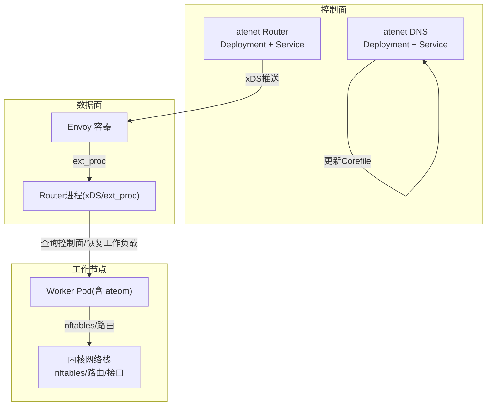
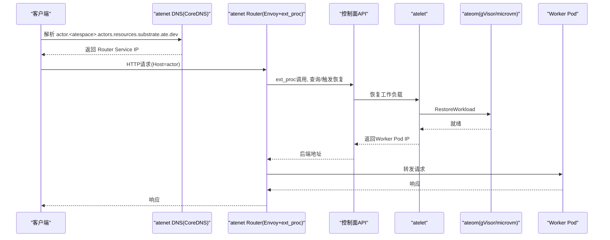
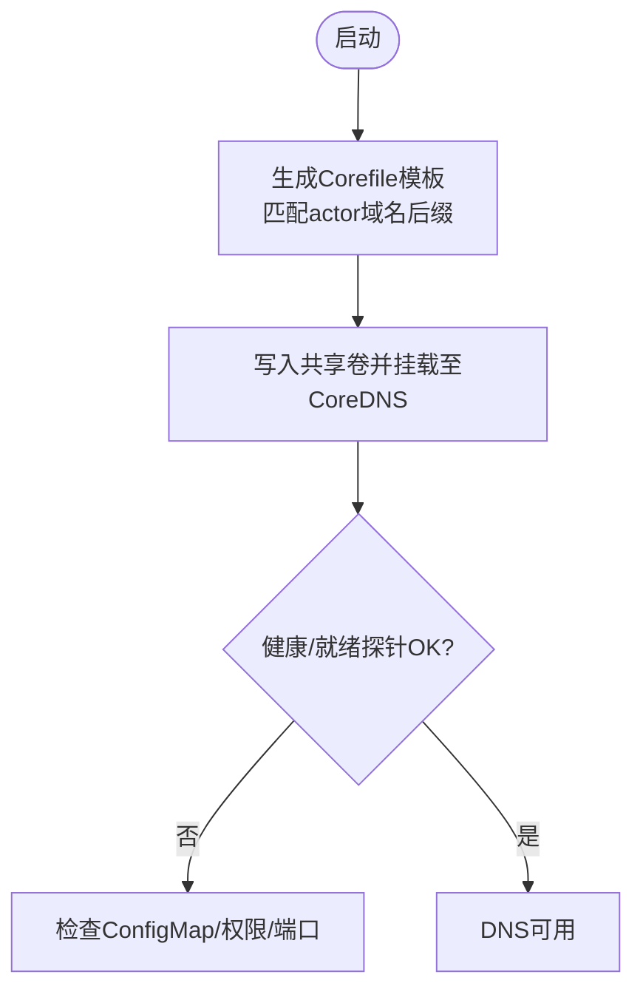
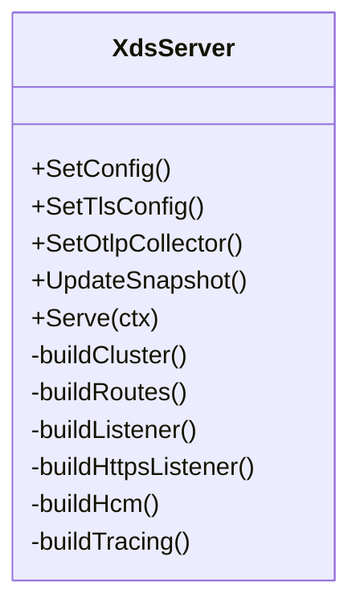
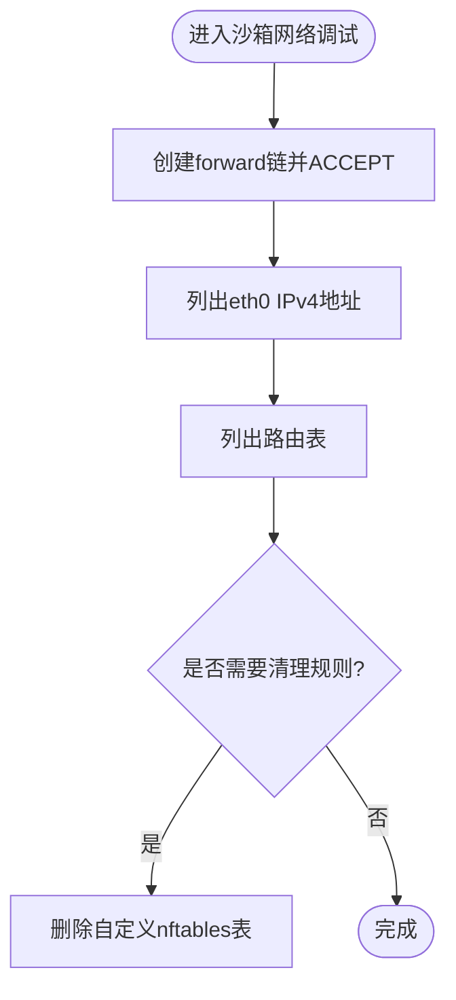
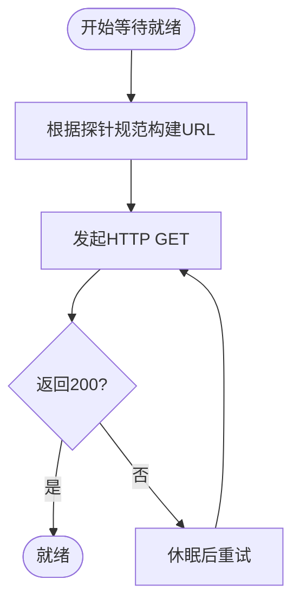
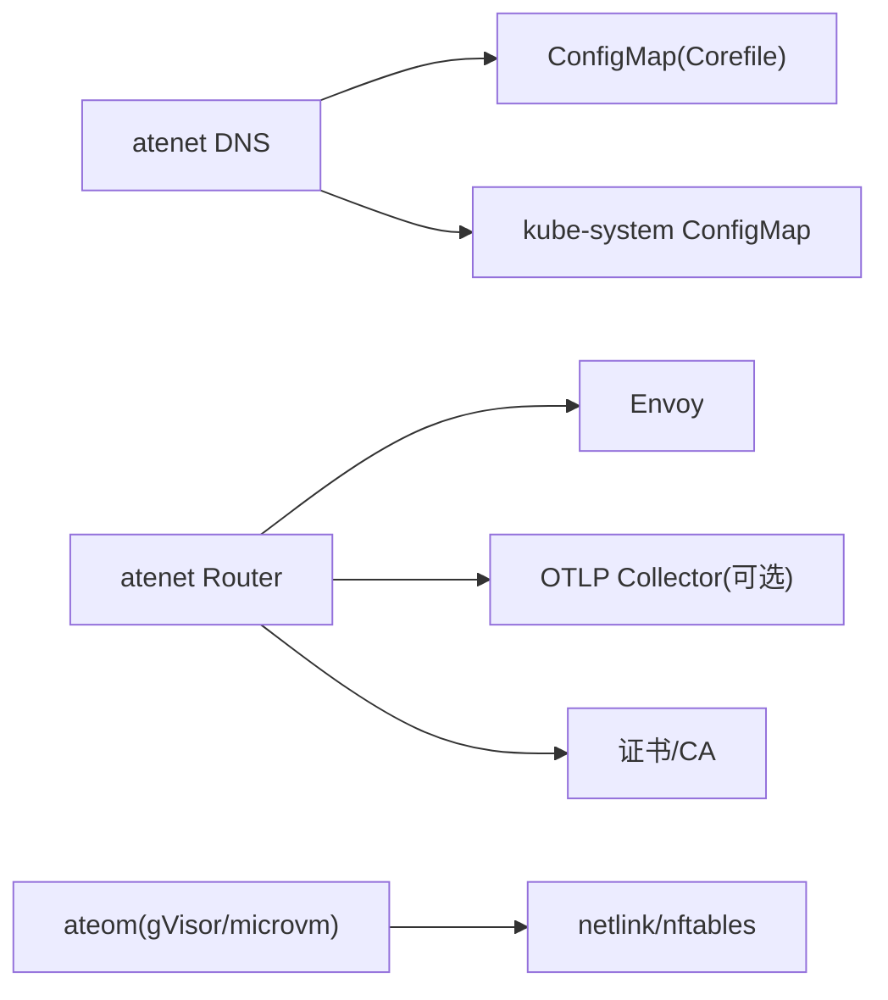

# Kubernetes网络策略问题

<cite>
**本文引用的文件**   
- [README.md](file://README.md)
- [architecture.md](file://docs/architecture.md)
- [threat-model.md](file://docs/threat-model.md)
- [atenet-router.yaml](file://manifests/ate-install/atenet-router.yaml)
- [atenet-dns.yaml](file://manifests/ate-install/atenet-dns.yaml)
- [xds.go](file://cmd/atenet/internal/router/xds.go)
- [corefile.go](file://cmd/atenet/internal/dns/corefile.go)
- [router README.md](file://cmd/atenet/internal/router/README.md)
- [dns README.md](file://cmd/atenet/internal/dns/README.md)
- [net.go (gVisor)](file://cmd/ateom-gvisor/main.go)
- [net.go (microvm)](file://cmd/ateom-microvm/net.go)
- [readyz.go](file://internal/readyz/readyz.go)
- [probe main.go](file://internal/e2e/fixtures/probe/main.go)
- [sandboxconfig-validation.yaml](file://manifests/ate-install/sandboxconfig-validation.yaml)
</cite>

## 目录
1. [简介](#简介)
2. [项目结构](#项目结构)
3. [核心组件](#核心组件)
4. [架构总览](#架构总览)
5. [详细组件分析](#详细组件分析)
6. [依赖关系分析](#依赖关系分析)
7. [性能与QoS建议](#性能与qos建议)
8. [故障排查指南](#故障排查指南)
9. [结论](#结论)
10. [附录](#附录)

## 简介
本指南聚焦于在基于Kubernetes的Agent Substrate环境中，如何诊断和解决网络策略相关问题。内容覆盖：
- NetworkPolicy资源的配置与验证（入站/出站、命名空间隔离、Pod选择器）
- CNI插件连通性检查思路（Flannel、Calico、Weave等）
- Service与Endpoint健康检查机制（就绪探针与存活探针）
- 跨节点通信问题的排查方法（NodePort、LoadBalancer、Ingress）
- 防火墙规则与端口冲突检测与解决
- 网络带宽限制与QoS优化建议

本项目通过atenet组件提供DNS与Envoy路由能力，并通过atelet/ateom在沙箱侧进行网络栈调试与nftables规则管理；同时提供就绪探针等待逻辑与示例探针服务，便于端到端验证。

## 项目结构
与网络相关的关键位置：
- 安装清单：atenet路由器与DNS部署、Service定义
- atenet内部实现：xDS配置生成、CoreDNS模板生成
- 沙箱侧网络调试：gVisor与microVM路径下的nftables规则与接口地址获取
- 就绪探针：HTTP轮询与URL构造
- 安全与隔离：威胁模型中关于NetworkPolicy的建议

图表来源
- [atenet-dns.yaml:74-176](file://manifests/ate-install/atenet-dns.yaml#L74-L176)
- [atenet-router.yaml:102-216](file://manifests/ate-install/atenet-router.yaml#L102-L216)
- [xds.go:148-225](file://cmd/atenet/internal/router/xds.go#L148-L225)
- [corefile.go:25-65](file://cmd/atenet/internal/dns/corefile.go#L25-L65)

章节来源
- [README.md:211-225](file://README.md#L211-L225)
- [architecture.md:343-352](file://docs/architecture.md#L343-L352)

## 核心组件
- atenet DNS：维护CoreDNS配置，将actor域名解析到路由器Service地址
- atenet Router：运行Envoy并作为xDS服务端，结合ext_proc动态决定后端
- atelet/ateom：节点级编排与沙箱执行，负责快照恢复与网络栈调试
- 就绪探针：HTTP轮询等待应用就绪，辅助判定网络可达性与服务可用性

章节来源
- [dns README.md:1-37](file://cmd/atenet/internal/dns/README.md#L1-L37)
- [router README.md:1-26](file://cmd/atenet/internal/router/README.md#L1-L26)
- [architecture.md:323-352](file://docs/architecture.md#L323-L352)

## 架构总览
从请求接入到工作负载恢复的网络路径如下：

图表来源
- [architecture.md:359-384](file://docs/architecture.md#L359-L384)
- [xds.go:148-225](file://cmd/atenet/internal/router/xds.go#L148-L225)

## 详细组件分析

### atenet DNS（CoreDNS模板与Stub Resolver）
- 职责：为actor域名生成CoreDNS模板，将匹配模式指向Router Service地址
- 关键实现：
  - Corefile模板构建与正则匹配actor域名后缀
  - 通过ConfigMap注入CoreDNS配置，配合health/ready探针
- 验证要点：
  - CoreDNS Pod健康与就绪探针是否成功
  - ConfigMap是否被正确挂载并热加载
  - kube-system或GKE DNS是否已集成stub resolver

图表来源
- [corefile.go:25-65](file://cmd/atenet/internal/dns/corefile.go#L25-L65)
- [atenet-dns.yaml:127-144](file://manifests/ate-install/atenet-dns.yaml#L127-L144)

章节来源
- [dns README.md:1-37](file://cmd/atenet/internal/dns/README.md#L1-L37)
- [atenet-dns.yaml:74-176](file://manifests/ate-install/atenet-dns.yaml#L74-L176)

### atenet Router（Envoy + xDS + ext_proc）
- 职责：对外暴露HTTP/HTTPS入口，通过xDS动态下发Listener/Route/Cluster，ext_proc与后端交互完成动态路由与恢复
- 关键实现：
  - 构建xDS Snapshot（Clusters/Routes/Listeners），支持OTLP追踪
  - 配置动态转发代理与外部处理过滤器
- 验证要点：
  - xDS监听端口、ext_proc端口、HTTP/HTTPS端口是否开放
  - Envoy日志与访问日志是否正常
  - OTLP集群是否可达（如启用）

图表来源
- [xds.go:72-225](file://cmd/atenet/internal/router/xds.go#L72-L225)
- [xds.go:227-334](file://cmd/atenet/internal/router/xds.go#L227-L334)
- [xds.go:357-466](file://cmd/atenet/internal/router/xds.go#L357-L466)
- [xds.go:478-501](file://cmd/atenet/internal/router/xds.go#L478-L501)
- [xds.go:503-606](file://cmd/atenet/internal/router/xds.go#L503-L606)

章节来源
- [router README.md:1-26](file://cmd/atenet/internal/router/README.md#L1-L26)
- [atenet-router.yaml:102-216](file://manifests/ate-install/atenet-router.yaml#L102-L216)

### 沙箱侧网络调试（gVisor与microVM）
- 职责：在工作Pod内使用nftables建立转发链，打印接口地址与路由表，辅助定位连通性问题
- 关键实现：
  - 添加forward链并允许转发
  - 列出eth0 IPv4地址与路由条目
  - 清理自定义nftables表
- 验证要点：
  - 接口是否存在IPv4地址
  - 路由是否正确指向CNI网段
  - nftables表是否按预期创建/删除

图表来源
- [net.go (gVisor):750-793](file://cmd/ateom-gvisor/main.go#L750-L793)
- [net.go (gVisor):903-919](file://cmd/ateom-gvisor/main.go#L903-L919)
- [net.go (microvm):396-436](file://cmd/ateom-microvm/net.go#L396-L436)
- [net.go (microvm):290-318](file://cmd/ateom-microvm/net.go#L290-L318)

章节来源
- [net.go (gVisor):750-856](file://cmd/ateom-gvisor/main.go#L750-L856)
- [net.go (microvm):290-318](file://cmd/ateom-microvm/net.go#L290-L318)
- [net.go (microvm):396-510](file://cmd/ateom-microvm/net.go#L396-L510)

### 就绪探针与存活探针
- 就绪探针：
  - 系统内置HTTP轮询等待逻辑，校验200状态码，自动拼接URL（默认路径可配置）
  - 示例探针服务提供/healthz与/whoami端点
- 存活探针：
  - CoreDNS Deployment中定义了liveness与readiness探针，分别对应/health与/ready端口
- 验证要点：
  - 目标端口是否在1-65535范围内
  - 路径是否以“/”开头且不含非法字符
  - 探针超时与重试阈值是否合理

图表来源
- [readyz.go:104-165](file://internal/readyz/readyz.go#L104-L165)
- [probe main.go:58-69](file://internal/e2e/fixtures/probe/main.go#L58-L69)
- [atenet-dns.yaml:127-144](file://manifests/ate-install/atenet-dns.yaml#L127-L144)

章节来源
- [readyz.go:104-165](file://internal/readyz/readyz.go#L104-L165)
- [probe main.go:58-69](file://internal/e2e/fixtures/probe/main.go#L58-L69)
- [atenet-dns.yaml:127-144](file://manifests/ate-install/atenet-dns.yaml#L127-L144)

## 依赖关系分析
- atenet DNS依赖：
  - CoreDNS镜像与ConfigMap
  - 对kube-system或GKE DNS的ConfigMap读写权限
- atenet Router依赖：
  - Envoy镜像与xDS/gRPC连接
  - 可选OTLP Collector集群
  - 证书与CA信任包（HTTPS）
- 沙箱侧依赖：
  - netlink/nftables库用于接口与规则操作
  - 宿主机内核支持相应特性

图表来源
- [atenet-dns.yaml:23-72](file://manifests/ate-install/atenet-dns.yaml#L23-L72)
- [atenet-router.yaml:137-139](file://manifests/ate-install/atenet-router.yaml#L137-L139)
- [xds.go:126-146](file://cmd/atenet/internal/router/xds.go#L126-L146)
- [net.go (gVisor):750-793](file://cmd/ateom-gvisor/main.go#L750-L793)

章节来源
- [atenet-dns.yaml:74-176](file://manifests/ate-install/atenet-dns.yaml#L74-L176)
- [atenet-router.yaml:102-216](file://manifests/ate-install/atenet-router.yaml#L102-L216)
- [xds.go:126-146](file://cmd/atenet/internal/router/xds.go#L126-L146)

## 性能与QoS建议
- 网络带宽限制与QoS
  - 可通过Linux tc/cgroups进行带宽与优先级控制；OCI运行时支持接口优先级字段，可用于标记不同接口的优先级
  - 建议在WorkerPool层面统一配置资源配额与网络QoS策略，避免热点节点拥塞
- 路由与追踪
  - 启用Envoy OTLP追踪有助于定位慢请求与瓶颈
  - 合理设置ext_proc消息超时与连接超时，避免长尾延迟
- 探针调优
  - 调整就绪/存活探针的initialDelaySeconds、timeoutSeconds、failureThreshold，平衡快速失败与误判风险

章节来源
- [xds.go:126-146](file://cmd/atenet/internal/router/xds.go#L126-L146)
- [oci.pb.go(LinuxInterfacePriority):2090-2105](file://cmd/ateom-microvm/internal/third_party/kata/agentpb/oci.pb.go#L2090-L2105)

## 故障排查指南

### NetworkPolicy配置与验证
- 建议实践
  - 在WorkerPool边界应用NetworkPolicy，限制所有入站/出站流量为默认拒绝，再按需放行
  - 针对特定命名空间与Pod标签精细化控制，确保Actor间通信最小化
- 验证步骤
  - 确认CNI插件支持NetworkPolicy（如Calico、 Cilium等）
  - 使用小流量测试用例验证入站/出站策略生效
  - 结合威胁模型中的“默认禁用网络通信、严格Ingress/Egress策略”原则进行加固

章节来源
- [architecture.md:487-494](file://docs/architecture.md#L487-L494)
- [threat-model.md:119-125](file://docs/threat-model.md#L119-L125)

### CNI插件连通性检查（Flannel、Calico、Weave）
- 通用检查
  - 在Worker Pod内查看eth0 IPv4地址与路由表，确认CNI分配的IP与默认网关
  - 使用ping/telnet/curl测试同节点与跨节点Pod互通
  - 检查节点防火墙与云厂商安全组/ACL是否放行必要端口
- 差异点提示
  - Flannel：关注VXLAN/UDP封装与节点间路由
  - Calico：关注BGP/iptables或eBPF模式下的策略生效
  - Weave：关注加密与分布式路由配置

章节来源
- [net.go (gVisor):903-919](file://cmd/ateom-gvisor/main.go#L903-L919)
- [net.go (microvm):290-318](file://cmd/ateom-microvm/net.go#L290-L318)

### Service与Endpoint健康检查
- 就绪探针
  - 确保应用暴露正确的HTTP端口与路径，返回200
  - 参考就绪探针URL构造与轮询逻辑，避免端口越界或路径不合法
- 存活探针
  - 参考CoreDNS的liveness/readiness配置，确保探针端口与路径可用
- 验证步骤
  - 直接curl Pod IP与Service ClusterIP，观察是否命中后端
  - 检查Endpoints对象是否包含Pod IP与端口

章节来源
- [readyz.go:104-165](file://internal/readyz/readyz.go#L104-L165)
- [atenet-dns.yaml:127-144](file://manifests/ate-install/atenet-dns.yaml#L127-L144)

### 跨节点通信问题（NodePort、LoadBalancer、Ingress）
- NodePort
  - 确认NodePort端口未被节点防火墙拦截
  - 检查各节点kube-proxy或CNI是否将流量转发到后端Pod
- LoadBalancer
  - 确认云厂商LB控制器已分配公网IP与健康检查通过
  - 检查后端TargetGroup/实例健康检查配置
- Ingress
  - 确认Ingress Controller已安装且监听端口开放
  - 检查TLS证书与Host匹配规则

章节来源
- [atenet-router.yaml:199-216](file://manifests/ate-install/atenet-router.yaml#L199-L216)

### 防火墙规则与端口冲突
- 检查项
  - 节点iptables/nftables规则是否阻断必要端口
  - 容器端口是否与宿主机或其他容器冲突
- 解决步骤
  - 使用nftables工具查看并清理自定义表（如ateom创建的表）
  - 调整端口映射或释放冲突端口

章节来源
- [net.go (gVisor):773-793](file://cmd/ateom-gvisor/main.go#L773-L793)
- [net.go (microvm):419-436](file://cmd/ateom-microvm/net.go#L419-L436)

### 准入策略与配置校验
- SandboxConfig ValidatingAdmissionPolicy
  - 确保每个架构下资产完整（如cloud-hypervisor、virtiofsd、kata-kernel、kata-image、kata-config）
  - 未满足条件将被拒绝，需修正后再提交

章节来源
- [sandboxconfig-validation.yaml:43-54](file://manifests/ate-install/sandboxconfig-validation.yaml#L43-L54)

## 结论
在网络策略与连通性问题上，建议遵循“最小权限、默认拒绝、逐步放开”的原则，结合atenet提供的DNS与路由能力、沙箱侧网络调试工具以及就绪/存活探针，形成从配置到验证的闭环。对于跨节点与外部接入场景，应重点关注CNI、LB/Ingress控制器与防火墙规则的协同。通过合理的QoS与追踪配置，可进一步提升稳定性与可观测性。

## 附录
- 快速验证清单
  - DNS：actor域名能否解析到Router Service
  - Router：HTTP/HTTPS端口可达，ext_proc与xDS正常
  - 沙箱：eth0有IPv4地址，路由正确，nftables表存在
  - 探针：就绪/存活探针返回成功
  - 策略：NetworkPolicy按预期生效
