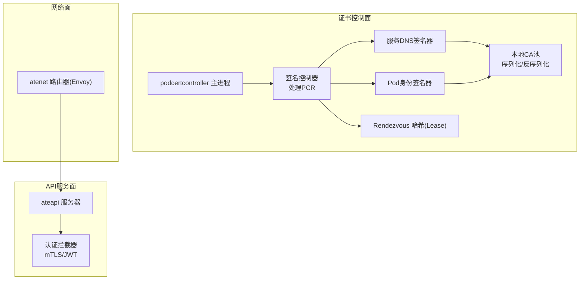
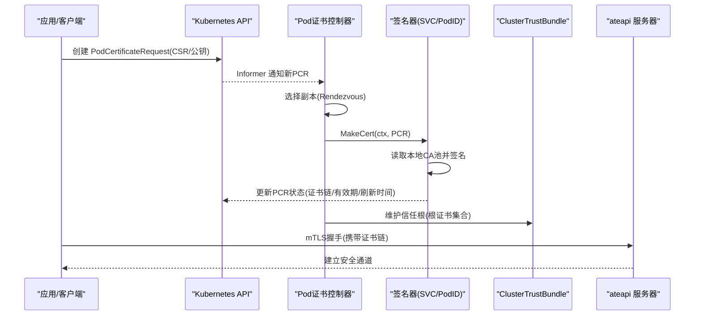
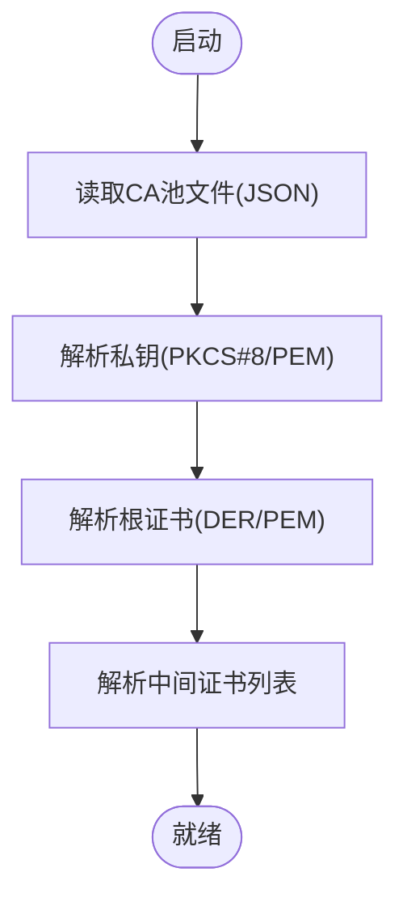
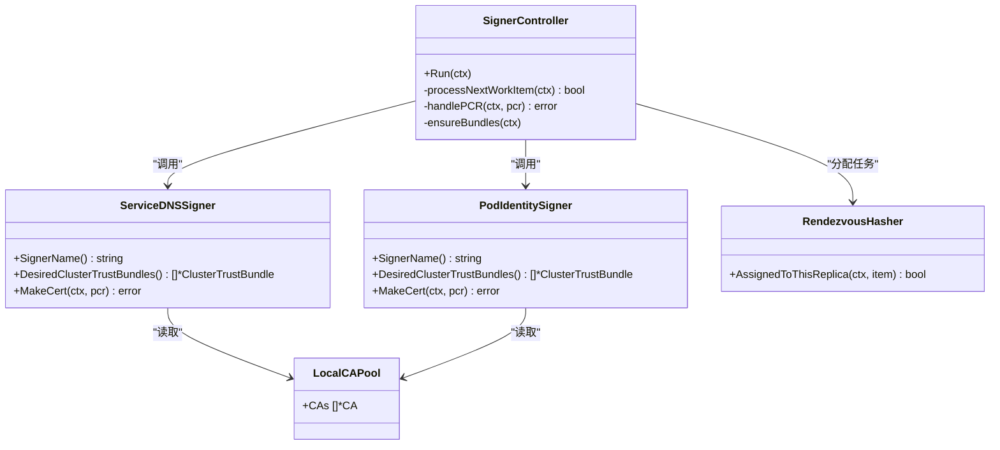
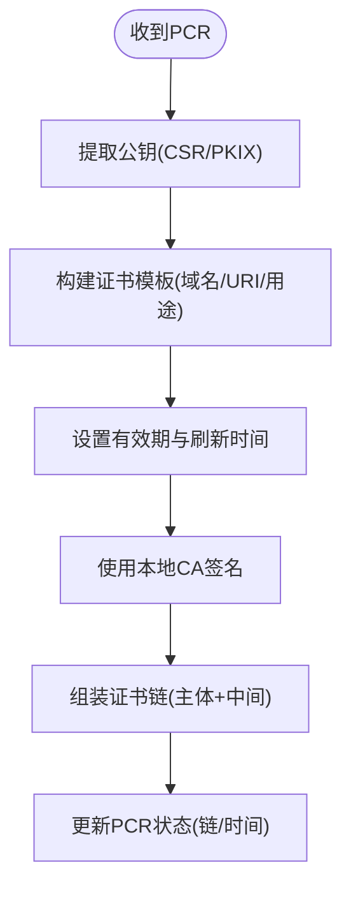
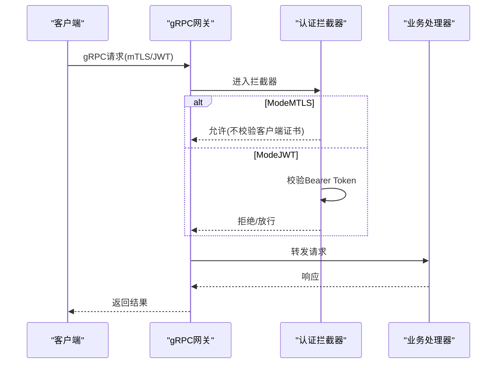
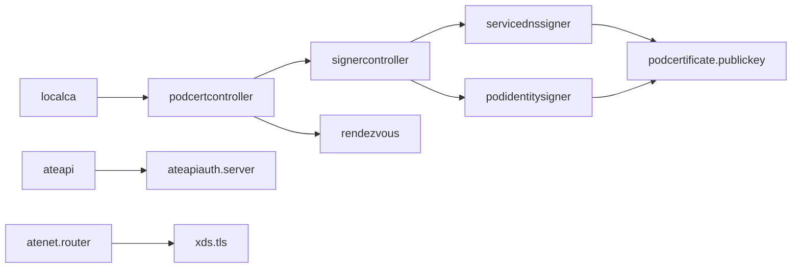

# mTLS证书配置问题

<cite>
**本文引用的文件**
- [internal/localca/localca.go](file://internal/localca/localca.go)
- [cmd/podcertcontroller/main.go](file://cmd/podcertcontroller/main.go)
- [cmd/podcertcontroller/internal/signercontroller/signercontroller.go](file://cmd/podcertcontroller/internal/signercontroller/signercontroller.go)
- [cmd/podcertcontroller/internal/servicednssigner/servicednssigner.go](file://cmd/podcertcontroller/internal/servicednssigner/servicednssigner.go)
- [cmd/podcertcontroller/internal/podidentitysigner/podidentitysigner.go](file://cmd/podcertcontroller/internal/podidentitysigner/podidentitysigner.go)
- [cmd/podcertcontroller/internal/rendezvous/rendezvous.go](file://cmd/podcertcontroller/internal/rendezvous/rendezvous.go)
- [cmd/podcertcontroller/internal/podcertificate/publickey.go](file://cmd/podcertcontroller/internal/podcertificate/publickey.go)
- [internal/ateapiauth/server.go](file://internal/ateapiauth/server.go)
- [internal/ateapiauth/client.go](file://internal/ateapiauth/client.go)
- [cmd/atenet/internal/router/xds.go](file://cmd/atenet/internal/router/xds.go)
</cite>

## 目录
1. [简介](#简介)
2. [项目结构](#项目结构)
3. [核心组件](#核心组件)
4. [架构总览](#架构总览)
5. [详细组件分析](#详细组件分析)
6. [依赖关系分析](#依赖关系分析)
7. [性能与可扩展性](#性能与可扩展性)
8. [故障排查指南](#故障排查指南)
9. [生产环境最佳实践](#生产环境最佳实践)
10. [结论](#结论)

## 简介
本指南聚焦于在该项目中实现和运维双向TLS（mTLS）的完整生命周期：从本地CA根密钥对生成、中间证书链管理，到Pod身份证书的自动签发、轮换与信任分发；并覆盖客户端与服务端证书的配置方法、集成方式以及常见问题的定位与修复。文档同时给出可操作的调试命令建议与生产安全建议，帮助读者快速落地并稳定运行。

## 项目结构
围绕mTLS与证书自动化，本项目包含以下关键模块：
- 本地CA池与序列化：提供ED25519根密钥对生成、证书序列化和反序列化能力，用于持久化CA状态。
- Pod证书控制器：基于Kubernetes自定义资源PodCertificateRequest，通过两个Signer分别签发“服务DNS名”和“Pod身份”证书，并将信任根以ClusterTrustBundle形式发布。
- 调度与一致性：使用基于Lease的Rendezvous哈希在多副本间分配工作项，避免重复处理。
- API服务端认证拦截器：支持mTLS模式与JWT模式，当前mTLS模式下不强制校验客户端证书，但为后续扩展预留。
- 客户端连接配置：支持指定CA文件、SNI覆盖等，便于对接外部或内部服务。
- 网关侧TLS配置：Envoy监听器可通过文件或内联方式加载证书链与私钥。

图表来源
- [cmd/podcertcontroller/main.go:80-158](file://cmd/podcertcontroller/main.go#L80-L158)
- [cmd/podcertcontroller/internal/signercontroller/signercontroller.go:48-114](file://cmd/podcertcontroller/internal/signercontroller/signercontroller.go#L48-L114)
- [cmd/podcertcontroller/internal/servicednssigner/servicednssigner.go:41-90](file://cmd/podcertcontroller/internal/servicednssigner/servicednssigner.go#L41-L90)
- [cmd/podcertcontroller/internal/podidentitysigner/podidentitysigner.go:41-90](file://cmd/podcertcontroller/internal/podidentitysigner/podidentitysigner.go#L41-L90)
- [cmd/podcertcontroller/internal/rendezvous/rendezvous.go:93-143](file://cmd/podcertcontroller/internal/rendezvous/rendezvous.go#L93-L143)
- [internal/localca/localca.go:30-120](file://internal/localca/localca.go#L30-L120)
- [internal/ateapiauth/server.go:81-129](file://internal/ateapiauth/server.go#L81-L129)
- [cmd/atenet/internal/router/xds.go:578-606](file://cmd/atenet/internal/router/xds.go#L578-L606)

章节来源
- [cmd/podcertcontroller/main.go:80-158](file://cmd/podcertcontroller/main.go#L80-L158)
- [internal/localca/localca.go:30-120](file://internal/localca/localca.go#L30-L120)
- [internal/ateapiauth/server.go:81-129](file://internal/ateapiauth/server.go#L81-L129)
- [cmd/atenet/internal/router/xds.go:578-606](file://cmd/atenet/internal/router/xds.go#L578-L606)

## 核心组件
- 本地CA池（Local CA Pool）
  - 功能：生成ED25519根密钥对与自签根证书；支持将CA状态（私钥、根证书、中间证书）序列化为JSON并在启动时反序列化恢复。
  - 关键点：根证书有效期默认一年；支持PKCS#8/EC/PKCS#1私钥解析；支持DER/PEM双格式输入。
- Pod证书控制器（Pod Certificate Controller）
  - 功能：监听PodCertificateRequest，按SignerName路由至对应签名器；维护ClusterTrustBundle以分发信任根。
  - 关键点：多副本通过Rendezvous哈希分配任务；证书链包含主体证书与可选中间证书；返回BeginRefreshAt驱动客户端提前轮换。
- 服务DNS签名器（Service DNS Signer）
  - 功能：根据Pod所属Service的DNS名称签发证书，支持ClientAuth与ServerAuth用途。
- Pod身份签名器（Pod Identity Signer）
  - 功能：基于Pod ServiceAccount签发SPiffe URI标识的证书，仅支持ClientAuth用途。
- 认证拦截器（API Server Interceptor）
  - 功能：gRPC层统一认证入口，支持ModeMTLS与ModeJWT；当前mTLS模式不强制校验客户端证书。
- 客户端连接配置（Client Config）
  - 功能：支持指定CAFile、ServerName覆盖SNI；mTLS模式下当前跳过服务端验证以便过渡。
- 网关TLS配置（Router TLS）
  - 功能：Envoy监听器支持从文件或内联内容加载证书链与私钥。

章节来源
- [internal/localca/localca.go:159-192](file://internal/localca/localca.go#L159-L192)
- [cmd/podcertcontroller/internal/signercontroller/signercontroller.go:48-114](file://cmd/podcertcontroller/internal/signercontroller/signercontroller.go#L48-L114)
- [cmd/podcertcontroller/internal/servicednssigner/servicednssigner.go:92-211](file://cmd/podcertcontroller/internal/servicednssigner/servicednssigner.go#L92-L211)
- [cmd/podcertcontroller/internal/podidentitysigner/podidentitysigner.go:92-176](file://cmd/podcertcontroller/internal/podidentitysigner/podidentitysigner.go#L92-L176)
- [internal/ateapiauth/server.go:81-129](file://internal/ateapiauth/server.go#L81-L129)
- [internal/ateapiauth/client.go:44-68](file://internal/ateapiauth/client.go#L44-L68)
- [cmd/atenet/internal/router/xds.go:578-606](file://cmd/atenet/internal/router/xds.go#L578-L606)

## 架构总览
下图展示从CSR提交到证书签发、信任分发与客户端使用的端到端流程。

图表来源
- [cmd/podcertcontroller/internal/signercontroller/signercontroller.go:116-201](file://cmd/podcertcontroller/internal/signercontroller/signercontroller.go#L116-L201)
- [cmd/podcertcontroller/internal/servicednssigner/servicednssigner.go:168-211](file://cmd/podcertcontroller/internal/servicednssigner/servicednssigner.go#L168-L211)
- [cmd/podcertcontroller/internal/podidentitysigner/podidentitysigner.go:133-176](file://cmd/podcertcontroller/internal/podidentitysigner/podidentitysigner.go#L133-L176)
- [cmd/podcertcontroller/internal/rendezvous/rendezvous.go:205-250](file://cmd/podcertcontroller/internal/rendezvous/rendezvous.go#L205-L250)
- [internal/ateapiauth/server.go:81-129](file://internal/ateapiauth/server.go#L81-L129)

## 详细组件分析

### 本地CA池与证书生成
- 根密钥对与根证书
  - 算法：ED25519
  - 有效期：默认1年
  - 用途：数字签名 + 证书签名
- 序列化/反序列化
  - 私钥：优先PKCS#8，回退PEM解析(EC/PKCS#1)
  - 证书：优先DER，回退PEM解析
  - 中间证书：支持多张，形成证书链
- 典型用法
  - 启动时从文件加载CA池，供签名器使用
  - 重启后保持同一根密钥，确保证书链连续性

图表来源
- [internal/localca/localca.go:53-120](file://internal/localca/localca.go#L53-L120)
- [internal/localca/localca.go:122-157](file://internal/localca/localca.go#L122-L157)
- [internal/localca/localca.go:159-192](file://internal/localca/localca.go#L159-L192)

章节来源
- [internal/localca/localca.go:53-120](file://internal/localca/localca.go#L53-L120)
- [internal/localca/localca.go:122-157](file://internal/localca/localca.go#L122-L157)
- [internal/localca/localca.go:159-192](file://internal/localca/localca.go#L159-L192)

### Pod证书控制器与签名器
- 控制器职责
  - 监听PCR事件，去重与错误重试
  - 使用Rendezvous哈希在多副本间分配任务
  - 周期性维护ClusterTrustBundle（信任根）
- 服务DNS签名器
  - 依据Pod所属Service的DNS名称签发证书
  - 支持ClientAuth与ServerAuth
  - 设置NotBefore/NotAfter与BeginRefreshAt
- Pod身份签名器
  - 依据Pod ServiceAccount签发SPiffe URI标识
  - 仅支持ClientAuth
  - 设置NotBefore/NotAfter与BeginRefreshAt

图表来源
- [cmd/podcertcontroller/internal/signercontroller/signercontroller.go:48-114](file://cmd/podcertcontroller/internal/signercontroller/signercontroller.go#L48-L114)
- [cmd/podcertcontroller/internal/servicednssigner/servicednssigner.go:41-90](file://cmd/podcertcontroller/internal/servicednssigner/servicednssigner.go#L41-L90)
- [cmd/podcertcontroller/internal/podidentitysigner/podidentitysigner.go:41-90](file://cmd/podcertcontroller/internal/podidentitysigner/podidentitysigner.go#L41-L90)
- [cmd/podcertcontroller/internal/rendezvous/rendezvous.go:93-143](file://cmd/podcertcontroller/internal/rendezvous/rendezvous.go#L93-L143)

章节来源
- [cmd/podcertcontroller/internal/signercontroller/signercontroller.go:116-201](file://cmd/podcertcontroller/internal/signercontroller/signercontroller.go#L116-L201)
- [cmd/podcertcontroller/internal/servicednssigner/servicednssigner.go:92-211](file://cmd/podcertcontroller/internal/servicednssigner/servicednssigner.go#L92-L211)
- [cmd/podcertcontroller/internal/podidentitysigner/podidentitysigner.go:92-176](file://cmd/podcertcontroller/internal/podidentitysigner/podidentitysigner.go#L92-L176)
- [cmd/podcertcontroller/internal/rendezvous/rendezvous.go:205-250](file://cmd/podcertcontroller/internal/rendezvous/rendezvous.go#L205-L250)

### CSR公钥提取与模板构建
- 公钥来源
  - 优先从StubPKCS10Request解析CSR获取公钥
  - 兼容旧字段PKIXPublicKey
- 证书模板
  - 服务DNS签名器：DNSNames + ClientAuth/ServerAuth
  - Pod身份签名器：URIs(SPiffe) + ClientAuth
  - 有效期：默认24小时，若请求更短则取请求值；设置BeginRefreshAt提前触发轮换

图表来源
- [cmd/podcertcontroller/internal/podcertificate/publickey.go:25-44](file://cmd/podcertcontroller/internal/podcertificate/publickey.go#L25-L44)
- [cmd/podcertcontroller/internal/servicednssigner/servicednssigner.go:149-211](file://cmd/podcertcontroller/internal/servicednssigner/servicednssigner.go#L149-L211)
- [cmd/podcertcontroller/internal/podidentitysigner/podidentitysigner.go:108-176](file://cmd/podcertcontroller/internal/podidentitysigner/podidentitysigner.go#L108-L176)

章节来源
- [cmd/podcertcontroller/internal/podcertificate/publickey.go:25-44](file://cmd/podcertcontroller/internal/podcertificate/publickey.go#L25-L44)
- [cmd/podcertcontroller/internal/servicednssigner/servicednssigner.go:149-211](file://cmd/podcertcontroller/internal/servicednssigner/servicednssigner.go#L149-L211)
- [cmd/podcertcontroller/internal/podidentitysigner/podidentitysigner.go:108-176](file://cmd/podcertcontroller/internal/podidentitysigner/podidentitysigner.go#L108-L176)

### API服务端认证拦截器（mTLS/JWT）
- 模式
  - ModeMTLS：基于传输层mTLS建立身份，当前不强制校验客户端证书
  - ModeJWT：要求Bearer Token并由回调函数验证
- 拦截器
  - Unary与Stream两种拦截器封装，统一鉴权逻辑

图表来源
- [internal/ateapiauth/server.go:81-129](file://internal/ateapiauth/server.go#L81-L129)

章节来源
- [internal/ateapiauth/server.go:81-129](file://internal/ateapiauth/server.go#L81-L129)

### 客户端连接配置（CA/SNI/mTLS）
- 必填项
  - CAFile：服务端根证书PEM路径
- 可选项
  - ServerName：覆盖SNI/主机名校验
- 行为
  - mTLS模式：当前跳过服务端验证以便过渡
  - JWT模式：需配置TokenFile作为Bearer凭证

章节来源
- [internal/ateapiauth/client.go:44-68](file://internal/ateapiauth/client.go#L44-L68)

### 网关侧TLS配置（Envoy）
- 支持两种方式
  - 文件路径：CertificateChain与PrivateKey指向同一组合文件或独立文件
  - 内联内容：InlineString直接注入证书链与私钥

章节来源
- [cmd/atenet/internal/router/xds.go:578-606](file://cmd/atenet/internal/router/xds.go#L578-L606)

## 依赖关系分析
- podcertcontroller
  - 依赖localca进行CA池读写
  - 依赖signercontroller协调PCR处理与CTB维护
  - 依赖rendezvous进行多副本任务分配
- signercontroller
  - 依赖具体签名器实现（servicednssigner、podidentitysigner）
  - 依赖Kubernetes API读写PCR与CTB
- 签名器
  - 依赖localca.Pool中的根证书与私钥进行签名
  - 依赖publickey工具解析PCR中的公钥
- ateapi
  - 通过认证拦截器统一鉴权
- atenet
  - 通过XDS配置加载TLS证书

图表来源
- [cmd/podcertcontroller/main.go:123-149](file://cmd/podcertcontroller/main.go#L123-L149)
- [cmd/podcertcontroller/internal/signercontroller/signercontroller.go:48-114](file://cmd/podcertcontroller/internal/signercontroller/signercontroller.go#L48-L114)
- [cmd/podcertcontroller/internal/servicednssigner/servicednssigner.go:41-90](file://cmd/podcertcontroller/internal/servicednssigner/servicednssigner.go#L41-L90)
- [cmd/podcertcontroller/internal/podidentitysigner/podidentitysigner.go:41-90](file://cmd/podcertcontroller/internal/podidentitysigner/podidentitysigner.go#L41-L90)
- [cmd/podcertcontroller/internal/podcertificate/publickey.go:25-44](file://cmd/podcertcontroller/internal/podcertificate/publickey.go#L25-L44)
- [internal/ateapiauth/server.go:81-129](file://internal/ateapiauth/server.go#L81-L129)
- [cmd/atenet/internal/router/xds.go:578-606](file://cmd/atenet/internal/router/xds.go#L578-L606)

## 性能与可扩展性
- 多副本并行与去重
  - 通过Rendezvous哈希将PCR均匀分配到多个控制器副本，减少单点压力
  - 未分配的任务会带退避重试，避免风暴
- 证书链长度
  - 当前默认无中间证书，链较短，握手开销低
  - 如需引入中间证书，注意链长度对握手延迟的影响
- 信任分发
  - ClusterTrustBundle由单一副本维护，避免频繁写冲突
- 建议
  - 合理设置PCR队列速率限制与重试策略
  - 监控PCR处理耗时与失败率，必要时水平扩容控制器副本

[本节为通用指导，无需特定文件引用]

## 故障排查指南
- 证书链验证失败
  - 检查本地CA池是否成功加载（私钥与根证书匹配）
  - 确认ClusterTrustBundle已正确发布且被客户端信任
  - 核对证书链顺序（主体在前，中间在后）
- 过期证书
  - 关注PCR状态中的NotBefore/NotAfter与BeginRefreshAt
  - 确保客户端在BeginRefreshAt之前发起重新申请
- 权限不足
  - 控制器需具备读写PCR与CTB的RBAC权限
  - 签名器读取Service/Pod信息需要相应List/Get权限
- 常见问题定位步骤
  - 查看控制器日志，确认PCR是否被分配与处理
  - 检查Rendezvous Lease是否正常续期
  - 验证本地CA池文件完整性与可读性
  - 使用openssl/curl进行mTLS连通性测试（见下节）

章节来源
- [cmd/podcertcontroller/internal/signercontroller/signercontroller.go:116-201](file://cmd/podcertcontroller/internal/signercontroller/signercontroller.go#L116-L201)
- [cmd/podcertcontroller/internal/rendezvous/rendezvous.go:145-203](file://cmd/podcertcontroller/internal/rendezvous/rendezvous.go#L145-L203)
- [cmd/podcertcontroller/internal/servicednssigner/servicednssigner.go:168-211](file://cmd/podcertcontroller/internal/servicednssigner/servicednssigner.go#L168-L211)
- [cmd/podcertcontroller/internal/podidentitysigner/podidentitysigner.go:133-176](file://cmd/podcertcontroller/internal/podidentitysigner/podidentitysigner.go#L133-L176)

## 生产环境最佳实践
- CA与密钥管理
  - 使用强算法（如ED25519），定期轮换根密钥与中间证书
  - 严格保护私钥访问，最小权限原则
- 证书生命周期
  - 设置合理的有效期与提前刷新时间，避免批量到期
  - 自动化监控证书即将过期告警
- 信任分发
  - 使用ClusterTrustBundle集中分发信任根，确保所有节点一致
- 客户端与服务端配置
  - 明确指定CAFile与ServerName，避免误用InsecureSkipVerify
  - 逐步启用严格的客户端证书校验
- 网络与网关
  - 在网关层统一加载证书链与私钥，避免硬编码
  - 结合NetworkPolicy限制非必要访问
- 可观测性与审计
  - 记录PCR签发、CTB变更与TLS握手失败指标
  - 保留必要审计日志，便于溯源

[本节为通用指导，无需特定文件引用]

## 结论
本项目提供了完整的mTLS证书自动化能力：本地CA池持久化、Pod证书按需签发、信任根集中分发、多副本高可用与可扩展。配合合理的客户端与服务端配置、完善的监控与排障手段，可在生产环境中稳定运行。建议在生产中逐步强化客户端证书校验与密钥轮换策略，持续提升安全性与可靠性。
