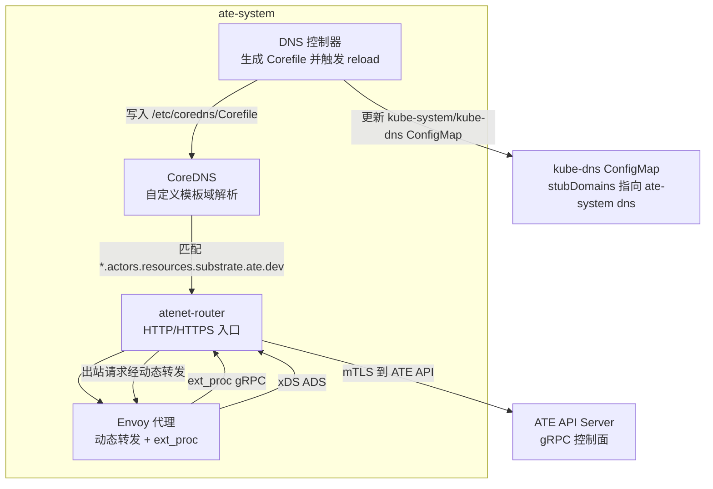
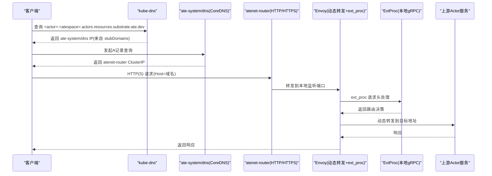
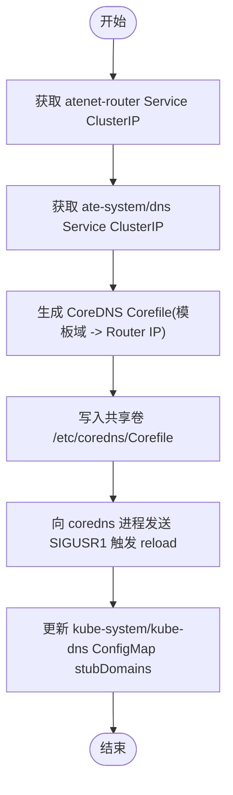
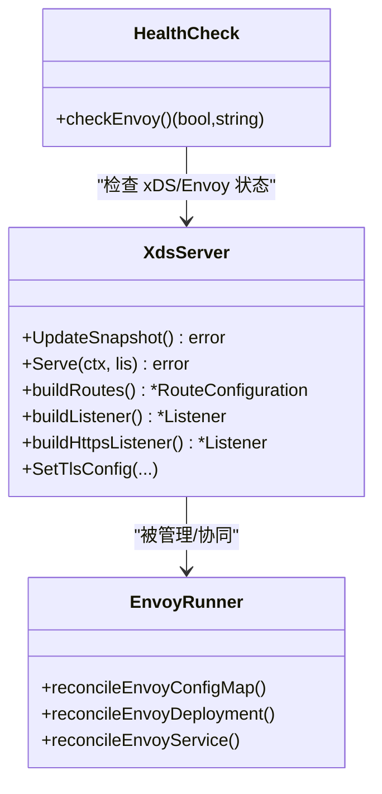
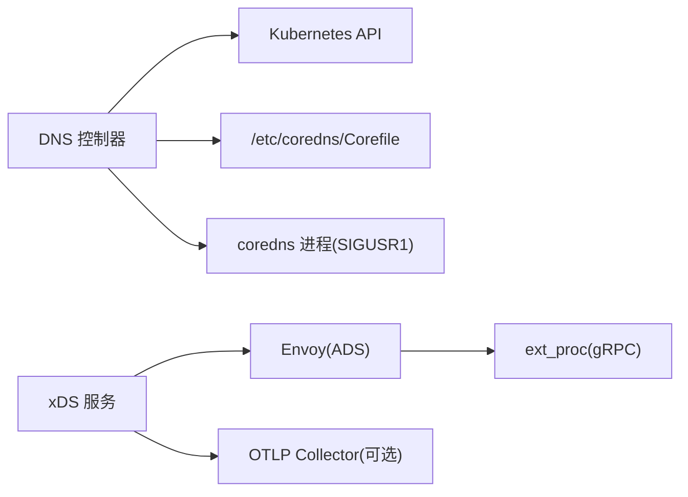

# 网络问题诊断

<cite>
**本文引用的文件列表**
- [README.md](file://README.md)
- [atenet-dns.yaml](file://manifests/ate-install/atenet-dns.yaml)
- [atenet-router.yaml](file://manifests/ate-install/atenet-router.yaml)
- [dns.go](file://cmd/atenet/internal/dns/dns.go)
- [corefile.go](file://cmd/atenet/internal/dns/corefile.go)
- [xds.go](file://cmd/atenet/internal/router/xds.go)
- [envoyrunner.go](file://cmd/atenet/internal/router/envoyrunner.go)
- [health.go](file://cmd/atenet/internal/router/health.go)
- [status.go](file://cmd/atenet/internal/router/status.go)
- [root.go](file://cmd/atenet/internal/root.go)
</cite>

## 目录
1. [简介](#简介)
2. [项目结构](#项目结构)
3. [核心组件](#核心组件)
4. [架构总览](#架构总览)
5. [详细组件分析](#详细组件分析)
6. [依赖关系分析](#依赖关系分析)
7. [性能与可观测性](#性能与可观测性)
8. [故障排查指南](#故障排查指南)
9. [结论](#结论)
10. [附录：常用命令与工具](#附录常用命令与工具)

## 简介
本指南聚焦于 Agent Substrate 的网络相关问题诊断，覆盖以下关键主题：
- DNS 解析问题排查（CoreDNS 配置验证、域名解析测试、kube-dns stubDomains 同步）
- Envoy 代理配置检查与故障排除（路由规则、上游服务连通性、负载均衡）
- Kubernetes 网络策略与插件相关问题的定位思路
- 网络连通性测试工具与命令的使用建议
- mTLS 证书配置与验证步骤

## 项目结构
本项目在 atenet 组件中提供统一的网络能力，包括 DNS 控制器与 Envoy 动态路由。部署清单位于 manifests/ate-install 下，分别定义了 DNS 与 Router 的 Deployment、Service、RBAC 等。

图表来源
- [atenet-dns.yaml:74-176](file://manifests/ate-install/atenet-dns.yaml#L74-L176)
- [atenet-router.yaml:102-216](file://manifests/ate-install/atenet-router.yaml#L102-L216)
- [dns.go:71-189](file://cmd/atenet/internal/dns/dns.go#L71-L189)
- [xds.go:148-225](file://cmd/atenet/internal/router/xds.go#L148-L225)

章节来源
- [README.md:1-225](file://README.md#L1-L225)
- [atenet-dns.yaml:1-176](file://manifests/ate-install/atenet-dns.yaml#L1-L176)
- [atenet-router.yaml:1-216](file://manifests/ate-install/atenet-router.yaml#L1-L216)

## 核心组件
- DNS 控制器与 CoreDNS
  - 控制器周期性读取 atenet-router Service ClusterIP，生成 CoreDNS 模板域解析规则，并写回共享卷；随后向 coredns 进程发送信号以热重载。
  - 同时确保 kube-system/kube-dns ConfigMap 中的 stubDomains 包含 ate-system dns 的 IP，使集群内对自定义后缀的解析能正确转发至 ate-system dns。
- Envoy 代理与 xDS 服务器
  - atenet-router 作为 xDS 服务端，为 Envoy 推送 Listener/Cluster/Route 快照；Envoy 通过 ADS 订阅配置。
  - 入站流量经 HTTP/HTTPS 监听器进入，由 ext_proc 过滤器与动态转发过滤器协作完成基于 Host/Path 的动态路由。
  - 支持可选 OTLP 追踪与 HTTPS 监听器（mTLS）。

章节来源
- [dns.go:51-189](file://cmd/atenet/internal/dns/dns.go#L51-L189)
- [corefile.go:32-65](file://cmd/atenet/internal/dns/corefile.go#L32-L65)
- [xds.go:148-225](file://cmd/atenet/internal/router/xds.go#L148-L225)
- [envoyrunner.go:66-137](file://cmd/atenet/internal/router/envoyrunner.go#L66-L137)

## 架构总览
下图展示了从客户端到后端 Actor 的典型请求路径，以及 DNS 与 xDS 的配置联动。

图表来源
- [dns.go:119-189](file://cmd/atenet/internal/dns/dns.go#L119-L189)
- [corefile.go:42-60](file://cmd/atenet/internal/dns/corefile.go#L42-L60)
- [xds.go:357-466](file://cmd/atenet/internal/router/xds.go#L357-L466)
- [envoyrunner.go:66-137](file://cmd/atenet/internal/router/envoyrunner.go#L66-L137)

## 详细组件分析

### DNS 控制器与 CoreDNS 配置
- 控制器职责
  - 获取 atenet-router 与 dns Service 的 ClusterIP。
  - 生成 CoreDNS 配置，将自定义后缀下的所有子域名统一解析到 atenet-router 的 ClusterIP。
  - 更新 kube-system/kube-dns ConfigMap 的 stubDomains，使集群默认 DNS 能将自定义后缀转发到 ate-system dns。
  - 通过 SIGUSR1 通知 coredns 热重载 Corefile。
- 配置要点
  - CoreDNS 监听 :53，启用 health/ready/reload 插件。
  - 模板域匹配使用正则模式，确保仅匹配期望的命名空间与资源名格式。
  - kube-dns 的 stubDomains JSON 字段需包含自定义后缀与 ate-system dns 的 IP。

图表来源
- [dns.go:71-189](file://cmd/atenet/internal/dns/dns.go#L71-L189)
- [corefile.go:32-65](file://cmd/atenet/internal/dns/corefile.go#L32-L65)

章节来源
- [dns.go:51-189](file://cmd/atenet/internal/dns/dns.go#L51-L189)
- [corefile.go:32-65](file://cmd/atenet/internal/dns/corefile.go#L32-L65)
- [atenet-dns.yaml:74-176](file://manifests/ate-install/atenet-dns.yaml#L74-L176)

### Envoy 代理与 xDS 配置
- 组件关系
  - atenet-router 启动 xDS 服务，构建 Snapshot 并推送给 Envoy。
  - Envoy 通过静态配置的 xds_cluster 连接 atenet-router 的 xDS 端口，订阅 LDS/CDS/RDS。
  - 入站 HTTP/HTTPS 监听器挂载 HCM，依次经过 ext_proc、dynamic_forward_proxy、router 过滤器。
- 路由与转发
  - 默认路由将所有前缀匹配 "/" 的请求转发到 dynamic_forward_proxy_cluster。
  - ext_proc 负责请求头解析与路由决策，动态转发根据 Host/Path 选择上游。
- 健康检查
  - 内部通过访问 Envoy admin 端点 /ready 判断存活状态。

图表来源
- [xds.go:148-225](file://cmd/atenet/internal/router/xds.go#L148-L225)
- [xds.go:357-466](file://cmd/atenet/internal/router/xds.go#L357-L466)
- [envoyrunner.go:66-137](file://cmd/atenet/internal/router/envoyrunner.go#L66-L137)
- [health.go:149-179](file://cmd/atenet/internal/router/health.go#L149-L179)

章节来源
- [xds.go:148-225](file://cmd/atenet/internal/router/xds.go#L148-L225)
- [xds.go:357-466](file://cmd/atenet/internal/router/xds.go#L357-L466)
- [envoyrunner.go:66-137](file://cmd/atenet/internal/router/envoyrunner.go#L66-L137)
- [health.go:149-179](file://cmd/atenet/internal/router/health.go#L149-L179)

### mTLS 与证书注入
- 入口 HTTPS 监听器
  - 通过 SetTlsConfig 设置证书链与私钥，支持从文件或内存注入。
  - 对应 Deployment 中挂载 podCertificate 投影卷，提供凭证包。
- 出站到 ATE API
  - 通过参数指定 CA 文件，建立到 ATE API 的受控 TLS 连接。
- 验证方法
  - 确认证书文件存在且可读。
  - 使用 openssl s_client 或 curl --cacert 进行握手验证。
  - 观察 atenet-router 日志与 Envoy admin 统计，确认 TLS 上下文加载成功。

章节来源
- [xds.go:533-606](file://cmd/atenet/internal/router/xds.go#L533-L606)
- [atenet-router.yaml:136-139](file://manifests/ate-install/atenet-router.yaml#L136-L139)
- [atenet-router.yaml:184-196](file://manifests/ate-install/atenet-router.yaml#L184-L196)

## 依赖关系分析
- DNS 控制器依赖
  - Kubernetes API：读取 Service、更新 ConfigMap。
  - 文件系统：读写 /etc/coredns/Corefile。
  - 进程信号：向 coredns 进程发送 SIGUSR1。
- Envoy 与 xDS
  - xDS 服务：ADS/gRPC 暴露给 Envoy。
  - ext_proc：本地 gRPC 通信用于请求头处理。
  - 可选 OTLP：将追踪数据发送到 collector。

图表来源
- [dns.go:202-221](file://cmd/atenet/internal/dns/dns.go#L202-L221)
- [xds.go:196-225](file://cmd/atenet/internal/router/xds.go#L196-L225)
- [xds.go:478-501](file://cmd/atenet/internal/router/xds.go#L478-L501)

章节来源
- [dns.go:202-221](file://cmd/atenet/internal/dns/dns.go#L202-L221)
- [xds.go:196-225](file://cmd/atenet/internal/router/xds.go#L196-L225)

## 性能与可观测性
- 可观测性
  - Envoy 访问日志输出到 stdout，便于集中采集。
  - 支持 OpenTelemetry 追踪，随机采样率设置为 100%（无父 trace 时），下游服务可根据策略决定是否采样。
  - atenet-router 暴露 statusz 页面，展示运行参数、健康检查与最近查询摘要。
- 性能关注点
  - DNS 模板匹配与 kube-dns stubDomains 更新频率由控制器 interval 控制。
  - Envoy 动态转发与 ext_proc 超时配置影响端到端延迟。

章节来源
- [xds.go:419-466](file://cmd/atenet/internal/router/xds.go#L419-L466)
- [xds.go:478-501](file://cmd/atenet/internal/router/xds.go#L478-L501)
- [status.go:132-171](file://cmd/atenet/internal/router/status.go#L132-L171)

## 故障排查指南

### DNS 解析问题
- 现象
  - 无法解析 <actor>.<atespace>.actors.resources.substrate.ate.dev。
- 排查步骤
  - 确认 ate-system/dns Service 存在且 ClusterIP 可用。
  - 检查 DNS 控制器是否成功生成 Corefile 并触发 reload。
  - 校验 kube-system/kube-dns ConfigMap 的 stubDomains 是否包含自定义后缀与 ate-system dns IP。
  - 在 Pod 内执行 dig/nslookup 验证解析链路。
- 参考实现
  - 控制器逻辑与 Corefile 生成。
  - kube-dns ConfigMap 同步逻辑。

章节来源
- [dns.go:71-189](file://cmd/atenet/internal/dns/dns.go#L71-L189)
- [corefile.go:32-65](file://cmd/atenet/internal/dns/corefile.go#L32-L65)
- [atenet-dns.yaml:74-176](file://manifests/ate-install/atenet-dns.yaml#L74-L176)

### Envoy 路由与上游连通性
- 现象
  - 请求到达 atenet-router 但无响应或超时。
- 排查步骤
  - 检查 atenet-router 的 xDS 端口与 ext_proc 端口是否正常监听。
  - 查看 Envoy admin 端点 /ready 与健康检查返回值。
  - 确认 RDS/LDS/CDS 快照已推送且一致。
  - 检查 ext_proc 处理逻辑与超时配置。
  - 验证动态转发 cluster 的 DNS 缓存与上游可达性。
- 参考实现
  - xDS 快照构建与监听器配置。
  - 健康检查逻辑。

章节来源
- [xds.go:148-225](file://cmd/atenet/internal/router/xds.go#L148-L225)
- [xds.go:357-466](file://cmd/atenet/internal/router/xds.go#L357-L466)
- [health.go:149-179](file://cmd/atenet/internal/router/health.go#L149-L179)

### Kubernetes 网络策略与插件
- 现象
  - 跨节点或跨命名空间访问失败。
- 排查思路
  - 检查 NetworkPolicy 是否允许 atenet-router、Envoy、CoreDNS 所需端口。
  - 确认 CNI 插件分配的 Pod IP 与路由表正常。
  - 在 Pod 内抓取接口地址与路由信息，验证出口流量路径。
- 参考实现
  - 网络调试辅助函数（获取 eth0 IPv4、列出地址与路由）。

章节来源
- [net.go:290-318](file://cmd/ateom-microvm/net.go#L290-L318)
- [main.go:903-919](file://cmd/ateom-gvisor/main.go#L903-L919)

### 防火墙与端口冲突
- 现象
  - 外部无法访问 atenet-router 的 80/443 端口，或内部端口冲突。
- 排查步骤
  - 确认 Service 映射的 targetPort 与容器端口一致。
  - 检查 Ingress/LoadBalancer 层是否放行相应端口。
  - 在 Pod 内使用 ss/netstat 查看端口占用情况。
- 参考实现
  - atenet-router 与 Envoy 的端口定义与服务映射。

章节来源
- [atenet-router.yaml:157-216](file://manifests/ate-install/atenet-router.yaml#L157-L216)
- [envoyrunner.go:175-208](file://cmd/atenet/internal/router/envoyrunner.go#L175-L208)

### mTLS 证书配置与验证
- 现象
  - HTTPS 握手失败或证书不受信任。
- 排查步骤
  - 确认证书与私钥文件存在且权限正确。
  - 验证 atenet-router 的 HTTPS 监听器是否正确加载证书。
  - 使用 openssl s_client 或 curl --cacert 进行握手测试。
  - 检查到 ATE API 的 CA 文件配置与可达性。
- 参考实现
  - HTTPS 监听器与证书注入逻辑。
  - 部署清单中的证书卷挂载与 CA 参数。

章节来源
- [xds.go:533-606](file://cmd/atenet/internal/router/xds.go#L533-L606)
- [atenet-router.yaml:136-139](file://manifests/ate-install/atenet-router.yaml#L136-L139)
- [atenet-router.yaml:184-196](file://manifests/ate-install/atenet-router.yaml#L184-L196)

## 结论
通过 DNS 控制器与 Envoy 动态路由的协同，Agent Substrate 实现了灵活的域名解析与高性能的流量转发。排查网络问题时，应优先确认 DNS 解析链路、xDS 配置一致性、ext_proc 处理与上游可达性，并结合健康检查与可观测性数据进行定位。mTLS 与证书管理是安全与连通性的关键，务必在部署与变更时严格验证。

## 附录：常用命令与工具
- DNS 解析
  - dig <actor>.<atespace>.actors.resources.substrate.ate.dev @<ate-system dns IP>
  - nslookup <actor>.<atespace>.actors.resources.substrate.ate.dev <ate-system dns IP>
- HTTP/HTTPS 连通性
  - curl -H "Host: <actor>.<atespace>.actors.resources.substrate.ate.dev" http://<atenet-router IP>/
  - curl -k https://<atenet-router IP>/ （自签证书场景）
  - curl --cacert <CA文件> https://<ATE API>/
- Envoy 诊断
  - curl http://127.0.0.1:9901/ready
  - curl http://127.0.0.1:9901/server_info
- 端口与路由
  - ss -tulnp | grep -E '8080|8443|9901'
  - ip route show table all
- 证书验证
  - openssl s_client -connect <host>:<port> -servername <host>
  - openssl verify -CAfile <CA文件> <证书文件>

[本节为通用指导，不直接分析具体源文件]
