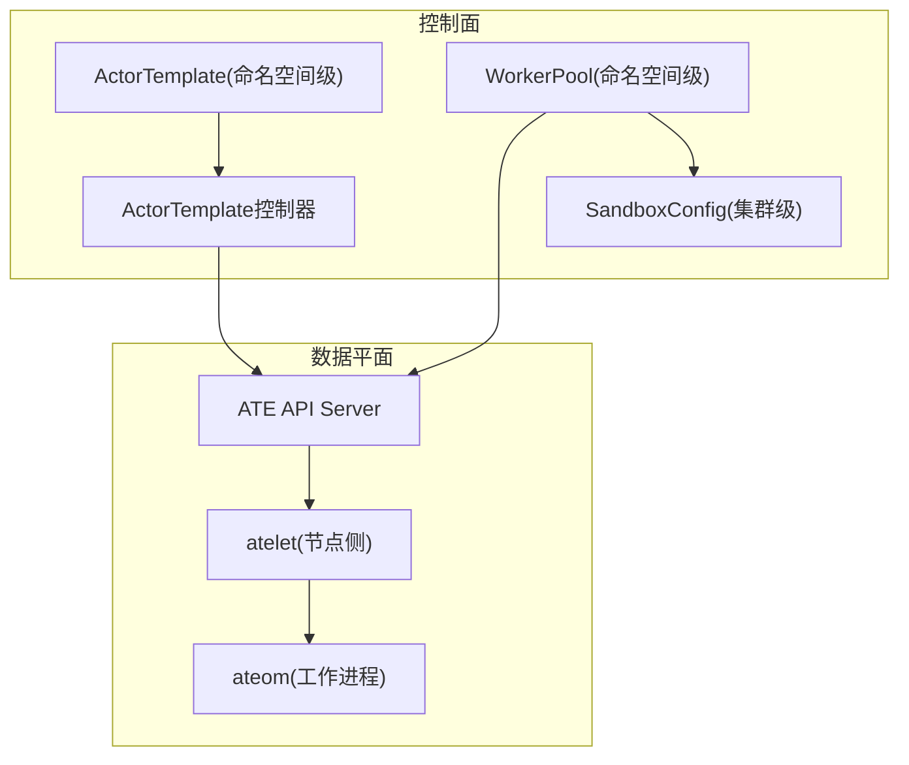
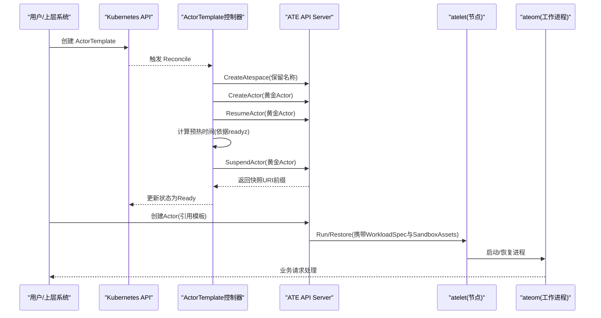
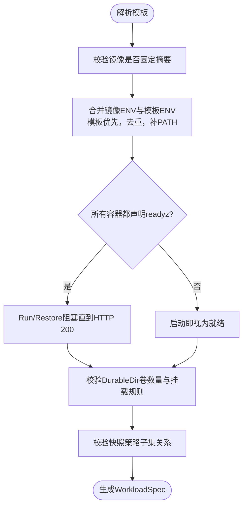
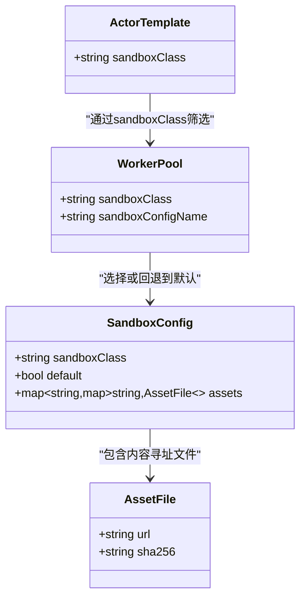
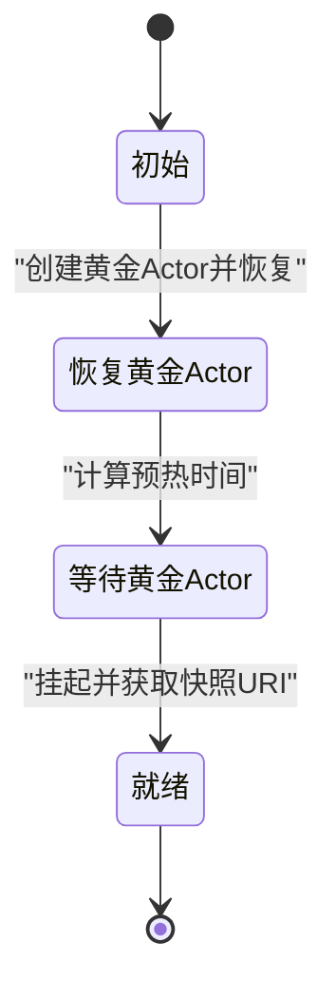
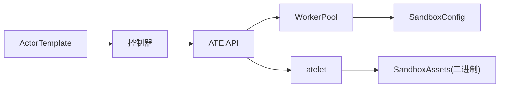

# ActorTemplate设计模式

<cite>
**本文引用的文件**   
- [actortemplate_types.go](file://pkg/api/v1alpha1/actortemplate_types.go)
- [sandboxconfig_types.go](file://pkg/api/v1alpha1/sandboxconfig_types.go)
- [actortemplate_controller.go](file://cmd/atecontroller/internal/controllers/actortemplate_controller.go)
- [workload_spec.go](file://cmd/ateapi/internal/controlapi/workload_spec.go)
- [workload_spec_test.go](file://cmd/ateapi/internal/controlapi/workload_spec_test.go)
- [sandbox_assets.go](file://cmd/ateapi/internal/controlapi/sandbox_assets.go)
- [workerpool_types.go](file://pkg/api/v1alpha1/workerpool_types.go)
- [api-guide.md](file://docs/api-guide.md)
- [architecture.md](file://docs/architecture.md)
- [README.md](file://demos/sandbox/README.md)
- [README.md](file://demos/counter/README.md)
- [README.md](file://demos/multi-template/README.md)
- [README.md](file://demos/agent-secret/README.md)
</cite>

## 目录
1. [简介](#简介)
2. [项目结构](#项目结构)
3. [核心组件](#核心组件)
4. [架构总览](#架构总览)
5. [详细组件分析](#详细组件分析)
6. [依赖关系分析](#依赖关系分析)
7. [性能与可观测性](#性能与可观测性)
8. [故障排查指南](#故障排查指南)
9. [结论](#结论)
10. [附录：模板示例与最佳实践](#附录模板示例与最佳实践)

## 简介
本文件围绕 ActorTemplate 的设计模式与配置方法展开，系统阐述如何通过模板定义 Actor 的运行时环境（容器镜像、环境变量、资源限制与安全上下文），并解释 SandboxConfig 的集成机制，说明如何将沙箱配置与 Actor 模板关联。文档同时提供多种实际场景的配置模式（基础应用、AI代理、微服务），并总结模板继承与组合的最佳实践，以及如何通过参数化配置实现灵活的 Actor 实例化。

## 项目结构
ActorTemplate 是集群中的命名空间级自定义资源，用于描述一个 Actor 的工作负载蓝图；SandboxConfig 是集群级资源，用于声明不同沙箱运行时的二进制资产；WorkerPool 负责调度与运行 Worker Pod，并通过 SandboxConfig 选择具体沙箱二进制。控制面控制器负责为 ActorTemplate 构建“黄金快照”，以便后续快速启动 Actor 实例。

图表来源
- [actortemplate_types.go:278-340](file://pkg/api/v1alpha1/actortemplate_types.go#L278-L340)
- [sandboxconfig_types.go:52-79](file://pkg/api/v1alpha1/sandboxconfig_types.go#L52-L79)
- [workerpool_types.go:54-80](file://pkg/api/v1alpha1/workerpool_types.go#L54-L80)
- [actortemplate_controller.go:66-187](file://cmd/atecontroller/internal/controllers/actortemplate_controller.go#L66-L187)

章节来源
- [actortemplate_types.go:278-340](file://pkg/api/v1alpha1/actortemplate_types.go#L278-L340)
- [sandboxconfig_types.go:52-79](file://pkg/api/v1alpha1/sandboxconfig_types.go#L52-L79)
- [workerpool_types.go:54-80](file://pkg/api/v1alpha1/workerpool_types.go#L54-L80)
- [actortemplate_controller.go:66-187](file://cmd/atecontroller/internal/controllers/actortemplate_controller.go#L66-L187)

## 核心组件
- ActorTemplateSpec
  - pauseImage：根沙箱容器的镜像，必须使用固定摘要（不可变）。
  - containers：工作负载容器列表，支持命令、参数、环境变量、就绪探针、卷挂载等。
  - snapshotsConfig：快照存储位置与范围策略（暂停时/提交时）。
  - sandboxClass：沙箱运行族（gvisor/microvm），决定 WorkerPool 的选择与快照兼容性。
  - workerSelector：将模板限定到匹配的 WorkerPool。
  - volumes：当前仅支持 DurableDir 类型卷，最多一个，且每个容器最多挂载一个该类型卷。
- ContainerReadyz：HTTP 就绪探针，未设置时沿用“启动即就绪”的旧行为。
- EnvVar/EnvVarSource：支持字面量与 SecretKeyRef，不支持 $(VAR) 插值。
- SandboxConfigSpec
  - sandboxClass：与 WorkerPool 一致，用于匹配。
  - default：集群默认标记（每类至多一个）。
  - assets：按架构与资产名映射的内容寻址文件集合（如 gVisor 的 runsc）。

章节来源
- [actortemplate_types.go:80-136](file://pkg/api/v1alpha1/actortemplate_types.go#L80-L136)
- [actortemplate_types.go:138-167](file://pkg/api/v1alpha1/actortemplate_types.go#L138-L167)
- [actortemplate_types.go:169-234](file://pkg/api/v1alpha1/actortemplate_types.go#L169-L234)
- [actortemplate_types.go:250-276](file://pkg/api/v1alpha1/actortemplate_types.go#L250-L276)
- [actortemplate_types.go:278-340](file://pkg/api/v1alpha1/actortemplate_types.go#L278-L340)
- [sandboxconfig_types.go:52-79](file://pkg/api/v1alpha1/sandboxconfig_types.go#L52-L79)

## 架构总览
ActorTemplate 的生命周期由控制器驱动：创建后进入初始阶段，控制器在专用 atespace 中创建“黄金 Actor”，恢复并等待其初始化完成，随后挂起以生成“黄金快照”。此后，基于该模板创建的 Actor 实例均可从快照快速恢复。

图表来源
- [actortemplate_controller.go:66-187](file://cmd/atecontroller/internal/controllers/actortemplate_controller.go#L66-L187)
- [api-guide.md:146-176](file://docs/api-guide.md#L146-L176)
- [architecture.md:191-218](file://docs/architecture.md#L191-L218)

章节来源
- [actortemplate_controller.go:66-187](file://cmd/atecontroller/internal/controllers/actortemplate_controller.go#L66-L187)
- [api-guide.md:146-176](file://docs/api-guide.md#L146-L176)
- [architecture.md:191-218](file://docs/architecture.md#L191-L218)

## 详细组件分析

### ActorTemplate 运行时环境定义
- 容器镜像与环境变量
  - 所有镜像必须固定摘要，保证快照可复现。
  - 环境变量支持字面量与 SecretKeyRef，最终合并顺序为“模板优先于镜像ENV”，并保证 PATH 存在。
- 就绪探针（readyz）
  - 若任一容器未声明 readyz，则采用“启动即就绪”的旧语义；全部容器均声明时，ResumeActor 会阻塞直到健康检查成功。
- 卷与持久化
  - 仅支持 DurableDir 类型卷，且模板内最多一个，单个容器最多挂载一个该类型卷。
- 快照策略
  - onPause/onCommit 支持 Full/Data，onCommit 必须是 onPause 的子集。
- 安全上下文
  - 当前模板未暴露独立的安全上下文字段；安全边界由沙箱运行族（gVisor/microvm）与 WorkerPod 调度约束共同保障。

图表来源
- [workload_spec.go:43-81](file://cmd/ateapi/internal/controlapi/workload_spec.go#L43-L81)
- [workload_spec_test.go:207-346](file://cmd/ateapi/internal/controlapi/workload_spec_test.go#L207-L346)
- [actortemplate_types.go:250-276](file://pkg/api/v1alpha1/actortemplate_types.go#L250-L276)
- [actortemplate_types.go:278-340](file://pkg/api/v1alpha1/actortemplate_types.go#L278-L340)

章节来源
- [workload_spec.go:43-81](file://cmd/ateapi/internal/controlapi/workload_spec.go#L43-L81)
- [workload_spec_test.go:207-346](file://cmd/ateapi/internal/controlapi/workload_spec_test.go#L207-L346)
- [actortemplate_types.go:250-276](file://pkg/api/v1alpha1/actortemplate_types.go#L250-L276)
- [actortemplate_types.go:278-340](file://pkg/api/v1alpha1/actortemplate_types.go#L278-L340)

### SandboxConfig 集成机制
- 作用域与用途
  - SandboxConfig 为集群级资源，描述某沙箱运行族所需的二进制资产（按架构与资产名映射）。
- 与 WorkerPool 的绑定
  - WorkerPool 指定 sandboxClass 与可选 sandboxConfigName；若未显式指定，则回退为该类的集群默认 SandboxConfig。
- 与 ActorTemplate 的关系
  - ActorTemplate 仅声明 sandboxClass，不直接包含沙箱二进制；运行时由 WorkerPool 解析 SandboxConfig，并将 SandboxAssets 下发给 atelet，用于拉取并缓存对应二进制。
- 生命周期与一致性
  - atelet 会在首次运行/恢复时记录沙箱资产，后续 Checkpoint 可复用同一版本，确保快照可重现。

图表来源
- [workerpool_types.go:54-80](file://pkg/api/v1alpha1/workerpool_types.go#L54-L80)
- [sandboxconfig_types.go:52-79](file://pkg/api/v1alpha1/sandboxconfig_types.go#L52-L79)
- [sandbox_assets.go:26-63](file://cmd/ateapi/internal/controlapi/sandbox_assets.go#L26-L63)

章节来源
- [workerpool_types.go:54-80](file://pkg/api/v1alpha1/workerpool_types.go#L54-L80)
- [sandboxconfig_types.go:52-79](file://pkg/api/v1alpha1/sandboxconfig_types.go#L52-L79)
- [sandbox_assets.go:26-63](file://cmd/ateapi/internal/controlapi/sandbox_assets.go#L26-L63)

### 控制面流程：黄金快照构建
- 阶段流转
  - Initial → ResumeGoldenActor → WaitGoldenActor → Ready
- 关键逻辑
  - 在专用 atespace 中创建黄金 Actor，调用 ResumeActor，根据 readyz 情况决定是否等待预热，再调用 SuspendActor 获取快照 URI 前缀，最后标记模板 Ready。

图表来源
- [actortemplate_controller.go:66-187](file://cmd/atecontroller/internal/controllers/actortemplate_controller.go#L66-L187)

章节来源
- [actortemplate_controller.go:66-187](file://cmd/atecontroller/internal/controllers/actortemplate_controller.go#L66-L187)

## 依赖关系分析
- 组件耦合
  - ActorTemplate 与 WorkerPool 通过 sandboxClass 进行弱耦合；SandboxConfig 解耦了二进制选择，避免模板与底层运行时强绑定。
- 外部依赖
  - atelet 负责拉取并缓存 SandboxAssets；Snapshot 存储指向对象存储（如 GCS）。
- 潜在循环依赖
  - 无直接循环；模板→控制器→API→节点侧链路清晰。

图表来源
- [actortemplate_controller.go:66-187](file://cmd/atecontroller/internal/controllers/actortemplate_controller.go#L66-L187)
- [sandbox_assets.go:26-63](file://cmd/ateapi/internal/controlapi/sandbox_assets.go#L26-L63)

章节来源
- [actortemplate_controller.go:66-187](file://cmd/atecontroller/internal/controllers/actortemplate_controller.go#L66-L187)
- [sandbox_assets.go:26-63](file://cmd/ateapi/internal/controlapi/sandbox_assets.go#L26-L63)

## 性能与可观测性
- 快速启动
  - 黄金快照使新 Actor 无需冷启动，显著降低首字节延迟。
- 就绪探针优化
  - 当所有容器均声明 readyz 时，预热时间为零，减少不必要的等待。
- 资源隔离
  - 通过 WorkerPool 的 NodeAffinity/Tolerations/Resources 对 Worker Pod 进行调度与资源限制，间接影响 Actor 的运行性能。
- 可观测性
  - 日志、指标与分布式追踪可在控制面与数据面采集，便于定位启动慢、快照失败等问题。

[本节为通用指导，不直接分析具体文件]

## 故障排查指南
- 模板未就绪
  - 检查控制器日志与模板状态条件，确认黄金快照是否成功生成。
- 镜像未固定摘要
  - 模板校验要求所有镜像必须固定摘要，否则拒绝创建。
- 快照策略冲突
  - onCommit 必须是 onPause 的子集，违反将导致校验失败。
- 沙箱二进制缺失或不匹配
  - 确认 WorkerPool 的 SandboxConfig 正确且可用，assets 的 URL 与 SHA256 一致。
- 就绪探针未就绪
  - 若容器未声明 readyz，平台认为启动即就绪；若声明但未返回 200，可能导致超时或重试。

章节来源
- [actortemplate_controller.go:66-187](file://cmd/atecontroller/internal/controllers/actortemplate_controller.go#L66-L187)
- [actortemplate_types.go:250-276](file://pkg/api/v1alpha1/actortemplate_types.go#L250-L276)
- [sandboxconfig_types.go:52-79](file://pkg/api/v1alpha1/sandboxconfig_types.go#L52-L79)

## 结论
ActorTemplate 通过声明式方式定义了 Actor 的运行时环境与快照策略，结合 SandboxConfig 实现了沙箱二进制的解耦管理。配合 WorkerPool 的调度与资源能力，能够灵活支撑从基础应用到 AI 代理与微服务的多样化场景。通过就绪探针与黄金快照，系统在可用性与性能之间取得良好平衡。

[本节为总结，不直接分析具体文件]

## 附录：模板示例与最佳实践

### 基础应用（HTTP 服务）
- 要点
  - 使用固定摘要镜像；声明 readyz 探针；配置快照存储位置；通过 workerSelector 限定池。
- 参考
  - [api-guide.md:146-176](file://docs/api-guide.md#L146-L176)

### AI 代理（自休眠与持久身份）
- 要点
  - 利用 Zero-Idle 自休眠与内存态快照，实现高并发密度与身份持久。
- 参考
  - [README.md](file://demos/agent-secret/README.md)

### 微服务（多模板共享池）
- 要点
  - 多个不同模板可共享同一 WorkerPool，通过统一标签选择器实现跨命名空间复用。
- 参考
  - [README.md](file://demos/multi-template/README.md)

### 沙箱执行环境（Alpine Shell）
- 要点
  - 在隔离环境中执行任意命令，文件系统状态跨会话保持。
- 参考
  - [README.md](file://demos/sandbox/README.md)

### 模板继承与组合最佳实践
- 建议
  - 将公共配置下沉到基线模板，通过不同的 snapshot/location 与 workerSelector 派生专用模板。
  - 使用 SandboxConfig 统一管理沙箱二进制，避免模板与运行时强耦合。
  - 通过环境变量注入敏感信息（SecretKeyRef），避免硬编码。
  - 为所有容器声明 readyz，以获得更精确的启动就绪判定。

### 参数化配置与灵活实例化
- 建议
  - 使用安装脚本或模板引擎注入 BUCKET_NAME 等参数，避免手动编辑清单。
  - 通过 labels 与 selector 实现多租户与多环境的池化复用。
  - 针对 microvm 与 gvisor 分别准备 SandboxConfig，按需切换 sandboxClass。

章节来源
- [api-guide.md:146-176](file://docs/api-guide.md#L146-L176)
- [README.md](file://demos/agent-secret/README.md)
- [README.md](file://demos/multi-template/README.md)
- [README.md](file://demos/sandbox/README.md)
- [README.md](file://demos/counter/README.md)
