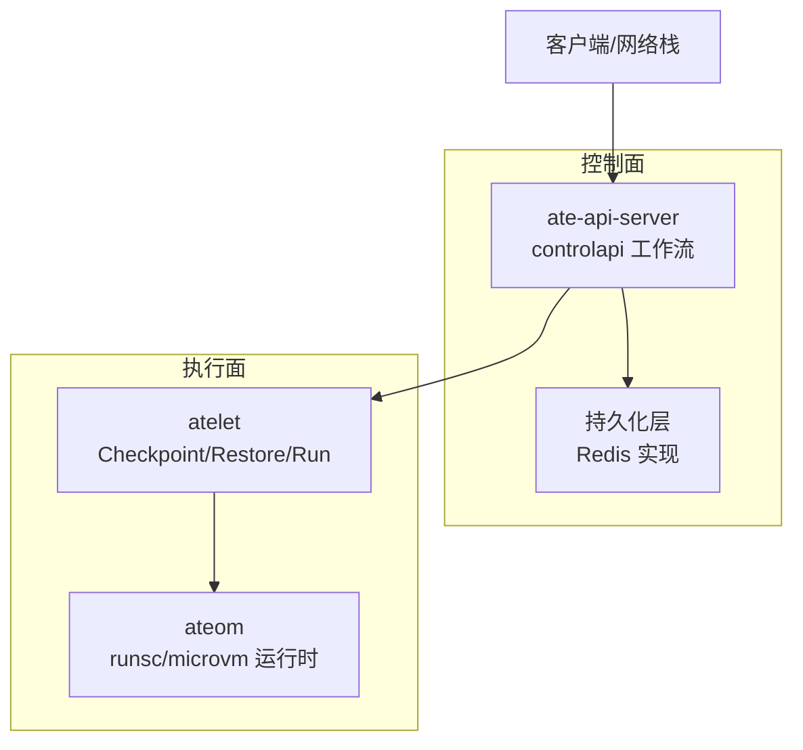
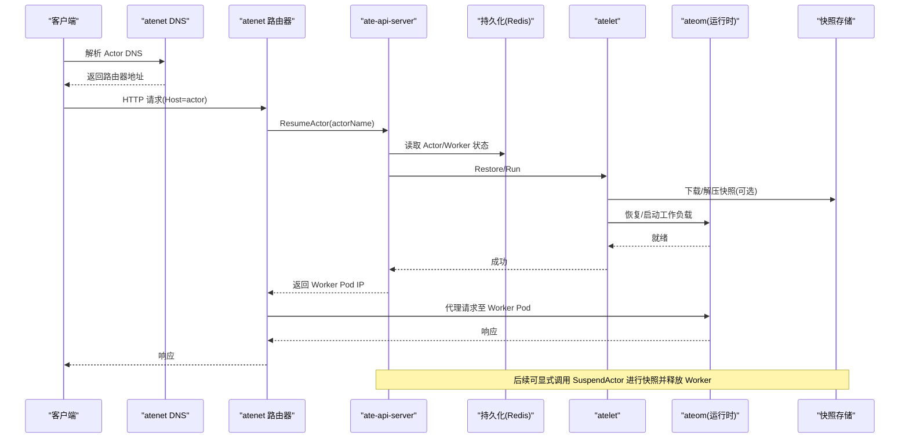
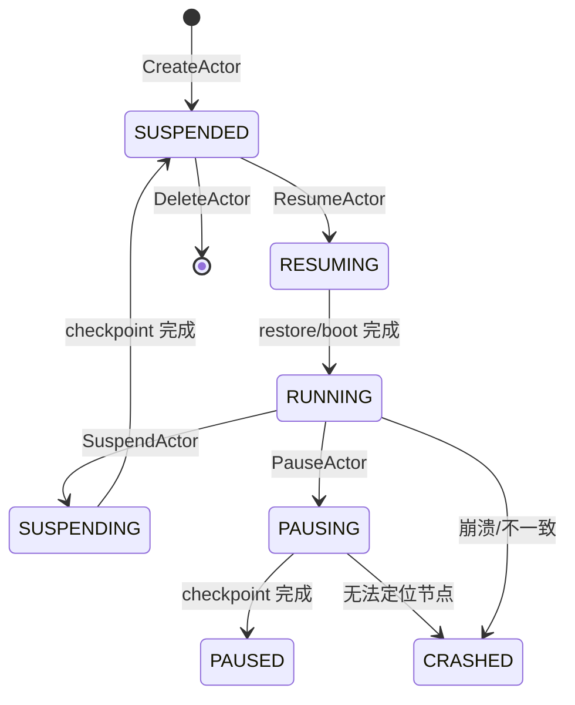
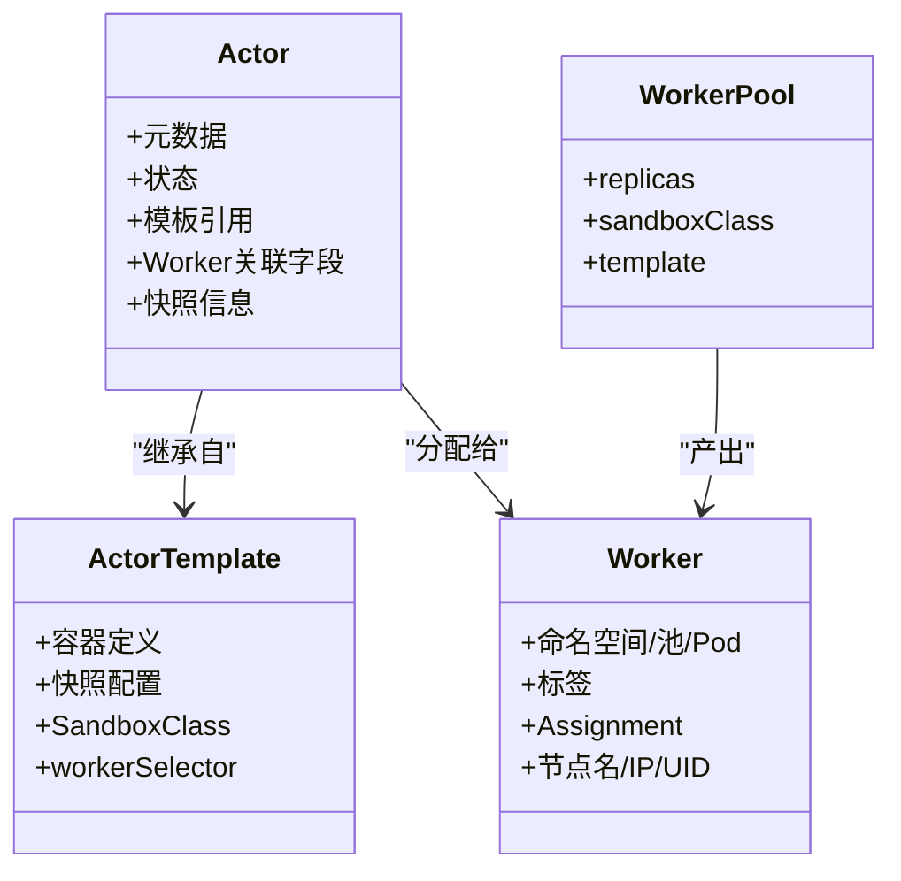
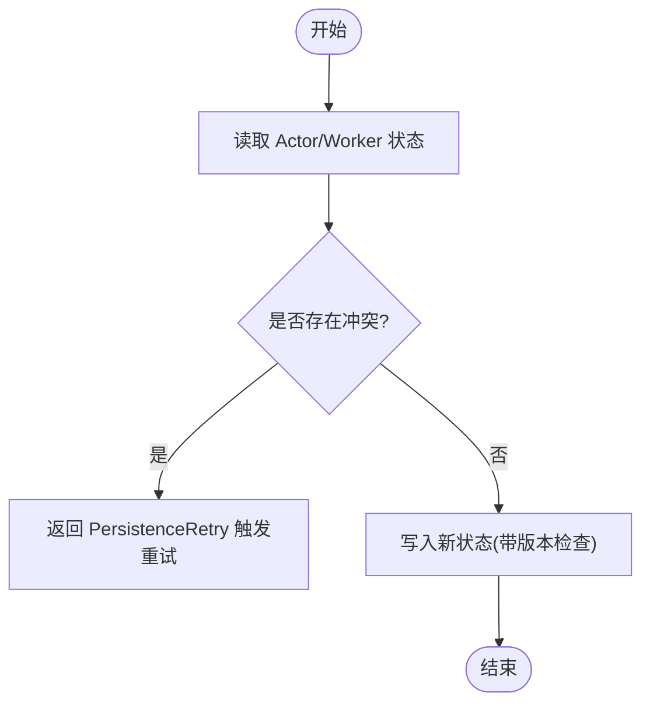
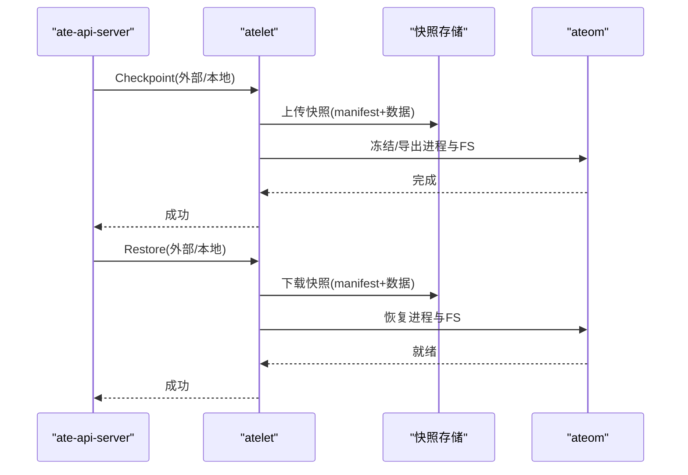
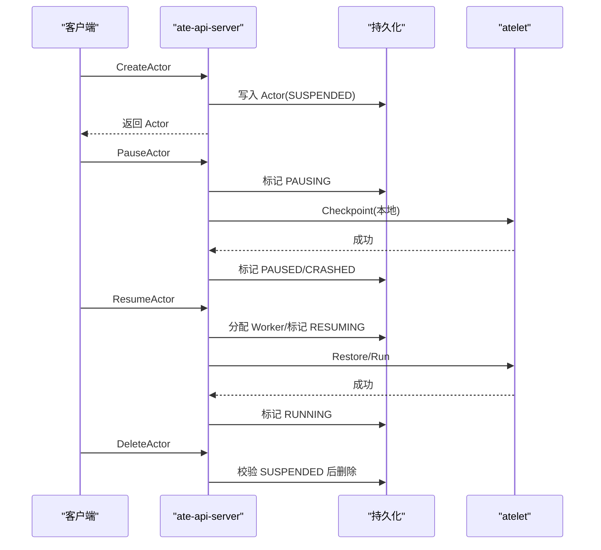
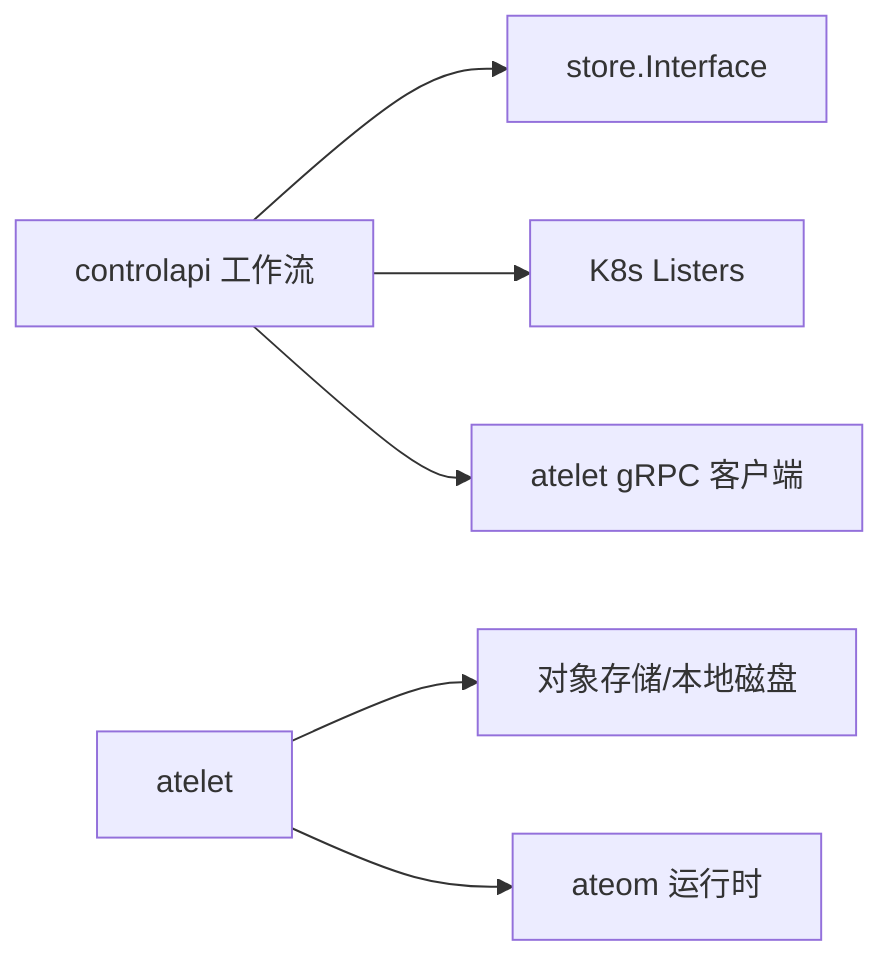

# Actor模型详解

<cite>
**本文引用的文件**   
- [actortemplate_types.go](file://pkg/api/v1alpha1/actortemplate_types.go)
- [workerpool_types.go](file://pkg/api/v1alpha1/workerpool_types.go)
- [create_actor.go](file://cmd/ateapi/internal/controlapi/create_actor.go)
- [resume_actor.go](file://cmd/ateapi/internal/controlapi/resume_actor.go)
- [pause_actor.go](file://cmd/ateapi/internal/controlapi/pause_actor.go)
- [workflow.go](file://cmd/ateapi/internal/controlapi/workflow.go)
- [workflow_resume.go](file://cmd/ateapi/internal/controlapi/workflow_resume.go)
- [workflow_suspend.go](file://cmd/ateapi/internal/controlapi/workflow_suspend.go)
- [workflow_pause.go](file://cmd/ateapi/internal/controlapi/workflow_pause.go)
- [store.go](file://cmd/ateapi/internal/store/store.go)
- [ateredis.go](file://cmd/ateapi/internal/store/ateredis/ateredis.go)
- [main.go（atelet）](file://cmd/atelet/main.go)
- [architecture.md](file://docs/architecture.md)
</cite>

## 目录
1. [简介](#简介)
2. [项目结构](#项目结构)
3. [核心组件](#核心组件)
4. [架构总览](#架构总览)
5. [详细组件分析](#详细组件分析)
6. [依赖关系分析](#依赖关系分析)
7. [性能考量](#性能考量)
8. [故障排查指南](#故障排查指南)
9. [结论](#结论)
10. [附录](#附录)

## 简介
本文件系统性阐述 Agent Substrate 中 Actor 模型的核心概念与实现原理。重点包括：
- Actor 作为无状态计算单元的设计思想，以及其生命周期管理（创建、暂停、恢复、删除）。
- 状态持久化机制与快照系统（内存快照、文件系统状态保存与恢复）。
- Actor 与 Worker 的映射关系，以及通过多路复用在有限工作节点上运行大量 Actor 实例的调度策略。
- ActorTemplate 的配置方法与最佳实践。
- 关键流程的时序图、流程图与类图，帮助读者快速理解并落地使用。

## 项目结构
围绕 Actor 模型的关键代码分布在以下模块：
- API 类型定义：ActorTemplate、WorkerPool 等 CRD 类型定义位于 pkg/api/v1alpha1。
- 控制面工作流：ateapi 内部 controlapi 包实现了 Actor 的生命周期工作流（Resume/Suspend/Pause），并通过通用工作流引擎编排步骤。
- 持久化层：store 接口与 Redis 实现，负责 Actor、Worker、Atespace 的状态存储与并发控制。
- 执行面：atelet 提供 Checkpoint/Restore/Run 等 RPC，驱动底层 ateom 完成沙箱进程的快照与恢复。
- 文档：docs/architecture.md 提供了端到端生命周期序列图与状态机。

图表来源
- [workflow.go:131-224](file://cmd/ateapi/internal/controlapi/workflow.go#L131-L224)
- [store.go:40-118](file://cmd/ateapi/internal/store/store.go#L40-L118)
- [main.go（atelet）:454-583](file://cmd/atelet/main.go#L454-L583)

章节来源
- [workflow.go:131-224](file://cmd/ateapi/internal/controlapi/workflow.go#L131-L224)
- [store.go:40-118](file://cmd/ateapi/internal/store/store.go#L40-L118)
- [main.go（atelet）:454-583](file://cmd/atelet/main.go#L454-L583)

## 核心组件
- Actor 工作流引擎：以“步骤”为单位编排 Resume/Suspend/Pause 操作，具备幂等性、前置条件校验与重试能力。
- 持久化接口与实现：统一抽象 Actor/Worker/Atespace 的 CRUD、乐观锁冲突处理、分布式锁与 Watch 订阅。
- 调度与多路复用：基于 Worker 缓存与标签选择器，将多个 Actor 分配到同一 Worker 上的不同沙箱实例，实现高倍率多路复用。
- 快照系统：支持 Full/Data 两种范围；Suspend 写外部快照，Pause 写本地快照；Resume 优先从最新快照恢复，否则回退到 golden snapshot 或按模板启动。

章节来源
- [workflow.go:36-129](file://cmd/ateapi/internal/controlapi/workflow.go#L36-L129)
- [store.go:40-118](file://cmd/ateapi/internal/store/store.go#L40-L118)
- [workflow_resume.go:119-140](file://cmd/ateapi/internal/controlapi/workflow_resume.go#L119-L140)
- [actortemplate_types.go:236-276](file://pkg/api/v1alpha1/actortemplate_types.go#L236-L276)

## 架构总览
下图展示了 Actor 从请求进入网络栈到最终在 Worker 上运行的完整路径，以及 Suspend/Pause 时的快照落盘与资源释放过程。

图表来源
- [architecture.md:353-396](file://docs/architecture.md#L353-L396)
- [workflow_resume.go:296-444](file://cmd/ateapi/internal/controlapi/workflow_resume.go#L296-L444)
- [workflow_suspend.go:108-168](file://cmd/ateapi/internal/controlapi/workflow_suspend.go#L108-L168)
- [main.go（atelet）:454-583](file://cmd/atelet/main.go#L454-L583)

## 详细组件分析

### 组件一：Actor 生命周期与工作流
- 工作流引擎：
  - 每个操作由若干“步骤”组成，步骤具备 IsComplete/CheckPrerequisite/Execute/RetryBackoff 四个方法。
  - RunWorkflow 串行执行步骤，支持幂等快进与持久化冲突自动重试。
- Resume 流程：
  - 加载 Actor 与模板 -> 分配 Worker（含标签与沙箱类匹配）-> 调用 atelet Restore/Run -> 标记 RUNNING。
- Suspend 流程：
  - 加载 Actor 与模板 -> 标记 SUSPENDING 并生成快照路径 -> 调用 atelet Checkpoint(外部) -> 释放 Worker 并标记 SUSPENDED。
- Pause 流程：
  - 加载 Actor 与模板 -> 标记 PAUSING 并生成快照路径 -> 调用 atelet Checkpoint(本地) -> 记录本地快照信息并标记 PAUSED（若丢失节点名则置为 CRASHED）。

图表来源
- [workflow.go:165-224](file://cmd/ateapi/internal/controlapi/workflow.go#L165-L224)
- [workflow_resume.go:142-252](file://cmd/ateapi/internal/controlapi/workflow_resume.go#L142-L252)
- [workflow_suspend.go:79-104](file://cmd/ateapi/internal/controlapi/workflow_suspend.go#L79-L104)
- [workflow_pause.go:78-103](file://cmd/ateapi/internal/controlapi/workflow_pause.go#L78-L103)

章节来源
- [workflow.go:36-129](file://cmd/ateapi/internal/controlapi/workflow.go#L36-L129)
- [workflow_resume.go:142-252](file://cmd/ateapi/internal/controlapi/workflow_resume.go#L142-L252)
- [workflow_suspend.go:79-104](file://cmd/ateapi/internal/controlapi/workflow_suspend.go#L79-L104)
- [workflow_pause.go:78-103](file://cmd/ateapi/internal/controlapi/workflow_pause.go#L78-L103)

### 组件二：Actor 与 Worker 的多路复用与调度
- 选择策略：
  - 仅考虑与模板 SandboxClass 匹配的 WorkerPool。
  - 同时满足模板 workerSelector 与 Actor 自身 worker_selector 的标签交集。
  - 优先选择拥有本地快照的节点（Pause 产生的本地快照），否则随机挑选空闲 Worker。
- 分配与释放：
  - 分配时更新 Worker.Assignment 并回填 Actor 的 Worker 字段（命名空间、Pod、IP、UID、池名）。
  - 释放时清空 Assignment，并清理 Actor 的 ActiveWorker 字段。
- 健壮性：
  - 若 Worker 不再符合条件或被其他 Actor 抢占，会尝试释放并 Crash 当前 Actor，避免悬挂。

图表来源
- [workflow_resume.go:119-140](file://cmd/ateapi/internal/controlapi/workflow_resume.go#L119-L140)
- [workflow_resume.go:163-252](file://cmd/ateapi/internal/controlapi/workflow_resume.go#L163-L252)
- [workflow_suspend.go:186-247](file://cmd/ateapi/internal/controlapi/workflow_suspend.go#L186-L247)
- [actortemplate_types.go:283-340](file://pkg/api/v1alpha1/actortemplate_types.go#L283-L340)
- [workerpool_types.go:54-89](file://pkg/api/v1alpha1/workerpool_types.go#L54-L89)

章节来源
- [workflow_resume.go:119-140](file://cmd/ateapi/internal/controlapi/workflow_resume.go#L119-L140)
- [workflow_resume.go:163-252](file://cmd/ateapi/internal/controlapi/workflow_resume.go#L163-L252)
- [workflow_suspend.go:186-247](file://cmd/ateapi/internal/controlapi/workflow_suspend.go#L186-L247)
- [actortemplate_types.go:283-340](file://pkg/api/v1alpha1/actortemplate_types.go#L283-L340)
- [workerpool_types.go:54-89](file://pkg/api/v1alpha1/workerpool_types.go#L54-L89)

### 组件三：状态持久化与并发控制
- 持久化接口：
  - 提供 Actor/Worker/Atespace 的增删改查、分页列表、Watch 订阅、分布式锁等能力。
  - 明确错误语义：NotFound、AlreadyExists、PersistenceRetry（版本冲突）、FailedPrecondition。
- Redis 实现要点：
  - 键空间隔离（actor:<atespace>:<name>），JSON 序列化 Protobuf。
  - 乐观锁通过版本号比对，冲突时返回 PersistenceRetry 供上层重试。
  - 分布式锁用于单 Actor 操作的互斥，带 TTL 与值校验释放。

图表来源
- [store.go:40-118](file://cmd/ateapi/internal/store/store.go#L40-L118)
- [ateredis.go:313-337](file://cmd/ateapi/internal/store/ateredis/ateredis.go#L313-L337)

章节来源
- [store.go:40-118](file://cmd/ateapi/internal/store/store.go#L40-L118)
- [ateredis.go:313-337](file://cmd/ateapi/internal/store/ateredis/ateredis.go#L313-L337)

### 组件四：快照系统与状态持久化细节
- 快照范围：
  - Full：进程内存 + rootfs 增量（含 DurableDir 卷）。
  - Data：仅包含支持快照的卷内容（如 DurableDir）。
- 触发时机：
  - Suspend：外部快照（对象存储），完成后释放 Worker。
  - Pause：本地快照（节点磁盘），记录节点名以便后续 Resume 就近恢复。
- 恢复优先级：
  - 优先 Actor 最新快照；若无且模板存在 golden snapshot，则从 golden 恢复；否则按模板从零启动。
- atelet 职责：
  - 接收 Restore/Checkpoint/Run 请求，拉取/解压镜像与快照，调用 ateom 完成恢复/启动，并上传 manifest。

图表来源
- [actortemplate_types.go:236-276](file://pkg/api/v1alpha1/actortemplate_types.go#L236-L276)
- [workflow_suspend.go:130-168](file://cmd/ateapi/internal/controlapi/workflow_suspend.go#L130-L168)
- [workflow_pause.go:130-165](file://cmd/ateapi/internal/controlapi/workflow_pause.go#L130-L165)
- [main.go（atelet）:454-583](file://cmd/atelet/main.go#L454-L583)

章节来源
- [actortemplate_types.go:236-276](file://pkg/api/v1alpha1/actortemplate_types.go#L236-L276)
- [workflow_suspend.go:130-168](file://cmd/ateapi/internal/controlapi/workflow_suspend.go#L130-L168)
- [workflow_pause.go:130-165](file://cmd/ateapi/internal/controlapi/workflow_pause.go#L130-L165)
- [main.go（atelet）:454-583](file://cmd/atelet/main.go#L454-L583)

### 组件五：Actor 定义与 ActorTemplate 配置
- 基本字段：
  - pauseImage：根沙箱容器镜像（必须固定版本）。
  - containers：工作负载容器定义（镜像、命令、参数、环境变量、readiness、卷挂载）。
  - snapshotsConfig：快照位置与范围（onPause/onCommit）。
  - sandboxClass：gvisor 或 microvm（影响 WorkerPool 选择与快照可移植性）。
  - workerSelector：限制可用的 WorkerPool 集合。
  - volumes/volumeMounts：声明持久卷（目前支持 durableDir）。
- 最佳实践：
  - 所有镜像必须固定版本（变更即失效快照）。
  - 合理设置 readiness 探针，确保服务真正就绪后再暴露流量。
  - 根据业务需求选择 SnapshotScope：对冷启动敏感场景可用 Data 模式减少 I/O。
  - 使用 workerSelector 精细控制调度域，结合节点亲和与污点容忍优化放置。

章节来源
- [actortemplate_types.go:283-340](file://pkg/api/v1alpha1/actortemplate_types.go#L283-L340)
- [actortemplate_types.go:80-136](file://pkg/api/v1alpha1/actortemplate_types.go#L80-L136)
- [actortemplate_types.go:236-276](file://pkg/api/v1alpha1/actortemplate_types.go#L236-L276)

### 组件六：创建、暂停、恢复、删除的具体流程
- 创建 Actor：
  - 校验模板与 atespace 存在 -> 写入初始 SUSPENDED 状态 -> 返回 Actor。
- 暂停 Actor：
  - 校验状态 -> 标记 SUSPENDING -> 调用 atelet Checkpoint(外部) -> 释放 Worker -> 标记 SUSPENDED。
- 恢复 Actor：
  - 校验状态 -> 分配 Worker -> 调用 atelet Restore/Run -> 标记 RUNNING。
- 删除 Actor：
  - 仅允许在 SUSPENDED 状态下删除。

图表来源
- [create_actor.go:32-82](file://cmd/ateapi/internal/controlapi/create_actor.go#L32-L82)
- [pause_actor.go:29-48](file://cmd/ateapi/internal/controlapi/pause_actor.go#L29-L48)
- [resume_actor.go:29-48](file://cmd/ateapi/internal/controlapi/resume_actor.go#L29-L48)
- [workflow_suspend.go:186-247](file://cmd/ateapi/internal/controlapi/workflow_suspend.go#L186-L247)
- [workflow_pause.go:188-264](file://cmd/ateapi/internal/controlapi/workflow_pause.go#L188-L264)
- [workflow_resume.go:448-478](file://cmd/ateapi/internal/controlapi/workflow_resume.go#L448-L478)

章节来源
- [create_actor.go:32-82](file://cmd/ateapi/internal/controlapi/create_actor.go#L32-L82)
- [pause_actor.go:29-48](file://cmd/ateapi/internal/controlapi/pause_actor.go#L29-L48)
- [resume_actor.go:29-48](file://cmd/ateapi/internal/controlapi/resume_actor.go#L29-L48)
- [workflow_suspend.go:186-247](file://cmd/ateapi/internal/controlapi/workflow_suspend.go#L186-L247)
- [workflow_pause.go:188-264](file://cmd/ateapi/internal/controlapi/workflow_pause.go#L188-L264)
- [workflow_resume.go:448-478](file://cmd/ateapi/internal/controlapi/workflow_resume.go#L448-L478)

## 依赖关系分析
- 控制面依赖：
  - controlapi 依赖 store.Interface 与 listers（ActorTemplate/WorkerPool/SandboxConfig），以及 atelet gRPC 客户端。
  - 工作流步骤之间通过共享输入/状态上下文传递 Actor、Worker、模板等信息。
- 执行面依赖：
  - atelet 依赖 GCS/rustfs 等对象存储与 ateom 运行时，完成镜像与快照的拉取与恢复。
- 外部依赖：
  - Redis 集群作为持久化后端，提供原子性与 Pub/Sub 通知能力。

图表来源
- [workflow.go:131-163](file://cmd/ateapi/internal/controlapi/workflow.go#L131-L163)
- [store.go:40-118](file://cmd/ateapi/internal/store/store.go#L40-L118)
- [main.go（atelet）:454-583](file://cmd/atelet/main.go#L454-L583)

章节来源
- [workflow.go:131-163](file://cmd/ateapi/internal/controlapi/workflow.go#L131-L163)
- [store.go:40-118](file://cmd/ateapi/internal/store/store.go#L40-L118)
- [main.go（atelet）:454-583](file://cmd/atelet/main.go#L454-L583)

## 性能考量
- 多路复用：
  - 通过标签选择与空闲 Worker 池，单个 Worker 可承载大量 Actor，显著降低资源开销。
- 快照范围：
  - Data 模式仅持久化卷数据，适合频繁暂停/恢复场景，降低 I/O 压力。
- 恢复路径：
  - 优先本地快照（Pause 产生）可减少跨节点传输延迟；外部快照适用于跨节点迁移。
- 并发与重试：
  - 持久化冲突采用指数退避重试，避免热点竞争导致的抖动。

[本节为通用指导，不直接分析具体文件]

## 故障排查指南
- 常见错误码与含义：
  - Aborted：并发更新冲突或另一操作正在进行，建议客户端重试。
  - NotFound：Actor/Worker 不存在。
  - FailedPrecondition：前置条件不满足（例如状态不允许该操作、Worker 不再符合选择器）。
- 诊断要点：
  - 检查 Actor 状态机是否处于预期阶段。
  - 确认 Worker 的 Assignment 是否与 Actor 一致，必要时手动释放悬挂分配。
  - 核查快照路径与对象存储连通性，确认 atelet 日志中的下载/解压耗时。
  - 对于 Pause 后无法 Resume 的情况，检查 LocalSnapshotInfo 的节点名是否有效。

章节来源
- [pause_actor.go:29-48](file://cmd/ateapi/internal/controlapi/pause_actor.go#L29-L48)
- [resume_actor.go:29-48](file://cmd/ateapi/internal/controlapi/resume_actor.go#L29-L48)
- [workflow_resume.go:309-348](file://cmd/ateapi/internal/controlapi/workflow_resume.go#L309-L348)
- [workflow_pause.go:117-128](file://cmd/ateapi/internal/controlapi/workflow_pause.go#L117-L128)

## 结论
Agent Substrate 的 Actor 模型通过“无状态计算单元 + 强一致性持久化 + 灵活快照系统 + 高效多路复用”的组合，实现了高吞吐、低成本的弹性执行环境。工作流引擎保证了操作的幂等与可恢复性，配合严格的 Worker 选择与释放策略，使系统在大规模场景下依然稳健可靠。

[本节为总结性内容，不直接分析具体文件]

## 附录
- 术语说明：
  - Actor：无状态计算单元，由模板派生，具有明确生命周期。
  - Worker：运行在 K8s Pod 中的轻量宿主，承载一个或多个 Actor 的沙箱实例。
  - Snapshot：进程与文件系统状态的快照，分为 Full 与 Data 两类。
  - Golden Snapshot：模板级预构建快照，用于加速首次启动。

[本节为概念性内容，不直接分析具体文件]
