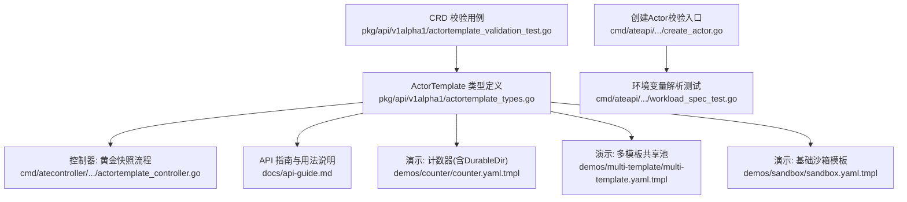
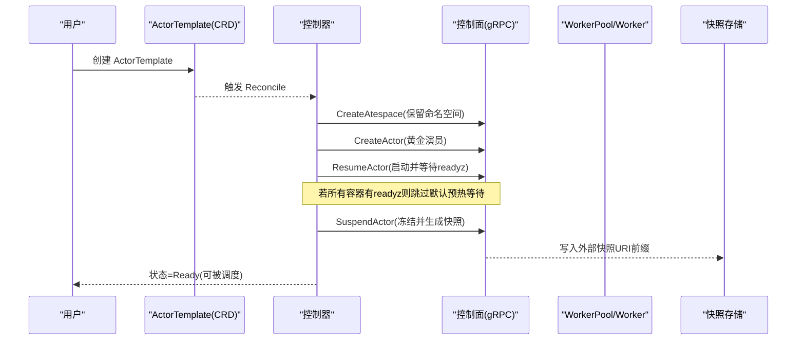
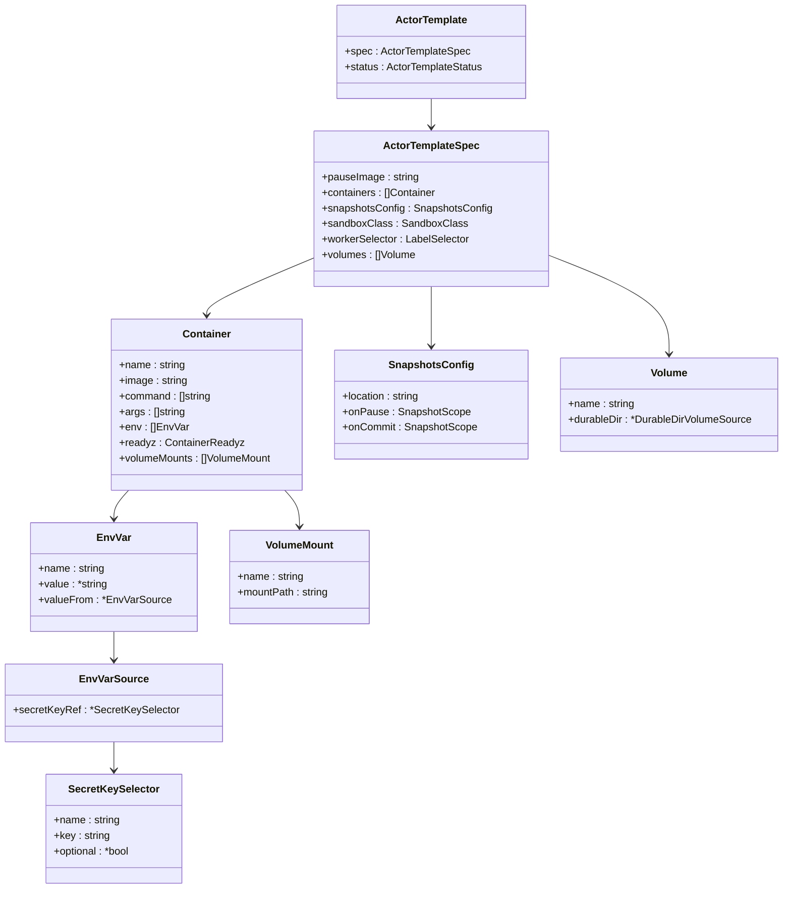

# Actor模板配置

<cite>
**本文引用的文件**   
- [actortemplate_types.go](file://pkg/api/v1alpha1/actortemplate_types.go)
- [actortemplate_controller.go](file://cmd/atecontroller/internal/controllers/actortemplate_controller.go)
- [api-guide.md](file://docs/api-guide.md)
- [counter.yaml.tmpl](file://demos/counter/counter.yaml.tmpl)
- [multi-template.yaml.tmpl](file://demos/multi-template/multi-template.yaml.tmpl)
- [sandbox.yaml.tmpl](file://demos/sandbox/sandbox.yaml.tmpl)
- [create_actor.go](file://cmd/ateapi/internal/controlapi/create_actor.go)
- [workload_spec_test.go](file://cmd/ateapi/internal/controlapi/workload_spec_test.go)
- [actortemplate_validation_test.go](file://pkg/api/v1alpha1/actortemplate_validation_test.go)
</cite>

## 目录
1. [简介](#简介)
2. [项目结构](#项目结构)
3. [核心组件](#核心组件)
4. [架构总览](#架构总览)
5. [详细组件分析](#详细组件分析)
6. [依赖关系分析](#依赖关系分析)
7. [性能与快照策略](#性能与快照策略)
8. [配置验证规则](#配置验证规则)
9. [常见错误排查](#常见错误排查)
10. [结论](#结论)
11. [附录：使用场景示例](#附录使用场景示例)

## 简介
本文件面向需要编写和运维 ActorTemplate 的用户，系统性说明容器定义、环境变量、卷挂载、健康检查、快照策略等关键配置项的使用方法、约束与最佳实践。同时提供多种典型场景的完整配置示例路径，并总结验证规则与常见问题定位方法。

## 项目结构
ActorTemplate 是 Substrate 中描述“工作负载蓝图”的核心资源，其类型定义、控制器逻辑、API 文档以及多个演示用例共同构成完整的配置体系。

图表来源
- [actortemplate_types.go:1-390](file://pkg/api/v1alpha1/actortemplate_types.go#L1-L390)
- [actortemplate_controller.go:1-211](file://cmd/atecontroller/internal/controllers/actortemplate_controller.go#L1-L211)
- [api-guide.md:1-311](file://docs/api-guide.md#L1-L311)
- [counter.yaml.tmpl:1-62](file://demos/counter/counter.yaml.tmpl#L1-L62)
- [multi-template.yaml.tmpl:1-82](file://demos/multi-template/multi-template.yaml.tmpl#L1-L82)
- [sandbox.yaml.tmpl:1-49](file://demos/sandbox/sandbox.yaml.tmpl#L1-L49)
- [create_actor.go:1-120](file://cmd/ateapi/internal/controlapi/create_actor.go#L1-L120)
- [workload_spec_test.go:207-465](file://cmd/ateapi/internal/controlapi/workload_spec_test.go#L207-L465)
- [actortemplate_validation_test.go:104-208](file://pkg/api/v1alpha1/actortemplate_validation_test.go#L104-L208)

章节来源
- [actortemplate_types.go:1-390](file://pkg/api/v1alpha1/actortemplate_types.go#L1-L390)
- [api-guide.md:1-311](file://docs/api-guide.md#L1-L311)

## 核心组件
- ActorTemplateSpec：定义暂停镜像、容器列表、快照配置、沙箱类、WorkerSelector、卷定义等。
- Container：描述单个进程（镜像、命令、参数、环境变量、就绪探针、卷挂载）。
- Volume/VolumeMount：声明持久化卷源（当前仅支持 durableDir）及其挂载点。
- SnapshotsConfig：快照存储位置、暂停时内容范围、提交时内容范围。
- EnvVar/EnvVarSource/SecretKeySelector：环境变量值来源（字面量或 Secret 引用）。
- HTTPGetAction/ContainerReadyz：HTTP 就绪探针配置。

章节来源
- [actortemplate_types.go:80-167](file://pkg/api/v1alpha1/actortemplate_types.go#L80-L167)
- [actortemplate_types.go:236-276](file://pkg/api/v1alpha1/actortemplate_types.go#L236-L276)
- [actortemplate_types.go:278-340](file://pkg/api/v1alpha1/actortemplate_types.go#L278-L340)
- [actortemplate_types.go:169-234](file://pkg/api/v1alpha1/actortemplate_types.go#L169-L234)

## 架构总览
ActorTemplate 在创建后由控制器驱动生成“黄金快照”，随后基于该快照快速恢复 Actor。

图表来源
- [actortemplate_controller.go:66-187](file://cmd/atecontroller/internal/controllers/actortemplate_controller.go#L66-L187)
- [api-guide.md:225-236](file://docs/api-guide.md#L225-L236)

## 详细组件分析

### 容器定义与运行参数
- 名称与镜像：必须为 DNS 标签格式；镜像必须通过摘要固定（包含 @sha256:...），否则拒绝。
- 命令与参数：command 覆盖 ENTRYPOINT/CMD；args 覆盖 CMD；若最终 argv 为空将失败。
- 环境变量：支持 value 字面量与 valueFrom.secretKeyRef；不支持 $(VAR) 展开与 envFrom。
- 就绪探针 readyz：可选 HTTP GET 探测，未设置时以底层启动完成即视为就绪。

章节来源
- [actortemplate_types.go:80-136](file://pkg/api/v1alpha1/actortemplate_types.go#L80-L136)
- [actortemplate_types.go:138-167](file://pkg/api/v1alpha1/actortemplate_types.go#L138-L167)
- [actortemplate_types.go:169-200](file://pkg/api/v1alpha1/actortemplate_types.go#L169-L200)
- [api-guide.md:113-146](file://docs/api-guide.md#L113-L146)

### 环境变量与密钥引用
- 解析时机：在将模板物化为工作负载规格时，从 ActorTemplate 所在命名空间读取 Secret。
- 行为差异：
  - 黄金演员：解析后的值会被捕获进黄金快照，后续 Actor 继承这些值直到重建黄金快照。
  - 绕过黄金快照的冷启动：解析值下发到 atelet，但不序列化到公开 Actor API。
- 可选性：SecretKeySelector 支持 Optional；缺失且 Required 会失败。

章节来源
- [api-guide.md:101](file://docs/api-guide.md#L101)
- [workload_spec_test.go:207-325](file://cmd/ateapi/internal/controlapi/workload_spec_test.go#L207-L325)

### 卷挂载与持久化目录
- 卷源：当前仅支持 durableDir，表示 rootfs 上的持久化目录，参与快照并在恢复后保持。
- 限制：
  - 每个 ActorTemplate 最多一个 durableDir 卷。
  - 每个容器最多挂载一个 durableDir 卷。
  - 不支持 microvm 沙箱类下使用 durableDir。
- 挂载路径：必须是干净的绝对 Unix 路径，不允许根路径、相对路径、尾随斜杠、重复斜杠、冒号、控制字符及 .. 组件等。

章节来源
- [actortemplate_types.go:32-78](file://pkg/api/v1alpha1/actortemplate_types.go#L32-L78)
- [actortemplate_types.go:280-282](file://pkg/api/v1alpha1/actortemplate_types.go#L280-L282)
- [actortemplate_validation_test.go:578-835](file://pkg/api/v1alpha1/actortemplate_validation_test.go#L578-L835)

### 健康检查（readyz）
- 作用：Run/Restore 仅在指定容器的 HTTP 端点返回 200 后才认为成功。
- 探测细节：内部网络直连容器 IP，短轮询、低延迟；整体等待有上限。
- 黄金快照预热：当所有容器都声明 readyz 时，控制器跳过默认预热等待；否则保留约 20s 安全窗口。

章节来源
- [actortemplate_types.go:124-167](file://pkg/api/v1alpha1/actortemplate_types.go#L124-L167)
- [api-guide.md:129-146](file://docs/api-guide.md#L129-L146)
- [actortemplate_controller.go:195-210](file://cmd/atecontroller/internal/controllers/actortemplate_controller.go#L195-L210)

### 快照配置（SnapshotsConfig）
- location：快照存储位置（如 GCS 路径），必填且长度大于 0。
- onPause：暂停时快照范围，默认 Full。
- onCommit：提交时快照范围，默认 Full；必须是 onPause 的子集。
- 影响：Full 包含进程内存与整个 rootfs 增量（含 durableDir）；Data 仅包含支持快照的卷内容。

章节来源
- [actortemplate_types.go:236-276](file://pkg/api/v1alpha1/actortemplate_types.go#L236-L276)
- [actortemplate_validation_test.go:501-542](file://pkg/api/v1alpha1/actortemplate_validation_test.go#L501-L542)

### 沙箱类与选择器
- sandboxClass：gvisor 或 microvm，作为硬门控，决定可匹配的 WorkerPool。
- workerSelector：按标签筛选可用 WorkerPool，只能缩小不能扩大 Actor 自身选择器集合。

章节来源
- [actortemplate_types.go:306-333](file://pkg/api/v1alpha1/actortemplate_types.go#L306-L333)
- [api-guide.md:99](file://docs/api-guide.md#L99)

## 依赖关系分析
- 控制器依赖控制面 gRPC 接口进行黄金演员生命周期管理。
- 控制面在创建 Actor 时对模板引用、命名空间、标签选择器等做校验。
- 环境变量解析依赖 K8s Secret 缓存与 TTL。

图表来源
- [actortemplate_types.go:80-167](file://pkg/api/v1alpha1/actortemplate_types.go#L80-L167)
- [actortemplate_types.go:236-276](file://pkg/api/v1alpha1/actortemplate_types.go#L236-L276)
- [actortemplate_types.go:278-340](file://pkg/api/v1alpha1/actortemplate_types.go#L278-L340)
- [actortemplate_types.go:169-234](file://pkg/api/v1alpha1/actortemplate_types.go#L169-L234)

章节来源
- [actortemplate_controller.go:66-187](file://cmd/atecontroller/internal/controllers/actortemplate_controller.go#L66-L187)
- [create_actor.go:84-120](file://cmd/ateapi/internal/controlapi/create_actor.go#L84-L120)
- [workload_spec_test.go:207-465](file://cmd/ateapi/internal/controlapi/workload_spec_test.go#L207-L465)

## 性能与快照策略
- 快照范围选择
  - Full：适合需要快速恢复且对一致性要求高的服务，但体积大、I/O 开销高。
  - Data：仅持久卷数据，体积小、速度快，适合无状态或易重建的进程。
- 路径规划建议
  - 将业务数据写入 durableDir 挂载路径，便于 Data 模式高效落盘。
  - 避免将大量临时文件放入 rootfs 非持久区域，减少 Full 快照体积。
- 预热与就绪
  - 为所有容器配置 readyz 可消除默认预热等待，缩短黄金快照准备时间。
  - 对于长初始化任务，建议在应用入口完成必要加载，以便黄金快照复用。

章节来源
- [actortemplate_types.go:236-276](file://pkg/api/v1alpha1/actortemplate_types.go#L236-L276)
- [api-guide.md:129-146](file://docs/api-guide.md#L129-L146)
- [actortemplate_controller.go:195-210](file://cmd/atecontroller/internal/controllers/actortemplate_controller.go#L195-L210)

## 配置验证规则
- 镜像必须固定（包含 @sha256:...），否则拒绝。
- pauseImage 必填且必须固定。
- snapshotsConfig.location 必填且长度 > 0。
- containers 数量上限、名称长度与合法性校验。
- command/args 最大条目数限制。
- volume 与 volumeMount 名称需符合 DNS 标签规范。
- mountPath 必须为干净绝对路径，禁止根路径、相对路径、尾随斜杠、重复斜杠、冒号、控制字符、.. 组件等。
- durableDir 卷数量与挂载限制：每模板最多一个，每容器最多挂载一个。
- sandboxClass=microvm 时不支持 durableDir。
- onCommit 必须是 onPause 的子集（包括默认值推导）。

章节来源
- [actortemplate_types.go:80-167](file://pkg/api/v1alpha1/actortemplate_types.go#L80-L167)
- [actortemplate_types.go:236-276](file://pkg/api/v1alpha1/actortemplate_types.go#L236-L276)
- [actortemplate_types.go:280-282](file://pkg/api/v1alpha1/actortemplate_types.go#L280-L282)
- [actortemplate_validation_test.go:104-208](file://pkg/api/v1alpha1/actortemplate_validation_test.go#L104-L208)
- [actortemplate_validation_test.go:501-542](file://pkg/api/v1alpha1/actortemplate_validation_test.go#L501-L542)
- [actortemplate_validation_test.go:578-835](file://pkg/api/v1alpha1/actortemplate_validation_test.go#L578-L835)

## 常见错误排查
- 镜像未固定导致拒绝：确保 image/pauseImage 包含 sha256 摘要。
- 环境变量解析失败：检查 Secret 是否存在、键名是否正确、Optional 是否误用。
- 挂载路径非法：确认 mountPath 为干净绝对路径，不含特殊字符与 ..。
- durableDir 冲突：检查是否超过单模板/单容器限制，或 microvm 沙箱类下使用了 durableDir。
- 就绪探针不生效：确认端口可达、路径合法、应用确实监听并返回 200。
- 快照策略不一致：确保 onCommit 是 onPause 的子集（含默认值情况）。

章节来源
- [workload_spec_test.go:207-325](file://cmd/ateapi/internal/controlapi/workload_spec_test.go#L207-L325)
- [actortemplate_validation_test.go:578-835](file://pkg/api/v1alpha1/actortemplate_validation_test.go#L578-L835)
- [actortemplate_validation_test.go:501-542](file://pkg/api/v1alpha1/actortemplate_validation_test.go#L501-L542)
- [api-guide.md:129-146](file://docs/api-guide.md#L129-L146)

## 结论
ActorTemplate 通过严格的类型与校验规则，结合就绪探针、持久卷与快照策略，提供了高性能、可恢复的工作负载编排能力。合理选择快照范围、规划数据路径、完善就绪探针与环境变量管理，是获得稳定与高效运行的关键。

## 附录：使用场景示例
以下示例可直接参考对应模板文件，按需调整命名空间、镜像与存储路径。

- Web 服务（带就绪探针与持久卷）
  - 示例路径：[counter.yaml.tmpl:35-62](file://demos/counter/counter.yaml.tmpl#L35-L62)
  - 要点：
    - 容器暴露 /readyz 端口用于就绪探测。
    - 使用 durableDir 挂载业务数据目录。
    - 快照策略：onPause=Full，onCommit=Data，location 指向对象存储路径。

- 批处理任务（无持久卷、快速提交）
  - 示例路径：[multi-template.yaml.tmpl:51-82](file://demos/multi-template/multi-template.yaml.tmpl#L51-L82)
  - 要点：
    - 两个不同二进制共用同一 WorkerPool，通过 workerSelector 匹配。
    - 快照仅配置 location，可按需设置 onCommit/Data 以提升吞吐。

- 微服务（环境变量注入）
  - 示例路径：[sandbox.yaml.tmpl:31-49](file://demos/sandbox/sandbox.yaml.tmpl#L31-L49)
  - 要点：
    - 通过 env.value 注入运行时参数。
    - 可通过 secretKeyRef 注入敏感信息（见环境变量章节）。

章节来源
- [counter.yaml.tmpl:35-62](file://demos/counter/counter.yaml.tmpl#L35-L62)
- [multi-template.yaml.tmpl:51-82](file://demos/multi-template/multi-template.yaml.tmpl#L51-L82)
- [sandbox.yaml.tmpl:31-49](file://demos/sandbox/sandbox.yaml.tmpl#L31-L49)
