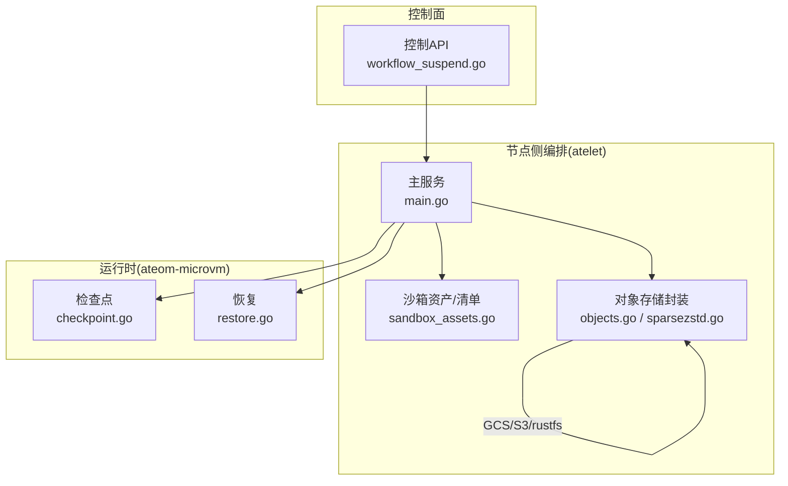
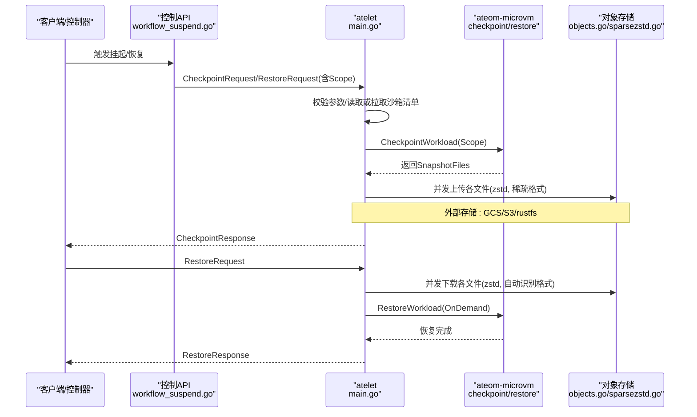
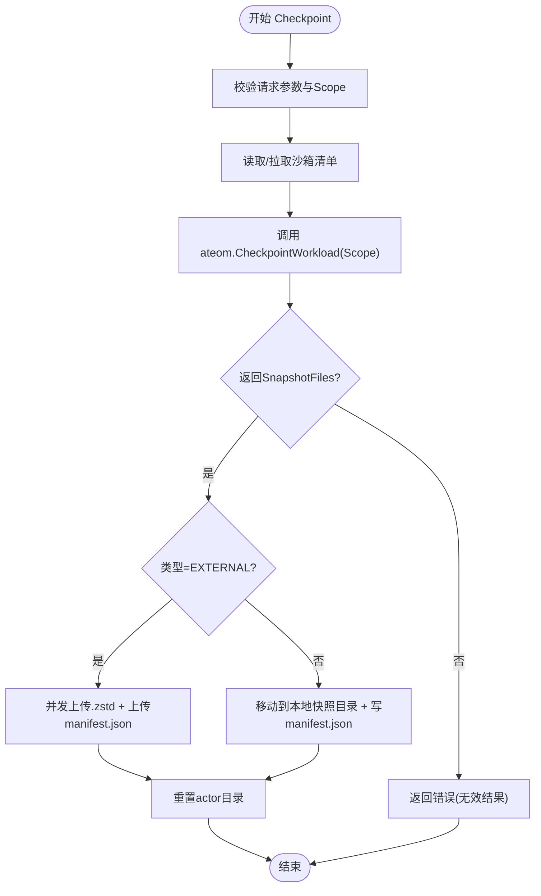
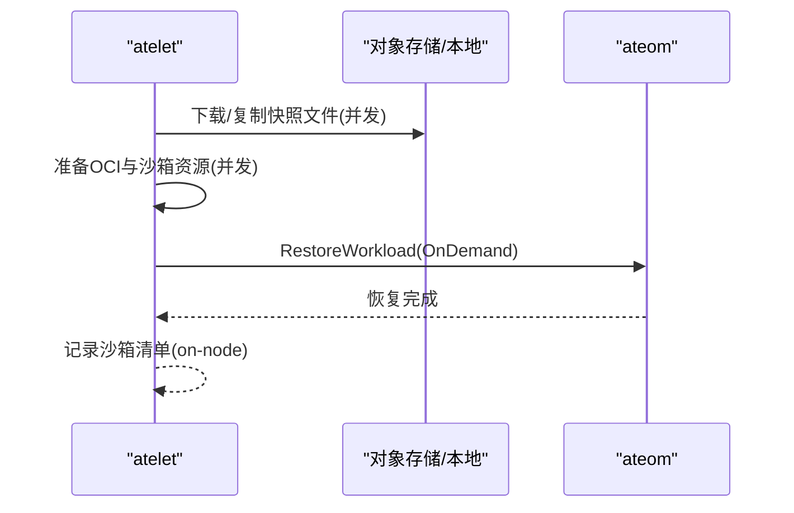
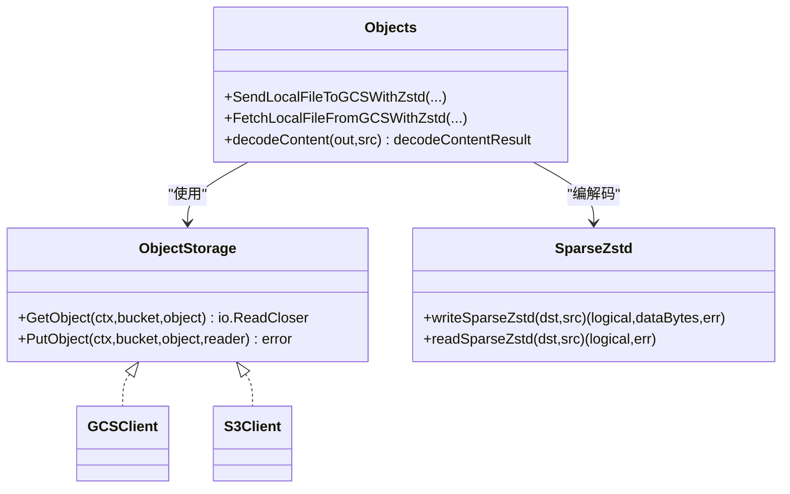
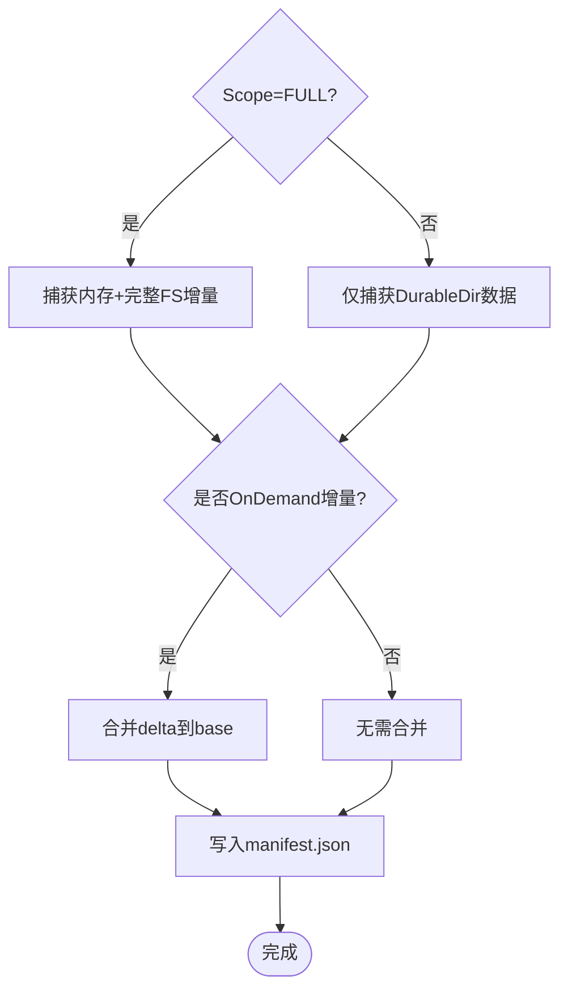
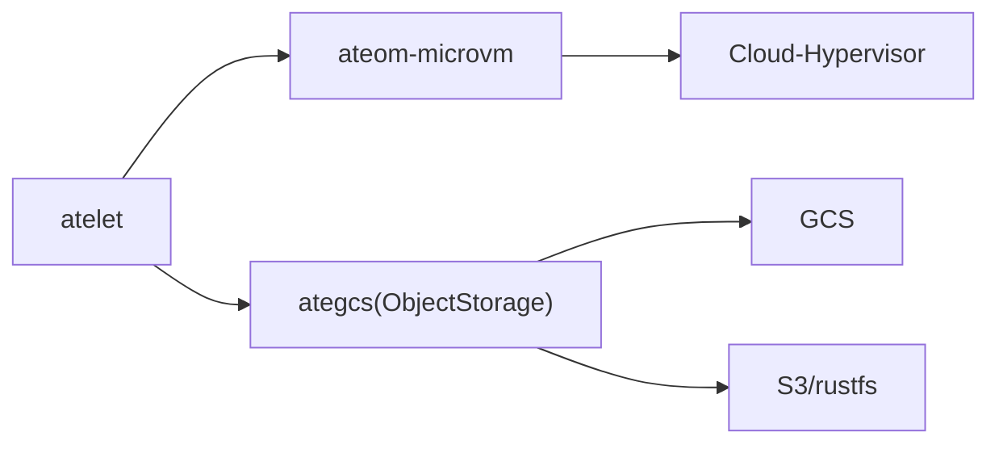

# Actor状态持久化

<cite>
**本文引用的文件**   
- [cmd/atelet/main.go](file://cmd/atelet/main.go)
- [cmd/ateom-microvm/checkpoint.go](file://cmd/ateom-microvm/checkpoint.go)
- [cmd/ateom-microvm/restore.go](file://cmd/ateom-microvm/restore.go)
- [cmd/atelet/sandbox_assets.go](file://cmd/atelet/sandbox_assets.go)
- [cmd/atelet/internal/ategcs/objects.go](file://cmd/atelet/internal/ategcs/objects.go)
- [cmd/atelet/internal/ategcs/sparsezstd.go](file://cmd/atelet/internal/ategcs/sparsezstd.go)
- [internal/proto/ateletpb/atelet.pb.go](file://internal/proto/ateletpb/atelet.pb.go)
- [cmd/ateapi/internal/controlapi/converter.go](file://cmd/ateapi/internal/controlapi/converter.go)
- [cmd/ateapi/internal/controlapi/workflow_suspend.go](file://cmd/ateapi/internal/controlapi/workflow_suspend.go)
</cite>

## 目录
1. [简介](#简介)
2. [项目结构](#项目结构)
3. [核心组件](#核心组件)
4. [架构总览](#架构总览)
5. [详细组件分析](#详细组件分析)
6. [依赖关系分析](#依赖关系分析)
7. [性能考量](#性能考量)
8. [故障排查指南](#故障排查指南)
9. [结论](#结论)
10. [附录](#附录)

## 简介
本文件深入解析 Agent Substrate 中 Actor 状态持久化的实现原理与技术细节，重点覆盖：
- 内存快照的捕获机制（进程内存转储、文件系统增量备份、对象存储集成）
- 快照压缩传输与版本管理
- 一致性保证与恢复流程
- Data 与 Full 两种快照范围的区别与使用场景
- 快照配置最佳实践与性能优化建议

## 项目结构
围绕 Actor 状态持久化的关键代码分布在以下模块：
- atelet：节点侧编排服务，负责调用底层运行时进行快照/恢复、上传/下载快照、准备 OCI 镜像与沙箱资源、写入/读取快照清单
- ateom-microvm：微虚拟机运行时驱动，负责暂停 VM、生成 Cloud-Hypervisor 快照、合并增量、重建网络与 overlay 根文件系统并恢复
- ategcs：对象存储抽象与 zstd 压缩/稀疏格式编解码，支持 GCS/S3/rustfs 等后端
- API 层：将上层工作流中的快照范围映射到 atelet 协议

图表来源
- [cmd/atelet/main.go:309-380](file://cmd/atelet/main.go#L309-L380)
- [cmd/ateom-microvm/checkpoint.go:44-154](file://cmd/ateom-microvm/checkpoint.go#L44-L154)
- [cmd/ateom-microvm/restore.go:52-207](file://cmd/ateom-microvm/restore.go#L52-L207)
- [cmd/atelet/internal/ategcs/objects.go:156-251](file://cmd/atelet/internal/ategcs/objects.go#L156-L251)
- [cmd/atelet/internal/ategcs/sparsezstd.go:47-135](file://cmd/atelet/internal/ategcs/sparsezstd.go#L47-L135)
- [cmd/ateapi/internal/controlapi/workflow_suspend.go:144-168](file://cmd/ateapi/internal/controlapi/workflow_suspend.go#L144-L168)

章节来源
- [cmd/atelet/main.go:309-380](file://cmd/atelet/main.go#L309-L380)
- [cmd/ateom-microvm/checkpoint.go:44-154](file://cmd/ateom-microvm/checkpoint.go#L44-L154)
- [cmd/ateom-microvm/restore.go:52-207](file://cmd/ateom-microvm/restore.go#L52-L207)
- [cmd/atelet/internal/ategcs/objects.go:156-251](file://cmd/atelet/internal/ategcs/objects.go#L156-L251)
- [cmd/atelet/internal/ategcs/sparsezstd.go:47-135](file://cmd/atelet/internal/ategcs/sparsezstd.go#L47-L135)
- [cmd/ateapi/internal/controlapi/workflow_suspend.go:144-168](file://cmd/ateapi/internal/controlapi/workflow_suspend.go#L144-L168)

## 核心组件
- atelet 主服务
  - 提供 Checkpoint/Restore 接口，协调 ateom 运行时、对象存储与本地缓存
  - 校验请求参数（类型、前缀、快照范围），记录/读取沙箱资产清单，并发上传/下载快照文件
- ateom-microvm 运行时
  - 通过 Cloud-Hypervisor API 执行 Pause -> Snapshot，必要时合并 OnDemand 增量，返回具体快照文件列表
  - 恢复时重写快照配置路径、重建 overlay 与网络、以 OnDemand 方式恢复并 Resume
- ategcs 对象存储与压缩
  - 统一 ObjectStorage 接口，适配 GCS/S3/rustfs
  - 稀疏扩展 zstd 格式：仅压缩非零数据块，保留空洞；兼容旧版纯 zstd 流
- 沙箱资产与清单
  - 在 Run/Restore 时记录运行时的沙箱二进制集合，在 Checkpoint 时将“快照文件列表”写入 manifest.json，使恢复自描述
- 协议与范围
  - SnapshotScope 枚举定义 FULL 与 DATA 两种范围，API 层将其映射至 atelet 协议

章节来源
- [cmd/atelet/main.go:309-380](file://cmd/atelet/main.go#L309-L380)
- [cmd/atelet/main.go:454-583](file://cmd/atelet/main.go#L454-L583)
- [cmd/ateom-microvm/checkpoint.go:44-154](file://cmd/ateom-microvm/checkpoint.go#L44-L154)
- [cmd/ateom-microvm/restore.go:52-207](file://cmd/ateom-microvm/restore.go#L52-L207)
- [cmd/atelet/internal/ategcs/objects.go:156-251](file://cmd/atelet/internal/ategcs/objects.go#L156-L251)
- [cmd/atelet/internal/ategcs/sparsezstd.go:47-135](file://cmd/atelet/internal/ategcs/sparsezstd.go#L47-L135)
- [cmd/atelet/sandbox_assets.go:38-68](file://cmd/atelet/sandbox_assets.go#L38-L68)
- [internal/proto/ateletpb/atelet.pb.go:136-162](file://internal/proto/ateletpb/atelet.pb.go#L136-L162)
- [cmd/ateapi/internal/controlapi/converter.go:24-35](file://cmd/ateapi/internal/controlapi/converter.go#L24-35)

## 架构总览
下图展示从触发挂起到恢复运行的端到端流程，包括快照范围选择、内存转储、增量合并、压缩传输与恢复。

图表来源
- [cmd/ateapi/internal/controlapi/workflow_suspend.go:144-168](file://cmd/ateapi/internal/controlapi/workflow_suspend.go#L144-L168)
- [cmd/atelet/main.go:309-380](file://cmd/atelet/main.go#L309-L380)
- [cmd/atelet/main.go:454-583](file://cmd/atelet/main.go#L454-L583)
- [cmd/ateom-microvm/checkpoint.go:44-154](file://cmd/ateom-microvm/checkpoint.go#L44-L154)
- [cmd/ateom-microvm/restore.go:52-207](file://cmd/ateom-microvm/restore.go#L52-L207)
- [cmd/atelet/internal/ategcs/objects.go:156-251](file://cmd/atelet/internal/ategcs/objects.go#L156-L251)
- [cmd/atelet/internal/ategcs/sparsezstd.go:47-135](file://cmd/atelet/internal/ategcs/sparsezstd.go#L47-L135)

## 详细组件分析

### 组件一：快照捕获与内存转储（Checkpoint）
- 入口与校验
  - Checkpoint 接收外部配置（外部对象存储前缀）或本地快照前缀，校验 Scope 为 FULL 或 DATA
  - 根据 on-node 记录的沙箱清单重新获取相同版本的沙箱二进制，确保可重现
- 运行时快照
  - ateom 调用 Cloud-Hypervisor 暂停 VM，生成快照文件集（包含 config.json、state.json、memory-ranges 等）
  - 若为 OnDemand 恢复后的增量快照，会将 delta 合并回 base，形成完整 memory-ranges
  - 返回精确的文件名列表给 atelet
- 快照落盘与清单
  - 外部模式：并发上传每个文件为 .zstd，最后上传 manifest.json（包含沙箱二进制与快照文件列表）
  - 本地模式：移动文件到本地快照目录，并写入 manifest.json
- 清理
  - 完成后重置 actor 临时目录，避免残留影响后续操作

图表来源
- [cmd/atelet/main.go:309-380](file://cmd/atelet/main.go#L309-L380)
- [cmd/ateom-microvm/checkpoint.go:44-154](file://cmd/ateom-microvm/checkpoint.go#L44-L154)
- [cmd/atelet/sandbox_assets.go:38-68](file://cmd/atelet/sandbox_assets.go#L38-L68)

章节来源
- [cmd/atelet/main.go:309-380](file://cmd/atelet/main.go#L309-L380)
- [cmd/ateom-microvm/checkpoint.go:44-154](file://cmd/ateom-microvm/checkpoint.go#L44-L154)
- [cmd/atelet/sandbox_assets.go:38-68](file://cmd/atelet/sandbox_assets.go#L38-L68)

### 组件二：快照恢复（Restore）
- 入口与校验
  - 校验类型与 Scope，按类型加载 manifest.json（外部对象存储或本地目录）
- 并行准备
  - 并发下载快照文件（外部）或复制本地快照文件（本地）
  - 并发准备 OCI 镜像与沙箱资源（拉取镜像、解包 bundle）
- 恢复执行
  - ateom 重写快照配置中的 socket 路径，重建 overlay 与网络，以 OnDemand 方式恢复 VM 并 Resume
  - 等待容器 readyz 就绪后完成
- 记录
  - 将本次使用的沙箱清单写入 on-node，供后续 Checkpoint 复用

图表来源
- [cmd/atelet/main.go:454-583](file://cmd/atelet/main.go#L454-L583)
- [cmd/ateom-microvm/restore.go:52-207](file://cmd/ateom-microvm/restore.go#L52-L207)

章节来源
- [cmd/atelet/main.go:454-583](file://cmd/atelet/main.go#L454-L583)
- [cmd/ateom-microvm/restore.go:52-207](file://cmd/ateom-microvm/restore.go#L52-L207)

### 组件三：压缩传输与稀疏格式（Sparse Extent Zstd）
- 上传路径
  - 对 seekable 文件采用稀疏扩展格式：仅编码非零 extent，跳过空洞，显著降低体积
  - 对非文件输入走纯 zstd 流，保持向后兼容
  - 根据后端能力选择流式上传（GCS）或缓冲到临时文件再上传（S3/rustfs）
- 下载路径
  - 自动识别头部 magic，区分稀疏格式与纯 zstd
  - 稀疏格式直接写出空洞文件；纯 zstd 也尽量以稀疏方式写出（跳过全零块）
- 版本管理
  - 格式头包含版本号，不兼容时拒绝解析，避免误读

图表来源
- [cmd/atelet/internal/ategcs/objects.go:37-40](file://cmd/atelet/internal/ategcs/objects.go#L37-L40)
- [cmd/atelet/internal/ategcs/objects.go:156-251](file://cmd/atelet/internal/ategcs/objects.go#L156-L251)
- [cmd/atelet/internal/ategcs/objects.go:341-384](file://cmd/atelet/internal/ategcs/objects.go#L341-L384)
- [cmd/atelet/internal/ategcs/sparsezstd.go:47-135](file://cmd/atelet/internal/ategcs/sparsezstd.go#L47-L135)
- [cmd/atelet/internal/ategcs/sparsezstd.go:137-196](file://cmd/atelet/internal/ategcs/sparsezstd.go#L137-L196)

章节来源
- [cmd/atelet/internal/ategcs/objects.go:156-251](file://cmd/atelet/internal/ategcs/objects.go#L156-L251)
- [cmd/atelet/internal/ategcs/objects.go:341-384](file://cmd/atelet/internal/ategcs/objects.go#L341-L384)
- [cmd/atelet/internal/ategcs/sparsezstd.go:47-135](file://cmd/atelet/internal/ategcs/sparsezstd.go#L47-L135)
- [cmd/atelet/internal/ategcs/sparsezstd.go:137-196](file://cmd/atelet/internal/ategcs/sparsezstd.go#L137-L196)

### 组件四：快照范围（Data vs Full）与一致性
- 范围定义
  - FULL：捕获进程内存与完整文件系统增量（含 DurableDir 卷）
  - DATA：仅捕获支持快照的数据卷内容（当前为 DurableDir），不包含内存与其他 rootfs 变更
- 一致性保证
  - 运行时在暂停状态下生成快照，避免写入竞争
  - OnDemand 恢复后的增量会在 Checkpoint 阶段合并回 base，确保最终快照自包含且可再次恢复
  - 清单 manifest.json 锁定沙箱二进制与快照文件列表，跨节点恢复保持一致性

图表来源
- [internal/proto/ateletpb/atelet.pb.go:136-162](file://internal/proto/ateletpb/atelet.pb.go#L136-L162)
- [cmd/ateom-microvm/checkpoint.go:105-123](file://cmd/ateom-microvm/checkpoint.go#L105-L123)
- [cmd/atelet/sandbox_assets.go:38-68](file://cmd/atelet/sandbox_assets.go#L38-L68)

章节来源
- [internal/proto/ateletpb/atelet.pb.go:136-162](file://internal/proto/ateletpb/atelet.pb.go#L136-L162)
- [cmd/ateom-microvm/checkpoint.go:105-123](file://cmd/ateom-microvm/checkpoint.go#L105-L123)
- [cmd/atelet/sandbox_assets.go:38-68](file://cmd/atelet/sandbox_assets.go#L38-L68)

### 组件五：API 层映射与工作流集成
- 工作流在挂起步骤中将上层 SnapshotScope 转换为 atelet 协议值，并携带外部快照前缀
- 转换函数对未知/空值默认回退为 FULL，保证兼容性

章节来源
- [cmd/ateapi/internal/controlapi/workflow_suspend.go:144-168](file://cmd/ateapi/internal/controlapi/workflow_suspend.go#L144-L168)
- [cmd/ateapi/internal/controlapi/converter.go:24-35](file://cmd/ateapi/internal/controlapi/converter.go#L24-35)

## 依赖关系分析
- atelet 依赖
  - ateom-microvm：通过 gRPC 调用 CheckpointWorkload/RestoreWorkload
  - ategcs：上传/下载快照文件，处理稀疏格式与后端差异
  - 沙箱资产：按清单拉取 runsc/cloud-hypervisor 等二进制，并缓存
- ateom-microvm 依赖
  - Cloud-Hypervisor API：Pause/Snapshot/Restore/Resume
  - 文件系统：overlay 根文件系统（RO lower 来自 OCI 镜像，RW upper 为 guest tmpfs）
- ategcs 依赖
  - 对象存储 SDK：GCS/S3/rustfs
  - zstd 库：高速压缩/解压，支持并发

图表来源
- [cmd/atelet/main.go:309-380](file://cmd/atelet/main.go#L309-L380)
- [cmd/atelet/main.go:454-583](file://cmd/atelet/main.go#L454-L583)
- [cmd/atelet/internal/ategcs/objects.go:156-251](file://cmd/atelet/internal/ategcs/objects.go#L156-L251)
- [cmd/ateom-microvm/checkpoint.go:44-154](file://cmd/ateom-microvm/checkpoint.go#L44-L154)
- [cmd/ateom-microvm/restore.go:52-207](file://cmd/ateom-microvm/restore.go#L52-L207)

章节来源
- [cmd/atelet/main.go:309-380](file://cmd/atelet/main.go#L309-L380)
- [cmd/atelet/main.go:454-583](file://cmd/atelet/main.go#L454-L583)
- [cmd/atelet/internal/ategcs/objects.go:156-251](file://cmd/atelet/internal/ategcs/objects.go#L156-L251)
- [cmd/ateom-microvm/checkpoint.go:44-154](file://cmd/ateom-microvm/checkpoint.go#L44-L154)
- [cmd/ateom-microvm/restore.go:52-207](file://cmd/ateom-microvm/restore.go#L52-L207)

## 性能考量
- 压缩策略
  - 上传使用 SpeedFastest 多核压缩，针对近零数据的内存镜像获得高吞吐与合理体积
  - 稀疏格式仅编码非零 extent，大幅减少 I/O 与网络负载
- 传输优化
  - 流式后端（GCS）：压缩与上传重叠，避免中间临时文件
  - 非流式后端（S3/rustfs）：先压缩到可寻址临时文件，再上传
- 恢复加速
  - OnDemand 恢复：按需缺页，显著缩短恢复时间并保持内存镜像稀疏
  - 并发下载与镜像解包：隐藏较长链路延迟
- 指标与观测
  - 记录快照大小直方图，便于监控与分析

章节来源
- [cmd/atelet/main.go:273-307](file://cmd/atelet/main.go#L273-L307)
- [cmd/atelet/internal/ategcs/objects.go:156-251](file://cmd/atelet/internal/ategcs/objects.go#L156-L251)
- [cmd/atelet/internal/ategcs/sparsezstd.go:47-135](file://cmd/atelet/internal/ategcs/sparsezstd.go#L47-L135)
- [cmd/ateom-microvm/restore.go:164-176](file://cmd/ateom-microvm/restore.go#L164-L176)

## 故障排查指南
- 常见错误与定位
  - 外部快照上传失败：会标记 Actor 崩溃，需检查对象存储权限、URL 前缀与网络连通性
  - 本地快照移动失败：检查磁盘空间、权限与路径有效性
  - 清单缺失或损坏：确认 manifest.json 是否存在且可读，校验沙箱二进制哈希
  - 恢复失败：检查 snapshot 配置路径重写、overlay 与网络重建日志
- 诊断要点
  - 查看 atelet 日志中的“Compressed zstd upload/download”统计（逻辑大小、实际写入、是否稀疏）
  - 核对 SnapshotFiles 列表是否与 manifest.json 一致
  - 验证 sparse 格式版本与 totalSize 合法性
- 恢复策略
  - 外部快照：优先重试上传/下载，必要时切换本地快照路径进行恢复
  - 本地快照：确保源目录未被破坏，必要时从其他节点拷贝快照

章节来源
- [cmd/atelet/main.go:360-380](file://cmd/atelet/main.go#L360-L380)
- [cmd/atelet/main.go:454-583](file://cmd/atelet/main.go#L454-L583)
- [cmd/atelet/sandbox_assets.go:243-266](file://cmd/atelet/sandbox_assets.go#L243-L266)
- [cmd/atelet/internal/ategcs/objects.go:341-384](file://cmd/atelet/internal/ategcs/objects.go#L341-L384)
- [cmd/atelet/internal/ategcs/sparsezstd.go:137-196](file://cmd/atelet/internal/ategcs/sparsezstd.go#L137-L196)

## 结论
Actor 状态持久化通过“运行时暂停 + 内存转储 + 增量合并 + 稀疏压缩 + 清单锁定”的组合，实现了高效、可移植且一致的快照能力。Data 与 Full 范围满足不同场景需求：前者聚焦数据卷，后者包含内存与完整文件系统增量。配合 OnDemand 恢复与并发传输，系统在可用性与性能之间取得良好平衡。

## 附录
- 快照范围语义
  - FULL：内存 + 完整 FS 增量（含 DurableDir）
  - DATA：仅 DurableDir 数据卷
- 清单字段说明
  - sandboxClass：沙箱类
  - assets：按名称映射的资产条目（url + sha256）
  - snapshotFiles：快照文件相对名列表（由运行时报告）

章节来源
- [internal/proto/ateletpb/atelet.pb.go:136-162](file://internal/proto/ateletpb/atelet.pb.go#L136-L162)
- [cmd/atelet/sandbox_assets.go:54-68](file://cmd/atelet/sandbox_assets.go#L54-L68)
