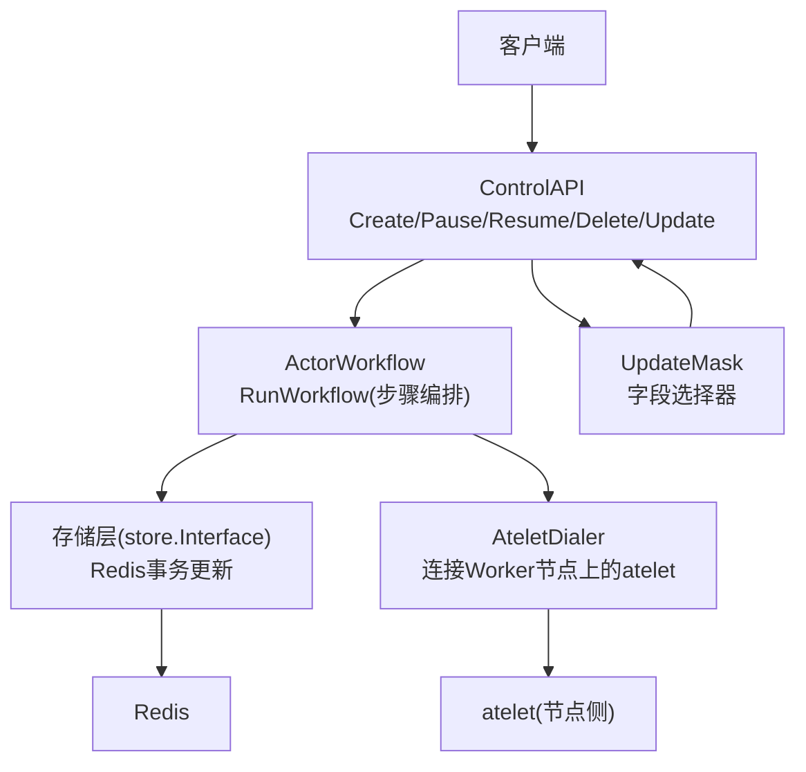
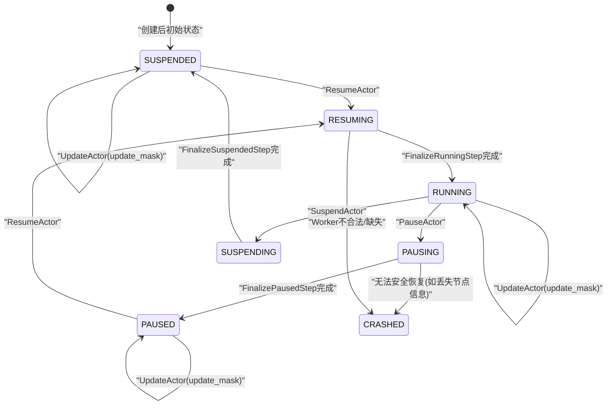
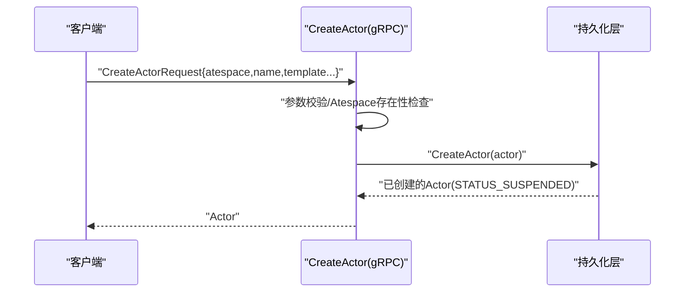
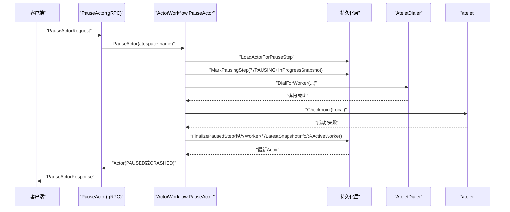
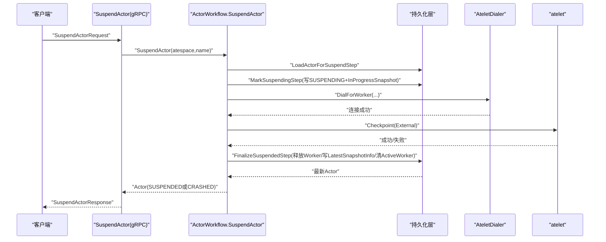
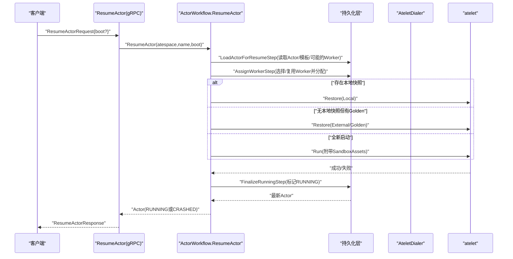
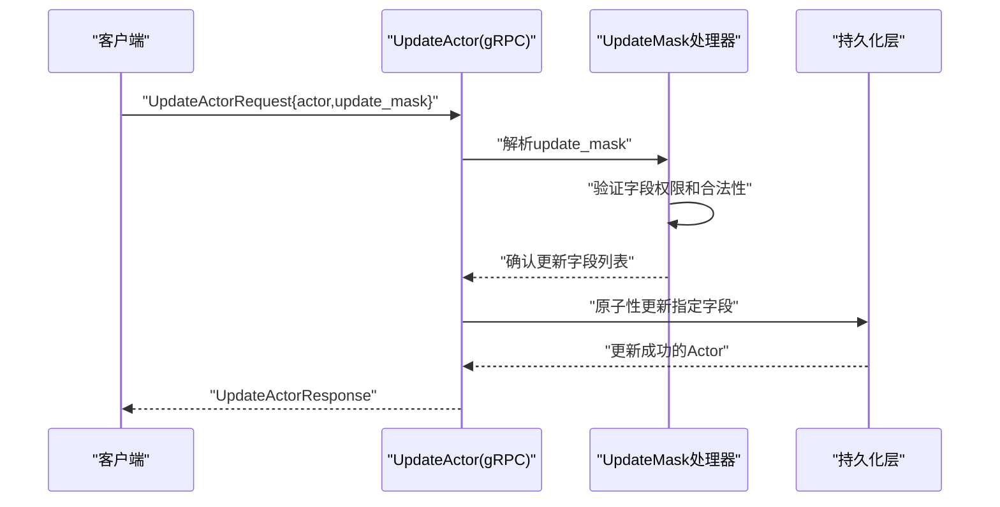
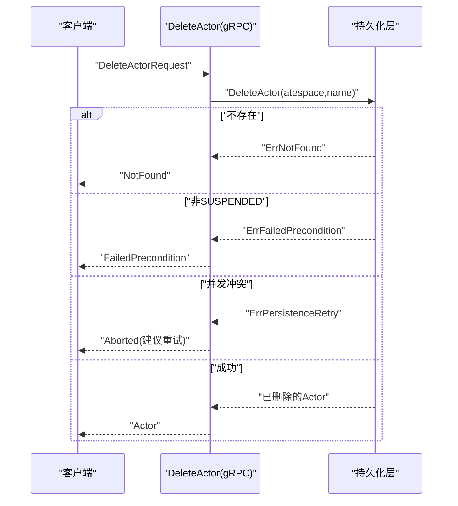
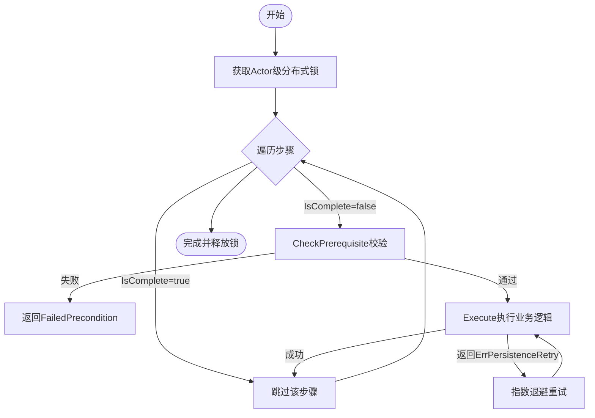
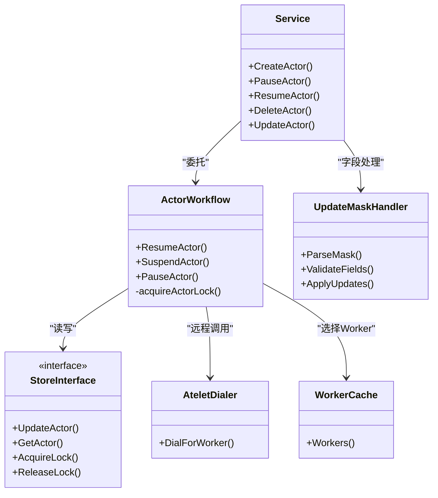

# Actor生命周期管理

<cite>
**本文引用的文件**   
- [create_actor.go](file://cmd/ateapi/internal/controlapi/create_actor.go)
- [pause_actor.go](file://cmd/ateapi/internal/controlapi/pause_actor.go)
- [resume_actor.go](file://cmd/ateapi/internal/controlapi/resume_actor.go)
- [delete_actor.go](file://cmd/ateapi/internal/controlapi/delete_actor.go)
- [update_actor.go](file://cmd/ateapi/internal/controlapi/update_actor.go)
- [update_mask.go](file://cmd/ateapi/internal/controlapi/update_mask.go)
- [workflow.go](file://cmd/ateapi/internal/controlapi/workflow.go)
- [workflow_resume.go](file://cmd/ateapi/internal/controlapi/workflow_resume.go)
- [workflow_suspend.go](file://cmd/ateapi/internal/controlapi/workflow_suspend.go)
- [workflow_pause.go](file://cmd/ateapi/internal/controlapi/workflow_pause.go)
- [ateapi.pb.go](file://pkg/proto/ateapipb/ateapi.pb.go)
- [ateredis.go](file://cmd/ateapi/internal/store/ateredis/ateredis.go)
</cite>

## 更新摘要
**所做更改**   
- 新增统一的update_mask机制支持选择性字段更新
- 增强API一致性，提供标准化的字段更新接口
- 改进Actor资源更新流程的灵活性和精确性

## 目录
1. [简介](#简介)
2. [项目结构](#项目结构)
3. [核心组件](#核心组件)
4. [架构总览](#架构总览)
5. [详细组件分析](#详细组件分析)
6. [依赖关系分析](#依赖关系分析)
7. [性能考量](#性能考量)
8. [故障排查指南](#故障排查指南)
9. [结论](#结论)
10. [附录](#附录)

## 简介
本文面向Agent Substrate中Actor的完整生命周期管理机制，覆盖从创建、暂停/恢复（含挂起）、删除等关键阶段。**最新更新**：引入统一的update_mask机制，支持选择性字段更新和更好的API一致性。重点阐述：
- 创建流程中的资源分配、沙箱初始化与网络配置要点
- 暂停与恢复过程中的状态保存与加载机制
- **新增**：基于update_mask的精确字段更新机制
- 删除操作中的资源清理与数据持久化
- 各状态转换的条件与触发机制
- API调用示例与错误处理策略
- 监控与故障恢复最佳实践

## 项目结构
本主题涉及的核心代码位于控制面API与服务编排层：
- gRPC接口实现：创建、暂停、恢复、删除、**更新**
- 工作流引擎：可重试、幂等的步骤式执行
- **update_mask机制**：标准化字段更新接口
- 存储层：基于Redis的事务性更新与并发冲突处理
- 协议定义：Actor状态枚举与请求/响应消息

图表来源
- [workflow.go:131-163](file://cmd/ateapi/internal/controlapi/workflow.go#L131-L163)
- [workflow.go:165-254](file://cmd/ateapi/internal/controlapi/workflow.go#L165-L254)
- [update_mask.go:1-100](file://cmd/ateapi/internal/controlapi/update_mask.go#L1-L100)
- [update_actor.go:1-150](file://cmd/ateapi/internal/controlapi/update_actor.go#L1-L150)

章节来源
- [workflow.go:131-163](file://cmd/ateapi/internal/controlapi/workflow.go#L131-L163)
- [workflow.go:165-254](file://cmd/ateapi/internal/controlapi/workflow.go#L165-L254)
- [update_mask.go:1-100](file://cmd/ateapi/internal/controlapi/update_mask.go#L1-L100)
- [update_actor.go:1-150](file://cmd/ateapi/internal/controlapi/update_actor.go#L1-L150)

## 核心组件
- ControlAPI服务：暴露gRPC接口，负责参数校验、权限与追踪上下文设置，并委托给工作流或持久化层。
- ActorWorkflow：以"步骤"为单位编排幂等流程，支持前置条件检查、快速前进与指数退避重试。
- **UpdateMask机制**：提供标准化的字段选择器，支持精确的部分更新操作。
- 存储层：通过Redis Watch+事务保证版本一致性；遇到并发冲突返回特定错误以便上层重试。
- atelet通信：通过AteletDialer连接目标Worker节点上的atelet，执行Checkpoint/Restore/Run等操作。

章节来源
- [create_actor.go:32-82](file://cmd/ateapi/internal/controlapi/create_actor.go#L32-L82)
- [pause_actor.go:29-48](file://cmd/ateapi/internal/controlapi/pause_actor.go#L29-L48)
- [resume_actor.go:29-48](file://cmd/ateapi/internal/controlapi/resume_actor.go#L29-L48)
- [delete_actor.go:30-55](file://cmd/ateapi/internal/controlapi/delete_actor.go#L30-L55)
- [update_actor.go:1-150](file://cmd/ateapi/internal/controlapi/update_actor.go#L1-L150)
- [update_mask.go:1-100](file://cmd/ateapi/internal/controlapi/update_mask.go#L1-L100)
- [workflow.go:36-108](file://cmd/ateapi/internal/controlapi/workflow.go#L36-L108)
- [workflow.go:165-254](file://cmd/ateapi/internal/controlapi/workflow.go#L165-L254)
- [ateredis.go:523-584](file://cmd/ateapi/internal/store/ateredis/ateredis.go#L523-L584)

## 架构总览
下图展示Actor从创建到运行、暂停/挂起、恢复、删除以及**更新**的关键路径与状态流转。

图表来源
- [workflow.go:165-254](file://cmd/ateapi/internal/controlapi/workflow.go#L165-L254)
- [workflow_resume.go:142-252](file://cmd/ateapi/internal/controlapi/workflow_resume.go#L142-L252)
- [workflow_resume.go:448-478](file://cmd/ateapi/internal/controlapi/workflow_resume.go#L448-L478)
- [workflow_pause.go:78-105](file://cmd/ateapi/internal/controlapi/workflow_pause.go#L78-L105)
- [workflow_pause.go:169-264](file://cmd/ateapi/internal/controlapi/workflow_pause.go#L169-L264)
- [workflow_suspend.go:79-104](file://cmd/ateapi/internal/controlapi/workflow_suspend.go#L79-L104)
- [workflow_suspend.go:172-247](file://cmd/ateapi/internal/controlapi/workflow_suspend.go#L172-L247)
- [update_actor.go:1-150](file://cmd/ateapi/internal/controlapi/update_actor.go#L1-L150)
- [ateapi.pb.go:41-76](file://pkg/proto/ateapipb/ateapi.pb.go#L41-L76)

## 详细组件分析

### 创建流程（CreateActor）
- 入口与校验：验证Actor元信息与模板命名空间/名称合法性，校验Atespace存在性。
- 记录状态：新建Actor对象，初始状态为SUSPENDED，写入持久化层。
- 后续启动：由外部调度在需要时调用ResumeActor进入RUNNING。

图表来源
- [create_actor.go:32-82](file://cmd/ateapi/internal/controlapi/create_actor.go#L32-L82)
- [create_actor.go:84-130](file://cmd/ateapi/internal/controlapi/create_actor.go#L84-L130)

章节来源
- [create_actor.go:32-82](file://cmd/ateapi/internal/controlapi/create_actor.go#L32-L82)
- [create_actor.go:84-130](file://cmd/ateapi/internal/controlapi/create_actor.go#L84-L130)

### 暂停流程（PauseActor）
- 目的：将RUNNING状态的Actor进行本地快照并释放Worker，进入PAUSED。
- 关键步骤：
  - 加载Actor与模板
  - 标记PAUSING并生成InProgressSnapshot
  - 调用atelet执行本地Checkpoint
  - 释放Worker并更新LatestSnapshotInfo为Local类型，清理ActiveWorker字段
- 异常路径：若Worker Pod不可用或节点信息缺失，可能直接置CRASHED以避免死锁。

图表来源
- [workflow.go:226-254](file://cmd/ateapi/internal/controlapi/workflow.go#L226-L254)
- [workflow_pause.go:78-105](file://cmd/ateapi/internal/controlapi/workflow_pause.go#L78-L105)
- [workflow_pause.go:107-165](file://cmd/ateapi/internal/controlapi/workflow_pause.go#L107-L165)
- [workflow_pause.go:169-264](file://cmd/ateapi/internal/controlapi/workflow_pause.go#L169-L264)

章节来源
- [workflow.go:226-254](file://cmd/ateapi/internal/controlapi/workflow.go#L226-L254)
- [workflow_pause.go:78-105](file://cmd/ateapi/internal/controlapi/workflow_pause.go#L78-L105)
- [workflow_pause.go:107-165](file://cmd/ateapi/internal/controlapi/workflow_pause.go#L107-L165)
- [workflow_pause.go:169-264](file://cmd/ateapi/internal/controlapi/workflow_pause.go#L169-L264)

### 挂起流程（SuspendActor）
- 目的：将RUNNING状态的Actor进行外部快照并释放Worker，进入SUSPENDED。
- 关键步骤：
  - 加载Actor与模板
  - 标记SUSPENDING并生成InProgressSnapshot（外部存储前缀）
  - 调用atelet执行外部Checkpoint
  - 释放Worker并将InProgressSnapshot落盘为LatestSnapshotInfo(External)，清理ActiveWorker字段

图表来源
- [workflow.go:196-224](file://cmd/ateapi/internal/controlapi/workflow.go#L196-224)
- [workflow_suspend.go:79-104](file://cmd/ateapi/internal/controlapi/workflow_suspend.go#L79-104)
- [workflow_suspend.go:108-168](file://cmd/ateapi/internal/controlapi/workflow_suspend.go#L108-168)
- [workflow_suspend.go:172-247](file://cmd/ateapi/internal/controlapi/workflow_suspend.go#L172-247)

章节来源
- [workflow.go:196-224](file://cmd/ateapi/internal/controlapi/workflow.go#L196-224)
- [workflow_suspend.go:79-104](file://cmd/ateapi/internal/controlapi/workflow_suspend.go#L79-104)
- [workflow_suspend.go:108-168](file://cmd/ateapi/internal/controlapi/workflow_suspend.go#L108-168)
- [workflow_suspend.go:172-247](file://cmd/ateapi/internal/controlapi/workflow_suspend.go#L172-247)

### 恢复流程（ResumeActor）
- 目的：从SUSPENDED或PAUSED恢复到RUNNING。
- 分支逻辑：
  - 若存在本地快照（PAUSED）：优先选择具备相同节点的Worker，避免跨节点迁移导致本地快照不可用。
  - 若无本地快照但模板有Golden Snapshot：从外部Golden快照恢复。
  - 否则：按模板Spec全新启动（包含沙箱二进制分发）。
- 关键步骤：
  - 加载Actor与模板，必要时复用已有Worker分配
  - 分配Worker（考虑标签选择器、沙箱类、节点限制）
  - 调用atelet执行Restore或Run
  - 最终标记RUNNING

图表来源
- [workflow.go:165-194](file://cmd/ateapi/internal/controlapi/workflow.go#L165-194)
- [workflow_resume.go:142-252](file://cmd/ateapi/internal/controlapi/workflow_resume.go#L142-252)
- [workflow_resume.go:296-446](file://cmd/ateapi/internal/controlapi/workflow_resume.go#L296-446)
- [workflow_resume.go:448-478](file://cmd/ateapi/internal/controlapi/workflow_resume.go#L448-478)

章节来源
- [workflow.go:165-194](file://cmd/ateapi/internal/controlapi/workflow.go#L165-194)
- [workflow_resume.go:142-252](file://cmd/ateapi/internal/controlapi/workflow_resume.go#L142-252)
- [workflow_resume.go:296-446](file://cmd/ateapi/internal/controlapi/workflow_resume.go#L296-446)
- [workflow_resume.go:448-478](file://cmd/ateapi/internal/controlapi/workflow_resume.go#L448-478)

### **新增：更新流程（UpdateActor）**
- **目的**：支持对Actor资源的精确字段更新，使用统一的update_mask机制确保API一致性。
- **关键特性**：
  - 基于update_mask的选择性字段更新
  - 严格的字段验证和权限检查
  - 原子性更新操作，保证数据一致性
- **工作流程**：
  - 解析update_mask确定要更新的字段
  - 验证字段值的合法性和权限
  - 执行原子性更新操作
  - 返回更新后的Actor状态

图表来源
- [update_actor.go:1-150](file://cmd/ateapi/internal/controlapi/update_actor.go#L1-150)
- [update_mask.go:1-100](file://cmd/ateapi/internal/controlapi/update_mask.go#L1-100)

章节来源
- [update_actor.go:1-150](file://cmd/ateapi/internal/controlapi/update_actor.go#L1-150)
- [update_mask.go:1-100](file://cmd/ateapi/internal/controlapi/update_mask.go#L1-100)

### 删除流程（DeleteActor）
- 约束：仅允许删除处于SUSPENDED状态的Actor，防止误删运行中实例。
- 行为：直接从持久化层删除Actor记录。

图表来源
- [delete_actor.go:30-55](file://cmd/ateapi/internal/controlapi/delete_actor.go#L30-55)

章节来源
- [delete_actor.go:30-55](file://cmd/ateapi/internal/controlapi/delete_actor.go#L30-55)

### 状态机与转换条件
- 可用状态：RESUMING、RUNNING、SUSPENDING、SUSPENDED、PAUSING、PAUSED、CRASHED。
- 典型转换：
  - SUSPENDED → RESUMING → RUNNING
  - RUNNING → PAUSING → PAUSED
  - RUNNING → SUSPENDING → SUSPENDED
  - PAUSED/SUSPENDED → RESUMING → RUNNING
  - 任意状态 → 自身：UpdateActor（通过update_mask）
  - 异常→CRASHED（如Worker不合法、节点信息丢失等）

章节来源
- [ateapi.pb.go:41-76](file://pkg/proto/ateapipb/ateapi.pb.go#L41-76)
- [workflow_resume.go:142-252](file://cmd/ateapi/internal/controlapi/workflow_resume.go#L142-252)
- [workflow_pause.go:78-105](file://cmd/ateapi/internal/controlapi/workflow_pause.go#L78-105)
- [workflow_suspend.go:79-104](file://cmd/ateapi/internal/controlapi/workflow_suspend.go#L79-104)
- [update_actor.go:1-150](file://cmd/ateapi/internal/controlapi/update_actor.go#L1-150)

### 幂等性与并发控制
- 工作流采用"客户端驱动的前向恢复"模式：每个步骤提供IsComplete用于快速前进，CheckPrerequisite确保状态边合法，Execute执行业务逻辑。
- 对易冲突的持久化更新使用指数退避重试，当底层返回特定错误时自动重试。
- 针对同一Actor的操作加分布式锁，避免并发竞态。

图表来源
- [workflow.go:36-108](file://cmd/ateapi/internal/controlapi/workflow.go#L36-108)
- [workflow.go:110-129](file://cmd/ateapi/internal/controlapi/workflow.go#L110-129)
- [workflow.go:256-279](file://cmd/ateapi/internal/controlapi/workflow.go#L256-279)

章节来源
- [workflow.go:36-108](file://cmd/ateapi/internal/controlapi/workflow.go#L36-108)
- [workflow.go:110-129](file://cmd/ateapi/internal/controlapi/workflow.go#L110-129)
- [workflow.go:256-279](file://cmd/ateapi/internal/controlapi/workflow.go#L256-279)

### 数据持久化与一致性
- 更新Actor/Worker采用Watch+事务，比较expectedVersion，不一致则返回特定错误供上层重试。
- 不可变字段（如名称、命名空间、模板引用等）在更新时被严格校验。
- **新增**：update_mask机制确保只有指定的字段被更新，提高操作的精确性和安全性。

章节来源
- [ateredis.go:523-584](file://cmd/ateapi/internal/store/ateredis/ateredis.go#L523-584)
- [update_mask.go:1-100](file://cmd/ateapi/internal/controlapi/update_mask.go#L1-100)

## 依赖关系分析
- ControlAPI依赖：
  - 持久化层store.Interface（读写Actor/Worker、分布式锁）
  - AteletDialer（连接atelet执行Checkpoint/Restore/Run）
  - Listers（ActorTemplate、WorkerPool、SandboxConfig）
  - Kubernetes客户端（解析Secret等）
  - **UpdateMask处理器**（字段选择和验证）
- 工作流依赖：
  - 步骤实现（Load/Mark/Call/Finalize）
  - 缓存（workerCache）加速Worker选择
- 存储依赖：
  - Redis（Watch+事务、版本号一致性）

图表来源
- [workflow.go:131-163](file://cmd/ateapi/internal/controlapi/workflow.go#L131-163)
- [workflow.go:165-254](file://cmd/ateapi/internal/controlapi/workflow.go#L165-254)
- [update_actor.go:1-150](file://cmd/ateapi/internal/controlapi/update_actor.go#L1-150)
- [update_mask.go:1-100](file://cmd/ateapi/internal/controlapi/update_mask.go#L1-100)

章节来源
- [workflow.go:131-163](file://cmd/ateapi/internal/controlapi/workflow.go#L131-163)
- [workflow.go:165-254](file://cmd/ateapi/internal/controlapi/workflow.go#L165-254)
- [update_actor.go:1-150](file://cmd/ateapi/internal/controlapi/update_actor.go#L1-150)
- [update_mask.go:1-100](file://cmd/ateapi/internal/controlapi/update_mask.go#L1-100)

## 性能考量
- 幂等与快速前进：已完成步骤直接跳过，减少重复IO与远程调用。
- 指数退避：对持久化冲突自动重试，降低瞬时竞争导致的失败率。
- Worker选择优化：结合标签选择器、沙箱类与节点限制，避免不必要的跨节点迁移。
- 分布式锁：避免同一Actor并发操作，缩短长尾延迟。
- **update_mask优化**：只更新必要的字段，减少数据传输和序列化开销。

[本节为通用指导，无需源码引用]

## 故障排查指南
- 常见错误码与含义：
  - NotFound：Actor不存在
  - FailedPrecondition：状态不满足（例如删除非SUSPENDED、步骤前置条件不满足）
  - Aborted：并发冲突或另一操作进行中，建议客户端重试
  - **InvalidArgument**：update_mask格式错误或字段权限不足
- 定位思路：
  - 查看当前Actor状态是否为预期（参考状态枚举）
  - 确认是否命中分布式锁（Aborted）
  - 检查Worker分配与可达性（DialForWorker失败、Pod消失）
  - 核对快照路径与类型（Local/External/Golden）
  - **验证update_mask的字段选择是否正确**
- 恢复策略：
  - 对Aborted错误实施带退避的重试
  - 对CRASHED状态，重新评估快照可用性并尝试从Golden快照恢复
  - 对Worker不合法或不匹配的情况，释放旧分配并重新选择
  - **对update_mask错误，检查字段权限和格式规范**

章节来源
- [pause_actor.go:35-48](file://cmd/ateapi/internal/controlapi/pause_actor.go#L35-48)
- [resume_actor.go:35-48](file://cmd/ateapi/internal/controlapi/resume_actor.go#L35-48)
- [delete_actor.go:36-55](file://cmd/ateapi/internal/controlapi/delete_actor.go#L36-55)
- [update_actor.go:1-150](file://cmd/ateapi/internal/controlapi/update_actor.go#L1-150)
- [update_mask.go:1-100](file://cmd/ateapi/internal/controlapi/update_mask.go#L1-100)
- [workflow.go:256-279](file://cmd/ateapi/internal/controlapi/workflow.go#L256-279)
- [workflow_resume.go:309-348](file://cmd/ateapi/internal/controlapi/workflow_resume.go#L309-348)
- [workflow_pause.go:117-128](file://cmd/ateapi/internal/controlapi/workflow_pause.go#L117-128)
- [workflow_suspend.go:118-129](file://cmd/ateapi/internal/controlapi/workflow_suspend.go#L118-129)

## 结论
Actor生命周期管理通过"步骤化工作流+幂等+分布式锁+事务一致性"的组合，实现了高可靠的状态机演进。**新增的update_mask机制**进一步增强了API的一致性和灵活性，支持精确的字段级更新操作。暂停/挂起分别对应本地与外部快照，恢复则根据快照类型与模板能力智能选择恢复路径。配合完善的错误码与重试策略，系统可在复杂环境下保持稳定与可恢复性。

[本节为总结，无需源码引用]

## 附录

### API调用示例（概念性）
- 创建Actor：调用CreateActor，传入Atespace、Name、ActorTemplateNamespace与ActorTemplateName，成功后返回STATUS_SUSPENDED的Actor。
- 暂停Actor：调用PauseActor，等待返回PAUSED或CRASHED。
- 挂起Actor：调用SuspendActor，等待返回SUSPENDED或CRASHED。
- 恢复Actor：调用ResumeActor，可选Boot标志；若存在本地快照则优先本地恢复，否则尝试Golden快照或全新启动。
- **更新Actor**：调用UpdateActor，传入Actor对象和update_mask指定要更新的字段，支持部分更新操作。
- 删除Actor：调用DeleteActor，需确保Actor为SUSPENDED。

[本节为概念说明，无需源码引用]
