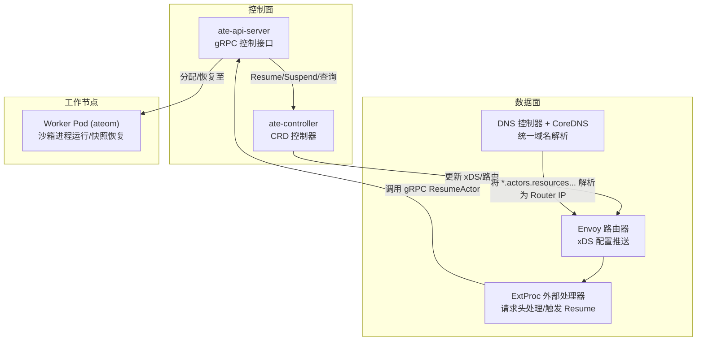
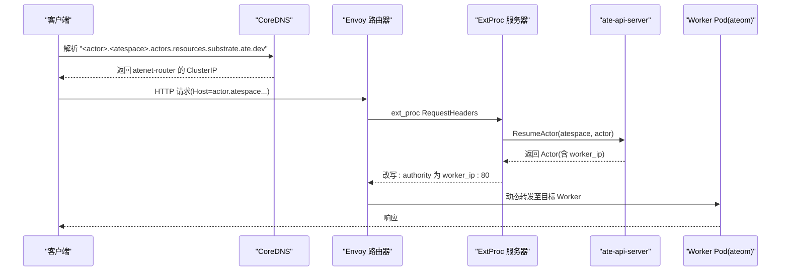
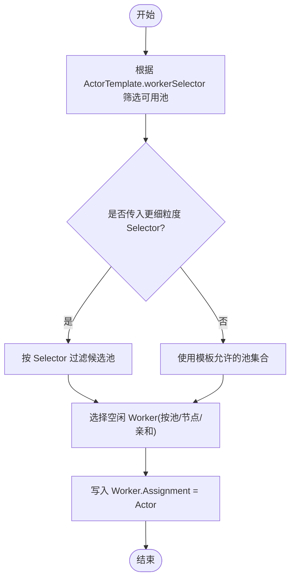
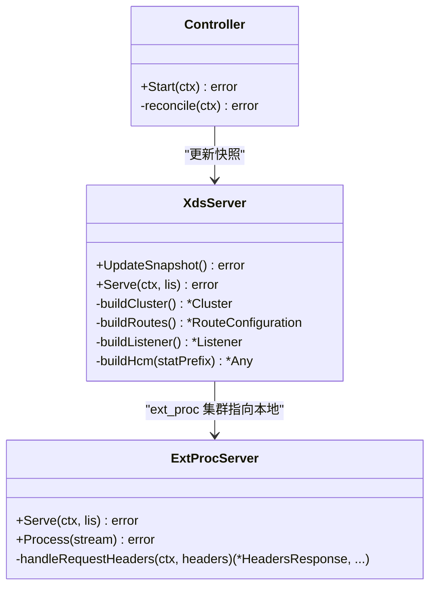
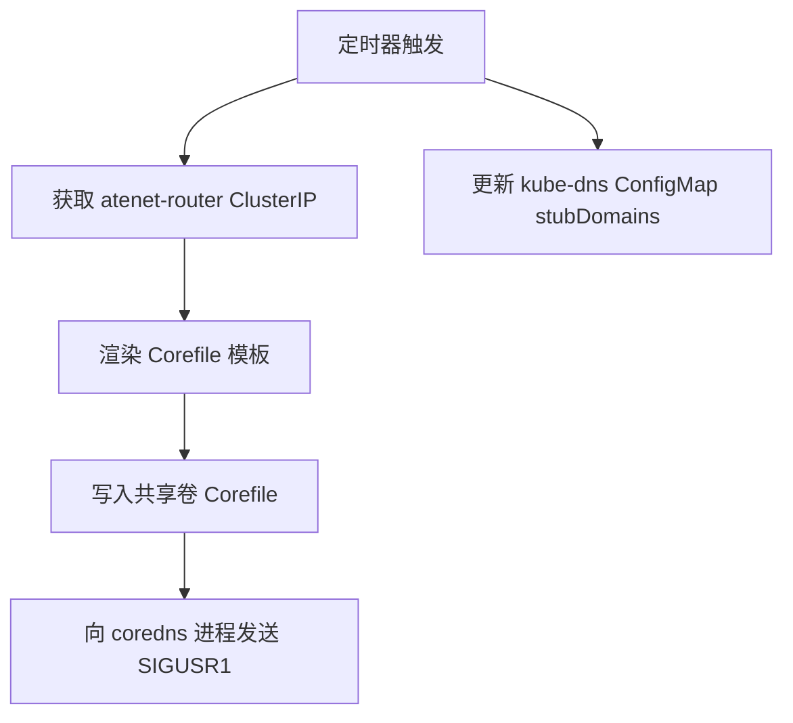
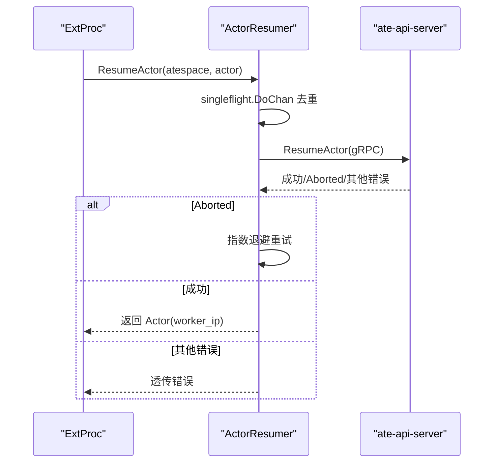
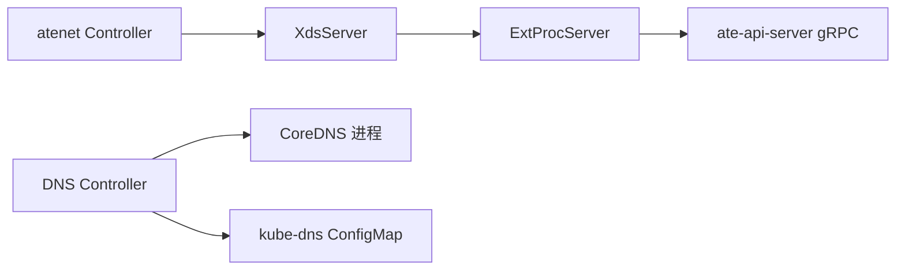

# 多路复用技术

<cite>
**本文引用的文件**   
- [README.md](file://README.md)
- [controller.go](file://cmd/atenet/internal/router/controller.go)
- [xds.go](file://cmd/atenet/internal/router/xds.go)
- [extproc.go](file://cmd/atenet/internal/router/extproc.go)
- [resumer.go](file://cmd/atenet/internal/router/resumer.go)
- [dns.go](file://cmd/atenet/internal/dns/dns.go)
- [corefile.go](file://cmd/atenet/internal/dns/corefile.go)
- [workerpool_types.go](file://pkg/api/v1alpha1/workerpool_types.go)
- [ateapi.pb.go](file://pkg/proto/ateapipb/ateapi.pb.go)
- [functional_test.go](file://cmd/ateapi/internal/controlapi/functional_test.go)
- [crash.go](file://cmd/ateapi/internal/controlapi/crash.go)
- [api-guide.md](file://docs/api-guide.md)
- [tests.yaml](file://benchmarking/automation/tests.yaml)
</cite>

## 目录
1. [简介](#简介)
2. [项目结构](#项目结构)
3. [核心组件](#核心组件)
4. [架构总览](#架构总览)
5. [详细组件分析](#详细组件分析)
6. [依赖关系分析](#依赖关系分析)
7. [性能与容量规划](#性能与容量规划)
8. [故障排查指南](#故障排查指南)
9. [结论](#结论)
10. [附录](#附录)

## 简介
本文件系统性阐述 Agent Substrate 的多路复用技术：如何将大量“Actor”（有状态、多数时间空闲的会话型工作负载）映射到有限的工作节点（Worker Pod）上，实现高倍超分；并说明基于 Envoy 的高性能网络代理如何实现动态路由与流量分发，以及 DNS 服务在统一寻址中的作用。同时给出调度与负载均衡策略、资源隔离机制、关键性能调优参数与监控指标，并提供容量规划与扩缩容的实践建议。

## 项目结构
Agent Substrate 的核心多路复用能力由控制面与数据面协同完成：
- 控制面（ate-api-server、ate-controller）负责 Actor/WorkerPool/ActorTemplate 等资源的编排与生命周期管理。
- 数据面（atenet）提供 DNS 解析与基于 Envoy 的动态路由，结合外部处理（ExtProc）在请求到达时按需唤醒目标 Actor。
- 节点侧（atelet、ateom-*）负责在 Worker Pod 内执行沙箱进程的快照/恢复与运行。

图表来源
- [controller.go:1-111](file://cmd/atenet/internal/router/controller.go#L1-L111)
- [xds.go:148-225](file://cmd/atenet/internal/router/xds.go#L148-L225)
- [extproc.go:80-188](file://cmd/atenet/internal/router/extproc.go#L80-L188)
- [dns.go:71-117](file://cmd/atenet/internal/dns/dns.go#L71-L117)

章节来源
- [README.md:1-225](file://README.md#L1-L225)

## 核心组件
- 工作池与工作节点
  - WorkerPool 定义物理“热备”容量（Pod 副本），通过标签选择器与 ActorTemplate/Actor 的 workerSelector 共同决定可调度范围。
  - Worker 是实际承载 Actor 的 Pod，维护 Assignment 字段记录当前分配的 Actor。
- 网络与路由
  - DNS 控制器生成 CoreDNS 配置，将所有 <actor>.<atespace>.actors.resources.substrate.ate.dev 解析为 atenet-router 的 ClusterIP。
  - Envoy 作为入口网关，使用 xDS 动态下发监听、路由与集群配置；通过 ExtProc 在请求头阶段进行动态决策。
- 动态唤醒与路由
  - ExtProc 收到请求后解析 Host，调用控制面 ResumeActor 确保目标 Actor 已恢复，并将 :authority 改写为目标 Worker IP:80，随后经动态转发代理直连后端。
- 一致性保障
  - 并发 Resume 去重与指数退避重试，避免风暴式唤醒；崩溃释放 Worker 分配，保证资源不泄漏。

章节来源
- [workerpool_types.go:108-122](file://pkg/api/v1alpha1/workerpool_types.go#L108-L122)
- [ateapi.pb.go:1655-1669](file://pkg/proto/ateapipb/ateapi.pb.go#L1655-L1669)
- [dns.go:71-117](file://cmd/atenet/internal/dns/dns.go#L71-L117)
- [corefile.go:32-65](file://cmd/atenet/internal/dns/corefile.go#L32-L65)
- [xds.go:148-225](file://cmd/atenet/internal/router/xds.go#L148-L225)
- [extproc.go:80-188](file://cmd/atenet/internal/router/extproc.go#L80-L188)
- [resumer.go:43-104](file://cmd/atenet/internal/router/resumer.go#L43-L104)
- [crash.go:77-115](file://cmd/ateapi/internal/controlapi/crash.go#L77-L115)

## 架构总览
下图展示一次典型请求从客户端到被唤醒的 Actor 的端到端流程，体现多路复用的关键路径。

图表来源
- [dns.go:71-117](file://cmd/atenet/internal/dns/dns.go#L71-L117)
- [corefile.go:32-65](file://cmd/atenet/internal/dns/corefile.go#L32-L65)
- [extproc.go:80-188](file://cmd/atenet/internal/router/extproc.go#L80-L188)
- [resumer.go:43-104](file://cmd/atenet/internal/router/resumer.go#L43-L104)
- [xds.go:357-466](file://cmd/atenet/internal/router/xds.go#L357-L466)

## 详细组件分析

### 工作池调度与负载均衡
- 调度约束
  - ActorTemplate 的 workerSelector 限定模板可用的 WorkerPool 集合；创建/恢复 Actor 时可进一步指定更细粒度的 Selector，仅缩小候选池。
  - WorkerPool 的标签与 Node 亲和/污点/优先级等资源策略共同决定物理容量分布。
- 分配与释放
  - 控制面在 Resume 成功后将 Actor 绑定到具体 Worker（Assignment）。当 Actor 崩溃或池不再满足选择器条件时，会释放该分配，避免僵尸占用。
- 负载均衡
  - 数据面在 ExtProc 层根据 Resume 结果直接指向目标 Worker IP，属于“按会话定向”的精准路由；若存在多个实例，可在上层通过不同 atespace/actor 名称区分。
  - 对于内部上游（如 OTLP Collector），xDS 配置采用 ROUND_ROBIN 策略。

图表来源
- [functional_test.go:1349-1379](file://cmd/ateapi/internal/controlapi/functional_test.go#L1349-L1379)
- [crash.go:77-115](file://cmd/ateapi/internal/controlapi/crash.go#L77-L115)
- [xds.go:227-272](file://cmd/atenet/internal/router/xds.go#L227-L272)

章节来源
- [functional_test.go:1349-1379](file://cmd/ateapi/internal/controlapi/functional_test.go#L1349-L1379)
- [crash.go:77-115](file://cmd/ateapi/internal/controlapi/crash.go#L77-L115)
- [xds.go:227-272](file://cmd/atenet/internal/router/xds.go#L227-L272)

### 基于 Envoy 的高性能网络代理与动态路由
- xDS 配置
  - 监听器：HTTP 连接管理器启用 ext_proc、dynamic_forward_proxy、router 过滤器链。
  - 路由：所有路径匹配到 dynamic_forward_proxy_cluster，超时与采样等策略可配。
  - 集群：ext_proc 本地回环集群；动态转发代理集群启用 DNS 缓存；可选 OTLP Collector 集群用于追踪。
- 外部处理（ExtProc）
  - 在 RequestHeaders 阶段解析 Host，调用控制面 ResumeActor，成功后改写 :authority 为 worker_ip:80，交由动态转发代理直连后端。
  - 内置度量记录与链路追踪上下文透传。

图表来源
- [controller.go:67-111](file://cmd/atenet/internal/router/controller.go#L67-L111)
- [xds.go:148-225](file://cmd/atenet/internal/router/xds.go#L148-L225)
- [xds.go:357-466](file://cmd/atenet/internal/router/xds.go#L357-L466)
- [extproc.go:80-188](file://cmd/atenet/internal/router/extproc.go#L80-L188)

章节来源
- [controller.go:67-111](file://cmd/atenet/internal/router/controller.go#L67-L111)
- [xds.go:148-225](file://cmd/atenet/internal/router/xds.go#L148-L225)
- [xds.go:357-466](file://cmd/atenet/internal/router/xds.go#L357-L466)
- [extproc.go:80-188](file://cmd/atenet/internal/router/extproc.go#L80-L188)

### DNS 服务的角色与实现细节
- 统一域名空间
  - 所有 Actor 遵循格式：<actor-name>.<atespace>.actors.resources.substrate.ate.dev。
- CoreDNS 配置生成
  - DNS 控制器周期性获取 atenet-router Service 的 ClusterIP，渲染 Corefile 模板并写入共享卷，向 coredns 进程发送信号触发重载。
  - 同时更新 kube-dns ConfigMap 的 stubDomains，使集群内 DNS 将自定义后缀解析到 ate-system 的 dns Service。
- 模板与匹配
  - 使用正则匹配符合 DNS-1123 规则的 actor 与 atespace 名称，答案固定为 Router 的 ClusterIP。

图表来源
- [dns.go:71-117](file://cmd/atenet/internal/dns/dns.go#L71-L117)
- [dns.go:119-141](file://cmd/atenet/internal/dns/dns.go#L119-L141)
- [dns.go:143-189](file://cmd/atenet/internal/dns/dns.go#L143-L189)
- [corefile.go:32-65](file://cmd/atenet/internal/dns/corefile.go#L32-L65)

章节来源
- [dns.go:71-117](file://cmd/atenet/internal/dns/dns.go#L71-L117)
- [dns.go:119-141](file://cmd/atenet/internal/dns/dns.go#L119-L141)
- [dns.go:143-189](file://cmd/atenet/internal/dns/dns.go#L143-L189)
- [corefile.go:32-65](file://cmd/atenet/internal/dns/corefile.go#L32-L65)

### 动态唤醒与并发控制
- 去重与重试
  - ExtProc 通过 ActorResumer 对同一 Actor 的并发 Resume 请求进行去重，并使用指数退避重试 Aborted 错误，避免重复唤醒。
- 追踪与度量
  - 在 ExtProc 中注入 OpenTelemetry 上下文，记录路由耗时与结果分类，便于定位首包延迟瓶颈。

图表来源
- [resumer.go:43-104](file://cmd/atenet/internal/router/resumer.go#L43-L104)
- [extproc.go:80-188](file://cmd/atenet/internal/router/extproc.go#L80-L188)

章节来源
- [resumer.go:43-104](file://cmd/atenet/internal/router/resumer.go#L43-L104)
- [extproc.go:80-188](file://cmd/atenet/internal/router/extproc.go#L80-L188)

### 资源隔离机制
- 运行时隔离
  - 通过 gVisor 或 microvm 沙箱运行 Actor 进程，实现内核态隔离与强安全边界。
- 调度隔离
  - WorkerPool 支持 nodeSelector、tolerations、priorityClassName、nodeAffinity 与资源 requests/limits，实现节点级与资源级隔离。
- 命名空间与身份
  - 每个 Actor 拥有独立身份挂载目录，避免跨会话信息泄露。

章节来源
- [api-guide.md:1-311](file://docs/api-guide.md#L1-L311)

## 依赖关系分析
- 组件耦合
  - atenet 控制器依赖 K8s Client 与 xDS 服务器；xDS 服务器依赖 ExtProc 地址与端口；ExtProc 依赖控制面 gRPC 客户端。
  - DNS 控制器依赖 K8s Service 与 ConfigMap，并通过进程信号通知 CoreDNS 重载。
- 外部依赖
  - Envoy 通过 xDS 接收配置；OpenTelemetry 用于分布式追踪；gRPC 用于控制面通信。

图表来源
- [controller.go:67-111](file://cmd/atenet/internal/router/controller.go#L67-L111)
- [xds.go:148-225](file://cmd/atenet/internal/router/xds.go#L148-L225)
- [extproc.go:80-188](file://cmd/atenet/internal/router/extproc.go#L80-L188)
- [dns.go:71-117](file://cmd/atenet/internal/dns/dns.go#L71-L117)

章节来源
- [controller.go:67-111](file://cmd/atenet/internal/router/controller.go#L67-L111)
- [xds.go:148-225](file://cmd/atenet/internal/router/xds.go#L148-L225)
- [extproc.go:80-188](file://cmd/atenet/internal/router/extproc.go#L80-L188)
- [dns.go:71-117](file://cmd/atenet/internal/dns/dns.go#L71-L117)

## 性能与容量规划
- 关键可调参数
  - Envoy 连接与消息超时：ext_proc 消息超时、上游连接超时、路由超时等。
  - 负载均衡策略：上游集群默认 ROUND_ROBIN；动态转发代理集群由插件提供策略。
  - DNS 缓存：动态转发代理启用 DNS 缓存以减少解析开销。
  - 追踪采样：Envoy 侧可按需开启 OTLP 上报。
- 监控指标
  - 路由耗时直方图（按模板命名空间/名称/结果分类）。
  - 查询记录器统计（最近 N 条路由请求的耗时与目标）。
  - 基准测试面板（Locust 延迟分位、活跃用户数等）。
- 容量规划与扩缩容
  - 以“活跃比例 × 峰值并发”估算所需 Worker 数量，结合 Demo 中的超分比（例如 30x+）指导初始规模。
  - 水平扩展：增加 WorkerPool replicas；垂直扩展：调整 Worker Pod 资源 requests/limits。
  - 弹性策略：结合 HPA/VPA 与业务 QPS/延迟阈值自动扩缩容。

章节来源
- [xds.go:227-272](file://cmd/atenet/internal/router/xds.go#L227-L272)
- [xds.go:357-466](file://cmd/atenet/internal/router/xds.go#L357-L466)
- [extproc.go:190-213](file://cmd/atenet/internal/router/extproc.go#L190-L213)
- [tests.yaml:34-82](file://benchmarking/automation/tests.yaml#L34-L82)
- [README.md:33-47](file://README.md#L33-L47)

## 故障排查指南
- 常见症状与定位
  - 首包延迟高：检查 ExtProc 的 ResumeActor 耗时与重试次数；确认单飞去重是否生效。
  - 路由失败/404：核对 Host 是否符合 <actor>.<atespace>.actors.resources.substrate.ate.dev 规范；确认 DNS 解析是否指向 Router。
  - 分配泄漏：若 Actor 崩溃但 Worker 仍显示分配，检查释放逻辑与池选择器变更后的清理行为。
- 快速验证步骤
  - 查看 atenet-router 的 xDS 快照版本与监听器/路由配置是否正确下发。
  - 检查 CoreDNS 的 Corefile 是否包含最新 Router IP，且 kube-dns stubDomains 已更新。
  - 使用 kubectl-ate 列出 Workers 与 Actors，确认 Assignment 与状态一致。

章节来源
- [extproc.go:80-188](file://cmd/atenet/internal/router/extproc.go#L80-L188)
- [resumer.go:43-104](file://cmd/atenet/internal/router/resumer.go#L43-L104)
- [crash.go:77-115](file://cmd/ateapi/internal/controlapi/crash.go#L77-L115)
- [dns.go:119-141](file://cmd/atenet/internal/dns/dns.go#L119-L141)
- [dns.go:143-189](file://cmd/atenet/internal/dns/dns.go#L143-L189)

## 结论
Agent Substrate 通过“控制面编排 + 数据面动态路由 + 节点侧快照恢复”的组合，实现了大规模 Actor 在多路复用下的低延迟激活与高效利用。其关键优势在于：
- 以极小常驻成本维持大量“休眠”会话，按需秒级唤醒。
- 基于 Envoy 的 ext_proc 实现无侵入的动态路由与首包唤醒。
- 统一的 DNS 寻址简化了应用接入与运维。
- 完善的隔离与观测能力支撑生产级稳定性与可观测性。

## 附录
- 术语
  - Actor：有状态的会话型工作负载。
  - WorkerPool：物理“热备”容量池。
  - Worker：承载 Actor 的 Pod。
  - atespace：Actor 的逻辑命名空间。
- 参考文档
  - API 指南与最佳实践参见 API Guide。

章节来源
- [api-guide.md:1-311](file://docs/api-guide.md#L1-L311)
