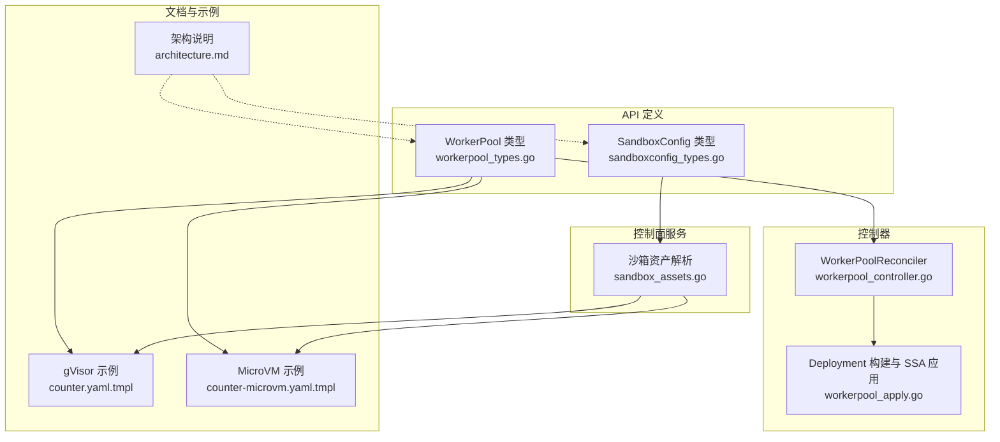
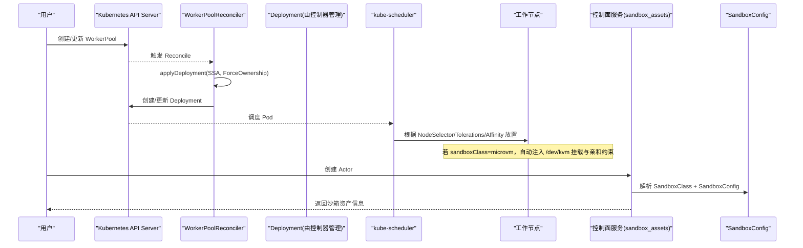
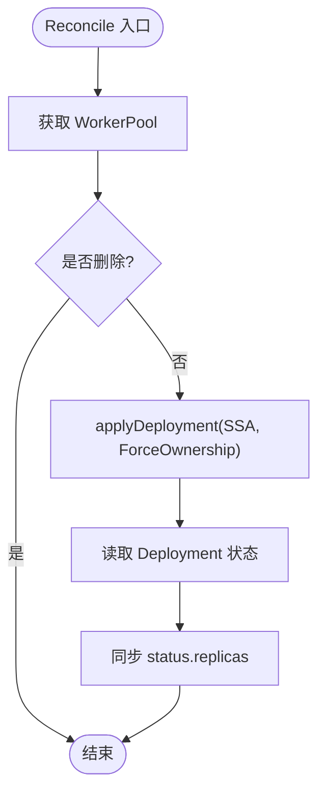
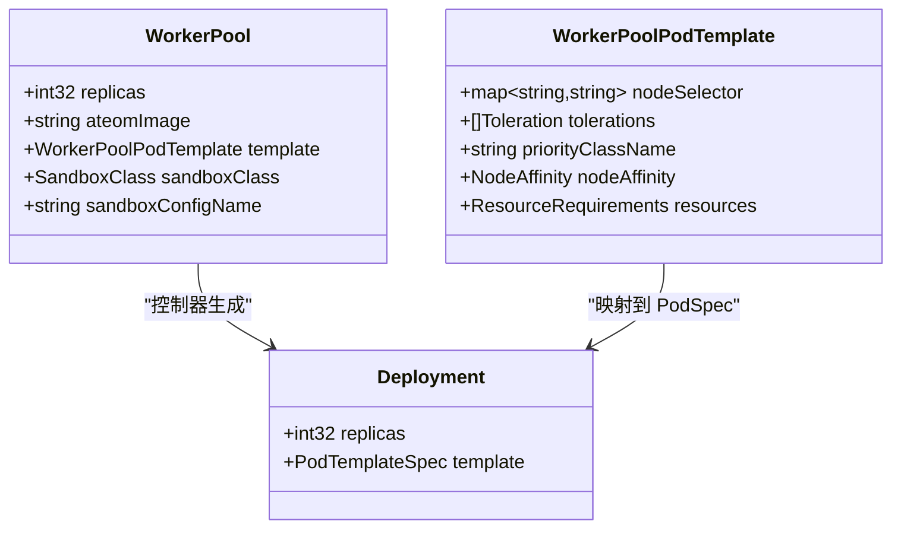
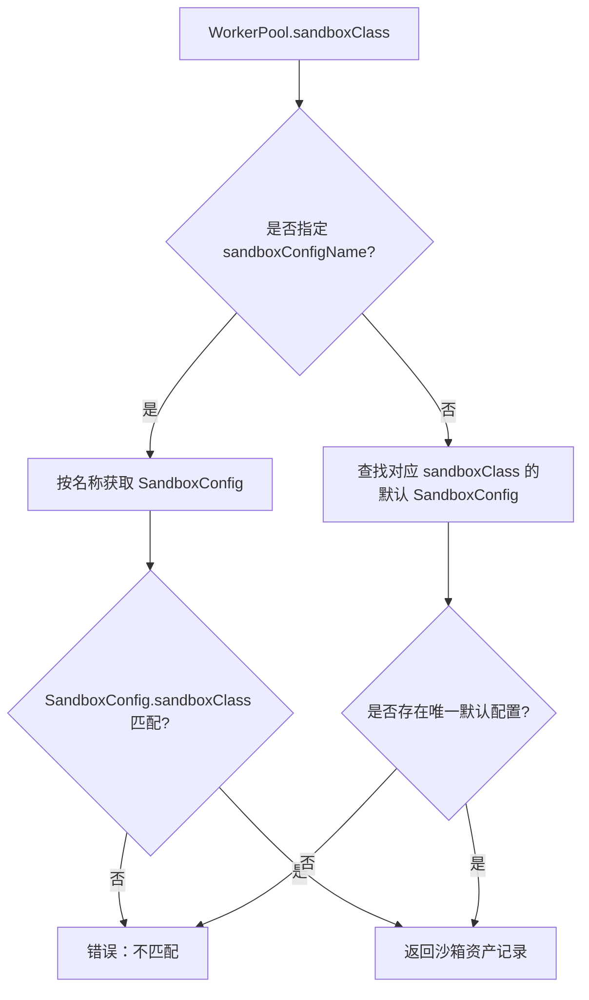
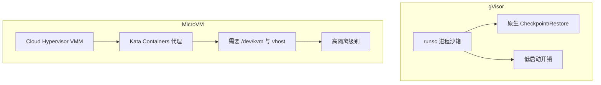
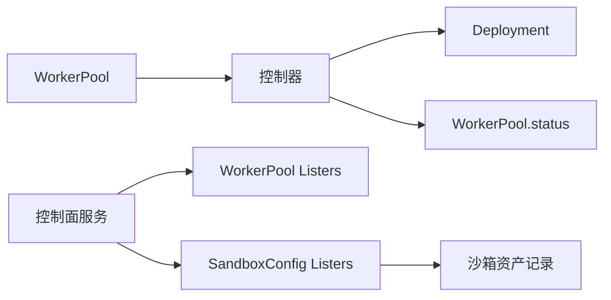

# WorkerPool管理机制

<cite>
**本文引用的文件**   
- [workerpool_types.go](file://pkg/api/v1alpha1/workerpool_types.go)
- [sandboxconfig_types.go](file://pkg/api/v1alpha1/sandboxconfig_types.go)
- [workerpool_controller.go](file://cmd/atecontroller/internal/controllers/workerpool_controller.go)
- [workerpool_apply.go](file://cmd/atecontroller/internal/controllers/workerpool_apply.go)
- [workerpool_controller_test.go](file://cmd/atecontroller/internal/controllers/workerpool_controller_test.go)
- [sandbox_assets.go](file://cmd/ateapi/internal/controlapi/sandbox_assets.go)
- [architecture.md](file://docs/architecture.md)
- [counter.yaml.tmpl](file://demos/counter/counter.yaml.tmpl)
- [counter-microvm.yaml.tmpl](file://demos/counter/counter-microvm.yaml.tmpl)
</cite>

## 目录
1. [简介](#简介)
2. [项目结构](#项目结构)
3. [核心组件](#核心组件)
4. [架构总览](#架构总览)
5. [详细组件分析](#详细组件分析)
6. [依赖关系分析](#依赖关系分析)
7. [性能与扩缩容](#性能与扩缩容)
8. [故障排查指南](#故障排查指南)
9. [结论](#结论)
10. [附录：配置示例与最佳实践](#附录配置示例与最佳实践)

## 简介
本文件系统性阐述 WorkerPool 的概念、工作机制与管理方式，重点覆盖以下方面：
- WorkerPool 如何管理并调度物理工作节点（副本数控制、资源分配、节点亲和性）
- SandboxClass 的选择机制及 gVisor 与 MicroVM 两种沙箱运行时的区别与适用场景
- WorkerPoolPodTemplate 的配置项（NodeSelector、Tolerations、PriorityClassName、NodeAffinity、Resources）
- 完整的配置示例与扩缩容策略，帮助在实际环境中部署和管理工作节点池

## 项目结构
WorkerPool 相关代码主要分布在以下位置：
- API 类型定义：pkg/api/v1alpha1/workerpool_types.go、pkg/api/v1alpha1/sandboxconfig_types.go
- 控制器实现：cmd/atecontroller/internal/controllers/workerpool_controller.go、workerpool_apply.go
- 沙箱资产解析：cmd/ateapi/internal/controlapi/sandbox_assets.go
- 架构说明：docs/architecture.md
- 示例清单：demos/counter/counter.yaml.tmpl、demos/counter/counter-microvm.yaml.tmpl

**图表来源** 
- [workerpool_types.go:54-89](file://pkg/api/v1alpha1/workerpool_types.go#L54-L89)
- [sandboxconfig_types.go:52-79](file://pkg/api/v1alpha1/sandboxconfig_types.go#L52-L79)
- [workerpool_controller.go:47-90](file://cmd/atecontroller/internal/controllers/workerpool_controller.go#L47-L90)
- [workerpool_apply.go:27-83](file://cmd/atecontroller/internal/controllers/workerpool_apply.go#L27-L83)
- [sandbox_assets.go:30-63](file://cmd/ateapi/internal/controlapi/sandbox_assets.go#L30-L63)
- [architecture.md:335-341](file://docs/architecture.md#L335-L341)
- [counter.yaml.tmpl:23-32](file://demos/counter/counter.yaml.tmpl#L23-L32)
- [counter-microvm.yaml.tmpl:89-101](file://demos/counter/counter-microvm.yaml.tmpl#L89-L101)

**章节来源**
- [workerpool_types.go:54-89](file://pkg/api/v1alpha1/workerpool_types.go#L54-L89)
- [sandboxconfig_types.go:52-79](file://pkg/api/v1alpha1/sandboxconfig_types.go#L52-L79)
- [workerpool_controller.go:47-90](file://cmd/atecontroller/internal/controllers/workerpool_controller.go#L47-L90)
- [workerpool_apply.go:27-83](file://cmd/atecontroller/internal/controllers/workerpool_apply.go#L27-L83)
- [sandbox_assets.go:30-63](file://cmd/ateapi/internal/controlapi/sandbox_assets.go#L30-L63)
- [architecture.md:335-341](file://docs/architecture.md#L335-L341)
- [counter.yaml.tmpl:23-32](file://demos/counter/counter.yaml.tmpl#L23-L32)
- [counter-microvm.yaml.tmpl:89-101](file://demos/counter/counter-microvm.yaml.tmpl#L89-L101)

## 核心组件
- WorkerPool：声明式描述工作节点池的期望状态，包括副本数、容器镜像、模板与沙箱类选择。
- WorkerPoolSpec：包含 replicas、ateomImage、template、sandboxClass、sandboxConfigName 等关键配置。
- WorkerPoolPodTemplate：提供 NodeSelector、Tolerations、PriorityClassName、NodeAffinity、Resources 等调度与资源设置。
- SandboxClass：决定沙箱运行时家族（gvisor 或 microvm），影响 Pod 形状与可用 SandboxConfigs。
- SandboxConfig：集群级对象，描述特定沙箱类的二进制资产集合，支持默认配置与按架构分发。

**章节来源**
- [workerpool_types.go:22-89](file://pkg/api/v1alpha1/workerpool_types.go#L22-L89)
- [sandboxconfig_types.go:21-79](file://pkg/api/v1alpha1/sandboxconfig_types.go#L21-L79)

## 架构总览
WorkerPool 通过控制器将期望状态同步到 Kubernetes Deployment，并由 kube-scheduler 根据模板与沙箱类要求调度到合适的节点。控制面服务在创建 Actor 时解析 SandboxClass 与 SandboxConfig，确定要拉取的沙箱二进制资产。

**图表来源**
- [workerpool_controller.go:47-90](file://cmd/atecontroller/internal/controllers/workerpool_controller.go#L47-L90)
- [workerpool_apply.go:27-83](file://cmd/atecontroller/internal/controllers/workerpool_apply.go#L27-L83)
- [workerpool_apply.go:94-130](file://cmd/atecontroller/internal/controllers/workerpool_apply.go#L94-L130)
- [sandbox_assets.go:30-63](file://cmd/ateapi/internal/controlapi/sandbox_assets.go#L30-L63)

## 详细组件分析

### WorkerPool 控制器与副本数控制
- 控制器监听 WorkerPool 事件，执行 reconcile 流程：
  - 使用 SSA（Server-Side Apply）以 FieldOwner 和 ForceOwnership 应用 Deployment，确保控制器对受管字段拥有强所有权，外部修改会被回滚。
  - 从 Deployment 的状态同步 WorkerPool.status.replicas，暴露给 HPA 或其他扩缩容工具。
- 副本数由 spec.replicas 驱动，控制器强制保持该值，避免外部篡改。

**图表来源**
- [workerpool_controller.go:47-90](file://cmd/atecontroller/internal/controllers/workerpool_controller.go#L47-L90)
- [workerpool_controller.go:92-112](file://cmd/atecontroller/internal/controllers/workerpool_controller.go#L92-L112)

**章节来源**
- [workerpool_controller.go:47-90](file://cmd/atecontroller/internal/controllers/workerpool_controller.go#L47-L90)
- [workerpool_controller.go:92-112](file://cmd/atecontroller/internal/controllers/workerpool_controller.go#L92-L112)
- [workerpool_controller_test.go:256-269](file://cmd/atecontroller/internal/controllers/workerpool_controller_test.go#L256-L269)

### 节点亲和性与资源分配（WorkerPoolPodTemplate）
- 控制器将 WorkerPoolPodTemplate 映射到 Deployment PodSpec：
  - NodeSelector：直接映射到 pod.spec.nodeSelector
  - Tolerations：转换为 ApplyConfiguration 列表并写入
  - PriorityClassName：设置优先级类名
  - NodeAffinity：仅映射 nodeAffinity 子段到 pod.spec.affinity.nodeAffinity
  - Resources：为容器设置 requests/limits
- 当 template 被清空或移除时，控制器会清除受管字段，确保状态回归干净。

**图表来源**
- [workerpool_types.go:22-52](file://pkg/api/v1alpha1/workerpool_types.go#L22-L52)
- [workerpool_apply.go:132-166](file://cmd/atecontroller/internal/controllers/workerpool_apply.go#L132-L166)

**章节来源**
- [workerpool_types.go:22-52](file://pkg/api/v1alpha1/workerpool_types.go#L22-L52)
- [workerpool_apply.go:132-166](file://cmd/atecontroller/internal/controllers/workerpool_apply.go#L132-L166)
- [workerpool_controller_test.go:362-431](file://cmd/atecontroller/internal/controllers/workerpool_controller_test.go#L362-L431)
- [workerpool_controller_test.go:433-463](file://cmd/atecontroller/internal/controllers/workerpool_controller_test.go#L433-L463)

### 沙箱类选择与 SandboxConfig 解析
- WorkerPool 的 sandboxClass 决定运行时家族（gvisor 或 microvm）。
- 若未显式指定 sandboxConfigName，则选择对应 sandboxClass 的默认 SandboxConfig；若指定，则校验其 sandboxClass 必须与 WorkerPool 一致。
- 解析结果用于告知 atelet 需要拉取哪些沙箱二进制资产（如 gVisor 的 runsc，micro-VM 的 cloud-hypervisor、kata-kernel、virtiofsd 等）。

**图表来源**
- [sandbox_assets.go:30-63](file://cmd/ateapi/internal/controlapi/sandbox_assets.go#L30-L63)
- [sandboxconfig_types.go:52-79](file://pkg/api/v1alpha1/sandboxconfig_types.go#L52-L79)

**章节来源**
- [sandbox_assets.go:30-63](file://cmd/ateapi/internal/controlapi/sandbox_assets.go#L30-L63)
- [sandboxconfig_types.go:52-79](file://pkg/api/v1alpha1/sandboxconfig_types.go#L52-L79)

### gVisor 与 MicroVM 的区别与适用场景
- gVisor（默认）：基于 runsc 的进程级沙箱，具备原生 checkpoint/restore 能力，适合大多数通用工作负载，启动开销较低。
- MicroVM：基于 Kata Containers + Cloud Hypervisor，提供内核级隔离，需宿主机支持 KVM 与 vhost 设备，适合高隔离需求场景；控制器会自动注入 /dev/kvm 挂载与节点亲和约束。

**图表来源**
- [architecture.md:335-341](file://docs/architecture.md#L335-L341)
- [workerpool_apply.go:94-130](file://cmd/atecontroller/internal/controllers/workerpool_apply.go#L94-L130)

**章节来源**
- [architecture.md:335-341](file://docs/architecture.md#L335-L341)
- [workerpool_apply.go:94-130](file://cmd/atecontroller/internal/controllers/workerpool_apply.go#L94-L130)

### 控制器对微虚拟机 Pod 形状的增强
- 当 sandboxClass=microvm 时，控制器会在 PodSpec 中追加：
  - 挂载宿主机的 /dev/kvm 字符设备
  - 添加节点标签选择器与容忍度，将 Pod 调度到支持嵌套虚拟化的节点
- 这些增强与用户自定义的 NodeSelector/Tolerations/Affinity 合并，不会覆盖用户配置。

**章节来源**
- [workerpool_apply.go:94-130](file://cmd/atecontroller/internal/controllers/workerpool_apply.go#L94-L130)

## 依赖关系分析
- WorkerPool 控制器依赖 Kubernetes Apps v1 Deployment 进行工作节点生命周期管理。
- 控制面服务依赖 lister 缓存 WorkerPool 与 SandboxConfig，用于解析沙箱资产。
- 示例清单展示了不同 sandboxClass 对应的 WorkerPool 与 SandboxConfig 组合。

**图表来源**
- [workerpool_controller.go:114-121](file://cmd/atecontroller/internal/controllers/workerpool_controller.go#L114-L121)
- [sandbox_assets.go:30-63](file://cmd/ateapi/internal/controlapi/sandbox_assets.go#L30-L63)

**章节来源**
- [workerpool_controller.go:114-121](file://cmd/atecontroller/internal/controllers/workerpool_controller.go#L114-L121)
- [sandbox_assets.go:30-63](file://cmd/ateapi/internal/controlapi/sandbox_assets.go#L30-L63)

## 性能与扩缩容
- 副本数控制：通过 spec.replicas 与 status.replicas 暴露，可直接对接 HPA 或外部扩缩容系统。
- 资源限制：在 WorkerPoolPodTemplate.Resources 中设置 requests/limits，有助于调度器更精准地分配 CPU/内存。
- 节点亲和性：结合 NodeSelector、Tolerations、NodeAffinity 可将工作节点池定向到具备特定能力的节点（如 GPU、KVM 支持）。
- 优先级：PriorityClassName 可提升工作节点池的抢占优先级，保障关键业务的工作节点可用性。

[本节为通用指导，无需具体文件引用]

## 故障排查指南
- 外部篡改副本数：控制器会以 ForceOwnership 回滚到 spec.replicas 指定的值。
- 外部篡改 Pod 模板字段：控制器会回滚受管字段（NodeSelector、Tolerations、PriorityClassName、Affinity、Resources）。
- 删除受管 Deployment：控制器会重建 Deployment。
- SandboxConfig 不匹配：若 sandboxConfigName 指定的配置与 WorkerPool 的 sandboxClass 不一致，解析会失败。

**章节来源**
- [workerpool_controller_test.go:256-269](file://cmd/atecontroller/internal/controllers/workerpool_controller_test.go#L256-L269)
- [workerpool_controller_test.go:271-296](file://cmd/atecontroller/internal/controllers/workerpool_controller_test.go#L271-L296)
- [workerpool_controller_test.go:362-431](file://cmd/atecontroller/internal/controllers/workerpool_controller_test.go#L362-L431)
- [workerpool_controller_test.go:433-463](file://cmd/atecontroller/internal/controllers/workerpool_controller_test.go#L433-L463)
- [sandbox_assets.go:51-54](file://cmd/ateapi/internal/controlapi/sandbox_assets.go#L51-L54)

## 结论
WorkerPool 通过声明式 API 与控制器协同，实现对工作节点池的精确管理与调度。借助 SandboxClass 与 SandboxConfig，系统可在 gVisor 与 MicroVM 之间灵活切换，满足不同隔离与性能需求。配合 Pod 模板的资源与亲和性配置，用户可以在复杂集群环境中高效部署与扩缩容工作节点池。

[本节为总结，无需具体文件引用]

## 附录：配置示例与最佳实践
- gVisor 示例：参考 counter.yaml.tmpl，展示默认的 gVisor WorkerPool 与 ActorTemplate 的组合。
- MicroVM 示例：参考 counter-microvm.yaml.tmpl，展示 microvm 沙箱类、SandboxConfig 与 WorkerPool 的完整配置。
- 最佳实践：
  - 明确设置 SandboxClass 与 SandboxConfigName，避免默认配置冲突。
  - 为 MicroVM 准备支持 KVM 的节点池，并确保节点标签与污点符合控制器约定。
  - 合理设置 WorkerPoolPodTemplate 的资源请求与限制，提高调度效率。
  - 使用 PriorityClassName 提升关键工作节点池的优先级。

**章节来源**
- [counter.yaml.tmpl:23-32](file://demos/counter/counter.yaml.tmpl#L23-L32)
- [counter-microvm.yaml.tmpl:89-101](file://demos/counter/counter-microvm.yaml.tmpl#L89-L101)
