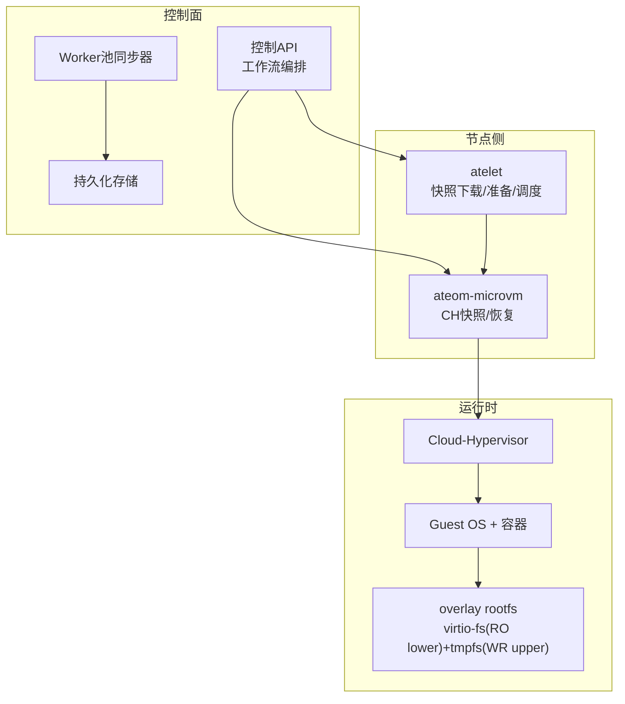
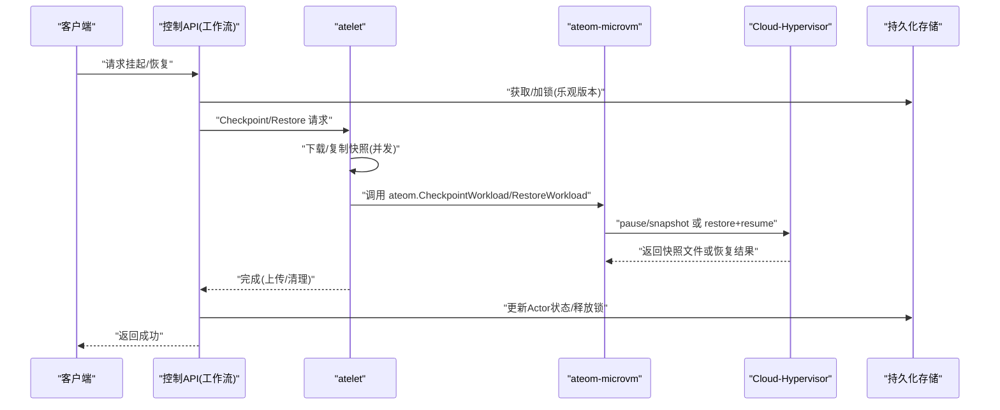
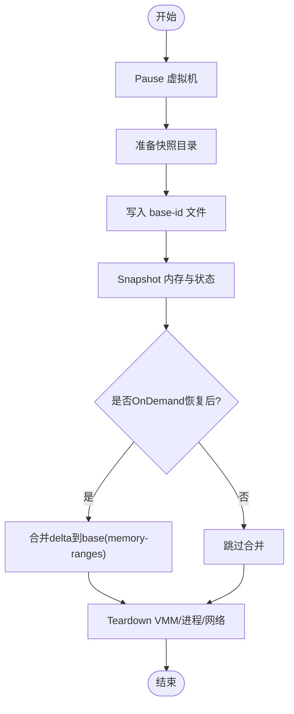
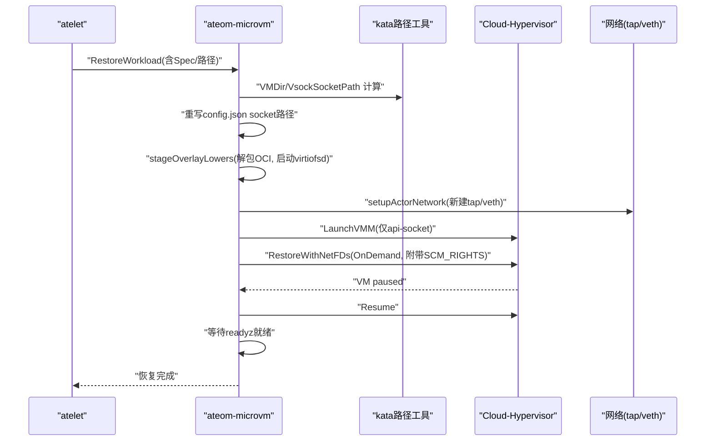
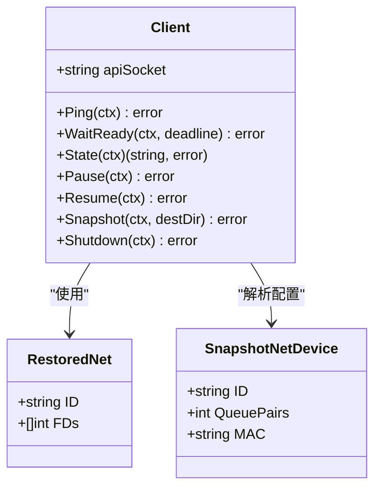
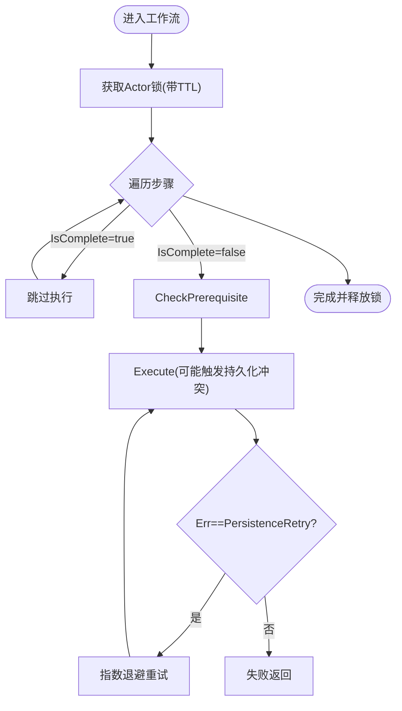
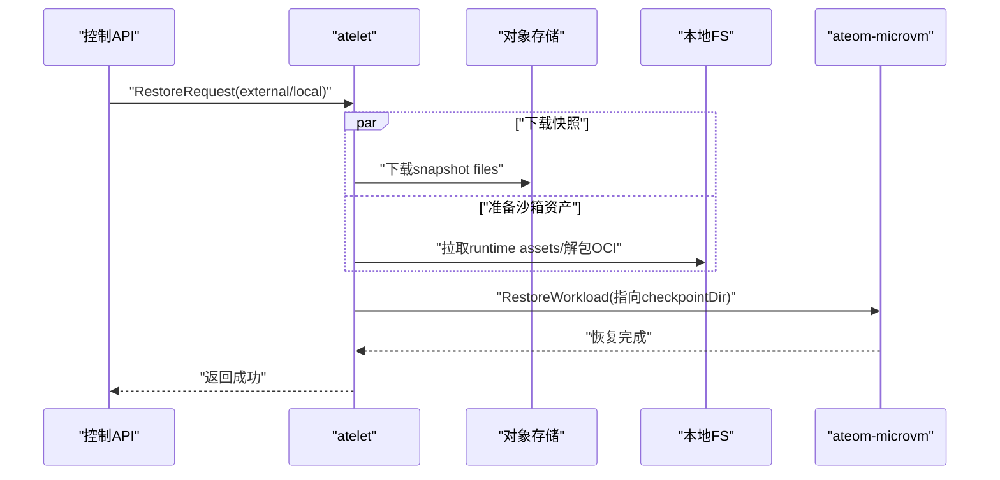
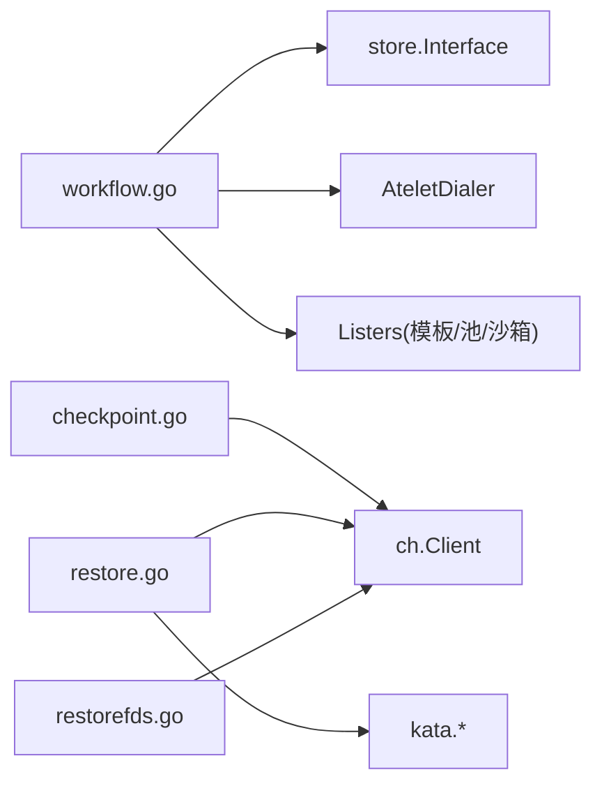

# 多路复用技术原理

<cite>
**本文引用的文件**   
- [README.md](file://README.md)
- [checkpoint.go](file://cmd/ateom-microvm/checkpoint.go)
- [restore.go](file://cmd/ateom-microvm/restore.go)
- [restorefds.go](file://cmd/ateom-microvm/internal/ch/restorefds.go)
- [api.go](file://cmd/ateom-microvm/internal/ch/api.go)
- [ch.go](file://cmd/ateom-microvm/internal/ch/ch.go)
- [kata.go](file://cmd/ateom-microvm/internal/kata/kata.go)
- [restore_kata.go](file://cmd/ateom-microvm/internal/kata/restore.go)
- [syncer.go](file://cmd/ateapi/internal/controlapi/syncer.go)
- [workflow.go](file://cmd/ateapi/internal/controlapi/workflow.go)
- [atelet.proto](file://internal/proto/ateletpb/atelet.proto)
- [main_atelet.go](file://cmd/atelet/main.go)
</cite>

## 目录
1. [简介](#简介)
2. [项目结构](#项目结构)
3. [核心组件](#核心组件)
4. [架构总览](#架构总览)
5. [详细组件分析](#详细组件分析)
6. [依赖关系分析](#依赖关系分析)
7. [性能考量与优化](#性能考量与优化)
8. [故障排查指南](#故障排查指南)
9. [结论](#结论)
10. [附录](#附录)

## 简介
本文件围绕“多路复用”在 Agent Substrate 中的实现，深入解释其如何通过内存快照与文件系统状态保存，实现 Actor 的快速激活与恢复。重点阐述 Checkpoint 与 Restore 的工作流程、数据序列化与传输、增量更新策略、状态一致性保证机制（并发访问与冲突处理），以及多路复用的性能优化技巧（内存管理、I/O 优化、网络通信调优）。文末提供监控指标建议与基准测试思路，帮助用户理解并优化系统表现。

## 项目结构
Agent Substrate 将大量“无状态或长空闲”的 Actor 映射到少量 Worker Pod 上，通过“暂停-快照-迁移-恢复”的多路复用模型实现高倍超分。关键路径涉及：
- 控制面：工作流编排、资源同步、持久化锁与状态机
- 节点侧：atelet 负责下载/复制快照、准备沙箱资产、调用 ateom
- 执行侧：ateom-microvm 驱动 Cloud-Hypervisor（CH）完成 VM 级快照/恢复，结合 overlay rootfs 与 virtio-fs 实现进程内存与可写根文件系统的一致性

图表来源
- [workflow.go:1-280](file://cmd/ateapi/internal/controlapi/workflow.go#L1-L280)
- [syncer.go:1-237](file://cmd/ateapi/internal/controlapi/syncer.go#L1-L237)
- [main_atelet.go:506-531](file://cmd/atelet/main.go#L506-L531)
- [checkpoint.go:1-211](file://cmd/ateom-microvm/checkpoint.go#L1-L211)
- [restore.go:1-255](file://cmd/ateom-microvm/restore.go#L1-L255)

章节来源
- [README.md:1-225](file://README.md#L1-L225)

## 核心组件
- 控制面工作流（ActorWorkflow）：封装 Resume/Suspend/Pause 等操作的步骤化执行、幂等检查、前置条件校验与重试退避。
- Worker 同步器（WorkerPoolSyncer）：监听 Kubernetes Pod 事件，维护 Worker 列表并在节点失效时回滚 Actor 绑定。
- atelet：协调外部/本地快照的下载与复制，准备沙箱二进制与 OCI bundle，并发重叠 I/O 与解压，最终调用 ateom 进行恢复。
- ateom-microvm：通过 CH REST API 对 VM 执行 pause/snapshot/resume；在恢复阶段重建 overlay RO lower、重配网络 FD、以 OnDemand 模式恢复内存并保持 SPARSE 以降低后续快照成本。
- CH 客户端（ch.Client）：封装 vm.pause/vm.snapshot/vm.resume/vmm.ping 等接口，支持带 SCM_RIGHTS 的 fd 传递用于网络恢复。

章节来源
- [workflow.go:1-280](file://cmd/ateapi/internal/controlapi/workflow.go#L1-L280)
- [syncer.go:1-237](file://cmd/ateapi/internal/controlapi/syncer.go#L1-L237)
- [main_atelet.go:506-531](file://cmd/atelet/main.go#L506-L531)
- [checkpoint.go:1-211](file://cmd/ateom-microvm/checkpoint.go#L1-L211)
- [restore.go:1-255](file://cmd/ateom-microvm/restore.go#L1-L255)
- [ch.go:1-113](file://cmd/ateom-microvm/internal/ch/ch.go#L1-L113)
- [api.go:1-131](file://cmd/ateom-microvm/internal/ch/api.go#L1-L131)
- [restorefds.go:1-242](file://cmd/ateom-microvm/internal/ch/restorefds.go#L1-L242)

## 架构总览
下图展示一次“从运行态挂起到跨节点恢复”的端到端流程，体现多路复用的关键路径与数据流向。

图表来源
- [workflow.go:1-280](file://cmd/ateapi/internal/controlapi/workflow.go#L1-L280)
- [syncer.go:1-237](file://cmd/ateapi/internal/controlapi/syncer.go#L1-L237)
- [main_atelet.go:506-531](file://cmd/atelet/main.go#L506-L531)
- [checkpoint.go:1-211](file://cmd/ateom-microvm/checkpoint.go#L1-L211)
- [restore.go:1-255](file://cmd/ateom-microvm/restore.go#L1-L255)
- [ch.go:1-113](file://cmd/ateom-microvm/internal/ch/ch.go#L1-L113)

## 详细组件分析

### 组件一：Checkpoint 流程（内存快照与文件系统状态保存）
- 目标：将运行中 Actor 的进程内存与可写根文件系统（guest tmpfs upper）冻结并落盘，形成可移植的 CH 快照。
- 关键点：
  - 通过 CH REST API 先 Pause，再 Snapshot，生成 config.json/state.json/memory-ranges。
  - 记录 baseID（golden id），确保后续恢复能正确重建 overlay RO lower。
  - 若为 OnDemand 恢复后的再次挂起，需将 delta 合并到源 memory-ranges，使快照自包含。
  - 完成后 teardown 当前 VMM 与相关进程，释放网络与日志转发资源。

图表来源
- [checkpoint.go:1-211](file://cmd/ateom-microvm/checkpoint.go#L1-L211)
- [ch.go:1-113](file://cmd/ateom-microvm/internal/ch/ch.go#L1-L113)

章节来源
- [checkpoint.go:1-211](file://cmd/ateom-microvm/checkpoint.go#L1-L211)
- [ch.go:1-113](file://cmd/ateom-microvm/internal/ch/ch.go#L1-L113)

### 组件二：Restore 流程（快速激活与恢复）
- 目标：在任意可用节点上，基于已下载的快照快速拉起 Actor，保持内存与可写根文件系统一致。
- 关键点：
  - 重写快照 config.json 中的 socket 路径至当前 actor 的 VMDir。
  - 重建 overlay RO lower（从本地 OCI bundle 解包），启动 virtiofsd。
  - 重建网络（veth/tap），解析快照 net devices，创建新 tap FD 并通过 SCM_RIGHTS 传递给 CH。
  - 使用 OnDemand 模式恢复内存，减少冷启动时间并保持 memfd SPARSE，利于后续增量快照。
  - 等待 readyz 就绪，重新建立日志转发，注册运行态。

图表来源
- [restore.go:1-255](file://cmd/ateom-microvm/restore.go#L1-L255)
- [restorefds.go:1-242](file://cmd/ateom-microvm/internal/ch/restorefds.go#L1-L242)
- [kata.go:1-40](file://cmd/ateom-microvm/internal/kata/kata.go#L1-L40)
- [restore_kata.go:1-32](file://cmd/ateom-microvm/internal/kata/restore.go#L1-L32)

章节来源
- [restore.go:1-255](file://cmd/ateom-microvm/restore.go#L1-L255)
- [restorefds.go:1-242](file://cmd/ateom-microvm/internal/ch/restorefds.go#L1-L242)
- [kata.go:1-40](file://cmd/ateom-microvm/internal/kata/kata.go#L1-L40)
- [restore_kata.go:1-32](file://cmd/ateom-microvm/internal/kata/restore.go#L1-L32)

### 组件三：CH 客户端与 fd 传递（网络恢复）
- 功能：
  - 通过 unix api-socket 与 CH 通信，封装 ping/pause/snapshot/resume/shutdown。
  - 在恢复时，构造 vm.restore 请求，携带 net_fds（每个 queue pair 一个 FD），通过 SCM_RIGHTS 传递。
  - 读取快照 config.json 中的 net 设备信息，确定 ID、队列数与 MAC。

图表来源
- [ch.go:1-113](file://cmd/ateom-microvm/internal/ch/ch.go#L1-L113)
- [restorefds.go:1-242](file://cmd/ateom-microvm/internal/ch/restorefds.go#L1-L242)

章节来源
- [api.go:1-131](file://cmd/ateom-microvm/internal/ch/api.go#L1-L131)
- [ch.go:1-113](file://cmd/ateom-microvm/internal/ch/ch.go#L1-L113)
- [restorefds.go:1-242](file://cmd/ateom-microvm/internal/ch/restorefds.go#L1-L242)

### 组件四：控制面工作流与一致性保证
- 工作流引擎：
  - 定义通用 WorkflowStep 接口，支持 IsComplete/CheckPrerequisite/Execute/RetryBackoff。
  - RunWorkflow 按序执行步骤，失败时根据 RetryBackoff 指数退避重试（针对持久化冲突）。
- 一致性：
  - 通过分布式锁（基于 store.AcquireLock/ReleaseLock）保证同一 Actor 的并发操作串行化。
  - 使用乐观版本控制（UpdateActor 传入 version）避免覆盖更新。
  - Worker 同步器在 Pod 删除时将绑定 Actor 重置为 SUSPENDED，防止悬挂指针。

图表来源
- [workflow.go:1-280](file://cmd/ateapi/internal/controlapi/workflow.go#L1-L280)
- [syncer.go:1-237](file://cmd/ateapi/internal/controlapi/syncer.go#L1-L237)

章节来源
- [workflow.go:1-280](file://cmd/ateapi/internal/controlapi/workflow.go#L1-L280)
- [syncer.go:1-237](file://cmd/ateapi/internal/controlapi/syncer.go#L1-L237)

### 组件五：atelet 的快照下载与恢复准备（并发与增量）
- 并发设计：
  - 使用 errgroup 并行执行“外部快照下载”和“沙箱资产/镜像解包”，隐藏较长路径的延迟。
- 增量与完整快照：
  - 对于 OnDemand 恢复场景，后续挂起会将 delta 合并到 base，形成完整快照，便于跨节点迁移。
- 协议与配置：
  - 通过 ateletpb.RestoreRequest/CheckpointRequest 指定类型（LOCAL/EXTERNAL）、作用域（FULL）与配置前缀。

图表来源
- [main_atelet.go:506-531](file://cmd/atelet/main.go#L506-L531)
- [atelet.proto:183-238](file://internal/proto/ateletpb/atelet.proto#L183-L238)

章节来源
- [main_atelet.go:506-531](file://cmd/atelet/main.go#L506-L531)
- [atelet.proto:183-238](file://internal/proto/ateletpb/atelet.proto#L183-L238)

## 依赖关系分析
- 控制面与工作流：
  - workflow.go 依赖 store（持久化）、workerCache（Worker选择）、dialer（远程调用 atelet/ateom）、listers（模板/池/沙箱配置）。
- 节点侧与运行时：
  - checkpoint.go/restore.go 依赖 ch.Client 与 kata 路径工具；restorefds.go 直接操作 unix socket 与 SCM_RIGHTS。
- 协议层：
  - ateletpb 定义了 Checkpoint/Restore 的请求/响应结构与配置项。

图表来源
- [workflow.go:1-280](file://cmd/ateapi/internal/controlapi/workflow.go#L1-L280)
- [checkpoint.go:1-211](file://cmd/ateom-microvm/checkpoint.go#L1-L211)
- [restore.go:1-255](file://cmd/ateom-microvm/restore.go#L1-L255)
- [restorefds.go:1-242](file://cmd/ateom-microvm/internal/ch/restorefds.go#L1-L242)
- [kata.go:1-40](file://cmd/ateom-microvm/internal/kata/kata.go#L1-L40)

章节来源
- [workflow.go:1-280](file://cmd/ateapi/internal/controlapi/workflow.go#L1-L280)
- [checkpoint.go:1-211](file://cmd/ateom-microvm/checkpoint.go#L1-L211)
- [restore.go:1-255](file://cmd/ateom-microvm/restore.go#L1-L255)
- [restorefds.go:1-242](file://cmd/ateom-microvm/internal/ch/restorefds.go#L1-L242)
- [kata.go:1-40](file://cmd/ateom-microvm/internal/kata/kata.go#L1-L40)

## 性能考量与优化
- 内存管理与快照模式
  - 使用 OnDemand 恢复（userfaultfd）显著降低冷启动时间，同时保持 memfd SPARSE，避免全量扫描，提升后续快照速度。
  - 在 OnDemand 恢复后再挂起时，合并 delta 到 base，确保快照自包含且后续增量高效。
- I/O 优化
  - atelet 在下载快照与准备沙箱资产时使用并发（errgroup），隐藏较慢路径的延迟。
  - 本地缓存与预取：预热 OCI bundle 与 runtime assets，减少首次恢复开销。
- 网络通信调优
  - CH REST 客户端禁用连接复用（DisableKeepAlives），避免空闲连接被回收导致的阻塞问题。
  - 使用 unix socket 直连 CH，减少网络栈开销；通过 SCM_RIGHTS 传递 FD，避免额外拷贝。
- 多路复用与资源超分
  - 将大量 Actor 映射到少量 Worker，利用“空闲为主”的特征提高硬件利用率。
  - 通过 overlay rootfs（RO lower 来自镜像，WR upper 为 guest tmpfs）实现状态持久化与隔离。

[本节为通用指导，不直接分析具体文件]

## 故障排查指南
- 常见错误定位
  - CH API 不可用：检查 WaitReady 超时与 vmm.ping 响应。
  - 恢复失败（net FD 缺失）：确认 SnapshotNetDevices 解析到的设备与提供的 FD 数量匹配。
  - 快照不完整：确认 OnDemand 场景下是否执行了 delta 合并。
  - 工作流冲突：观察持久化冲突重试（ErrPersistenceRetry）与锁竞争情况。
- 日志与观测
  - 生命周期日志：在 checkpoint/restore 前后输出关键耗时（pause/snapshot/teardown/total）。
  - 指标建议：
    - 挂起/恢复耗时分布（p50/p95/p99）
    - 快照大小与增量比例
    - OnDemand 恢复 vs Eager 恢复对比
    - 网络 FD 传递成功率
    - 工作流重试次数与冲突率

章节来源
- [checkpoint.go:1-211](file://cmd/ateom-microvm/checkpoint.go#L1-L211)
- [restore.go:1-255](file://cmd/ateom-microvm/restore.go#L1-L255)
- [restorefds.go:1-242](file://cmd/ateom-microvm/internal/ch/restorefds.go#L1-L242)
- [api.go:1-131](file://cmd/ateom-microvm/internal/ch/api.go#L1-L131)
- [workflow.go:1-280](file://cmd/ateapi/internal/controlapi/workflow.go#L1-L280)

## 结论
通过 VM 级快照与 overlay rootfs 的组合，Agent Substrate 实现了 Actor 的高密度多路复用与亚秒级激活。OnDemand 恢复与增量快照策略在保证一致性的前提下显著降低了冷启动与迁移成本。控制面的工作流与锁机制确保了并发安全与幂等性。配合 atelet 的并发 I/O 与 CH 的低开销通信，整体系统在大规模场景下具备良好可扩展性与低延迟特性。

[本节为总结性内容，不直接分析具体文件]

## 附录
- 术语
  - Actor：用户工作负载实例
  - Worker：承载 Actor 的共享 Pod
  - atelet：节点侧守护进程，负责快照与沙箱准备
  - ateom-microvm：节点侧执行器，驱动 CH 完成快照/恢复
  - CH：Cloud-Hypervisor，轻量级虚拟化运行时
- 参考
  - README 中对“即时会话传送”“状态持久化”“超分演示”的描述可作为能力验证入口。

章节来源
- [README.md:1-225](file://README.md#L1-L225)
