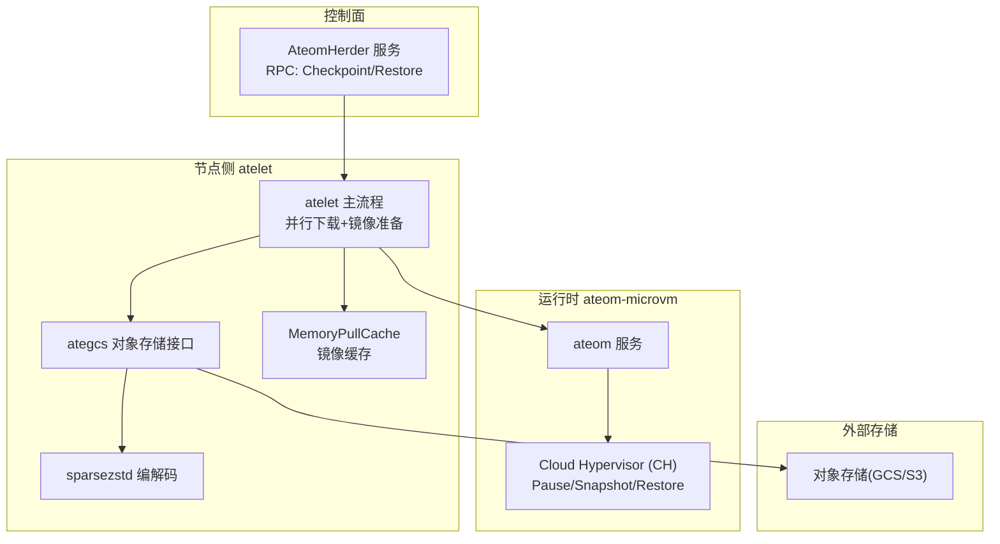
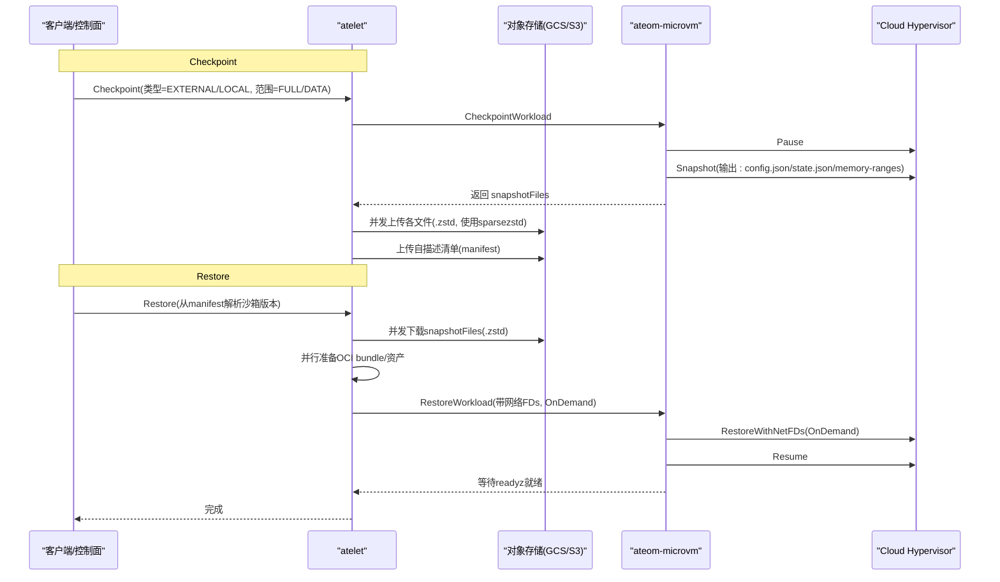
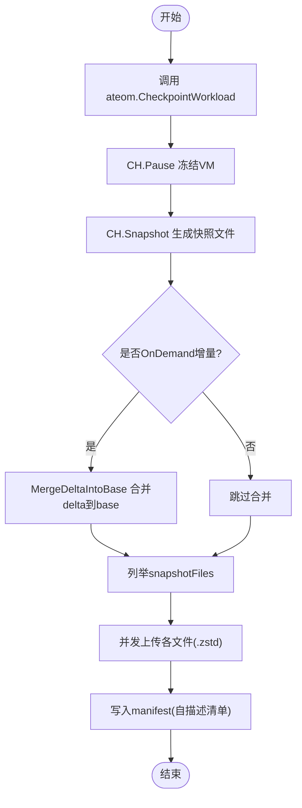
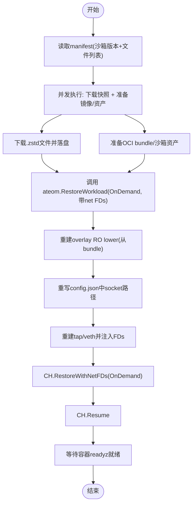
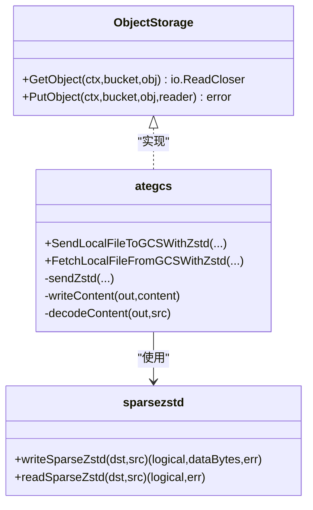
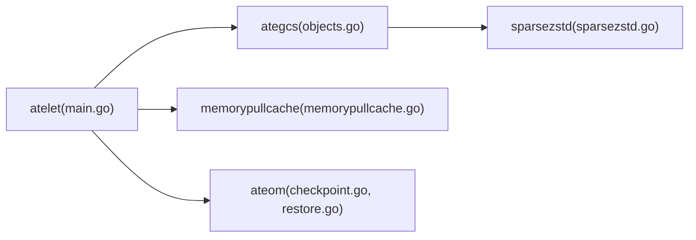

# 快照与恢复机制

<cite>
**本文引用的文件**   
- [atelet.proto](file://internal/proto/ateletpb/atelet.proto)
- [atelet.pb.go](file://internal/proto/ateletpb/atelet.pb.go)
- [main.go](file://cmd/atelet/main.go)
- [objects.go](file://cmd/atelet/internal/ategcs/objects.go)
- [sparsezstd.go](file://cmd/atelet/internal/ategcs/sparsezstd.go)
- [checkpoint.go](file://cmd/ateom-microvm/checkpoint.go)
- [restore.go](file://cmd/ateom-microvm/restore.go)
- [memorypullcache.go](file://cmd/atelet/internal/memorypullcache/memorypullcache.go)
- [demo_test.go](file://internal/e2e/suites/demo/demo_test.go)
</cite>

## 目录
1. [简介](#简介)
2. [项目结构](#项目结构)
3. [核心组件](#核心组件)
4. [架构总览](#架构总览)
5. [详细组件分析](#详细组件分析)
6. [依赖关系分析](#依赖关系分析)
7. [性能考量](#性能考量)
8. [故障排查指南](#故障排查指南)
9. [结论](#结论)
10. [附录](#附录)

## 简介
本文件系统性阐述 Substrate 在 atelet（节点侧编排）与 ateom-microvm（微虚拟机运行时）之间的“快照与恢复”机制。重点覆盖：
- Checkpoint 与 Restore 的端到端流程，包括内存状态捕获、文件系统增量备份、数据序列化格式设计
- 稀疏 zstd 压缩（sparsezstd）与传输优化策略（流式上传、并发下载、零拷贝/空洞写）
- 大内存对象处理（内存映射、SEEK_DATA/SEEK_HOLE、空洞文件）
- 一致性保证方案（OnDemand 恢复 + delta 合并、自描述清单、版本锁定）
- 多进程环境下的完整性约束
- 基准测试要点与优化建议

## 项目结构
快照与恢复涉及以下关键模块：
- atelet：负责与上层控制面交互、调度 ateom 执行 checkpoint/restore、管理对象存储上传下载、OCI 镜像准备
- ategcs：实现对象存储抽象与 sparsezstd 编解码、上传/下载流水线
- ateom-microvm：驱动 Cloud Hypervisor（CH）完成 VM 暂停、快照、恢复与网络重建
- memorypullcache：加速 OCI 镜像拉取，减少重复解压开销

图表来源
- [main.go:400-600](file://cmd/atelet/main.go#L400-L600)
- [objects.go:95-251](file://cmd/atelet/internal/ategcs/objects.go#L95-L251)
- [sparsezstd.go:47-196](file://cmd/atelet/internal/ategcs/sparsezstd.go#L47-L196)
- [checkpoint.go:44-154](file://cmd/ateom-microvm/checkpoint.go#L44-L154)
- [restore.go:52-207](file://cmd/ateom-microvm/restore.go#L52-L207)
- [memorypullcache.go:73-198](file://cmd/atelet/internal/memorypullcache/memorypullcache.go#L73-L198)

章节来源
- [main.go:400-600](file://cmd/atelet/main.go#L400-L600)
- [objects.go:95-251](file://cmd/atelet/internal/ategcs/objects.go#L95-L251)
- [sparsezstd.go:47-196](file://cmd/atelet/internal/ategcs/sparsezstd.go#L47-L196)
- [checkpoint.go:44-154](file://cmd/ateom-microvm/checkpoint.go#L44-L154)
- [restore.go:52-207](file://cmd/ateom-microvm/restore.go#L52-L207)
- [memorypullcache.go:73-198](file://cmd/atelet/internal/memorypullcache/memorypullcache.go#L73-L198)

## 核心组件
- RPC 协议定义：CheckpointRequest/RestoreRequest 支持本地或外部对象存储路径、快照范围（FULL/DATA）、工作负载规格等
- atelet 主流程：校验请求、读取自描述清单、并发下载快照与准备镜像、调用 ateom 执行恢复
- ategcs 对象存储层：统一上传/下载接口；对大对象采用 zstd 压缩，并自动选择稀疏格式（sparse-extent）或普通 zstd 流
- sparsezstd 编解码：基于 SEEK_DATA/SEEK_HOLE 的稀疏块扫描，仅压缩非零区域；写入时打洞生成稀疏文件
- ateom-microvm：通过 CH 完成 Pause -> Snapshot -> Teardown；恢复阶段 OnDemand 模式 + 网络 FD 注入 + readyz 就绪等待

章节来源
- [atelet.proto:159-239](file://internal/proto/ateletpb/atelet.proto#L159-L239)
- [main.go:454-583](file://cmd/atelet/main.go#L454-L583)
- [objects.go:141-251](file://cmd/atelet/internal/ategcs/objects.go#L141-L251)
- [sparsezstd.go:47-196](file://cmd/atelet/internal/ategcs/sparsezstd.go#L47-L196)
- [checkpoint.go:44-154](file://cmd/ateom-microvm/checkpoint.go#L44-L154)
- [restore.go:52-207](file://cmd/ateom-microvm/restore.go#L52-L207)

## 架构总览
下图展示一次完整 Checkpoint 与 Restore 的时序交互。

图表来源
- [main.go:454-583](file://cmd/atelet/main.go#L454-L583)
- [checkpoint.go:44-154](file://cmd/ateom-microvm/checkpoint.go#L44-L154)
- [restore.go:52-207](file://cmd/ateom-microvm/restore.go#L52-L207)
- [objects.go:95-251](file://cmd/atelet/internal/ategcs/objects.go#L95-L251)

## 详细组件分析

### 1) RPC 协议与参数校验
- CheckpointRequest/RestoreRequest 支持两种存储后端：
  - LOCAL：本地文件系统前缀
  - EXTERNAL：对象存储 URI 前缀
- SnapshotScope 控制快照范围：
  - FULL：包含进程内存与 rootfs 顶层差异（含持久卷）
  - DATA：仅包含支持快照的持久卷数据，不包含内存与其余 rootfs
- 校验逻辑确保类型、前缀、范围合法，避免无效请求进入后续流程

章节来源
- [atelet.proto:159-239](file://internal/proto/ateletpb/atelet.proto#L159-L239)
- [main.go:939-968](file://cmd/atelet/main.go#L939-L968)

### 2) Checkpoint 工作流程（内存状态捕获与增量备份）
- atelet 调用 ateom.CheckpointWorkload
- ateom 通过 CH 完成：
  - Pause：冻结 VM 运行态
  - Snapshot：生成 config.json、state.json、memory-ranges（稀疏内存镜像）
  - 若为 OnDemand 恢复后的增量场景，将 delta 合并到 base，形成完整 memory-ranges
- 完成后列出 snapshotFiles，由 atelet 并发上传至对象存储（每个文件 .zstd）
- 最后写入 manifest（自描述清单），记录沙箱二进制版本与 snapshotFiles 列表

图表来源
- [checkpoint.go:44-154](file://cmd/ateom-microvm/checkpoint.go#L44-L154)
- [main.go:400-452](file://cmd/atelet/main.go#L400-L452)

章节来源
- [checkpoint.go:44-154](file://cmd/ateom-microvm/checkpoint.go#L44-L154)
- [main.go:400-452](file://cmd/atelet/main.go#L400-L452)

### 3) Restore 工作流程（下载、准备与恢复）
- 先读取 manifest，确定创建快照时的沙箱版本与 snapshotFiles
- 并发执行：
  - 下载 snapshotFiles（GCS/S3），按文件名去重与顺序写入
  - 准备沙箱资产与 OCI bundle（可命中内存缓存）
- 调用 ateom.RestoreWorkload，传入网络 FDs 与 OnDemand 模式
- ateom 重建 overlay RO lower（从本地 OCI bundle），重写快照配置中的 socket 路径，启动 virtiofsd，建立 tap/veth，注入 net FDs，Resume 后等待 readyz 就绪

图表来源
- [main.go:454-583](file://cmd/atelet/main.go#L454-L583)
- [restore.go:52-207](file://cmd/ateom-microvm/restore.go#L52-L207)

章节来源
- [main.go:454-583](file://cmd/atelet/main.go#L454-L583)
- [restore.go:52-207](file://cmd/ateom-microvm/restore.go#L52-L207)

### 4) 数据序列化格式设计（sparsezstd）
- 文件格式（sparse-extent）：
  - 头部：magic（ATESPRSE）+ version（小端 u32）
  - 主体：单个 zstd 流，包含 totalSize(i64) 与若干 extent 帧(off:i64, len:i64, data[len])，以 off=-1 终止
- 上传路径：
  - writeContent 检测源是否为 *os.File：若是则走 writeSparseZstd（仅扫描非零区），否则走 plainZstd
  - sendStreamingZstd：针对支持流式 PutObject 的后端（如 GCS），将压缩与上传重叠，无需临时文件
  - sendBufferedZstd：对于需要 seekable body 的后端（S3/rustfs），先压缩到临时文件再上传
- 下载路径：
  - decodeContent 根据 magic 自动识别格式
  - 对 sparse-extent：readSparseZstd 直接写入目标文件，保留空洞
  - 对普通 zstd：copyZstdSparse 按 64KiB 块扫描全零段并打洞，最终 Truncate 到逻辑大小

图表来源
- [objects.go:37-41](file://cmd/atelet/internal/ategcs/objects.go#L37-L41)
- [objects.go:141-251](file://cmd/atelet/internal/ategcs/objects.go#L141-L251)
- [objects.go:299-384](file://cmd/atelet/internal/ategcs/objects.go#L299-L384)
- [sparsezstd.go:47-196](file://cmd/atelet/internal/ategcs/sparsezstd.go#L47-L196)

章节来源
- [objects.go:141-251](file://cmd/atelet/internal/ategcs/objects.go#L141-L251)
- [objects.go:299-384](file://cmd/atelet/internal/ategcs/objects.go#L299-L384)
- [sparsezstd.go:47-196](file://cmd/atelet/internal/ategcs/sparsezstd.go#L47-L196)

### 5) 大内存对象处理（内存映射、零拷贝、异步）
- 稀疏扫描：利用 unix.Seek(fd, off, SEEK_DATA/SEEK_HOLE) 遍历非零区间，避免全量扫描多 GiB 镜像
- 空洞文件：下载/解压时对零块跳过写入，Truncate 到逻辑大小，使磁盘占用接近实际数据体积
- 流式上传：GCS 后端使用 io.Pipe 将压缩与网络 PUT 重叠，避免中间文件
- 并发处理：errgroup 并行下载快照与准备镜像，隐藏冷启动 I/O 与解压开销

章节来源
- [sparsezstd.go:97-135](file://cmd/atelet/internal/ategcs/sparsezstd.go#L97-L135)
- [objects.go:214-251](file://cmd/atelet/internal/ategcs/objects.go#L214-L251)
- [objects.go:386-428](file://cmd/atelet/internal/ategcs/objects.go#L386-L428)
- [main.go:506-544](file://cmd/atelet/main.go#L506-L544)

### 6) 一致性保证与多进程完整性
- 自描述清单：manifest 记录沙箱二进制版本与 snapshotFiles，确保跨节点恢复时使用一致版本
- OnDemand 恢复 + delta 合并：
  - 首次 OnDemand 恢复后，CH 的快照仅包含已 fault 页面（不完整）
  - 下一次 Checkpoint 会将 delta 叠加到 restore source，重建完整 memory-ranges，保证后续可独立恢复
- 网络与 socket 路径重写：恢复时重写 config.json 中的 vsock/serial/fs 路径，确保新节点上资源正确绑定
- 就绪性检查：恢复后等待所有容器的 readyz 返回 200，确保应用层可用

章节来源
- [main.go:474-504](file://cmd/atelet/main.go#L474-L504)
- [checkpoint.go:105-123](file://cmd/ateom-microvm/checkpoint.go#L105-L123)
- [restore.go:209-254](file://cmd/ateom-microvm/restore.go#L209-L254)
- [restore.go:178-181](file://cmd/ateom-microvm/restore.go#L178-L181)

### 7) 快照范围与行为验证（E2E）
- E2E 用例覆盖不同 onCommit/onPause 范围组合，验证内存与文件计数在不同阶段的预期值，体现 FULL 与 DATA 的差异

章节来源
- [demo_test.go:97-142](file://internal/e2e/suites/demo/demo_test.go#L97-L142)

## 依赖关系分析
- atelet 依赖 ategcs 进行对象存储操作，ategcs 内部依赖 sparsezstd 进行编解码
- atelet 依赖 memorypullcache 加速 OCI 镜像拉取，降低冷启动时间
- atelet 通过 gRPC 调用 ateom，后者驱动 CH 完成 VM 级快照/恢复

图表来源
- [main.go:400-600](file://cmd/atelet/main.go#L400-L600)
- [objects.go:95-251](file://cmd/atelet/internal/ategcs/objects.go#L95-L251)
- [sparsezstd.go:47-196](file://cmd/atelet/internal/ategcs/sparsezstd.go#L47-L196)
- [memorypullcache.go:73-198](file://cmd/atelet/internal/memorypullcache/memorypullcache.go#L73-L198)
- [checkpoint.go:44-154](file://cmd/ateom-microvm/checkpoint.go#L44-L154)
- [restore.go:52-207](file://cmd/ateom-microvm/restore.go#L52-L207)

章节来源
- [main.go:400-600](file://cmd/atelet/main.go#L400-L600)
- [objects.go:95-251](file://cmd/atelet/internal/ategcs/objects.go#L95-L251)
- [sparsezstd.go:47-196](file://cmd/atelet/internal/ategcs/sparsezstd.go#L47-L196)
- [memorypullcache.go:73-198](file://cmd/atelet/internal/memorypullcache/memorypullcache.go#L73-L198)
- [checkpoint.go:44-154](file://cmd/ateom-microvm/checkpoint.go#L44-L154)
- [restore.go:52-207](file://cmd/ateom-microvm/restore.go#L52-L207)

## 性能考量
- 压缩算法与级别：
  - 使用 zstd SpeedFastest，最大化吞吐，适合近零数据的内存镜像
  - 编码器并发度与 CPU 核数匹配，提升压缩吞吐
- 稀疏压缩与空洞写：
  - 上传：仅压缩非零 extent，显著减小体积
  - 下载：按 64KiB 块扫描全零段并打洞，避免写入大量零页
- 传输优化：
  - GCS 流式上传：压缩与网络 PUT 重叠，无中间文件
  - S3/rustfs 缓冲上传：先压缩到临时文件，满足 SDK 签名与 Content-Length 需求
- 并发与缓存：
  - errgroup 并行下载快照与准备镜像，隐藏冷启动 I/O
  - MemoryPullCache 缓存小镜像，减少重复拉取与解压

章节来源
- [objects.go:156-251](file://cmd/atelet/internal/ategcs/objects.go#L156-L251)
- [objects.go:386-428](file://cmd/atelet/internal/ategcs/objects.go#L386-L428)
- [memorypullcache.go:73-198](file://cmd/atelet/internal/memorypullcache/memorypullcache.go#L73-L198)
- [main.go:506-544](file://cmd/atelet/main.go#L506-L544)

## 故障排查指南
- 常见错误分类与定位：
  - 无效对象 URL / 获取外部对象失败：检查对象存储权限与路径
  - 终端文件系统错误：检查磁盘空间、权限与挂载点
  - 无效的沙箱资产：确认 manifest 与沙箱版本一致
  - 未指定快照类型/范围：校验请求参数
- 日志与指标：
  - 上传/下载耗时与稀疏统计（logical/populated bytes）
  - 恢复阶段分步计时（download、oci_unpack、ateom_restore）
- 一致性相关：
  - 若 OnDemand 恢复后再次 Checkpoint，应观察到 delta 合并步骤，确保 memory-ranges 完整

章节来源
- [main.go:474-504](file://cmd/atelet/main.go#L474-L504)
- [main.go:577-582](file://cmd/atelet/main.go#L577-L582)
- [checkpoint.go:105-123](file://cmd/ateom-microvm/checkpoint.go#L105-L123)

## 结论
Substrate 的快照与恢复机制通过“稀疏 zstd 压缩 + 流式传输 + OnDemand 恢复 + delta 合并 + 自描述清单”的组合，实现了高效、可靠且可移植的 VM 级状态迁移。其设计兼顾了大内存对象的吞吐与体积、跨节点的一致性以及冷启动的性能，适用于高弹性、低延迟的工作负载场景。

## 附录

### API 定义摘要（节选）
- CheckpointRequest/RestoreRequest：
  - type：LOCAL/EXTERNAL
  - scope：FULL/DATA
  - config：local_config/external_config
- 响应：CheckpointResponse/RestoreResponse

章节来源
- [atelet.proto:159-239](file://internal/proto/ateletpb/atelet.proto#L159-L239)
