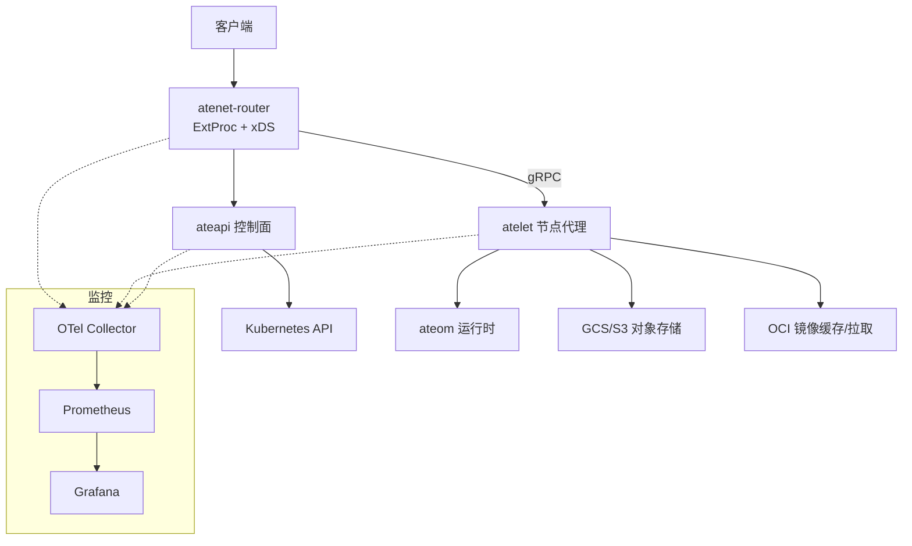
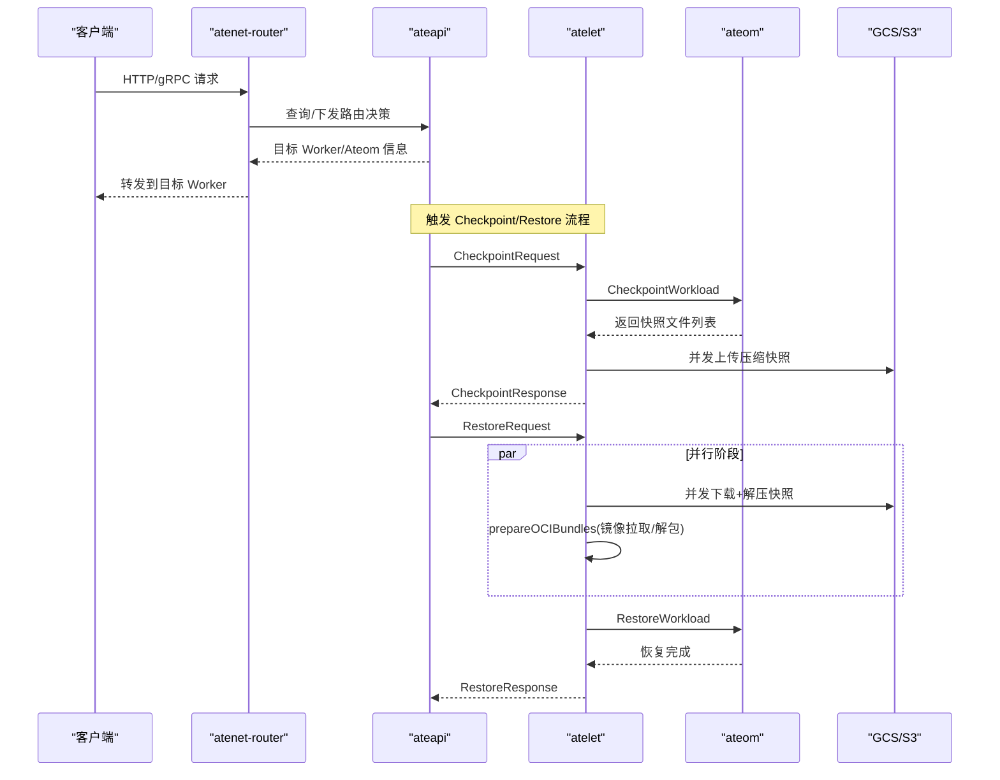
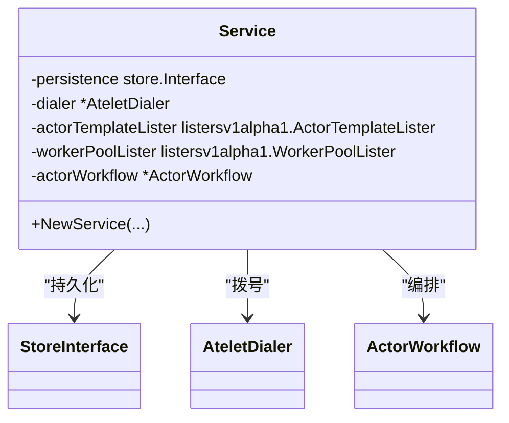
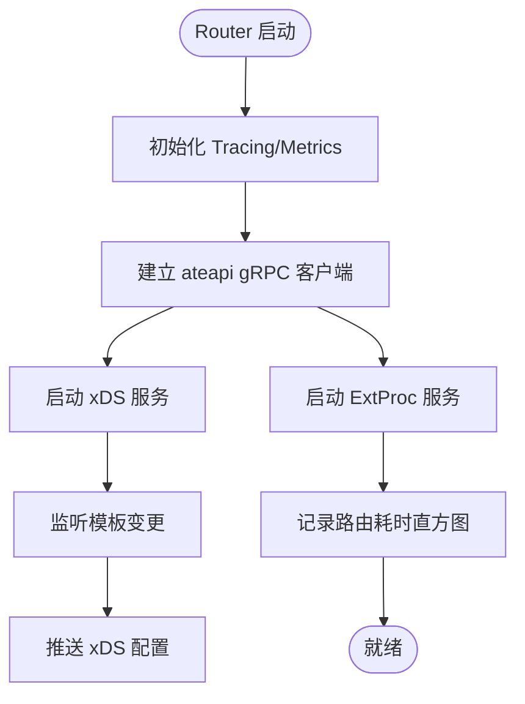
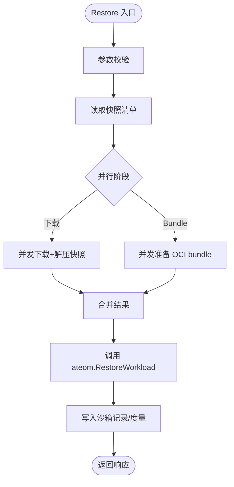
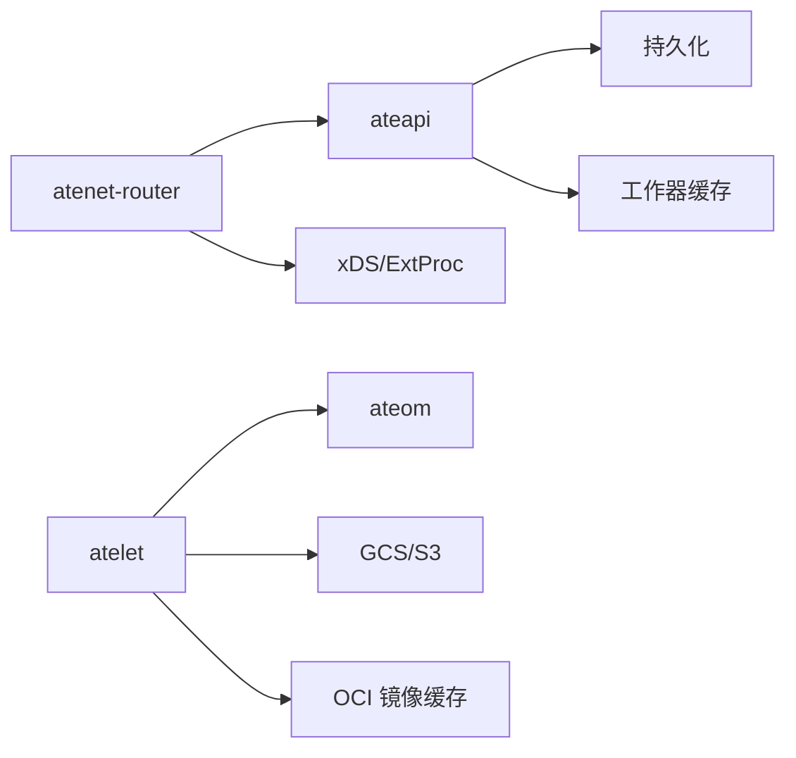

# 性能优化策略

<cite>
**本文引用的文件**   
- [README.md](file://README.md)
- [observability.md](file://docs/observability.md)
- [benchmarking/README.md](file://benchmarking/README.md)
- [monitoring.yaml](file://benchmarking/monitoring.yaml)
- [router.go](file://cmd/atenet/internal/router/router.go)
- [xds.go](file://cmd/atenet/internal/router/xds.go)
- [service.go](file://cmd/ateapi/internal/controlapi/service.go)
- [main.go](file://cmd/atelet/main.go)
- [objects_test.go](file://cmd/atelet/internal/ategcs/objects_test.go)
- [readyz.go](file://internal/readyz/readyz.go)
- [demo_test.go](file://internal/e2e/suites/demo/demo_test.go)
</cite>

## 目录
1. [简介](#简介)
2. [项目结构](#项目结构)
3. [核心组件](#核心组件)
4. [架构总览](#架构总览)
5. [详细组件分析](#详细组件分析)
6. [依赖关系分析](#依赖关系分析)
7. [性能考量与优化建议](#性能考量与优化建议)
8. [故障排查指南](#故障排查指南)
9. [结论](#结论)
10. [附录](#附录)

## 简介
本文件面向多路复用系统（Agent Substrate）的性能优化，聚焦以下方面：内存池与对象重用、I/O 零拷贝与异步批量、网络通信连接池与负载均衡、CPU 使用率与线程调度、以及可观测性与基准测试驱动的调优实践。内容基于仓库中控制面、数据面、节点代理与基准测试相关实现进行归纳与分析，并提供可视化图示帮助理解关键路径与优化点。

## 项目结构
从性能视角看，本项目由控制面（ateapi）、路由与流量面（atenet-router + Envoy）、节点代理（atelet）与内部运行时（ateom）组成；同时提供 Locust 基准测试与 Prometheus/Grafana 监控栈。

图表来源
- [router.go:152-315](file://cmd/atenet/internal/router/router.go#L152-L315)
- [xds.go:236-284](file://cmd/atenet/internal/router/xds.go#L236-L284)
- [service.go:25-57](file://cmd/ateapi/internal/controlapi/service.go#L25-L57)
- [main.go:74-183](file://cmd/atelet/main.go#L74-L183)

章节来源
- [README.md:1-225](file://README.md#L1-L225)

## 核心组件
- ateapi 控制面：暴露 gRPC 接口管理 Actor/Worker 生命周期，维护工作器缓存与持久化状态。
- atenet-router：集成 ExtProc 与 xDS，驱动 Envoy 完成请求路由与负载均衡，并上报端到端延迟指标。
- atelet 节点代理：负责在宿主机侧拉起/检查点/恢复工作负载，协调镜像拉取、快照上传下载与本地缓存。
- ateom 运行时：运行于沙箱内，执行 runsc/cloud-hypervisor 等具体运行时操作。

章节来源
- [service.go:25-57](file://cmd/ateapi/internal/controlapi/service.go#L25-L57)
- [router.go:152-315](file://cmd/atenet/internal/router/router.go#L152-L315)
- [main.go:74-183](file://cmd/atelet/main.go#L74-L183)

## 架构总览
下图展示一次典型“暂停-迁移-恢复”流程中的关键性能路径：快照大小度量、并发下载与解压、OCI bundle 准备、以及 ateom 的 restore 阶段。

图表来源
- [main.go:309-583](file://cmd/atelet/main.go#L309-L583)

章节来源
- [main.go:309-583](file://cmd/atelet/main.go#L309-L583)

## 详细组件分析

### 控制面（ateapi）
- 职责：对外暴露 Control gRPC 服务，封装持久化、工作器缓存、模板/池列表器与 atelet 拨号器，编排 Actor 工作流。
- 性能要点：
  - 通过工作器缓存减少跨进程/跨节点查询开销。
  - 将复杂工作流收敛至单一编排器，避免热点路径上的重复计算。

图表来源
- [service.go:25-57](file://cmd/ateapi/internal/controlapi/service.go#L25-L57)

章节来源
- [service.go:25-57](file://cmd/ateapi/internal/controlapi/service.go#L25-L57)

### 路由与流量面（atenet-router）
- 职责：启动 xDS 服务器、ExtProc、健康检查与可选状态页；初始化 OTel 追踪与指标；构建集群配置与 DNS 缓存。
- 性能要点：
  - 使用静态集群与轮询负载均衡策略，降低动态发现开销。
  - 启用 DNS 缓存以减少解析抖动。
  - 为 ExtProc 与 xDS 分别监听端口，避免竞争。

图表来源
- [router.go:152-315](file://cmd/atenet/internal/router/router.go#L152-L315)
- [xds.go:236-284](file://cmd/atenet/internal/router/xds.go#L236-L284)

章节来源
- [router.go:152-315](file://cmd/atenet/internal/router/router.go#L152-L315)
- [xds.go:236-284](file://cmd/atenet/internal/router/xds.go#L236-L284)

### 节点代理（atelet）
- 职责：Run/Checkpoint/Restore 三大主路径；并发上传/下载快照；并发准备 OCI bundle；记录快照大小指标。
- 性能要点：
  - 使用 errgroup 并发执行下载与 bundle 准备，隐藏冷启动瓶颈。
  - 对快照文件采用 zstd 压缩传输，结合稀疏写与空洞洞技术减少磁盘占用与 I/O。
  - 通过 LRU 连接池复用 ateom 连接，降低握手成本。
  - 暴露 prometheus 指标端点，采集 snapshot.size 直方图。

图表来源
- [main.go:454-583](file://cmd/atelet/main.go#L454-L583)

章节来源
- [main.go:74-183](file://cmd/atelet/main.go#L74-L183)
- [main.go:309-583](file://cmd/atelet/main.go#L309-L583)
- [objects_test.go:306-465](file://cmd/atelet/internal/ategcs/objects_test.go#L306-L465)

### 就绪探针与连接复用
- 就绪探针使用高并发短超时、单 host 最小空闲连接的 HTTP 客户端，避免探针风暴影响业务。
- 通过限制 idle 连接数与短超时，降低资源占用与尾延迟。

章节来源
- [readyz.go:34-60](file://internal/readyz/readyz.go#L34-L60)

### 基准测试与监控
- 使用 Locust 生成不同负载模型（睡眠、用户态内存、内核态内存），并通过 Prometheus/Grafana 观察延迟与活跃用户曲线。
- 监控面板包含 P99 延迟与按工作负载划分的活跃用户数。

章节来源
- [benchmarking/README.md:1-90](file://benchmarking/README.md#L1-L90)
- [monitoring.yaml:497-542](file://benchmarking/monitoring.yaml#L497-L542)

## 依赖关系分析
- 控制面依赖持久化层与工作器缓存，减少对后端查询压力。
- 路由层依赖 xDS/ExtProc 与 ateapi，形成低耦合的数据面与控制面分离。
- 节点代理依赖对象存储（GCS/S3）、OCI 镜像缓存与 ateom 运行时，构成快照与镜像的 I/O 密集路径。

图表来源
- [service.go:25-57](file://cmd/ateapi/internal/controlapi/service.go#L25-L57)
- [router.go:152-315](file://cmd/atenet/internal/router/router.go#L152-L315)
- [main.go:74-183](file://cmd/atelet/main.go#L74-L183)

章节来源
- [service.go:25-57](file://cmd/ateapi/internal/controlapi/service.go#L25-L57)
- [router.go:152-315](file://cmd/atenet/internal/router/router.go#L152-L315)
- [main.go:74-183](file://cmd/atelet/main.go#L74-L183)

## 性能考量与优化建议

### 内存池管理与对象重用
- 连接复用：节点代理使用 LRU 连接池复用 ateom gRPC 连接，减少握手与上下文切换成本。
- 对象重用：在快照处理与 bundle 准备中使用并发 goroutine 与 errgroup，避免频繁创建销毁临时对象带来的 GC 压力。
- 建议：
  - 在高并发路径上尽量复用缓冲与连接，减少分配。
  - 对热点对象使用对象池或预分配策略，降低 GC 频率。

章节来源
- [main.go:104-116](file://cmd/atelet/main.go#L104-L116)

### I/O 优化：零拷贝、异步与批量
- 零拷贝/稀疏写：快照文件支持稀疏写与空洞洞，减少实际磁盘占用与 I/O 放大。
- 异步与批量：快照上传/下载与 bundle 准备并行执行；上传/下载均按文件并发，提升吞吐。
- 建议：
  - 优先使用零拷贝/稀疏写能力，配合文件系统特性（如 fallocate/discard）。
  - 对大对象采用分块并发与流水线处理，提高带宽利用率。

章节来源
- [objects_test.go:306-465](file://cmd/atelet/internal/ategcs/objects_test.go#L306-L465)
- [main.go:514-544](file://cmd/atelet/main.go#L514-L544)

### 网络通信优化：连接池、请求合并与负载均衡
- 连接池：atelet 对 ateom 的连接使用 LRU 缓存，降低连接建立开销。
- 负载均衡：路由器使用静态集群与轮询策略，简单稳定且易于水平扩展。
- 请求合并：可在上层对相同键的请求做去抖/合并（例如单飞），减少重复工作。
- 建议：
  - 根据 QPS 调整连接池大小与超时，避免过多连接导致拥塞。
  - 在热点路由场景下引入请求合并与幂等重试，降低后端压力。

章节来源
- [main.go:104-116](file://cmd/atelet/main.go#L104-L116)
- [xds.go:236-284](file://cmd/atenet/internal/router/xds.go#L236-L284)

### CPU 使用率优化：线程池与计算密集型任务
- 线程模型：Go 原生 goroutine 调度天然适合高并发 I/O；对于 CPU 密集任务，应限制并发度并按核隔离。
- 建议：
  - 对 CPU 密集路径设置合理的并发上限，避免抢占 I/O 路径。
  - 利用亲和性/隔离将关键路径绑定到专用核，降低抖动。

章节来源
- [main.go:514-544](file://cmd/atelet/main.go#L514-L544)

### 可观测性与指标定义
- 指标：
  - rpc.server.call.duration：gRPC 服务端调用时延直方图（ateapi/atelet）。
  - atenet.router.route.duration：端到端路由时延（不含 Actor 计算与响应）。
  - atelet.snapshot.size：每次 checkpoint 生成的未压缩快照大小直方图。
- 追踪：
  - 通过 OTel 注入 trace context，支持端到端链路追踪。
- 建议：
  - 以 P95/P99 作为 SLI，结合错误率与饱和度构建 SLO。
  - 在关键路径增加细分标签（如模板名、命名空间）以便定位热点。

章节来源
- [observability.md:103-133](file://docs/observability.md#L103-L133)
- [observability.md:137-166](file://docs/observability.md#L137-L166)

### 基准测试与调优实践
- 工具链：Locust 生成多种负载模型，Prometheus/Grafana 收集与可视化。
- 关注指标：P99 延迟、活跃用户数、各工作负载分布。
- 建议：
  - 先压测基线，再逐项优化（I/O、连接池、负载均衡），对比前后差异。
  - 针对长尾延迟，重点优化慢路径（如镜像拉取、快照上传/下载）。

章节来源
- [benchmarking/README.md:1-90](file://benchmarking/README.md#L1-L90)
- [monitoring.yaml:497-542](file://benchmarking/monitoring.yaml#L497-L542)

## 故障排查指南
- 常见症状：
  - 恢复缓慢：检查快照大小与网络吞吐，确认是否受限于对象存储或磁盘 I/O。
  - 路由抖动：查看 xDS 更新频率与 DNS 缓存命中情况。
  - 探针失败：检查就绪探针超时与连接数限制。
- 定位方法：
  - 使用 Jaeger 查看端到端链路，定位慢步骤。
  - 通过 Prometheus 查看 route.duration 与 snapshot.size 分布。
  - 核对 atelet 日志中的恢复阶段耗时分解（download/oci_unpack/ateom_restore）。

章节来源
- [observability.md:143-166](file://docs/observability.md#L143-L166)
- [main.go:577-582](file://cmd/atelet/main.go#L577-L582)

## 结论
通过连接复用、并发 I/O、稀疏写与快照压缩、稳定的负载均衡与完善的可观测体系，Agent Substrate 在多路复用场景下实现了高吞吐与低延迟。建议在持续压测的基础上，围绕热点路径进行精细化调优，并以指标驱动迭代优化。

## 附录
- 术语：
  - Actor：被管理的有状态应用实例。
  - Worker：承载 Actor 的物理 Pod。
  - Snapshot：运行时状态的快照，用于快速迁移与恢复。
- 参考：
  - 安装与演示脚本见仓库根目录 README。

章节来源
- [README.md:1-225](file://README.md#L1-L225)
