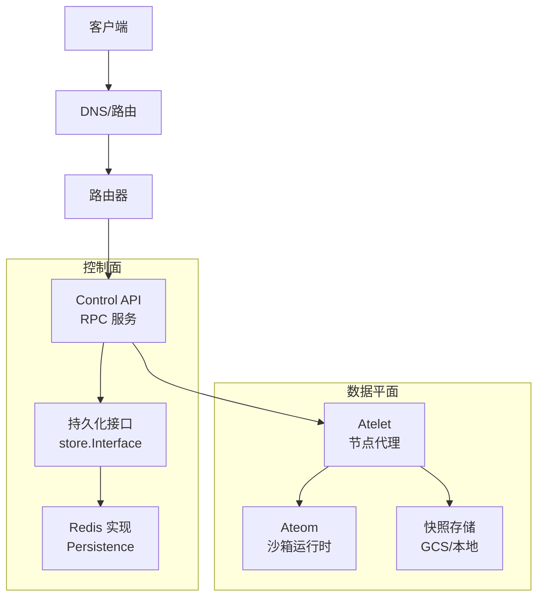
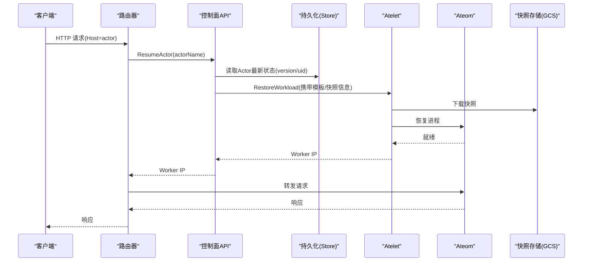
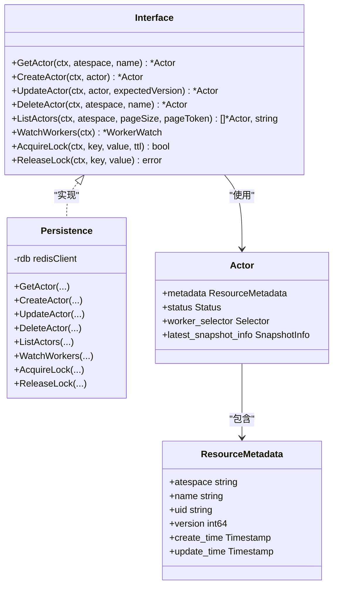
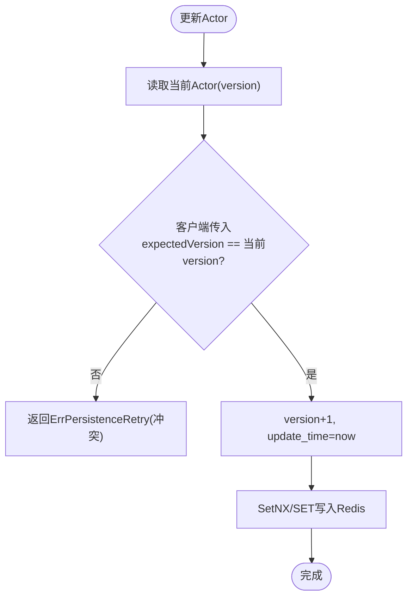
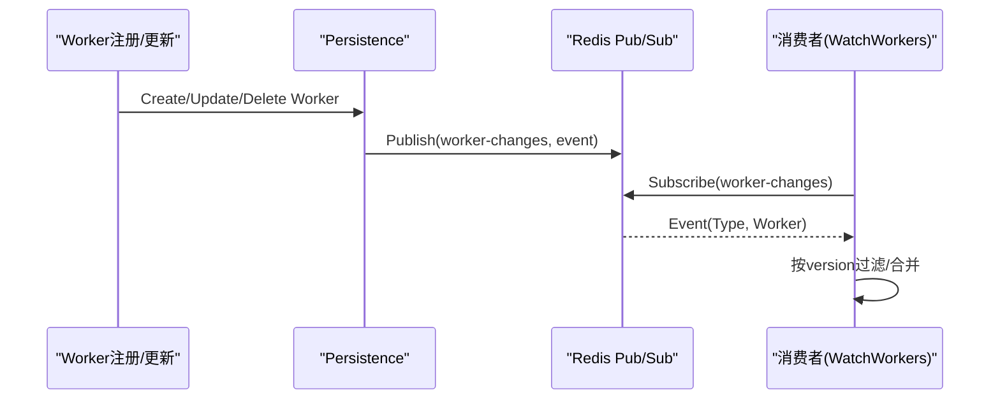
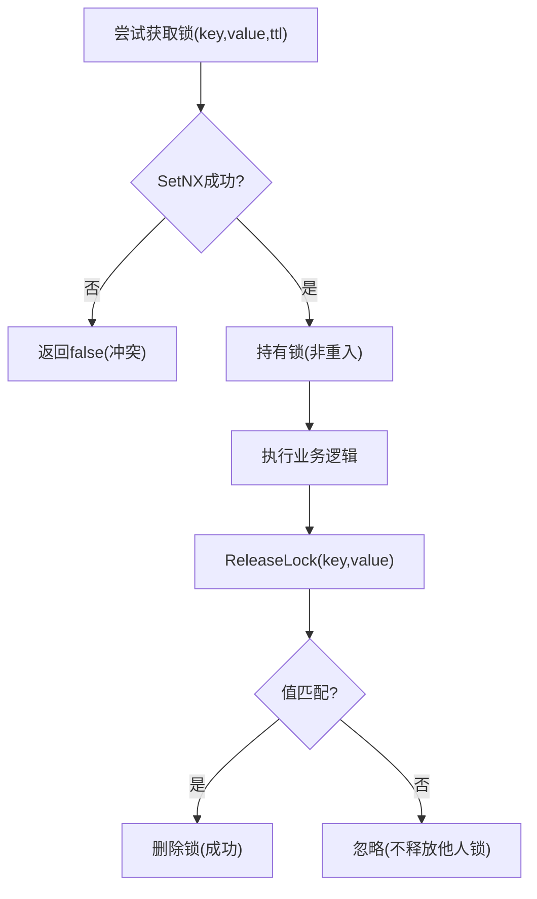
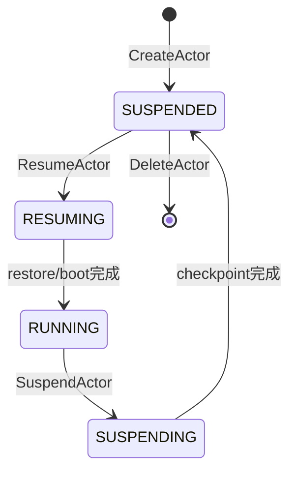
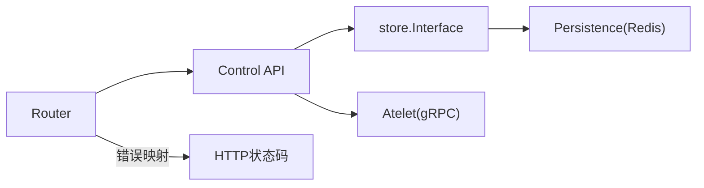

# 状态管理与一致性

<cite>
**本文引用的文件**   
- [store.go](file://cmd/ateapi/internal/store/store.go)
- [ateredis.go](file://cmd/ateapi/internal/store/ateredis/ateredis.go)
- [ateapi.proto](file://pkg/proto/ateapipb/ateapi.proto)
- [architecture.md](file://docs/architecture.md)
- [workflow_suspend.go](file://cmd/ateapi/internal/controlapi/workflow_suspend.go)
- [resume_actor.go](file://cmd/kubectl-ate/internal/cmd/resume_actor.go)
- [observability.md](file://docs/observability.md)
- [atenet-router-monitoring.yaml](file://manifests/ate-install/atenet-router-monitoring.yaml)
- [errors.go](file://cmd/atenet/internal/router/errors.go)
- [ateerrors.go](file://internal/ateerrors/ateerrors.go)
</cite>

## 目录
1. [引言](#引言)
2. [项目结构](#项目结构)
3. [核心组件](#核心组件)
4. [架构总览](#架构总览)
5. [详细组件分析](#详细组件分析)
6. [依赖关系分析](#依赖关系分析)
7. [性能与一致性考量](#性能与一致性考量)
8. [故障排查指南](#故障排查指南)
9. [结论](#结论)
10. [附录](#附录)

## 引言
本文件围绕多路复用系统中的状态管理架构与一致性保证机制展开，重点说明：
- Actor 状态的存储结构设计（内存、持久化、分布式）的分层管理
- 状态同步机制（增量事件、冲突检测与解决策略）
- 并发访问控制（乐观锁、分布式锁）
- 状态迁移与版本兼容性管理
- 监控指标与故障恢复策略

目标是帮助开发者理解并维护系统状态的一致性。

## 项目结构
与状态管理直接相关的代码主要分布在以下位置：
- 控制面 API 与持久化接口定义：cmd/ateapi/internal/store
- Redis 实现（分布式状态存储）：cmd/ateapi/internal/store/ateredis
- 协议与资源模型：pkg/proto/ateapipb
- 工作流（如挂起流程）：cmd/ateapi/internal/controlapi
- 文档与可观测性：docs/*, manifests/*

图表来源
- [ateapi.proto:26-65](file://pkg/proto/ateapipb/ateapi.proto#L26-L65)
- [store.go:40-118](file://cmd/ateapi/internal/store/store.go#L40-L118)
- [ateredis.go:76-88](file://cmd/ateapi/internal/store/ateredis/ateredis.go#L76-L88)
- [architecture.md:353-396](file://docs/architecture.md#L353-L396)

章节来源
- [store.go:40-118](file://cmd/ateapi/internal/store/store.go#L40-L118)
- [ateredis.go:76-88](file://cmd/ateapi/internal/store/ateredis/ateredis.go#L76-L88)
- [ateapi.proto:26-65](file://pkg/proto/ateapipb/ateapi.proto#L26-L65)
- [architecture.md:353-396](file://docs/architecture.md#L353-L396)

## 核心组件
- 持久化接口 store.Interface：定义了 Actor、Atespace、Worker 的 CRUD、分页、监听以及分布式锁能力。
- Redis 实现 Persistence：基于 Redis/ValKey 集群模式，提供原子性操作、Lua 脚本、Pub/Sub 事件通知。
- 协议模型 ateapipb：Actor、Worker、SnapshotInfo、ResourceMetadata 等消息定义，包含 version/uid 等一致性字段。
- 控制面工作流：以步骤化工作流驱动复杂状态迁移（如 SuspendActor）。

章节来源
- [store.go:40-118](file://cmd/ateapi/internal/store/store.go#L40-L118)
- [ateredis.go:76-88](file://cmd/ateapi/internal/store/ateredis/ateredis.go#L76-L88)
- [ateapi.proto:93-164](file://pkg/proto/ateapipb/ateapi.proto#L93-L164)
- [workflow_suspend.go:77-174](file://cmd/ateapi/internal/controlapi/workflow_suspend.go#L77-L174)

## 架构总览
系统采用“控制面 + 数据平面”分层：
- 控制面负责状态机流转、调度、持久化与事件广播
- 数据平面负责执行与快照（内存+磁盘）的冻结/恢复

图表来源
- [architecture.md:353-396](file://docs/architecture.md#L353-L396)
- [resume_actor.go:41-58](file://cmd/kubectl-ate/internal/cmd/resume_actor.go#L41-L58)

章节来源
- [architecture.md:353-396](file://docs/architecture.md#L353-L396)
- [resume_actor.go:41-58](file://cmd/kubectl-ate/internal/cmd/resume_actor.go#L41-L58)

## 详细组件分析

### 组件一：持久化接口与数据结构
- 接口职责
  - Actor/Atespace/Worker 的增删改查与分页
  - WatchWorkers 事件订阅（基于 Pub/Sub）
  - AcquireLock/ReleaseLock 分布式锁
- 数据结构要点
  - ResourceMetadata 包含 uid/version/create_time/update_time
  - Actor 状态机：SUSPENDED/RESUMING/RUNNING/SUSPENDING/SUSPENDED/PAUSED/CRASHED
  - Worker 记录分配信息与版本

图表来源
- [store.go:40-118](file://cmd/ateapi/internal/store/store.go#L40-L118)
- [ateredis.go:76-88](file://cmd/ateapi/internal/store/ateredis/ateredis.go#L76-L88)
- [ateapi.proto:93-164](file://pkg/proto/ateapipb/ateapi.proto#L93-L164)

章节来源
- [store.go:40-118](file://cmd/ateapi/internal/store/store.go#L40-L118)
- [ateapi.proto:93-164](file://pkg/proto/ateapipb/ateapi.proto#L93-L164)

### 组件二：Redis 分布式状态存储
- 键空间设计
  - actor:<atespace>:<name>
  - worker:<namespace>:<pool>:<pod>
  - atespace:<name>
- 一致性保障
  - SetNX 创建幂等检查
  - UpdateActor 通过 expectedVersion 进行乐观锁校验
  - Lua 脚本释放锁时原子比较值再删除
- 事件通知
  - Pub/Sub 通道 worker-changes 推送 Worker 变更事件
- 集群限制
  - 单脚本不能跨槽点原子操作，需分步并确保顺序

图表来源
- [ateredis.go:336-358](file://cmd/ateapi/internal/store/ateredis/ateredis.go#L336-L358)
- [ateredis.go:770-792](file://cmd/ateapi/internal/store/ateredis/ateredis.go#L770-L792)
- [store.go:50-53](file://cmd/ateapi/internal/store/store.go#L50-L53)

章节来源
- [ateredis.go:336-358](file://cmd/ateapi/internal/store/ateredis/ateredis.go#L336-L358)
- [ateredis.go:770-792](file://cmd/ateapi/internal/store/ateredis/ateredis.go#L770-L792)
- [store.go:50-53](file://cmd/ateapi/internal/store/store.go#L50-L53)

### 组件三：状态同步与增量事件
- 事件类型：Created/Updated/Deleted
- 发布/订阅
  - 写路径在 CreateWorker/UpdateWorker/DeleteWorker 后发布事件
  - WatchWorkers 返回带缓冲的事件通道，支持重连与关闭
- 消费端建议
  - 按 version 去重与排序，避免旧事件覆盖新状态

图表来源
- [ateredis.go:244-297](file://cmd/ateapi/internal/store/ateredis/ateredis.go#L244-L297)
- [store.go:120-155](file://cmd/ateapi/internal/store/store.go#L120-L155)

章节来源
- [ateredis.go:244-297](file://cmd/ateapi/internal/store/ateredis/ateredis.go#L244-L297)
- [store.go:120-155](file://cmd/ateapi/internal/store/store.go#L120-L155)

### 组件四：并发访问控制与冲突解决
- 乐观锁
  - 通过 ResourceMetadata.version 递增与 expectedVersion 校验，防止丢失更新
  - 配合 uid 防 ABA（名称重用场景）
- 分布式锁
  - AcquireLock/SetNX 带 TTL，非重入
  - ReleaseLock 使用 Lua 原子比较值再删除，避免误删他人锁
- 重试策略
  - 遇到 ErrPersistenceRetry 时，上层工作流可按退避重试

图表来源
- [ateredis.go:770-792](file://cmd/ateapi/internal/store/ateredis/ateredis.go#L770-L792)
- [store.go:104-118](file://cmd/ateapi/internal/store/store.go#L104-L118)

章节来源
- [ateredis.go:770-792](file://cmd/ateapi/internal/store/ateredis/ateredis.go#L770-L792)
- [store.go:104-118](file://cmd/ateapi/internal/store/store.go#L104-L118)

### 组件五：状态迁移与工作流（以挂起为例）
- 关键步骤
  - MarkSuspending：将状态置为 SUSPENDING，生成 in_progress_snapshot
  - CallAteletSuspendStep：调用 Atelet 对进程做 Checkpoint，落盘到外部存储
  - FinalizeSuspendedStep：释放 Worker 绑定，更新 latest_snapshot_info，回写 SUSPENDED
- 一致性要点
  - 每步写持久化都带 expectedVersion，失败则回滚或重试
  - 最终一致性由工作流保证

图表来源
- [architecture.md:386-396](file://docs/architecture.md#L386-L396)
- [workflow_suspend.go:77-174](file://cmd/ateapi/internal/controlapi/workflow_suspend.go#L77-L174)
- [workflow_suspend.go:170-250](file://cmd/ateapi/internal/controlapi/workflow_suspend.go#L170-L250)

章节来源
- [workflow_suspend.go:77-174](file://cmd/ateapi/internal/controlapi/workflow_suspend.go#L77-L174)
- [workflow_suspend.go:170-250](file://cmd/ateapi/internal/controlapi/workflow_suspend.go#L170-L250)
- [architecture.md:386-396](file://docs/architecture.md#L386-L396)

### 组件六：版本兼容性与快照
- 快照包含两类状态：内存快照与工作卷（磁盘）
- 快照与 ActorTemplate 版本绑定，确保恢复严格一致
- 快照落盘至外部存储（如 GCS），空闲时可回收计算资源

章节来源
- [architecture.md:448-464](file://docs/architecture.md#L448-L464)

## 依赖关系分析
- 控制面依赖持久化接口，具体实现为 Redis
- 工作流依赖持久化接口与 Atelet RPC
- 路由器将 gRPC 错误映射为 HTTP 状态码，便于前端处理

图表来源
- [store.go:40-118](file://cmd/ateapi/internal/store/store.go#L40-L118)
- [ateredis.go:76-88](file://cmd/ateapi/internal/store/ateredis/ateredis.go#L76-L88)
- [errors.go:61-92](file://cmd/atenet/internal/router/errors.go#L61-L92)

章节来源
- [store.go:40-118](file://cmd/ateapi/internal/store/store.go#L40-L118)
- [ateredis.go:76-88](file://cmd/ateapi/internal/store/ateredis/ateredis.go#L76-L88)
- [errors.go:61-92](file://cmd/atenet/internal/router/errors.go#L61-L92)

## 性能与一致性考量
- 乐观锁 vs 分布式锁
  - 乐观锁适用于读多写少且冲突概率低的场景；分布式锁用于跨实例互斥
- Redis 集群约束
  - 单脚本不可跨槽点原子操作，需拆分步骤并保证顺序
- 事件订阅
  - 使用带缓冲通道与超时确认，降低丢事件风险
- 快照大小与网络带宽
  - 大快照会拉长 Suspend/Resume 延迟，需结合压缩与分片策略

[本节为通用指导，无需特定文件引用]

## 故障排查指南
- 常见错误与定位
  - 冲突/重试：ErrPersistenceRetry 表示版本冲突，应重试
  - 未找到：ErrNotFound 表示对象不存在
  - 前置条件失败：ErrFailedPrecondition 表示状态不满足
- 错误传播
  - 控制面通过 gRPC ErrorInfo 携带 Reason 与元数据，上层据此决定是否触发崩溃/恢复
  - 路由器将 gRPC 错误映射为 HTTP 状态码，便于客户端感知
- 可观测性
  - OTLP 指标：rpc.server.call.duration、atenet.router.route.duration、atelet.snapshot.size
  - Prometheus 抓取 Envoy /stats/prometheus 指标，辅助端到端延迟分析

章节来源
- [store.go:26-38](file://cmd/ateapi/internal/store/store.go#L26-L38)
- [ateerrors.go:68-129](file://internal/ateerrors/ateerrors.go#L68-L129)
- [errors.go:61-92](file://cmd/atenet/internal/router/errors.go#L61-L92)
- [observability.md:103-133](file://docs/observability.md#L103-L133)
- [atenet-router-monitoring.yaml:15-35](file://manifests/ate-install/atenet-router-monitoring.yaml#L15-L35)

## 结论
本系统通过“乐观锁 + 分布式锁 + 事件订阅 + 工作流”的组合，实现了 Actor 状态在多实例下的强一致与高可用。快照与模板版本绑定确保了恢复时的严格一致性。配合完善的错误分类与可观测性体系，开发者可以高效定位问题并持续优化系统稳定性。

[本节为总结，无需特定文件引用]

## 附录
- 术语
  - Atespace：隔离边界
  - Actor：应用实例
  - Worker：承载 Actor 的工作节点
  - Snapshot：内存+磁盘快照
- 参考
  - 资源新鲜度与乐观并发：version/uid 语义与用法

[本节为补充说明，无需特定文件引用]
