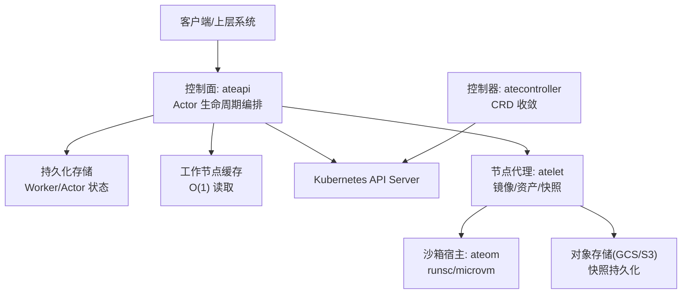
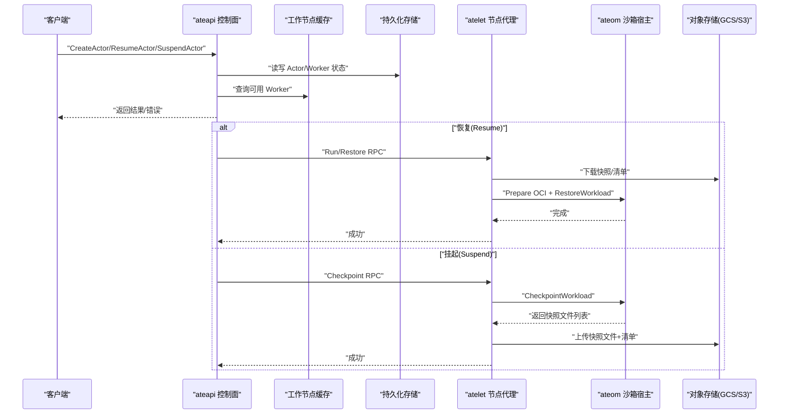
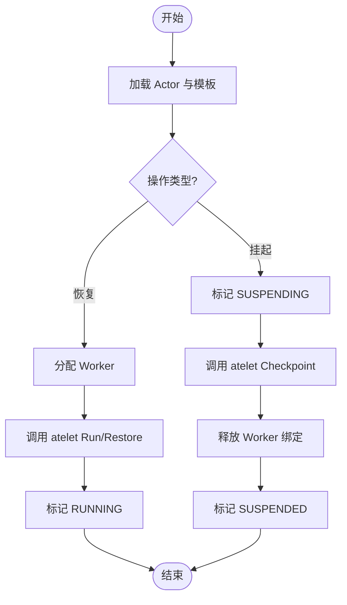
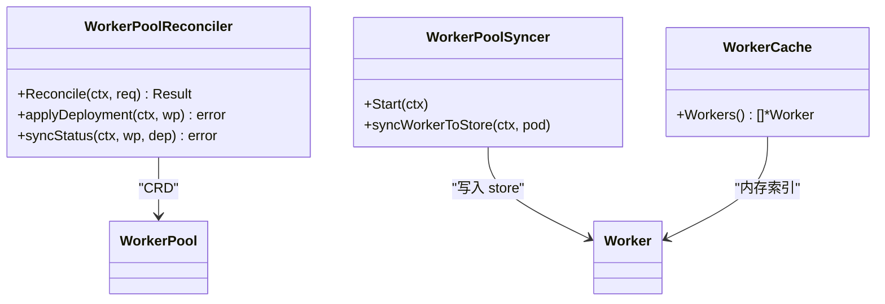
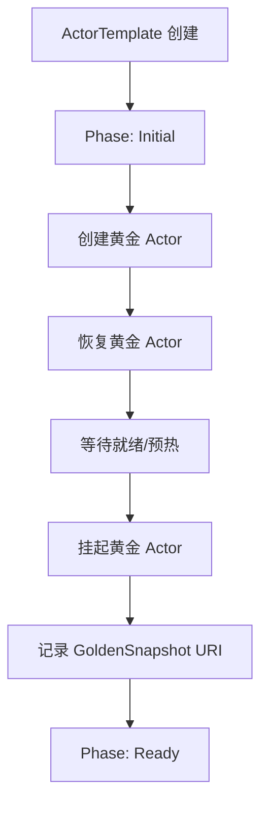
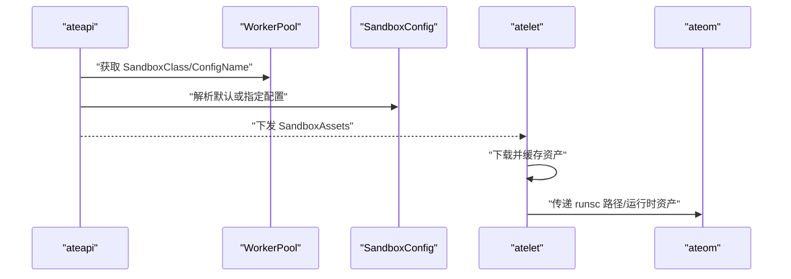
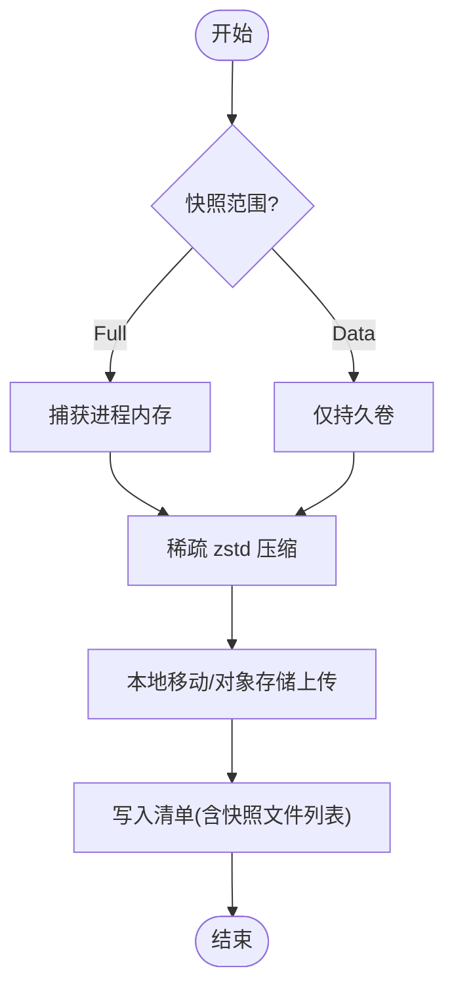
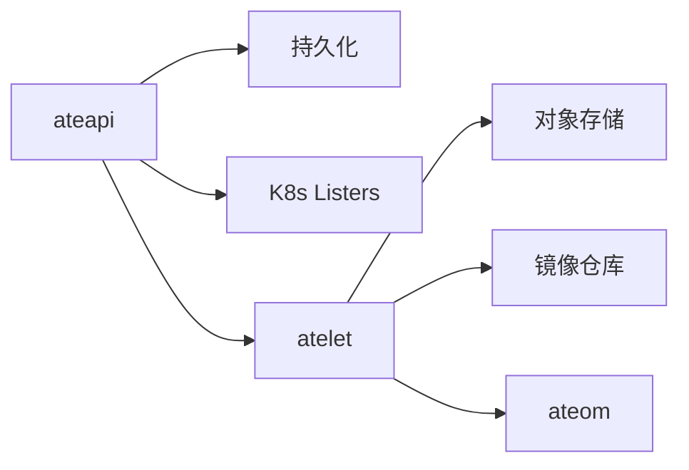

# 核心概念

<cite>
**本文引用的文件**   
- [README.md](file://README.md)
- [actortemplate_types.go](file://pkg/api/v1alpha1/actortemplate_types.go)
- [sandboxconfig_types.go](file://pkg/api/v1alpha1/sandboxconfig_types.go)
- [workerpool_types.go](file://pkg/api/v1alpha1/workerpool_types.go)
- [workflow.go](file://cmd/ateapi/internal/controlapi/workflow.go)
- [workflow_resume.go](file://cmd/ateapi/internal/controlapi/workflow_resume.go)
- [workflow_suspend.go](file://cmd/ateapi/internal/controlapi/workflow_suspend.go)
- [create_actor.go](file://cmd/ateapi/internal/controlapi/create_actor.go)
- [workercache.go](file://cmd/ateapi/internal/workercache/workercache.go)
- [syncer.go](file://cmd/ateapi/internal/controlapi/syncer.go)
- [workerpool_controller.go](file://cmd/atecontroller/internal/controllers/workerpool_controller.go)
- [workerpool_apply.go](file://cmd/atecontroller/internal/controllers/workerpool_apply.go)
- [actortemplate_controller.go](file://cmd/atecontroller/internal/controllers/actortemplate_controller.go)
- [main.go](file://cmd/atelet/main.go)
- [sandbox_assets.go](file://cmd/atelet/sandbox_assets.go)
- [sparsezstd.go](file://cmd/atelet/internal/ategcs/sparsezstd.go)
- [objects_test.go](file://cmd/atelet/internal/ategcs/objects_test.go)
</cite>

## 目录
1. [简介](#简介)
2. [项目结构](#项目结构)
3. [核心组件](#核心组件)
4. [架构总览](#架构总览)
5. [详细组件分析](#详细组件分析)
6. [依赖关系分析](#依赖关系分析)
7. [性能考量](#性能考量)
8. [故障排查指南](#故障排查指南)
9. [结论](#结论)
10. [附录：配置示例与最佳实践](#附录配置示例与最佳实践)

## 简介
本文件聚焦于 Agent Substrate 的核心概念与设计模式，围绕以下主题展开：
- Actor 模型与生命周期管理（创建、挂起、恢复、暂停）
- 状态持久化与快照机制（内存快照、文件系统增量、本地与外部存储）
- WorkerPool 的概念与工作机制（物理工作节点管理与调度）
- ActorTemplate 的设计模式与运行时环境定义
- SandboxConfig 的安全隔离机制（gVisor 与 MicroVM）
- 多路复用技术实现原理（内存快照、文件系统状态保存与恢复）
- 配置示例与最佳实践建议

## 项目结构
Agent Substrate 由控制面与工作节点侧协同组成：
- 控制面（ateapi）：对外暴露 gRPC API，编排 Actor 生命周期，协调 Worker 分配与快照流程
- 控制器（atecontroller）：基于 Kubernetes CRD 的控制器，负责 WorkerPool 与 ActorTemplate 的声明式期望与实际状态收敛
- 节点代理（atelet）：运行在每个物理节点上，负责镜像拉取、沙箱二进制下载、OCI Bundle 准备、与 ateom 交互执行 Run/Checkpoint/Restore
- 沙箱运行时（ateom-gvisor / ateom-microvm）：在 Pod 内部驱动具体沙箱引擎（如 runsc 或 Kata/MicroVM）完成进程级检查点与恢复

图表来源
- [workflow.go:1-280](file://cmd/ateapi/internal/controlapi/workflow.go#L1-L280)
- [workerpool_controller.go:1-121](file://cmd/atecontroller/internal/controllers/workerpool_controller.go#L1-L121)
- [main.go:1-800](file://cmd/atelet/main.go#L1-L800)

章节来源
- [README.md:1-225](file://README.md#L1-L225)

## 核心组件
- Actor 模型与生命周期
  - 通过工作流（Workflow）将复杂操作分解为幂等步骤，支持快速前向恢复与重试
  - 关键状态包括 SUSPENDED、RESUMING、RUNNING、SUSPENDING、PAUSED 等
- WorkerPool 与工作节点管理
  - 控制器根据 WorkerPool CRD 生成并维护 Deployment，同步实际副本数到状态
  - 控制面维护在线 Worker 缓存，用于 O(1) 选择空闲节点进行调度
- ActorTemplate 与运行时环境
  - 描述容器镜像、环境变量、就绪探针、卷挂载、快照范围等
  - 支持“黄金快照”预热，加速首次启动
- SandboxConfig 与安全隔离
  - 以集群级资源定义不同沙箱类（gVisor、MicroVM）所需的二进制资产
  - 按架构分发内容寻址的资产，确保可重复与完整性校验
- 多路复用与快照
  - 使用稀疏 zstd 格式高效压缩内存快照，结合对象存储实现跨节点迁移
  - 支持本地与外部两种快照位置，按需选择 Full/Data 范围

章节来源
- [workflow.go:1-280](file://cmd/ateapi/internal/controlapi/workflow.go#L1-L280)
- [workflow_resume.go:1-478](file://cmd/ateapi/internal/controlapi/workflow_resume.go#L1-L478)
- [workflow_suspend.go:1-250](file://cmd/ateapi/internal/controlapi/workflow_suspend.go#L1-L250)
- [workercache.go:1-35](file://cmd/ateapi/internal/workercache/workercache.go#L1-L35)
- [actortemplate_types.go:1-390](file://pkg/api/v1alpha1/actortemplate_types.go#L1-L390)
- [sandboxconfig_types.go:1-117](file://pkg/api/v1alpha1/sandboxconfig_types.go#L1-L117)
- [workerpool_types.go:1-136](file://pkg/api/v1alpha1/workerpool_types.go#L1-L136)

## 架构总览
下图展示了从客户端调用到工作节点执行的端到端流程，涵盖 Actor 创建、恢复与挂起的关键路径。

图表来源
- [workflow.go:165-224](file://cmd/ateapi/internal/controlapi/workflow.go#L165-L224)
- [workflow_resume.go:296-444](file://cmd/ateapi/internal/controlapi/workflow_resume.go#L296-L444)
- [workflow_suspend.go:130-168](file://cmd/ateapi/internal/controlapi/workflow_suspend.go#L130-L168)
- [main.go:215-583](file://cmd/atelet/main.go#L215-L583)

## 详细组件分析

### Actor 模型与生命周期管理
- 设计模式
  - 工作流（WorkflowStep）：每个步骤具备 IsComplete、CheckPrerequisite、Execute、RetryBackoff，保证幂等与可重试
  - 锁与超时：对 Actor 粒度加分布式锁，避免并发冲突；上下文超时早于锁 TTL，防止僵尸锁
- 关键流程
  - Resume：加载 Actor 与模板 -> 分配 Worker -> 调用 atelet 执行 Run/Restore -> 标记 RUNNING
  - Suspend：加载 Actor 与模板 -> 标记 SUSPENDING -> 调用 atelet Checkpoint -> 释放 Worker -> 标记 SUSPENDED
  - Pause：类似 Suspend，但进入 PAUSED 状态，保留工作节点以便快速恢复
- 错误处理
  - 若 Worker 消失或不可用，主动 Crash Actor，保持状态一致性
  - 针对持久化冲突采用指数退避重试

图表来源
- [workflow.go:165-224](file://cmd/ateapi/internal/controlapi/workflow.go#L165-L224)
- [workflow_resume.go:142-252](file://cmd/ateapi/internal/controlapi/workflow_resume.go#L142-L252)
- [workflow_suspend.go:79-104](file://cmd/ateapi/internal/controlapi/workflow_suspend.go#L79-L104)

章节来源
- [workflow.go:1-280](file://cmd/ateapi/internal/controlapi/workflow.go#L1-L280)
- [workflow_resume.go:1-478](file://cmd/ateapi/internal/controlapi/workflow_resume.go#L1-L478)
- [workflow_suspend.go:1-250](file://cmd/ateapi/internal/controlapi/workflow_suspend.go#L1-L250)
- [create_actor.go:1-40](file://cmd/ateapi/internal/controlapi/create_actor.go#L1-L40)

### WorkerPool 与工作节点管理
- 控制器职责
  - 监听 WorkerPool CRD，应用 Deployment，并将实际副本数同步回状态
  - 针对 microvm 类自动注入 KVM 设备挂载与节点亲和/容忍策略
- 控制面职责
  - 通过 syncer 监听 Pod 事件，将 Worker 信息同步至 store，供调度器使用
  - workercache 提供内存视图，O(1) 读取，支撑高并发调度
- 调度策略
  - 依据模板 sandboxClass、模板 workerSelector、Actor 自身 worker_selector 过滤候选 Worker
  - 优先选择具有本地快照的节点，减少网络开销

图表来源
- [workerpool_controller.go:1-121](file://cmd/atecontroller/internal/controllers/workerpool_controller.go#L1-L121)
- [workerpool_apply.go:103-130](file://cmd/atecontroller/internal/controllers/workerpool_apply.go#L103-L130)
- [syncer.go:50-186](file://cmd/ateapi/internal/controlapi/syncer.go#L50-L186)
- [workercache.go:1-35](file://cmd/ateapi/internal/workercache/workercache.go#L1-L35)

章节来源
- [workerpool_controller.go:1-121](file://cmd/atecontroller/internal/controllers/workerpool_controller.go#L1-L121)
- [workerpool_apply.go:103-130](file://cmd/atecontroller/internal/controllers/workerpool_apply.go#L103-L130)
- [syncer.go:50-186](file://cmd/ateapi/internal/controlapi/syncer.go#L50-L186)
- [workercache.go:1-35](file://cmd/ateapi/internal/workercache/workercache.go#L1-L35)

### ActorTemplate 设计与配置
- 运行时环境定义
  - 容器镜像、命令参数、环境变量、就绪探针、卷挂载
  - 快照范围：Full（内存+根文件系统增量）、Data（仅持久卷）
  - 沙箱类：gvisor 或 microvm，影响调度与快照兼容性
- 黄金快照
  - 控制器在模板就绪后，拉起一个“黄金 Actor”，等待就绪后挂起并记录快照 URI
  - 后续新 Actor 若无用户快照，可从黄金快照恢复，缩短冷启动时间

图表来源
- [actortemplate_controller.go:66-188](file://cmd/atecontroller/internal/controllers/actortemplate_controller.go#L66-L188)
- [actortemplate_types.go:236-340](file://pkg/api/v1alpha1/actortemplate_types.go#L236-L340)

章节来源
- [actortemplate_types.go:1-390](file://pkg/api/v1alpha1/actortemplate_types.go#L1-L390)
- [actortemplate_controller.go:1-211](file://cmd/atecontroller/internal/controllers/actortemplate_controller.go#L1-L211)

### SandboxConfig 与安全隔离
- 作用
  - 定义不同沙箱类所需的二进制资产（如 gVisor 的 runsc、microvm 的 cloud-hypervisor/kata 组件）
  - 按架构分发，内容寻址（URL+SHA256），确保一致性与完整性
- 解析与下发
  - 控制面根据 WorkerPool 的 SandboxClass 与 SandboxConfigName 解析对应配置
  - atelet 在 Run/Restore 时下载并缓存资产，Checkpoint 时复用同一版本
- 安全隔离
  - gVisor：轻量级内核态沙箱，适合通用场景
  - MicroVM：需要 KVM 与 vhost 设备，更强隔离，控制器自动注入必要挂载与调度约束

图表来源
- [sandboxconfig_types.go:1-117](file://pkg/api/v1alpha1/sandboxconfig_types.go#L1-L117)
- [workerpool_types.go:54-89](file://pkg/api/v1alpha1/workerpool_types.go#L54-L89)
- [main.go:215-271](file://cmd/atelet/main.go#L215-L271)
- [sandbox_assets.go:91-115](file://cmd/atelet/sandbox_assets.go#L91-L115)

章节来源
- [sandboxconfig_types.go:1-117](file://pkg/api/v1alpha1/sandboxconfig_types.go#L1-L117)
- [workerpool_types.go:1-136](file://pkg/api/v1alpha1/workerpool_types.go#L1-L136)
- [main.go:215-271](file://cmd/atelet/main.go#L215-L271)
- [sandbox_assets.go:91-115](file://cmd/atelet/sandbox_assets.go#L91-L115)

### 多路复用与快照机制
- 内存快照
  - 使用稀疏 zstd 格式（ATESPRSE 魔数+版本号），仅序列化非零数据段，显著降低体积与传输时间
  - 测试覆盖版本不兼容拒绝、字节精确还原与空洞打洞
- 文件系统状态
  - DurableDir 卷参与快照，支持 Full/Data 范围控制
  - 本地快照：移动到本地目录并写清单；外部快照：上传对象存储并写清单
- 恢复过程
  - 先下载清单，再并行下载快照与准备 OCI Bundle，最后调用 ateom 执行恢复
  - 记录运行时沙箱资产，确保后续 Checkpoint 使用相同版本

图表来源
- [sparsezstd.go:1-39](file://cmd/atelet/internal/ategcs/sparsezstd.go#L1-L39)
- [objects_test.go:112-340](file://cmd/atelet/internal/ategcs/objects_test.go#L112-L340)
- [main.go:309-452](file://cmd/atelet/main.go#L309-L452)

章节来源
- [sparsezstd.go:1-39](file://cmd/atelet/internal/ategcs/sparsezstd.go#L1-L39)
- [objects_test.go:112-340](file://cmd/atelet/internal/ategcs/objects_test.go#L112-L340)
- [main.go:309-452](file://cmd/atelet/main.go#L309-L452)

## 依赖关系分析
- 控制面依赖
  - 持久化存储：Actor/Worker 元数据、锁、工作分配
  - Kubernetes 列表器：ActorTemplate、WorkerPool、SandboxConfig
  - atelet 连接：通过目标 ateom Pod UID 建立 gRPC 通道
- 控制器依赖
  - Kubernetes API：CRD 与 Deployment 的 Apply 与状态同步
- 节点代理依赖
  - 对象存储：GCS/S3 作为快照后端
  - 镜像仓库：拉取 OCI 镜像并构建 Bundle
  - ateom：执行具体的 Run/Checkpoint/Restore

图表来源
- [workflow.go:132-163](file://cmd/ateapi/internal/controlapi/workflow.go#L132-L163)
- [main.go:1-183](file://cmd/atelet/main.go#L1-L183)

章节来源
- [workflow.go:1-280](file://cmd/ateapi/internal/controlapi/workflow.go#L1-L280)
- [main.go:1-183](file://cmd/atelet/main.go#L1-L183)

## 性能考量
- 调度优化
  - 使用内存缓存 Workers，O(1) 读取，避免频繁查询
  - 优先选择具有本地快照的节点，减少网络 I/O
- 快照优化
  - 稀疏 zstd 压缩，仅传输非零数据段，提升吞吐
  - 并行下载与解压，重叠网络与磁盘 I/O
- 资源隔离
  - 微 VM 类需 KVM 与 vhost 设备，控制器自动注入，避免手工配置误差
- 监控与度量
  - 记录快照大小直方图，便于容量规划与异常检测

[本节为通用指导，无需特定文件引用]

## 故障排查指南
- 常见错误
  - Worker 消失：在 Checkpoint/Restore 阶段若发现 Worker Pod 不存在，会主动 Crash Actor，避免悬挂状态
  - 快照版本不兼容：读取未知版本的稀疏快照会直接失败，防止静默损坏
  - 沙箱资产缺失：无法下载或校验失败会导致运行失败，需检查 URL 与 SHA256
- 定位方法
  - 查看 Actor 状态机转换日志，确认是否卡在某个步骤
  - 检查 atelet 的快照上传/下载日志与对象存储访问权限
  - 核对 SandboxConfig 的 Assets 是否与 WorkerPool 的 SandboxClass 匹配

章节来源
- [workflow_resume.go:309-348](file://cmd/ateapi/internal/controlapi/workflow_resume.go#L309-L348)
- [workflow_suspend.go:118-129](file://cmd/ateapi/internal/controlapi/workflow_suspend.go#L118-L129)
- [objects_test.go:185-227](file://cmd/atelet/internal/ategcs/objects_test.go#L185-L227)

## 结论
Agent Substrate 通过 Actor 模型、工作流编排、WorkerPool 抽象与沙箱隔离，实现了高并发、低延迟的多路复用能力。其快照机制兼顾性能与可靠性，配合黄金快照与本地/外部存储策略，满足多样化部署需求。建议在工程中遵循模板化配置、合理划分快照范围、利用本地快照就近恢复，以获得最佳体验。

[本节为总结性内容，无需特定文件引用]

## 附录：配置示例与最佳实践
- 基本配置要点
  - 定义 WorkerPool：设置 replicas、ateomImage、sandboxClass、可选 template（nodeSelector/tolerations/affinity/resources）
  - 定义 SandboxConfig：为 gvisor 或 microvm 提供按架构分发的 assets（URL+SHA256），并标记 default 或显式引用
  - 定义 ActorTemplate：指定 pauseImage、containers、snapshotsConfig（location/onPause/onCommit）、sandboxClass、workerSelector、volumes
- 最佳实践
  - 使用黄金快照：为无状态或初始化耗时较长的应用启用，缩短冷启动
  - 合理选择快照范围：对热路径使用 Data 范围，减少快照体积；对冷路径使用 Full 范围，保证一致性
  - 节点亲和与容忍：为 microvm 类配置专用节点池，确保 KVM 与 vhost 设备可用
  - 监控与告警：关注快照大小直方图与 atelet 指标，及时发现容量瓶颈

章节来源
- [workerpool_types.go:22-89](file://pkg/api/v1alpha1/workerpool_types.go#L22-L89)
- [sandboxconfig_types.go:52-79](file://pkg/api/v1alpha1/sandboxconfig_types.go#L52-L79)
- [actortemplate_types.go:278-340](file://pkg/api/v1alpha1/actortemplate_types.go#L278-L340)
- [workerpool_apply.go:103-130](file://cmd/atecontroller/internal/controllers/workerpool_apply.go#L103-L130)
