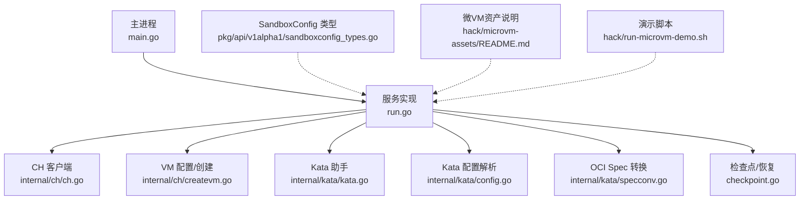
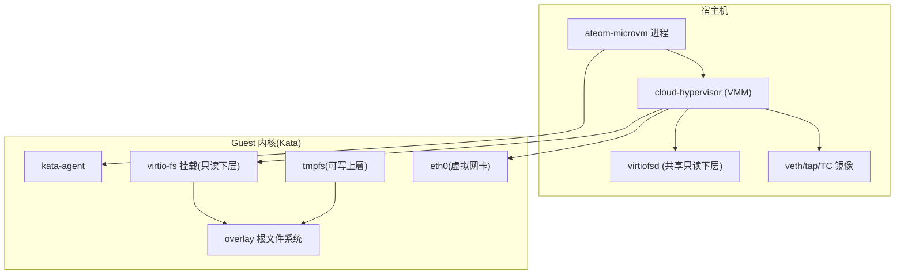
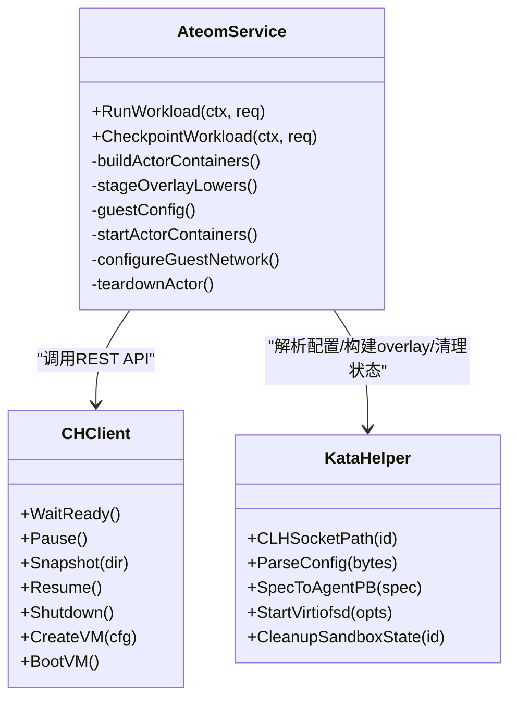
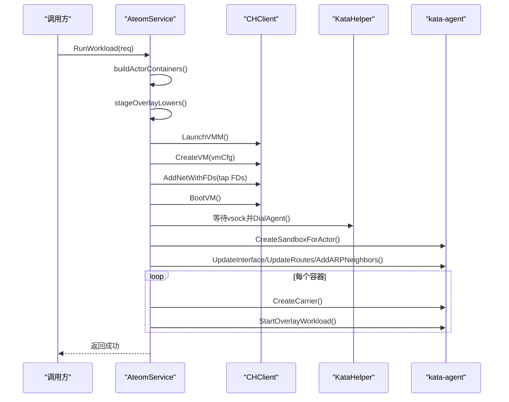
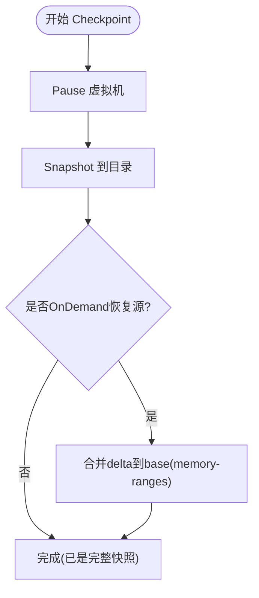
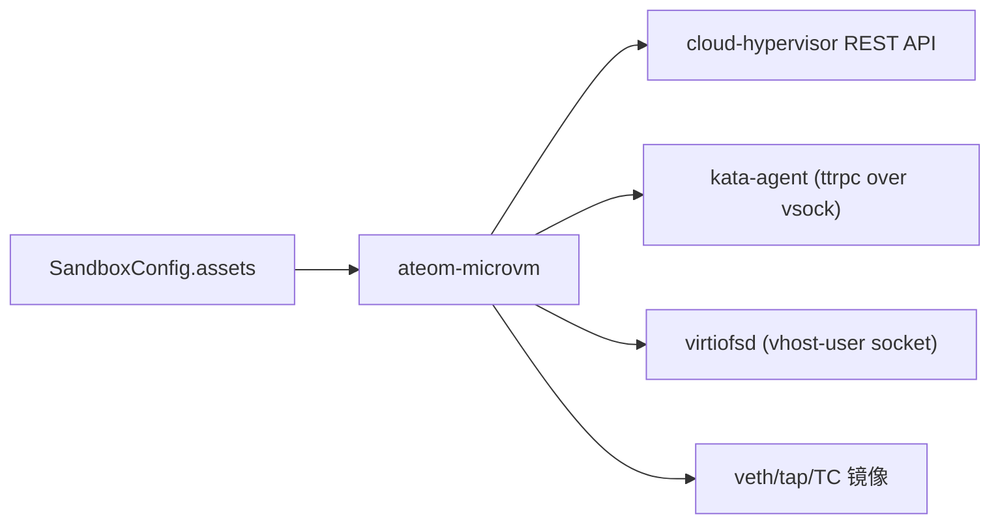

# MicroVM沙箱运行时

<cite>
**本文引用的文件**   
- [cmd/ateom-microvm/main.go](file://cmd/ateom-microvm/main.go)
- [cmd/ateom-microvm/run.go](file://cmd/ateom-microvm/run.go)
- [cmd/ateom-microvm/checkpoint.go](file://cmd/ateom-microvm/checkpoint.go)
- [cmd/ateom-microvm/internal/ch/ch.go](file://cmd/ateom-microvm/internal/ch/ch.go)
- [cmd/ateom-microvm/internal/ch/createvm.go](file://cmd/ateom-microvm/internal/ch/createvm.go)
- [cmd/ateom-microvm/internal/kata/kata.go](file://cmd/ateom-microvm/internal/kata/kata.go)
- [cmd/ateom-microvm/internal/kata/config.go](file://cmd/ateom-microvm/internal/kata/config.go)
- [cmd/ateom-microvm/internal/kata/specconv.go](file://cmd/ateom-microvm/internal/kata/specconv.go)
- [pkg/api/v1alpha1/sandboxconfig_types.go](file://pkg/api/v1alpha1/sandboxconfig_types.go)
- [hack/microvm-assets/README.md](file://hack/microvm-assets/README.md)
- [hack/run-microvm-demo.sh](file://hack/run-microvm-demo.sh)
</cite>

## 目录
1. [简介](#简介)
2. [项目结构](#项目结构)
3. [核心组件](#核心组件)
4. [架构总览](#架构总览)
5. [详细组件分析](#详细组件分析)
6. [依赖关系分析](#依赖关系分析)
7. [性能与资源特性](#性能与资源特性)
8. [部署前提条件](#部署前提条件)
9. [配置方法（SandboxConfig microvm）](#配置方法sandboxconfig-microvm)
10. [启动流程](#启动流程)
11. [快照与恢复机制](#快照与恢复机制)
12. [资源管理](#资源管理)
13. [与gVisor对比](#与gvisor对比)
14. [故障排查指南](#故障排查指南)
15. [结论](#结论)

## 简介
本文件系统性阐述基于 cloud-hypervisor 与 kata-container 技术的 MicroVM 沙箱运行时的实现原理、配置方法与运维要点。该运行时通过完整的虚拟化提供强隔离环境，支持完整挂起/恢复（快照），并以 overlay 根文件系统将只读镜像与可写内存层结合，避免宿主机磁盘写入。文档同时给出 SandboxConfig 中 microvm 类型的资产要求、部署前置条件（/dev/kvm 与 vhost）、以及性能调优建议。

## 项目结构
MicroVM 运行时位于 cmd/ateom-microvm，核心由以下模块组成：
- 服务入口与生命周期管理：main.go
- 工作负载启动与容器编排：run.go
- 检查点与恢复：checkpoint.go
- Cloud-Hypervisor 客户端与 VM 配置：internal/ch/*
- Kata Agent 交互与配置解析：internal/kata/*
- 集群级配置类型定义：pkg/api/v1alpha1/sandboxconfig_types.go
- 资产准备与演示脚本：hack/microvm-assets/*, hack/run-microvm-demo.sh

图表来源
- [cmd/ateom-microvm/main.go:1-226](file://cmd/ateom-microvm/main.go#L1-L226)
- [cmd/ateom-microvm/run.go:1-648](file://cmd/ateom-microvm/run.go#L1-L648)
- [cmd/ateom-microvm/checkpoint.go:1-211](file://cmd/ateom-microvm/checkpoint.go#L1-L211)
- [cmd/ateom-microvm/internal/ch/ch.go:1-113](file://cmd/ateom-microvm/internal/ch/ch.go#L1-L113)
- [cmd/ateom-microvm/internal/ch/createvm.go:1-123](file://cmd/ateom-microvm/internal/ch/createvm.go#L1-L123)
- [cmd/ateom-microvm/internal/kata/kata.go:1-40](file://cmd/ateom-microvm/internal/kata/kata.go#L1-L40)
- [cmd/ateom-microvm/internal/kata/config.go:1-104](file://cmd/ateom-microvm/internal/kata/config.go#L1-L104)
- [cmd/ateom-microvm/internal/kata/specconv.go:1-135](file://cmd/ateom-microvm/internal/kata/specconv.go#L1-L135)
- [pkg/api/v1alpha1/sandboxconfig_types.go:1-117](file://pkg/api/v1alpha1/sandboxconfig_types.go#L1-L117)
- [hack/microvm-assets/README.md:1-56](file://hack/microvm-assets/README.md#L1-L56)
- [hack/run-microvm-demo.sh:80-118](file://hack/run-microvm-demo.sh#L80-L118)

章节来源
- [cmd/ateom-microvm/main.go:1-226](file://cmd/ateom-microvm/main.go#L1-L226)
- [cmd/ateom-microvm/run.go:1-648](file://cmd/ateom-microvm/run.go#L1-L648)
- [cmd/ateom-microvm/checkpoint.go:1-211](file://cmd/ateom-microvm/checkpoint.go#L1-L211)
- [cmd/ateom-microvm/internal/ch/ch.go:1-113](file://cmd/ateom-microvm/internal/ch/ch.go#L1-L113)
- [cmd/ateom-microvm/internal/ch/createvm.go:1-123](file://cmd/ateom-microvm/internal/ch/createvm.go#L1-L123)
- [cmd/ateom-microvm/internal/kata/kata.go:1-40](file://cmd/ateom-microvm/internal/kata/kata.go#L1-L40)
- [cmd/ateom-microvm/internal/kata/config.go:1-104](file://cmd/ateom-microvm/internal/kata/config.go#L1-L104)
- [cmd/ateom-microvm/internal/kata/specconv.go:1-135](file://cmd/ateom-microvm/internal/kata/specconv.go#L1-L135)
- [pkg/api/v1alpha1/sandboxconfig_types.go:1-117](file://pkg/api/v1alpha1/sandboxconfig_types.go#L1-L117)
- [hack/microvm-assets/README.md:1-56](file://hack/microvm-assets/README.md#L1-L56)
- [hack/run-microvm-demo.sh:80-118](file://hack/run-microvm-demo.sh#L80-L118)

## 核心组件
- ateom-microvm 服务：暴露 gRPC 接口，负责按请求启动/暂停/恢复/销毁微虚拟机及容器。
- CH 客户端：封装 cloud-hypervisor REST API，用于 pause/snapshot/resume/shutdown 等。
- Kata 助手：负责与 kata-agent 通信、生成 guest 内核参数、构造 overlay 根文件系统、清理宿主侧状态。
- OCI Spec 转换：将 OCI runtime-spec 转换为 kata-agent 所需的 protobuf Spec。
- SandboxConfig：集群级配置对象，声明 sandboxClass 与 assets（按架构索引）。

章节来源
- [cmd/ateom-microvm/main.go:184-226](file://cmd/ateom-microvm/main.go#L184-L226)
- [cmd/ateom-microvm/internal/ch/ch.go:34-113](file://cmd/ateom-microvm/internal/ch/ch.go#L34-L113)
- [cmd/ateom-microvm/internal/kata/kata.go:15-40](file://cmd/ateom-microvm/internal/kata/kata.go#L15-L40)
- [cmd/ateom-microvm/internal/kata/config.go:24-104](file://cmd/ateom-microvm/internal/kata/config.go#L24-L104)
- [cmd/ateom-microvm/internal/kata/specconv.go:24-135](file://cmd/ateom-microvm/internal/kata/specconv.go#L24-L135)
- [pkg/api/v1alpha1/sandboxconfig_types.go:21-79](file://pkg/api/v1alpha1/sandboxconfig_types.go#L21-L79)

## 架构总览
MicroVM 运行时采用“直接驱动 VMM + 直连 kata-agent”的模型：不依赖 kata shim 或 containerd，而是由 ateom-microvm 直接拉起 cloud-hypervisor，并通过其 REST API 控制 VM；随后通过 hybrid-vsock 连接 kata-agent，完成沙箱建立、网络配置与容器启动。每个容器的 rootfs 采用 overlay：只读下层通过 virtio-fs 从宿主机共享目录按需分页读取，可写上层为 guest 内部 tmpfs，确保无宿主机磁盘写入。

图表来源
- [cmd/ateom-microvm/run.go:266-317](file://cmd/ateom-microvm/run.go#L266-L317)
- [cmd/ateom-microvm/internal/ch/ch.go:15-25](file://cmd/ateom-microvm/internal/ch/ch.go#L15-L25)
- [cmd/ateom-microvm/internal/kata/kata.go:15-24](file://cmd/ateom-microvm/internal/kata/kata.go#L15-L24)

## 详细组件分析

### 类与模块关系（代码级）

图表来源
- [cmd/ateom-microvm/main.go:184-226](file://cmd/ateom-microvm/main.go#L184-L226)
- [cmd/ateom-microvm/run.go:174-368](file://cmd/ateom-microvm/run.go#L174-L368)
- [cmd/ateom-microvm/internal/ch/ch.go:34-113](file://cmd/ateom-microvm/internal/ch/ch.go#L34-L113)
- [cmd/ateom-microvm/internal/ch/createvm.go:22-123](file://cmd/ateom-microvm/internal/ch/createvm.go#L22-L123)
- [cmd/ateom-microvm/internal/kata/config.go:24-104](file://cmd/ateom-microvm/internal/kata/config.go#L24-L104)
- [cmd/ateom-microvm/internal/kata/specconv.go:24-135](file://cmd/ateom-microvm/internal/kata/specconv.go#L24-L135)

章节来源
- [cmd/ateom-microvm/main.go:184-226](file://cmd/ateom-microvm/main.go#L184-L226)
- [cmd/ateom-microvm/run.go:174-368](file://cmd/ateom-microvm/run.go#L174-L368)
- [cmd/ateom-microvm/internal/ch/ch.go:34-113](file://cmd/ateom-microvm/internal/ch/ch.go#L34-L113)
- [cmd/ateom-microvm/internal/ch/createvm.go:22-123](file://cmd/ateom-microvm/internal/ch/createvm.go#L22-L123)
- [cmd/ateom-microvm/internal/kata/config.go:24-104](file://cmd/ateom-microvm/internal/kata/config.go#L24-L104)
- [cmd/ateom-microvm/internal/kata/specconv.go:24-135](file://cmd/ateom-microvm/internal/kata/specconv.go#L24-L135)

### 启动序列（代码级）

图表来源
- [cmd/ateom-microvm/run.go:174-368](file://cmd/ateom-microvm/run.go#L174-L368)
- [cmd/ateom-microvm/internal/ch/ch.go:107-123](file://cmd/ateom-microvm/internal/ch/ch.go#L107-L123)
- [cmd/ateom-microvm/internal/kata/kata.go:30-40](file://cmd/ateom-microvm/internal/kata/kata.go#L30-L40)

章节来源
- [cmd/ateom-microvm/run.go:174-368](file://cmd/ateom-microvm/run.go#L174-L368)

### 复杂逻辑（检查点合并流程）

图表来源
- [cmd/ateom-microvm/checkpoint.go:44-154](file://cmd/ateom-microvm/checkpoint.go#L44-L154)

章节来源
- [cmd/ateom-microvm/checkpoint.go:44-154](file://cmd/ateom-microvm/checkpoint.go#L44-L154)

## 依赖关系分析
- ateom-microvm 依赖 cloud-hypervisor 二进制与其 REST API。
- 通过 kata-agent 的 ttrpc 接口在 guest 内执行沙箱/容器操作。
- 使用 virtiofsd 作为只读下层的共享后端，配合 overlay 根文件系统。
- 网络路径通过 veth/tap 与 TC 镜像，保证流量可见性与可观测性。
- 集群配置通过 SandboxConfig 指定 assets，按架构分发。

图表来源
- [cmd/ateom-microvm/run.go:266-317](file://cmd/ateom-microvm/run.go#L266-L317)
- [cmd/ateom-microvm/internal/ch/ch.go:15-25](file://cmd/ateom-microvm/internal/ch/ch.go#L15-L25)
- [cmd/ateom-microvm/internal/kata/kata.go:15-24](file://cmd/ateom-microvm/internal/kata/kata.go#L15-L24)
- [pkg/api/v1alpha1/sandboxconfig_types.go:52-79](file://pkg/api/v1alpha1/sandboxconfig_types.go#L52-L79)

章节来源
- [cmd/ateom-microvm/run.go:266-317](file://cmd/ateom-microvm/run.go#L266-L317)
- [cmd/ateom-microvm/internal/ch/ch.go:15-25](file://cmd/ateom-microvm/internal/ch/ch.go#L15-L25)
- [cmd/ateom-microvm/internal/kata/kata.go:15-24](file://cmd/ateom-microvm/internal/kata/kata.go#L15-L24)
- [pkg/api/v1alpha1/sandboxconfig_types.go:52-79](file://pkg/api/v1alpha1/sandboxconfig_types.go#L52-L79)

## 性能与资源特性
- 内存快照：CH 使用 shared memory（memfd）以生成稀疏内存快照，减少快照体积与 IO。
- 根文件系统：只读下层按需分页（demand-page）自 virtiofsd，可写上層为 guest tmpfs，避免宿主机磁盘写入。
- 网络：tap+TC 镜像便于抓包与观测，但会引入少量额外开销。
- CPU/内存：由 kata 配置中的 default_vcpus/default_memory 决定，可按需调整。

[本节为通用性能讨论，无需特定文件引用]

## 部署前提条件
- 宿主机需具备 /dev/kvm 设备，且节点应被标记为支持 microvm 沙箱类。
- 需要 vhost 相关设备（如 vhost-net）以启用高性能 virtio 网络。
- 建议使用脚本自动装配并上传所需资产（cloud-hypervisor、virtiofsd、kata kernel/image、kata config）。

章节来源
- [hack/microvm-assets/README.md:16-25](file://hack/microvm-assets/README.md#L16-L25)
- [hack/run-microvm-demo.sh:80-118](file://hack/run-microvm-demo.sh#L80-L118)

## 配置方法（SandboxConfig microvm）
- sandboxClass 设置为 microvm。
- assets 字段按架构（GOARCH）索引，microvm 后端期望的资产键包括：
  - cloud-hypervisor：VMM 二进制
  - virtiofsd：共享只读下层的守护进程
  - kata-kernel：guest 内核
  - kata-image：guest rootfs 镜像
  - kata-config：基础 kata 配置（configuration-clh.toml）
- 这些资产的 URL 与 SHA256 由 SandboxConfig 声明，由 atelet 拉取并缓存。

章节来源
- [pkg/api/v1alpha1/sandboxconfig_types.go:21-79](file://pkg/api/v1alpha1/sandboxconfig_types.go#L21-L79)
- [hack/microvm-assets/README.md:10-19](file://hack/microvm-assets/README.md#L10-L19)

## 启动流程
- 解析请求中的 runtime asset paths，确定 cloud-hypervisor 与 kata 配置路径。
- 准备每个容器的 OCI spec，注入 guest DNS（resolv.conf）。
- 清理旧沙箱状态，创建 VM 运行时目录。
- 将各容器的只读下层 bind-mount 到共享目录，启动 virtiofsd。
- 启动 cloud-hypervisor，创建 VM（payload/kernel/cmdline/disks/fs/vsock/rng/serial），添加网络设备（tap FDs），引导系统。
- 等待 kata-agent vsock 就绪，建立连接后创建沙箱、配置 guest 网络（IP/MAC/MTU/路由/ARP），逐个启动 overlay 容器。
- 等待所有 readyz 探针就绪后返回。

章节来源
- [cmd/ateom-microvm/run.go:174-368](file://cmd/ateom-microvm/run.go#L174-L368)
- [cmd/ateom-microvm/run.go:443-476](file://cmd/ateom-microvm/run.go#L443-L476)
- [cmd/ateom-microvm/run.go:478-538](file://cmd/ateom-microvm/run.go#L478-L538)
- [cmd/ateom-microvm/internal/ch/createvm.go:22-123](file://cmd/ateom-microvm/internal/ch/createvm.go#L22-L123)

## 快照与恢复机制
- 检查点：对运行中的 VM 执行 pause -> snapshot，记录 base-id（golden id）以便 restore 时重建只读下层路径；若为 OnDemand 恢复后的再次 checkpoint，则合并 delta 到 base 以生成完整快照。
- 恢复：根据 base-id 重建只读下层，重新拉起 CH，复用网络 FD，重连 kata-agent，继续运行。
- 快照内容：config.json、state.json、memory-ranges（可能为 sparse），以及 base-id 文件；rootfs 的可写部分已包含在内存快照中，只读下层在 restore 时从 OCI 镜像重建。

章节来源
- [cmd/ateom-microvm/checkpoint.go:44-154](file://cmd/ateom-microvm/checkpoint.go#L44-L154)
- [cmd/ateom-microvm/internal/ch/ch.go:95-108](file://cmd/ateom-microvm/internal/ch/ch.go#L95-L108)

## 资源管理
- 进程管理：ateom 直接拥有 CH 进程与 virtiofsd 进程，在 teardown 阶段统一终止。
- 网络命名空间：为每个 actor 分配独立 netns，veth/tap 成对创建并在 VM 启动前注入 FD。
- 沙箱状态：每次启动前清理 per-sandbox 宿主侧状态，避免残留影响。
- 日志转发：通过 kata-agent 的 stdio 流将容器输出转发至 pod 日志，带 ate.dev/* 标签。

章节来源
- [cmd/ateom-microvm/main.go:99-116](file://cmd/ateom-microvm/main.go#L99-L116)
- [cmd/ateom-microvm/run.go:246-265](file://cmd/ateom-microvm/run.go#L246-L265)
- [cmd/ateom-microvm/run.go:540-557](file://cmd/ateom-microvm/run.go#L540-L557)
- [cmd/ateom-microvm/checkpoint.go:171-211](file://cmd/ateom-microvm/checkpoint.go#L171-L211)

## 与gVisor对比
- 安全性：
  - MicroVM：基于完整虚拟化（cloud-hypervisor + kata guest），内核态隔离更强，攻击面更小。
  - gVisor：用户态沙箱，隔离强度弱于全虚拟化，但更轻量。
- 性能：
  - MicroVM：存在 VM 启动与 I/O 虚拟化开销，但可通过 virtio 优化与快照复用降低冷启动成本。
  - gVisor：通常启动更快、CPU/内存占用更低，适合短生命周期任务。
- 资源消耗：
  - MicroVM：需要分配 guest 内核与镜像，内存与磁盘占用更高；但可写层在 guest 内存中，避免宿主机 IO。
  - gVisor：仅用户态进程，资源占用更少。

[本节为概念性对比，无需特定文件引用]

## 故障排查指南
- 无法拨号 kata-agent：检查 serial.log 与 vsock 路径是否存在，确认 guest 已到达目标 systemd unit。
- 网络不可达：查看 guest 网络配置（ip addr/route/neigh），确认 ARP 邻居表项是否正确。
- 只读下层为空：确认 /run/kata-containers 挂载传播是否为 rshared，virtiofsd 是否正常启动。
- 快照不完整：若为 OnDemand 恢复后再 checkpoint，需执行 delta 合并步骤。

章节来源
- [cmd/ateom-microvm/run.go:319-347](file://cmd/ateom-microvm/run.go#L319-L347)
- [cmd/ateom-microvm/run.go:494-510](file://cmd/ateom-microvm/run.go#L494-L510)
- [cmd/ateom-microvm/checkpoint.go:105-123](file://cmd/ateom-microvm/checkpoint.go#L105-L123)

## 结论
MicroVM 沙箱运行时通过直接驱动 cloud-hypervisor 并与 kata-agent 协作，提供了强隔离与完整快照能力。其 overlay 根文件系统与按需分页策略在保证安全性的同时兼顾了性能与可观测性。借助 SandboxConfig 的资产化配置与自动化脚本，可在不同架构上快速部署与验证。对于需要高隔离与跨节点迁移的场景，MicroVM 是优选方案；对于极致轻量与低延迟场景，gVisor 仍具优势。
