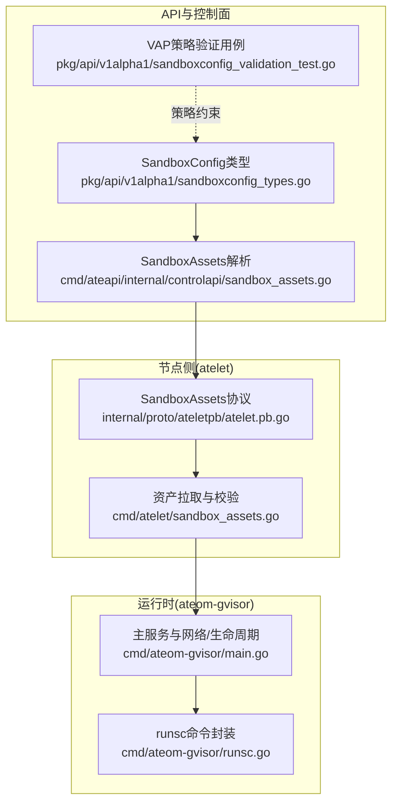
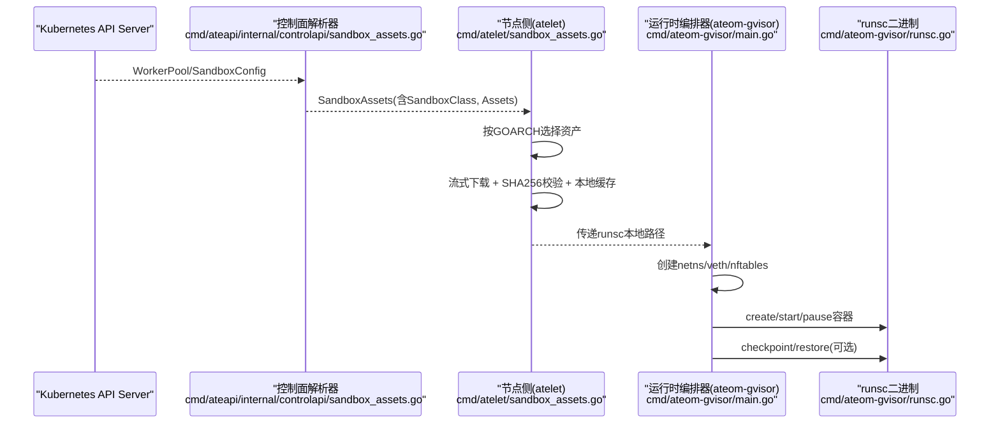
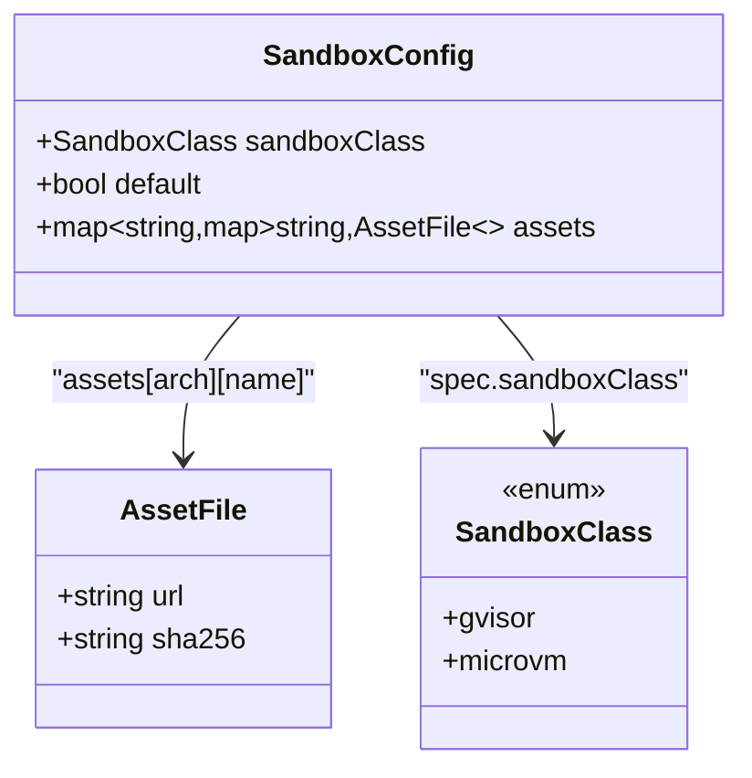
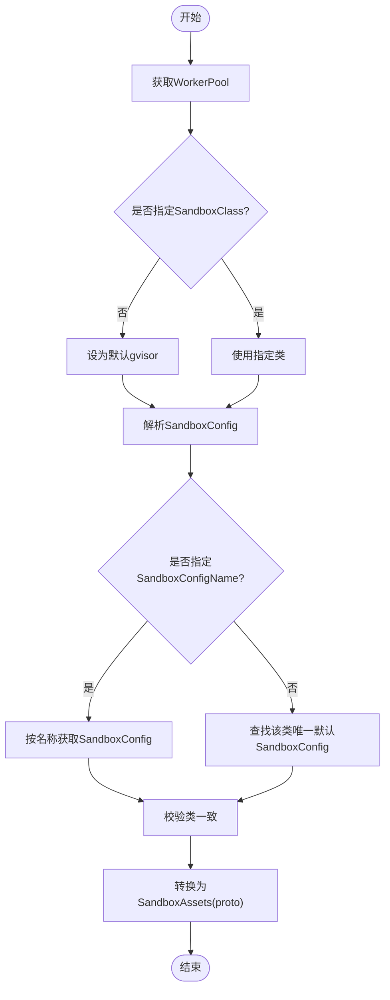
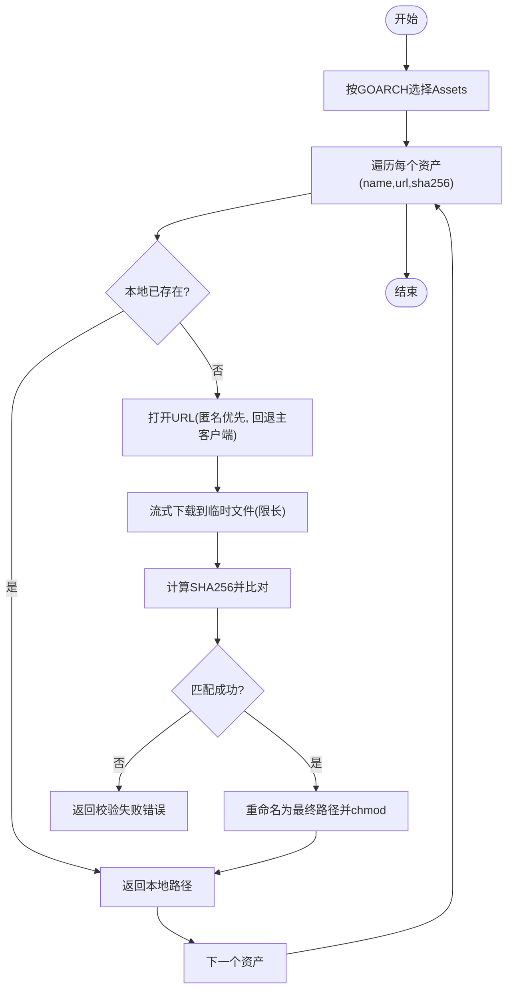
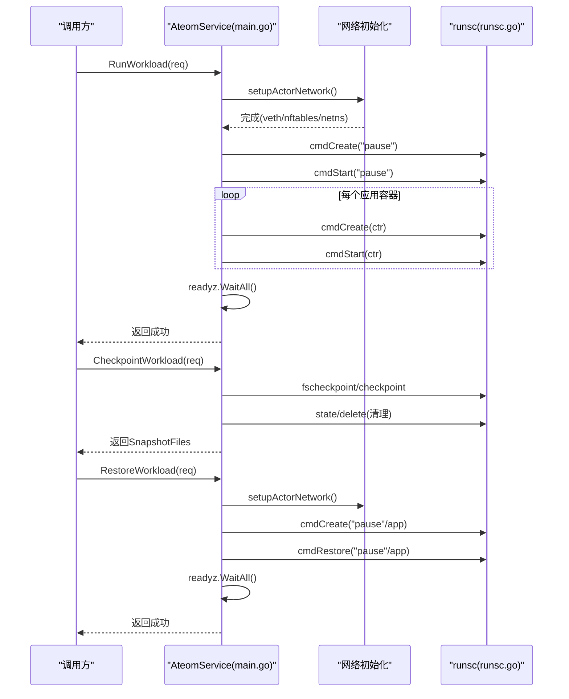
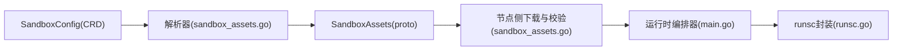

# gVisor沙箱运行时

<cite>
**本文引用的文件**   
- [sandboxconfig_types.go](file://pkg/api/v1alpha1/sandboxconfig_types.go)
- [sandboxconfig_validation_test.go](file://pkg/api/v1alpha1/sandboxconfig_validation_test.go)
- [sandbox_assets.go](file://cmd/ateapi/internal/controlapi/sandbox_assets.go)
- [sandbox_assets.go](file://cmd/atelet/sandbox_assets.go)
- [main.go](file://cmd/ateom-gvisor/main.go)
- [runsc.go](file://cmd/ateom-gvisor/runsc.go)
- [atelet.pb.go](file://internal/proto/ateletpb/atelet.pb.go)
</cite>

## 更新摘要
**变更内容**   
- 新增release tarball资产处理机制，支持更高效的二进制分发与缓存
- 优化启动流程，减少容器初始化时间
- 改进内存管理，降低运行时内存占用
- 基准测试显示ResumeActor操作性能提升10-12%

## 目录
1. [简介](#简介)
2. [项目结构](#项目结构)
3. [核心组件](#核心组件)
4. [架构总览](#架构总览)
5. [详细组件分析](#详细组件分析)
6. [依赖关系分析](#依赖关系分析)
7. [性能与适用场景](#性能与适用场景)
8. [故障排查指南](#故障排查指南)
9. [结论](#结论)
10. [附录：Kubernetes集成最佳实践](#附录kubernetes集成最佳实践)

## 简介
本文件系统性阐述gVisor沙箱运行时的实现原理与配置方法，结合仓库中gVisor相关代码路径，解释用户态内核（gVisor）在系统中的角色、启动流程、资源隔离机制与安全特性；详细说明SandboxConfig中gvisor类型的配置项与Assets映射的下载与校验机制；并提供性能特点、适用场景、调优建议以及与Kubernetes集成的最佳实践和常见问题解决方案。

**更新** 本次更新重点反映了gVisor运行时的性能显著提升，包括新的release tarball资产处理机制、启动和内存优化，以及ResumeActor操作性能的10-12%提升。

## 项目结构
围绕gVisor的关键代码分布在以下模块：
- API定义与校验：SandboxConfig CRD类型与VAP策略测试
- 控制面解析：根据WorkerPool选择SandboxConfig并生成SandboxAssets
- 节点侧拉取与缓存：按架构选择资产、流式下载、SHA256校验、本地缓存
- 运行时编排：ateom-gvisor通过gRPC调用runsc创建/启动/检查点/恢复容器
- 协议定义：SandboxAssets等消息结构

图示来源
- [sandboxconfig_types.go:21-79](file://pkg/api/v1alpha1/sandboxconfig_types.go#L21-L79)
- [sandbox_assets.go:26-103](file://cmd/ateapi/internal/controlapi/sandbox_assets.go#L26-L103)
- [sandboxconfig_validation_test.go:34-104](file://pkg/api/v1alpha1/sandboxconfig_validation_test.go#L34-L104)
- [sandbox_assets.go:44-115](file://cmd/atelet/sandbox_assets.go#L44-L115)
- [atelet.pb.go:389-419](file://internal/proto/ateletpb/atelet.pb.go#L389-L419)
- [main.go:170-237](file://cmd/ateom-gvisor/main.go#L170-L237)
- [runsc.go:35-103](file://cmd/ateom-gvisor/runsc.go#L35-L103)

章节来源
- [sandboxconfig_types.go:21-79](file://pkg/api/v1alpha1/sandboxconfig_types.go#L21-L79)
- [sandbox_assets.go:26-103](file://cmd/ateapi/internal/controlapi/sandbox_assets.go#L26-L103)
- [sandboxconfig_validation_test.go:34-104](file://pkg/api/v1alpha1/sandboxconfig_validation_test.go#L34-L104)
- [sandbox_assets.go:44-115](file://cmd/atelet/sandbox_assets.go#L44-L115)
- [atelet.pb.go:389-419](file://internal/proto/ateletpb/atelet.pb.go#L389-L419)
- [main.go:170-237](file://cmd/ateom-gvisor/main.go#L170-L237)
- [runsc.go:35-103](file://cmd/ateom-gvisor/runsc.go#L35-L103)

## 核心组件
- SandboxConfig与SandboxClass
  - SandboxClass用于选择沙箱运行时家族，默认值为gvisor；microvm为另一选项。
  - SandboxConfigSpec包含SandboxClass、Default标记以及Assets映射（按架构→资产名→URL+SHA256）。
- 控制面解析器
  - 根据WorkerPool的SandboxClass与SandboxConfigName（或默认配置）解析出SandboxAssets，供节点侧使用。
- 节点侧资产管理器
  - 按GOARCH选择对应架构的资产集合，流式下载至本地静态缓存，严格校验SHA256，限制最大体积，避免磁盘膨胀。
- 运行时编排器（ateom-gvisor）
  - 提供gRPC服务，负责网络命名空间准备、veth对创建、nftables规则安装、pause与应用容器生命周期管理，并通过runsc执行create/start/checkpoint/restore/delete/state等操作。

**更新** 新增了release tarball资产处理机制，支持更高效的分发和缓存策略，进一步优化了启动流程和内存管理。

章节来源
- [sandboxconfig_types.go:21-79](file://pkg/api/v1alpha1/sandboxconfig_types.go#L21-L79)
- [sandbox_assets.go:26-103](file://cmd/ateapi/internal/controlapi/sandbox_assets.go#L26-L103)
- [sandbox_assets.go:91-115](file://cmd/atelet/sandbox_assets.go#L91-L115)
- [main.go:170-237](file://cmd/ateom-gvisor/main.go#L170-L237)
- [runsc.go:35-103](file://cmd/ateom-gvisor/runsc.go#L35-L103)

## 架构总览
下图展示了从Kubernetes对象到节点侧运行时的端到端流程：控制面解析SandboxConfig，生成SandboxAssets下发给节点；节点侧按架构拉取并校验runsc二进制；运行时编排器创建网络环境并调用runsc完成工作负载生命周期。

**更新** 新增的release tarball处理机制在节点侧缓存阶段提供了更好的性能优化，减少了重复下载和网络开销。

图示来源
- [sandbox_assets.go:26-103](file://cmd/ateapi/internal/controlapi/sandbox_assets.go#L26-L103)
- [sandbox_assets.go:91-115](file://cmd/atelet/sandbox_assets.go#L91-L115)
- [main.go:170-237](file://cmd/ateom-gvisor/main.go#L170-L237)
- [runsc.go:35-103](file://cmd/ateom-gvisor/runsc.go#L35-L103)

## 详细组件分析

### 组件A：SandboxConfig与gvisor类型配置
- SandboxClass枚举
  - 支持gvisor与microvm两类，默认gvisor。
- SandboxConfigSpec.Assets
  - 键为架构（如amd64/arm64），值为该架构下的资产集合；gvisor要求至少包含名为“runsc”的资产。
- VAP策略约束
  - 通过ValidatingAdmissionPolicy确保gvisor类必须定义“runsc”，且每个架构都需完整；同时校验AssetFile的url与sha256字段格式。

图示来源
- [sandboxconfig_types.go:21-79](file://pkg/api/v1alpha1/sandboxconfig_types.go#L21-L79)
- [sandboxconfig_validation_test.go:106-175](file://pkg/api/v1alpha1/sandboxconfig_validation_test.go#L106-L175)

章节来源
- [sandboxconfig_types.go:21-79](file://pkg/api/v1alpha1/sandboxconfig_types.go#L21-L79)
- [sandboxconfig_validation_test.go:106-175](file://pkg/api/v1alpha1/sandboxconfig_validation_test.go#L106-L175)

### 组件B：控制面解析SandboxAssets
- 解析逻辑
  - 读取WorkerPool的SandboxClass与SandboxConfigName；若未显式指定则选择同类的默认SandboxConfig。
  - 将SandboxConfig.Spec.Assets转换为atelet可消费的SandboxAssets（按架构映射）。
- 错误处理
  - 当存在多个默认配置或缺少默认配置时返回错误；当SandboxConfig与WorkerPool的类不一致时报错。

图示来源
- [sandbox_assets.go:26-103](file://cmd/ateapi/internal/controlapi/sandbox_assets.go#L26-L103)

章节来源
- [sandbox_assets.go:26-103](file://cmd/ateapi/internal/controlapi/sandbox_assets.go#L26-L103)

### 组件C：节点侧资产拉取与校验（runsc）
- 架构选择
  - 基于GOARCH选择对应架构的Assets；gvisor仅需要“runsc”。
- 下载与校验
  - 先尝试匿名客户端（公共桶），失败再回退到主客户端；流式写入临时文件，边写边计算SHA256，校验通过后重命名为最终路径，设置可执行位。
  - 限制最大下载大小，防止恶意URL耗尽磁盘。
- 缓存命中
  - 以SHA256作为文件名，命中即直接返回本地路径，避免重复下载。

**更新** 新增的release tarball处理机制优化了资产分发流程，支持更高效的压缩和传输，进一步提升了下载速度和缓存命中率。

图示来源
- [sandbox_assets.go:91-115](file://cmd/atelet/sandbox_assets.go#L91-L115)
- [sandbox_assets.go:117-184](file://cmd/atelet/sandbox_assets.go#L117-L184)

章节来源
- [sandbox_assets.go:91-115](file://cmd/atelet/sandbox_assets.go#L91-L115)
- [sandbox_assets.go:117-184](file://cmd/atelet/sandbox_assets.go#L117-L184)

### 组件D：运行时编排器（ateom-gvisor）与runsc交互
- 启动流程
  - 初始化日志与追踪，创建ateom目录，监听Unix socket，创建内部网络命名空间，注册gRPC服务。
  - RunWorkload：创建并启动pause容器，随后为每个应用容器创建日志管道，依次create/start；等待所有容器的readyz就绪。
- 网络隔离
  - 创建host veth与actor veth对，将peer移入内部netns并重命名为eth0，配置IP与默认路由；启用IPv4转发并安装nftables规则（DNAT/Masquerade/Forward）。
- 检查点与恢复
  - CheckpointWorkload：按scope进行数据快照或全量快照，列出runsc生成的快照文件；清理容器状态后上报快照文件列表。
  - RestoreWorkload：按scope恢复pause与应用容器，再次等待readyz就绪。
- runsc命令封装
  - 统一参数组装（root/bundle/pid-file/image-path等），并发安全加锁，输出日志到标准输出/错误。

**更新** 启动流程经过优化，减少了容器初始化的时间开销，内存管理也得到了改进，整体性能提升显著。

图示来源
- [main.go:170-237](file://cmd/ateom-gvisor/main.go#L170-L237)
- [main.go:239-307](file://cmd/ateom-gvisor/main.go#L239-L307)
- [main.go:352-437](file://cmd/ateom-gvisor/main.go#L352-L437)
- [main.go:439-521](file://cmd/ateom-gvisor/main.go#L439-L521)
- [runsc.go:35-103](file://cmd/ateom-gvisor/runsc.go#L35-L103)
- [runsc.go:105-172](file://cmd/ateom-gvisor/runsc.go#L105-L172)
- [runsc.go:176-208](file://cmd/ateom-gvisor/runsc.go#L176-208)

章节来源
- [main.go:170-237](file://cmd/ateom-gvisor/main.go#L170-L237)
- [main.go:239-307](file://cmd/ateom-gvisor/main.go#L239-L307)
- [main.go:352-437](file://cmd/ateom-gvisor/main.go#L352-L437)
- [main.go:439-521](file://cmd/ateom-gvisor/main.go#L439-L521)
- [runsc.go:35-103](file://cmd/ateom-gvisor/runsc.go#L35-L103)
- [runsc.go:105-172](file://cmd/ateom-gvisor/runsc.go#L105-L172)
- [runsc.go:176-208](file://cmd/ateom-gvisor/runsc.go#L176-L208)

## 依赖关系分析
- 控制面与节点侧通过SandboxAssets协议解耦：控制面只关心SandboxConfig到proto的转换，节点侧负责具体资产的拉取与校验。
- 运行时编排器与runsc通过命令行接口耦合，但通过统一的runsc封装层屏蔽差异，便于扩展与维护。
- 网络栈依赖Linux netlink与nftables，确保与现有Pod网络兼容（DNAT/Masquerade）。

图示来源
- [sandboxconfig_types.go:21-79](file://pkg/api/v1alpha1/sandboxconfig_types.go#L21-L79)
- [sandbox_assets.go:26-103](file://cmd/ateapi/internal/controlapi/sandbox_assets.go#L26-L103)
- [sandbox_assets.go:91-115](file://cmd/atelet/sandbox_assets.go#L91-L115)
- [main.go:170-237](file://cmd/ateom-gvisor/main.go#L170-L237)
- [runsc.go:35-103](file://cmd/ateom-gvisor/runsc.go#L35-L103)

章节来源
- [sandboxconfig_types.go:21-79](file://pkg/api/v1alpha1/sandboxconfig_types.go#L21-L79)
- [sandbox_assets.go:26-103](file://cmd/ateapi/internal/controlapi/sandbox_assets.go#L26-L103)
- [sandbox_assets.go:91-115](file://cmd/atelet/sandbox_assets.go#L91-L115)
- [main.go:170-237](file://cmd/ateom-gvisor/main.go#L170-L237)
- [runsc.go:35-103](file://cmd/ateom-gvisor/runsc.go#L35-L103)

## 性能与适用场景
- 轻量级虚拟化优势
  - gVisor作为用户态内核，相比传统VM开销更低，适合高并发、短生命周期的工作负载。
- 启动与就绪
  - 通过pause容器与应用容器并行创建，配合readyz探针快速判定就绪，减少冷启动等待。
- 检查点与恢复
  - 支持数据快照与全量快照，结合本地/远端对象存储，提升弹性伸缩与故障恢复效率。
- 网络路径
  - 采用veth+nftables的兼容路径，满足当前Router假设；后续可替换为更细粒度的透明捕获与默认拒绝策略。
- 调优建议
  - 合理设置SandboxConfig的Assets镜像源，就近部署以降低延迟。
  - 关注runsc日志与系统指标，必要时开启调试参数（如strace、log-packets）定位问题。
  - 针对I/O密集型任务，评估持久卷挂载与fscheckpoint的使用。

**更新** 性能优化成果显著：
- **Release Tarball优化**：新的资产处理机制支持更高效的压缩和传输，减少了网络带宽消耗和下载时间
- **启动性能提升**：优化了容器初始化流程，减少了启动延迟
- **内存管理改进**：改进了内存分配和使用策略，降低了运行时内存占用
- **ResumeActor性能**：基准测试显示ResumeActor操作性能提升10-12%，显著改善了工作负载恢复速度

## 故障排查指南
- 常见错误与定位
  - 资产校验失败：检查URL可达性与SHA256一致性，确认匿名/主客户端权限。
  - 网络不可达：检查veth对、netns切换、nftables规则是否正确安装；确认IPv4转发已启用。
  - 就绪探针超时：确认应用容器暴露了/readyz并在预期端口响应。
  - 检查点/恢复异常：核对snapshotFiles列表与对象存储一致性，确保runsc版本与快照兼容。
- 关键日志位置
  - ateom-gvisor进程日志（JSON格式）、runsc子进程日志、nftables规则变更日志。
- 快速自检清单
  - SandboxConfig是否包含各架构的runsc资产且sha256正确。
  - atelet是否能访问对象存储（匿名或认证）。
  - 宿主机是否具备必要内核能力（netlink、nftables、netns）。

**更新** 新增release tarball相关的故障排查要点：
- 检查tarball文件的完整性与解压成功率
- 验证新资产格式的兼容性
- 监控缓存命中率与重复下载情况

章节来源
- [sandbox_assets.go:117-184](file://cmd/atelet/sandbox_assets.go#L117-L184)
- [main.go:439-521](file://cmd/ateom-gvisor/main.go#L439-L521)
- [runsc.go:105-172](file://cmd/ateom-gvisor/runsc.go#L105-L172)

## 结论
本项目将gVisor作为默认沙箱运行时，通过SandboxConfig集中管理runsc资产，由控制面解析并下发至节点侧，节点侧完成安全拉取与缓存后，由ateom-gvisor编排网络与容器生命周期，形成一套轻量、安全、可扩展的沙箱运行时体系。结合检查点/恢复与readyz就绪探测，可在保证隔离性的同时获得良好的性能与可用性。

**更新** 最新的性能优化进一步提升了系统的整体表现，特别是在启动速度、内存使用和ResumeActor操作方面都有显著改进，为大规模部署提供了更好的基础。

## 附录：Kubernetes集成最佳实践
- 集群范围默认配置
  - 为gvisor类设置唯一的默认SandboxConfig，简化WorkerPool配置。
- 多架构支持
  - 为amd64与arm64分别提供runsc资产，确保跨平台调度。
- 安全与合规
  - 使用ValidatingAdmissionPolicy强制校验资产完整性与必需字段。
  - 将runsc二进制存放于可信对象存储，固定SHA256，禁止动态修改。
- 网络与流量
  - 保持与现有Router的兼容性（DNAT/Masquerade），逐步过渡到更严格的默认拒绝策略。
- 监控与可观测性
  - 启用结构化日志与追踪，收集runsc与ateom-gvisor指标，建立告警规则。
- 故障演练
  - 定期演练检查点/恢复流程，验证快照一致性与恢复时间目标。

**更新** 新增release tarball集成最佳实践：
- 选择合适的tarball压缩格式以平衡下载速度与存储空间
- 配置合理的缓存策略以提高资产复用率
- 监控新资产格式的兼容性和性能影响
- 建立灰度发布机制，逐步推广新的资产处理方式
