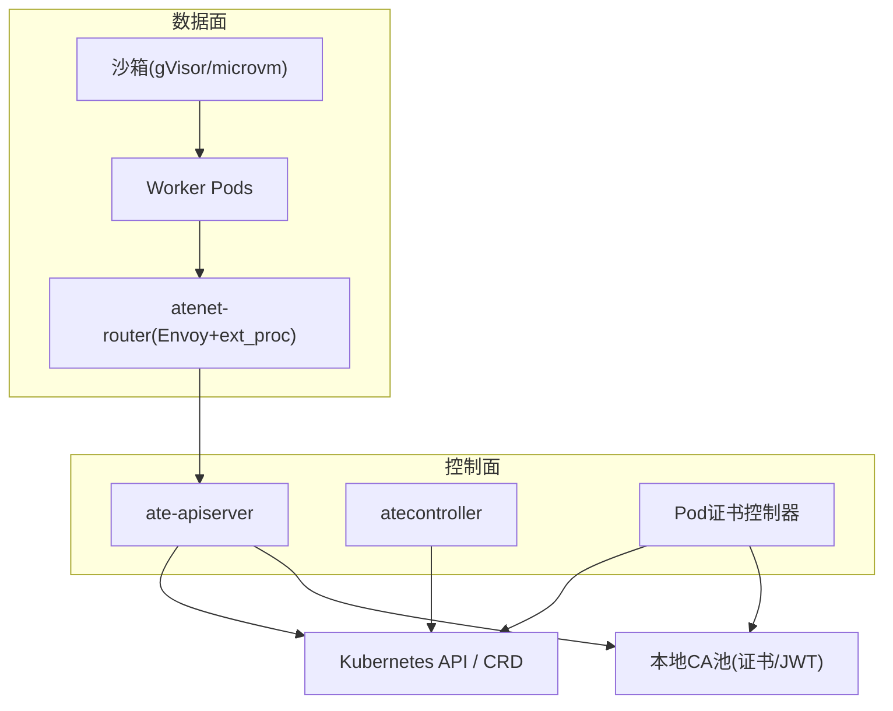
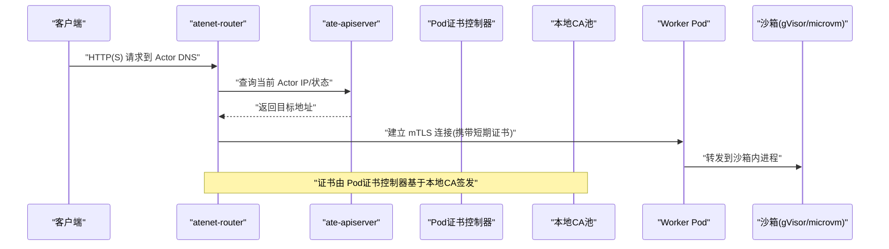
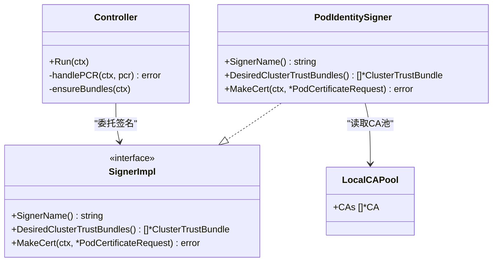
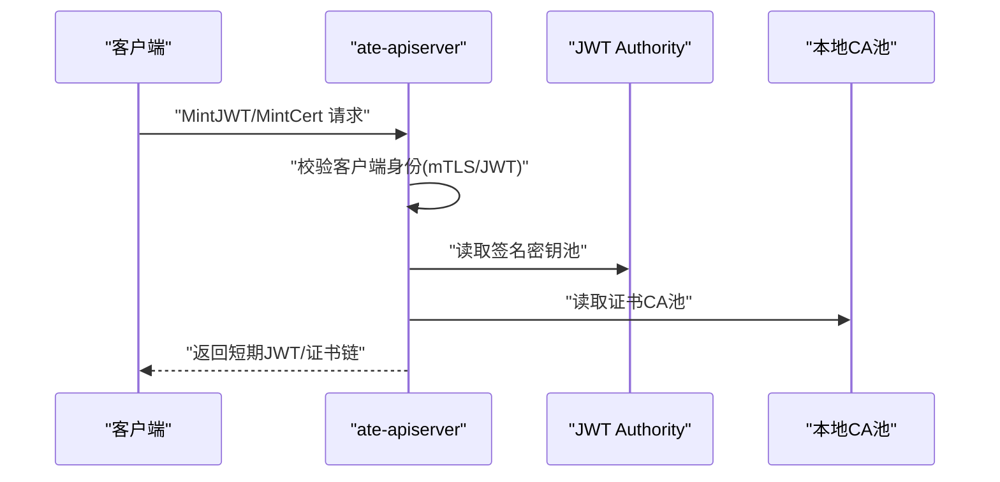
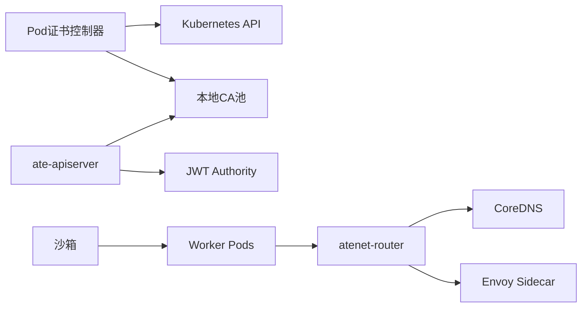

# 安全架构设计

<cite>
**本文引用的文件**   
- [README.md](file://README.md)
- [architecture.md](file://docs/architecture.md)
- [threat-model.md](file://docs/threat-model.md)
- [pod-certificate-controller.yaml](file://manifests/ate-install/pod-certificate-controller.yaml)
- [atenet-router.yaml](file://manifests/ate-install/atenet-router.yaml)
- [main.go（Pod证书控制器）](file://cmd/podcertcontroller/main.go)
- [signercontroller.go](file://cmd/podcertcontroller/internal/signercontroller/signercontroller.go)
- [podidentitysigner.go](file://cmd/podcertcontroller/internal/podidentitysigner/podidentitysigner.go)
- [localca.go](file://internal/localca/localca.go)
- [sessionidentity.go](file://cmd/ateapi/internal/sessionidentity/sessionidentity.go)
- [localjwtauthority.go](file://internal/localjwtauthority/localjwtauthority.go)
- [builder.go（ateclient）](file://internal/ateclient/builder.go)
- [main.go（atecontroller）](file://cmd/atecontroller/main.go)
- [install-ate.sh](file://hack/install-ate.sh)
- [govulncheck.yaml](file://.github/workflows/govulncheck.yaml)
</cite>

## 目录
1. [简介](#简介)
2. [项目结构](#项目结构)
3. [核心组件](#核心组件)
4. [架构总览](#架构总览)
5. [详细组件分析](#详细组件分析)
6. [依赖关系分析](#依赖关系分析)
7. [性能与安全权衡](#性能与安全权衡)
8. [故障排查指南](#故障排查指南)
9. [结论](#结论)
10. [附录：最佳实践与合规检查清单](#附录最佳实践与合规检查清单)

## 简介
本文件系统性阐述 Agent Substrate 的整体安全架构，覆盖多层隔离策略、身份与证书体系、mTLS 通信、访问控制模型、威胁缓解与配置最佳实践，以及安全审计、漏洞扫描与合规性检查的实施建议。目标是帮助读者从进程级到网络层全面理解系统的安全边界与控制点。

## 项目结构
Agent Substrate 在 Kubernetes 之上运行，通过多组件协作实现“控制面 + 数据面”的解耦与零信任式通信。关键安全相关组件包括：
- Pod 证书控制器：基于本地 CA 为工作负载签发短期证书，支撑 mTLS 与身份绑定
- ate-apiserver：控制面 API 服务，负责会话身份签发与鉴权入口
- atenet-router：入站网关，结合 DNS 与 xDS 动态路由，并启用 mTLS
- atelet/ateom：节点侧守护与沙箱管理，配合网络策略与最小权限原则
- localCA/JWT Authority：本地密钥池与签发能力，支持证书与 JWT 的短生命周期颁发

图表来源
- [pod-certificate-controller.yaml:87-196](file://manifests/ate-install/pod-certificate-controller.yaml#L87-L196)
- [atenet-router.yaml:160-215](file://manifests/ate-install/atenet-router.yaml#L160-L215)
- [main.go（Pod证书控制器）:80-157](file://cmd/podcertcontroller/main.go#L80-L157)
- [sessionidentity.go:144-225](file://cmd/ateapi/internal/sessionidentity/sessionidentity.go#L144-L225)

章节来源
- [README.md:1-225](file://README.md#L1-L225)
- [architecture.md:466-494](file://docs/architecture.md#L466-L494)

## 核心组件
- Pod 证书控制器：提供两类签名器（服务DNS身份、Pod身份），基于本地 CA 签发短期证书，并通过 ClusterTrustBundle 分发信任根
- ate-apiserver：提供会话身份签发（JWT 与证书），校验客户端身份，签发面向会话的短期凭证
- atenet-router：作为统一入站入口，解析 Actor DNS，自动恢复挂起 Actor，转发请求至目标 Worker，并启用 mTLS
- atecontroller：协调 WorkerPool/ActorTemplate 等 CRD，按策略下发资源与权限
- atelet/ateom：节点侧执行与沙箱生命周期管理，配合网络策略与最小权限
- 本地CA/JWT Authority：集中化的密钥池，支持证书与JWT的生成、序列化与反序列化

章节来源
- [main.go（Pod证书控制器）:80-157](file://cmd/podcertcontroller/main.go#L80-L157)
- [signercontroller.go:48-114](file://cmd/podcertcontroller/internal/signercontroller/signercontroller.go#L48-L114)
- [podidentitysigner.go:92-175](file://cmd/podcertcontroller/internal/podidentitysigner/podidentitysigner.go#L92-L175)
- [sessionidentity.go:71-142](file://cmd/ateapi/internal/sessionidentity/sessionidentity.go#L71-L142)
- [localca.go:30-120](file://internal/localca/localca.go#L30-L120)
- [localjwtauthority.go:29-101](file://internal/localjwtauthority/localjwtauthority.go#L29-L101)

## 架构总览
整体采用“纵深防御”模型：
- 沙箱执行：每个 Actor 在强隔离内核态沙箱中运行，防止逃逸
- 身份独立：每个交互由系统管理的唯一身份驱动，跨节点迁移保持细粒度权限
- 请求授权：网关基于统一 DNS 提取并校验 Actor 标识，仅路由到已注册 Actor
- 网络策略：默认拒绝，按需放行；在 WorkerPool 边界实施 ingress/egress 限制
- mTLS 全覆盖：内部通信（控制面与数据面）均使用双向 TLS 与短期证书

图表来源
- [tenet-router.yaml:160-215](file://manifests/ate-install/atenet-router.yaml#L160-L215)
- [main.go（Pod证书控制器）:123-149](file://cmd/podcertcontroller/main.go#L123-L149)
- [sessionidentity.go:144-225](file://cmd/ateapi/internal/sessionidentity/sessionidentity.go#L144-L225)

章节来源
- [architecture.md:466-494](file://docs/architecture.md#L466-L494)
- [threat-model.md:72-82](file://docs/threat-model.md#L72-L82)

## 详细组件分析

### Pod 证书控制器与本地CA
- 功能要点
  - 监听 PodCertificateRequest，按 SignerName 分流处理
  - 维护 ClusterTrustBundle，将本地 CA 根证书分发给集群
  - 支持两类签名器：服务DNS身份与 Pod身份
  - 使用本地 CA 池签发短期证书，降低密钥泄露风险
- 关键流程
  - 启动时加载 CA 池文件，初始化签名控制器
  - 收到 PCR 后，校验归属副本，调用具体签名器生成证书链并更新状态
  - 周期性同步 ClusterTrustBundle 到期望状态

图表来源
- [signercontroller.go:38-114](file://cmd/podcertcontroller/internal/signercontroller/signercontroller.go#L38-L114)
- [podidentitysigner.go:41-90](file://cmd/podcertcontroller/internal/podidentitysigner/podidentitysigner.go#L41-L90)
- [localca.go:30-120](file://internal/localca/localca.go#L30-L120)

章节来源
- [main.go（Pod证书控制器）:80-157](file://cmd/podcertcontroller/main.go#L80-L157)
- [signercontroller.go:116-201](file://cmd/podcertcontroller/internal/signercontroller/signercontroller.go#L116-L201)
- [podidentitysigner.go:92-175](file://cmd/podcertcontroller/internal/podidentitysigner/podidentitysigner.go#L92-L175)
- [localca.go:159-193](file://internal/localca/localca.go#L159-L193)

### mTLS 通信与会话身份签发
- 控制面认证模式
  - 支持 mtls/jwt 两种模式；mtls 模式下依赖投影的 mTLS 凭证进行身份识别
- 会话身份签发
  - 服务端验证客户端 JWT 或 mTLS 对端证书
  - 签发短期 JWT 或证书，包含 SPIFFE URI 与受众绑定，缩短有效期以降低泄露影响
- 客户端构建
  - 根据模式选择传输凭据，注入 JWT 或 mTLS 配置

图表来源
- [sessionidentity.go:71-142](file://cmd/ateapi/internal/sessionidentity/sessionidentity.go#L71-L142)
- [sessionidentity.go:144-225](file://cmd/ateapi/internal/sessionidentity/sessionidentity.go#L144-L225)
- [localjwtauthority.go:29-101](file://internal/localjwtauthority/localjwtauthority.go#L29-L101)
- [localca.go:83-120](file://internal/localca/localca.go#L83-L120)
- [builder.go（ateclient）:213-251](file://internal/ateclient/builder.go#L213-L251)

章节来源
- [main.go（atecontroller）:36-61](file://cmd/atecontroller/main.go#L36-L61)
- [builder.go（ateclient）:213-251](file://internal/ateclient/builder.go#L213-L251)
- [sessionidentity.go:144-225](file://cmd/ateapi/internal/sessionidentity/sessionidentity.go#L144-L225)

### 访问控制模型与权限管理
- 身份与授权
  - 基于 mTLS 或 JWT 的身份建立，结合受众绑定与短期有效凭证
  - 网关在转发前校验客户端权限，避免未授权访问
- 网络策略
  - 默认拒绝跨 Actor 通信，按需放行；在 WorkerPool 边界应用 NetworkPolicy
- 资源与标签
  - 元数据更新需显式授权，避免标签语义导致的越权升级

章节来源
- [threat-model.md:72-82](file://docs/threat-model.md#L72-L82)
- [threat-model.md:84-92](file://docs/threat-model.md#L84-L92)
- [architecture.md:466-494](file://docs/architecture.md#L466-L494)

### 威胁缓解与配置最佳实践
- 隔离与最小权限
  - 控制面与数据面分离部署，避免与不可信沙箱同机
  - Worker Pod 以非 root 运行，仅授予必要 Capabilities/设备
- 密钥与证书
  - 使用本地 CA 池签发短期证书，定期轮换；敏感信息走受控通道
- 网络与存储
  - 默认 deny 网络策略；快照加密与完整性校验；禁止 Actor 直接访问外部存储桶
- 可观测性与响应
  - 开启审计日志；集成威胁检测；支持快速隔离与暂停

章节来源
- [threat-model.md:93-117](file://docs/threat-model.md#L93-L117)
- [threat-model.md:119-141](file://docs/threat-model.md#L119-L141)

## 依赖关系分析
- 组件耦合
  - Pod 证书控制器依赖 Kubernetes API 与本地 CA 池
  - ate-apiserver 依赖本地 CA/JWT Authority 签发短期凭证
  - atenet-router 依赖 DNS 与 xDS 动态配置，并在 Envoy 侧挂载证书
- 外部依赖
  - Kubernetes API、CoreDNS、Envoy、gVisor/microvm 等

图表来源
- [pod-certificate-controller.yaml:123-196](file://manifests/ate-install/pod-certificate-controller.yaml#L123-L196)
- [atenet-router.yaml:160-215](file://manifests/ate-install/atenet-router.yaml#L160-L215)
- [main.go（Pod证书控制器）:123-149](file://cmd/podcertcontroller/main.go#L123-L149)
- [sessionidentity.go:144-225](file://cmd/ateapi/internal/sessionidentity/sessionidentity.go#L144-L225)

章节来源
- [pod-certificate-controller.yaml:87-196](file://manifests/ate-install/pod-certificate-controller.yaml#L87-L196)
- [atenet-router.yaml:160-215](file://manifests/ate-install/atenet-router.yaml#L160-L215)

## 性能与安全权衡
- 短期证书与频繁刷新：提升安全性但增加证书刷新开销；建议在客户端缓存与预取之间平衡
- mTLS 握手成本：可通过连接复用与证书缓存优化
- 网关每请求查 API：存在放大效应，可考虑带失效机制的缓存，确保重调度时及时失效

[本节为通用指导，不直接分析具体文件]

## 故障排查指南
- 证书签发失败
  - 检查 PodCertificateRequest 是否被正确分配给当前副本
  - 确认 CA 池文件可读且格式正确
- mTLS 连接异常
  - 核对客户端与服务端证书链与信任根一致性
  - 检查环境变量与 Secret 挂载路径
- 路由与鉴权错误
  - 确认 DNS 解析到正确的 atenet-router
  - 检查网关转发前的权限校验逻辑

章节来源
- [signercontroller.go:167-201](file://cmd/podcertcontroller/internal/signercontroller/signercontroller.go#L167-L201)
- [sessionidentity.go:144-225](file://cmd/ateapi/internal/sessionidentity/sessionidentity.go#L144-L225)

## 结论
Agent Substrate 通过“沙箱隔离 + 身份独立 + 网关授权 + 网络策略 + mTLS 全覆盖”的多层安全体系，构建了从进程到网络的纵深防御。本地 CA 与短期凭证显著降低了密钥泄露风险，配合严格的网络与资源权限策略，有效缓解常见攻击面。建议在生产环境中持续完善审计、漏洞扫描与合规检查，形成闭环的安全运营。

[本节为总结性内容，不直接分析具体文件]

## 附录：最佳实践与合规检查清单
- 安全配置最佳实践
  - 启用 mTLS 作为默认认证模式；仅在必要时降级为 JWT
  - 使用本地 CA 池签发短期证书，定期轮换并限制传播范围
  - 默认 deny 网络策略，按需放行；在 WorkerPool 边界实施 egress/ingress 控制
  - 禁用 Actor 直接访问 Kubernetes API 与外部存储桶；如需访问，使用受控代理与最小权限
  - 控制面与数据面分离部署，避免与不可信沙箱同机
- 威胁缓解策略
  - 快照完整性校验与信封加密；避免在文件系统持久化敏感凭据
  - 限制镜像拉取与解压的资源上限，防范 DoS
  - 对敏感操作启用审计日志，接入威胁检测平台
- 安全审计、漏洞扫描与合规检查
  - 自动化漏洞扫描：在 CI 中集成 govulncheck，定期扫描依赖库
  - 运行时审计：开启 ate-apiserver 与节点组件审计日志，集中收集与分析
  - 合规基线：遵循最小权限、默认拒绝、短期凭证、端到端加密等基线要求

章节来源
- [install-ate.sh:312-344](file://hack/install-ate.sh#L312-L344)
- [govulncheck.yaml:1-34](file://.github/workflows/govulncheck.yaml#L1-L34)
- [threat-model.md:134-141](file://docs/threat-model.md#L134-L141)
