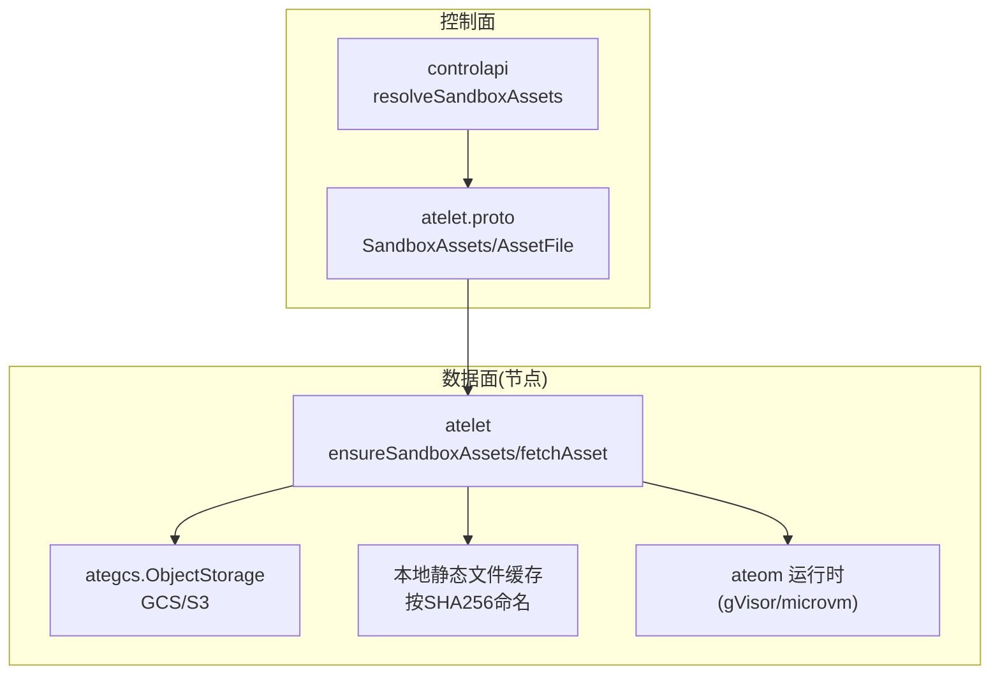
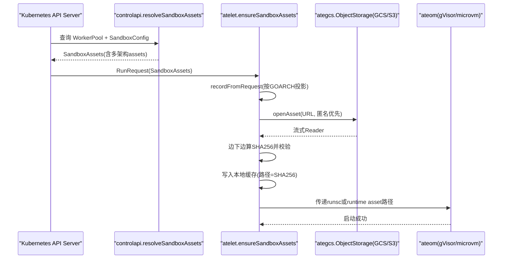
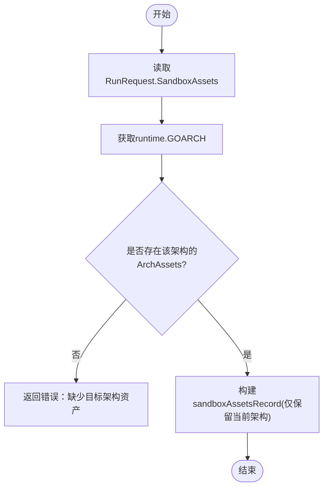
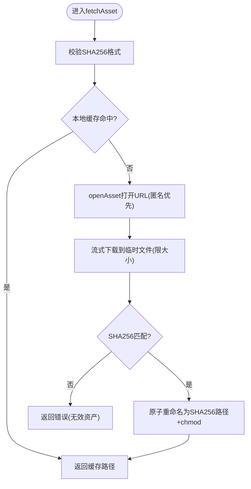
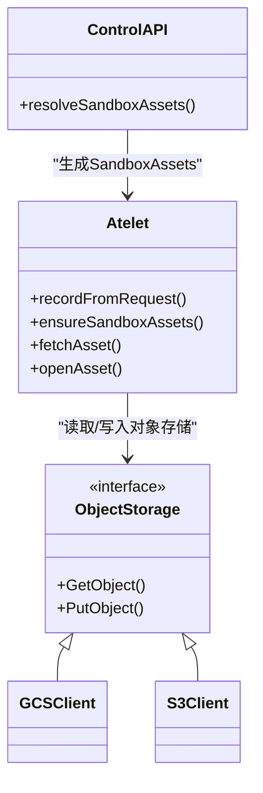

# 沙箱资产管理和分发

<cite>
**本文引用的文件**   
- [cmd/atelet/sandbox_assets.go](file://cmd/atelet/sandbox_assets.go)
- [cmd/atelet/main.go](file://cmd/atelet/main.go)
- [internal/proto/ateletpb/atelet.proto](file://internal/proto/ateletpb/atelet.proto)
- [cmd/ateapi/internal/controlapi/sandbox_assets.go](file://cmd/ateapi/internal/controlapi/sandbox_assets.go)
- [pkg/api/v1alpha1/sandboxconfig_types.go](file://pkg/api/v1alpha1/sandboxconfig_types.go)
- [docs/api-guide.md](file://docs/api-guide.md)
- [cmd/atelet/internal/ategcs/gcs.go](file://cmd/atelet/internal/ategcs/gcs.go)
- [cmd/atelet/internal/ategcs/s3.go](file://cmd/atelet/internal/ategcs/s3.go)
- [cmd/atelet/main_test.go](file://cmd/atelet/main_test.go)
</cite>

## 目录
1. [简介](#简介)
2. [项目结构](#项目结构)
3. [核心组件](#核心组件)
4. [架构总览](#架构总览)
5. [详细组件分析](#详细组件分析)
6. [依赖关系分析](#依赖关系分析)
7. [性能与缓存策略](#性能与缓存策略)
8. [安全与完整性校验](#安全与完整性校验)
9. [故障恢复与最佳实践](#故障恢复与最佳实践)
10. [结论](#结论)
11. [附录：云平台上传与配置示例](#附录云平台上传与配置示例)

## 简介
本文件系统性阐述 Substrate 中“沙箱运行时资产”的管理与分发机制，重点覆盖以下方面：
- AssetFile 结构的设计原理与作用
- URL 与 SHA256 在资产下载、命名与完整性校验中的角色
- atelet 如何根据 GOARCH 动态选择对应架构的资产
- 支持的存储后端（GCS、S3）及认证方式
- 资产缓存策略与版本管理机制
- 不同云平台的资产上传与配置示例
- 安全验证、完整性检查与故障恢复的最佳实践

## 项目结构
与沙箱资产管理相关的关键代码分布在如下位置：
- atelet 侧负责拉取、校验、缓存并交付给底层运行时（gVisor/microvm）
- control API 侧从 Kubernetes 资源解析出 SandboxConfig，生成 atelet 可消费的 proto 描述
- ategcs 抽象层统一 GCS/S3 对象存储访问接口
- 协议定义位于 atelet.proto，明确 AssetFile、ArchAssets、SandboxAssets 等数据结构

图表来源
- [cmd/ateapi/internal/controlapi/sandbox_assets.go:30-102](file://cmd/ateapi/internal/controlapi/sandbox_assets.go#L30-L102)
- [internal/proto/ateletpb/atelet.proto:53-75](file://internal/proto/ateletpb/atelet.proto#L53-L75)
- [cmd/atelet/sandbox_assets.go:91-184](file://cmd/atelet/sandbox_assets.go#L91-L184)
- [cmd/atelet/internal/ategcs/gcs.go:31-66](file://cmd/atelet/internal/ategcs/gcs.go#L31-L66)
- [cmd/atelet/internal/ategcs/s3.go:33-58](file://cmd/atelet/internal/ategcs/s3.go#L33-L58)

章节来源
- [cmd/ateapi/internal/controlapi/sandbox_assets.go:30-102](file://cmd/ateapi/internal/controlapi/sandbox_assets.go#L30-L102)
- [internal/proto/ateletpb/atelet.proto:53-75](file://internal/proto/ateletpb/atelet.proto#L53-L75)
- [cmd/atelet/sandbox_assets.go:91-184](file://cmd/atelet/sandbox_assets.go#L91-L184)
- [cmd/atelet/internal/ategcs/gcs.go:31-66](file://cmd/atelet/internal/ategcs/gcs.go#L31-L66)
- [cmd/atelet/internal/ategcs/s3.go:33-58](file://cmd/atelet/internal/ategcs/s3.go#L33-L58)

## 核心组件
- 协议层（atelet.proto）
  - AssetFile：包含 url 与 sha256，用于内容寻址与完整性校验
  - ArchAssets：按架构组织的资产集合
  - SandboxAssets：顶层描述，包含 sandbox_class 与按架构索引的 assets
- 控制面（controlapi）
  - resolveSandboxAssets：基于 WorkerPool 和 SandboxConfig 解析出 SandboxAssets
- 数据面（atelet）
  - recordFromRequest：将请求中的 SandboxAssets 投影到当前节点 GOARCH
  - ensureSandboxAssets/fetchAsset：确保所有资产存在且通过 SHA256 校验，写入本地缓存
  - openAsset：先匿名读取公共桶，再回退到主客户端（带鉴权）
  - writeSandboxRecord/readSandboxRecord：持久化运行时的资产清单，供 Checkpoint/Restore 使用
- 存储抽象（ategcs）
  - ObjectStorage 接口：GetObject/PutObject
  - gcsClient/s3Client：分别实现 GCS/S3 的读写

章节来源
- [internal/proto/ateletpb/atelet.proto:53-75](file://internal/proto/ateletpb/atelet.proto#L53-L75)
- [cmd/ateapi/internal/controlapi/sandbox_assets.go:30-102](file://cmd/ateapi/internal/controlapi/sandbox_assets.go#L30-L102)
- [cmd/atelet/sandbox_assets.go:70-184](file://cmd/atelet/sandbox_assets.go#L70-L184)
- [cmd/atelet/internal/ategcs/gcs.go:31-66](file://cmd/atelet/internal/ategcs/gcs.go#L31-L66)
- [cmd/atelet/internal/ategcs/s3.go:33-58](file://cmd/atelet/internal/ategcs/s3.go#L33-L58)

## 架构总览
下图展示了从控制面到数据面的完整流程：控制面根据集群配置生成 SandboxAssets；atelet 根据 GOARCH 选择对应资产，按 SHA256 命名并缓存；运行时按需拉起。

图表来源
- [cmd/ateapi/internal/controlapi/sandbox_assets.go:30-102](file://cmd/ateapi/internal/controlapi/sandbox_assets.go#L30-L102)
- [cmd/atelet/sandbox_assets.go:70-184](file://cmd/atelet/sandbox_assets.go#L70-L184)
- [cmd/atelet/main.go:215-271](file://cmd/atelet/main.go#L215-L271)

## 详细组件分析

### 协议与数据结构设计（AssetFile、ArchAssets、SandboxAssets）
- AssetFile
  - url：指向对象存储中的资源地址（如 gs://...），支持匿名或鉴权访问
  - sha256：小写十六进制哈希，既作为缓存文件名又用于完整性校验
- ArchAssets
  - files：以资产名（如 runsc）为键的映射，值即 AssetFile
- SandboxAssets
  - sandbox_class：运行时家族（如 gvisor、microvm）
  - assets：按架构（GOARCH）索引的 ArchAssets 集合

设计要点
- 内容寻址：sha256 作为唯一标识，避免重复下载与冲突
- 跨架构兼容：同一份 SandboxAssets 可包含多个架构的资产，由 atelet 在运行时选择
- 后端无关：url 仅表示对象存储地址，具体后端由 atelet 的存储后端决定

章节来源
- [internal/proto/ateletpb/atelet.proto:53-75](file://internal/proto/ateletpb/atelet.proto#L53-L75)
- [pkg/api/v1alpha1/sandboxconfig_types.go:33-50](file://pkg/api/v1alpha1/sandboxconfig_types.go#L33-L50)

### 架构选择与投影（GOARCH）
- recordFromRequest 会读取 runtime.GOARCH，并从 SandboxAssets.Assets 中选择对应架构的 ArchAssets
- 若缺失目标架构资产，返回错误，阻止后续流程

图表来源
- [cmd/atelet/sandbox_assets.go:70-89](file://cmd/atelet/sandbox_assets.go#L70-L89)

章节来源
- [cmd/atelet/sandbox_assets.go:70-89](file://cmd/atelet/sandbox_assets.go#L70-L89)

### 资产拉取、校验与缓存（fetchAsset/openAsset）
- openAsset
  - 先尝试匿名客户端（适用于公共桶，如 gvisor 官方发布桶）
  - 失败后回退到主客户端（工作负载身份/ADC 或 AWS 环境变量）
- fetchAsset
  - 校验 sha256 格式
  - 若本地缓存命中则直接返回
  - 否则流式下载至临时文件，边下边计算 SHA256，限制最大大小
  - 校验通过后原子重命名为最终路径（路径=SHA256），设置可执行位
  - 失败时清理临时文件，不污染缓存

图表来源
- [cmd/atelet/sandbox_assets.go:117-184](file://cmd/atelet/sandbox_assets.go#L117-L184)
- [cmd/atelet/sandbox_assets.go:186-204](file://cmd/atelet/sandbox_assets.go#L186-L204)

章节来源
- [cmd/atelet/sandbox_assets.go:117-184](file://cmd/atelet/sandbox_assets.go#L117-L184)
- [cmd/atelet/sandbox_assets.go:186-204](file://cmd/atelet/sandbox_assets.go#L186-L204)

### 存储后端与认证（GCS/S3）
- 初始化逻辑
  - 默认使用 GCS（依赖 Workload Identity/ADC）
  - 可通过环境变量 ATE_STORAGE_BACKEND=s3 切换为 S3
  - S3 使用标准 AWS 环境变量进行配置，可选开启路径风格
- 匿名访问
  - 始终创建匿名 GCS 客户端，用于快速命中公共桶
- 统一抽象
  - ategcs.ObjectStorage 提供 GetObject/PutObject
  - gcsClient 支持流式 Put（无需 seekable body）
  - s3Client 不支持流式 Put（需 seekable body）

章节来源
- [cmd/atelet/main.go:126-161](file://cmd/atelet/main.go#L126-L161)
- [cmd/atelet/internal/ategcs/gcs.go:31-66](file://cmd/atelet/internal/ategcs/gcs.go#L31-L66)
- [cmd/atelet/internal/ategcs/s3.go:33-58](file://cmd/atelet/internal/ategcs/s3.go#L33-L58)

### 版本管理与快照清单（Snapshot Manifest）
- 在 Run/Restore 时，atelet 将当前运行的 sandbox 资产记录写入节点本地
- 在 Checkpoint 时，atelet 将该记录连同 snapshot 文件列表一起写入快照清单（manifest.json）
- 在 Restore 时，先读取 manifest.json，再据此拉取相同版本的资产与快照文件，保证可复现性

章节来源
- [cmd/atelet/sandbox_assets.go:206-241](file://cmd/atelet/sandbox_assets.go#L206-L241)
- [cmd/atelet/main.go:422-452](file://cmd/atelet/main.go#L422-L452)
- [cmd/atelet/main.go:474-504](file://cmd/atelet/main.go#L474-L504)

## 依赖关系分析
- controlapi 依赖 Kubernetes listers 解析 SandboxConfig，输出 atelet.proto 的 SandboxAssets
- atelet 依赖 ategcs.ObjectStorage 抽象，屏蔽 GCS/S3 差异
- atelet 依赖 ateompath 与 ateerrors 进行路径与错误处理
- 测试用例覆盖容量上限与哈希不一致场景

图表来源
- [cmd/ateapi/internal/controlapi/sandbox_assets.go:30-102](file://cmd/ateapi/internal/controlapi/sandbox_assets.go#L30-L102)
- [cmd/atelet/sandbox_assets.go:91-184](file://cmd/atelet/sandbox_assets.go#L91-L184)
- [cmd/atelet/internal/ategcs/gcs.go:31-66](file://cmd/atelet/internal/ategcs/gcs.go#L31-L66)
- [cmd/atelet/internal/ategcs/s3.go:33-58](file://cmd/atelet/internal/ategcs/s3.go#L33-L58)

章节来源
- [cmd/ateapi/internal/controlapi/sandbox_assets.go:30-102](file://cmd/ateapi/internal/controlapi/sandbox_assets.go#L30-L102)
- [cmd/atelet/sandbox_assets.go:91-184](file://cmd/atelet/sandbox_assets.go#L91-L184)
- [cmd/atelet/internal/ategcs/gcs.go:31-66](file://cmd/atelet/internal/ategcs/gcs.go#L31-L66)
- [cmd/atelet/internal/ategcs/s3.go:33-58](file://cmd/atelet/internal/ategcs/s3.go#L33-L58)

## 性能与缓存策略
- 本地缓存
  - 以 SHA256 为文件名，命中即直接返回，避免重复下载
  - 首次冷启动可能涉及较大镜像/二进制下载，后续热路径极快
- 流式处理
  - 下载过程边读边算哈希，避免内存峰值
  - 对 GCS 支持流式上传（压缩直传），减少中间文件
- 并发优化
  - Restore 阶段并行下载快照与准备 OCI bundle，缩短整体延迟

章节来源
- [cmd/atelet/sandbox_assets.go:117-184](file://cmd/atelet/sandbox_assets.go#L117-L184)
- [cmd/atelet/main.go:506-544](file://cmd/atelet/main.go#L506-L544)
- [cmd/atelet/internal/ategcs/gcs.go:46-66](file://cmd/atelet/internal/ategcs/gcs.go#L46-L66)

## 安全与完整性校验
- 强制 SHA256 校验
  - 下载前校验格式，下载后比对哈希，不匹配则拒绝并清理临时文件
- 容量保护
  - 限制最大下载大小，防止恶意 URL 导致磁盘耗尽
- 最小权限与匿名优先
  - 先匿名访问公共桶，失败再回退到主客户端，降低不必要鉴权开销
- 终端错误分类
  - 文件系统类错误被标记为终端错误，便于上层决策是否崩溃或重试

章节来源
- [cmd/atelet/sandbox_assets.go:117-184](file://cmd/atelet/sandbox_assets.go#L117-L184)
- [cmd/atelet/sandbox_assets.go:243-266](file://cmd/atelet/sandbox_assets.go#L243-L266)
- [cmd/atelet/main_test.go:330-361](file://cmd/atelet/main_test.go#L330-L361)

## 故障恢复与最佳实践
- 快照自描述
  - 每个快照附带 manifest.json，记录创建快照时的沙箱资产版本与快照文件列表
  - Restore 时先拉取 manifest，再据此精确恢复，避免版本漂移
- 幂等与原子操作
  - 下载完成后原子重命名，避免部分写入污染缓存
- 错误分类与可观测性
  - 区分终端错误与非终端错误，结合指标与日志定位问题
- 建议
  - 固定沙箱运行时版本并通过 SandboxConfig 集中管理
  - 使用受信任的对象存储与最小权限凭证
  - 定期校验资产哈希与快照完整性

章节来源
- [cmd/atelet/main.go:422-452](file://cmd/atelet/main.go#L422-L452)
- [cmd/atelet/main.go:474-504](file://cmd/atelet/main.go#L474-L504)
- [cmd/atelet/sandbox_assets.go:206-241](file://cmd/atelet/sandbox_assets.go#L206-L241)

## 结论
Substrate 的沙箱资产管理采用“内容寻址 + 架构感知 + 后端无关”的设计，通过严格的 SHA256 校验与本地缓存，在保证安全性的同时提升性能。借助 Snapshot Manifest，系统实现了跨节点、跨时间的可复现恢复。统一的 ategcs 抽象让 GCS/S3 无缝切换，配合匿名优先与最小权限原则，兼顾效率与安全。

## 附录：云平台上传与配置示例

### 平台概览
- 控制面通过 SandboxConfig 声明各架构的资产（url + sha256）
- atelet 在运行时按 GOARCH 选择对应资产，并拉取、校验、缓存
- 支持 GCS（默认）与 S3（通过环境变量切换）

章节来源
- [docs/api-guide.md:184-215](file://docs/api-guide.md#L184-L215)
- [pkg/api/v1alpha1/sandboxconfig_types.go:52-103](file://pkg/api/v1alpha1/sandboxconfig_types.go#L52-L103)
- [cmd/atelet/main.go:126-161](file://cmd/atelet/main.go#L126-L161)

### GCS 配置与上传
- 认证
  - 默认使用 Workload Identity/ADC，无需额外配置
- 上传
  - 将二进制上传至公开或私有桶，记录其 SHA256
- 配置
  - 在 SandboxConfig 中为 amd64/arm64 分别填写 url 与 sha256

章节来源
- [cmd/atelet/main.go:143-149](file://cmd/atelet/main.go#L143-L149)
- [docs/api-guide.md:196-215](file://docs/api-guide.md#L196-L215)

### S3 配置与上传
- 认证
  - 设置环境变量 ATE_STORAGE_BACKEND=s3
  - 使用标准 AWS 环境变量配置凭据与区域
  - 可选启用路径风格（AWS_S3_USE_PATH_STYLE=true）
- 上传
  - 将二进制上传至 S3 Bucket，记录其 SHA256
- 配置
  - 在 SandboxConfig 中为 amd64/arm64 分别填写 s3:// 或 https:// 形式的 url 与 sha256

章节来源
- [cmd/atelet/main.go:128-142](file://cmd/atelet/main.go#L128-L142)
- [cmd/atelet/internal/ategcs/s3.go:33-58](file://cmd/atelet/internal/ategcs/s3.go#L33-L58)
- [docs/api-guide.md:196-215](file://docs/api-guide.md#L196-L215)
