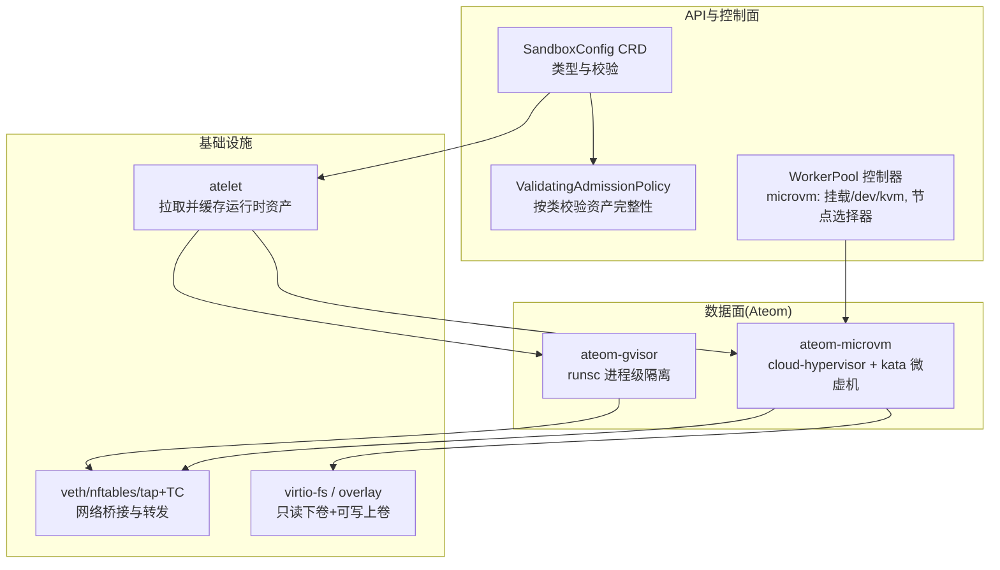
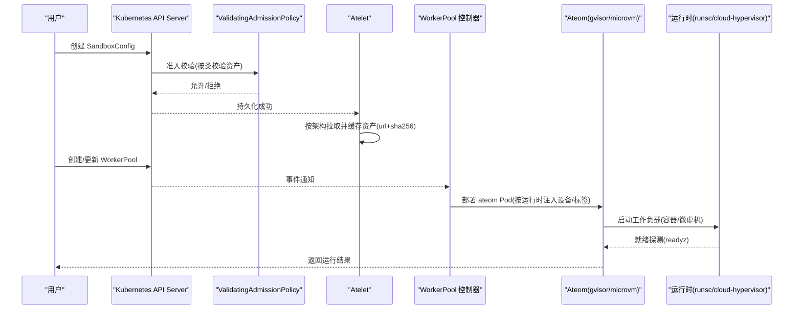
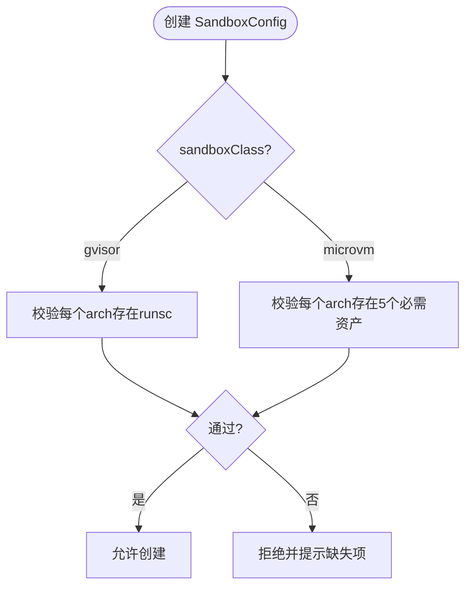
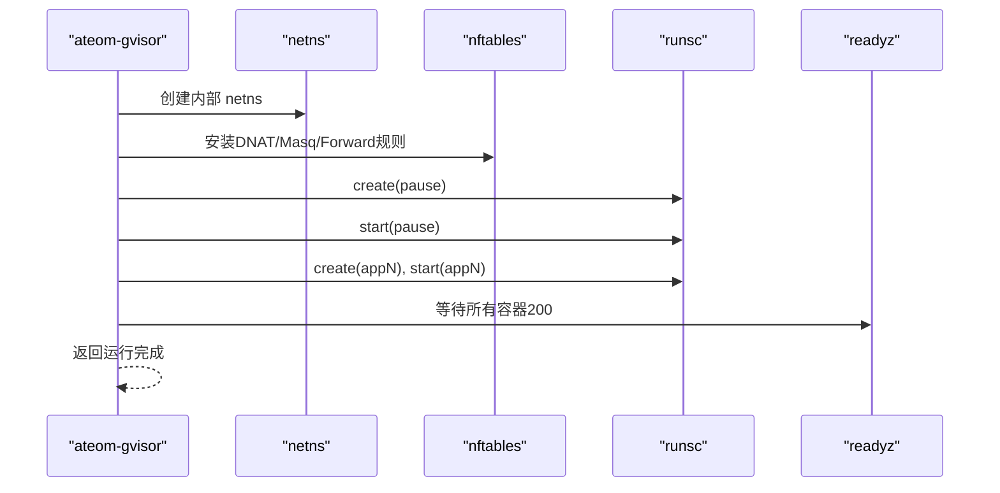
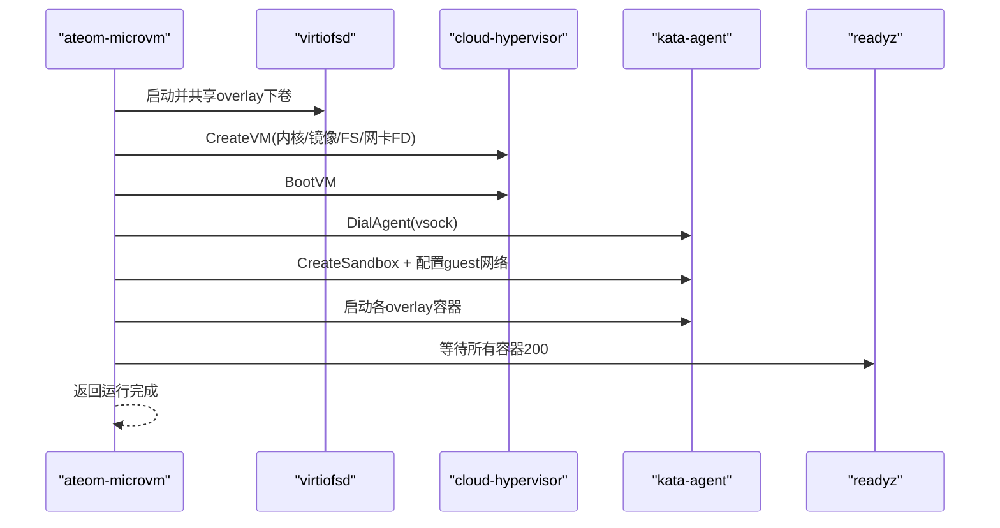
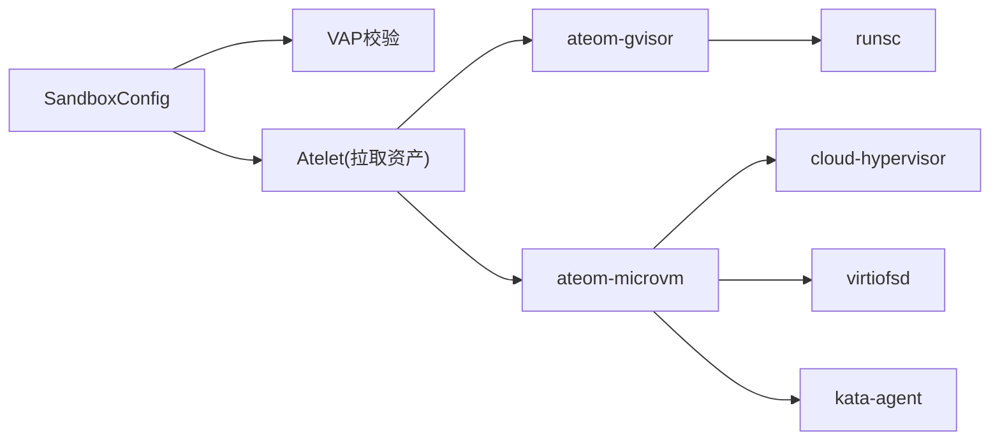
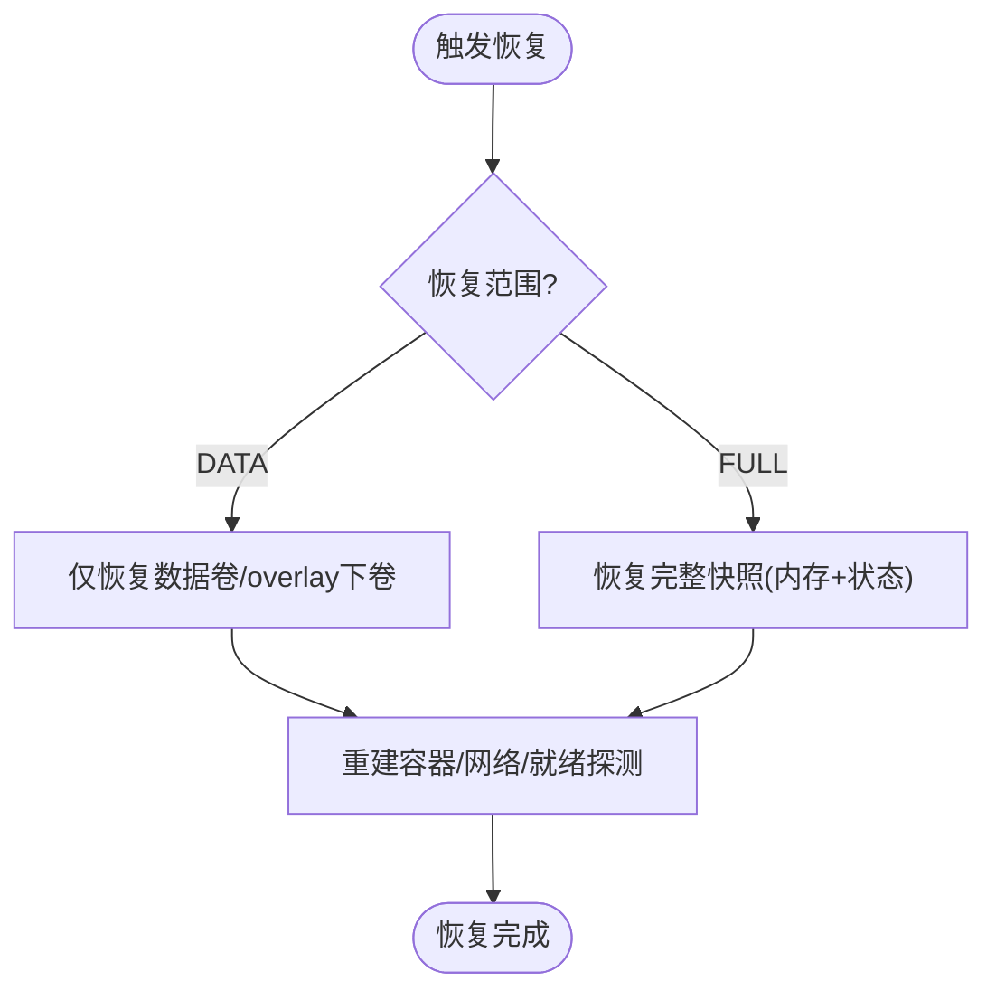

# 沙箱隔离与安全

<cite>
**本文引用的文件**   
- [sandboxconfig_types.go](file://pkg/api/v1alpha1/sandboxconfig_types.go)
- [sandboxconfig_validation.yaml](file://manifests/ate-install/sandboxconfig-validation.yaml)
- [sandboxconfig-gvisor.yaml](file://manifests/ate-install/sandboxconfig-gvisor.yaml)
- [main.go (gVisor)](file://cmd/ateom-gvisor/main.go)
- [runsc.go (gVisor)](file://cmd/ateom-gvisor/runsc.go)
- [main.go (MicroVM)](file://cmd/ateom-microvm/main.go)
- [run.go (MicroVM)](file://cmd/ateom-microvm/run.go)
- [config.go (kata)](file://cmd/ateom-microvm/internal/kata/config.go)
- [agent.pb.go (kata agentpb)](file://cmd/ateom-microvm/internal/third_party/kata/agentpb/agent.pb.go)
- [workerpool_apply.go](file://cmd/atecontroller/internal/controllers/workerpool_apply.go)
- [sandbox_assets.go](file://cmd/atelet/sandbox_assets.go)
- [README.md (microvm-assets)](file://hack/microvm-assets/README.md)
</cite>

## 目录
1. [简介](#简介)
2. [项目结构](#项目结构)
3. [核心组件](#核心组件)
4. [架构总览](#架构总览)
5. [详细组件分析](#详细组件分析)
6. [依赖关系分析](#依赖关系分析)
7. [性能与资源限制](#性能与资源限制)
8. [故障恢复策略](#故障恢复策略)
9. [配置示例与调优建议](#配置示例与调优建议)
10. [安全最佳实践与防护](#安全最佳实践与防护)
11. [结论](#结论)

## 简介
本文件系统性阐述 Substrate 的“沙箱隔离机制与安全架构”，重点覆盖：
- SandboxConfig 的作用、字段含义与配置方法
- gVisor（runsc）与 MicroVM（cloud-hypervisor + kata）两种运行时在隔离强度、启动开销、快照/恢复能力等方面的差异
- 进程级隔离的实现原理与轻量虚拟化路径
- 沙箱启动流程、网络与文件系统隔离、资源限制机制
- 故障恢复策略（检查点/恢复、OnDemand 恢复）
- 不同运行时的配置示例与性能调优建议
- 安全最佳实践与常见安全问题防护措施

## 项目结构
围绕“沙箱隔离与安全”的关键代码与清单分布如下：
- API 层：SandboxConfig CRD 定义与校验策略
- 控制面：WorkerPool 控制器为 microvm 注入 KVM 设备与节点选择器
- 数据面：ateom-gvisor 与 ateom-microvm 两个 Ateom 服务实现，分别驱动 runsc 与 cloud-hypervisor
- 资产拉取：atelet 负责按 SandboxConfig 下载并缓存二进制/镜像等静态资源
- 文档与示例：microvm 资产说明与默认 gVisor 配置清单

图表来源
- [sandboxconfig_types.go:21-79](file://pkg/api/v1alpha1/sandboxconfig_types.go#L21-L79)
- [sandboxconfig_validation.yaml:19-46](file://manifests/ate-install/sandboxconfig-validation.yaml#L19-L46)
- [workerpool_apply.go:103-130](file://cmd/atecontroller/internal/controllers/workerpool_apply.go#L103-L130)
- [sandbox_assets.go:91-115](file://cmd/atelet/sandbox_assets.go#L91-L115)
- [main.go (gVisor):125-154](file://cmd/ateom-gvisor/main.go#L125-L154)
- [main.go (MicroVM):124-153](file://cmd/ateom-microvm/main.go#L124-L153)

章节来源
- [sandboxconfig_types.go:21-79](file://pkg/api/v1alpha1/sandboxconfig_types.go#L21-L79)
- [sandboxconfig_validation.yaml:19-46](file://manifests/ate-install/sandboxconfig-validation.yaml#L19-L46)
- [workerpool_apply.go:103-130](file://cmd/atecontroller/internal/controllers/workerpool_apply.go#L103-L130)
- [sandbox_assets.go:91-115](file://cmd/atelet/sandbox_assets.go#L91-L115)
- [main.go (gVisor):125-154](file://cmd/ateom-gvisor/main.go#L125-L154)
- [main.go (MicroVM):124-153](file://cmd/ateom-microvm/main.go#L124-L153)

## 核心组件
- SandboxConfig（CRD）
  - sandboxClass：选择运行时族（gvisor 或 microvm）
  - default：集群级默认配置标记
  - assets：按架构映射到内容寻址的资产文件（url + sha256），由 atelet 拉取并缓存
- ValidatingAdmissionPolicy（VAP）
  - 对 gvisor 要求每个架构必须提供 runsc 资产
  - 对 microvm 要求每个架构必须提供 cloud-hypervisor、virtiofsd、kata-kernel、kata-image、kata-config 五件套
- WorkerPool 控制器
  - 针对 microvm 运行时自动挂载 /dev/kvm 并设置节点选择器与污点容忍，确保调度到具备嵌套虚拟化的节点
- Atelet
  - 根据 SandboxConfig 拉取并缓存运行时资产，返回本地路径给 ateom 使用
- Ateom 服务（两类实现）
  - ateom-gvisor：通过 runsc 管理容器生命周期，基于 Linux 命名空间与 seccomp 等实现进程级隔离
  - ateom-microvm：直接驱动 cloud-hypervisor 启动 guest，使用 kata-agent 编排容器，实现内核级隔离

章节来源
- [sandboxconfig_types.go:21-79](file://pkg/api/v1alpha1/sandboxconfig_types.go#L21-L79)
- [sandboxconfig_validation.yaml:19-46](file://manifests/ate-install/sandboxconfig-validation.yaml#L19-L46)
- [workerpool_apply.go:103-130](file://cmd/atecontroller/internal/controllers/workerpool_apply.go#L103-L130)
- [sandbox_assets.go:91-115](file://cmd/atelet/sandbox_assets.go#L91-L115)
- [main.go (gVisor):158-178](file://cmd/ateom-gvisor/main.go#L158-L178)
- [main.go (MicroVM):184-226](file://cmd/ateom-microvm/main.go#L184-L226)

## 架构总览
下图展示从配置到执行的整体流程：用户创建 SandboxConfig → VAP 校验 → atelet 拉取资产 → WorkerPool 调度 → ateom 启动工作负载。

图表来源
- [sandboxconfig_validation.yaml:19-46](file://manifests/ate-install/sandboxconfig-validation.yaml#L19-L46)
- [sandbox_assets.go:91-115](file://cmd/atelet/sandbox_assets.go#L91-L115)
- [workerpool_apply.go:103-130](file://cmd/atecontroller/internal/controllers/workerpool_apply.go#L103-L130)
- [main.go (gVisor):125-154](file://cmd/ateom-gvisor/main.go#L125-L154)
- [main.go (MicroVM):124-153](file://cmd/ateom-microvm/main.go#L124-L153)

## 详细组件分析

### SandboxConfig 与资产校验
- 作用：声明某类运行时所需的二进制/镜像等静态资源，解耦 ActorTemplate 与具体运行时版本
- 关键字段
  - sandboxClass：gvisor | microvm
  - default：是否作为该类的默认配置
  - assets：map[arch]map[name]{url, sha256}
- 校验策略（VAP）
  - gvisor：每个 arch 必须包含 runsc
  - microvm：每个 arch 必须包含 cloud-hypervisor、virtiofsd、kata-kernel、kata-image、kata-config
- 默认配置示例：gvisor-default 提供 amd64/arm64 的 runsc 地址与哈希

图表来源
- [sandboxconfig_types.go:21-79](file://pkg/api/v1alpha1/sandboxconfig_types.go#L21-L79)
- [sandboxconfig_validation.yaml:19-46](file://manifests/ate-install/sandboxconfig-validation.yaml#L19-L46)
- [sandboxconfig-gvisor.yaml:15-36](file://manifests/ate-install/sandboxconfig-gvisor.yaml#L15-L36)

章节来源
- [sandboxconfig_types.go:21-79](file://pkg/api/v1alpha1/sandboxconfig_types.go#L21-L79)
- [sandboxconfig_validation.yaml:19-46](file://manifests/ate-install/sandboxconfig-validation.yaml#L19-L46)
- [sandboxconfig-gvisor.yaml:15-36](file://manifests/ate-install/sandboxconfig-gvisor.yaml#L15-L36)

### gVisor 运行时（进程级隔离）
- 隔离模型：Linux 命名空间 + seccomp + cgroup，以 runsc 作为用户态内核替代，实现进程级隔离
- 启动流程要点
  - 创建内部网络命名空间，建立 veth 对，安装 nftables 规则进行 DNAT/Masquerade
  - 调用 runsc create/start 启动 pause 与应用容器
  - 等待 readyz 探针成功后返回
- 快照/恢复
  - 支持 checkpoint/fscheckpoint 与 restore；DATA 范围仅持久化数据卷，FULL 范围保存完整状态
- 日志与追踪
  - 统一 JSON 日志输出，OpenTelemetry 集成

图表来源
- [main.go (gVisor):439-521](file://cmd/ateom-gvisor/main.go#L439-L521)
- [main.go (gVisor):180-237](file://cmd/ateom-gvisor/main.go#L180-L237)
- [runsc.go:35-103](file://cmd/ateom-gvisor/runsc.go#L35-L103)

章节来源
- [main.go (gVisor):125-154](file://cmd/ateom-gvisor/main.go#L125-L154)
- [main.go (gVisor):439-521](file://cmd/ateom-gvisor/main.go#L439-L521)
- [runsc.go:35-103](file://cmd/ateom-gvisor/runsc.go#L35-L103)

### MicroVM 运行时（轻量虚拟化）
- 隔离模型：cloud-hypervisor 提供独立内核与硬件抽象，kata-agent 在 guest 内编排容器，实现内核级隔离
- 启动流程要点
  - 准备 OCI bundle，构造 overlay rootfs（virtio-fs 只读下卷 + guest tmpfs 可写上卷）
  - 启动 virtiofsd 暴露下卷，启动 CH VM，添加 tap 网卡并通过 SCM_RIGHTS 传递 FD
  - 引导 guest，连接 kata-agent，CreateSandbox + 配置 guest 网络，逐个启动 overlay 容器
  - 等待 readyz 探针成功后返回
- 资源与设备
  - 通过 WorkerPool 控制器挂载 /dev/kvm，并设置节点选择器与污点容忍，确保调度到具备 KVM 的节点
- 调试与诊断
  - 支持开启 debug console 与 agent 调试日志，便于定位问题

图表来源
- [run.go:187-368](file://cmd/ateom-microvm/run.go#L187-L368)
- [run.go:443-476](file://cmd/ateom-microvm/run.go#L443-L476)
- [config.go:52-73](file://cmd/ateom-microvm/internal/kata/config.go#L52-L73)
- [workerpool_apply.go:103-130](file://cmd/atecontroller/internal/controllers/workerpool_apply.go#L103-L130)

章节来源
- [main.go (MicroVM):124-153](file://cmd/ateom-microvm/main.go#L124-L153)
- [run.go:187-368](file://cmd/ateom-microvm/run.go#L187-L368)
- [config.go:52-73](file://cmd/ateom-microvm/internal/kata/config.go#L52-L73)
- [workerpool_apply.go:103-130](file://cmd/atecontroller/internal/controllers/workerpool_apply.go#L103-L130)

### 网络与文件系统隔离
- 网络
  - gVisor：veth 对 + nftables 规则，将 pod IP 的入站流量 DNAT 到 actor veth，出站 Masquerade
  - MicroVM：tap + TC mirror，通过 vsock 与 kata-agent 配置 guest 网络（IP/MAC/MTU/路由/ARP）
- 文件系统
  - MicroVM：virtio-fs 提供只读下卷（OCI image），guest tmpfs 作为可写上卷，避免宿主机磁盘写入
  - gVisor：基于 OCI bundle 与 runsc 管理的根文件系统

章节来源
- [main.go (gVisor):439-521](file://cmd/ateom-gvisor/main.go#L439-L521)
- [run.go:495-523](file://cmd/ateom-microvm/run.go#L495-L523)
- [run.go:399-422](file://cmd/ateom-microvm/run.go#L399-L422)
- [README.md (microvm-assets):1-25](file://hack/microvm-assets/README.md#L1-L25)

## 依赖关系分析
- 组件耦合
  - SandboxConfig 被 WorkerPool 与 atelet 共同消费；VAP 在 API Server 侧做强约束
  - atelet 与 ateom 通过“资产名→本地路径”的约定协作
  - ateom 与运行时（runsc/cloud-hypervisor）通过命令行/HTTP API 交互
- 外部依赖
  - gVisor：runsc 二进制
  - MicroVM：cloud-hypervisor、virtiofsd、kata 内核与镜像、kata 配置
- 潜在环路与风险
  - 无循环导入；但需关注 VAP 生效延迟导致首次创建失败重试逻辑

图表来源
- [sandboxconfig_types.go:21-79](file://pkg/api/v1alpha1/sandboxconfig_types.go#L21-L79)
- [sandboxconfig_validation.yaml:19-46](file://manifests/ate-install/sandboxconfig-validation.yaml#L19-L46)
- [sandbox_assets.go:91-115](file://cmd/atelet/sandbox_assets.go#L91-L115)
- [main.go (gVisor):125-154](file://cmd/ateom-gvisor/main.go#L125-L154)
- [main.go (MicroVM):124-153](file://cmd/ateom-microvm/main.go#L124-L153)

章节来源
- [sandboxconfig_types.go:21-79](file://pkg/api/v1alpha1/sandboxconfig_types.go#L21-L79)
- [sandboxconfig_validation.yaml:19-46](file://manifests/ate-install/sandboxconfig-validation.yaml#L19-L46)
- [sandbox_assets.go:91-115](file://cmd/atelet/sandbox_assets.go#L91-L115)

## 性能与资源限制
- 启动时延
  - gVisor：进程级隔离，启动较快，适合低延迟场景
  - MicroVM：需要启动 guest 内核与 virtiofsd，冷启动开销更高，但隔离更强
- 内存/CPU
  - MicroVM 通过 kata 配置解析 guest 的 MemoryMiB/VCPUs，并在 CH VmConfig 中映射
  - gVisor 受限于宿主 cgroup 与 seccomp 策略
- I/O 与网络
  - MicroVM 使用 virtio-fs 按需分页访问只读下卷，减少宿主机 IO 压力
  - gVisor 使用 AF_PACKET 与 nftables 转发，路径更短
- 资源限制建议
  - 合理设置 guest 内存与 vCPU，避免过度分配
  - 为 gVisor 启用合适的 seccomp/profile，最小化系统调用面
  - 为 MicroVM 启用 NUMA 亲和与队列优化（如 QueueSize）

章节来源
- [run.go:443-476](file://cmd/ateom-microvm/run.go#L443-L476)
- [config.go:52-73](file://cmd/ateom-microvm/internal/kata/config.go#L52-L73)
- [main.go (gVisor):439-521](file://cmd/ateom-gvisor/main.go#L439-L521)

## 故障恢复策略
- gVisor
  - DATA 范围：仅对持久化目录进行 fscheckpoint，适用于数据一致性优先的场景
  - FULL 范围：对整个沙箱根容器进行 checkpoint，后续 restore 时重建所有容器
  - 清理：checkpoint 后尝试删除容器，失败则记录警告并由 atelet 重置状态
- MicroVM
  - OnDemand 恢复：利用 CH demand-pages 从稀疏快照页回源，降低恢复时延与存储占用
  - 基线 ID（base-id）：跨 restore 链路的 golden id 保持不变，保证 virtio-fs find-paths 稳定
  - 日志与诊断：失败时读取 serial.log 与 guest 控制台信息辅助排障

图表来源
- [main.go (gVisor):239-307](file://cmd/ateom-gvisor/main.go#L239-L307)
- [main.go (gVisor):352-437](file://cmd/ateom-gvisor/main.go#L352-L437)
- [run.go:41-86](file://cmd/ateom-microvm/run.go#L41-L86)

章节来源
- [main.go (gVisor):239-307](file://cmd/ateom-gvisor/main.go#L239-L307)
- [main.go (gVisor):352-437](file://cmd/ateom-gvisor/main.go#L352-L437)
- [run.go:41-86](file://cmd/ateom-microvm/run.go#L41-L86)

## 配置示例与调优建议
- gVisor 默认配置
  - 提供 amd64/arm64 的 runsc 地址与 SHA256，作为集群默认 SandboxConfig
- MicroVM 资产集
  - 五个必需资产：cloud-hypervisor、virtiofsd、kata-kernel、kata-image、kata-config
  - 可通过 hack/microvm-assets 脚本构建并按架构分发至对象存储
- 运行时参数
  - MicroVM：通过 kata configuration.toml 指定 guest 内存、vCPU 与 kernel_params；可开启 debug console 与 agent 调试日志
  - gVisor：通过 runsc 参数控制日志级别、调试开关等（按需启用）
- 节点与调度
  - microvm 运行时需 /dev/kvm，控制器自动挂载并设置节点选择器与污点容忍

章节来源
- [sandboxconfig-gvisor.yaml:15-36](file://manifests/ate-install/sandboxconfig-gvisor.yaml#L15-L36)
- [README.md (microvm-assets):1-25](file://hack/microvm-assets/README.md#L1-L25)
- [config.go:75-103](file://cmd/ateom-microvm/internal/kata/config.go#L75-L103)
- [workerpool_apply.go:103-130](file://cmd/atecontroller/internal/controllers/workerpool_apply.go#L103-L130)

## 安全最佳实践与防护
- 最小权限原则
  - 仅开放必要设备与系统调用；gVisor 启用严格 seccomp；MicroVM 使用最小 guest 镜像
- 资产完整性
  - 使用 url + sha256 校验，结合 VAP 强制每类运行时资产完整性
- 网络隔离
  - 使用专用 nftables 表与最小化转发规则；MicroVM 固定 ARP 邻居，避免 ARP 欺骗
- 日志与审计
  - 统一结构化日志与 OpenTelemetry 追踪；MicroVM 开启 debug console 用于取证
- 故障隔离
  - 使用 DATA/FULL 快照策略平衡一致性与恢复速度；失败路径保留诊断信息

章节来源
- [sandboxconfig_validation.yaml:19-46](file://manifests/ate-install/sandboxconfig-validation.yaml#L19-L46)
- [main.go (gVisor):439-521](file://cmd/ateom-gvisor/main.go#L439-L521)
- [run.go:495-523](file://cmd/ateom-microvm/run.go#L495-L523)
- [config.go:75-103](file://cmd/ateom-microvm/internal/kata/config.go#L75-L103)

## 结论
Substrate 通过 SandboxConfig 统一管理运行时资产，并以 VAP 保障配置正确性；数据面提供 gVisor 与 MicroVM 两套隔离方案，前者强调低延迟与进程级隔离，后者提供内核级隔离与更强的攻击面收敛。配合 atelet 的资产拉取、WorkerPool 的设备与调度注入、以及完善的快照/恢复与诊断能力，可在不同业务场景下灵活权衡性能与安全。
