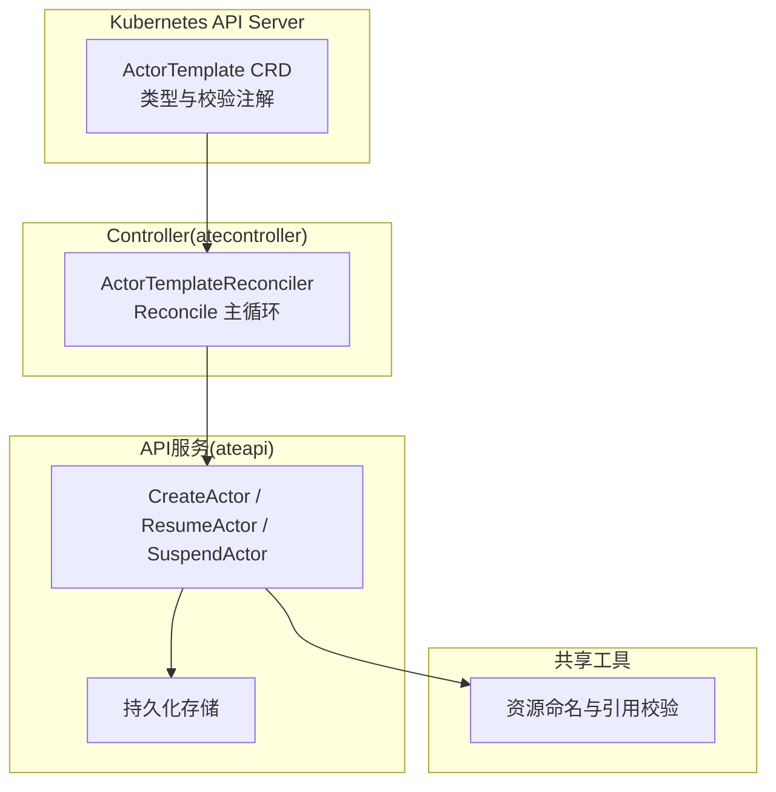
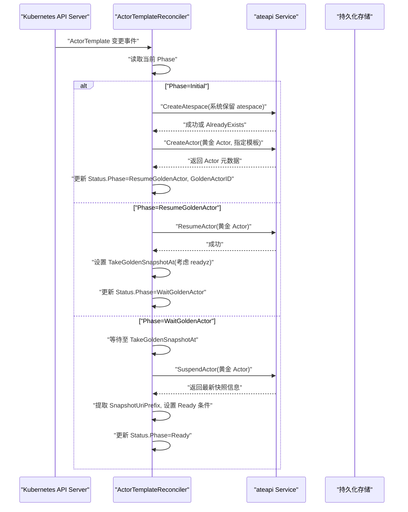
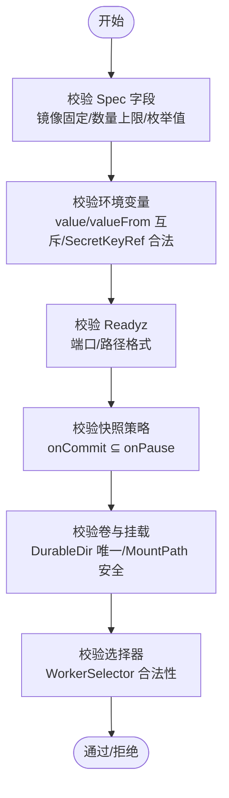
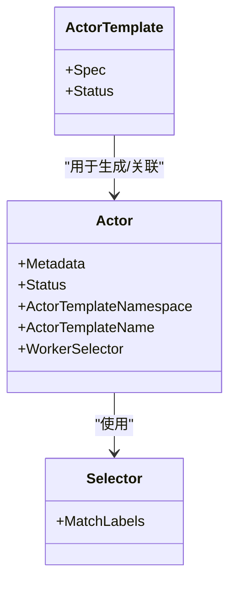
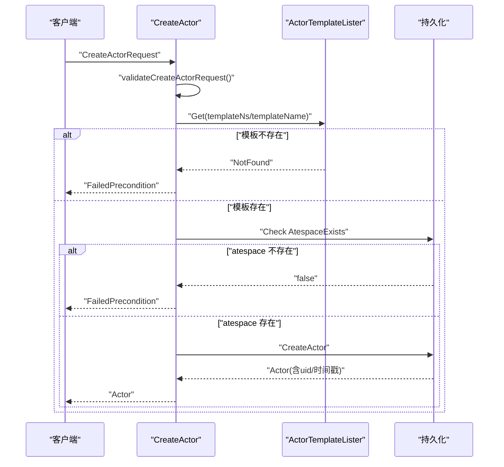
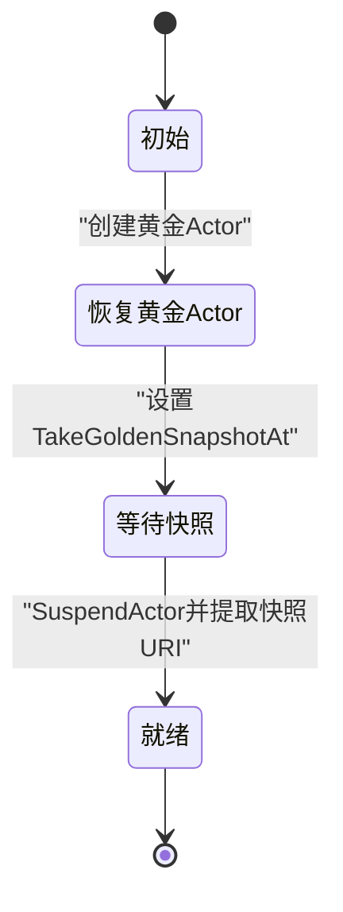
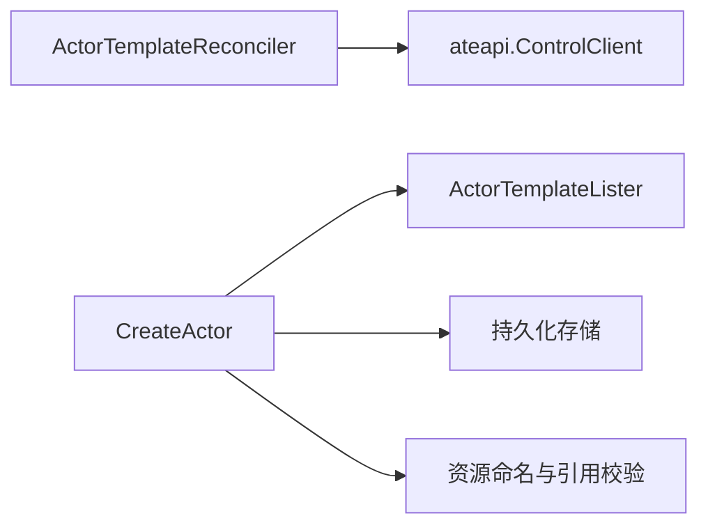

# ActorTemplate控制器

<cite>
**本文引用的文件**   
- [actortemplate_controller.go](file://cmd/atecontroller/internal/controllers/actortemplate_controller.go)
- [actortemplate_types.go](file://pkg/api/v1alpha1/actortemplate_types.go)
- [create_actor.go](file://cmd/ateapi/internal/controlapi/create_actor.go)
- [validate.go](file://internal/resources/validate.go)
- [functional_test.go](file://cmd/ateapi/internal/controlapi/functional_test.go)
- [zz_generated.deepcopy.go](file://pkg/api/v1alpha1/zz_generated.deepcopy.go)
</cite>

## 目录
1. [简介](#简介)
2. [项目结构](#项目结构)
3. [核心组件](#核心组件)
4. [架构总览](#架构总览)
5. [详细组件分析](#详细组件分析)
6. [依赖关系分析](#依赖关系分析)
7. [性能考量](#性能考量)
8. [故障排查指南](#故障排查指南)
9. [结论](#结论)
10. [附录](#附录)

## 简介
本文件系统性阐述 ActorTemplate 控制器的实现原理与工作机制，覆盖模板验证、Actor 实例自动生成、模板继承与组合、与 ateapi 服务的集成（创建请求、状态同步、错误处理）、配置语法与最佳实践、常见问题解决方案，以及版本管理与向后兼容性保证。文档面向不同技术背景的读者，提供从高层到代码级的渐进式说明，并辅以可视化图示帮助理解。

## 项目结构
围绕 ActorTemplate 的关键代码分布在以下位置：
- CRD 类型定义与校验注解位于 pkg/api/v1alpha1/actortemplate_types.go
- 控制器主循环与状态机逻辑位于 cmd/atecontroller/internal/controllers/actortemplate_controller.go
- ateapi 侧的 Actor 创建与字段校验位于 cmd/ateapi/internal/controlapi/create_actor.go
- 通用资源命名与引用校验工具位于 internal/resources/validate.go
- 深度拷贝生成代码位于 pkg/api/v1alpha1/zz_generated.deepcopy.go
- 端到端功能测试覆盖关键路径与错误场景位于 cmd/ateapi/internal/controlapi/functional_test.go

**图表来源** 
- [actortemplate_controller.go:66-187](file://cmd/atecontroller/internal/controllers/actortemplate_controller.go#L66-L187)
- [create_actor.go:32-82](file://cmd/ateapi/internal/controlapi/create_actor.go#L32-L82)
- [validate.go:29-96](file://internal/resources/validate.go#L29-L96)

**章节来源**
- [actortemplate_types.go:278-375](file://pkg/api/v1alpha1/actortemplate_types.go#L278-L375)
- [actortemplate_controller.go:66-187](file://cmd/atecontroller/internal/controllers/actortemplate_controller.go#L66-L187)
- [create_actor.go:32-82](file://cmd/ateapi/internal/controlapi/create_actor.go#L32-L82)
- [validate.go:29-96](file://internal/resources/validate.go#L29-L96)

## 核心组件
- ActorTemplate CRD 与 Spec/Status
  - Spec 包含容器定义、快照策略、沙箱类、工作池选择器、卷等；Status 包含阶段、黄金 Actor 信息、就绪条件等。
  - 使用 kubebuilder 注解进行强约束：不可变 spec、镜像必须固定、容器数量上限、环境变量限制、挂载路径安全规则、快照范围一致性等。
- ActorTemplateReconciler
  - 基于 controller-runtime 的 Reconcile 循环驱动状态机：Initial → ResumeGoldenActor → WaitGoldenActor → Ready。
  - 在 Initial 阶段确保系统 atespace 存在，创建“黄金”Actor，记录 ID，进入下一阶段。
  - 在 ResumeGoldenActor 阶段恢复黄金 Actor，计算快照准备时间（考虑 readyz），进入等待阶段。
  - 在 WaitGoldenActor 阶段到期后挂起黄金 Actor，提取外部快照 URI 前缀，标记为 Ready。
- ateapi CreateActor
  - 校验请求参数（名称、命名空间、子域名、选择器等），检查 ActorTemplate 是否存在，检查 atespace 是否已存在，写入持久化存储并返回 Actor 对象。
- 通用校验工具
  - 提供资源名、对象引用、全局对象引用、IP、UUID 等校验函数，被 API 层复用。

**章节来源**
- [actortemplate_types.go:278-375](file://pkg/api/v1alpha1/actortemplate_types.go#L278-L375)
- [actortemplate_controller.go:66-187](file://cmd/atecontroller/internal/controllers/actortemplate_controller.go#L66-L187)
- [create_actor.go:32-82](file://cmd/ateapi/internal/controlapi/create_actor.go#L32-L82)
- [validate.go:29-96](file://internal/resources/validate.go#L29-L96)

## 架构总览
下图展示了 ActorTemplate 控制器与 ateapi 服务之间的交互流程，包括黄金 Actor 的创建、恢复、快照采集与就绪状态推进。

**图表来源** 
- [actortemplate_controller.go:81-187](file://cmd/atecontroller/internal/controllers/actortemplate_controller.go#L81-L187)
- [create_actor.go:32-82](file://cmd/ateapi/internal/controlapi/create_actor.go#L32-L82)

## 详细组件分析

### 模板验证机制（字段校验、依赖检查、安全策略）
- 字段级校验
  - 镜像必须固定（包含 @sha256...），防止镜像漂移导致快照失效。
  - 容器数量上限、命令/参数/环境变量数量上限。
  - 环境变量支持 value/valueFrom 二选一，valueFrom 仅支持 SecretKeyRef。
  - Readyz HTTPGet 端口范围、路径格式严格校验。
  - 快照策略 onCommit 必须是 onPause 的子集。
  - DurableDir 卷最多一个，且每个容器最多挂载一个 DurableDir。
  - MountPath 必须为干净绝对路径，禁止根目录、相对路径、尾随斜杠、重复斜杠、冒号、..、. 及控制字符。
- 依赖与一致性检查
  - WorkerSelector 作为模板级门控，Actor 的 worker_selector 只能进一步收窄集合。
  - SandboxClass 影响快照可移植性，需与工作池匹配。
- 安全策略
  - 所有名称遵循 DNS-1123 标签/子域规范。
  - 路径与 URI 前缀校验避免路径穿越与非法对象名拼接。
  - 容器名不允许与基础设施保留名冲突，且必须唯一。

**图表来源** 
- [actortemplate_types.go:278-375](file://pkg/api/v1alpha1/actortemplate_types.go#L278-L375)
- [actortemplate_validation_test.go:79-800](file://pkg/api/v1alpha1/actortemplate_validation_test.go#L79-L800)

**章节来源**
- [actortemplate_types.go:278-375](file://pkg/api/v1alpha1/actortemplate_types.go#L278-L375)
- [actortemplate_validation_test.go:79-800](file://pkg/api/v1alpha1/actortemplate_validation_test.go#L79-L800)
- [validate.go:29-96](file://internal/resources/validate.go#L29-L96)

### Actor 实例自动生成逻辑（命名规则、标签管理、注解注入）
- 命名规则
  - 黄金 Actor ID 由控制器生成（UUID），避免调用方传入 uid 污染。
  - 普通 Actor 名称由调用方提供，但需满足资源名规范。
- 标签管理
  - 模板通过 WorkerSelector 限定可用工作池；Actor 的 worker_selector 进一步缩小范围。
  - 选择器键值对长度与格式受校验限制。
- 注解注入
  - 控制器在创建 Actor 时自动填充模板引用（namespace/name）与初始状态（SUSPENDED）。
  - 响应中服务器会回填 uid、创建/更新时间等元数据。

**图表来源** 
- [actortemplate_types.go:363-375](file://pkg/api/v1alpha1/actortemplate_types.go#L363-L375)
- [create_actor.go:62-82](file://cmd/ateapi/internal/controlapi/create_actor.go#L62-L82)

**章节来源**
- [create_actor.go:32-82](file://cmd/ateapi/internal/controlapi/create_actor.go#L32-L82)
- [functional_test.go:725-759](file://cmd/ateapi/internal/controlapi/functional_test.go#L725-L759)

### 模板继承与组合机制（多层级模板定义与配置覆盖）
- 当前仓库未实现显式的模板继承或组合语法。ActorTemplate 是原子化的运行时描述，通过 WorkerSelector 与多模板部署实现“组合式编排”。
- 建议实践
  - 将通用能力抽象为多个模板（如网络、日志、监控），通过不同的 WorkerPool 与选择器组合出业务模板。
  - 使用统一的快照位置与沙箱类，确保跨模板的一致性。

[本节为概念性内容，不直接分析具体文件]

### 与 ateapi 服务的集成（Actor 创建请求、状态同步、错误处理）
- 创建 Actor 流程
  - 校验请求参数（名称、命名空间、模板引用、选择器）。
  - 检查 ActorTemplate 是否存在（不存在返回 FailedPrecondition）。
  - 检查 atespace 是否存在（不存在返回 FailedPrecondition）。
  - 写入持久化存储，返回 Actor 对象（包含服务器生成的 uid、时间戳）。
- 状态同步
  - 控制器根据 ateapi 的响应更新 ActorTemplate 的 Status（阶段、快照 URI、就绪条件）。
- 错误处理
  - 模板不存在/atespace 不存在：FailedPrecondition。
  - 重复创建：AlreadyExists。
  - 其他错误：包装为 gRPC status 或标准错误返回。

**图表来源** 
- [create_actor.go:32-82](file://cmd/ateapi/internal/controlapi/create_actor.go#L32-L82)
- [create_actor.go:84-130](file://cmd/ateapi/internal/controlapi/create_actor.go#L84-L130)
- [functional_test.go:2701-2709](file://cmd/ateapi/internal/controlapi/functional_test.go#L2701-L2709)

**章节来源**
- [create_actor.go:32-82](file://cmd/ateapi/internal/controlapi/create_actor.go#L32-L82)
- [create_actor.go:84-130](file://cmd/ateapi/internal/controlapi/create_actor.go#L84-L130)
- [functional_test.go:2701-2709](file://cmd/ateapi/internal/controlapi/functional_test.go#L2701-L2709)

### 控制器状态机与快照采集
- 阶段转换
  - Initial：确保系统 atespace，创建黄金 Actor，记录 ID，进入 ResumeGoldenActor。
  - ResumeGoldenActor：恢复黄金 Actor，计算快照准备时间（若所有容器有 readyz，则无需额外等待），进入 WaitGoldenActor。
  - WaitGoldenActor：等待至快照时间点，挂起黄金 Actor，提取外部快照 URI 前缀，设置 Ready 条件，进入 Ready。
- 快照准备时间计算
  - 若所有容器声明了 readyz，则 ResumeActor 已阻塞直到健康，无需额外等待。
  - 否则采用默认预热时间（例如 20 秒）作为粗粒度初始化缓冲。

**图表来源** 
- [actortemplate_controller.go:81-187](file://cmd/atecontroller/internal/controllers/actortemplate_controller.go#L81-L187)
- [actortemplate_controller.go:195-210](file://cmd/atecontroller/internal/controllers/actortemplate_controller.go#L195-L210)

**章节来源**
- [actortemplate_controller.go:81-187](file://cmd/atecontroller/internal/controllers/actortemplate_controller.go#L81-L187)
- [actortemplate_controller.go:195-210](file://cmd/atecontroller/internal/controllers/actortemplate_controller.go#L195-L210)

## 依赖关系分析
- 控制器依赖
  - Kubernetes client-go 与 controller-runtime 提供的 CRD 监听与状态更新。
  - ateapi gRPC 客户端用于创建/恢复/挂起 Actor。
- API 服务依赖
  - 本地缓存/列表器用于快速查找 ActorTemplate。
  - 持久化层用于 Actor 记录的原子写入与去重。
- 校验工具依赖
  - 统一使用 k8s.io/apimachinery 的 content 校验器与 field.ErrorList 构建结构化错误。

**图表来源** 
- [actortemplate_controller.go:48-53](file://cmd/atecontroller/internal/controllers/actortemplate_controller.go#L48-L53)
- [create_actor.go:32-82](file://cmd/ateapi/internal/controlapi/create_actor.go#L32-L82)
- [validate.go:29-96](file://internal/resources/validate.go#L29-L96)

**章节来源**
- [actortemplate_controller.go:48-53](file://cmd/atecontroller/internal/controllers/actortemplate_controller.go#L48-L53)
- [create_actor.go:32-82](file://cmd/ateapi/internal/controlapi/create_actor.go#L32-L82)
- [validate.go:29-96](file://internal/resources/validate.go#L29-L96)

## 性能考量
- 减少不必要的重试与轮询
  - 利用 RequeueAfter 精确等待快照准备时间，避免频繁重入。
- 快照大小与范围
  - 合理选择 onCommit/onPause 的范围（Full/Data），降低快照体积与 I/O 压力。
- 选择器与调度
  - 使用合适的 WorkerSelector 缩小候选池，提高调度效率。
- 镜像固定
  - 强制镜像固定有助于缓存命中与快照稳定性，避免重建开销。

[本节为一般性指导，不直接分析具体文件]

## 故障排查指南
- 常见错误码与原因
  - InvalidArgument：请求字段缺失或格式不合法（名称、命名空间、子域名、选择器）。
  - FailedPrecondition：模板不存在或 atespace 不存在。
  - AlreadyExists：同名 Actor 已存在。
- 定位步骤
  - 检查 ActorTemplate 是否存在于指定命名空间。
  - 确认 atespace 是否已创建。
  - 查看 ActorTemplate 的 Status.Conditions 与 Phase，确认是否处于 Ready。
  - 核对镜像是否固定、容器数与环境变量是否超限、MountPath 是否合法。
- 参考测试用例
  - 模板不存在与 atespace 不存在的路径在功能测试中有明确断言。

**章节来源**
- [create_actor.go:84-130](file://cmd/ateapi/internal/controlapi/create_actor.go#L84-L130)
- [functional_test.go:2701-2709](file://cmd/ateapi/internal/controlapi/functional_test.go#L2701-L2709)

## 结论
ActorTemplate 控制器通过严格的 CRD 校验与稳健的状态机，实现了从模板到可运行 Actor 的自动化生命周期管理。配合 ateapi 的服务端校验与持久化，确保了资源一致性与安全性。建议在工程实践中充分利用选择器与快照策略，结合 readyz 探针优化启动与快照时机，以获得稳定高效的运行体验。

[本节为总结性内容，不直接分析具体文件]

## 附录
- 配置语法要点
  - 必填项：spec.pauseImage、spec.snapshotsConfig.location、spec.containers[*].image。
  - 可选项：command、args、env、readyz、volumeMounts、sandboxClass、workerSelector、volumes。
  - 约束：镜像必须固定；容器数量上限；环境变量数量上限；onCommit ⊆ onPause；DurableDir 唯一；MountPath 安全。
- 最佳实践
  - 为每个容器暴露 readyz 以缩短快照准备时间。
  - 使用 Data 快照范围提升提交性能，仅在必要时使用 Full。
  - 通过 WorkerSelector 与多模板组合实现模块化编排。
- 版本管理与向后兼容
  - Spec 不可变，确保历史快照与运行态一致性。
  - 新增字段应遵循默认值与最小破坏原则，保持旧配置可继续生效。
  - 通过单元测试与功能测试覆盖边界与回归场景，保障演进安全。

**章节来源**
- [actortemplate_types.go:278-375](file://pkg/api/v1alpha1/actortemplate_types.go#L278-L375)
- [zz_generated.deepcopy.go:46-84](file://pkg/api/v1alpha1/zz_generated.deepcopy.go#L46-L84)
