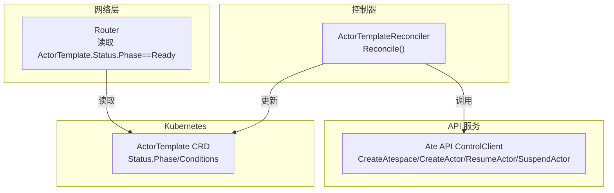
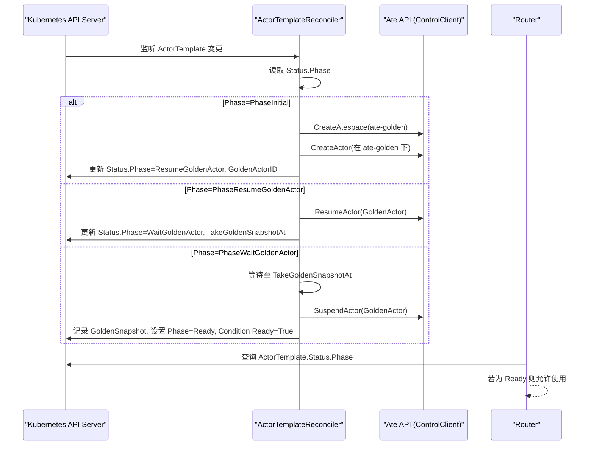
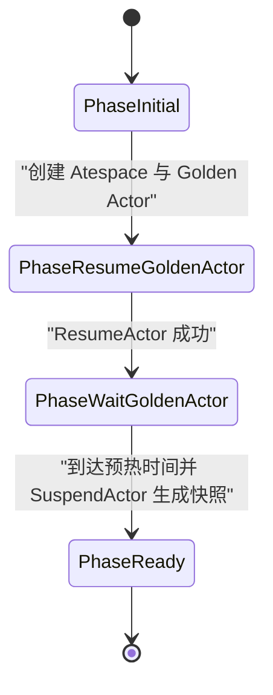
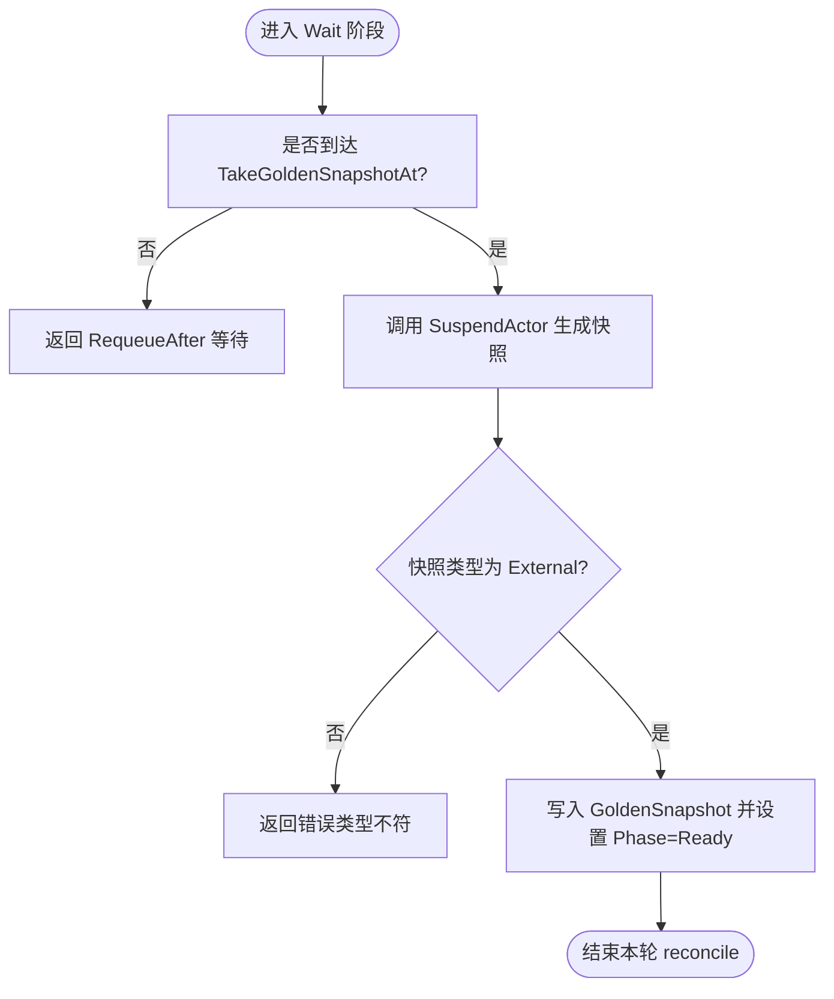
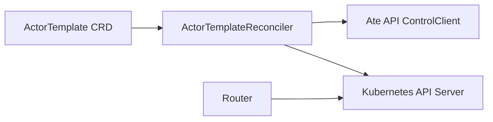

# Actor模板生命周期管理

<cite>
**本文引用的文件**   
- [actortemplate_controller.go](file://cmd/atecontroller/internal/controllers/actortemplate_controller.go)
- [actortemplate_types.go](file://pkg/api/v1alpha1/actortemplate_types.go)
- [actor.go](file://internal/resources/actor.go)
- [atstore.go](file://cmd/atenet/internal/router/atstore.go)
- [api-guide.md](file://docs/api-guide.md)
</cite>

## 目录
1. [简介](#简介)
2. [项目结构](#项目结构)
3. [核心组件](#核心组件)
4. [架构总览](#架构总览)
5. [详细组件分析](#详细组件分析)
6. [依赖关系分析](#依赖关系分析)
7. [性能考量](#性能考量)
8. [故障排查指南](#故障排查指南)
9. [结论](#结论)
10. [附录](#附录)

## 简介
本文件聚焦于 ActorTemplate 控制器的生命周期管理机制，完整阐述从 PhaseInitial 到 PhaseReady 的状态转换流程。重点包括：
- Golden Actor 的创建、恢复与快照生成过程
- 各阶段的触发条件与处理逻辑（等待机制、重试策略、错误处理）
- Golden Actor 在专用 Atespace 中的管理方式
- 快照预热时间的计算逻辑
- 状态监控与故障恢复的最佳实践

## 项目结构
ActorTemplate 控制器位于 atecontroller 组件中，负责协调 Ate API 服务完成 Golden Actor 的初始化与快照准备；类型定义位于 pkg/api/v1alpha1；Golden Actor 使用的系统级 Atespace 名称由 internal/resources 提供常量；Router 侧消费 ActorTemplate 的 Ready 状态进行调度决策。

图表来源
- [actortemplate_controller.go:66-187](file://cmd/atecontroller/internal/controllers/actortemplate_controller.go#L66-L187)
- [atstore.go:48-48](file://cmd/atenet/internal/router/atstore.go#L48-L48)

章节来源
- [actortemplate_controller.go:66-187](file://cmd/atecontroller/internal/controllers/actortemplate_controller.go#L66-L187)
- [actortemplate_types.go:21-30](file://pkg/api/v1alpha1/actortemplate_types.go#L21-L30)
- [actor.go:28-32](file://internal/resources/actor.go#L28-L32)
- [atstore.go:48-48](file://cmd/atenet/internal/router/atstore.go#L48-L48)

## 核心组件
- ActorTemplateReconciler：实现 Reconcile 主循环，按 Status.Phase 驱动状态机，调用 Ate API 完成 Golden Actor 的创建、恢复、挂起与快照收集，并更新状态。
- ActorTemplate CRD：定义 Phase 枚举、状态字段（如 GoldenActorID、TakeGoldenSnapshotAt、GoldenSnapshot）、以及 Conditions。
- Ate API 客户端：封装 CreateAtespace、CreateActor、ResumeActor、SuspendActor 等 RPC 调用。
- Router：仅当 ActorTemplate.Status.Phase == Ready 时，才认为模板可用，参与调度。

章节来源
- [actortemplate_controller.go:48-53](file://cmd/atecontroller/internal/controllers/actortemplate_controller.go#L48-L53)
- [actortemplate_types.go:21-30](file://pkg/api/v1alpha1/actortemplate_types.go#L21-L30)
- [actortemplate_types.go:343-355](file://pkg/api/v1alpha1/actortemplate_types.go#L343-L355)
- [atstore.go:48-48](file://cmd/atenet/internal/router/atstore.go#L48-L48)

## 架构总览
下图展示了从创建 ActorTemplate 到其进入 Ready 的关键交互序列。

图表来源
- [actortemplate_controller.go:81-187](file://cmd/atecontroller/internal/controllers/actortemplate_controller.go#L81-L187)
- [atstore.go:48-48](file://cmd/atenet/internal/router/atstore.go#L48-L48)

## 详细组件分析

### 状态机与阶段转换
ActorTemplate 的生命周期通过 Status.Phase 驱动，包含以下阶段：
- PhaseInitial：首次创建 Golden Actor 所在 Atespace 与 Actor，并持久化 GoldenActorID。
- PhaseResumeGoldenActor：对 Golden Actor 执行恢复（若无快照则冷启动），随后进入等待期。
- PhaseWaitGoldenActor：根据预热时间等待，到期后挂起 Golden Actor 以生成快照，并将快照 URI 前缀写入状态，最终进入 Ready。
- PhaseReady：模板就绪，可被上层使用。

图表来源
- [actortemplate_types.go:24-30](file://pkg/api/v1alpha1/actortemplate_types.go#L24-L30)
- [actortemplate_controller.go:81-187](file://cmd/atecontroller/internal/controllers/actortemplate_controller.go#L81-L187)

章节来源
- [actortemplate_types.go:24-30](file://pkg/api/v1alpha1/actortemplate_types.go#L24-L30)
- [actortemplate_controller.go:81-187](file://cmd/atecontroller/internal/controllers/actortemplate_controller.go#L81-L187)

### PhaseInitial：创建 Golden Actor
- 触发条件：ActorTemplate 首次出现且 Status.Phase 为空。
- 处理逻辑：
  - 确保系统级 Atespace（ate-golden）存在。
  - 在该 Atespace 下创建一个唯一的 Golden Actor，并记录 GoldenActorID。
  - 将 Status.Phase 推进到 PhaseResumeGoldenActor。
- 错误处理：
  - 若 Atespace 已存在，忽略 AlreadyExists 错误继续。
  - 其他错误直接返回，控制器将在下次重入时重试。
- 等待与重试：
  - 当前阶段无显式等待，失败即返回错误，由控制器框架的重试机制驱动后续重试。

章节来源
- [actortemplate_controller.go:81-117](file://cmd/atecontroller/internal/controllers/actortemplate_controller.go#L81-L117)
- [actor.go:28-32](file://internal/resources/actor.go#L28-L32)

### PhaseResumeGoldenActor：恢复 Golden Actor
- 触发条件：Status.Phase 为 PhaseResumeGoldenActor。
- 处理逻辑：
  - 调用 ResumeActor 恢复 Golden Actor（如无快照则冷启动）。
  - 计算快照预热时间 goldenSnapshotWarmupFor(at)，并设置 TakeGoldenSnapshotAt。
  - 将 Status.Phase 推进到 PhaseWaitGoldenActor。
- 错误处理：
  - 恢复失败直接返回错误，控制器会在下次重入时重试。
- 等待与重试：
  - 此阶段不等待，直接进入下一阶段。

章节来源
- [actortemplate_controller.go:119-144](file://cmd/atecontroller/internal/controllers/actortemplate_controller.go#L119-L144)

### PhaseWaitGoldenActor：等待与快照生成
- 触发条件：Status.Phase 为 PhaseWaitGoldenActor。
- 处理逻辑：
  - 若未到 TakeGoldenSnapshotAt，返回 RequeueAfter 等待。
  - 到达时间后，调用 SuspendActor 挂起 Golden Actor，从而生成最新快照。
  - 校验快照类型为外部存储（External），提取 SnapshotUriPrefix 写入 GoldenSnapshot。
  - 将 Status.Phase 推进到 PhaseReady，并设置 Ready=True 的条件。
- 错误处理：
  - 挂起或快照类型异常均返回错误，控制器会重试。
- 等待与重试：
  - 通过 RequeueAfter 精确等待至目标时间，避免忙轮询。

图表来源
- [actortemplate_controller.go:146-182](file://cmd/atecontroller/internal/controllers/actortemplate_controller.go#L146-L182)

章节来源
- [actortemplate_controller.go:146-182](file://cmd/atecontroller/internal/controllers/actortemplate_controller.go#L146-L182)

### PhaseReady：模板就绪
- 触发条件：Status.Phase 为 PhaseReady。
- 处理逻辑：
  - 不再执行任何操作，直接返回。
- 下游消费：
  - Router 仅在 Phase==Ready 时认为模板可用。

章节来源
- [actortemplate_controller.go:183-187](file://cmd/atecontroller/internal/controllers/actortemplate_controller.go#L183-L187)
- [atstore.go:48-48](file://cmd/atenet/internal/router/atstore.go#L48-L48)

### Golden Snapshot 预热时间计算
- 规则：
  - 如果模板所有容器都声明了 Readyz 探针，则预热时间为 0（跳过等待），因为 ResumeActor 已经阻塞直到工作负载报告 200。
  - 否则采用默认预热时间（约 20 秒），作为“给工作负载初始化”的安全兜底。
  - 未定义容器的模板也保持默认预热时间。
- 目的：
  - 确保在生成 Golden Snapshot 前，应用已完成必要的初始化，避免快照不完整。

章节来源
- [actortemplate_controller.go:195-210](file://cmd/atecontroller/internal/controllers/actortemplate_controller.go#L195-L210)
- [actortemplate_controller_test.go:23-84](file://cmd/atecontroller/internal/controllers/actortemplate_controller_test.go#L23-L84)
- [api-guide.md:142-142](file://docs/api-guide.md#L142-L142)

### Golden Actor 在专用 Atespace 中的管理
- 专用 Atespace：每个模板的 Golden Actor 统一运行在系统保留的 Atespace（ate-golden）中。
- 隔离性：
  - 通过固定 Atespace 名隔离不同模板的 Golden Actor，避免命名冲突。
  - 控制器在 PhaseInitial 阶段确保该 Atespace 存在。
- 资源引用：
  - GoldenActorID 用于唯一标识 Golden Actor。
  - GoldenSnapshot 保存快照的外部存储 URI 前缀，供后续恢复使用。

章节来源
- [actor.go:28-32](file://internal/resources/actor.go#L28-L32)
- [actortemplate_controller.go:86-117](file://cmd/atecontroller/internal/controllers/actortemplate_controller.go#L86-L117)
- [actortemplate_types.go:343-355](file://pkg/api/v1alpha1/actortemplate_types.go#L343-L355)

## 依赖关系分析
- 控制器依赖：
  - Kubernetes Client：获取/更新 ActorTemplate 状态。
  - Ate API ControlClient：创建/恢复/挂起 Actor 与 Atespace。
- 下游依赖：
  - Router 依赖 ActorTemplate.Status.Phase 是否为 Ready。
- 内部常量：
  - GoldenActorAtespace 常量用于固定系统 Atespace 名。

图表来源
- [actortemplate_controller.go:66-187](file://cmd/atecontroller/internal/controllers/actortemplate_controller.go#L66-L187)
- [atstore.go:48-48](file://cmd/atenet/internal/router/atstore.go#L48-L48)
- [actor.go:28-32](file://internal/resources/actor.go#L28-L32)

章节来源
- [actortemplate_controller.go:66-187](file://cmd/atecontroller/internal/controllers/actortemplate_controller.go#L66-L187)
- [atstore.go:48-48](file://cmd/atenet/internal/router/atstore.go#L48-L48)
- [actor.go:28-32](file://internal/resources/actor.go#L28-L32)

## 性能考量
- 等待机制：
  - 使用 RequeueAfter 精确等待至快照时间点，避免频繁轮询带来的 API 压力。
- 预热优化：
  - 当所有容器配置 Readyz 时，预热时间为 0，减少不必要的延迟。
- 快照大小与存储：
  - 快照 URI 前缀写入状态，便于快速定位与复用，避免重复生成。

[本节为通用指导，无需具体文件分析]

## 故障排查指南
- 常见错误路径：
  - Atespace 创建失败（非 AlreadyExists）：检查权限与后端可用性。
  - CreateActor 失败：确认模板存在且参数合法。
  - ResumeActor 失败：检查 WorkerPool 与运行时环境。
  - SuspendActor 失败或快照类型异常：检查快照存储与一致性。
- 重试策略：
  - 控制器在错误返回后会由框架自动重试；建议在业务侧保证幂等与可恢复。
- 状态观测：
  - 关注 ActorTemplate.Status.Conditions 中 Ready 条件与 Phase 值变化。
  - 观察 GoldenActorID 与 GoldenSnapshot 是否填充。

章节来源
- [actortemplate_controller.go:81-187](file://cmd/atecontroller/internal/controllers/actortemplate_controller.go#L81-L187)
- [actortemplate_types.go:343-355](file://pkg/api/v1alpha1/actortemplate_types.go#L343-L355)

## 结论
ActorTemplate 控制器通过明确的状态机与分阶段处理，实现了 Golden Actor 的可靠初始化与快照预热。借助 Readyz 探针与预热时间计算，系统在正确性与性能之间取得平衡。配合 Router 对 Ready 状态的消费，整体链路具备高可用与易观测性。

[本节为总结性内容，无需具体文件分析]

## 附录
- 关键状态字段说明：
  - Phase：当前生命周期阶段。
  - GoldenActorID：Golden Actor 的唯一标识。
  - TakeGoldenSnapshotAt：计划生成快照的时间点。
  - GoldenSnapshot：快照的外部存储 URI 前缀。
  - Conditions：Ready 条件用于对外暴露就绪状态。

章节来源
- [actortemplate_types.go:343-355](file://pkg/api/v1alpha1/actortemplate_types.go#L343-L355)
