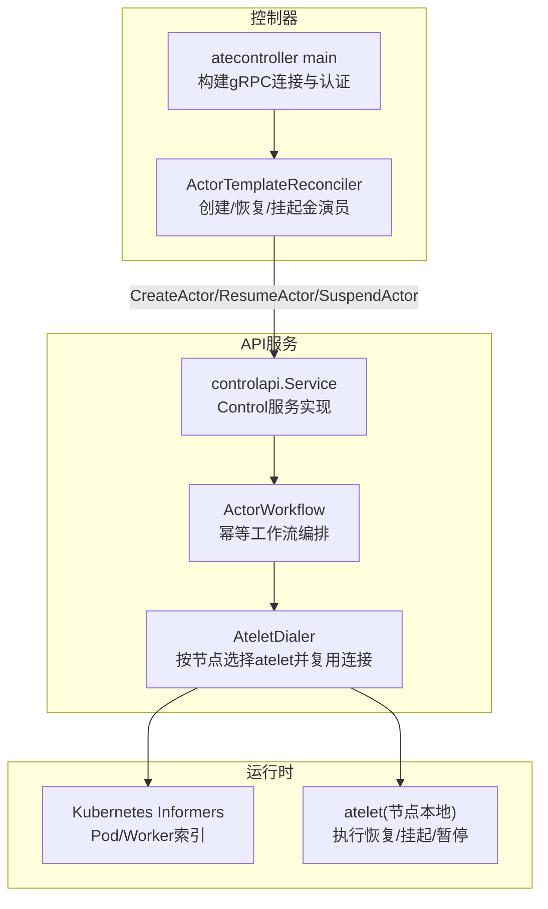
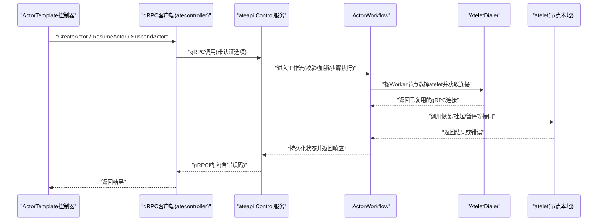
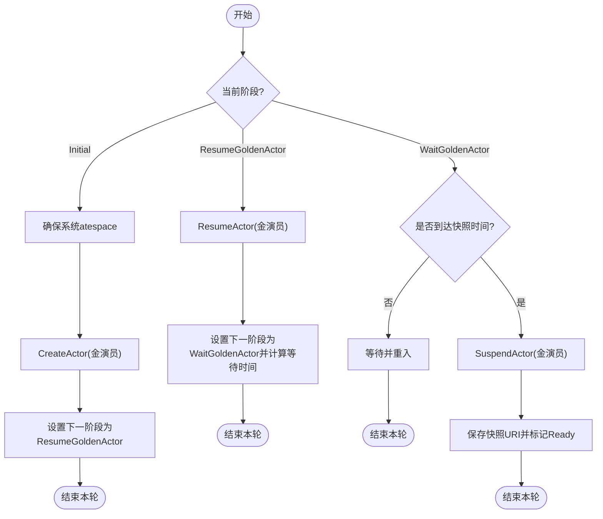
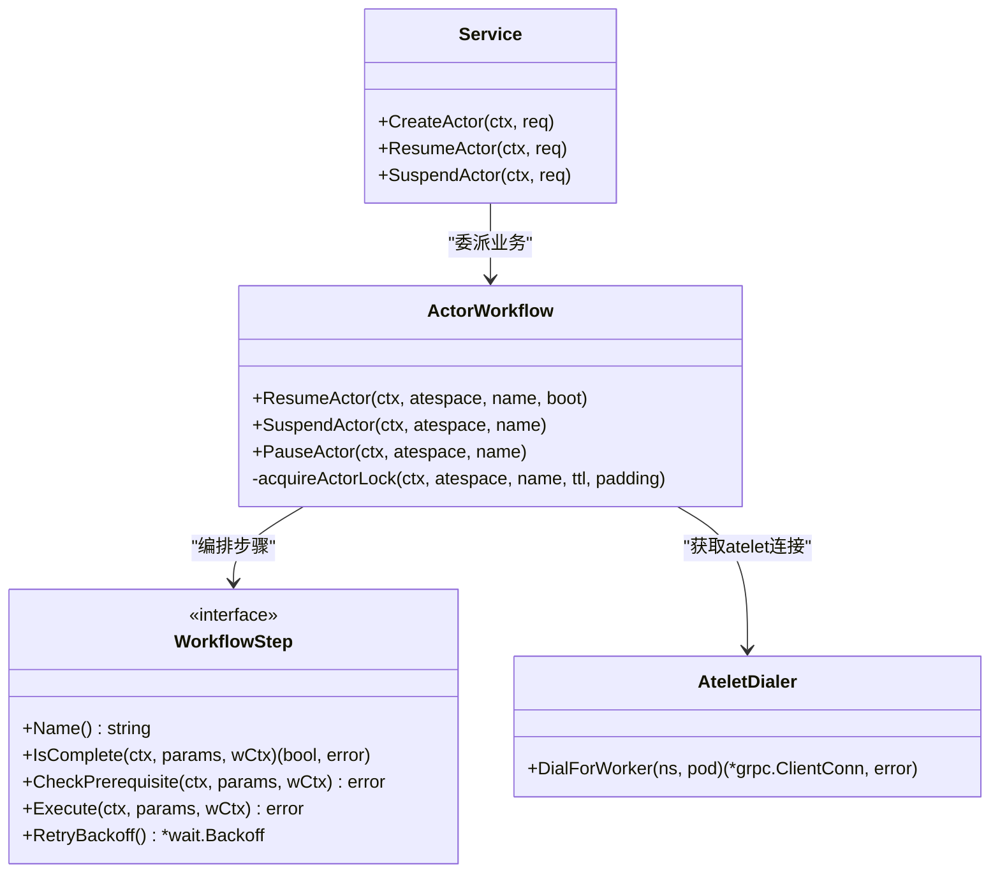
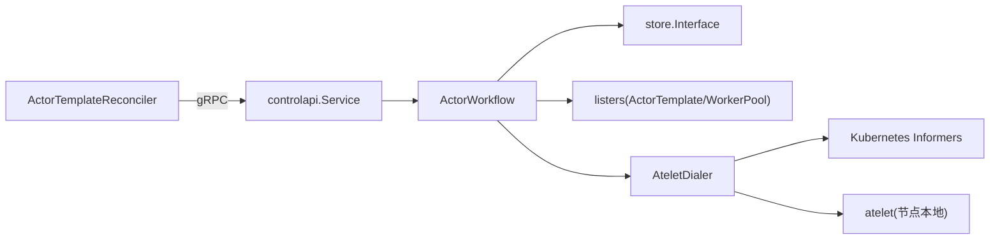

# 与ateapi服务集成

<cite>
**本文引用的文件**
- [pkg/proto/ateapipb/ateapi.proto](file://pkg/proto/ateapipb/ateapi.proto)
- [cmd/atecontroller/internal/controllers/actortemplate_controller.go](file://cmd/atecontroller/internal/controllers/actortemplate_controller.go)
- [cmd/atecontroller/main.go](file://cmd/atecontroller/main.go)
- [cmd/ateapi/internal/controlapi/service.go](file://cmd/ateapi/internal/controlapi/service.go)
- [cmd/ateapi/internal/controlapi/create_actor.go](file://cmd/ateapi/internal/controlapi/create_actor.go)
- [cmd/ateapi/internal/controlapi/resume_actor.go](file://cmd/ateapi/internal/controlapi/resume_actor.go)
- [cmd/ateapi/internal/controlapi/suspend_actor.go](file://cmd/ateapi/internal/controlapi/suspend_actor.go)
- [cmd/ateapi/internal/controlapi/workflow.go](file://cmd/ateapi/internal/controlapi/workflow.go)
- [cmd/ateapi/internal/controlapi/dialer.go](file://cmd/ateapi/internal/controlapi/dialer.go)
- [internal/ateclient/builder.go](file://internal/ateclient/builder.go)
</cite>

## 目录
1. [简介](#简介)
2. [项目结构](#项目结构)
3. [核心组件](#核心组件)
4. [架构总览](#架构总览)
5. [详细组件分析](#详细组件分析)
6. [依赖关系分析](#依赖关系分析)
7. [性能考虑](#性能考虑)
8. [故障排查指南](#故障排查指南)
9. [结论](#结论)

## 简介
本文件系统性阐述 ActorTemplate 控制器与 ateapi 服务的 gRPC 集成机制，覆盖 CreateActor、ResumeActor、SuspendActor 等 API 的调用方式与参数传递；解释请求重试、超时处理与错误码映射；说明与 ateapi 的连接管理、负载均衡与故障转移策略；并提供性能优化与监控最佳实践及常见问题诊断方案。

## 项目结构
- 协议定义位于 pkg/proto/ateapipb/ateapi.proto，定义了 Control 服务及其 RPC 方法（如 CreateActor、ResumeActor、SuspendActor）与消息模型。
- 客户端侧：
  - ActorTemplate 控制器通过 gRPC 调用 ateapi 的 Control 服务，完成“金演员”创建、恢复与挂起流程。
  - 连接建立与认证由启动参数与内部认证模块共同决定。
- 服务端侧：
  - ateapi 控制面实现位于 cmd/ateapi/internal/controlapi，包含 Service 入口、各 RPC 处理器以及 ActorWorkflow 工作流编排。
  - AteletDialer 负责按 Worker Pod 所在节点定位并复用 atelet 的 gRPC 连接。

图表来源
- [cmd/atecontroller/internal/controllers/actortemplate_controller.go:80-187](file://cmd/atecontroller/internal/controllers/actortemplate_controller.go#L80-L187)
- [cmd/atecontroller/main.go:53-80](file://cmd/atecontroller/main.go#L53-L80)
- [cmd/ateapi/internal/controlapi/service.go:25-56](file://cmd/ateapi/internal/controlapi/service.go#L25-L56)
- [cmd/ateapi/internal/controlapi/workflow.go:131-254](file://cmd/ateapi/internal/controlapi/workflow.go#L131-L254)
- [cmd/ateapi/internal/controlapi/dialer.go:31-99](file://cmd/ateapi/internal/controlapi/dialer.go#L31-L99)

章节来源
- [pkg/proto/ateapipb/ateapi.proto:26-65](file://pkg/proto/ateapipb/ateapi.proto#L26-L65)
- [cmd/atecontroller/internal/controllers/actortemplate_controller.go:80-187](file://cmd/atecontroller/internal/controllers/actortemplate_controller.go#L80-L187)
- [cmd/atecontroller/main.go:53-80](file://cmd/atecontroller/main.go#L53-L80)
- [cmd/ateapi/internal/controlapi/service.go:25-56](file://cmd/ateapi/internal/controlapi/service.go#L25-L56)
- [cmd/ateapi/internal/controlapi/workflow.go:131-254](file://cmd/ateapi/internal/controlapi/workflow.go#L131-L254)
- [cmd/ateapi/internal/controlapi/dialer.go:31-99](file://cmd/ateapi/internal/controlapi/dialer.go#L31-L99)

## 核心组件
- gRPC 协议与服务
  - Control 服务提供 Actor 生命周期相关 RPC：GetActor、CreateActor、UpdateActor、SuspendActor、PauseActor、ResumeActor、DeleteActor、ListWorkers、ListActors、Atespace 管理等。
- 控制器端（ActorTemplateReconciler）
  - 在模板初始阶段确保系统 atespace，创建“金演员”，随后恢复并在等待后挂起以生成快照，最终标记模板就绪。
- 服务端端（controlapi.Service + ActorWorkflow）
  - 对每个 RPC 进行参数校验、上下文追踪、状态持久化与工作流编排。
  - 使用可插拔步骤式工作流保证幂等性与并发安全（锁+回退）。
- 连接与路由（AteletDialer）
  - 基于 Kubernetes Informer 缓存，根据 Worker Pod 所在节点定位 atelet，LRU 复用连接，注入 OpenTelemetry 统计。

章节来源
- [pkg/proto/ateapipb/ateapi.proto:26-65](file://pkg/proto/ateapipb/ateapi.proto#L26-L65)
- [cmd/atecontroller/internal/controllers/actortemplate_controller.go:80-187](file://cmd/atecontroller/internal/controllers/actortemplate_controller.go#L80-L187)
- [cmd/ateapi/internal/controlapi/service.go:25-56](file://cmd/ateapi/internal/controlapi/service.go#L25-L56)
- [cmd/ateapi/internal/controlapi/workflow.go:131-254](file://cmd/ateapi/internal/controlapi/workflow.go#L131-L254)
- [cmd/ateapi/internal/controlapi/dialer.go:31-99](file://cmd/ateapi/internal/controlapi/dialer.go#L31-L99)

## 架构总览
下图展示了从控制器到 ateapi 再到 atelet 的端到端调用路径，包括认证、工作流编排与节点级执行。

图表来源
- [cmd/atecontroller/internal/controllers/actortemplate_controller.go:80-187](file://cmd/atecontroller/internal/controllers/actortemplate_controller.go#L80-L187)
- [cmd/atecontroller/main.go:53-80](file://cmd/atecontroller/main.go#L53-L80)
- [cmd/ateapi/internal/controlapi/service.go:25-56](file://cmd/ateapi/internal/controlapi/service.go#L25-L56)
- [cmd/ateapi/internal/controlapi/workflow.go:131-254](file://cmd/ateapi/internal/controlapi/workflow.go#L131-L254)
- [cmd/ateapi/internal/controlapi/dialer.go:31-99](file://cmd/ateapi/internal/controlapi/dialer.go#L31-L99)

## 详细组件分析

### gRPC 协议与消息模型
- Control 服务定义
  - 关键 RPC：CreateActor、ResumeActor、SuspendActor、PauseActor、DeleteActor、ListActors、ListWorkers、Atespace CRUD。
- 关键消息
  - Actor、ObjectRef、Selector、ResourceMetadata、SnapshotInfo 等用于描述资源与调度约束。
  - 分页字段 page_size/page_token/next_page_token 支持 List 系列接口。

章节来源
- [pkg/proto/ateapipb/ateapi.proto:26-65](file://pkg/proto/ateapipb/ateapi.proto#L26-L65)
- [pkg/proto/ateapipb/ateapi.proto:117-157](file://pkg/proto/ateapipb/ateapi.proto#L117-L157)
- [pkg/proto/ateapipb/ateapi.proto:166-173](file://pkg/proto/ateapipb/ateapi.proto#L166-L173)
- [pkg/proto/ateapipb/ateapi.proto:282-304](file://pkg/proto/ateapipb/ateapi.proto#L282-L304)

### 控制器端：ActorTemplate 与 ateapi 集成
- 初始化与连接
  - 通过命令行参数指定 ateapi 连接地址与认证模式（mTLS/JWT），构建 gRPC 客户端并注入控制器。
- 金演员生命周期
  - PhaseInitial：确保系统 atespace，创建金演员，记录 ID 并更新状态。
  - PhaseResumeGoldenActor：调用 ResumeActor 恢复金演员。
  - PhaseWaitGoldenActor：等待预热时间后调用 SuspendActor 生成快照，成功后标记模板 Ready。

图表来源
- [cmd/atecontroller/internal/controllers/actortemplate_controller.go:80-187](file://cmd/atecontroller/internal/controllers/actortemplate_controller.go#L80-L187)

章节来源
- [cmd/atecontroller/main.go:53-80](file://cmd/atecontroller/main.go#L53-L80)
- [cmd/atecontroller/internal/controllers/actortemplate_controller.go:80-187](file://cmd/atecontroller/internal/controllers/actortemplate_controller.go#L80-L187)

### 服务端端：RPC 处理器与工作流
- Service 层
  - 接收 gRPC 请求，进行参数校验、设置追踪属性，委派给 ActorWorkflow 执行业务逻辑。
- 工作流编排
  - 采用通用工作流框架，步骤具备幂等检查、前置条件校验、可选指数退避重试（针对持久化冲突）。
  - 通过分布式锁保证同一 Actor 的并发操作串行化，避免竞态。
- 典型流程
  - ResumeActor：加载 Actor -> 分配 Worker -> 调用 atelet 恢复 -> 最终化运行状态。
  - SuspendActor：加载 Actor -> 标记挂起中 -> 调用 atelet 挂起 -> 最终化挂起状态。

图表来源
- [cmd/ateapi/internal/controlapi/service.go:25-56](file://cmd/ateapi/internal/controlapi/service.go#L25-L56)
- [cmd/ateapi/internal/controlapi/workflow.go:36-129](file://cmd/ateapi/internal/controlapi/workflow.go#L36-L129)
- [cmd/ateapi/internal/controlapi/workflow.go:131-254](file://cmd/ateapi/internal/controlapi/workflow.go#L131-L254)
- [cmd/ateapi/internal/controlapi/dialer.go:31-99](file://cmd/ateapi/internal/controlapi/dialer.go#L31-L99)

章节来源
- [cmd/ateapi/internal/controlapi/create_actor.go:32-82](file://cmd/ateapi/internal/controlapi/create_actor.go#L32-L82)
- [cmd/ateapi/internal/controlapi/resume_actor.go:29-48](file://cmd/ateapi/internal/controlapi/resume_actor.go#L29-L48)
- [cmd/ateapi/internal/controlapi/suspend_actor.go:29-48](file://cmd/ateapi/internal/controlapi/suspend_actor.go#L29-L48)
- [cmd/ateapi/internal/controlapi/workflow.go:131-254](file://cmd/ateapi/internal/controlapi/workflow.go#L131-L254)

### 连接管理与节点内路由
- atecontroller 到 ateapi
  - 通过命令行参数配置连接目标与认证模式（mTLS/JWT），使用统一 DialOptions 构建 gRPC 客户端。
- ateapi 到 atelet
  - AteletDialer 基于 Kubernetes Informer 缓存，按 Worker Pod 所在节点选择 atelet，LRU 缓存连接，注入 OpenTelemetry 统计。

章节来源
- [cmd/atecontroller/main.go:53-80](file://cmd/atecontroller/main.go#L53-L80)
- [internal/ateclient/builder.go:253-284](file://internal/ateclient/builder.go#L253-L284)
- [cmd/ateapi/internal/controlapi/dialer.go:31-99](file://cmd/ateapi/internal/controlapi/dialer.go#L31-L99)

## 依赖关系分析
- 控制器依赖
  - 依赖 ateapipb.ControlClient 调用 ateapi 服务。
  - 依赖 Kubernetes client-go 与 controller-runtime 管理 CRD 与状态。
- ateapi 依赖
  - 依赖 store 接口进行持久化与锁管理。
  - 依赖 listers 读取 ActorTemplate/WorkerPool 等资源。
  - 依赖 AteletDialer 访问 atelet。
- atelet 依赖
  - 作为节点本地代理，执行实际的恢复/挂起/暂停等操作。

图表来源
- [cmd/atecontroller/internal/controllers/actortemplate_controller.go:80-187](file://cmd/atecontroller/internal/controllers/actortemplate_controller.go#L80-L187)
- [cmd/ateapi/internal/controlapi/service.go:25-56](file://cmd/ateapi/internal/controlapi/service.go#L25-L56)
- [cmd/ateapi/internal/controlapi/workflow.go:131-254](file://cmd/ateapi/internal/controlapi/workflow.go#L131-L254)
- [cmd/ateapi/internal/controlapi/dialer.go:31-99](file://cmd/ateapi/internal/controlapi/dialer.go#L31-L99)

章节来源
- [cmd/atecontroller/internal/controllers/actortemplate_controller.go:80-187](file://cmd/atecontroller/internal/controllers/actortemplate_controller.go#L80-L187)
- [cmd/ateapi/internal/controlapi/service.go:25-56](file://cmd/ateapi/internal/controlapi/service.go#L25-L56)
- [cmd/ateapi/internal/controlapi/workflow.go:131-254](file://cmd/ateapi/internal/controlapi/workflow.go#L131-L254)
- [cmd/ateapi/internal/controlapi/dialer.go:31-99](file://cmd/ateapi/internal/controlapi/dialer.go#L31-L99)

## 性能考虑
- 连接复用
  - AteletDialer 使用 LRU 缓存按节点复用 atelet 连接，减少握手开销。
- 幂等与快速前移
  - 工作流步骤支持 IsComplete 快速前移，避免重复执行已完成步骤。
- 并发控制
  - 通过分布式锁将同一 Actor 的操作串行化，降低竞争与数据不一致风险。
- 观测性
  - 在 atelet 连接创建时注入 OpenTelemetry 统计，便于链路追踪与指标采集。
- 建议
  - 合理设置工作流超时与锁 TTL，避免长时间占用资源。
  - 对高频 List 接口使用分页，避免单次返回过大负载。
  - 结合 Prometheus/OpenTelemetry 监控延迟、吞吐与错误率。

章节来源
- [cmd/ateapi/internal/controlapi/dialer.go:31-99](file://cmd/ateapi/internal/controlapi/dialer.go#L31-L99)
- [cmd/ateapi/internal/controlapi/workflow.go:36-129](file://cmd/ateapi/internal/controlapi/workflow.go#L36-L129)
- [cmd/ateapi/internal/controlapi/workflow.go:256-279](file://cmd/ateapi/internal/controlapi/workflow.go#L256-L279)

## 故障排查指南
- 常见错误码与语义
  - InvalidArgument：请求参数不合法（如缺失必填字段、命名不符合规范）。
  - FailedPrecondition：前置条件不满足（如 ActorTemplate 不存在、Atespace 不存在）。
  - AlreadyExists：资源已存在（如 Actor 重名）。
  - NotFound：资源未找到（如 Actor 不存在）。
  - Aborted：并发冲突或另一操作正在进行（需客户端重试）。
- 重试与超时
  - 服务端对持久化冲突（ErrPersistenceRetry）在工作流步骤内自动指数退避重试。
  - 控制器侧遇到 Aborted 应遵循幂等原则进行重试；注意工作流整体超时与锁 TTL 的关系。
- 连接问题
  - 确认 atecontroller 的 --ateapi-conn-spec 与认证模式（mtls/jwt）配置正确。
  - 检查 atelet 是否在 Worker 所在节点可用且 IP 可达。
- 日志与追踪
  - 利用 OpenTelemetry 追踪链路与 Span 信息定位失败步骤。
  - 关注工作流步骤名称与错误信息，快速定位具体环节。

章节来源
- [cmd/ateapi/internal/controlapi/create_actor.go:32-82](file://cmd/ateapi/internal/controlapi/create_actor.go#L32-L82)
- [cmd/ateapi/internal/controlapi/resume_actor.go:29-48](file://cmd/ateapi/internal/controlapi/resume_actor.go#L29-L48)
- [cmd/ateapi/internal/controlapi/suspend_actor.go:29-48](file://cmd/ateapi/internal/controlapi/suspend_actor.go#L29-L48)
- [cmd/ateapi/internal/controlapi/workflow.go:110-129](file://cmd/ateapi/internal/controlapi/workflow.go#L110-L129)
- [cmd/atecontroller/main.go:53-80](file://cmd/atecontroller/main.go#L53-L80)
- [cmd/ateapi/internal/controlapi/dialer.go:31-99](file://cmd/ateapi/internal/controlapi/dialer.go#L31-L99)

## 结论
ActorTemplate 控制器与 ateapi 服务通过标准化的 gRPC 接口协作，配合幂等工作流、分布式锁与节点内连接复用，实现了稳定高效的 Actor 生命周期管理。建议在部署与运维中重视认证配置、连接复用、观测性接入与错误码语义，以获得更好的可靠性与性能表现。
